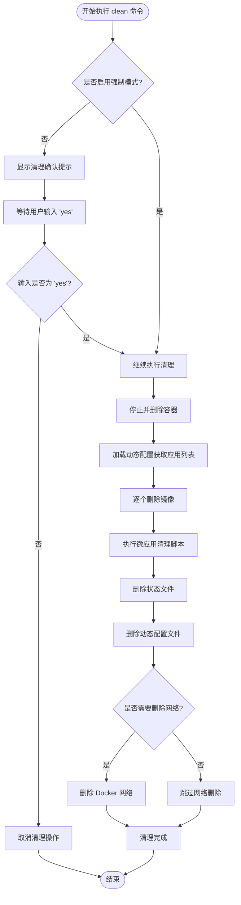
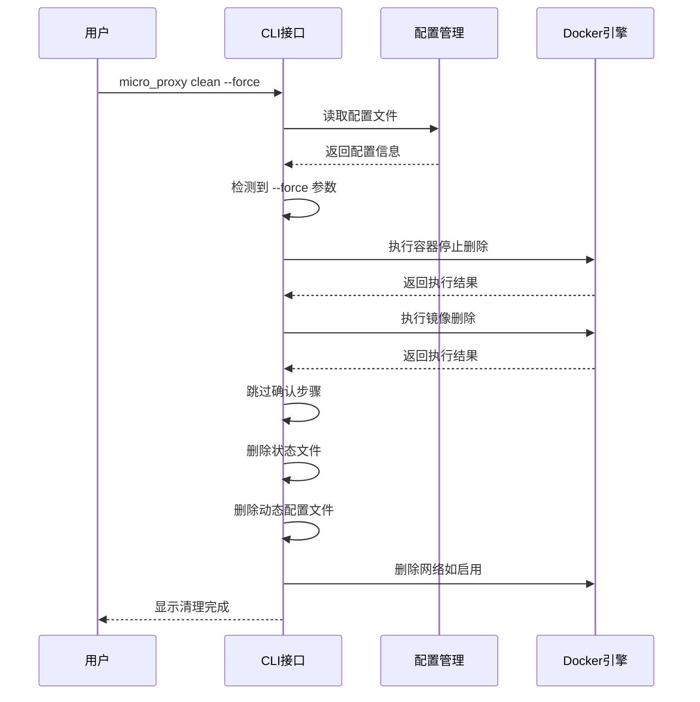
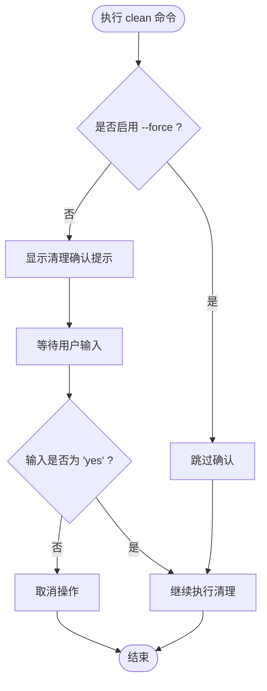
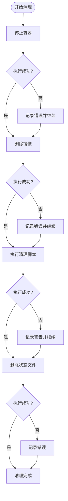

# clean 清理命令

<cite>
**本文档引用的文件**
- [src/cli.rs](file://src/cli.rs)
- [src/config.rs](file://src/config.rs)
- [src/discovery.rs](file://src/discovery.rs)
- [src/builder.rs](file://src/builder.rs)
- [src/network.rs](file://src/network.rs)
- [src/script.rs](file://src/script.rs)
- [src/state.rs](file://src/state.rs)
- [README.md](file://README.md)
- [Cargo.toml](file://Cargo.toml)
</cite>

## 目录
1. [简介](#简介)
2. [命令语法与参数](#命令语法与参数)
3. [执行流程详解](#执行流程详解)
4. [参数详解](#参数详解)
5. [强制清理模式](#强制清理模式)
6. [确认机制与安全措施](#确认机制与安全措施)
7. [清理影响与恢复](#清理影响与恢复)
8. [使用场景与最佳实践](#使用场景与最佳实践)
9. [故障排查](#故障排查)
10. [总结](#总结)

## 简介

clean 命令是 micro_proxy 提供的核心管理命令之一，用于彻底清理微应用相关的所有资源。该命令能够一次性停止并删除所有容器、删除对应的 Docker 镜像、执行微应用的清理脚本、删除状态文件和动态配置文件，并可选择性地删除 Docker 网络。

clean 命令的设计理念是提供一个"一键清理"的解决方案，确保开发者能够在需要时快速重置整个微应用环境，避免残留资源影响后续开发或测试工作。

## 命令语法与参数

### 基本语法

```bash
micro_proxy clean [选项]
```

### 命令选项

| 选项 | 简写 | 描述 | 默认值 |
|------|------|------|--------|
| `--config` | `-c` | 指定配置文件路径 | `./proxy-config.yml` |
| `--force` |  | 强制清理，不进行确认提示 | 关闭 |
| `--network` |  | 同时清理 Docker 网络 | 关闭 |
| `--verbose` | `-v` | 显示详细日志 | 关闭 |

### 命令示例

```bash
# 基本清理（需要确认）
micro_proxy clean

# 强制清理（跳过确认）
micro_proxy clean --force

# 清理并删除网络
micro_proxy clean --network

# 指定配置文件
micro_proxy clean --config /path/to/proxy-config.yml

# 强制清理并删除网络
micro_proxy clean --force --network

# 显示详细日志
micro_proxy clean -v
```

## 执行流程详解

clean 命令的执行流程遵循严格的步骤顺序，确保资源清理的完整性和一致性。



**图表来源**
- [src/cli.rs:476-548](file://src/cli.rs#L476-L548)

### 详细步骤说明

1. **确认机制检查**
   - 如果未启用强制模式，系统会显示清理确认提示
   - 用户需要输入 "yes" 来确认清理操作

2. **容器清理**
   - 使用 docker-compose down 命令停止并删除所有容器
   - 该步骤会处理 compose 配置文件中定义的所有服务

3. **镜像清理**
   - 从动态配置中获取所有应用列表
   - 逐个删除对应的应用镜像（格式：应用名:latest）

4. **清理脚本执行**
   - 扫描微应用目录发现所有微应用
   - 对每个应用执行其 clean.sh 脚本（如果存在）

5. **文件清理**
   - 删除状态文件（记录构建状态）
   - 删除动态配置文件（自动生成的应用配置）

6. **网络清理（可选）**
   - 如果启用了 --network 选项，则删除 Docker 网络
   - 否则保留网络以供后续使用

## 参数详解

### --config 参数（-c）

**功能**：指定配置文件的路径

**使用场景**：
- 多环境配置管理（开发、测试、生产）
- 自定义配置文件位置
- 多个项目共享同一工具但使用不同配置

**示例**：
```bash
micro_proxy clean --config ./config/dev-proxy-config.yml
micro_proxy clean -c ./config/prod-proxy-config.yml
```

**注意事项**：
- 配置文件必须存在且具有正确的 YAML 格式
- 配置文件中的路径字段会影响清理的具体行为

**章节来源**
- [src/cli.rs:28-30](file://src/cli.rs#L28-L30)
- [src/config.rs:125-164](file://src/config.rs#L125-L164)

### --verbose 参数（-v）

**功能**：启用详细日志输出模式

**使用场景**：
- 调试清理过程中的具体步骤
- 排查清理失败的原因
- 监控清理进度和状态

**日志级别**：
- 启用后会显示更详细的执行信息
- 包括每个步骤的执行状态和错误信息
- 有助于问题诊断和性能分析

**章节来源**
- [src/cli.rs:32-34](file://src/cli.rs#L32-L34)

### --force 参数

**功能**：强制清理模式，跳过用户确认

**使用场景**：
- 自动化脚本中执行清理
- CI/CD 流水线中的清理步骤
- 需要无人值守的批量清理

**安全考虑**：
- 该模式会跳过确认提示，直接执行清理
- 建议在了解清理影响后再使用
- 生产环境慎用

**章节来源**
- [src/cli.rs:54-56](file://src/cli.rs#L54-L56)

### --network 参数

**功能**：同时清理 Docker 网络

**使用场景**：
- 需要完全重置网络环境
- 清理后重新创建网络
- 解决网络相关的问题

**影响范围**：
- 删除指定的 Docker 网络
- 影响所有依赖该网络的容器
- 可能影响其他正在使用的容器

**章节来源**
- [src/cli.rs:57-59](file://src/cli.rs#L57-L59)

## 强制清理模式

### 工作原理

强制清理模式通过跳过用户确认环节来实现自动化清理：



**图表来源**
- [src/cli.rs:476-548](file://src/cli.rs#L476-L548)

### 风险评估

**潜在风险**：
1. **数据丢失**：容器卷中的数据可能无法恢复
2. **网络中断**：删除网络会影响其他依赖容器
3. **配置丢失**：状态文件和动态配置会被永久删除
4. **意外影响**：可能影响其他正在使用的容器

**风险缓解措施**：
- 建议在执行前备份重要数据
- 确认清理范围和影响
- 在测试环境中先行验证
- 使用 --force 时谨慎评估

## 确认机制与安全措施

### 用户确认流程



**图表来源**
- [src/cli.rs:480-497](file://src/cli.rs#L480-L497)

### 安全措施

1. **确认提示**：默认情况下要求用户明确确认
2. **错误处理**：对每个步骤的执行结果进行检查
3. **回滚机制**：部分操作支持回滚（如容器删除）
4. **日志记录**：完整的执行日志便于审计和调试

### 最佳实践

- 在生产环境中避免使用 --force 模式
- 清理前先备份重要数据
- 了解清理对其他系统的潜在影响
- 在维护窗口内执行清理操作

## 清理影响与恢复

### 清理范围

clean 命令会删除以下所有相关资源：

1. **容器层**
   - 所有微应用容器
   - 容器网络连接
   - 容器卷（如有配置）

2. **镜像层**
   - 所有应用镜像
   - 镜像层缓存

3. **配置层**
   - 状态文件
   - 动态配置文件
   - Nginx 配置
   - Docker Compose 配置

4. **网络层**
   - Docker 网络（可选）

### 恢复方法

**完全恢复步骤**：
1. 重新执行 `micro_proxy start` 命令
2. 系统会重新构建镜像和启动容器
3. 重新生成所有配置文件

**部分恢复**：
- 镜像可以通过重新构建恢复
- 配置文件可以重新生成
- 网络可以通过重新创建恢复

### 恢复时间估算

- **小项目**：几分钟到十几分钟
- **中等项目**：十几分钟到半小时
- **大型项目**：半小时以上

## 使用场景与最佳实践

### 开发环境清理

**适用场景**：
- 开发阶段频繁的环境重置
- 功能测试后的环境清理
- Bug 修复后的环境恢复

**推荐做法**：
```bash
# 开发环境清理
micro_proxy clean --force

# 清理后立即重启
micro_proxy start
```

### 测试环境清理

**适用场景**：
- 自动化测试前的环境准备
- 性能测试后的环境清理
- 压力测试后的环境恢复

**推荐做法**：
```bash
# 测试前清理
micro_proxy clean --force --network

# 测试后清理
micro_proxy clean --force
```

### 生产环境清理

**适用场景**：
- 环境迁移
- 系统升级
- 紧急故障排除

**谨慎建议**：
- 避免使用 --force 模式
- 确保有完整的备份
- 在维护窗口内执行
- 通知相关团队

### 最佳实践清单

1. **定期清理**：建立定期清理的维护计划
2. **备份策略**：清理前做好数据备份
3. **监控告警**：清理后监控系统状态
4. **文档记录**：记录每次清理的时间和原因
5. **权限控制**：限制清理命令的执行权限

## 故障排查

### 常见问题

**问题1：清理确认无法通过**
- 检查输入是否正确（必须是 "yes"）
- 确认终端编码设置
- 尝试重新执行命令

**问题2：容器删除失败**
- 检查 Docker 服务状态
- 确认 Docker 权限
- 查看 Docker 日志

**问题3：镜像删除失败**
- 检查镜像是否被其他容器使用
- 确认镜像名称格式
- 查看 Docker 镜像状态

**问题4：网络删除失败**
- 检查网络是否被其他容器使用
- 确认网络名称正确
- 查看 Docker 网络状态

### 调试方法

1. **启用详细日志**：
   ```bash
   micro_proxy clean -v
   ```

2. **检查配置文件**：
   ```bash
   micro_proxy status
   ```

3. **手动验证**：
   ```bash
   docker ps -a
   docker images
   docker network ls
   ```

### 错误处理

clean 命令实现了完善的错误处理机制：



**图表来源**
- [src/cli.rs:476-548](file://src/cli.rs#L476-L548)

## 总结

clean 命令是 micro_proxy 中最强大的清理工具，提供了完整的微应用环境清理能力。通过合理的参数配置和使用策略，可以满足不同场景下的清理需求。

**核心价值**：
- **完整性**：清理所有相关资源，确保环境完全重置
- **安全性**：提供确认机制和错误处理，降低操作风险
- **灵活性**：支持多种参数组合，适应不同使用场景
- **可观测性**：详细的日志输出，便于问题诊断

**使用建议**：
- 根据环境特点选择合适的清理策略
- 建立标准化的清理流程和备份机制
- 在生产环境中谨慎使用强制模式
- 定期评估和优化清理策略

通过合理使用 clean 命令，可以显著提高微应用开发和运维的效率，减少环境问题对开发工作的干扰。