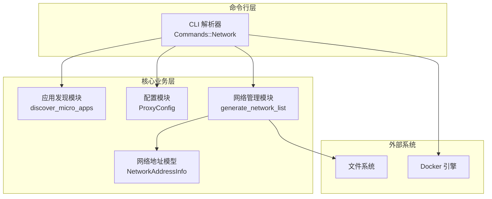
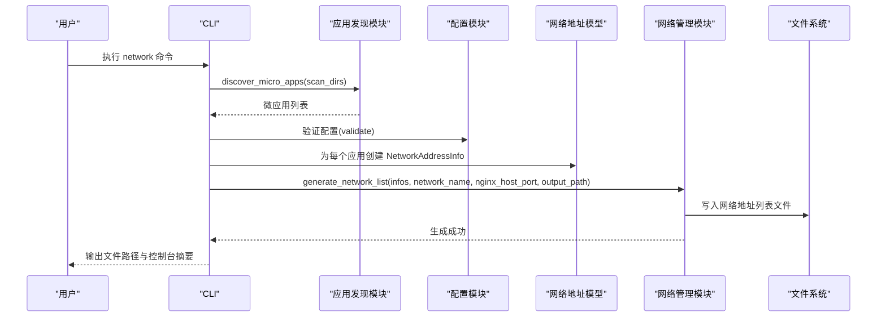
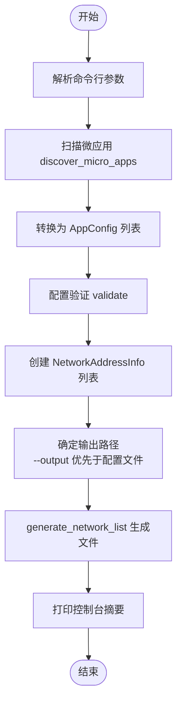
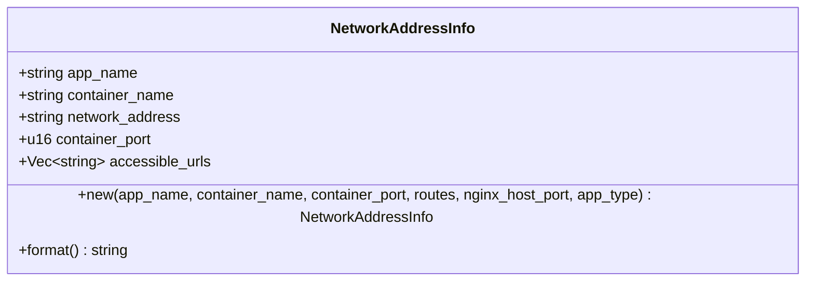
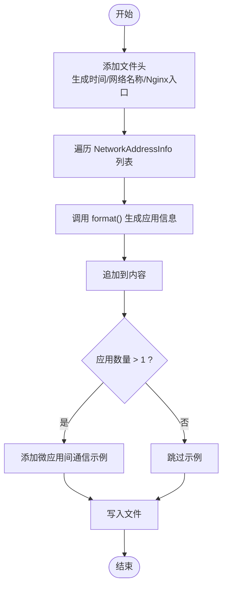
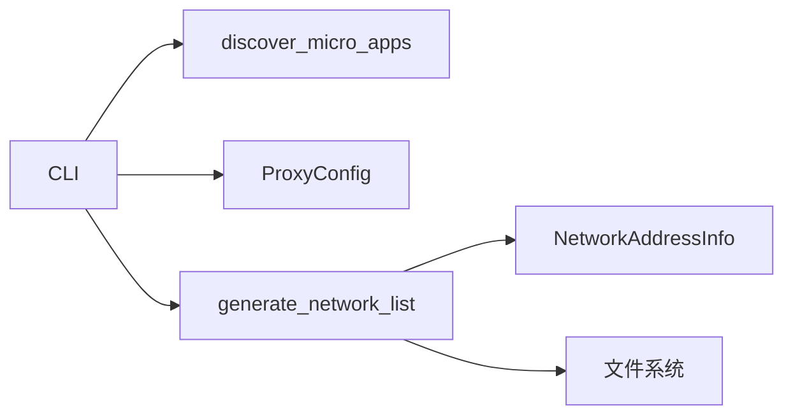

# network 网络命令

<cite>
**本文档引用的文件**
- [src/network.rs](file://src/network.rs)
- [src/cli.rs](file://src/cli.rs)
- [src/config.rs](file://src/config.rs)
- [src/discovery.rs](file://src/discovery.rs)
- [src/error.rs](file://src/error.rs)
- [src/main.rs](file://src/main.rs)
- [proxy-config.yml.example](file://proxy-config.yml.example)
</cite>

## 目录
1. [简介](#简介)
2. [项目结构](#项目结构)
3. [核心组件](#核心组件)
4. [架构总览](#架构总览)
5. [详细组件分析](#详细组件分析)
6. [依赖关系分析](#依赖关系分析)
7. [性能考虑](#性能考虑)
8. [故障排除指南](#故障排除指南)
9. [结论](#结论)
10. [附录](#附录)

## 简介
network 命令用于生成微应用的网络地址列表文件，展示微应用在 Docker 网络中的访问方式以及通过 Nginx 统一入口的可访问 URL。该命令会扫描微应用、构建网络地址信息，并将结果写入指定的输出文件，同时在控制台打印摘要信息。该命令支持通过 --config、--verbose、--output 等参数进行灵活配置。

## 项目结构
network 命令位于 CLI 层，调用网络管理模块、配置模块、应用发现模块等，最终生成网络地址列表文件。

**图表来源**
- [src/cli.rs:63-68](file://src/cli.rs#L63-L68)
- [src/discovery.rs:235-352](file://src/discovery.rs#L235-L352)
- [src/config.rs:125-164](file://src/config.rs#L125-L164)
- [src/network.rs:219-274](file://src/network.rs#L219-L274)

**章节来源**
- [src/cli.rs:63-68](file://src/cli.rs#L63-L68)
- [src/discovery.rs:235-352](file://src/discovery.rs#L235-L352)
- [src/config.rs:125-164](file://src/config.rs#L125-L164)
- [src/network.rs:219-274](file://src/network.rs#L219-L274)

## 核心组件
- CLI 子命令定义：Network 子命令包含 --output 参数，用于覆盖配置文件中的 network_list_path 设置。
- 网络地址信息模型：NetworkAddressInfo 表示单个微应用在网络中的地址信息，包含微应用名称、容器名称、网络地址、容器端口以及可访问 URL 列表。
- 网络地址列表生成：generate_network_list 负责生成网络地址列表文件，包含文件头、每个应用的详细信息以及微应用间通信示例。
- 应用发现与配置：discover_micro_apps 扫描微应用目录，to_app_configs 将发现结果转换为 AppConfig 列表；ProxyConfig 提供配置文件的读取与验证。

**章节来源**
- [src/cli.rs:63-68](file://src/cli.rs#L63-L68)
- [src/network.rs:121-207](file://src/network.rs#L121-L207)
- [src/network.rs:219-274](file://src/network.rs#L219-L274)
- [src/discovery.rs:365-374](file://src/discovery.rs#L365-L374)
- [src/config.rs:125-164](file://src/config.rs#L125-L164)

## 架构总览
network 命令的执行流程如下：
1. CLI 解析命令行参数，进入 execute_network 流程。
2. 扫描微应用目录，发现包含 micro-app.yml 的应用。
3. 将发现的应用转换为 AppConfig 列表并进行配置验证。
4. 为每个应用创建 NetworkAddressInfo。
5. 确定输出路径（优先使用 --output，否则使用配置文件中的 network_list_path）。
6. 调用 generate_network_list 生成网络地址列表文件。
7. 在控制台打印网络地址信息摘要。

**图表来源**
- [src/cli.rs:586-636](file://src/cli.rs#L586-L636)
- [src/discovery.rs:235-352](file://src/discovery.rs#L235-L352)
- [src/config.rs:220-347](file://src/config.rs#L220-L347)
- [src/network.rs:219-274](file://src/network.rs#L219-L274)

**章节来源**
- [src/cli.rs:586-636](file://src/cli.rs#L586-L636)
- [src/discovery.rs:235-352](file://src/discovery.rs#L235-L352)
- [src/config.rs:220-347](file://src/config.rs#L220-L347)
- [src/network.rs:219-274](file://src/network.rs#L219-L274)

## 详细组件分析

### CLI 子命令：Network
- 子命令定义：Commands::Network 包含 --output 参数，类型为 Option<PathBuf>，用于覆盖配置文件中的 network_list_path。
- 执行流程：execute_network 负责扫描微应用、转换配置、创建 NetworkAddressInfo、确定输出路径并生成网络地址列表文件，最后在控制台打印摘要。

**图表来源**
- [src/cli.rs:63-68](file://src/cli.rs#L63-L68)
- [src/cli.rs:586-636](file://src/cli.rs#L586-L636)

**章节来源**
- [src/cli.rs:63-68](file://src/cli.rs#L63-L68)
- [src/cli.rs:586-636](file://src/cli.rs#L586-L636)

### 网络地址信息模型：NetworkAddressInfo
- 字段说明：
  - app_name：微应用名称
  - container_name：容器名称
  - network_address：网络地址（在 Docker 网络中作为主机名）
  - container_port：容器端口
  - accessible_urls：通过 Nginx 访问的 URL 列表；对于 Internal 类型为空
- 构造逻辑：
  - network_address 默认等于 app_name
  - 对于 Static 和 Api 类型，accessible_urls 基于 routes 和 nginx_host_port 生成
  - 对于 Internal 类型，accessible_urls 为空
- 格式化输出：format 方法将字段格式化为人类可读的文本

**图表来源**
- [src/network.rs:121-207](file://src/network.rs#L121-L207)

**章节来源**
- [src/network.rs:121-207](file://src/network.rs#L121-L207)

### 网络地址列表生成：generate_network_list
- 输入参数：
  - infos：NetworkAddressInfo 列表
  - network_name：Docker 网络名称
  - nginx_host_port：Nginx 主机端口
  - output_path：输出文件路径
- 输出内容：
  - 文件头：包含生成时间、网络名称、Nginx 统一入口
  - 每个应用的详细信息：通过 NetworkAddressInfo.format 输出
  - 微应用间通信示例：当存在多个应用时，生成相互访问的示例
- 错误处理：写入文件失败时返回 Error::Network

**图表来源**
- [src/network.rs:219-274](file://src/network.rs#L219-L274)

**章节来源**
- [src/network.rs:219-274](file://src/network.rs#L219-L274)

### 应用发现与配置：discover_micro_apps 与 ProxyConfig
- discover_micro_apps：扫描 scan_dirs，发现包含 micro-app.yml 的目录，生成 MicroApp 列表并进行验证。
- to_app_configs：将 MicroApp 列表转换为 AppConfig 列表。
- ProxyConfig：提供配置文件的读取、验证与应用配置的获取方法。

**图表来源**
- [src/discovery.rs:235-352](file://src/discovery.rs#L235-L352)
- [src/discovery.rs:365-374](file://src/discovery.rs#L365-L374)
- [src/config.rs:220-347](file://src/config.rs#L220-L347)

**章节来源**
- [src/discovery.rs:235-352](file://src/discovery.rs#L235-L352)
- [src/discovery.rs:365-374](file://src/discovery.rs#L365-L374)
- [src/config.rs:220-347](file://src/config.rs#L220-L347)

## 依赖关系分析
- CLI 依赖：
  - 应用发现模块：discover_micro_apps
  - 配置模块：ProxyConfig
  - 网络管理模块：generate_network_list
  - 网络地址模型：NetworkAddressInfo
- 网络管理模块依赖：
  - 配置模块中的 AppType（用于判断 Internal 类型）
  - 文件系统（写入网络地址列表文件）

**图表来源**
- [src/cli.rs:586-636](file://src/cli.rs#L586-L636)
- [src/network.rs:219-274](file://src/network.rs#L219-L274)

**章节来源**
- [src/cli.rs:586-636](file://src/cli.rs#L586-L636)
- [src/network.rs:219-274](file://src/network.rs#L219-L274)

## 性能考虑
- 应用发现：扫描目录时会遍历文件系统，建议合理设置 scan_dirs，避免扫描大量无关目录。
- 网络地址列表生成：文件写入为一次性的磁盘 I/O 操作，性能主要受磁盘写入速度影响。
- 控制台输出：在应用较多时，格式化输出会增加 CPU 开销，但通常可忽略。

[本节为通用指导，无需特定文件来源]

## 故障排除指南
- Docker 命令不可用：network 命令依赖 Docker 引擎。若 Docker 未安装或权限不足，可能导致网络操作失败。
- 配置文件错误：ProxyConfig.validate 会对配置进行校验，如扫描目录为空、应用名称重复、Internal 应用缺少路径等，均会导致错误。
- 文件写入失败：generate_network_list 在写入网络地址列表文件时若发生错误，会返回 Error::Network。

**章节来源**
- [src/error.rs:23-24](file://src/error.rs#L23-L24)
- [src/config.rs:220-347](file://src/config.rs#L220-L347)
- [src/network.rs:267-270](file://src/network.rs#L267-L270)

## 结论
network 命令提供了快速生成微应用网络地址列表的能力，支持通过 --output 参数覆盖配置文件设置，便于在不同场景下灵活输出网络信息。结合 CLI 的详细日志与配置模块的严格校验，能够确保生成的网络地址列表准确可靠。

[本节为总结，无需特定文件来源]

## 附录

### 参数说明
- --config
  - 作用：指定配置文件路径，默认为 ./proxy-config.yml。
  - 使用方法：在执行命令时传入 --config <路径>。
  - 影响范围：影响 CLI 读取配置文件，进而影响 network 命令的 network_list_path 默认值。
- --verbose
  - 作用：启用详细日志输出。
  - 使用方法：在执行命令时传入 -v 或 --verbose。
  - 影响范围：影响日志系统的初始化与输出级别。
- --output
  - 作用：指定网络地址列表文件的输出路径，覆盖配置文件中的 network_list_path。
  - 使用方法：在执行 network 命令时传入 --output <路径>。
  - 影响范围：仅影响 network 命令的输出文件路径。

**章节来源**
- [src/cli.rs:28-34](file://src/cli.rs#L28-L34)
- [src/cli.rs:63-68](file://src/cli.rs#L63-L68)
- [src/cli.rs:586-636](file://src/cli.rs#L586-L636)

### 网络地址列表文件格式
- 文件头
  - 注释行：包含生成时间（UTC 时间）、网络名称、Nginx 统一入口（http://localhost:<nginx_host_port>）。
- 应用信息块
  - 每个应用一个信息块，包含：
    - 微应用名称
    - 容器名称
    - 网络地址
    - 容器端口
    - 访问地址（Static/Api 类型）或“无（内部服务）”（Internal 类型）
- 微应用间通信示例
  - 当存在多个应用时，生成相互访问的示例，格式为“应用A 可以通过 http://应用B网络地址:容器端口 访问 应用B”。

**章节来源**
- [src/network.rs:229-264](file://src/network.rs#L229-L264)

### 字段含义
- 微应用名称：应用的唯一标识符。
- 容器名称：Docker 容器的名称。
- 网络地址：在 Docker 网络中作为主机名使用的地址，通常与微应用名称一致。
- 容器端口：容器内部监听的端口。
- 访问地址：通过 Nginx 统一入口访问的 URL 列表；Internal 类型为空。

**章节来源**
- [src/network.rs:121-207](file://src/network.rs#L121-L207)

### 生成逻辑与应用场景
- 生成逻辑：
  - 扫描微应用目录，发现包含 micro-app.yml 的应用。
  - 将发现的应用转换为 AppConfig 列表并进行验证。
  - 为每个应用创建 NetworkAddressInfo。
  - 生成网络地址列表文件并打印控制台摘要。
- 应用场景：
  - 开发调试：快速查看各微应用的网络访问方式。
  - 文档生成：将网络地址列表作为开发文档的一部分。
  - 团队协作：共享网络地址信息以便跨团队联调。

**章节来源**
- [src/cli.rs:586-636](file://src/cli.rs#L586-L636)
- [src/discovery.rs:235-352](file://src/discovery.rs#L235-L352)
- [src/config.rs:220-347](file://src/config.rs#L220-L347)
- [src/network.rs:219-274](file://src/network.rs#L219-L274)

### 命令执行示例与输出样例
- 基本用法
  - 执行：micro_proxy network
  - 输出：在控制台打印网络地址信息摘要，并生成 network-list-path 指定的文件。
- 覆盖输出路径
  - 执行：micro_proxy network --output ./custom-network-addresses.txt
  - 输出：生成自定义路径下的网络地址列表文件。
- 指定配置文件
  - 执行：micro_proxy --config ./my-proxy-config.yml network
  - 输出：使用指定配置文件中的 network_list_path 作为默认输出路径（除非使用 --output 覆盖）。

**章节来源**
- [src/cli.rs:586-636](file://src/cli.rs#L586-L636)
- [proxy-config.yml.example:24-25](file://proxy-config.yml.example#L24-L25)

### 最佳实践与注意事项
- 合理设置 scan_dirs：避免扫描大量无关目录，提升发现效率。
- 使用 --output 覆盖默认路径：在 CI/CD 或自动化脚本中，明确指定输出路径，便于后续处理。
- Internal 应用的访问限制：Internal 类型应用不提供通过 Nginx 的可访问 URL，注意区分访问方式。
- 配置文件校验：确保配置文件中的扫描目录、应用名称、端口等配置正确，避免运行时报错。
- 权限与环境：确保 Docker 引擎可用且具有相应权限，避免网络操作失败。

**章节来源**
- [src/config.rs:220-347](file://src/config.rs#L220-L347)
- [src/network.rs:219-274](file://src/network.rs#L219-L274)
- [src/error.rs:23-24](file://src/error.rs#L23-L24)