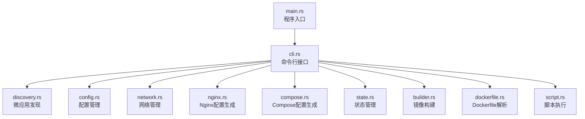
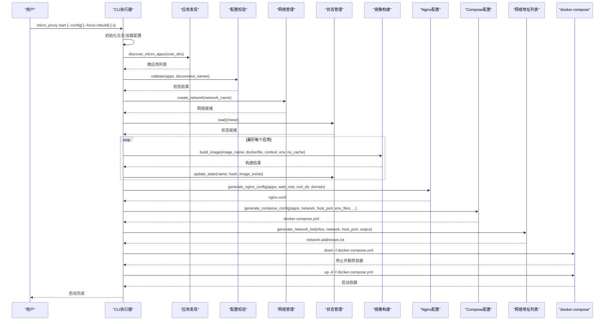
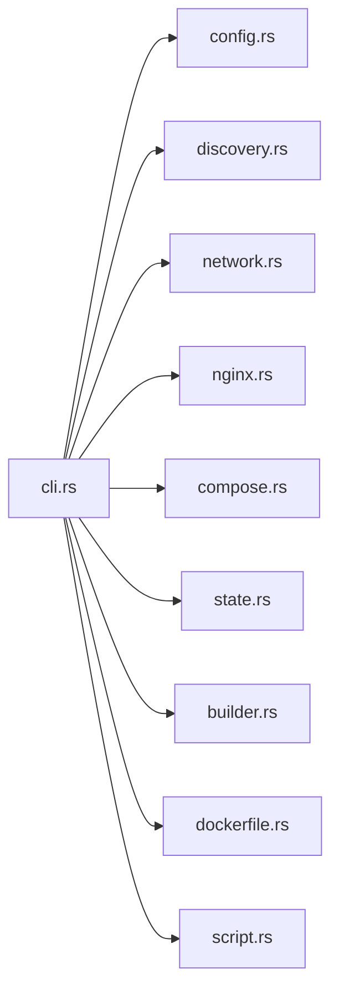
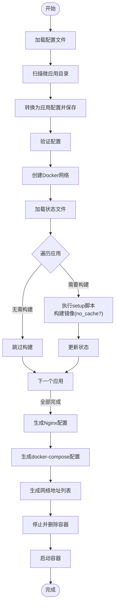

# start 启动命令

<cite>
**本文档引用的文件**
- [src/main.rs](file://src/main.rs)
- [src/cli.rs](file://src/cli.rs)
- [src/config.rs](file://src/config.rs)
- [src/discovery.rs](file://src/discovery.rs)
- [src/network.rs](file://src/network.rs)
- [src/nginx.rs](file://src/nginx.rs)
- [src/compose.rs](file://src/compose.rs)
- [src/state.rs](file://src/state.rs)
- [src/builder.rs](file://src/builder.rs)
- [src/dockerfile.rs](file://src/dockerfile.rs)
- [src/script.rs](file://src/script.rs)
- [README.md](file://README.md)
</cite>

## 目录
1. [简介](#简介)
2. [项目结构](#项目结构)
3. [核心组件](#核心组件)
4. [架构总览](#架构总览)
5. [详细组件分析](#详细组件分析)
6. [依赖关系分析](#依赖关系分析)
7. [性能考虑](#性能考虑)
8. [故障排查指南](#故障排查指南)
9. [结论](#结论)
10. [附录](#附录)

## 简介
start 启动命令用于一键启动微应用生态，涵盖微应用发现、配置验证、Docker 网络创建、镜像构建、Nginx 配置生成、docker-compose 配置生成、网络地址列表生成、容器启动等完整流程。其核心目标是让开发者通过一条命令即可完成本地开发环境的搭建与运行。

## 项目结构
micro_proxy 采用模块化设计，命令行入口位于 main.rs，核心 CLI 逻辑集中在 cli.rs，配置管理、应用发现、网络、Nginx、Compose、状态管理、镜像构建、Dockerfile 解析、脚本执行等均独立为模块，职责清晰、耦合度低。

图示来源
- [src/main.rs:1-25](file://src/main.rs#L1-L25)
- [src/cli.rs:1-669](file://src/cli.rs#L1-L669)

章节来源
- [src/main.rs:1-25](file://src/main.rs#L1-L25)
- [src/cli.rs:1-669](file://src/cli.rs#L1-L669)

## 核心组件
- 命令行接口：解析 --config、--verbose、--force-rebuild 等参数，调度执行启动流程。
- 配置管理：加载 proxy-config.yml，校验扫描目录、应用配置、端口、网络等。
- 微应用发现：扫描 scan_dirs，自动发现包含 micro-app.yml 和 Dockerfile 的微应用。
- 网络管理：创建/检查 Docker 网络，生成网络地址列表。
- Nginx 配置生成：根据应用类型与路由生成反向代理配置。
- Compose 配置生成：生成 docker-compose.yml，包含网络、服务、端口映射、卷挂载等。
- 状态管理：基于目录哈希判断是否需要重新构建，支持强制重建模式。
- 镜像构建：调用 docker build，支持 --no-cache、环境变量注入。
- Dockerfile 解析：提取 EXPOSE 端口，辅助健康检查与端口映射。
- 脚本执行：执行 setup.sh/clean.sh 预处理与清理。

章节来源
- [src/cli.rs:21-69](file://src/cli.rs#L21-L69)
- [src/config.rs:125-367](file://src/config.rs#L125-L367)
- [src/discovery.rs:224-352](file://src/discovery.rs#L224-L352)
- [src/network.rs:8-119](file://src/network.rs#L8-L119)
- [src/nginx.rs:10-92](file://src/nginx.rs#L10-L92)
- [src/compose.rs:18-119](file://src/compose.rs#L18-L119)
- [src/state.rs:40-186](file://src/state.rs#L40-L186)
- [src/builder.rs:9-120](file://src/builder.rs#L9-L120)
- [src/dockerfile.rs:16-67](file://src/dockerfile.rs#L16-L67)
- [src/script.rs:9-94](file://src/script.rs#L9-L94)

## 架构总览
start 命令的执行流程如下：

图示来源
- [src/cli.rs:296-463](file://src/cli.rs#L296-L463)
- [src/discovery.rs:224-352](file://src/discovery.rs#L224-L352)
- [src/network.rs:8-47](file://src/network.rs#L8-L47)
- [src/state.rs:58-113](file://src/state.rs#L58-L113)
- [src/builder.rs:20-120](file://src/builder.rs#L20-L120)
- [src/nginx.rs:26-92](file://src/nginx.rs#L26-L92)
- [src/compose.rs:31-119](file://src/compose.rs#L31-L119)
- [src/network.rs:209-274](file://src/network.rs#L209-L274)

## 详细组件分析

### 命令行参数与行为
- --config/-c：指定配置文件路径，默认 ./proxy-config.yml。用于加载扫描目录、网络、端口、输出路径等。
- --verbose/-v：启用详细日志输出，便于调试。
- --force-rebuild：强制重建模式，将 --no-cache 传给 docker build，确保完全重新构建镜像；同时触发所有应用的重新构建判断。

章节来源
- [src/cli.rs:21-69](file://src/cli.rs#L21-L69)
- [src/cli.rs:296-305](file://src/cli.rs#L296-L305)
- [README.md:113-124](file://README.md#L113-L124)

### 微应用发现与配置转换
- 扫描 scan_dirs，仅接受同时包含 micro-app.yml 与 Dockerfile 的目录。
- 生成唯一应用名（基于相对路径），避免重复。
- 校验 container_name 全局唯一。
- 将 MicroApp 转换为 AppConfig，写入动态配置文件，供后续流程使用。

章节来源
- [src/discovery.rs:224-352](file://src/discovery.rs#L224-L352)
- [src/discovery.rs:40-145](file://src/discovery.rs#L40-L145)
- [src/cli.rs:306-313](file://src/cli.rs#L306-L313)

### 配置验证
- 校验 scan_dirs 非空。
- 校验应用名称唯一。
- 校验 Static/Api 应用 routes 非空且存在于扫描结果。
- 校验 Internal 应用 path 存在且包含 Dockerfile，忽略其 routes 与 nginx_extra_config。
- 校验 volumes 与 run_as_user 配置（如有）。

章节来源
- [src/config.rs:220-347](file://src/config.rs#L220-L347)

### Docker 网络创建
- 若网络不存在则创建；若已存在则跳过。
- 生成网络地址列表文件，包含访问地址与微应用间通信示例。

章节来源
- [src/network.rs:8-47](file://src/network.rs#L8-L47)
- [src/network.rs:209-274](file://src/network.rs#L209-L274)

### 状态管理与强制重建
- 计算应用目录的 SHA-256 哈希，与状态文件中的记录比较，决定是否需要重新构建。
- --force-rebuild 时，no_cache=true，触发 needs_rebuild 为真，强制构建。
- 构建完成后更新状态文件。

章节来源
- [src/state.rs:188-233](file://src/state.rs#L188-L233)
- [src/state.rs:154-177](file://src/state.rs#L154-L177)
- [src/cli.rs:354-380](file://src/cli.rs#L354-L380)

### 镜像构建与环境变量注入
- 调用 docker build，支持 --no-cache、--build-arg 注入 .env 文件中的键值。
- 构建失败时输出详细错误信息。

章节来源
- [src/builder.rs:20-120](file://src/builder.rs#L20-L120)
- [src/cli.rs:366-374](file://src/cli.rs#L366-L374)

### Nginx 配置生成
- 过滤 Internal 应用，生成反向代理配置。
- 支持 HTTP/HTTPS，自动检测证书并生成 ACME 验证与重定向规则。
- 为 Static/API 应用生成 location，支持根路径与子路径重写。

章节来源
- [src/nginx.rs:26-92](file://src/nginx.rs#L26-L92)
- [src/nginx.rs:272-536](file://src/nginx.rs#L272-L536)

### docker-compose 配置生成
- 生成外部网络（使用已有网络），避免命名空间冲突。
- 生成 nginx 服务（仅依赖非 Internal 应用）与各应用服务。
- 自动挂载 nginx.conf、web_root、cert_dir；根据应用配置挂载 volumes 与 env_file。
- 根据应用类型添加健康检查。

章节来源
- [src/compose.rs:31-119](file://src/compose.rs#L31-L119)
- [src/compose.rs:160-424](file://src/compose.rs#L160-L424)

### 网络地址列表生成
- 为每个应用生成网络地址信息（容器名、端口、可访问 URL）。
- 输出到文件，便于排查连通性问题。

章节来源
- [src/network.rs:209-274](file://src/network.rs#L209-L274)
- [src/cli.rs:436-443](file://src/cli.rs#L436-L443)

### 容器启动与停止
- 先执行 docker-compose down，确保使用最新配置。
- 再执行 docker-compose up -d 启动容器。
- 兼容 docker compose 与 docker-compose 两种命令形式。

章节来源
- [src/cli.rs:448-457](file://src/cli.rs#L448-L457)
- [src/cli.rs:118-170](file://src/cli.rs#L118-L170)

## 依赖关系分析

图示来源
- [src/cli.rs:6-19](file://src/cli.rs#L6-L19)

章节来源
- [src/cli.rs:6-19](file://src/cli.rs#L6-L19)

## 性能考虑
- 状态文件基于目录哈希判断是否需要重新构建，避免不必要的镜像构建。
- --force-rebuild 会禁用构建缓存，确保一致性但会增加构建时间。
- 健康检查仅对 Static/API 应用添加，减少 Internal 应用的开销。
- 网络与配置生成一次性完成，容器启动阶段仅进行最小化变更。

## 故障排查指南
- 查看日志：使用 -v 输出详细日志，定位具体步骤。
- 端口冲突：修改 proxy-config.yml 中的 nginx_host_port。
- 权限问题：确保 web_root 与 cert_dir 目录存在且可写。
- 证书问题：确认 domain、cert_dir 下证书与密钥文件存在。
- 容器状态：使用 micro_proxy status 或 docker ps -a 检查。
- 网络连通：使用 micro_proxy network 生成网络地址列表，检查容器间通信。
- 构建失败：检查 Dockerfile 语法、EXPOSE 端口、构建上下文路径。

章节来源
- [README.md:328-419](file://README.md#L328-L419)

## 结论
start 命令通过模块化设计实现了从微应用发现到容器启动的全链路自动化，结合状态管理与强制重建模式，既保证了开发效率，又确保了配置的一致性与可追溯性。建议在开发初期使用 --force-rebuild 清理缓存，上线前关闭该选项以提升构建速度。

## 附录

### 命令与参数参考
- 基本用法
  - micro_proxy start
  - micro_proxy start --force-rebuild
  - micro_proxy start -v
  - micro_proxy start -c ./proxy-config.yml
- 参数说明
  - --config/-c：指定配置文件路径
  - --verbose/-v：显示详细日志
  - --force-rebuild：强制重建镜像（等价于 --no-cache）

章节来源
- [README.md:113-124](file://README.md#L113-L124)
- [src/cli.rs:21-69](file://src/cli.rs#L21-L69)

### 执行流程图（代码级）

图示来源
- [src/cli.rs:296-463](file://src/cli.rs#L296-L463)
- [src/discovery.rs:224-352](file://src/discovery.rs#L224-L352)
- [src/network.rs:8-47](file://src/network.rs#L8-L47)
- [src/state.rs:58-113](file://src/state.rs#L58-L113)
- [src/builder.rs:20-120](file://src/builder.rs#L20-L120)
- [src/nginx.rs:26-92](file://src/nginx.rs#L26-L92)
- [src/compose.rs:31-119](file://src/compose.rs#L31-L119)
- [src/network.rs:209-274](file://src/network.rs#L209-L274)