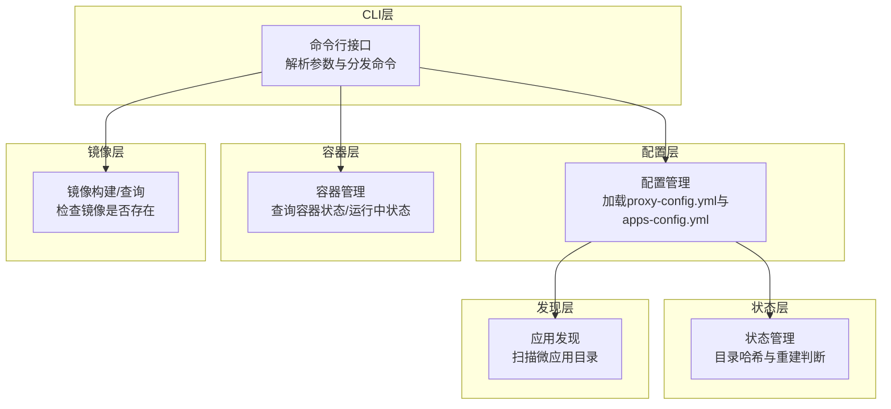
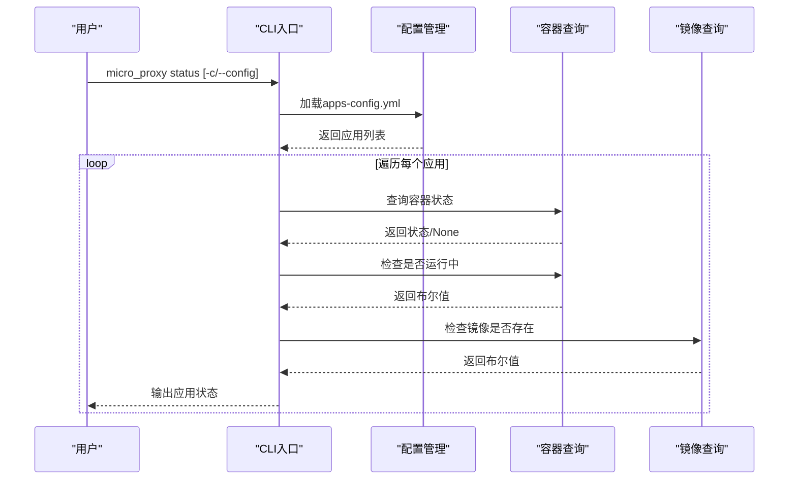
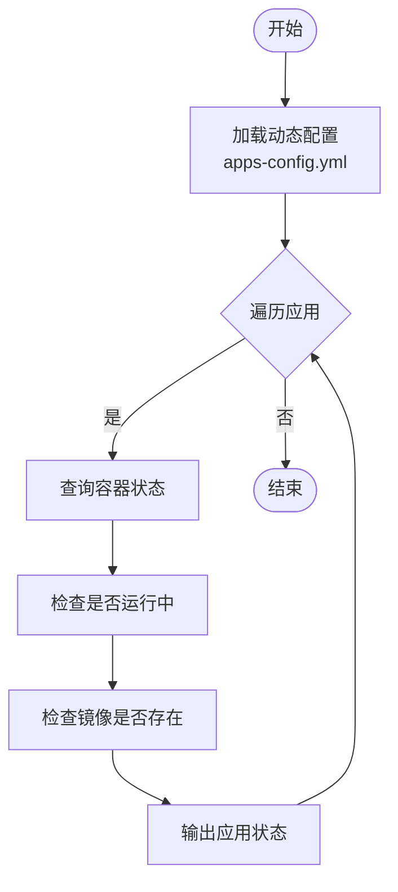
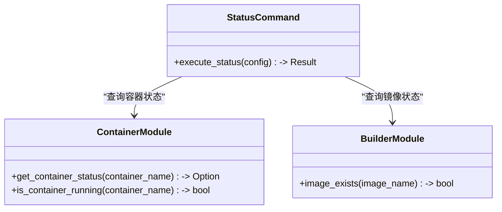
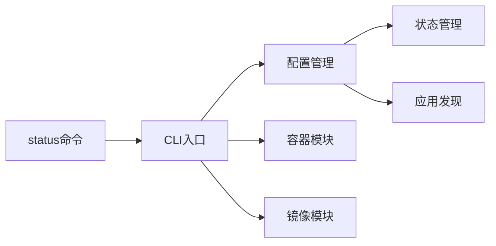

# status 状态命令

<cite>
**本文档引用的文件**
- [src/main.rs](file://src/main.rs)
- [src/cli.rs](file://src/cli.rs)
- [src/container.rs](file://src/container.rs)
- [src/builder.rs](file://src/builder.rs)
- [src/config.rs](file://src/config.rs)
- [src/state.rs](file://src/state.rs)
- [src/discovery.rs](file://src/discovery.rs)
- [README.md](file://README.md)
- [Cargo.toml](file://Cargo.toml)
</cite>

## 目录
1. [简介](#简介)
2. [项目结构](#项目结构)
3. [核心组件](#核心组件)
4. [架构总览](#架构总览)
5. [详细组件分析](#详细组件分析)
6. [依赖关系分析](#依赖关系分析)
7. [性能考量](#性能考量)
8. [故障排查指南](#故障排查指南)
9. [结论](#结论)
10. [附录](#附录)

## 简介
status 命令用于查看所有微应用的容器状态和镜像状态，帮助运维人员快速掌握微应用的运行状况。该命令会：
- 遍历动态配置文件中记录的所有微应用
- 查询每个应用对应的容器状态（存在性、运行中）
- 检查对应镜像是否存在
- 输出结构化的状态报告，便于快速定位问题

## 项目结构
micro_proxy 采用模块化设计，status 命令位于 CLI 层，通过配置管理、容器管理、镜像构建等模块协作完成状态查询。

图表来源
- [src/cli.rs:78-116](file://src/cli.rs#L78-L116)
- [src/config.rs:125-164](file://src/config.rs#L125-L164)
- [src/container.rs:178-242](file://src/container.rs#L178-L242)
- [src/builder.rs:155-180](file://src/builder.rs#L155-L180)
- [src/state.rs:40-186](file://src/state.rs#L40-L186)
- [src/discovery.rs:235-352](file://src/discovery.rs#L235-L352)

章节来源
- [src/main.rs:1-25](file://src/main.rs#L1-L25)
- [src/cli.rs:78-116](file://src/cli.rs#L78-L116)
- [src/config.rs:125-164](file://src/config.rs#L125-L164)

## 核心组件
- 命令定义与分发：status 子命令在 CLI 中定义，并在 run 分发逻辑中调用执行函数。
- 配置加载：通过 ProxyConfig 加载动态配置 apps-config.yml，获取所有微应用列表。
- 容器状态查询：使用 Docker 命令查询容器状态与运行中状态。
- 镜像状态查询：使用 Docker images 命令检查镜像是否存在。
- 输出格式：按应用维度输出容器状态与镜像状态，结构清晰、易于阅读。

章节来源
- [src/cli.rs:42-69](file://src/cli.rs#L42-L69)
- [src/cli.rs:550-584](file://src/cli.rs#L550-L584)
- [src/config.rs:205-218](file://src/config.rs#L205-L218)
- [src/container.rs:178-242](file://src/container.rs#L178-L242)
- [src/builder.rs:155-180](file://src/builder.rs#L155-L180)

## 架构总览
status 命令的执行流程如下：

图表来源
- [src/cli.rs:550-584](file://src/cli.rs#L550-L584)
- [src/config.rs:205-218](file://src/config.rs#L205-L218)
- [src/container.rs:178-242](file://src/container.rs#L178-L242)
- [src/builder.rs:155-180](file://src/builder.rs#L155-L180)

## 详细组件分析

### status 命令执行流程
- 参数解析：status 子命令在 CLI 中定义，支持配置文件路径参数。
- 配置加载：通过 ProxyConfig::load_apps 从动态配置文件加载应用列表。
- 容器状态查询：对每个应用，调用 get_container_status 获取容器状态；调用 is_container_running 判断是否运行中。
- 镜像状态查询：对每个应用，拼接镜像名（应用名:latest），调用 image_exists 检查镜像是否存在。
- 输出格式：分别输出“容器状态”和“镜像状态”，并以应用为单位分组展示。

图表来源
- [src/cli.rs:550-584](file://src/cli.rs#L550-L584)
- [src/config.rs:205-218](file://src/config.rs#L205-L218)
- [src/container.rs:178-242](file://src/container.rs#L178-L242)
- [src/builder.rs:155-180](file://src/builder.rs#L155-L180)

章节来源
- [src/cli.rs:550-584](file://src/cli.rs#L550-L584)

### 容器状态与镜像状态的含义与判断标准
- 容器状态
  - 存在性：通过 Docker ps -a 查询容器状态字段，若返回为空表示容器不存在。
  - 运行中：通过 Docker ps 查询 status=running 的容器，匹配容器名称。
- 镜像状态
  - 存在性：通过 Docker images -q 查询镜像，若输出非空则存在。

图表来源
- [src/container.rs:178-242](file://src/container.rs#L178-L242)
- [src/builder.rs:155-180](file://src/builder.rs#L155-L180)
- [src/cli.rs:550-584](file://src/cli.rs#L550-L584)

章节来源
- [src/container.rs:178-242](file://src/container.rs#L178-L242)
- [src/builder.rs:155-180](file://src/builder.rs#L155-L180)

### 输出格式与解读
- 输出分为两部分：
  - 容器状态：显示应用名、容器名、容器状态、是否运行中。
  - 镜像状态：显示镜像名（应用名:latest）与存在性。
- 解读要点：
  - 容器状态为 None 表示容器不存在，通常需要重新启动或检查配置。
  - 容器状态存在但运行中为 false，表示容器已创建但未运行，需检查启动日志。
  - 镜像不存在表示需要重新构建，可通过 start 命令触发构建。

章节来源
- [src/cli.rs:550-584](file://src/cli.rs#L550-L584)

### 实际使用示例与输出样例
- 基本用法
  - micro_proxy status
  - micro_proxy status -c ./proxy-config.yml
- 输出样例（示意）
  - 容器状态部分
    - 应用: my-app (Static)
    - 容器: my-app-container
    - 状态: Up 2 hours
    - 运行中: true
  - 镜像状态部分
    - 镜像: my-app:latest - 存在
- 注意：具体输出以实际环境为准，建议结合 README 的命令说明进行对照。

章节来源
- [README.md:145-153](file://README.md#L145-L153)

### 状态异常排查思路
- 容器不存在
  - 检查 apps-config.yml 中的 container_name 是否正确
  - 使用 docker ps -a 查看容器是否存在
  - 通过 start 命令重新构建并启动
- 容器存在但未运行
  - 查看容器日志：docker logs <container-name>
  - 检查端口占用与网络配置
  - 使用 docker inspect 查看容器详细信息
- 镜像不存在
  - 通过 start 命令触发镜像构建
  - 检查 Dockerfile 是否存在且合法
  - 确认构建上下文路径正确

章节来源
- [README.md:353-361](file://README.md#L353-L361)
- [src/cli.rs:550-584](file://src/cli.rs#L550-L584)

### 状态监控最佳实践与注意事项
- 定期巡检：使用 status 命令定期检查容器与镜像状态，及时发现异常。
- 结合日志：容器状态异常时，配合 docker logs 与 docker inspect 排查。
- 配置一致性：确保 apps-config.yml 与实际部署一致，避免容器名重复等问题。
- 性能注意：status 命令会多次调用 Docker 命令，建议在低频场景使用，避免频繁轮询。

章节来源
- [README.md:353-361](file://README.md#L353-L361)
- [src/cli.rs:550-584](file://src/cli.rs#L550-L584)

## 依赖关系分析
status 命令的依赖关系如下：

图表来源
- [src/cli.rs:78-116](file://src/cli.rs#L78-L116)
- [src/config.rs:125-164](file://src/config.rs#L125-L164)
- [src/container.rs:178-242](file://src/container.rs#L178-L242)
- [src/builder.rs:155-180](file://src/builder.rs#L155-L180)
- [src/state.rs:40-186](file://src/state.rs#L40-L186)
- [src/discovery.rs:235-352](file://src/discovery.rs#L235-L352)

章节来源
- [src/cli.rs:78-116](file://src/cli.rs#L78-L116)
- [src/config.rs:125-164](file://src/config.rs#L125-L164)

## 性能考量
- 命令调用次数：status 命令对每个应用会调用容器查询与镜像查询，应用数量较多时会有一定开销。
- Docker 命令执行：每次查询都会触发外部进程调用，建议合理安排巡检频率。
- 输出渲染：逐应用输出，I/O 成本较低，适合本地与 CI 场景。

## 故障排查指南
- 权限问题
  - 确保运行用户具有执行 docker 命令的权限。
- Docker 服务状态
  - 确认 Docker 服务正常运行，否则容器与镜像查询会失败。
- 配置文件路径
  - 使用 -c/--config 指定正确的配置文件路径，避免加载错误配置。
- 网络与端口
  - 若容器已启动但无法访问，检查端口映射与防火墙设置。

章节来源
- [README.md:353-361](file://README.md#L353-L361)
- [src/cli.rs:550-584](file://src/cli.rs#L550-L584)

## 结论
status 命令提供了简洁高效的微应用状态查看能力，通过容器状态与镜像状态的双维度检查，能够快速定位部署问题。建议在日常运维中将其纳入巡检流程，并结合日志与 docker inspect 进行深入排查。

## 附录
- 命令参考
  - micro_proxy status [-c/--config <path>]
- 相关命令
  - micro_proxy start：启动微应用并构建镜像
  - micro_proxy network：查看网络地址列表，辅助连通性排查

章节来源
- [README.md:145-153](file://README.md#L145-L153)
- [src/cli.rs:42-69](file://src/cli.rs#L42-L69)