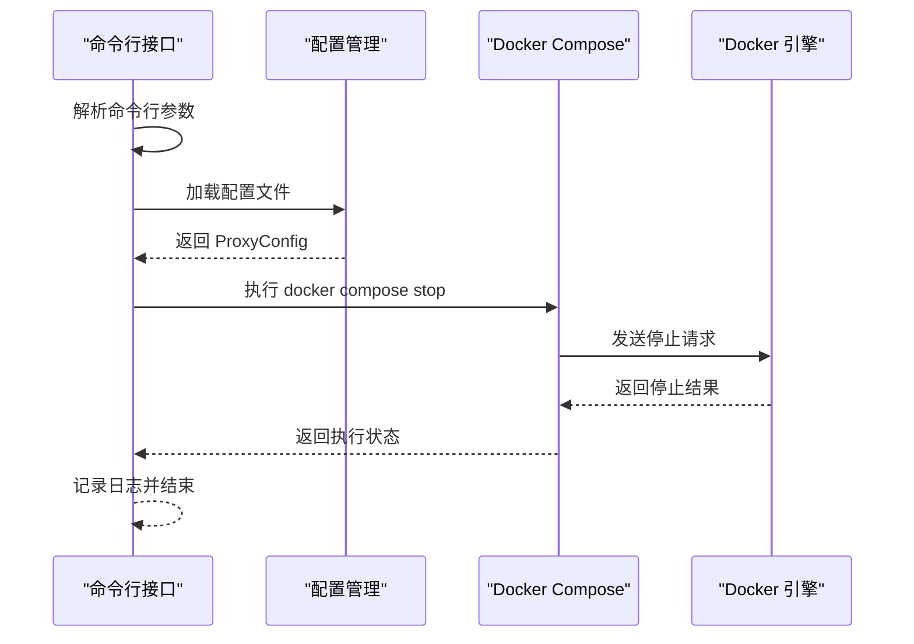
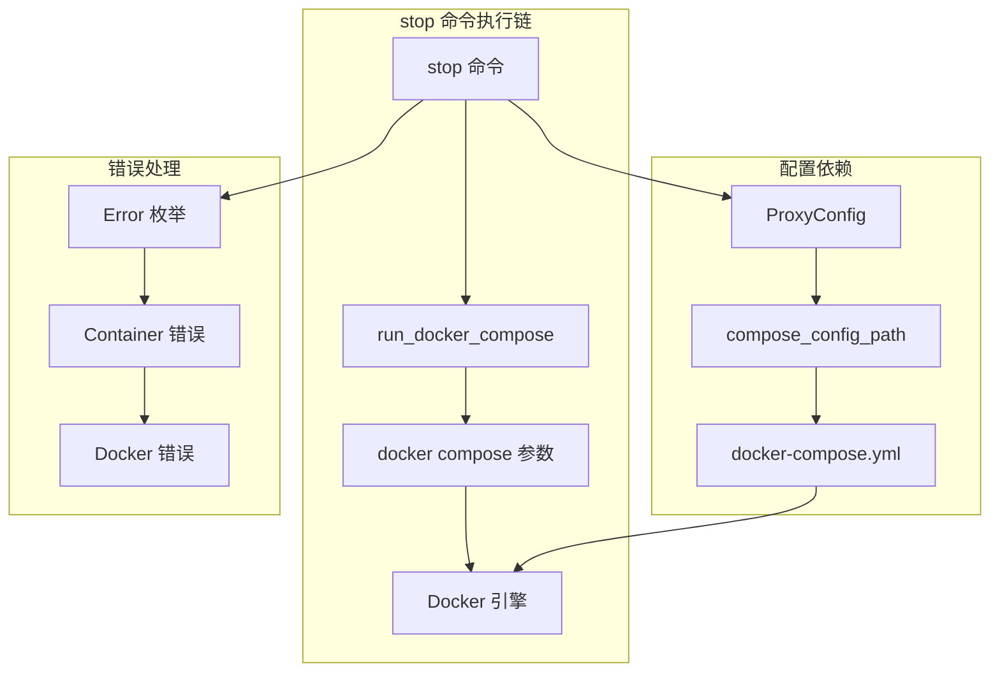
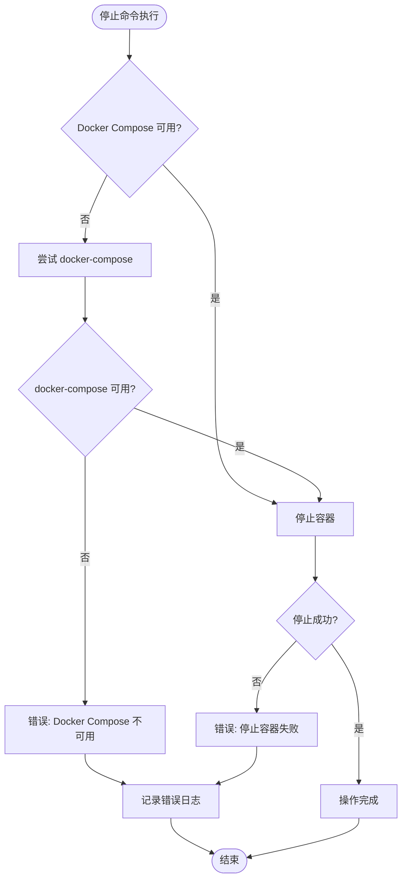
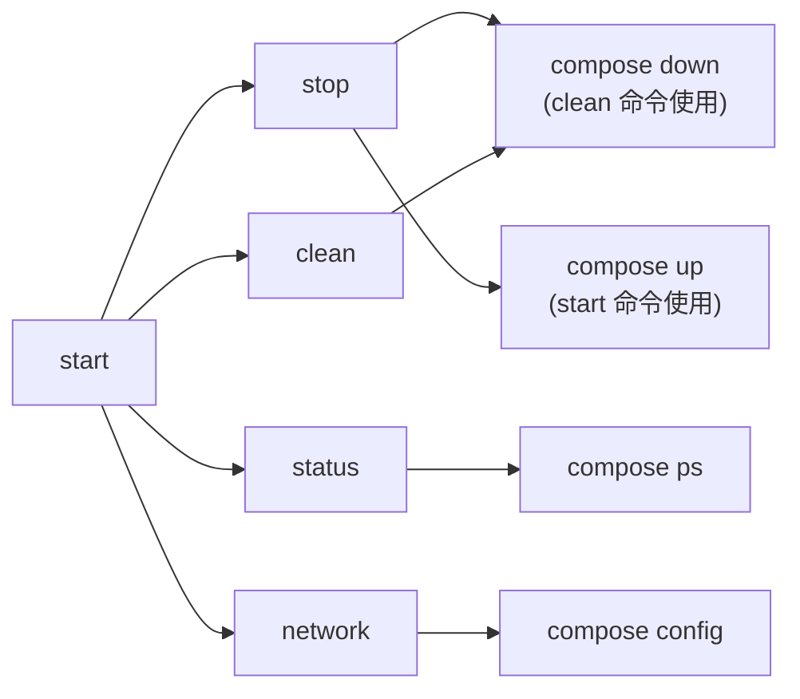
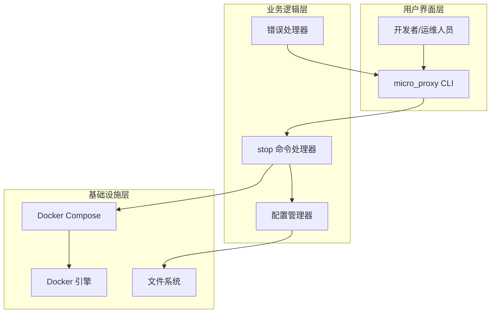
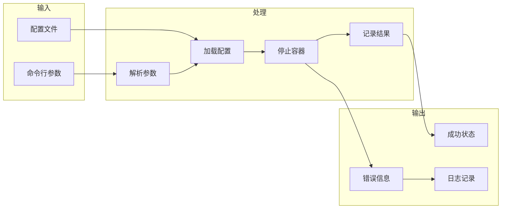

# stop 停止命令

<cite>
**本文档引用的文件**
- [src/main.rs](file://src/main.rs)
- [src/cli.rs](file://src/cli.rs)
- [src/container.rs](file://src/container.rs)
- [src/compose.rs](file://src/compose.rs)
- [src/config.rs](file://src/config.rs)
- [src/error.rs](file://src/error.rs)
- [README.md](file://README.md)
- [Cargo.toml](file://Cargo.toml)
</cite>

## 目录
1. [简介](#简介)
2. [命令概述](#命令概述)
3. [执行流程](#执行流程)
4. [依赖关系分析](#依赖关系分析)
5. [使用示例](#使用示例)
6. [错误处理与故障排查](#错误处理与故障排查)
7. [与其他命令的关系](#与其他命令的关系)
8. [使用场景与最佳实践](#使用场景与最佳实践)
9. [架构图](#架构图)
10. [结论](#结论)

## 简介

micro_proxy 的 stop 命令用于停止所有微应用的容器实例。该命令通过调用 Docker Compose 来停止所有已启动的微应用容器，是微应用生命周期管理的重要组成部分。

## 命令概述

### 基本语法
```bash
micro_proxy stop [options]
```

### 命令选项
- `-c, --config <path>`: 指定配置文件路径（默认：./proxy-config.yml）

### 功能说明
stop 命令的核心功能是停止所有通过 micro_proxy 管理的微应用容器实例，包括：
- Nginx 反向代理容器
- 所有静态应用容器
- 所有 API 服务容器
- 所有内部服务容器

## 执行流程

### 命令解析与初始化
stop 命令的执行流程如下：



**图表来源**
- [src/cli.rs:465-474](file://src/cli.rs#L465-L474)
- [src/cli.rs:127-170](file://src/cli.rs#L127-L170)

### 详细执行步骤

1. **配置加载**
   - 从指定路径加载 proxy-config.yml 配置文件
   - 验证配置文件的有效性

2. **Docker Compose 停止**
   - 使用 `docker compose stop` 命令停止所有容器
   - 命令格式：`docker compose -f <compose_config_path> stop`

3. **日志记录**
   - 记录停止操作的开始和结束
   - 记录任何相关的警告信息

**章节来源**
- [src/cli.rs:465-474](file://src/cli.rs#L465-L474)
- [src/cli.rs:127-170](file://src/cli.rs#L127-L170)

## 依赖关系分析

### 核心依赖组件



**图表来源**
- [src/cli.rs:465-474](file://src/cli.rs#L465-L474)
- [src/cli.rs:127-170](file://src/cli.rs#L127-L170)
- [src/config.rs:125-164](file://src/config.rs#L125-L164)
- [src/error.rs:5-46](file://src/error.rs#L5-L46)

### 关键依赖关系

1. **配置文件依赖**
   - 依赖 `compose_config_path` 指定的 docker-compose.yml 文件
   - 该文件由 micro_proxy 在启动时生成

2. **Docker Compose 版本兼容性**
   - 支持新版本 `docker compose` 和旧版本 `docker-compose`
   - 自动检测和降级处理

3. **错误处理机制**
   - 统一的 Error 枚举类型
   - Container 错误专门处理 Docker 相关问题

**章节来源**
- [src/config.rs:125-164](file://src/config.rs#L125-L164)
- [src/error.rs:5-46](file://src/error.rs#L5-L46)

## 使用示例

### 基本使用
```bash
# 停止所有微应用
micro_proxy stop

# 指定配置文件路径
micro_proxy stop -c ./custom-config.yml
```

### 高级使用场景

#### 开发环境调试
```bash
# 停止后立即查看状态
micro_proxy stop && micro_proxy status
```

#### 批量操作
```bash
# 停止并清理（结合其他命令）
micro_proxy stop
micro_proxy status
```

### 预期输出
正常情况下，stop 命令会输出类似以下的日志：
```
INFO micro_proxy v0.4.0 启动
INFO 停止所有微应用...
INFO 所有微应用已停止
```

## 错误处理与故障排查

### 常见错误类型



**图表来源**
- [src/cli.rs:127-170](file://src/cli.rs#L127-L170)

### 错误分类与处理

1. **Docker Compose 不可用**
   - 现象：找不到 docker compose 或 docker-compose 命令
   - 处理：自动尝试另一个版本，若都不可用则报错

2. **容器停止失败**
   - 现象：docker compose stop 命令执行失败
   - 处理：记录错误并返回错误状态

3. **容器不存在**
   - 现象：某些容器可能已经停止或不存在
   - 处理：忽略此类情况，继续执行其他容器的停止操作

### 故障排查步骤

1. **检查 Docker 服务状态**
   ```bash
   docker ps
   ```

2. **验证配置文件**
   ```bash
   micro_proxy status
   ```

3. **查看详细日志**
   ```bash
   micro_proxy stop -v
   ```

**章节来源**
- [src/cli.rs:127-170](file://src/cli.rs#L127-L170)
- [src/error.rs:5-46](file://src/error.rs#L5-L46)

## 与其他命令的关系

### 命令间依赖关系



**图表来源**
- [src/cli.rs:97-113](file://src/cli.rs#L97-L113)
- [src/cli.rs:465-474](file://src/cli.rs#L465-L474)

### 使用时机建议

1. **开发阶段**
   - 开发过程中频繁使用 stop 命令进行容器管理
   - 结合 status 命令监控容器状态

2. **部署阶段**
   - 部署前使用 stop 命令停止旧版本容器
   - 部署后使用 start 命令启动新版本容器

3. **维护阶段**
   - 定期使用 stop 命令停止不需要的容器
   - 使用 clean 命令清理不再使用的资源

### 命令组合使用

```bash
# 停止并查看状态
micro_proxy stop && micro_proxy status

# 停止并清理
micro_proxy stop
micro_proxy clean --force

# 停止并重新启动
micro_proxy stop
micro_proxy start
```

**章节来源**
- [src/cli.rs:97-113](file://src/cli.rs#L97-L113)

## 使用场景与最佳实践

### 推荐使用方法

1. **日常开发**
   - 使用 `micro_proxy stop` 停止开发中的容器
   - 使用 `micro_proxy status` 验证停止状态

2. **批量管理**
   - 在 CI/CD 流程中使用 stop 命令清理测试环境
   - 在部署前停止旧版本容器

3. **故障恢复**
   - 当容器出现问题时，使用 stop 命令停止容器
   - 结合 clean 命令进行彻底清理

### 注意事项

1. **配置文件路径**
   - 确保使用正确的配置文件路径
   - 配置文件必须包含有效的 compose_config_path

2. **权限要求**
   - 需要 Docker 服务的访问权限
   - 可能需要 sudo 权限

3. **容器状态**
   - 停止命令不会删除容器，只会停止运行
   - 如需删除容器，使用 clean 命令

4. **网络影响**
   - 停止容器不会影响 Docker 网络
   - 网络仍然保持连接状态

### 最佳实践建议

1. **定期维护**
   - 建立定期停止和清理的维护计划
   - 监控容器资源使用情况

2. **备份策略**
   - 在重要操作前备份配置文件
   - 使用版本控制系统管理配置

3. **监控告警**
   - 设置容器状态监控
   - 建立异常告警机制

## 架构图

### 系统架构视图



**图表来源**
- [src/main.rs:6-24](file://src/main.rs#L6-L24)
- [src/cli.rs:78-116](file://src/cli.rs#L78-L116)
- [src/config.rs:125-164](file://src/config.rs#L125-L164)

### 数据流图



**图表来源**
- [src/main.rs:6-24](file://src/main.rs#L6-L24)
- [src/cli.rs:78-116](file://src/cli.rs#L78-L116)

## 结论

stop 命令是 micro_proxy 工具箱中的重要组件，提供了简单而强大的容器停止功能。通过与 Docker Compose 的紧密集成，它能够可靠地停止所有微应用容器实例，为微应用的生命周期管理提供了完整的解决方案。

### 关键特性总结

1. **简洁易用**：单命令即可停止所有容器
2. **版本兼容**：自动适配新旧版本的 Docker Compose
3. **错误处理**：完善的错误检测和处理机制
4. **日志记录**：详细的执行过程记录
5. **配置驱动**：基于配置文件的灵活管理

### 未来发展方向

随着 micro_proxy 的持续发展，stop 命令可能会增加更多高级功能，如：
- 支持选择性停止特定容器
- 提供更细粒度的停止控制
- 增强与 Kubernetes 等容器编排系统的集成