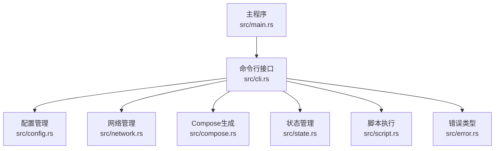
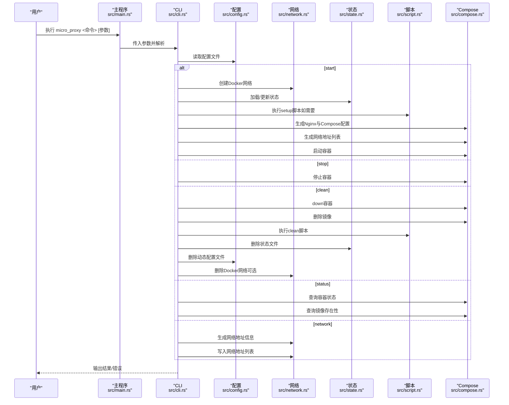
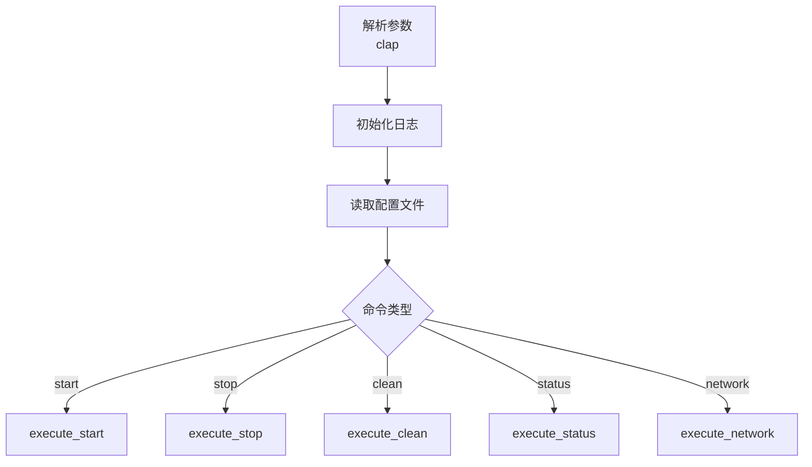
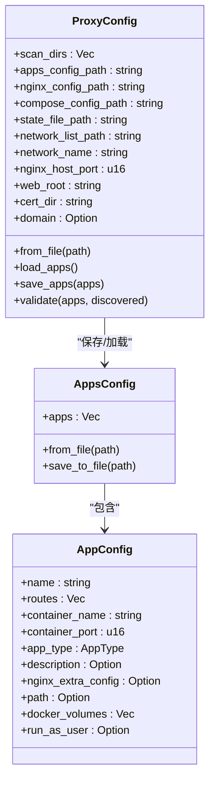
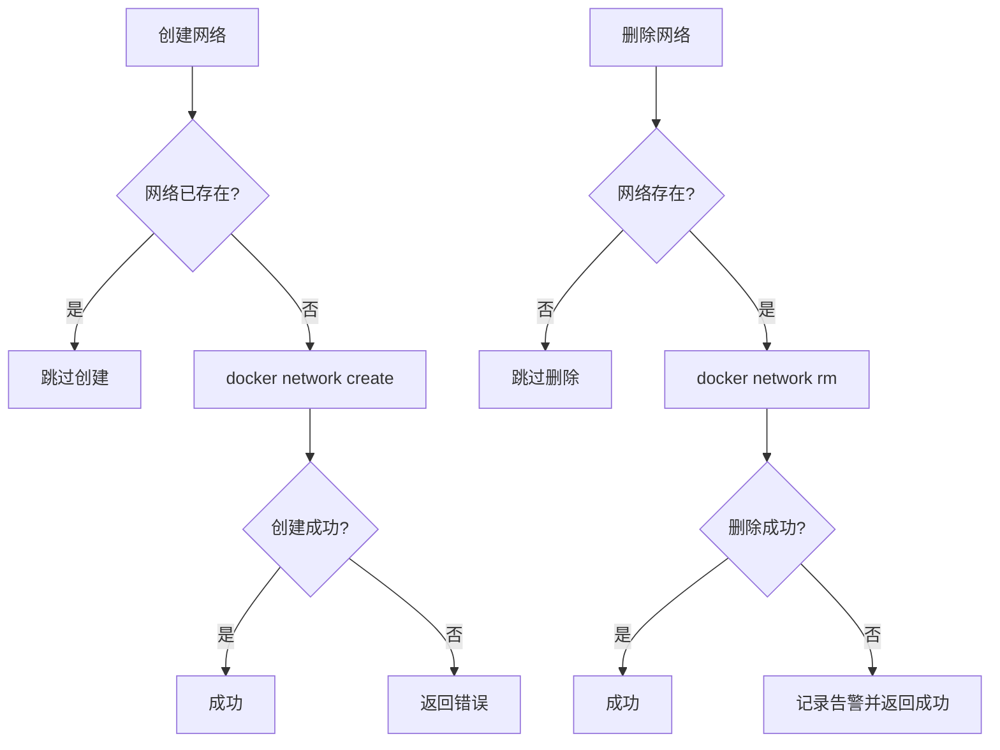
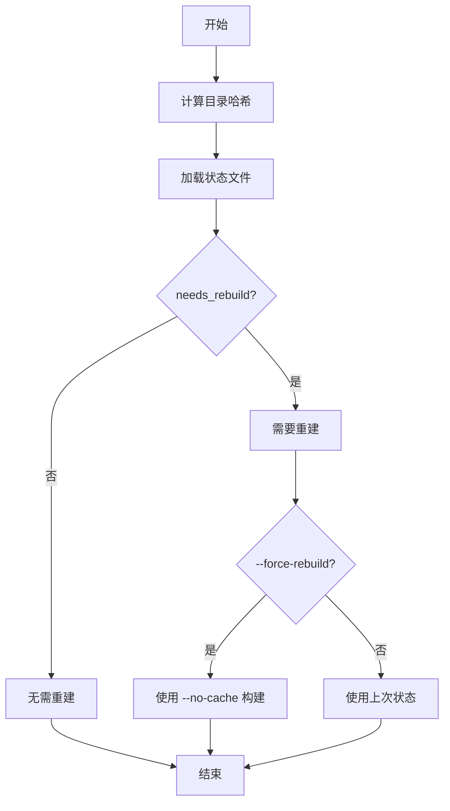
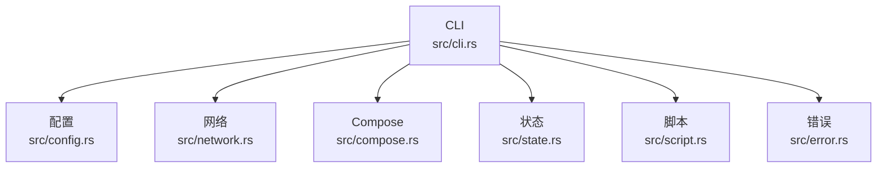

# 命令参考

<cite>
**本文引用的文件**
- [src/main.rs](file://src/main.rs)
- [src/cli.rs](file://src/cli.rs)
- [src/config.rs](file://src/config.rs)
- [src/network.rs](file://src/network.rs)
- [src/compose.rs](file://src/compose.rs)
- [src/state.rs](file://src/state.rs)
- [src/script.rs](file://src/script.rs)
- [src/error.rs](file://src/error.rs)
- [Cargo.toml](file://Cargo.toml)
- [README.md](file://README.md)
- [proxy-config.yml.example](file://proxy-config.yml.example)
</cite>

## 目录
1. [简介](#简介)
2. [项目结构](#项目结构)
3. [核心命令](#核心命令)
4. [架构总览](#架构总览)
5. [详细组件分析](#详细组件分析)
6. [依赖关系分析](#依赖关系分析)
7. [性能考量](#性能考量)
8. [故障排查指南](#故障排查指南)
9. [结论](#结论)
10. [附录](#附录)

## 简介
本文件为 micro_proxy 的命令参考文档，面向使用者与维护者，系统性说明所有命令的功能、参数、执行流程、依赖条件、预期结果、错误处理与返回码、参数优先级与覆盖规则，并提供最佳实践与常见用法模式。micro_proxy 通过命令行接口驱动微应用的发现、构建、容器编排、Nginx 反代与网络管理，核心命令包括：start、stop、clean、status、network。

## 项目结构
micro_proxy 的命令行入口位于主程序，命令解析与执行逻辑集中在 CLI 模块；配置、网络、Compose、状态与脚本等模块分别承担相应职责。整体调用链路自上而下为：main → CLI → 各命令执行函数 → 子模块（配置、网络、Compose、状态、脚本等）。

**图表来源**
- [src/main.rs:1-25](file://src/main.rs#L1-L25)
- [src/cli.rs:78-116](file://src/cli.rs#L78-L116)
- [src/config.rs:125-203](file://src/config.rs#L125-L203)
- [src/network.rs:8-47](file://src/network.rs#L8-L47)
- [src/compose.rs:31-119](file://src/compose.rs#L31-L119)
- [src/state.rs:40-113](file://src/state.rs#L40-L113)
- [src/script.rs:9-62](file://src/script.rs#L9-L62)
- [src/error.rs:6-46](file://src/error.rs#L6-L46)

**章节来源**
- [src/main.rs:1-25](file://src/main.rs#L1-L25)
- [src/cli.rs:78-116](file://src/cli.rs#L78-L116)

## 核心命令
本节逐条说明五个核心命令：start、stop、clean、status、network。每个命令均包含用途、参数、执行流程、依赖条件、预期结果、错误处理与返回码、参数优先级与覆盖规则、使用示例与最佳实践。

### start 命令
- 用途：启动所有微应用。自动扫描微应用、生成动态配置、校验配置、创建 Docker 网络、基于目录哈希判断是否需要重建、执行 setup 脚本、构建镜像、生成 Nginx 与 Compose 配置、生成网络地址列表、保存状态、停止并删除旧容器、启动新容器。
- 关键参数：
  - --config/-c：指定配置文件路径（默认 ./proxy-config.yml）
  - --force-rebuild：强制重建所有镜像（等价于构建时使用 no-cache）
  - -v/--verbose：显示详细日志
- 执行流程要点：
  - 扫描目录发现微应用，转换为 AppConfig 并保存动态配置
  - 校验配置有效性（名称唯一、Static/API 路由非空、Internal 路径与 Dockerfile 存在等）
  - 创建 Docker 网络
  - 逐应用：
    - 解析 Dockerfile（若无 EXPOSE 提示）
    - 计算目录哈希，结合 force-rebuild 判断是否需要重建
    - 若需要重建：执行 setup 脚本、构建镜像（--no-cache 由 force-rebuild 控制）、更新状态
    - 收集 .env 相对路径（用于 Compose）
    - 生成网络地址信息
  - 生成 Nginx 配置与 Compose 配置
  - 生成网络地址列表
  - 保存状态
  - down 旧容器（忽略失败）
  - up 新容器
- 依赖条件：
  - Docker 与 docker-compose（新旧两种命令形式均兼容）
  - 配置文件存在且可读
  - 扫描目录中存在符合要求的微应用（包含 micro-app.yml 与 Dockerfile）
- 预期结果：
  - 所有应用容器运行中，Nginx 统一入口可用
  - 生成并保存动态配置、Compose、Nginx、网络地址列表与状态文件
- 错误处理与返回码：
  - CLI 层捕获错误并打印“错误: ...”，随后以非零退出码退出
  - 子模块错误类型详见错误类型定义
- 参数优先级与覆盖规则：
  - --force-rebuild 会强制构建，覆盖目录哈希判断
  - -v/--verbose 仅影响日志级别，不影响业务逻辑
- 使用示例与最佳实践：
  - 常用：micro_proxy start
  - 强制重建：micro_proxy start --force-rebuild
  - 指定配置：micro_proxy start -c ./custom.yml
  - 调试：micro_proxy start -v
  - 推荐：首次启动或变更 Dockerfile/源码后使用 --force-rebuild

**章节来源**
- [src/cli.rs:98-463](file://src/cli.rs#L98-L463)
- [src/cli.rs:127-170](file://src/cli.rs#L127-L170)
- [src/cli.rs:296-463](file://src/cli.rs#L296-L463)
- [src/network.rs:8-47](file://src/network.rs#L8-L47)
- [src/compose.rs:31-119](file://src/compose.rs#L31-L119)
- [src/state.rs:162-177](file://src/state.rs#L162-L177)
- [src/script.rs:72-78](file://src/script.rs#L72-L78)
- [src/error.rs:6-46](file://src/error.rs#L6-L46)
- [README.md:115-124](file://README.md#L115-L124)

### stop 命令
- 用途：停止所有微应用容器
- 关键参数：
  - --config/-c：指定配置文件路径（默认 ./proxy-config.yml）
  - -v/--verbose：显示详细日志
- 执行流程要点：
  - 使用 docker compose stop 停止容器
- 依赖条件：
  - Docker 与 docker-compose 可用
  - 存在有效的 Compose 配置文件
- 预期结果：
  - 所有应用容器处于停止状态
- 错误处理与返回码：
  - CLI 层捕获错误并以非零退出码退出
- 参数优先级与覆盖规则：
  - -v/--verbose 仅影响日志级别
- 使用示例与最佳实践：
  - micro_proxy stop
  - 指定配置：micro_proxy stop -c ./custom.yml

**章节来源**
- [src/cli.rs:101-474](file://src/cli.rs#L101-L474)
- [src/cli.rs:465-474](file://src/cli.rs#L465-L474)
- [README.md:125-133](file://README.md#L125-L133)

### clean 命令
- 用途：清理所有微应用。默认交互确认，可强制跳过确认；可选择同时清理 Docker 网络
- 关键参数：
  - --config/-c：指定配置文件路径（默认 ./proxy-config.yml）
  - --force：强制清理，不询问确认
  - --network：同时清理 Docker 网络
  - -v/--verbose：显示详细日志
- 执行流程要点：
  - 若非强制：提示并等待用户输入“yes”确认
  - down 容器
  - 读取动态配置，逐应用删除镜像
  - 扫描微应用并执行 clean.sh（如有）
  - 删除状态文件与动态配置文件
  - 若指定 --network：删除 Docker 网络
- 依赖条件：
  - Docker 与 docker-compose 可用
  - 存在有效的动态配置与 Compose 配置
- 预期结果：
  - 容器、镜像、状态文件、动态配置文件清理完毕；可选删除 Docker 网络
- 错误处理与返回码：
  - CLI 层捕获错误并以非零退出码退出
  - clean.sh 执行失败仅记录告警，不中断清理流程
- 参数优先级与覆盖规则：
  - --force 覆盖交互确认
  - --network 仅在显式指定时生效
- 使用示例与最佳实践：
  - 一般清理：micro_proxy clean
  - 强制清理：micro_proxy clean --force
  - 同时清理网络：micro_proxy clean --force --network
  - 指定配置：micro_proxy clean -c ./custom.yml

**章节来源**
- [src/cli.rs:104-548](file://src/cli.rs#L104-L548)
- [src/cli.rs:476-548](file://src/cli.rs#L476-L548)
- [src/network.rs:56-86](file://src/network.rs#L56-L86)
- [src/script.rs:88-94](file://src/script.rs#L88-L94)
- [README.md:134-144](file://README.md#L134-L144)

### status 命令
- 用途：查看微应用状态与镜像存在性
- 关键参数：
  - --config/-c：指定配置文件路径（默认 ./proxy-config.yml）
  - -v/--verbose：显示详细日志
- 执行流程要点：
  - 读取动态配置
  - 查询每个容器的状态与运行中标志
  - 查询每个镜像是否存在
- 依赖条件：
  - 存在有效的动态配置
- 预期结果：
  - 输出每个应用的容器名、状态、运行中标志与镜像存在性
- 错误处理与返回码：
  - CLI 层捕获错误并以非零退出码退出
- 参数优先级与覆盖规则：
  - -v/--verbose 仅影响日志级别
- 使用示例与最佳实践：
  - micro_proxy status
  - 指定配置：micro_proxy status -c ./custom.yml

**章节来源**
- [src/cli.rs:107-584](file://src/cli.rs#L107-L584)
- [src/cli.rs:550-584](file://src/cli.rs#L550-L584)
- [README.md:145-153](file://README.md#L145-L153)

### network 命令
- 用途：生成并打印网络地址列表，支持覆盖输出路径
- 关键参数：
  - --config/-c：指定配置文件路径（默认 ./proxy-config.yml）
  - --output/-o：指定输出文件路径（覆盖配置文件中的设置）
  - -v/--verbose：显示详细日志
- 执行流程要点：
  - 扫描微应用、转换为 AppConfig、校验配置
  - 逐应用生成网络地址信息（Static/API 生成可访问 URL，Internal 为空）
  - 生成网络地址列表至指定输出（默认或 -o 指定）
  - 控制台打印网络地址信息
- 依赖条件：
  - 存在有效的扫描目录与微应用配置
- 预期结果：
  - 生成网络地址列表文件并打印到控制台
- 错误处理与返回码：
  - CLI 层捕获错误并以非零退出码退出
- 参数优先级与覆盖规则：
  - --output 覆盖配置文件中的 network_list_path
- 使用示例与最佳实践：
  - micro_proxy network
  - 指定输出：micro_proxy network -o ./addresses.txt
  - 指定配置：micro_proxy network -c ./custom.yml

**章节来源**
- [src/cli.rs:110-636](file://src/cli.rs#L110-L636)
- [src/cli.rs:586-636](file://src/cli.rs#L586-L636)
- [src/network.rs:121-200](file://src/network.rs#L121-L200)
- [README.md:154-163](file://README.md#L154-L163)

## 架构总览
下图展示命令执行的关键交互与模块依赖：

**图表来源**
- [src/main.rs:6-24](file://src/main.rs#L6-L24)
- [src/cli.rs:78-116](file://src/cli.rs#L78-L116)
- [src/config.rs:178-203](file://src/config.rs#L178-L203)
- [src/network.rs:8-47](file://src/network.rs#L8-L47)
- [src/compose.rs:31-119](file://src/compose.rs#L31-L119)
- [src/state.rs:62-89](file://src/state.rs#L62-L89)
- [src/script.rs:72-94](file://src/script.rs#L72-L94)

## 详细组件分析

### 命令解析与执行（CLI）
- 参数解析：使用 clap 定义命令与选项，支持短长选项与子命令分发
- 日志初始化：dumbo_log 初始化日志文件与控制台输出
- 子命令分发：根据命令类型调用对应执行函数
- Docker Compose 兼容：优先尝试 docker compose，失败回退 docker-compose

**图表来源**
- [src/cli.rs:78-116](file://src/cli.rs#L78-L116)
- [src/cli.rs:127-170](file://src/cli.rs#L127-L170)

**章节来源**
- [src/cli.rs:22-69](file://src/cli.rs#L22-L69)
- [src/cli.rs:78-116](file://src/cli.rs#L78-L116)
- [src/cli.rs:127-170](file://src/cli.rs#L127-L170)

### 配置管理（ProxyConfig/AppsConfig）
- ProxyConfig：主配置结构，包含扫描目录、文件路径、网络名、端口、证书与域名等
- AppsConfig：动态生成的应用配置集合，保存与加载
- 校验规则：扫描目录非空、应用名唯一、Static/API 路由非空、Internal 路径与 Dockerfile 存在等

**图表来源**
- [src/config.rs:125-203](file://src/config.rs#L125-L203)
- [src/config.rs:70-123](file://src/config.rs#L70-L123)
- [src/config.rs:23-68](file://src/config.rs#L23-L68)

**章节来源**
- [src/config.rs:125-367](file://src/config.rs#L125-L367)

### 网络管理（Docker 网络）
- 创建网络：若不存在则创建，存在则跳过
- 删除网络：若存在则删除，不存在则忽略
- 检查网络：通过 docker network ls 过滤匹配

**图表来源**
- [src/network.rs:8-47](file://src/network.rs#L8-L47)
- [src/network.rs:56-86](file://src/network.rs#L56-L86)
- [src/network.rs:88-119](file://src/network.rs#L88-L119)

**章节来源**
- [src/network.rs:8-119](file://src/network.rs#L8-L119)

### 状态管理（目录哈希与重建策略）
- 目录哈希：对应用目录内容进行 SHA256 计算
- 重建判断：当前哈希与状态文件中记录的哈希不一致或无记录则需要重建
- 强制重建：--force-rebuild 使 no-cache 生效，覆盖哈希判断

**图表来源**
- [src/state.rs:162-177](file://src/state.rs#L162-L177)
- [src/state.rs:195-200](file://src/state.rs#L195-L200)

**章节来源**
- [src/state.rs:162-177](file://src/state.rs#L162-L177)
- [src/state.rs:195-200](file://src/state.rs#L195-L200)

### 脚本执行（setup/clean）
- setup：在构建前执行，用于准备构建环境
- clean：在清理阶段执行，用于清理构建产物或临时文件
- 执行方式：bash 脚本，失败返回错误但不影响后续流程（clean 命令中仅告警）

**章节来源**
- [src/script.rs:72-94](file://src/script.rs#L72-L94)

### 错误类型与返回码
- 错误类型：配置、IO、YAML、Docker、脚本、网络、发现、构建、容器、状态、Dockerfile、Nginx、Compose 等
- 返回码：CLI 层捕获错误并打印“错误: ...”，随后以非零退出码退出；成功返回 0

**章节来源**
- [src/error.rs:6-46](file://src/error.rs#L6-L46)
- [src/cli.rs:12-23](file://src/cli.rs#L12-L23)

## 依赖关系分析
- 外部依赖：Docker、docker-compose（新旧两种命令形式）、bash（脚本执行）
- 内部模块耦合：CLI 依赖配置、网络、Compose、状态、脚本模块；各模块职责清晰、低耦合
- 参数优先级：命令行参数优先于配置文件；--force-rebuild 优先于哈希判断；--output 优先于配置文件中的 network_list_path

**图表来源**
- [src/cli.rs:6-19](file://src/cli.rs#L6-L19)
- [src/config.rs:6-18](file://src/config.rs#L6-L18)
- [src/network.rs:5-6](file://src/network.rs#L5-L6)
- [src/compose.rs:6](file://src/compose.rs#L6)
- [src/state.rs:5-11](file://src/state.rs#L5-L11)
- [src/script.rs:5-7](file://src/script.rs#L5-L7)
- [src/error.rs:3](file://src/error.rs#L3)

**章节来源**
- [Cargo.toml:13-51](file://Cargo.toml#L13-L51)

## 性能考量
- 目录哈希计算：仅在需要重建时触发，避免不必要的构建
- Compose/Nginx 生成：按需生成，减少重复 IO
- 网络管理：存在性检查避免重复创建
- 建议：在频繁迭代开发时使用 --force-rebuild 确保镜像最新；生产环境建议保留状态文件以复用构建缓存

## 故障排查指南
- 查看日志：使用 -v/--verbose 输出详细日志
- 查看状态：micro_proxy status 检查容器与镜像状态
- 查看网络地址：micro_proxy network 生成并打印网络地址列表
- 端口冲突：修改 proxy-config.yml 中的 nginx_host_port
- 权限问题：确保 web_root 与 cert_dir 目录存在且可写
- Docker 可用性：确认 docker 与 docker-compose 命令可用

**章节来源**
- [README.md:330-351](file://README.md#L330-L351)
- [README.md:353-372](file://README.md#L353-L372)
- [README.md:374-401](file://README.md#L374-L401)

## 结论
micro_proxy 通过清晰的命令体系与模块化设计，实现了微应用的自动化发现、构建、编排与运维。start、stop、clean、status、network 五个命令覆盖了日常开发与运维的主要场景。遵循本文档的参数优先级、错误处理与最佳实践，可显著提升使用效率与稳定性。

## 附录
- 配置文件示例：proxy-config.yml.example
- 常用命令示例与输出样例：见 README.md 命令说明章节

**章节来源**
- [proxy-config.yml.example:1-53](file://proxy-config.yml.example#L1-L53)
- [README.md:113-163](file://README.md#L113-L163)