# Dockerfile 开发

<cite>
**本文档引用的文件**
- [dockerfile.rs](file://src/dockerfile.rs)
- [builder.rs](file://src/builder.rs)
- [discovery.rs](file://src/discovery.rs)
- [micro_app_config.rs](file://src/micro_app_config.rs)
- [lib.rs](file://src/lib.rs)
- [README.md](file://README.md)
- [micro-app-development.md](file://docs/micro-app-development.md)
- [proxy-config.yml.example](file://proxy-config.yml.example)
- [Cargo.toml](file://Cargo.toml)
</cite>

## 目录
1. [简介](#简介)
2. [项目结构](#项目结构)
3. [核心组件](#核心组件)
4. [架构概览](#架构概览)
5. [详细组件分析](#详细组件分析)
6. [Dockerfile 最佳实践](#dockerfile-最佳实践)
7. [多阶段构建详解](#多阶段构建详解)
8. [应用类型模板](#应用类型模板)
9. [基础镜像选择](#基础镜像选择)
10. [构建缓存优化](#构建缓存优化)
11. [安全构建实践](#安全构建实践)
12. [调试与故障排查](#调试与故障排查)
13. [性能优化技巧](#性能优化技巧)
14. [结论](#结论)

## 简介

本文档为微应用 Dockerfile 开发提供全面的技术指南。基于 micro_proxy 工具的实际实现，详细说明了 Dockerfile 编写的最佳实践、构建优化技巧以及多阶段构建的应用场景。该工具支持三种微应用类型：Static（静态）、API（服务）和 Internal（内部服务），每种类型都有特定的 Dockerfile 配置要求和优化策略。

## 项目结构

micro_proxy 项目采用模块化设计，专门负责微应用的 Docker 镜像构建和管理：

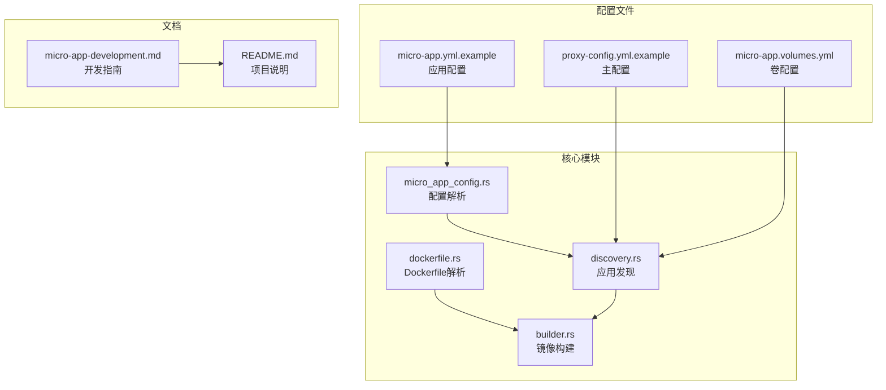

**图表来源**
- [lib.rs:1-26](file://src/lib.rs#L1-L26)
- [Cargo.toml:1-55](file://Cargo.toml#L1-L55)

**章节来源**
- [lib.rs:1-26](file://src/lib.rs#L1-L26)
- [Cargo.toml:1-55](file://Cargo.toml#L1-L55)

## 核心组件

### Dockerfile 解析模块

Dockerfile 解析模块提供了对 Dockerfile 内容的分析能力，特别是端口暴露信息的提取：

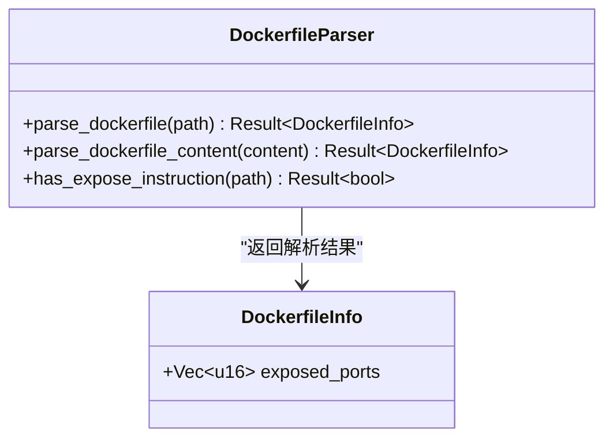

**图表来源**
- [dockerfile.rs:9-67](file://src/dockerfile.rs#L9-L67)

### 镜像构建模块

镜像构建模块负责实际的 Docker 镜像构建过程，支持环境变量传递和缓存控制：

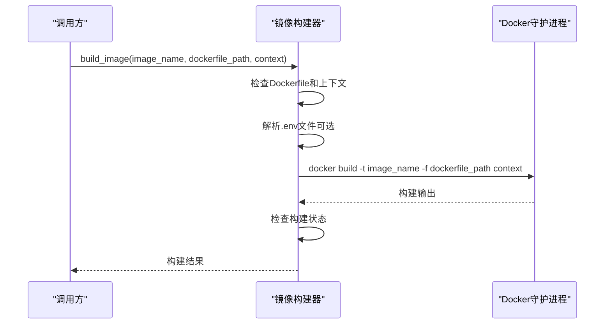

**图表来源**
- [builder.rs:20-120](file://src/builder.rs#L20-L120)

**章节来源**
- [dockerfile.rs:16-79](file://src/dockerfile.rs#L16-L79)
- [builder.rs:9-120](file://src/builder.rs#L9-L120)

## 架构概览

micro_proxy 的 Dockerfile 开发架构围绕三个核心概念构建：

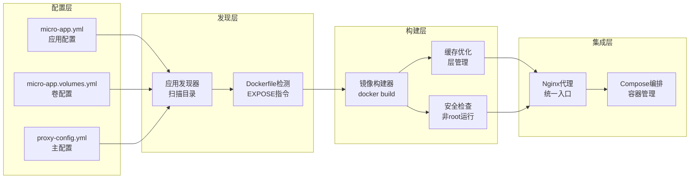

**图表来源**
- [discovery.rs:235-352](file://src/discovery.rs#L235-L352)
- [builder.rs:20-120](file://src/builder.rs#L20-L120)

## 详细组件分析

### 应用发现与验证

应用发现模块负责扫描微应用目录，验证 Dockerfile 的存在性和有效性：

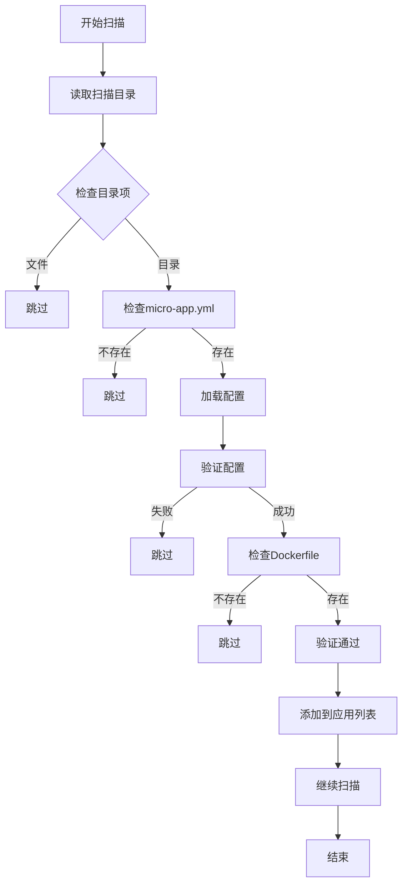

**图表来源**
- [discovery.rs:235-352](file://src/discovery.rs#L235-L352)

### Dockerfile 端口解析

Dockerfile 解析模块提供了对 EXPOSE 指令的智能解析：

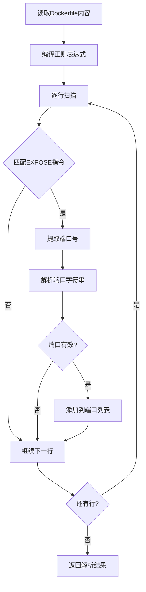

**图表来源**
- [dockerfile.rs:45-67](file://src/dockerfile.rs#L45-L67)

**章节来源**
- [discovery.rs:93-119](file://src/discovery.rs#L93-L119)
- [dockerfile.rs:45-67](file://src/dockerfile.rs#L45-L67)

## Dockerfile 最佳实践

### 基础结构设计

每个微应用都必须包含以下基本文件：

| 文件 | 必需性 | 作用 |
|------|--------|------|
| `micro-app.yml` | ✅ 必需 | 微应用配置文件 |
| `Dockerfile` | ✅ 必需 | Docker 镜像构建文件 |
| `micro-app.volumes.yml` | ⚠️ 可选 | 卷和权限配置 |
| `.env` | ⚠️ 可选 | 环境变量文件 |
| `nginx.conf` | ⚠️ 条件 | SPA 应用必需 |
| `setup.sh` | ⚠️ 可选 | 构建前脚本 |
| `clean.sh` | ⚠️ 可选 | 清理脚本 |

### 配置验证策略

微应用配置包含严格的验证机制：

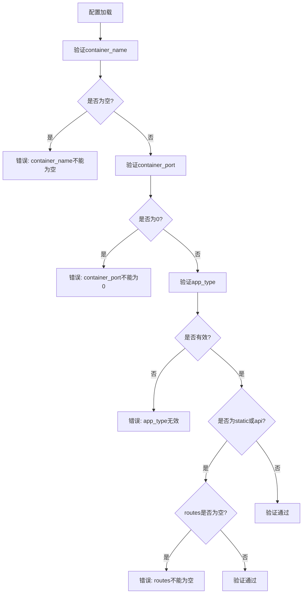

**图表来源**
- [micro_app_config.rs:55-106](file://src/micro_app_config.rs#L55-L106)

**章节来源**
- [micro_app_config.rs:55-106](file://src/micro_app_config.rs#L55-L106)
- [README.md:300-327](file://README.md#L300-L327)

## 多阶段构建详解

### 构建原理

多阶段构建通过在单个 Dockerfile 中使用多个 FROM 指令，实现构建时依赖与运行时环境的分离：

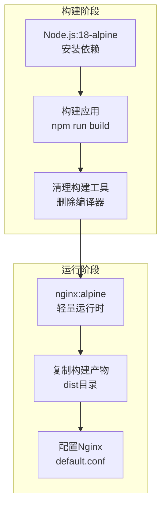

**图表来源**
- [micro-app-development.md:299-316](file://docs/micro-app-development.md#L299-L316)

### 应用场景

| 应用类型 | 多阶段优势 | 典型实现 |
|----------|------------|----------|
| Static | 减少运行时镜像大小 | 构建阶段使用 Node.js，运行阶段使用 Nginx |
| API | 分离开发依赖和生产环境 | 构建阶段使用完整 Node.js 环境，运行阶段使用精简环境 |
| Internal | 优化专用服务镜像 | 使用官方镜像作为基础，仅添加必要配置 |

**章节来源**
- [micro-app-development.md:299-316](file://docs/micro-app-development.md#L299-L316)

## 应用类型模板

### Static 类型应用模板

Static 类型应用适用于前端和静态网站，需要完整的多阶段构建：

```dockerfile
# 构建阶段
FROM node:18-alpine as builder
WORKDIR /app
COPY package*.json ./
RUN npm ci
COPY . .
RUN npm run build

# 运行阶段
FROM nginx:alpine
COPY nginx.conf /etc/nginx/conf.d/default.conf
COPY --from=builder /app/dist /usr/share/nginx/html
EXPOSE 80
CMD ["nginx", "-g", "daemon off;"]
```

### API 类型应用模板

API 类型应用使用单阶段构建，专注于后端服务：

```dockerfile
FROM node:18-alpine
WORKDIR /app
COPY package*.json ./
RUN npm ci
COPY . .
EXPOSE 8080
CMD ["node", "server.js"]
```

### Internal 类型应用模板

Internal 类型应用使用官方镜像，最小化自定义配置：

```dockerfile
FROM redis:7-alpine
EXPOSE 6379
```

**章节来源**
- [micro-app-development.md:305-486](file://docs/micro-app-development.md#L305-L486)

## 基础镜像选择

### 选择原则

1. **安全性优先**：优先选择官方镜像，定期更新基础镜像版本
2. **体积考虑**：生产环境使用 alpine 系列镜像减少镜像大小
3. **兼容性**：确保基础镜像与应用依赖的二进制文件兼容
4. **维护性**：选择活跃维护的基础镜像，避免废弃版本

### 版本管理策略

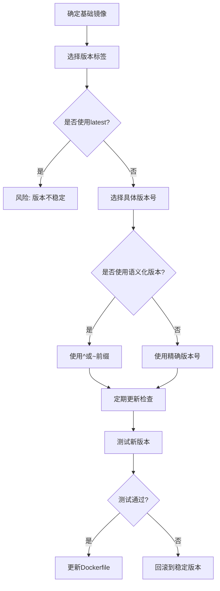

**图表来源**
- [micro-app-development.md:480-486](file://docs/micro-app-development.md#L480-L486)

**章节来源**
- [micro-app-development.md:480-486](file://docs/micro-app-development.md#L480-L486)

## 构建缓存优化

### 缓存机制原理

Docker 构建缓存基于层的增量构建，每一层的缓存键由以下因素决定：

1. **指令内容**：Dockerfile 指令的具体内容
2. **上下文文件**：COPY/ADD 指令涉及的文件
3. **时间戳**：文件的最后修改时间
4. **构建参数**：--build-arg 指定的参数

### 优化策略

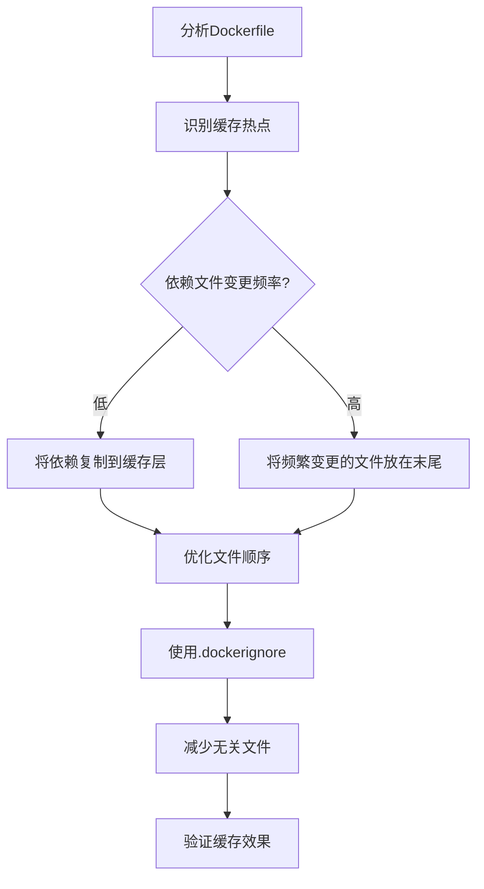

**图表来源**
- [builder.rs:67-88](file://src/builder.rs#L67-L88)

### .dockerignore 文件配置

| 文件模式 | 用途 | 说明 |
|----------|------|------|
| `node_modules` | 依赖缓存 | 避免重复安装依赖 |
| `*.log` | 日志文件 | 不需要包含在构建上下文中 |
| `.git` | 版本控制 | Git 仓库不需要构建 |
| `*.tmp` | 临时文件 | 构建产物不需要包含 |
| `docs/` | 文档 | 文档不需要构建 |

**章节来源**
- [builder.rs:67-88](file://src/builder.rs#L67-L88)

## 安全构建实践

### 非 root 用户运行

安全运行的首要原则是避免使用 root 用户：

```dockerfile
# 创建非特权用户
RUN addgroup -r appuser && useradd -r -g appuser appuser

# 切换到非特权用户
USER appuser

# 或者使用USER指令
USER 1000:1000
```

### 最小权限原则

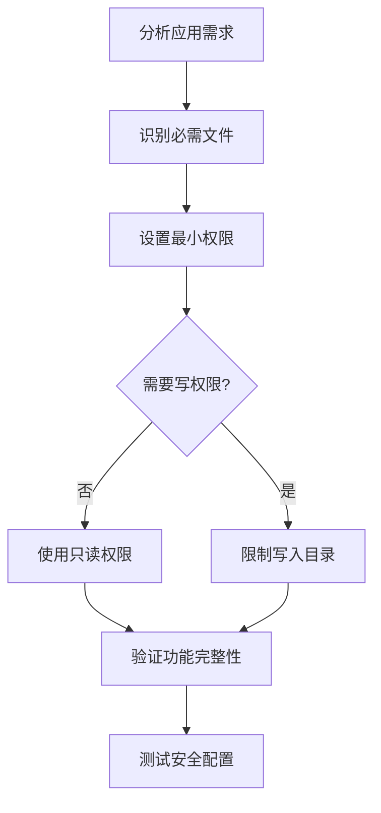

**图表来源**
- [micro-app-development.md:242-247](file://docs/micro-app-development.md#L242-L247)

### 权限配置策略

| 策略 | 适用场景 | 配置示例 |
|------|----------|----------|
| 适应容器内用户 | 使用官方镜像 | `permissions.uid: 101, run_as_user: nginx` |
| 适应宿主机用户 | 自定义镜像 | `permissions.uid: 1000, run_as_user: 1000:1000` |
| 仅配置权限 | 不改变用户 | `permissions.uid: 999, permissions.gid: 999` |

**章节来源**
- [micro-app-development.md:200-247](file://docs/micro-app-development.md#L200-L247)

## 调试与故障排查

### 构建过程调试

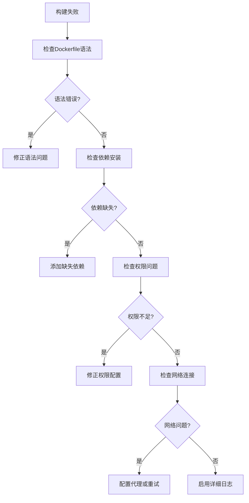

**图表来源**
- [builder.rs:96-120](file://src/builder.rs#L96-L120)

### 常见问题诊断

| 问题类型 | 诊断方法 | 解决方案 |
|----------|----------|----------|
| 构建超时 | 查看构建日志 | 优化 Dockerfile，减少层数 |
| 镜像过大 | 使用镜像分析工具 | 实施多阶段构建，清理不必要的文件 |
| 权限错误 | 检查用户映射 | 配置正确的 uid/gid 映射 |
| 端口冲突 | 检查端口占用 | 修改容器端口映射或停止占用进程 |

**章节来源**
- [builder.rs:96-120](file://src/builder.rs#L96-L120)
- [README.md:328-420](file://README.md#L328-L420)

## 性能优化技巧

### 镜像大小优化

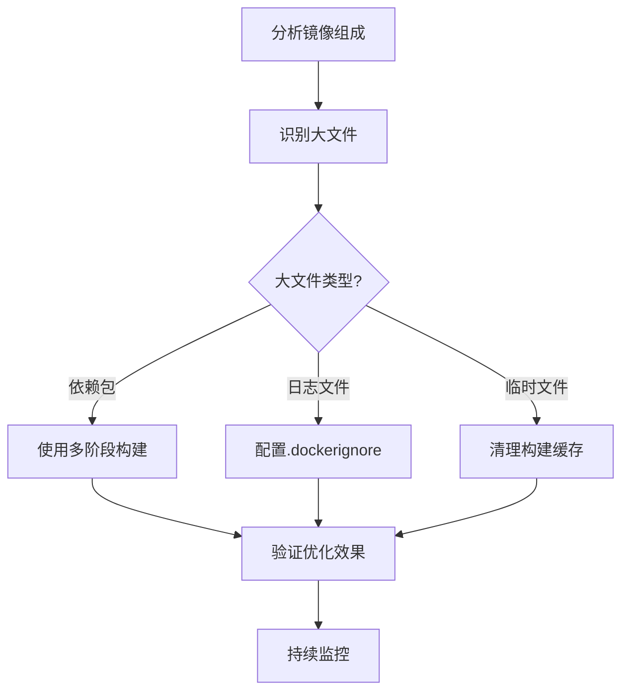

**图表来源**
- [micro-app-development.md:299-316](file://docs/micro-app-development.md#L299-L316)

### 构建性能优化

1. **层缓存优化**：将变化频率低的指令放在前面，变化频率高的指令放在后面
2. **并行构建**：使用 Docker BuildKit 启用并行构建
3. **缓存复用**：合理使用 --cache-from 参数复用远程缓存
4. **上下文优化**：使用 .dockerignore 文件排除不必要的文件

### 运行时性能优化

```dockerfile
# 使用多阶段构建减少最终镜像大小
FROM node:18-alpine AS builder
WORKDIR /app
COPY package*.json ./
RUN npm ci
COPY . .
RUN npm run build

FROM node:18-alpine AS runtime
WORKDIR /app
COPY --from=builder /app/dist ./dist
COPY package.json ./
RUN npm ci --only=production
EXPOSE 8080
CMD ["node", "server.js"]
```

**章节来源**
- [micro-app-development.md:299-316](file://docs/micro-app-development.md#L299-L316)

## 结论

Dockerfile 开发是一个涉及多个层面的复杂过程，需要综合考虑安全性、性能、可维护性等多个方面。通过遵循本文档提供的最佳实践，可以显著提升微应用的构建质量和运行效率。

关键要点总结：

1. **结构化设计**：使用多阶段构建分离开发和运行环境
2. **安全优先**：始终使用非 root 用户运行，实施最小权限原则
3. **性能优化**：合理利用构建缓存，优化镜像大小和启动时间
4. **配置管理**：建立完善的配置验证和版本管理机制
5. **持续改进**：定期评估和优化 Dockerfile，适应应用发展需求

通过系统性的 Dockerfile 开发实践，可以构建出既安全又高效的微应用容器化解决方案。