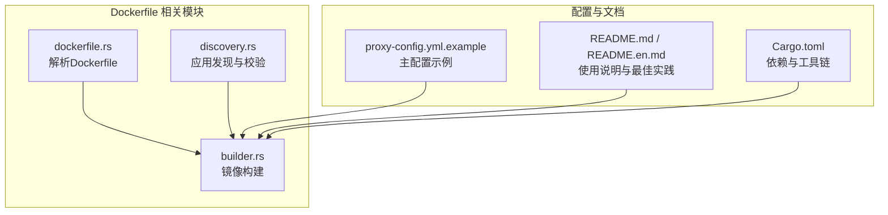
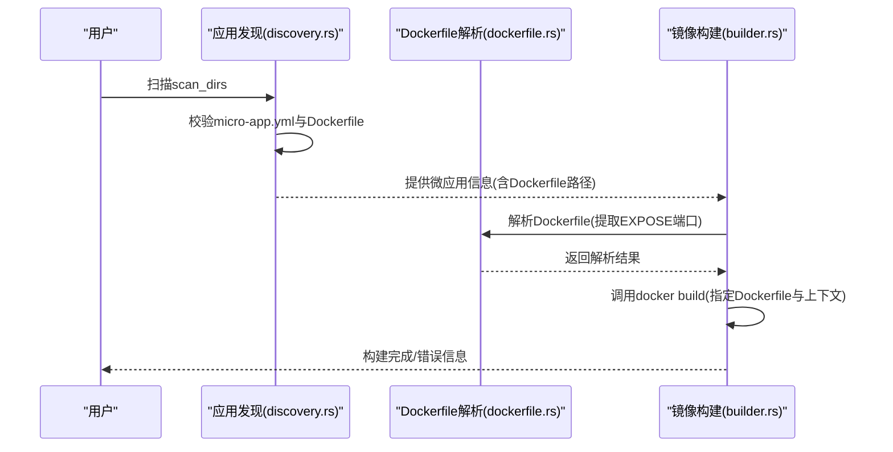
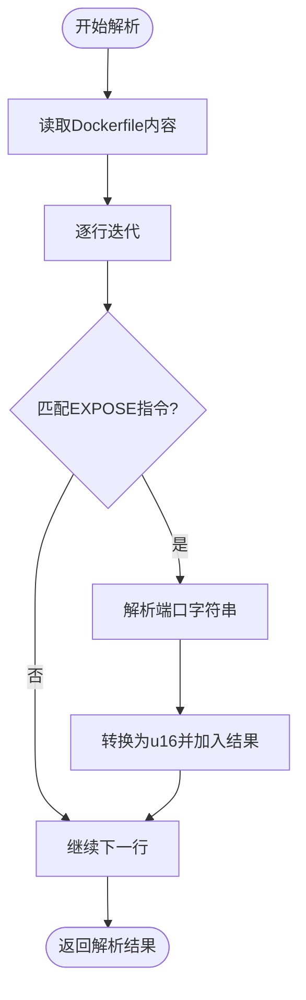
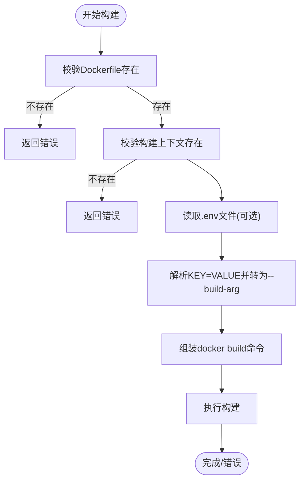
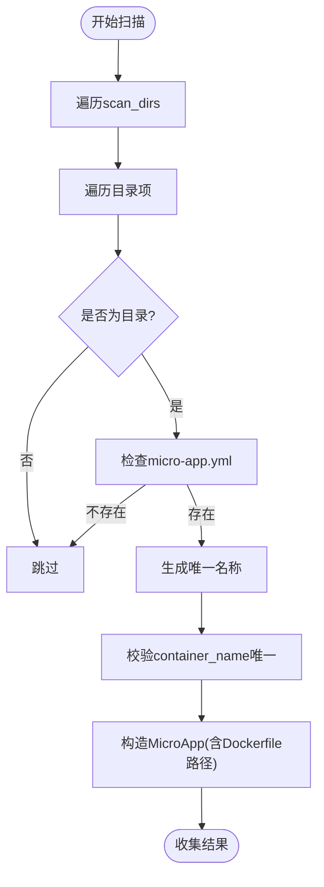
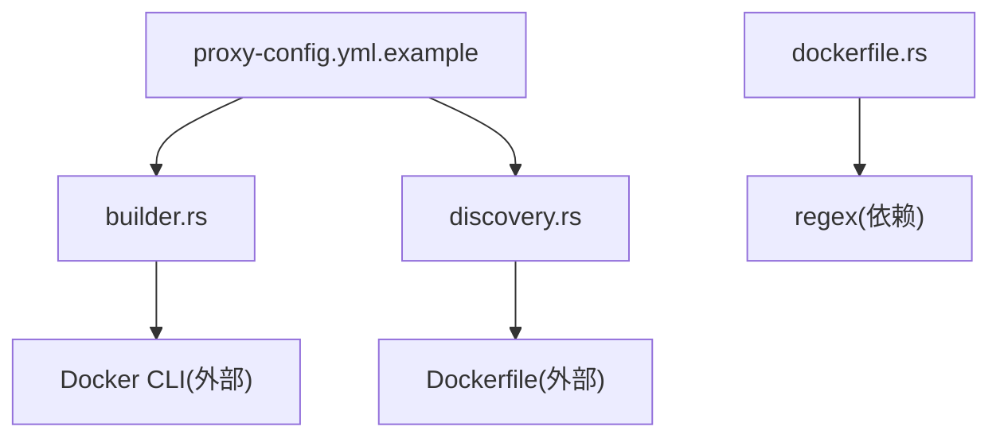

# 基础 Dockerfile 编写

<cite>
**本文引用的文件**
- [dockerfile.rs](file://src/dockerfile.rs)
- [builder.rs](file://src/builder.rs)
- [discovery.rs](file://src/discovery.rs)
- [README.md](file://README.md)
- [README.en.md](file://README.en.md)
- [proxy-config.yml.example](file://proxy-config.yml.example)
- [Cargo.toml](file://Cargo.toml)
</cite>

## 目录
1. [引言](#引言)
2. [项目结构](#项目结构)
3. [核心组件](#核心组件)
4. [架构总览](#架构总览)
5. [详细组件分析](#详细组件分析)
6. [依赖分析](#依赖分析)
7. [性能考虑](#性能考虑)
8. [故障排查指南](#故障排查指南)
9. [结论](#结论)
10. [附录](#附录)

## 引言
本文件围绕基础 Dockerfile 的编写规范与最佳实践展开，结合代码库中对 Dockerfile 的解析与镜像构建流程，系统阐述 FROM、WORKDIR、COPY、EXPOSE、CMD 等常用指令的使用方法与注意事项；并提供镜像构建上下文与文件排除规则、基础镜像选择原则与安全考量、基础配置检查清单与验证方法，以及常见配置错误的排查与修复建议。目标是帮助读者在实际项目中编写高质量、可维护、可复用的 Dockerfile。

## 项目结构
该项目是一个基于 Rust 的微应用管理工具，支持自动发现微应用、生成 Nginx 配置、生成 docker-compose.yml、并执行镜像构建与容器生命周期管理。与 Dockerfile 直接相关的关键模块包括：
- Dockerfile 解析模块：负责解析 Dockerfile，提取暴露端口等元信息
- 镜像构建模块：负责调用 docker build 执行镜像构建
- 应用发现模块：负责扫描目录并校验微应用是否包含 Dockerfile

**图表来源**
- [dockerfile.rs:1-183](file://src/dockerfile.rs#L1-L183)
- [builder.rs:1-217](file://src/builder.rs#L1-L217)
- [discovery.rs:1-721](file://src/discovery.rs#L1-L721)
- [proxy-config.yml.example:1-53](file://proxy-config.yml.example#L1-L53)
- [README.md:1-460](file://README.md#L1-L460)
- [README.en.md:1-679](file://README.en.md#L1-L679)
- [Cargo.toml:1-55](file://Cargo.toml#L1-L55)

**章节来源**
- [README.md:1-460](file://README.md#L1-L460)
- [README.en.md:1-679](file://README.en.md#L1-L679)

## 核心组件
- Dockerfile 解析器：从 Dockerfile 中提取 EXPOSE 指令声明的端口，用于后续镜像构建与容器网络规划
- 镜像构建器：封装 docker build 命令，支持禁用缓存、传入环境变量文件、指定 Dockerfile 路径与构建上下文
- 应用发现器：扫描目录，要求每个微应用目录同时包含 micro-app.yml 与 Dockerfile，缺失任一即视为无效

这些组件共同保证了 Dockerfile 的质量与一致性，为后续 Nginx 反向代理与 docker-compose 编排提供可靠输入。

**章节来源**
- [dockerfile.rs:1-183](file://src/dockerfile.rs#L1-L183)
- [builder.rs:1-217](file://src/builder.rs#L1-L217)
- [discovery.rs:1-721](file://src/discovery.rs#L1-L721)

## 架构总览
下图展示了从发现微应用到镜像构建的整体流程，重点体现 Dockerfile 在其中的关键作用：

**图表来源**
- [discovery.rs:235-352](file://src/discovery.rs#L235-L352)
- [dockerfile.rs:23-67](file://src/dockerfile.rs#L23-L67)
- [builder.rs:20-91](file://src/builder.rs#L20-L91)

## 详细组件分析

### Dockerfile 解析器（dockerfile.rs）
- 功能概述
  - 读取 Dockerfile 内容并逐行匹配 EXPOSE 指令，提取一个或多个端口
  - 支持大小写不敏感匹配与多余空白字符处理
  - 提供 has_expose_instruction 辅助函数判断是否存在 EXPOSE 指令
- 关键行为
  - 使用正则表达式匹配 EXPOSE 行，捕获端口号并转换为 u16
  - 将所有解析到的端口汇总为向量返回
- 测试覆盖
  - 包含大小写不敏感、空白处理、多端口、文件读取等测试用例

**图表来源**
- [dockerfile.rs:45-67](file://src/dockerfile.rs#L45-L67)

**章节来源**
- [dockerfile.rs:1-183](file://src/dockerfile.rs#L1-L183)

### 镜像构建器（builder.rs）
- 功能概述
  - 调用 docker build 构建镜像，支持指定 Dockerfile 路径、构建上下文、禁用缓存、传入环境变量文件
  - 读取 .env 文件并将其转换为 --build-arg 参数传递给 docker build
- 关键行为
  - 校验 Dockerfile 与构建上下文是否存在
  - 解析 .env 文件，逐行提取 KEY=VALUE 并追加到构建参数
  - 按需添加 --no-cache 参数以强制重建
- 错误处理
  - Dockerfile 或构建上下文不存在时返回明确错误
  - .env 文件读取失败时返回相应错误

**图表来源**
- [builder.rs:20-91](file://src/builder.rs#L20-L91)

**章节来源**
- [builder.rs:1-217](file://src/builder.rs#L1-L217)

### 应用发现器（discovery.rs）
- 功能概述
  - 扫描 scan_dirs，要求每个微应用目录同时包含 micro-app.yml 与 Dockerfile
  - 对缺失 Dockerfile 的目录进行跳过并记录日志
- 关键行为
  - 生成微应用唯一名称（基于相对路径）
  - 校验 container_name 全局唯一性
  - 生成 MicroApp 结构体，包含 Dockerfile 路径、.env 路径等

**图表来源**
- [discovery.rs:235-352](file://src/discovery.rs#L235-L352)

**章节来源**
- [discovery.rs:1-721](file://src/discovery.rs#L1-L721)

## 依赖分析
- 外部工具依赖
  - Docker CLI：镜像构建与容器运行的基础
- 内部模块依赖
  - discovery.rs 依赖 micro_app_config 与 volumes_config（来自同一仓库），但核心与 Dockerfile 相关的依赖主要体现在对 Dockerfile 的存在性校验
  - dockerfile.rs 依赖正则表达式库 regex
  - builder.rs 依赖标准库进程与文件系统操作
- 关系图

**图表来源**
- [Cargo.toml:42-42](file://Cargo.toml#L42-L42)
- [discovery.rs:93-119](file://src/discovery.rs#L93-L119)
- [builder.rs:54-91](file://src/builder.rs#L54-L91)
- [dockerfile.rs:48-50](file://src/dockerfile.rs#L48-L50)
- [proxy-config.yml.example:1-53](file://proxy-config.yml.example#L1-L53)

**章节来源**
- [Cargo.toml:1-55](file://Cargo.toml#L1-L55)
- [discovery.rs:1-721](file://src/discovery.rs#L1-L721)
- [builder.rs:1-217](file://src/builder.rs#L1-L217)
- [dockerfile.rs:1-183](file://src/dockerfile.rs#L1-L183)
- [proxy-config.yml.example:1-53](file://proxy-config.yml.example#L1-L53)

## 性能考虑
- 构建缓存
  - 通过 --no-cache 参数可强制重建，适用于需要完全一致构建结果的场景
  - 默认情况下利用 Docker 层缓存可显著缩短构建时间
- 构建上下文大小
  - 尽量缩小构建上下文，避免包含无关文件，减少网络与磁盘传输开销
- 端口暴露
  - EXPOSE 指令仅声明端口，不实际映射端口；容器运行时需通过 docker run -p 或 docker-compose 映射

[本节为通用指导，不直接分析具体文件]

## 故障排查指南
- Dockerfile 不存在
  - 现象：构建阶段报错或发现阶段跳过
  - 排查：确认微应用目录包含 Dockerfile
  - 参考：发现阶段对 Dockerfile 的存在性校验
- .env 文件读取失败
  - 现象：构建阶段读取 .env 失败
  - 排查：检查 .env 文件路径与权限
  - 参考：构建阶段对 .env 的读取与解析
- EXPOSE 端口未声明
  - 现象：容器网络规划缺少端口信息
  - 排查：在 Dockerfile 中添加 EXPOSE 指令
  - 参考：解析器对 EXPOSE 的提取逻辑
- 端口映射冲突
  - 现象：容器启动失败或端口占用
  - 排查：修改主配置中的 nginx_host_port 或停止占用端口的进程
  - 参考：主配置示例中的 nginx_host_port 字段

**章节来源**
- [discovery.rs:93-119](file://src/discovery.rs#L93-L119)
- [builder.rs:68-88](file://src/builder.rs#L68-L88)
- [dockerfile.rs:45-67](file://src/dockerfile.rs#L45-L67)
- [proxy-config.yml.example:30-31](file://proxy-config.yml.example#L30-L31)

## 结论
通过对 Dockerfile 的解析与镜像构建流程的梳理，可以看出：良好的 Dockerfile 编写是微应用管理与容器编排的基础。遵循 FROM、WORKDIR、COPY、EXPOSE、CMD 等指令的最佳实践，配合合理的构建上下文与基础镜像选择，能够显著提升构建效率与运行稳定性。结合本项目的发现与构建流程，可形成从“发现微应用 → 校验 Dockerfile → 解析端口 → 构建镜像”的闭环，确保后续 Nginx 与 docker-compose 的顺利执行。

[本节为总结性内容，不直接分析具体文件]

## 附录

### 基础 Dockerfile 编写规范与最佳实践
- FROM
  - 选择可信的基础镜像，尽量使用官方镜像或经过验证的第三方镜像
  - 在多阶段构建中明确区分构建阶段与运行阶段的基础镜像
- WORKDIR
  - 设置明确的工作目录，避免相对路径带来的歧义
  - 保持工作目录简洁，减少层级嵌套
- COPY / ADD
  - 优先使用 COPY，ADD 仅在需要自动解压 tar 等场景使用
  - 将大体积文件放在最后复制，以利用层缓存
- EXPOSE
  - 明确声明应用监听端口，便于容器网络与 docker-compose 编排
  - 与 docker run -p 或 docker-compose 端口映射配合使用
- CMD / ENTRYPOINT
  - 使用 ENTRYPOINT 指定可执行程序，CMD 提供默认参数
  - 避免在 CMD 中使用 sh -c 启动应用，除非必要
- 构建上下文与 .dockerignore
  - 将构建上下文限制在最小范围，避免包含不必要的文件
  - 使用 .dockerignore 排除日志、临时文件、IDE 生成文件等
- 安全与权限
  - 避免使用 root 用户运行应用，尽量以非特权用户启动
  - 使用只读根文件系统与最小权限原则
- 多阶段构建
  - 将编译产物与运行时依赖分离，减小最终镜像体积
- 健壮性
  - 在 Dockerfile 中显式设置 SHELL、ENV 等，避免环境差异导致的问题
  - 为健康检查与日志输出预留配置空间

[本节为通用指导，不直接分析具体文件]

### 不同语言与框架的基础模板要点
- Node.js
  - 使用官方 Node.js 镜像作为基础
  - 先安装依赖再复制源码，利用层缓存
  - 使用非 root 用户运行
- Python
  - 使用官方 Python 镜像或基于 alpine 的轻量版本
  - 使用虚拟环境隔离依赖
  - 清理 pip 缓存以减小镜像体积
- Go
  - 使用多阶段构建：先在 builder 阶段编译，再拷贝到运行阶段
  - 设置 CGO_ENABLED=0 以获得静态二进制
- Java
  - 使用官方 OpenJDK 或 JRE 镜像
  - 设置 JAVA_OPTS 等 JVM 参数
  - 使用非 root 用户运行
- Nginx/静态站点
  - 使用官方 nginx 镜像
  - 将构建产物复制到 /usr/share/nginx/html
  - 映射 EXPOSE 80 端口并在 docker-compose 中映射宿主机端口

[本节为通用指导，不直接分析具体文件]

### 镜像构建上下文与文件排除规则
- 构建上下文
  - docker build 的上下文决定了构建时可见的文件集合
  - 上下文越大，构建时间越长，网络传输越多
- .dockerignore
  - 类似 .gitignore，用于排除不需要包含在上下文中的文件
  - 常见排除对象：node_modules、target、*.log、.git、.vscode 等
- 最佳实践
  - 将 Dockerfile 与构建上下文根目录尽量靠近
  - 将大型文件（如依赖包下载缓存）放入 .dockerignore
  - 使用多阶段构建减少最终镜像体积

[本节为通用指导，不直接分析具体文件]

### 基础镜像选择原则与安全考虑
- 选择原则
  - 官方镜像优先，版本明确且长期支持
  - 镜像体积适中，避免包含不必要的工具与包
  - 镜像来源可信，定期更新以修复安全漏洞
- 安全考虑
  - 使用只读根文件系统
  - 以非 root 用户运行应用
  - 禁用不必要的网络与系统调用
  - 定期扫描镜像安全漏洞

[本节为通用指导，不直接分析具体文件]

### 基础配置检查清单与验证方法
- Dockerfile
  - 是否包含 FROM 指令且基础镜像合理
  - 是否声明 EXPOSE 端口并与应用实际监听端口一致
  - 是否使用非 root 用户运行
  - 是否存在不必要的大文件或敏感信息
- 构建上下文
  - 是否存在 .dockerignore 且排除了无关文件
  - 构建上下文是否过大
- 运行时
  - docker-compose 是否正确映射端口
  - 是否配置了必要的卷挂载与环境变量
  - 健康检查与重启策略是否合理

[本节为通用指导，不直接分析具体文件]

### 常见基础配置错误的排查与修复
- EXPOSE 未声明端口
  - 现象：容器网络规划缺失端口
  - 修复：在 Dockerfile 中添加 EXPOSE 指令
- 端口映射冲突
  - 现象：容器启动失败或端口占用
  - 修复：修改主配置中的 nginx_host_port 或停止占用端口的进程
- Dockerfile 不存在
  - 现象：发现阶段跳过微应用
  - 修复：在微应用目录添加 Dockerfile
- .env 文件读取失败
  - 现象：构建阶段报错
  - 修复：检查 .env 文件路径与权限

**章节来源**
- [dockerfile.rs:45-67](file://src/dockerfile.rs#L45-L67)
- [builder.rs:68-88](file://src/builder.rs#L68-L88)
- [discovery.rs:93-119](file://src/discovery.rs#L93-L119)
- [proxy-config.yml.example:30-31](file://proxy-config.yml.example#L30-L31)