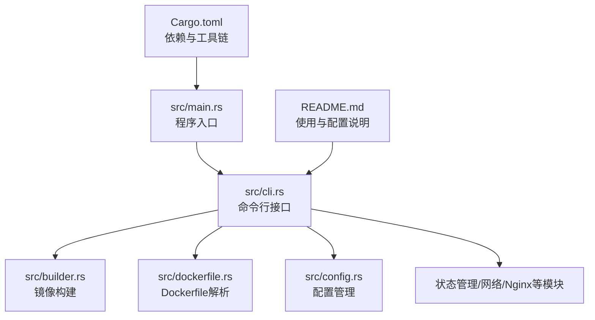
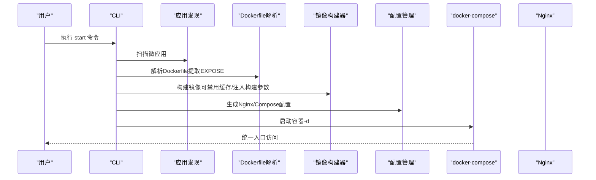
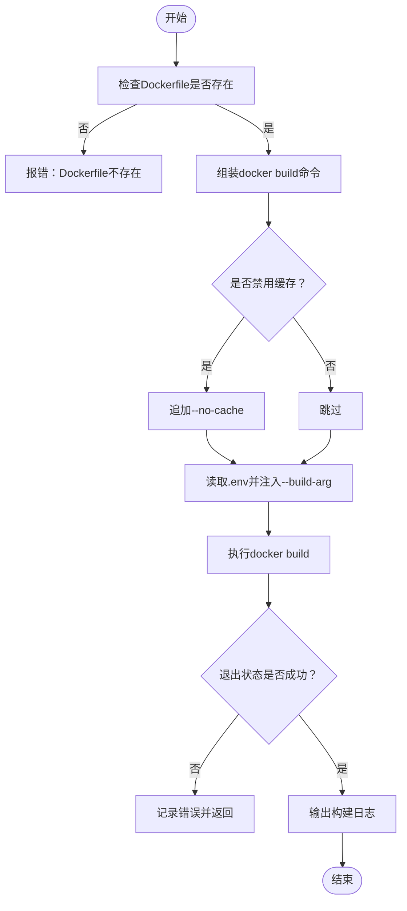
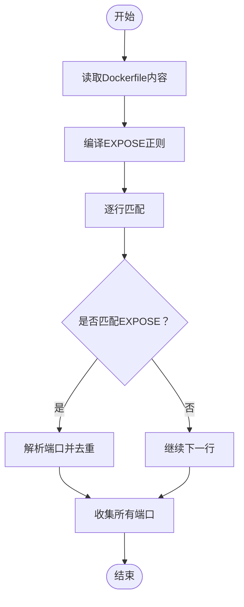
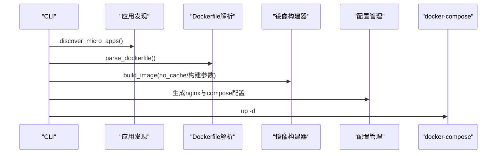
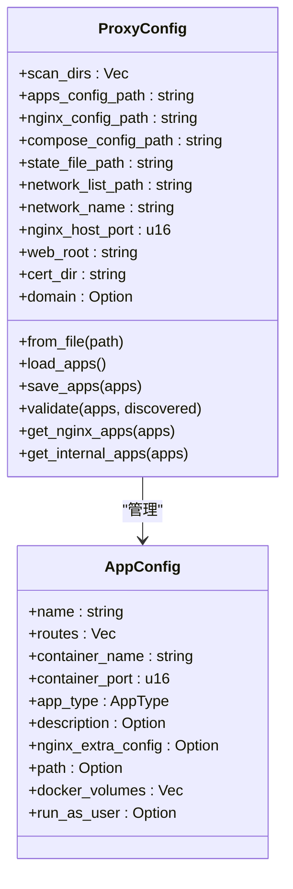
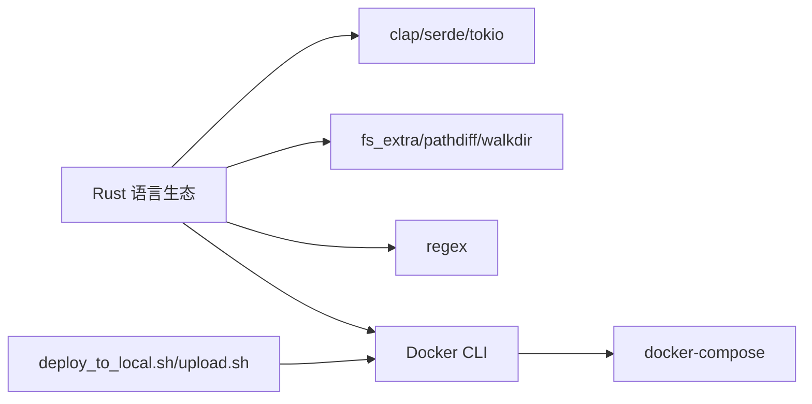

# 多阶段构建优化

<cite>
**本文引用的文件**   
- [src/main.rs](file://src/main.rs)
- [src/lib.rs](file://src/lib.rs)
- [src/cli.rs](file://src/cli.rs)
- [src/builder.rs](file://src/builder.rs)
- [src/dockerfile.rs](file://src/dockerfile.rs)
- [src/config.rs](file://src/config.rs)
- [Cargo.toml](file://Cargo.toml)
- [README.md](file://README.md)
- [deploy_to_local.sh](file://deploy_to_local.sh)
- [upload.sh](file://upload.sh)
- [proxy-config.yml.example](file://proxy-config.yml.example)
</cite>

## 目录
1. [引言](#引言)
2. [项目结构](#项目结构)
3. [核心组件](#核心组件)
4. [架构总览](#架构总览)
5. [详细组件分析](#详细组件分析)
6. [依赖关系分析](#依赖关系分析)
7. [性能考量](#性能考量)
8. [故障排查指南](#故障排查指南)
9. [结论](#结论)
10. [附录](#附录)

## 引言
本文件围绕“多阶段构建”的原理与实现展开，结合仓库中现有的镜像构建、Dockerfile解析、命令行流程与配置管理等模块，系统阐述如何在不同语言（Node.js、Python、Go）场景下实施多阶段构建，实现构建阶段与运行阶段的分离、缓存利用与优化、最终镜像精简与安全加固、构建时间优化与镜像体积控制、调试与问题排查以及依赖管理与版本控制。由于本仓库主要聚焦于镜像构建与容器编排的自动化，本文将基于现有代码模块给出可落地的工程化实践建议，并辅以概念性图示帮助读者建立完整的知识框架。

## 项目结构
该项目采用 Rust 语言实现，模块化清晰，围绕 CLI、配置、Dockerfile 解析、镜像构建、状态管理、网络与 Nginx 配置等能力组织。与多阶段构建直接相关的关键模块包括：
- CLI：负责解析命令、调度构建与编排流程
- 镜像构建：封装 docker build 命令调用，支持缓存与构建参数注入
- Dockerfile 解析：提取暴露端口等元信息，辅助健康检查与告警
- 配置：集中管理主配置与动态应用配置，支撑多应用统一编排

**图表来源**
- [src/main.rs:1-25](file://src/main.rs#L1-L25)
- [src/cli.rs:1-669](file://src/cli.rs#L1-L669)
- [src/builder.rs:1-218](file://src/builder.rs#L1-L218)
- [src/dockerfile.rs:1-183](file://src/dockerfile.rs#L1-L183)
- [src/config.rs:1-842](file://src/config.rs#L1-L842)
- [Cargo.toml:1-55](file://Cargo.toml#L1-L55)
- [README.md:1-460](file://README.md#L1-L460)

**章节来源**
- [src/main.rs:1-25](file://src/main.rs#L1-L25)
- [src/lib.rs:1-26](file://src/lib.rs#L1-L26)
- [Cargo.toml:1-55](file://Cargo.toml#L1-L55)
- [README.md:421-441](file://README.md#L421-L441)

## 核心组件
- CLI 与命令分发：解析 start/stop/clean/status/network 等子命令，协调各模块执行
- 镜像构建器：封装 docker build 调用，支持禁用缓存、注入构建参数、错误处理与日志
- Dockerfile 解析器：提取 EXPOSE 端口，辅助健康检查与告警
- 配置管理：主配置与动态应用配置，支撑多应用统一编排与 Nginx/Compose 生成
- 状态管理：基于目录哈希判断是否需要重新构建，避免不必要的镜像重建

**章节来源**
- [src/cli.rs:78-116](file://src/cli.rs#L78-L116)
- [src/builder.rs:20-120](file://src/builder.rs#L20-L120)
- [src/dockerfile.rs:23-67](file://src/dockerfile.rs#L23-L67)
- [src/config.rs:125-220](file://src/config.rs#L125-L220)

## 架构总览
下图展示了从 CLI 到镜像构建与容器编排的整体流程，体现“构建阶段”与“运行阶段”的分离：构建阶段负责生成镜像；运行阶段负责生成 Nginx/Compose 配置并启动容器。

**图表来源**
- [src/cli.rs:296-463](file://src/cli.rs#L296-L463)
- [src/builder.rs:20-120](file://src/builder.rs#L20-L120)
- [src/dockerfile.rs:23-67](file://src/dockerfile.rs#L23-L67)

## 详细组件分析

### 组件A：镜像构建器（多阶段构建的执行者）
镜像构建器封装了 docker build 的调用，支持：
- 禁用构建缓存（--no-cache）
- 注入构建参数（--build-arg），从 .env 文件解析键值对
- 错误处理与日志输出
- 镜像存在性检查与删除

**图表来源**
- [src/builder.rs:20-120](file://src/builder.rs#L20-L120)

**章节来源**
- [src/builder.rs:20-120](file://src/builder.rs#L20-L120)
- [src/builder.rs:122-180](file://src/builder.rs#L122-L180)

### 组件B：Dockerfile 解析器（构建阶段元信息提取）
解析器从 Dockerfile 中提取 EXPOSE 端口，用于后续健康检查与告警提示，体现“构建阶段”对运行阶段的约束信息传递。

**图表来源**
- [src/dockerfile.rs:45-67](file://src/dockerfile.rs#L45-L67)

**章节来源**
- [src/dockerfile.rs:23-67](file://src/dockerfile.rs#L23-L67)

### 组件C：CLI 启动流程（构建与运行阶段的编排）
CLI 的启动流程串联了应用发现、Dockerfile 解析、镜像构建、配置生成与容器启动，体现了“构建阶段”与“运行阶段”的明确分工与顺序控制。

**图表来源**
- [src/cli.rs:296-463](file://src/cli.rs#L296-L463)

**章节来源**
- [src/cli.rs:296-463](file://src/cli.rs#L296-L463)

### 组件D：配置管理（多应用统一编排）
配置模块负责主配置与动态应用配置的读取、校验与保存，支撑多应用统一编排与 Nginx/Compose 生成。

**图表来源**
- [src/config.rs:125-367](file://src/config.rs#L125-L367)

**章节来源**
- [src/config.rs:125-367](file://src/config.rs#L125-L367)

## 依赖关系分析
- 语言与工具链：Rust 生态（clap、serde、tokio 等），Docker CLI，docker-compose
- 关键依赖：regex（Dockerfile 解析）、fs_extra（文件操作）、pathdiff（路径计算）、walkdir（目录遍历）
- 构建与发布：Cargo 与 release 模式，本地部署脚本与远程同步脚本

**图表来源**
- [Cargo.toml:13-52](file://Cargo.toml#L13-L52)
- [deploy_to_local.sh:1-119](file://deploy_to_local.sh#L1-L119)
- [upload.sh:1-51](file://upload.sh#L1-L51)

**章节来源**
- [Cargo.toml:13-52](file://Cargo.toml#L13-L52)
- [deploy_to_local.sh:1-119](file://deploy_to_local.sh#L1-L119)
- [upload.sh:1-51](file://upload.sh#L1-L51)

## 性能考量
- 构建缓存利用与优化
  - 在非强制重建场景下复用缓存，显著缩短构建时间
  - 通过 .env 注入构建参数，避免不必要的层变更
  - 将变动频繁的步骤置于靠后层，减少上游层缓存失效
- 镜像体积控制
  - 使用多阶段构建：仅在最终阶段保留运行所需最小集合
  - 清理包管理器缓存与临时文件
  - 合理选择基础镜像（如 distroless、alpine）
- 构建时间优化
  - 并行构建：在 CI 中按应用维度并行构建
  - 层缓存命中：稳定依赖版本，减少层变更
  - 使用构建上下文白名单，避免无关文件进入上下文
- 依赖管理与版本控制
  - 固定依赖版本，配合 lock 文件
  - 分离构建依赖与运行依赖，避免污染运行时镜像
  - 在 CI 中缓存依赖层（如 npm/yarn/pip 缓存）

## 故障排查指南
- 构建失败
  - 检查 Dockerfile 是否存在与可读
  - 查看 docker build 输出的 stderr，定位具体错误
  - 使用 --no-cache 重试以排除缓存干扰
- 镜像不存在或状态异常
  - 使用镜像存在性检查函数确认镜像状态
  - 清理历史镜像，释放空间
- 容器启动问题
  - 使用 docker-compose 命令（优先 docker compose，回退 docker-compose）
  - 查看容器日志与网络连接
- 端口冲突
  - 修改主配置中的 nginx_host_port
  - 检查宿主机端口占用情况
- 配置校验
  - 使用配置校验逻辑确保应用名称唯一、路径存在、Dockerfile 存在等

**章节来源**
- [src/builder.rs:122-180](file://src/builder.rs#L122-L180)
- [src/cli.rs:118-170](file://src/cli.rs#L118-L170)
- [src/config.rs:220-347](file://src/config.rs#L220-L347)
- [README.md:328-420](file://README.md#L328-L420)

## 结论
本仓库提供了多阶段构建在工程化落地中的关键能力：CLI 编排、Dockerfile 解析、镜像构建与缓存控制、配置与编排生成。结合多阶段构建的最佳实践（缓存利用、体积控制、安全加固、依赖管理与版本控制），可在不同语言场景下实现高效、稳定、可维护的镜像构建流水线。建议在实际项目中：
- 以多阶段构建为核心，严格分离构建与运行阶段
- 建立完善的缓存策略与层设计，减少不必要的重建
- 通过配置与脚本固化流程，提升可重复性与可观测性
- 在 CI 中引入并行化与缓存加速，持续优化构建效率

## 附录

### 多阶段构建示例（概念性说明）
- Node.js
  - 阶段1：安装依赖（使用 package-lock.json 控制版本）
  - 阶段2：构建应用（打包/编译）
  - 阶段3：运行时镜像（仅包含运行时依赖与构建产物）
- Python
  - 阶段1：安装构建依赖（如编译器、headers）
  - 阶段2：安装生产依赖（requirements.txt）
  - 阶段3：运行时镜像（移除构建依赖，仅保留运行时）
- Go
  - 阶段1：构建（设置 CGO_ENABLED=0，静态链接更安全）
  - 阶段2：运行时镜像（distroless 或 alpine）

### 最终镜像精简与安全配置（概念性建议）
- 使用只读根文件系统、非 root 用户运行
- 移除调试工具与开发依赖
- 启用只读卷与最小权限原则
- 使用 SBOM 与漏洞扫描工具

### 构建时间优化与镜像大小控制（概念性建议）
- 分层缓存：固定依赖版本，稳定层结构
- 上下文瘦身：.dockerignore 排除无关文件
- 多阶段构建：仅拷贝必要文件到运行阶段
- 使用轻量级基础镜像与静态链接

### 调试与问题排查（概念性建议）
- 开启详细日志与构建输出
- 使用 --no-cache 重现问题
- 分阶段验证：分别构建中间层，定位问题范围
- 在 CI 中记录构建缓存命中率与体积指标