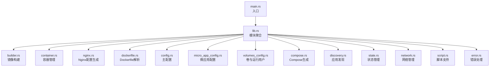
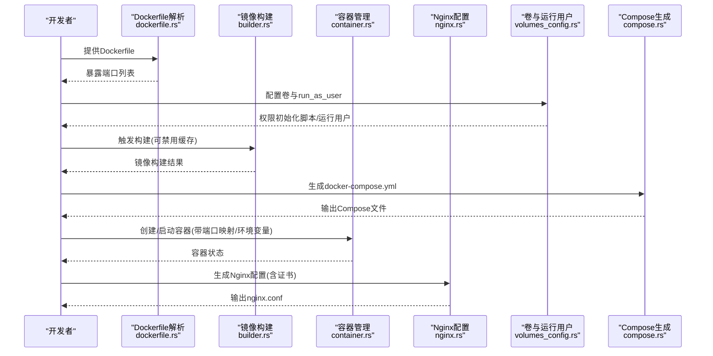
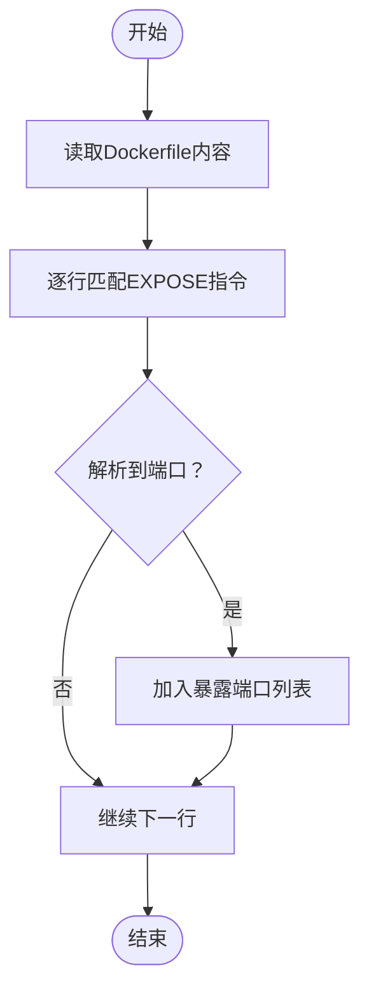
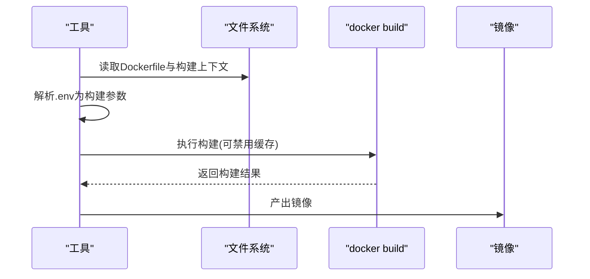
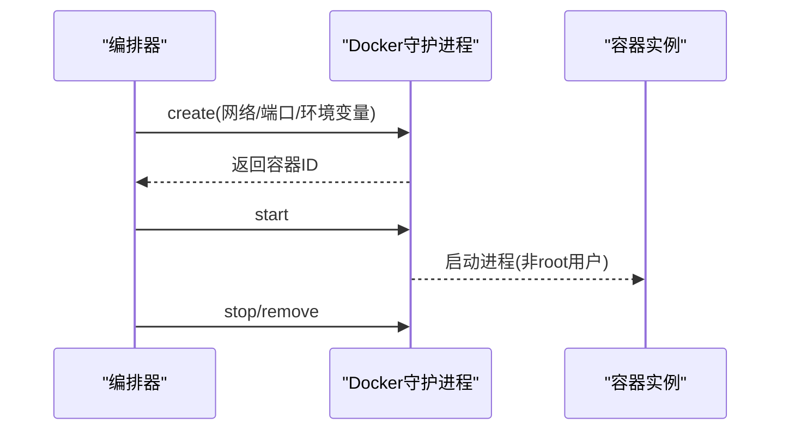
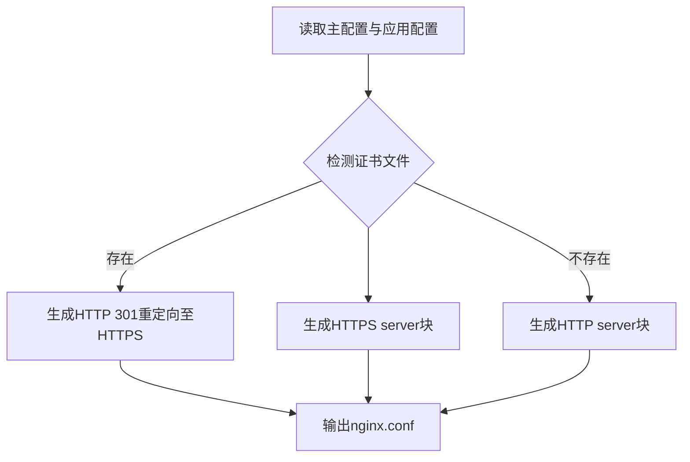
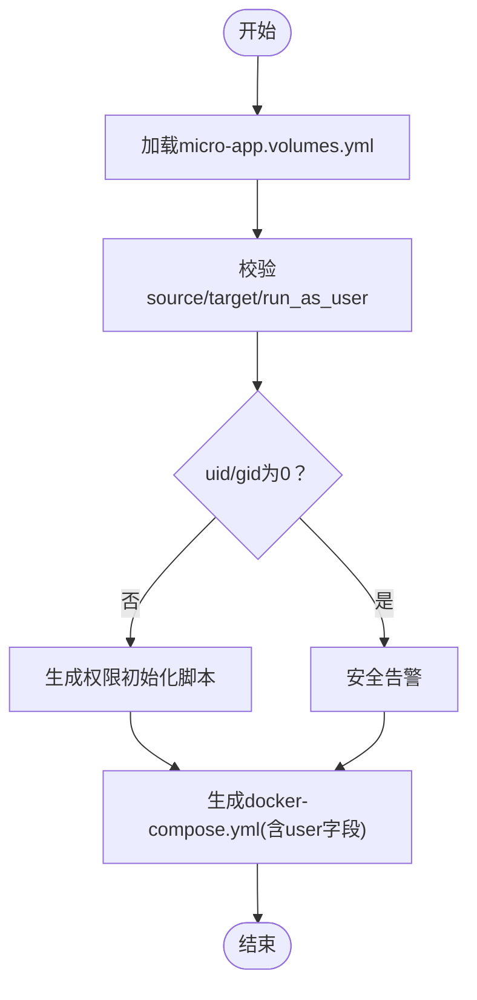
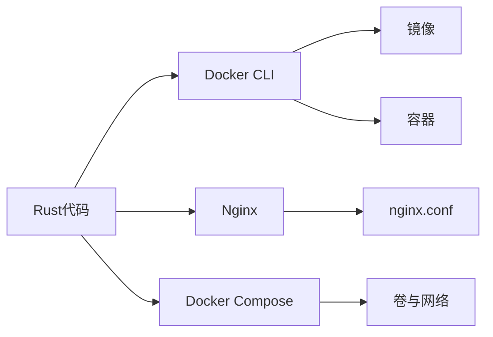

# 安全最佳实践

<cite>
**本文引用的文件**
- [src/dockerfile.rs](file://src/dockerfile.rs)
- [src/builder.rs](file://src/builder.rs)
- [src/container.rs](file://src/container.rs)
- [src/nginx.rs](file://src/nginx.rs)
- [src/config.rs](file://src/config.rs)
- [src/micro_app_config.rs](file://src/micro_app_config.rs)
- [src/volumes_config.rs](file://src/volumes_config.rs)
- [src/compose.rs](file://src/compose.rs)
- [src/discovery.rs](file://src/discovery.rs)
- [src/state.rs](file://src/state.rs)
- [src/network.rs](file://src/network.rs)
- [src/script.rs](file://src/script.rs)
- [src/error.rs](file://src/error.rs)
- [src/lib.rs](file://src/lib.rs)
- [src/main.rs](file://src/main.rs)
- [Cargo.toml](file://Cargo.toml)
- [README.md](file://README.md)
- [deploy_to_local.sh](file://deploy_to_local.sh)
</cite>

## 目录
1. [引言](#引言)
2. [项目结构](#项目结构)
3. [核心组件](#核心组件)
4. [架构总览](#架构总览)
5. [详细组件分析](#详细组件分析)
6. [依赖关系分析](#依赖关系分析)
7. [性能考量](#性能考量)
8. [故障排查指南](#故障排查指南)
9. [结论](#结论)
10. [附录](#附录)

## 引言
本文件聚焦于 Dockerfile 的安全配置与最佳实践，结合代码库中与容器构建、运行、网络、卷挂载、Nginx 反向代理相关的实现，系统阐述非 root 用户运行、最小权限原则、敏感信息保护、镜像扫描与漏洞检测、安全基线检查与合规性验证、以及容器运行时隔离机制等主题。文档以“可落地”的方式给出实践建议与审计要点，帮助在 CI/CD 与生产环境中建立可复用的安全基线。

## 项目结构
该项目是一个基于 Rust 的微应用管理工具，围绕 Docker 镜像构建、容器生命周期管理、Nginx 反向代理与 Docker Compose 编排展开。与安全相关的关键模块包括：
- Dockerfile 解析与端口暴露检查
- 镜像构建与缓存控制
- 容器创建与运行参数注入
- Nginx 配置生成与证书管理
- 卷权限与运行用户配置
- 应用发现与状态管理

图表来源
- [src/main.rs:1-25](file://src/main.rs#L1-L25)
- [src/lib.rs:1-26](file://src/lib.rs#L1-L26)
- [src/builder.rs:1-218](file://src/builder.rs#L1-L218)
- [src/container.rs:1-257](file://src/container.rs#L1-L257)
- [src/nginx.rs:1-800](file://src/nginx.rs#L1-L800)
- [src/dockerfile.rs:1-183](file://src/dockerfile.rs#L1-L183)
- [src/config.rs:1-800](file://src/config.rs#L1-L800)
- [src/micro_app_config.rs:1-235](file://src/micro_app_config.rs#L1-L235)
- [src/volumes_config.rs:1-426](file://src/volumes_config.rs#L1-L426)
- [src/compose.rs](file://src/compose.rs)
- [src/discovery.rs](file://src/discovery.rs)
- [src/state.rs](file://src/state.rs)
- [src/network.rs](file://src/network.rs)
- [src/script.rs](file://src/script.rs)
- [src/error.rs](file://src/error.rs)

章节来源
- [src/main.rs:1-25](file://src/main.rs#L1-L25)
- [src/lib.rs:1-26](file://src/lib.rs#L1-L26)
- [Cargo.toml:1-55](file://Cargo.toml#L1-L55)

## 核心组件
- Dockerfile 解析与端口暴露检查：解析 Dockerfile 并提取 EXPOSE 指令，用于后续安全评估与端口暴露基线校验。
- 镜像构建：封装 docker build 命令调用，支持禁用缓存、构建参数注入与环境变量文件解析。
- 容器管理：封装 docker create/start/stop/rm/ps 等命令，支持端口映射与环境变量注入。
- Nginx 配置生成：根据应用类型与路由生成反向代理配置，支持 ACME 证书与 HTTPS。
- 卷与运行用户：支持卷权限初始化脚本生成与 run_as_user 配置，用于最小权限与非 root 运行。
- Compose 生成：整合应用、卷、网络、运行用户等配置，输出 docker-compose.yml。

章节来源
- [src/dockerfile.rs:16-80](file://src/dockerfile.rs#L16-L80)
- [src/builder.rs:20-120](file://src/builder.rs#L20-L120)
- [src/container.rs:19-176](file://src/container.rs#L19-L176)
- [src/nginx.rs:26-92](file://src/nginx.rs#L26-L92)
- [src/volumes_config.rs:55-143](file://src/volumes_config.rs#L55-L143)
- [src/compose.rs](file://src/compose.rs)

## 架构总览
下图展示了从 Dockerfile 解析到容器运行、再到 Nginx 反向代理的整体流程，以及与卷权限、运行用户、证书管理的交互。

图表来源
- [src/dockerfile.rs:23-67](file://src/dockerfile.rs#L23-L67)
- [src/builder.rs:26-120](file://src/builder.rs#L26-L120)
- [src/container.rs:25-76](file://src/container.rs#L25-L76)
- [src/nginx.rs:31-92](file://src/nginx.rs#L31-L92)
- [src/volumes_config.rs:145-196](file://src/volumes_config.rs#L145-L196)
- [src/compose.rs](file://src/compose.rs)

## 详细组件分析

### Dockerfile 安全解析与端口暴露基线
- 功能概述：解析 Dockerfile，提取 EXPOSE 指令，记录暴露端口集合，用于后续安全基线检查。
- 安全意义：暴露端口越多，攻击面越大；通过基线检查可强制要求仅暴露必要端口。
- 实现要点：大小写不敏感匹配、多端口解析、逐行扫描与日志记录。

图表来源
- [src/dockerfile.rs:45-67](file://src/dockerfile.rs#L45-L67)

章节来源
- [src/dockerfile.rs:23-67](file://src/dockerfile.rs#L23-L67)

### 镜像构建与最小权限原则
- 最小权限原则：通过 run_as_user 与卷权限初始化脚本，确保容器以非 root 用户运行，限制宿主机权限。
- 构建缓存控制：支持禁用缓存构建，减少历史层带来的安全风险累积。
- 环境变量注入：从 .env 文件解析构建参数，避免明文硬编码在 Dockerfile 中。

图表来源
- [src/builder.rs:26-120](file://src/builder.rs#L26-L120)

章节来源
- [src/builder.rs:20-120](file://src/builder.rs#L20-L120)

### 容器运行与隔离机制
- 端口映射与网络：通过 docker create/start/stop/rm/ps 管理容器生命周期，支持端口映射与网络连接。
- 运行时隔离：结合 run_as_user 与卷权限，降低容器逃逸与横向移动风险。
- 环境变量注入：支持在创建阶段注入环境变量，避免在镜像中固化敏感信息。

图表来源
- [src/container.rs:25-176](file://src/container.rs#L25-L176)

章节来源
- [src/container.rs:19-176](file://src/container.rs#L19-L176)

### Nginx 反向代理与证书管理
- 动态 DNS 与解析：使用 Docker 内部 DNS 解析器，提升稳定性与安全性。
- ACME 证书：支持 Let's Encrypt 证书申请与自动配置，包含 ACME 验证路径。
- HTTPS 优化：TLS 版本、密码套件、会话缓存等配置，保障传输安全。

图表来源
- [src/nginx.rs:31-92](file://src/nginx.rs#L31-L92)
- [src/nginx.rs:102-131](file://src/nginx.rs#L102-L131)
- [src/nginx.rs:209-232](file://src/nginx.rs#L209-L232)
- [src/nginx.rs:262-270](file://src/nginx.rs#L262-L270)

章节来源
- [src/nginx.rs:26-92](file://src/nginx.rs#L26-L92)
- [src/nginx.rs:102-131](file://src/nginx.rs#L102-L131)

### 卷权限与运行用户（非 root 运行）
- 卷权限初始化：针对宿主机路径进行 chown/chmod，避免容器以 root 写入宿主机目录。
- 运行用户：支持 uid:gid 或用户名形式，确保容器内进程以非 root 用户运行。
- 安全告警：当检测到 uid/gid 为 0 时发出安全告警，提醒潜在风险。

图表来源
- [src/volumes_config.rs:84-143](file://src/volumes_config.rs#L84-L143)
- [src/volumes_config.rs:145-196](file://src/volumes_config.rs#L145-L196)
- [src/compose.rs](file://src/compose.rs)

章节来源
- [src/volumes_config.rs:55-143](file://src/volumes_config.rs#L55-L143)
- [src/volumes_config.rs:145-196](file://src/volumes_config.rs#L145-L196)
- [src/compose.rs](file://src/compose.rs)

### 应用发现与状态管理
- 应用发现：扫描目录，自动发现包含 micro-app.yml 与 Dockerfile 的微应用。
- 状态管理：基于目录哈希判断是否需要重新构建，减少不必要的重复构建。

章节来源
- [src/discovery.rs](file://src/discovery.rs)
- [src/state.rs](file://src/state.rs)

## 依赖关系分析
- 语言与生态：Rust 生态，依赖日志、配置、正则、异步运行时等库。
- 外部依赖：Docker CLI、Nginx、Docker Compose。
- 关键耦合：镜像构建与容器管理通过 Docker CLI 调用耦合；Nginx 配置与证书管理耦合；卷权限与运行用户通过 Compose 串联。

图表来源
- [Cargo.toml:13-52](file://Cargo.toml#L13-L52)
- [src/builder.rs:54-91](file://src/builder.rs#L54-L91)
- [src/container.rs:30-54](file://src/container.rs#L30-L54)
- [src/nginx.rs:546-556](file://src/nginx.rs#L546-L556)
- [src/compose.rs](file://src/compose.rs)

章节来源
- [Cargo.toml:13-52](file://Cargo.toml#L13-L52)

## 性能考量
- 构建缓存：合理使用缓存可显著缩短构建时间；在安全更新频繁时可选择禁用缓存以保证一致性。
- 日志与调试：在生产环境建议降低日志级别，避免过多 IO 影响性能。
- Nginx 优化：Gzip、keepalive、resolver 缓存等配置可提升代理性能与稳定性。

## 故障排查指南
- 日志查看：使用 -v 参数查看详细日志，结合 docker logs 与 docker ps -a 排查容器状态。
- 端口冲突：检查宿主机端口占用，修改主配置中的 nginx_host_port。
- 卷挂载问题：确认宿主机路径存在与权限正确，使用 docker inspect 查看挂载详情。
- 证书问题：验证证书与密钥文件存在，使用 docker exec <nginx> nginx -t 检查配置。

章节来源
- [README.md:330-401](file://README.md#L330-L401)

## 结论
通过在构建、运行、代理与编排各环节落实非 root 运行、最小权限原则、敏感信息保护与证书管理，结合端口暴露基线检查与卷权限初始化，可显著降低容器化应用的攻击面与运行风险。建议将上述实践纳入 CI/CD 流水线，形成可审计、可追溯、可复用的安全基线。

## 附录

### 安全基线检查清单
- Dockerfile
  - 是否显式声明仅暴露必要端口（通过 EXPOSE 指令）
  - 是否避免在镜像中硬编码敏感信息（使用构建参数或环境变量注入）
  - 是否使用多阶段构建减少攻击面
- 镜像构建
  - 是否定期禁用缓存构建以同步安全补丁
  - 是否使用受信基础镜像并定期更新
- 容器运行
  - 是否以非 root 用户运行（run_as_user）
  - 是否最小化端口映射与网络访问
- 卷与数据
  - 是否为宿主机路径设置合适的 UID/GID（避免 0）
  - 是否生成权限初始化脚本确保容器内可写
- 反向代理
  - 是否启用 HTTPS 并配置强加密套件
  - 是否正确配置 ACME 验证路径
- 合规性与审计
  - 是否保留构建与部署日志
  - 是否对镜像进行漏洞扫描并跟踪修复

### 镜像扫描与漏洞检测集成
- 建议在 CI 中集成镜像扫描工具（如 Trivy、Clair、Snyk），在构建完成后对镜像进行扫描并阻断高危漏洞。
- 将扫描结果与工单系统联动，形成“发现-修复-验证-阻断”的闭环。

### 敏感信息保护与密钥管理
- 使用构建参数或环境变量文件注入敏感信息，避免写入 Dockerfile 或镜像层。
- 通过 Compose 的 secrets 或外部密钥管理服务（如 Vault、KMS）在运行时注入密钥。

### 安全配置审计与监控
- 审计：定期审计 docker-compose.yml 中的 user、volumes、environment 等字段，确保符合最小权限原则。
- 监控：在容器与主机层面开启日志采集与异常告警，关注异常端口暴露、权限变更与证书过期。

### 容器运行时安全配置与隔离机制
- 网络隔离：使用独立 Docker 网络，限制容器间直接连通。
- 资源限制：在 Compose 中设置 CPU/内存限制，防止资源滥用。
- 安全选项：在生产环境启用只读根文件系统、禁用特权模式、移除不必要能力（capabilities）。