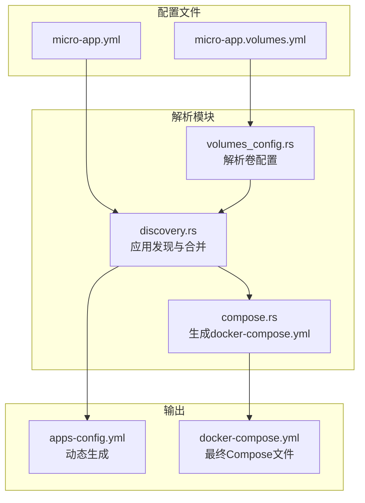
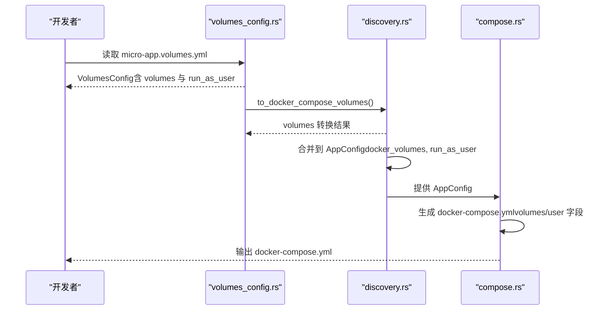
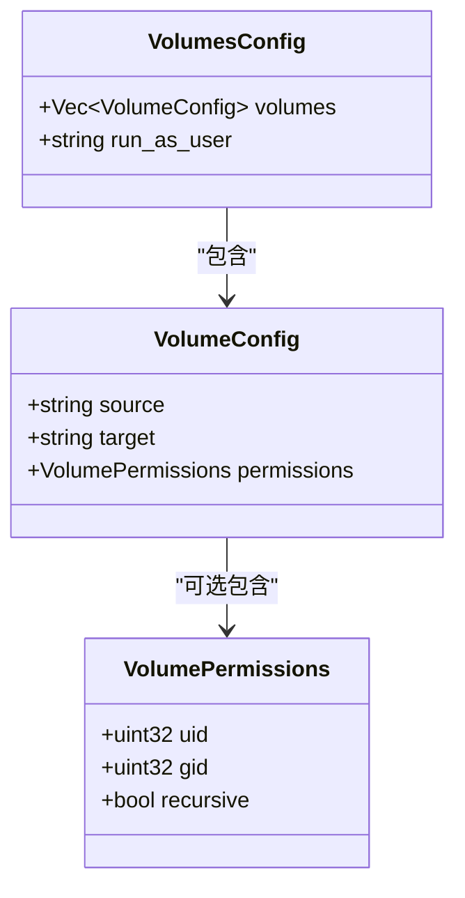
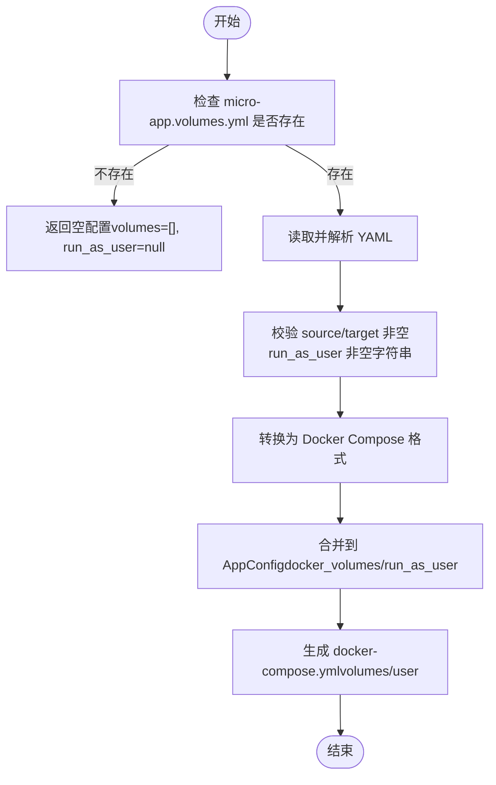
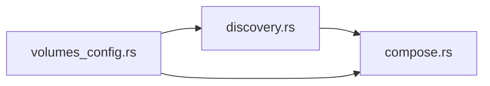

# 卷映射配置

<cite>
**本文引用的文件**
- [volumes_config.rs](file://src/volumes_config.rs)
- [discovery.rs](file://src/discovery.rs)
- [compose.rs](file://src/compose.rs)
- [micro-app-development.md](file://docs/micro-app-development.md)
- [micro-app-volumes-refactor-plan.md](file://docs/micro-app-volumes-refactor-plan.md)
</cite>

## 目录
1. [简介](#简介)
2. [项目结构](#项目结构)
3. [核心组件](#核心组件)
4. [架构概览](#架构概览)
5. [详细组件分析](#详细组件分析)
6. [依赖分析](#依赖分析)
7. [性能考虑](#性能考虑)
8. [故障排查指南](#故障排查指南)
9. [结论](#结论)
10. [附录](#附录)

## 简介
本文围绕 micro-app.volumes.yml 的卷映射配置展开，系统阐述 VolumeConfig 结构体中 source 与 target 字段的配置语法、路径规则、相对路径与绝对路径的解析机制，以及 volumes 数组的配置格式与默认值处理。文档还提供单文件映射、目录映射、多卷配置等实际场景示例，解释卷映射的优先级与覆盖规则，并总结最佳实践、常见错误与调试技巧。

## 项目结构
micro_proxy 通过独立的卷配置文件 micro-app.volumes.yml 实现卷映射与权限管理，与核心配置 micro-app.yml 分离，提升可维护性与扩展性。卷配置文件由 volumes_config 模块解析，随后在 discovery 与 compose 模块中参与应用发现与 Docker Compose 配置生成。

图表来源
- [volumes_config.rs:55-82](file://src/volumes_config.rs#L55-L82)
- [discovery.rs:130-145](file://src/discovery.rs#L130-L145)
- [compose.rs:31-119](file://src/compose.rs#L31-L119)

章节来源
- [volumes_config.rs:1-82](file://src/volumes_config.rs#L1-L82)
- [discovery.rs:130-145](file://src/discovery.rs#L130-L145)
- [compose.rs:31-119](file://src/compose.rs#L31-L119)

## 核心组件
- VolumeConfig：单个卷配置，包含 source（宿主机路径）、target（容器内路径）与可选 permissions（权限配置）。
- VolumePermissions：权限配置，包含 uid、gid 与 recursive（默认 true）。
- VolumesConfig：卷配置文件整体结构，包含 volumes 数组与可选 run_as_user（容器运行用户）。
- 路径解析与生成：
  - VolumesConfig::from_file：从 micro-app.volumes.yml 加载配置；若文件不存在，返回空配置。
  - VolumesConfig::to_docker_compose_volumes：将 volumes 转换为 Docker Compose 的 "source:target" 字符串列表。
  - VolumesConfig::generate_permission_init_script：生成 chown 初始化脚本（按 permissions 生成）。
  - discovery.rs：将 VolumesConfig 合并到 AppConfig，注入 docker_volumes 与 run_as_user。
  - compose.rs：将 docker_volumes 渲染到服务的 volumes 字段，将 run_as_user 渲染到 user 字段。

章节来源
- [volumes_config.rs:29-53](file://src/volumes_config.rs#L29-L53)
- [volumes_config.rs:55-82](file://src/volumes_config.rs#L55-L82)
- [volumes_config.rs:198-204](file://src/volumes_config.rs#L198-L204)
- [volumes_config.rs:145-196](file://src/volumes_config.rs#L145-L196)
- [discovery.rs:130-145](file://src/discovery.rs#L130-L145)
- [compose.rs:325-355](file://src/compose.rs#L325-L355)

## 架构概览
卷配置从文件到最终 Compose 的流转如下：

图表来源
- [volumes_config.rs:55-82](file://src/volumes_config.rs#L55-L82)
- [volumes_config.rs:198-204](file://src/volumes_config.rs#L198-L204)
- [discovery.rs:130-145](file://src/discovery.rs#L130-L145)
- [compose.rs:325-355](file://src/compose.rs#L325-L355)

## 详细组件分析

### VolumeConfig 与 VolumePermissions 结构
- VolumeConfig
  - source：宿主机路径（支持相对路径与绝对路径）
  - target：容器内路径
  - permissions：可选，包含 uid、gid、recursive（默认 true）
- VolumePermissions
  - uid/gid：用户与组 ID
  - recursive：是否递归设置权限，默认 true

图表来源
- [volumes_config.rs:11-22](file://src/volumes_config.rs#L11-L22)
- [volumes_config.rs:29-41](file://src/volumes_config.rs#L29-L41)
- [volumes_config.rs:43-53](file://src/volumes_config.rs#L43-L53)

章节来源
- [volumes_config.rs:11-53](file://src/volumes_config.rs#L11-L53)

### 路径规则与解析机制
- 相对路径与绝对路径
  - 相对路径：相对于动态生成的 docker-compose.yml 所在目录解析。
  - 绝对路径：使用完整路径，如 /var/data。
- 解析与生成
  - VolumesConfig::from_file：若 micro-app.volumes.yml 不存在，返回空配置（volumes 为空数组，run_as_user 为 None）。
  - VolumesConfig::to_docker_compose_volumes：将每个 VolumeConfig 转换为 "source:target" 字符串，形成 volumes 列表。
  - discovery.rs：将 VolumesConfig 的 volumes 转换结果注入 AppConfig 的 docker_volumes；run_as_user 注入 AppConfig 的 run_as_user。
  - compose.rs：将 AppConfig.docker_volumes 渲染为 Docker Compose 的 volumes 字段；将 run_as_user 渲染为 user 字段。

图表来源
- [volumes_config.rs:55-82](file://src/volumes_config.rs#L55-L82)
- [volumes_config.rs:84-143](file://src/volumes_config.rs#L84-L143)
- [volumes_config.rs:198-204](file://src/volumes_config.rs#L198-L204)
- [discovery.rs:130-145](file://src/discovery.rs#L130-L145)
- [compose.rs:325-355](file://src/compose.rs#L325-L355)

章节来源
- [volumes_config.rs:55-143](file://src/volumes_config.rs#L55-L143)
- [volumes_config.rs:198-204](file://src/volumes_config.rs#L198-L204)
- [discovery.rs:130-145](file://src/discovery.rs#L130-L145)
- [compose.rs:325-355](file://src/compose.rs#L325-L355)

### volumes 数组配置格式与默认值
- volumes：数组，元素为 VolumeConfig
  - source：必填，宿主机路径（相对或绝对）
  - target：必填，容器内路径
  - permissions：可选，包含 uid、gid、recursive（recursive 默认 true）
- run_as_user：可选，容器运行用户，格式为 "uid:gid" 或 "username"
- 默认值处理
  - volumes 数组默认为空数组
  - permissions.recursive 默认为 true
  - run_as_user 默认为 None

章节来源
- [volumes_config.rs:43-53](file://src/volumes_config.rs#L43-L53)
- [volumes_config.rs:19-27](file://src/volumes_config.rs#L19-L27)

### 配置示例与场景
- 单文件映射
  - 将宿主机某个文件挂载到容器内对应路径，适合配置文件共享或日志输出。
- 目录映射
  - 将宿主机目录挂载到容器内，常用于数据持久化与日志收集。
- 多卷配置
  - 同时挂载多个目录或文件，满足复杂应用的数据与配置需求。
- 权限与用户
  - 通过 permissions.uid/gid 与 run_as_user 保证容器内进程与宿主机目录权限一致，避免权限错误。

章节来源
- [micro-app-development.md:94-117](file://docs/micro-app-development.md#L94-L117)
- [micro-app-development.md:143-174](file://docs/micro-app-development.md#L143-L174)
- [micro-app-development.md:175-179](file://docs/micro-app-development.md#L175-L179)

### 优先级与覆盖规则
- 文件存在优先：若 micro-app.volumes.yml 存在，则使用其配置；若不存在，则使用空配置（相当于无卷映射与 run_as_user）。
- 合并规则：discovery.rs 将 VolumesConfig 转换并注入 AppConfig，compose.rs 将 AppConfig 渲染到 docker-compose.yml。
- 覆盖规则：同一应用的卷映射与用户设置完全由 micro-app.volumes.yml 决定；如未提供，则不渲染 volumes 与 user 字段。

章节来源
- [volumes_config.rs:55-82](file://src/volumes_config.rs#L55-L82)
- [discovery.rs:130-145](file://src/discovery.rs#L130-L145)
- [compose.rs:325-355](file://src/compose.rs#L325-L355)

## 依赖分析
- volumes_config.rs
  - 依赖 serde_yaml 进行 YAML 解析
  - 依赖 log 进行调试与错误记录
- discovery.rs
  - 依赖 volumes_config.rs 的转换结果
  - 依赖 config.AppConfig 的结构
- compose.rs
  - 依赖 config.AppConfig 的 docker_volumes 与 run_as_user 字段
  - 依赖 serde_yaml 序列化为 YAML

图表来源
- [volumes_config.rs:55-82](file://src/volumes_config.rs#L55-L82)
- [discovery.rs:130-145](file://src/discovery.rs#L130-L145)
- [compose.rs:325-355](file://src/compose.rs#L325-L355)

章节来源
- [volumes_config.rs:55-82](file://src/volumes_config.rs#L55-L82)
- [discovery.rs:130-145](file://src/discovery.rs#L130-L145)
- [compose.rs:325-355](file://src/compose.rs#L325-L355)

## 性能考虑
- 解析与序列化：YAML 解析与 Compose 序列化开销较小，主要瓶颈在磁盘 IO 与 Docker 命令调用。
- 权限初始化脚本：仅在存在权限配置时生成，避免不必要的脚本生成与执行。
- 路径解析：相对路径基于 docker-compose.yml 所在目录解析，避免复杂的路径计算。

## 故障排查指南
- 常见错误
  - source 为空：抛出配置错误，提示 source 不能为空。
  - target 为空：抛出配置错误，提示 target 不能为空。
  - run_as_user 为空字符串：抛出配置错误，提示 run_as_user 不能为空。
  - 权限为 root（uid=0 或 gid=0）：产生安全警告，建议避免使用 root 权限。
- 调试技巧
  - 检查 micro-app.volumes.yml 是否存在且格式正确。
  - 查看 apps-config.yml 中的 docker_volumes 与 run_as_user 字段，确认是否按预期生成。
  - 若出现权限错误，确认 permissions.uid/gid 与 run_as_user 是否一致，且宿主机目录权限允许 chown。
  - 若 volumes 未生效，确认 compose.rs 是否将 docker_volumes 渲染到服务配置。

章节来源
- [volumes_config.rs:84-143](file://src/volumes_config.rs#L84-L143)
- [micro-app-development.md:779-781](file://docs/micro-app-development.md#L779-L781)

## 结论
micro-app.volumes.yml 将卷映射与权限管理从核心配置中分离，提升了可维护性与扩展性。通过 VolumeConfig 与 VolumePermissions 的结构化定义，结合 discovery 与 compose 的自动化处理，实现了从配置文件到 Docker Compose 的无缝转换。遵循本文的路径规则、默认值处理与最佳实践，可有效避免权限与路径相关问题，提升部署稳定性。

## 附录
- 最佳实践
  - 优先使用相对路径，便于在不同环境中迁移。
  - 为每个挂载目录配置 permissions.uid/gid，确保容器内进程可读写。
  - run_as_user 与 permissions.uid/gid 保持一致，避免权限不匹配。
  - recursive 默认为 true，确保子目录与文件权限一致。
- 常见错误避免
  - 避免使用 root 权限（uid=0 或 gid=0）。
  - 确保 source 与 target 均非空。
  - 若不需要卷映射，可仅配置 run_as_user 增强安全性。
- 参考文档
  - micro-app.volumes.yml 配置示例与说明：参见开发指南文档相应章节。

章节来源
- [micro-app-development.md:175-179](file://docs/micro-app-development.md#L175-L179)
- [micro-app-development.md:242-246](file://docs/micro-app-development.md#L242-L246)