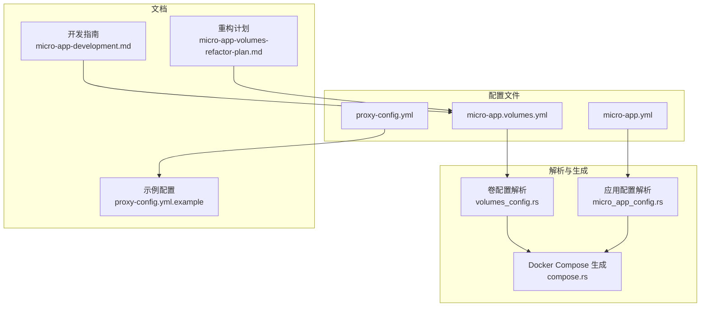
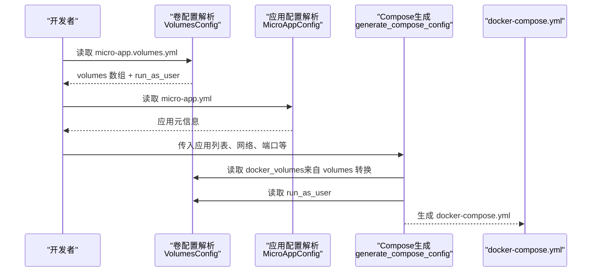
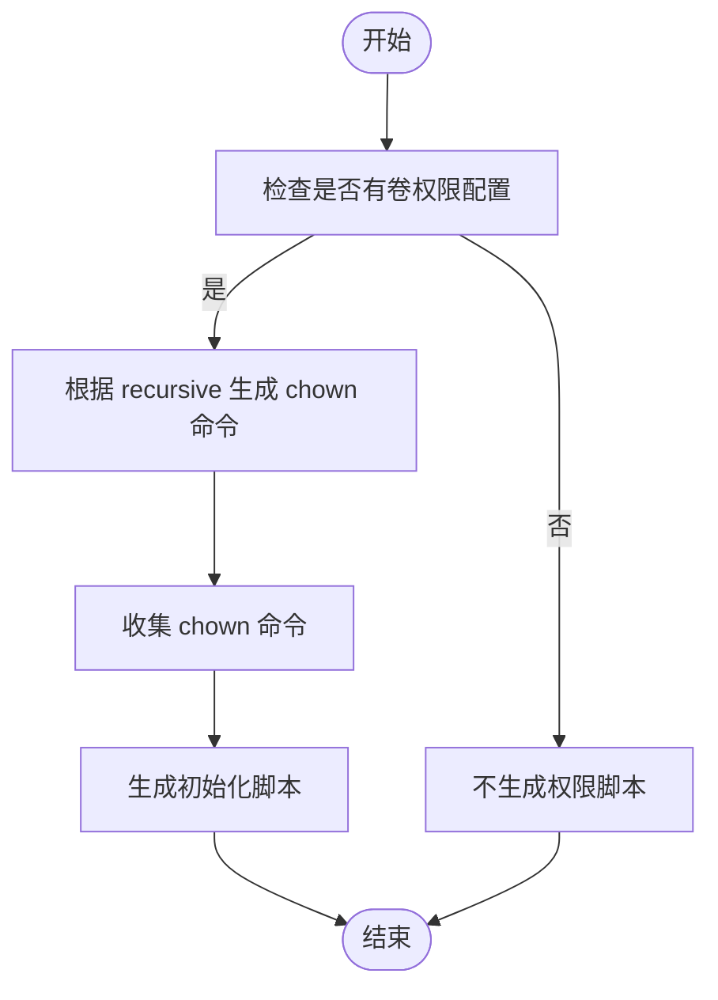
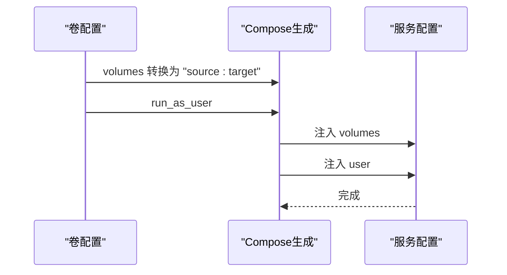
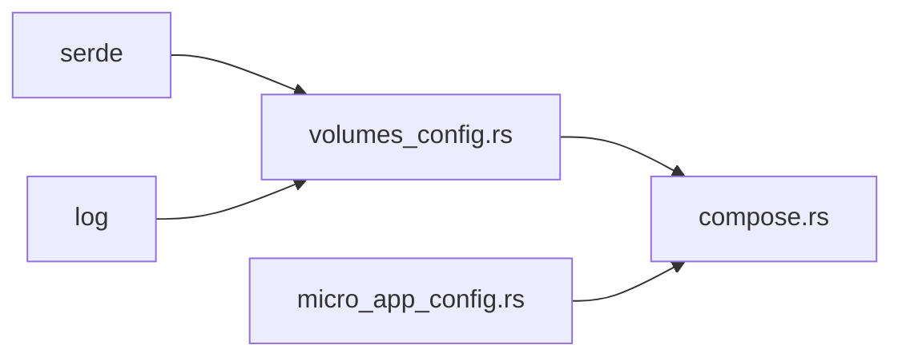

# 卷配置详解

<cite>
**本文引用的文件**
- [volumes_config.rs](file://src/volumes_config.rs)
- [micro_app_config.rs](file://src/micro_app_config.rs)
- [compose.rs](file://src/compose.rs)
- [micro-app-development.md](file://docs/micro-app-development.md)
- [micro-app-volumes-refactor-plan.md](file://docs/micro-app-volumes-refactor-plan.md)
- [proxy-config.yml.example](file://proxy-config.yml.example)
</cite>

## 目录
1. [简介](#简介)
2. [项目结构](#项目结构)
3. [核心组件](#核心组件)
4. [架构总览](#架构总览)
5. [详细组件分析](#详细组件分析)
6. [依赖关系分析](#依赖关系分析)
7. [性能考量](#性能考量)
8. [故障排查指南](#故障排查指南)
9. [结论](#结论)
10. [附录](#附录)

## 简介
本文件面向微应用卷配置，系统性阐述 micro-app.volumes.yml 的配置语法、字段语义与最佳实践，重点覆盖 volumes 数组的 source/target/permissions 字段设置，权限配置原理与安全考虑，以及 run_as_user 的安全配置指南。文档还提供多种数据持久化场景的配置示例，解释权限自动设置机制与安全边界，并结合代码实现说明生成 Docker Compose 时的卷与用户字段处理。

## 项目结构
围绕卷配置的相关模块与文档如下：
- 卷配置解析与生成：src/volumes_config.rs
- 应用配置解析：src/micro_app_config.rs
- Docker Compose 生成：src/compose.rs
- 卷配置文档：docs/micro-app-development.md、docs/micro-app-volumes-refactor-plan.md
- 顶层配置示例：proxy-config.yml.example

图表来源
- [volumes_config.rs:1-205](file://src/volumes_config.rs#L1-L205)
- [micro_app_config.rs:1-107](file://src/micro_app_config.rs#L1-L107)
- [compose.rs:31-119](file://src/compose.rs#L31-L119)
- [micro-app-development.md:90-248](file://docs/micro-app-development.md#L90-L248)
- [micro-app-volumes-refactor-plan.md:1-147](file://docs/micro-app-volumes-refactor-plan.md#L1-L147)
- [proxy-config.yml.example:1-53](file://proxy-config.yml.example#L1-L53)

章节来源
- [volumes_config.rs:1-205](file://src/volumes_config.rs#L1-L205)
- [micro_app_config.rs:1-107](file://src/micro_app_config.rs#L1-L107)
- [compose.rs:31-119](file://src/compose.rs#L31-L119)
- [micro-app-development.md:90-248](file://docs/micro-app-development.md#L90-L248)
- [micro-app-volumes-refactor-plan.md:1-147](file://docs/micro-app-volumes-refactor-plan.md#L1-L147)
- [proxy-config.yml.example:1-53](file://proxy-config.yml.example#L1-L53)

## 核心组件
- 卷配置模型
  - volumes 数组：每个元素包含 source、target、permissions 三个字段；permissions 可选。
  - run_as_user：可选，指定容器运行用户，格式为 "uid:gid" 或 "username"。
- 解析与校验
  - 从 micro-app.volumes.yml 加载 YAML，若文件不存在则视为无配置。
  - 校验 source/target 非空；对权限配置中的 uid/gid=0 发出安全告警。
- 权限初始化脚本生成
  - 若存在卷权限配置，生成 chown 初始化脚本，支持递归/非递归两种模式。
- Docker Compose 生成
  - 将 volumes 转换为 "source:target" 字符串列表。
  - 将 run_as_user 注入到对应服务的 user 字段。

章节来源
- [volumes_config.rs:44-143](file://src/volumes_config.rs#L44-L143)
- [volumes_config.rs:145-204](file://src/volumes_config.rs#L145-L204)

## 架构总览
卷配置在整体流程中的位置与交互如下：

图表来源
- [volumes_config.rs:57-82](file://src/volumes_config.rs#L57-L82)
- [compose.rs:31-119](file://src/compose.rs#L31-L119)
- [micro-app-development.md:694-732](file://docs/micro-app-development.md#L694-L732)

章节来源
- [compose.rs:268-424](file://src/compose.rs#L268-L424)
- [micro-app-development.md:694-732](file://docs/micro-app-development.md#L694-L732)

## 详细组件分析

### 卷配置模型与字段说明
- volumes 数组
  - 每个元素包含：
    - source：宿主机路径（支持相对/绝对路径，相对路径以动态生成的 docker-compose.yml 所在目录为基准）。
    - target：容器内路径。
    - permissions：可选，包含 uid、gid、recursive。
- run_as_user
  - 可选，格式为 "uid:gid" 或 "username"。Compose 生成时写入服务的 user 字段。

章节来源
- [volumes_config.rs:29-53](file://src/volumes_config.rs#L29-L53)
- [micro-app-development.md:119-142](file://docs/micro-app-development.md#L119-L142)

### 权限配置与自动设置机制
- 权限字段
  - uid/gid：宿主机目录所有者与所属组。
  - recursive：是否递归设置权限。
  - 默认 recursive=true。
- 自动设置机制
  - 若存在权限配置，生成 chown 初始化脚本：
    - 递归模式：chown -R uid:gid source
    - 非递归模式：chown uid:gid source
  - 注意：该脚本由工具生成，实际执行需具备相应权限（通常为 root）。
- 安全告警
  - 当 uid=0 或 gid=0 时发出安全警告，提示潜在风险。

图表来源
- [volumes_config.rs:145-196](file://src/volumes_config.rs#L145-L196)

章节来源
- [volumes_config.rs:10-27](file://src/volumes_config.rs#L10-L27)
- [volumes_config.rs:145-196](file://src/volumes_config.rs#L145-L196)
- [volumes_config.rs:117-126](file://src/volumes_config.rs#L117-L126)

### run_as_user 安全配置指南
- 作用
  - 指定容器内进程以特定用户运行，避免使用 root。
- 推荐策略
  - 与 permissions.uid/gid 保持一致，确保宿主机目录与容器内进程用户一致。
  - 若使用官方镜像，通常镜像内已有固定用户，优先采用“适配容器内用户”的策略。
- 注意事项
  - run_as_user 与 permissions 可独立使用，但建议成对配置。
  - 空字符串非法，会触发校验错误。

章节来源
- [volumes_config.rs:129-139](file://src/volumes_config.rs#L129-L139)
- [micro-app-development.md:180-247](file://docs/micro-app-development.md#L180-L247)

### Docker Compose 生成与卷映射
- 卷映射转换
  - volumes 数组转换为 "source:target" 字符串列表，注入到服务的 volumes 字段。
- 用户字段注入
  - 若 run_as_user 存在，则注入到服务的 user 字段。
- 生成流程
  - generate_compose_config 会读取每个应用的 docker_volumes 与 run_as_user 并写入 Compose。

图表来源
- [volumes_config.rs:198-204](file://src/volumes_config.rs#L198-L204)
- [compose.rs:325-355](file://src/compose.rs#L325-L355)

章节来源
- [volumes_config.rs:198-204](file://src/volumes_config.rs#L198-L204)
- [compose.rs:268-424](file://src/compose.rs#L268-L424)

### 数据持久化场景配置示例
以下示例均来自开发指南文档，展示常见持久化场景的配置思路与注意事项。请按需在 micro-app.volumes.yml 中配置。

- 日志持久化
  - 将容器内日志目录挂载到宿主机，便于查看与备份。
  - 示例路径与权限策略参见开发指南中的“日志输出”示例。

- 配置文件共享
  - 将宿主机配置挂载到容器，实现热更新与共享。
  - 示例路径与权限策略参见开发指南中的“配置文件共享”示例。

- 用户上传目录
  - 将上传目录挂载到宿主机，保证上传文件持久化。
  - 示例路径与权限策略参见开发指南中的“SPA 应用部署要点”与“用户上传”示例。

- 数据库存储
  - 将数据库数据目录挂载到宿主机，实现数据持久化。
  - 示例路径与权限策略参见开发指南中的“Internal 类型应用”示例。

- 官方镜像与自定义镜像的权限策略
  - 官方镜像：适配镜像内固定用户，permissions 配置为镜像内用户 uid/gid，不配置 run_as_user。
  - 自定义镜像：适配宿主机用户，permissions 配置为宿主机用户 uid/gid，run_as_user 与之保持一致。

章节来源
- [micro-app-development.md:143-247](file://docs/micro-app-development.md#L143-L247)
- [micro-app-development.md:282-295](file://docs/micro-app-development.md#L282-L295)
- [micro-app-development.md:383-403](file://docs/micro-app-development.md#L383-L403)
- [micro-app-development.md:458-478](file://docs/micro-app-development.md#L458-L478)
- [micro-app-development.md:527-542](file://docs/micro-app-development.md#L527-L542)

## 依赖关系分析
- 卷配置模块
  - 依赖 serde 进行 YAML 序列化/反序列化。
  - 依赖日志库记录加载/验证/生成过程。
- Compose 生成模块
  - 依赖卷配置模块提供的 volumes 与 run_as_user。
  - 依赖应用配置模块提供的应用元信息（容器名、端口、类型等）。

图表来源
- [volumes_config.rs:6-8](file://src/volumes_config.rs#L6-L8)
- [compose.rs:6-9](file://src/compose.rs#L6-L9)

章节来源
- [volumes_config.rs:6-8](file://src/volumes_config.rs#L6-L8)
- [compose.rs:6-9](file://src/compose.rs#L6-L9)

## 性能考量
- 权限初始化脚本
  - 递归设置权限会遍历目录树，大目录可能带来一定开销。建议仅对必要目录递归设置，或在 CI 构建阶段预设权限。
- 卷映射数量
  - 卷过多会增加挂载开销与管理复杂度。建议合并相近用途的卷，减少映射条目。
- 用户与权限一致性
  - 保持 permissions 与 run_as_user 一致可避免容器内权限异常导致的重试与失败，提升启动稳定性。

## 故障排查指南
- 常见错误与定位
  - source 为空：卷配置校验会报错，检查 micro-app.volumes.yml 中的 source 字段。
  - target 为空：卷配置校验会报错，检查 micro-app.volumes.yml 中的 target 字段。
  - run_as_user 为空字符串：校验会报错，检查 micro-app.volumes.yml 中的 run_as_user 字段。
  - uid/gid=0：出现安全告警，建议改为非 root 用户。
- 生成的 docker-compose.yml 校验
  - volumes 字段：确认每个服务的 volumes 列表与预期一致。
  - user 字段：确认 run_as_user 已正确注入到对应服务。
- 权限问题排查
  - 若容器内无法写入挂载目录，检查宿主机目录权限与所有者是否与 permissions 一致。
  - 若使用递归设置，确认宿主机目录大小与层级，避免长时间 chown 操作。

章节来源
- [volumes_config.rs:84-143](file://src/volumes_config.rs#L84-L143)
- [compose.rs:325-355](file://src/compose.rs#L325-L355)

## 结论
micro-app.volumes.yml 将卷与权限配置从应用核心配置中解耦，提升了可维护性与扩展性。通过合理的 source/target/permissions 配置与 run_as_user 的安全策略，可实现稳定的数据持久化与良好的权限隔离。建议在生产环境中遵循“非 root 用户 + 一致性权限”的原则，并结合文档中的场景示例进行配置。

## 附录
- 配置文件位置与生成
  - micro-app.volumes.yml：位于微应用根目录，可选文件。
  - apps-config.yml：由工具自动生成，记录应用的 docker_volumes 与 run_as_user。
  - docker-compose.yml：由工具生成，包含各服务的 volumes 与 user 字段。
- 参考文档
  - 开发指南：涵盖配置文件总览、卷配置详解、类型应用示例与部署要点。
  - 重构计划：说明卷配置从 micro-app.yml 迁移到 micro-app.volumes.yml 的设计目标与实现方案。

章节来源
- [micro-app-development.md:25-45](file://docs/micro-app-development.md#L25-L45)
- [micro-app-development.md:594-732](file://docs/micro-app-development.md#L594-L732)
- [micro-app-volumes-refactor-plan.md:1-147](file://docs/micro-app-volumes-refactor-plan.md#L1-L147)
- [proxy-config.yml.example:1-53](file://proxy-config.yml.example#L1-L53)