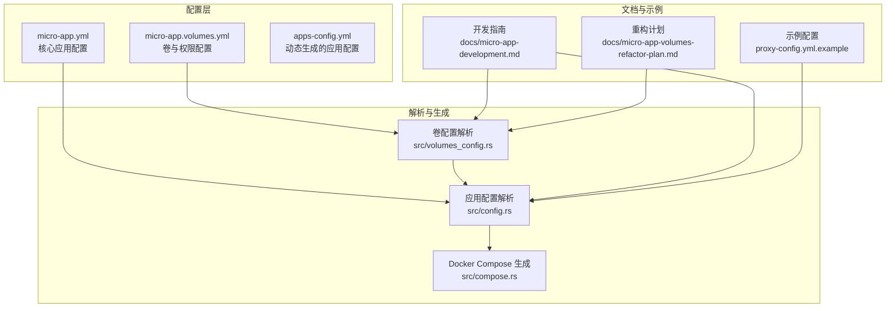
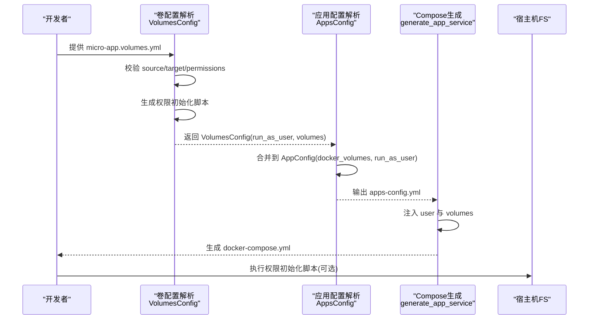
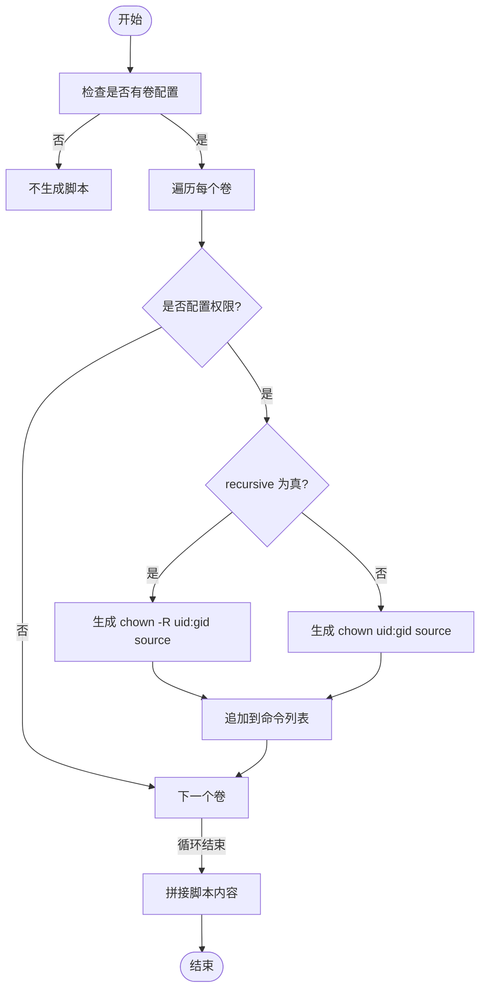
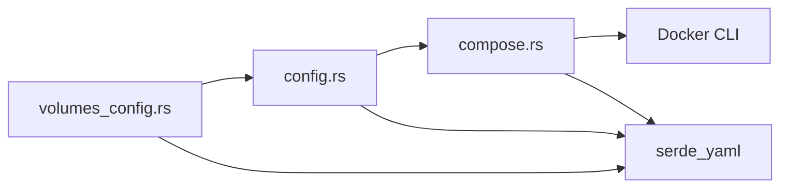

# 安全配置考虑

<cite>
**本文引用的文件**
- [src/volumes_config.rs](file://src/volumes_config.rs)
- [src/config.rs](file://src/config.rs)
- [src/compose.rs](file://src/compose.rs)
- [src/micro_app_config.rs](file://src/micro_app_config.rs)
- [src/error.rs](file://src/error.rs)
- [docs/micro-app-development.md](file://docs/micro-app-development.md)
- [docs/micro-app-volumes-refactor-plan.md](file://docs/micro-app-volumes-refactor-plan.md)
- [proxy-config.yml.example](file://proxy-config.yml.example)
</cite>

## 目录
1. [简介](#简介)
2. [项目结构](#项目结构)
3. [核心组件](#核心组件)
4. [架构总览](#架构总览)
5. [详细组件分析](#详细组件分析)
6. [依赖分析](#依赖分析)
7. [性能考量](#性能考量)
8. [故障排查指南](#故障排查指南)
9. [结论](#结论)
10. [附录](#附录)

## 简介
本文件聚焦于“卷配置”的安全考虑与最佳实践，围绕 run_as_user 字段的安全配置原理、UID/GID 映射与权限继承、root 权限风险与规避、权限初始化脚本的自动生成与安全边界进行系统化阐述，并提供检查清单、审计方法、常见漏洞预防与应急处理方案。

## 项目结构
本项目采用模块化组织，与卷与用户安全相关的关键模块如下：
- 卷配置模块：负责解析 micro-app.volumes.yml，校验权限配置，生成权限初始化脚本
- 应用配置模块：负责解析 micro-app.yml，合并卷配置，生成 apps-config.yml
- Docker Compose 生成模块：负责将 run_as_user 等安全配置注入 docker-compose.yml
- 文档：提供卷与用户安全的使用场景、策略与注意事项

图表来源
- [src/volumes_config.rs:55-205](file://src/volumes_config.rs#L55-L205)
- [src/config.rs:24-123](file://src/config.rs#L24-L123)
- [src/compose.rs:31-119](file://src/compose.rs#L31-L119)
- [docs/micro-app-development.md:90-247](file://docs/micro-app-development.md#L90-L247)
- [docs/micro-app-volumes-refactor-plan.md:101-125](file://docs/micro-app-volumes-refactor-plan.md#L101-L125)
- [proxy-config.yml.example:1-53](file://proxy-config.yml.example#L1-L53)

章节来源
- [src/volumes_config.rs:55-205](file://src/volumes_config.rs#L55-L205)
- [src/config.rs:24-123](file://src/config.rs#L24-L123)
- [src/compose.rs:31-119](file://src/compose.rs#L31-L119)
- [docs/micro-app-development.md:90-247](file://docs/micro-app-development.md#L90-L247)
- [docs/micro-app-volumes-refactor-plan.md:101-125](file://docs/micro-app-volumes-refactor-plan.md#L101-L125)
- [proxy-config.yml.example:1-53](file://proxy-config.yml.example#L1-L53)

## 核心组件
- 卷权限模型
  - VolumePermissions：包含 uid、gid、recursive 三个字段，用于控制宿主机目录的属主与权限继承策略
  - VolumesConfig：聚合卷列表与 run_as_user，提供校验与脚本生成能力
- 应用配置与卷合并
  - AppConfig：承载 run_as_user 与 docker_volumes，用于生成 docker-compose
  - AppsConfig：动态生成 apps-config.yml，将 micro-app.volumes.yml 的卷与用户配置注入
- Docker Compose 注入
  - generate_app_service：将 run_as_user 注入 user 字段；将 volumes 注入 volumes 字段
- 权限初始化脚本
  - generate_permission_init_script：按卷权限生成 chown 命令，支持递归与非递归两种模式

章节来源
- [src/volumes_config.rs:10-53](file://src/volumes_config.rs#L10-L53)
- [src/volumes_config.rs:55-205](file://src/volumes_config.rs#L55-L205)
- [src/config.rs:24-68](file://src/config.rs#L24-L68)
- [src/compose.rs:277-356](file://src/compose.rs#L277-L356)

## 架构总览
卷与用户安全在系统中的关键流转如下：
- 解析阶段：读取 micro-app.yml 与 micro-app.volumes.yml，校验权限与用户格式
- 合并阶段：将卷与用户配置合并到 AppConfig，生成 apps-config.yml
- 生成阶段：将 run_as_user 注入 docker-compose 的 user 字段，将 volumes 注入 volumes 字段
- 初始化阶段：生成权限初始化脚本，确保宿主机目录权限与容器内用户匹配

图表来源
- [src/volumes_config.rs:84-143](file://src/volumes_config.rs#L84-L143)
- [src/volumes_config.rs:145-196](file://src/volumes_config.rs#L145-L196)
- [src/config.rs:205-218](file://src/config.rs#L205-L218)
- [src/compose.rs:277-356](file://src/compose.rs#L277-L356)

## 详细组件分析

### run_as_user 字段的安全配置原理与使用场景
- 字段来源与格式
  - AppConfig.run_as_user：支持 uid:gid 格式与用户名格式，来源于 micro-app.volumes.yml
  - 在生成 docker-compose 时，直接注入到服务的 user 字段
- 使用场景
  - 官方镜像（如 nginx、redis）：容器内已有固定用户，建议使用 permissions.uid/gid 适配容器内用户，不配置 run_as_user
  - 自定义镜像：若希望容器内进程以宿主机用户身份运行，需同时配置 permissions.uid/gid 与 run_as_user，二者保持一致
- 安全边界
  - run_as_user 仅影响容器内进程的用户身份，不改变宿主机目录权限；权限初始化脚本负责修正宿主机目录属主

章节来源
- [src/config.rs:63-67](file://src/config.rs#L63-L67)
- [src/compose.rs:325-332](file://src/compose.rs#L325-L332)
- [docs/micro-app-development.md:184-247](file://docs/micro-app-development.md#L184-L247)

### root 权限的潜在风险与规避方法
- 风险点
  - uid=0 或 gid=0 表示 root 权限，可能导致容器内进程获得宿主机最高权限，扩大攻击面
  - 若容器内进程以 root 运行，一旦被攻破，攻击者可直接控制宿主机
- 规避方法
  - 明确禁止在 permissions.uid/gid 中使用 0
  - 优先使用非 root 用户运行容器（如 nginx、redis 默认用户）
  - 若必须使用 root，应在最小化原则下审慎评估，并配合其他安全加固（如只读文件系统、最小权限网络）

章节来源
- [src/volumes_config.rs:117-126](file://src/volumes_config.rs#L117-L126)
- [docs/micro-app-development.md:242-247](file://docs/micro-app-development.md#L242-L247)

### 容器内外用户ID映射与权限继承
- 映射机制
  - 宿主机与容器各自维护独立的 UID/GID 空间；容器内进程的 UID/GID 与宿主机不一定相同
  - 通过 run_as_user 指定容器内用户；通过 permissions.uid/gid 指定宿主机目录属主
- 权限继承
  - recursive=true：递归设置目录及其子目录/文件的属主与权限
  - recursive=false：仅设置顶层目录属主，子目录/文件可能仍为 root
- 最佳实践
  - 对于官方镜像：permissions.uid/gid 与镜像默认用户一致，run_as_user 不配置
  - 对于自定义镜像：permissions.uid/gid 与 run_as_user 保持一致，确保容器内与宿主机一致

章节来源
- [docs/micro-app-development.md:184-247](file://docs/micro-app-development.md#L184-L247)
- [src/volumes_config.rs:19-27](file://src/volumes_config.rs#L19-L27)

### 权限初始化脚本的自动生成与安全边界
- 自动化生成
  - generate_permission_init_script：遍历卷配置，生成 chown 命令；支持递归与非递归
  - 仅在存在卷权限配置时生成脚本；无卷或无权限配置时不生成
- 安全边界
  - 脚本在容器启动前执行，需要宿主机具备修改目录所有者的权限（通常为 root）
  - 生成的脚本仅包含 chown 命令，不包含敏感参数或环境变量
  - 生成的脚本长度可追踪，便于审计

图表来源
- [src/volumes_config.rs:145-196](file://src/volumes_config.rs#L145-L196)

章节来源
- [src/volumes_config.rs:145-196](file://src/volumes_config.rs#L145-L196)

### Docker Compose 中的用户与卷注入
- user 字段注入
  - generate_app_service：当 AppConfig.run_as_user 存在时，注入 user 字段
- volumes 字段注入
  - generate_app_service：将 AppConfig.docker_volumes 注入 volumes 字段
- 安全影响
  - user 字段确保容器内进程以指定用户运行，降低权限滥用风险
  - volumes 字段确保容器内挂载路径与宿主机目录一一对应，避免路径歧义

章节来源
- [src/compose.rs:325-356](file://src/compose.rs#L325-L356)

### 配置校验与告警机制
- 卷配置校验
  - source/target 非空校验
  - permissions.uid/gid 为 0 时发出安全告警
- 应用配置校验
  - run_as_user 非空校验
  - 应用类型与 routes、path 等字段一致性校验
- 错误类型
  - 使用统一的 Error 枚举，便于定位与处理

章节来源
- [src/volumes_config.rs:84-143](file://src/volumes_config.rs#L84-L143)
- [src/config.rs:220-347](file://src/config.rs#L220-L347)
- [src/error.rs:5-46](file://src/error.rs#L5-L46)

## 依赖分析
- 模块耦合
  - volumes_config.rs 与 config.rs：前者提供卷与用户配置，后者将其合并到 AppConfig
  - config.rs 与 compose.rs：前者生成 apps-config.yml，后者消费 AppConfig 生成 docker-compose.yml
- 外部依赖
  - Docker CLI：compose.rs 通过命令行调用 docker
  - YAML 解析：serde_yaml 用于解析配置文件

图表来源
- [src/volumes_config.rs:55-205](file://src/volumes_config.rs#L55-L205)
- [src/config.rs:205-218](file://src/config.rs#L205-L218)
- [src/compose.rs:31-119](file://src/compose.rs#L31-L119)

章节来源
- [src/volumes_config.rs:55-205](file://src/volumes_config.rs#L55-L205)
- [src/config.rs:205-218](file://src/config.rs#L205-L218)
- [src/compose.rs:31-119](file://src/compose.rs#L31-L119)

## 性能考量
- 权限初始化脚本生成为 O(n)（n 为卷数量），通常开销极小
- Docker Compose 生成为 O(m)（m 为服务数量），受应用规模影响
- 建议在 CI/CD 中缓存生成结果，减少重复计算

## 故障排查指南
- 常见问题与定位
  - 卷权限告警：permissions.uid/gid 为 0 时触发告警，建议改为非 root 用户
  - run_as_user 格式错误：空字符串或非法格式会导致校验失败
  - 权限初始化脚本未生成：确认存在卷权限配置
- 审计方法
  - 检查 apps-config.yml 中的 run_as_user 与 docker_volumes 字段
  - 检查生成的 docker-compose.yml 中 user 与 volumes 字段
  - 检查权限初始化脚本内容与长度
- 应急处理
  - 临时降级：将 permissions.uid/gid 设为非 root，或移除 run_as_user
  - 临时修复：在宿主机手动执行 chown 命令，确保目录属主与容器内用户一致

章节来源
- [src/volumes_config.rs:117-143](file://src/volumes_config.rs#L117-L143)
- [src/config.rs:337-347](file://src/config.rs#L337-L347)
- [src/compose.rs:325-356](file://src/compose.rs#L325-L356)

## 结论
通过将卷与用户配置分离、在生成阶段注入 user 与 volumes 字段、并在启动前生成权限初始化脚本，系统实现了“容器内用户身份”与“宿主机目录属主”的一致性，有效降低了 root 权限带来的安全风险。遵循本文的最佳实践与检查清单，可在保证功能可用的同时显著提升系统的安全性与可审计性。

## 附录

### 安全配置检查清单
- 卷配置
  - source/target 是否非空
  - permissions.uid/gid 是否为非 root（>0）
  - recursive 是否符合预期（true 递归，false 非递归）
- 用户配置
  - run_as_user 是否非空
  - run_as_user 与 permissions.uid/gid 是否一致（自定义镜像场景）
- 生成配置
  - docker-compose.yml 中 user 与 volumes 字段是否正确
  - 权限初始化脚本是否存在且内容合理
- 审计与告警
  - 是否记录并审查权限告警
  - 是否在 CI/CD 中进行配置校验

章节来源
- [src/volumes_config.rs:84-143](file://src/volumes_config.rs#L84-L143)
- [src/compose.rs:325-356](file://src/compose.rs#L325-L356)
- [docs/micro-app-development.md:90-247](file://docs/micro-app-development.md#L90-L247)