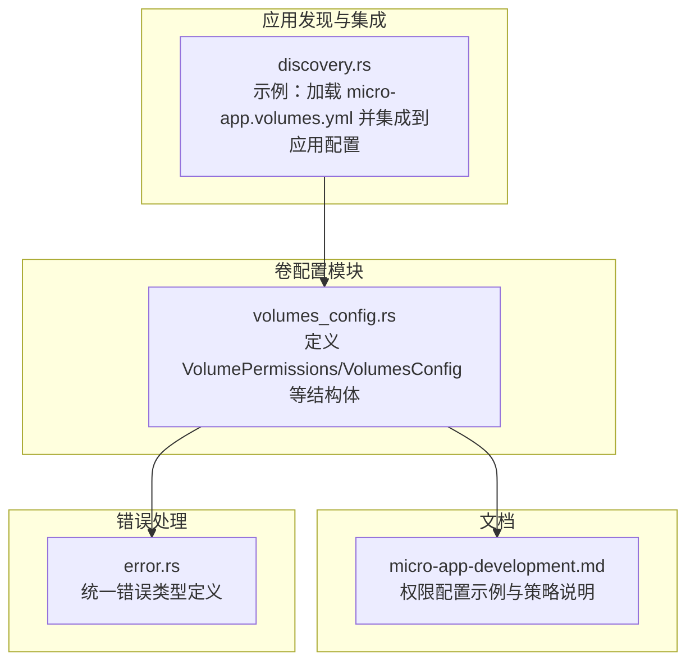
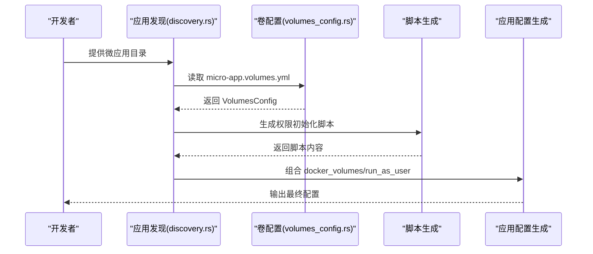
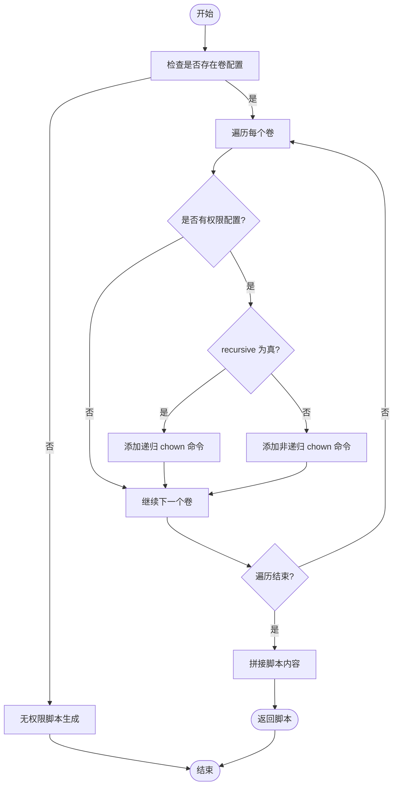
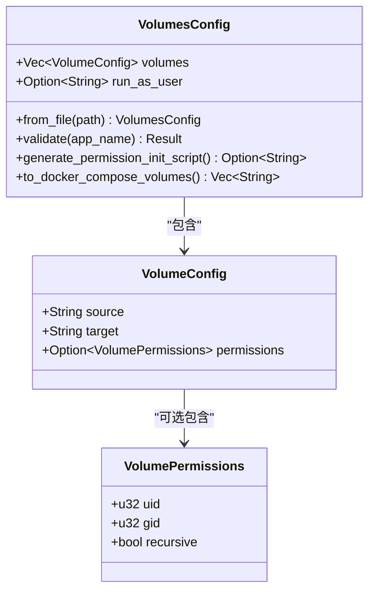

# 权限管理配置

<cite>
**本文引用的文件**
- [volumes_config.rs](file://src/volumes_config.rs)
- [micro-app-development.md](file://docs/micro-app-development.md)
- [error.rs](file://src/error.rs)
- [discovery.rs](file://src/discovery.rs)
</cite>

## 目录
1. [简介](#简介)
2. [项目结构](#项目结构)
3. [核心组件](#核心组件)
4. [架构概览](#架构概览)
5. [详细组件分析](#详细组件分析)
6. [依赖关系分析](#依赖关系分析)
7. [性能考量](#性能考量)
8. [故障排查指南](#故障排查指南)
9. [结论](#结论)
10. [附录](#附录)

## 简介
本文围绕 micro-app.volumes.yml 文件中的权限管理配置展开，系统阐述 VolumePermissions 结构体的配置语法、字段语义与默认行为；解释用户ID(uid)与组ID(gid)的获取与设置机制；说明默认递归设置为 true 的行为及其对目录树的影响；给出官方镜像与自定义镜像在权限设置上的差异策略；并总结安全考虑、最佳实践以及权限验证与错误处理机制。

## 项目结构
与权限管理相关的核心代码集中在卷配置模块，文档中提供了完整的配置示例与使用场景说明。

图表来源
- [volumes_config.rs:1-205](file://src/volumes_config.rs#L1-L205)
- [micro-app-development.md:90-247](file://docs/micro-app-development.md#L90-L247)
- [error.rs:1-50](file://src/error.rs#L1-L50)
- [discovery.rs:467-477](file://src/discovery.rs#L467-L477)

章节来源
- [volumes_config.rs:1-205](file://src/volumes_config.rs#L1-L205)
- [micro-app-development.md:90-247](file://docs/micro-app-development.md#L90-L247)

## 核心组件
- VolumePermissions：定义卷权限配置，包含 uid、gid、recursive 三个字段。
- VolumeConfig：单个卷条目，包含 source、target 与可选的 permissions。
- VolumesConfig：整个 micro-app.volumes.yml 的结构，包含 volumes 列表与可选的 run_as_user。
- 权限初始化脚本生成：根据配置生成 chown 命令，按需递归设置目录权限。
- 验证与错误处理：对配置进行校验并在异常时返回统一的错误类型。

章节来源
- [volumes_config.rs:10-53](file://src/volumes_config.rs#L10-L53)
- [volumes_config.rs:145-205](file://src/volumes_config.rs#L145-L205)
- [volumes_config.rs:84-143](file://src/volumes_config.rs#L84-L143)
- [error.rs:6-46](file://src/error.rs#L6-L46)

## 架构概览
权限管理配置在应用发现与生成流程中的位置如下：

图表来源
- [discovery.rs:467-477](file://src/discovery.rs#L467-L477)
- [discovery.rs:694-704](file://src/discovery.rs#L694-L704)
- [volumes_config.rs:145-205](file://src/volumes_config.rs#L145-L205)

## 详细组件分析

### VolumePermissions 结构体与配置语法
- 字段定义
  - uid：用户ID，u32 类型，必填。
  - gid：组ID，u32 类型，必填。
  - recursive：是否递归设置权限，布尔类型，默认值为 true。
- 默认行为
  - recursive 字段使用 serde 的默认值函数，未显式指定时默认为 true。
- 配置示例与说明
  - 文档提供了多种配置示例，涵盖递归与非递归两种模式，以及 run_as_user 的配合使用。

章节来源
- [volumes_config.rs:10-27](file://src/volumes_config.rs#L10-L27)
- [micro-app-development.md:94-117](file://docs/micro-app-development.md#L94-L117)
- [micro-app-development.md:129-141](file://docs/micro-app-development.md#L129-L141)

### 用户ID与组ID的获取与设置机制
- 获取方式
  - 官方镜像：通常镜像内已内置固定用户(uid/gid)，配置时直接使用镜像默认用户即可。
  - 自定义镜像：容器内用户由镜像构建时决定，需要在 micro-app.volumes.yml 中显式设置 permissions.uid/gid 与 run_as_user，使其保持一致。
- 设置策略
  - 适配容器内用户（官方镜像）：不配置 run_as_user，permissions.uid/gid 设为容器内进程的 uid/gid。
  - 适配宿主机用户（自定义镜像）：permissions.uid/gid 设为宿主机用户 uid/gid，run_as_user 也设为相同 uid/gid。
- 注意事项
  - 若使用 run_as_user，建议同时配置 permissions.uid/gid，二者保持一致，避免权限不匹配导致的访问失败。
  - uid=0 或 gid=0（root 权限）会触发安全警告，存在安全风险。

章节来源
- [micro-app-development.md:184-246](file://docs/micro-app-development.md#L184-L246)
- [volumes_config.rs:118-126](file://src/volumes_config.rs#L118-L126)

### 递归权限设置的原理与影响范围
- 原理
  - 当 recursive 为 true 时，生成的 chown 命令使用递归选项，对目录及其所有子目录与文件进行权限设置。
  - 当 recursive 为 false 时，仅对指定目录本身进行权限设置。
- 影响范围
  - 递归设置会作用于整个目录树，确保容器内进程能够访问挂载卷下的所有文件与子目录。
- 行为差异
  - 递归模式适合需要写入多层子目录的场景（如日志、上传、数据持久化）。
  - 非递归模式适合仅需设置顶层目录权限的场景（如少量文件或明确不需要子目录权限）。

章节来源
- [volumes_config.rs:159-166](file://src/volumes_config.rs#L159-L166)
- [volumes_config.rs:24-27](file://src/volumes_config.rs#L24-L27)
- [micro-app-development.md:240-240](file://docs/micro-app-development.md#L240-L240)

### 不同应用场景下的权限配置策略
- 官方镜像（如 nginx、redis）
  - 策略：适配容器内用户，不配置 run_as_user，permissions.uid/gid 设为镜像默认用户。
  - 示例：文档中提供了官方镜像的配置示例。
- 自定义镜像
  - 策略：适配宿主机用户，permissions.uid/gid 与 run_as_user 保持一致。
  - 示例：文档中提供了自定义应用的配置示例。
- 典型场景
  - 数据持久化：将容器内数据目录挂载到宿主机，通常使用递归设置。
  - 配置文件共享：挂载宿主机配置到容器，可按需选择递归与否。
  - 日志输出：将容器内日志目录挂载到宿主机，通常使用递归设置。

章节来源
- [micro-app-development.md:143-174](file://docs/micro-app-development.md#L143-L174)
- [micro-app-development.md:202-238](file://docs/micro-app-development.md#L202-L238)

### 权限验证与错误处理机制
- 验证规则
  - source 与 target 均不能为空。
  - permissions.uid/gid 为 0 时发出安全警告。
  - run_as_user 不能为空字符串。
- 错误类型
  - 统一使用 Config 错误类型包装配置相关错误。
- 测试覆盖
  - 单元测试覆盖了从文件加载、验证、脚本生成、compose volumes 转换等关键路径。

章节来源
- [volumes_config.rs:84-143](file://src/volumes_config.rs#L84-L143)
- [error.rs:8-9](file://src/error.rs#L8-L9)
- [volumes_config.rs:207-425](file://src/volumes_config.rs#L207-L425)

### 权限初始化脚本生成流程

图表来源
- [volumes_config.rs:145-196](file://src/volumes_config.rs#L145-L196)

## 依赖关系分析
- 结构体关系
  - VolumePermissions 作为 VolumeConfig 的可选字段，被 VolumesConfig 所持有。
  - VolumesConfig 提供从文件加载、验证、脚本生成与 compose volumes 转换等能力。
- 外部依赖
  - YAML 解析：使用 serde_yaml。
  - 日志：使用 log crate。
  - 错误类型：统一使用 crate::Error。

图表来源
- [volumes_config.rs:10-53](file://src/volumes_config.rs#L10-L53)

章节来源
- [volumes_config.rs:6-8](file://src/volumes_config.rs#L6-L8)

## 性能考量
- 递归权限设置的时间复杂度与目录树规模成正比，建议仅在必要时启用递归。
- 对于大型目录树，可考虑分层挂载与分层权限设置，减少一次性递归操作的开销。
- 在 CI/CD 环境中，尽量复用已存在的权限设置，避免重复 chown 操作。

## 故障排查指南
- 常见问题
  - 权限不匹配：容器内进程无法访问挂载目录。检查 permissions.uid/gid 与 run_as_user 是否一致。
  - 递归设置不当：目录树过大导致权限设置耗时过长。评估是否需要递归设置。
  - root 权限警告：uid=0 或 gid=0 会触发安全警告。建议改为非 root 用户。
  - 配置文件缺失：若 micro-app.volumes.yml 不存在，不会生成权限脚本，但也不会报错。
- 排查步骤
  - 检查 micro-app.volumes.yml 的语法与字段完整性。
  - 使用 validate 方法验证配置是否符合要求。
  - 查看生成的权限初始化脚本内容，确认 chown 命令是否正确。
  - 关注日志中的安全警告与错误信息。

章节来源
- [volumes_config.rs:84-143](file://src/volumes_config.rs#L84-L143)
- [volumes_config.rs:145-196](file://src/volumes_config.rs#L145-L196)
- [error.rs:8-9](file://src/error.rs#L8-L9)

## 结论
micro-app.volumes.yml 的权限管理通过 VolumePermissions 提供了灵活而强大的配置能力。默认递归设置为 true，确保了大多数场景下的可用性；但在性能敏感或目录结构简单的情况下，可关闭递归以提升效率。官方镜像与自定义镜像在权限策略上存在差异，应根据镜像特性选择合适的策略。遵循安全最佳实践（避免 root 权限、保持 uid/gid 一致性）是保障系统稳定与安全的关键。

## 附录
- 配置示例与策略参考
  - 官方镜像示例与自定义镜像示例均在文档中给出，可直接参考。
- 集成示例
  - discovery.rs 展示了如何从 micro-app.volumes.yml 加载配置并集成到应用配置流程中。

章节来源
- [micro-app-development.md:94-117](file://docs/micro-app-development.md#L94-L117)
- [micro-app-development.md:202-238](file://docs/micro-app-development.md#L202-L238)
- [discovery.rs:467-477](file://src/discovery.rs#L467-L477)
- [discovery.rs:694-704](file://src/discovery.rs#L694-L704)