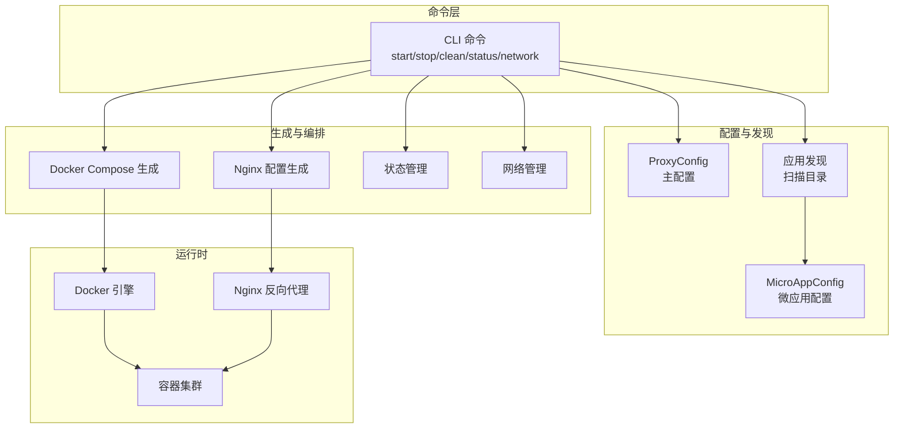
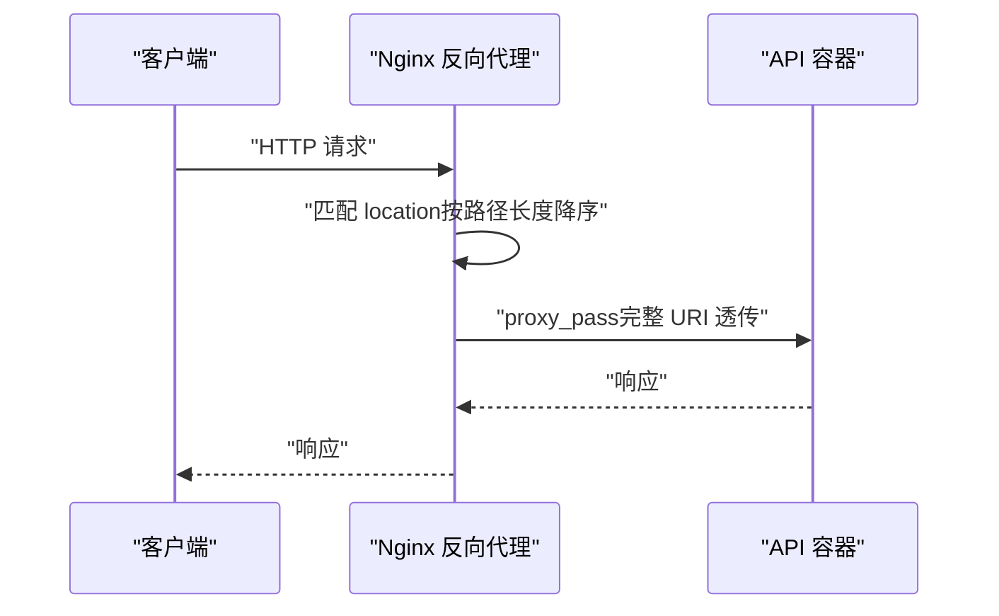
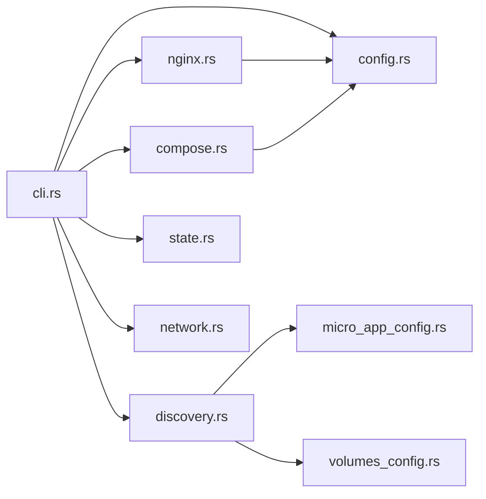

# API 类型应用

<cite>
**本文引用的文件**
- [README.md](file://README.md)
- [Cargo.toml](file://Cargo.toml)
- [src/main.rs](file://src/main.rs)
- [src/lib.rs](file://src/lib.rs)
- [src/cli.rs](file://src/cli.rs)
- [src/config.rs](file://src/config.rs)
- [src/discovery.rs](file://src/discovery.rs)
- [src/micro_app_config.rs](file://src/micro_app_config.rs)
- [src/nginx.rs](file://src/nginx.rs)
- [src/compose.rs](file://src/compose.rs)
- [src/network.rs](file://src/network.rs)
- [src/state.rs](file://src/state.rs)
- [src/volumes_config.rs](file://src/volumes_config.rs)
- [proxy-config.yml.example](file://proxy-config.yml.example)
- [docs/micro-app-development.md](file://docs/micro-app-development.md)
</cite>

## 目录
1. [简介](#简介)
2. [项目结构](#项目结构)
3. [核心组件](#核心组件)
4. [架构总览](#架构总览)
5. [详细组件分析](#详细组件分析)
6. [依赖分析](#依赖分析)
7. [性能考虑](#性能考虑)
8. [故障排查指南](#故障排查指南)
9. [结论](#结论)
10. [附录](#附录)

## 简介
本文件面向“API 类型应用”的开发与运维，结合代码库的实际实现，系统阐述：
- API 类型应用的开发规范与最佳实践
- 后端 API 服务的开发要求与配置要点
- 路由转发机制与路径传递规则
- Node.js、Python、Go 等语言的 API 开发示例思路
- CORS 跨域配置与 OPTIONS 预检请求处理
- API 服务的性能优化与负载均衡配置
- API 测试与调试方法与工具
- API 服务的监控与日志配置
- API 应用的 Dockerfile 编写与环境变量配置

## 项目结构
该项目是一个基于 Rust 的微应用管理工具，提供 Docker 镜像构建、容器生命周期管理、Nginx 反向代理配置与动态生成 docker-compose 的能力。其核心围绕“微应用”概念，支持三类应用：Static（静态/前端）、API（后端接口）、Internal（内部服务）。API 类型应用通过 Nginx 统一入口对外提供服务，请求路径完整透传至后端容器。

图表来源
- [src/cli.rs](file://src/cli.rs)
- [src/config.rs](file://src/config.rs)
- [src/discovery.rs](file://src/discovery.rs)
- [src/nginx.rs](file://src/nginx.rs)
- [src/compose.rs](file://src/compose.rs)
- [src/state.rs](file://src/state.rs)
- [src/network.rs](file://src/network.rs)

章节来源
- [src/lib.rs](file://src/lib.rs)
- [src/main.rs](file://src/main.rs)
- [Cargo.toml](file://Cargo.toml)

## 核心组件
- CLI 命令行接口：提供 start/stop/clean/status/network 等命令，负责协调各模块执行。
- 配置管理：ProxyConfig 主配置与 AppConfig 动态配置；MicroAppConfig 微应用配置。
- 应用发现：扫描目录，发现包含 micro-app.yml 与 Dockerfile 的微应用。
- Nginx 配置生成：根据应用类型与路由生成 location 与 upstream 变量，实现路径透传与缓存策略。
- Docker Compose 生成：生成服务定义、网络、端口映射、卷挂载与健康检查。
- 状态管理：基于目录 hash 判断是否需要重新构建镜像。
- 网络管理：创建/删除 Docker 网络，生成网络地址列表。
- 卷配置：独立的 micro-app.volumes.yml，支持权限与运行用户配置。

章节来源
- [src/cli.rs](file://src/cli.rs)
- [src/config.rs](file://src/config.rs)
- [src/discovery.rs](file://src/discovery.rs)
- [src/nginx.rs](file://src/nginx.rs)
- [src/compose.rs](file://src/compose.rs)
- [src/state.rs](file://src/state.rs)
- [src/network.rs](file://src/network.rs)
- [src/volumes_config.rs](file://src/volumes_config.rs)

## 架构总览
API 类型应用的请求流转如下：
- 客户端请求进入 Nginx（统一入口）
- Nginx 根据 location 规则匹配路由，将请求转发至对应容器
- API 服务接收完整路径（不截断），由后端自行处理路由

图表来源
- [src/nginx.rs](file://src/nginx.rs)
- [src/compose.rs](file://src/compose.rs)

## 详细组件分析

### API 类型应用的开发规范与最佳实践
- 应用类型与路由
  - API 类型必须配置 routes，且容器端口 container_port 需大于 0。
  - routes 为空将导致校验失败；Internal 类型 routes 必须为空。
- Dockerfile 要求
  - 必须包含 EXPOSE 指令，以便工具读取暴露端口。
  - CMD/ENTRYPOINT 指定 API 服务启动命令。
- 环境变量与卷
  - 可选 .env 文件，工具会将其相对路径写入 docker-compose。
  - 可选 micro-app.volumes.yml，支持权限与运行用户配置。
- CORS 与 OPTIONS 预检
  - 可通过 nginx_extra_config 在 location 中处理 OPTIONS 预检请求，设置跨域响应头。
- 路由与路径透传
  - API 类型 location 不截断 URI，后端可按 /api/v1/users 完整路径处理。

章节来源
- [src/micro_app_config.rs](file://src/micro_app_config.rs)
- [src/discovery.rs](file://src/discovery.rs)
- [docs/micro-app-development.md](file://docs/micro-app-development.md)

### 后端 API 服务的开发要求与配置要点
- Node.js API 示例（思路）
  - Dockerfile：基于 node:alpine，COPY 依赖与源码，EXPOSE 8080，CMD 启动 node server.js。
  - micro-app.yml：routes: ["/api"]，container_port: 8080，app_type: "api"。
  - CORS：在 nginx_extra_config 中添加 OPTIONS 预检处理与 Access-Control-Allow-* 响应头。
- Python API 示例（思路）
  - 使用 Flask/FastAPI，监听 0.0.0.0:8080，Dockerfile EXPOSE 8080。
  - micro-app.yml 配置同上。
- Go API 示例（思路）
  - 使用 net/http 或 Gin，绑定 0.0.0.0:8080，Dockerfile EXPOSE 8080。
  - micro-app.yml 配置同上。

章节来源
- [docs/micro-app-development.md](file://docs/micro-app-development.md)
- [src/nginx.rs](file://src/nginx.rs)

### 路由转发机制与路径传递规则
- Nginx location 排序：按路径长度降序，确保更具体路径优先匹配。
- API 类型 location：不添加尾部斜杠，完整 URI 透传至后端容器。
- Static 类型 location：根路径与非根路径分别处理，非根路径使用 rewrite 规则重写到后端根路径。
- upstream 变量：为每个应用定义变量，使用 Docker 内部 DNS 解析，避免硬编码 IP。

章节来源
- [src/nginx.rs](file://src/nginx.rs)

### CORS 跨域配置与 OPTIONS 预检请求处理
- 在 micro-app.yml 的 nginx_extra_config 中添加 OPTIONS 预检处理逻辑，设置允许的 Origin、Methods、Headers 与缓存时间。
- 工具会将该配置注入到对应 location 中，实现对 API 的跨域支持。

章节来源
- [docs/micro-app-development.md](file://docs/micro-app-development.md)
- [src/nginx.rs](file://src/nginx.rs)

### API 服务的性能优化与负载均衡配置
- Nginx 层优化
  - gzip 压缩、keepalive 超时、resolver 缓存与禁用 IPv6，提升解析性能。
  - API location 禁用缓存，确保接口实时性。
- 负载均衡
  - 工具未内置多实例负载均衡逻辑；若需横向扩展，可在上游容器层面通过多副本与外部负载均衡器实现。
- 健康检查
  - API 与 Static 类型均添加健康检查，使用 wget 探测容器内端口。

章节来源
- [src/nginx.rs](file://src/nginx.rs)
- [src/compose.rs](file://src/compose.rs)

### API 测试与调试的方法与工具
- 基础验证
  - 使用 curl 验证路由与 CORS：curl -H "Origin: *" http://localhost/api/...
  - 检查 Nginx 日志与容器日志定位问题。
- 端口与网络
  - 使用 micro_proxy network 生成网络地址列表，核对端口映射与容器可达性。
- 状态与重建
  - 使用 micro_proxy status 查看容器状态；必要时使用 --force-rebuild 强制重建镜像。

章节来源
- [README.md](file://README.md)
- [src/cli.rs](file://src/cli.rs)
- [src/network.rs](file://src/network.rs)

### API 服务的监控与日志配置
- Nginx 日志
  - access_log 与 error_log 已在配置中启用，便于审计与排障。
- 容器日志
  - 使用 docker logs 查看容器标准输出与错误输出。
- 状态文件
  - proxy-config.state 记录目录 hash 与构建时间，辅助判断镜像是否需要重建。

章节来源
- [src/nginx.rs](file://src/nginx.rs)
- [src/state.rs](file://src/state.rs)
- [README.md](file://README.md)

### API 应用的 Dockerfile 编写与环境变量配置
- Dockerfile
  - 基于官方镜像（如 node:alpine、python:alpine、golang:alpine）。
  - 正确声明 EXPOSE 端口，CMD/ENTRYPOINT 指向 API 服务启动命令。
- 环境变量
  - 可选 .env 文件，工具会将其相对路径写入 docker-compose。
- 卷与权限
  - micro-app.volumes.yml 支持 volumes 与 run_as_user，配合权限初始化脚本确保容器内进程可访问挂载目录。

章节来源
- [docs/micro-app-development.md](file://docs/micro-app-development.md)
- [src/volumes_config.rs](file://src/volumes_config.rs)
- [src/compose.rs](file://src/compose.rs)

## 依赖分析
- 外部依赖
  - Docker 与 docker-compose：容器编排与镜像构建。
  - Nginx：反向代理与静态资源服务。
- 内部模块耦合
  - CLI 依赖配置、发现、Nginx、Compose、网络与状态模块。
  - Nginx 与 Compose 依赖 AppConfig 与 AppType。
  - Discovery 依赖 MicroAppConfig 与 VolumesConfig。

图表来源
- [src/cli.rs](file://src/cli.rs)
- [src/config.rs](file://src/config.rs)
- [src/discovery.rs](file://src/discovery.rs)
- [src/micro_app_config.rs](file://src/micro_app_config.rs)
- [src/volumes_config.rs](file://src/volumes_config.rs)
- [src/nginx.rs](file://src/nginx.rs)
- [src/compose.rs](file://src/compose.rs)
- [src/state.rs](file://src/state.rs)
- [src/network.rs](file://src/network.rs)

## 性能考虑
- Nginx 层
  - 启用 gzip、合理 keepalive 超时、使用 Docker 内部 DNS 解析并缓存。
  - API 类型 location 禁用缓存，避免接口缓存导致数据陈旧。
- 容器层
  - 健康检查间隔与超时合理设置，避免频繁探活影响性能。
- 网络层
  - 统一 Docker 网络，减少跨网络访问延迟。

章节来源
- [src/nginx.rs](file://src/nginx.rs)
- [src/compose.rs](file://src/compose.rs)

## 故障排查指南
- 常见问题
  - 端口冲突：修改 proxy-config.yml 中 nginx_host_port。
  - 端口映射：HTTP 默认 80，HTTPS 默认 443；确认证书存在以启用 HTTPS。
  - CORS 未生效：检查 nginx_extra_config 是否正确注入到 location。
  - 路由 404：确认 routes 配置与访问路径一致，location 按长度排序。
- 排查步骤
  - 使用 micro_proxy network 生成网络地址列表，核对访问地址。
  - 使用 micro_proxy status 查看容器状态与健康检查。
  - 使用 docker logs 查看容器日志与 Nginx 错误日志。

章节来源
- [README.md](file://README.md)
- [src/cli.rs](file://src/cli.rs)
- [src/network.rs](file://src/network.rs)

## 结论
本工具通过“配置驱动 + 自动化生成”的方式，为 API 类型应用提供了标准化的开发与运维路径：清晰的路由与路径透传、完善的 CORS 支持、灵活的卷与权限配置、以及可扩展的 Docker 编排。遵循本文规范，可高效构建稳定可靠的 API 服务。

## 附录
- 配置文件示例
  - proxy-config.yml.example：主配置示例，包含扫描目录、输出路径、网络名称、端口与证书目录等。
- 开发指南
  - docs/micro-app-development.md：涵盖三类应用的配置要点、SPA 部署要点、网络通信与自定义 Nginx 配置。

章节来源
- [proxy-config.yml.example](file://proxy-config.yml.example)
- [docs/micro-app-development.md](file://docs/micro-app-development.md)