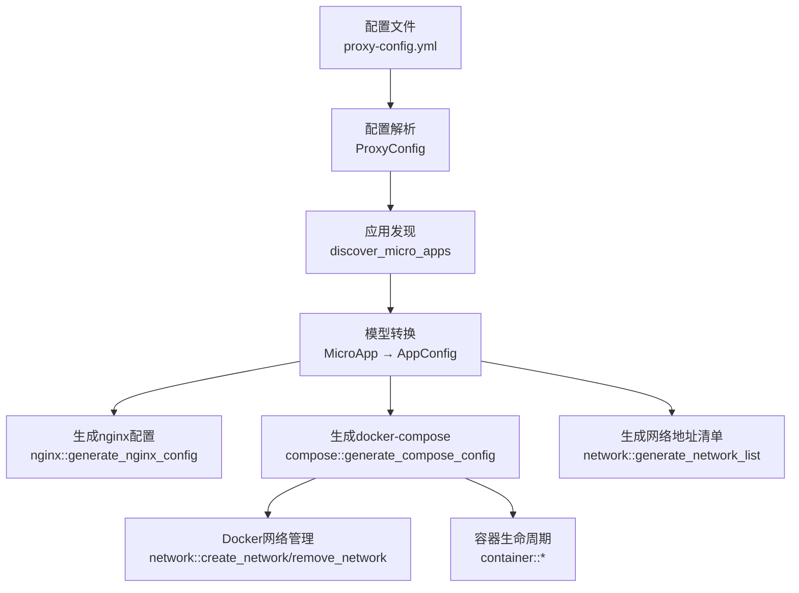
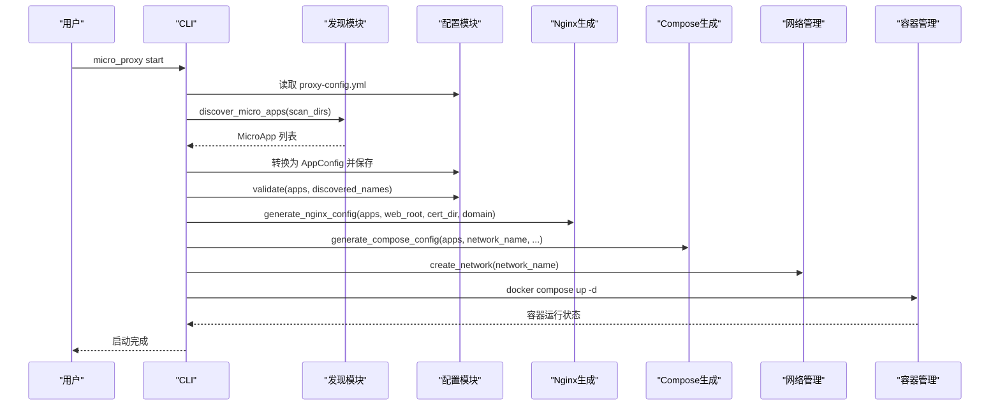
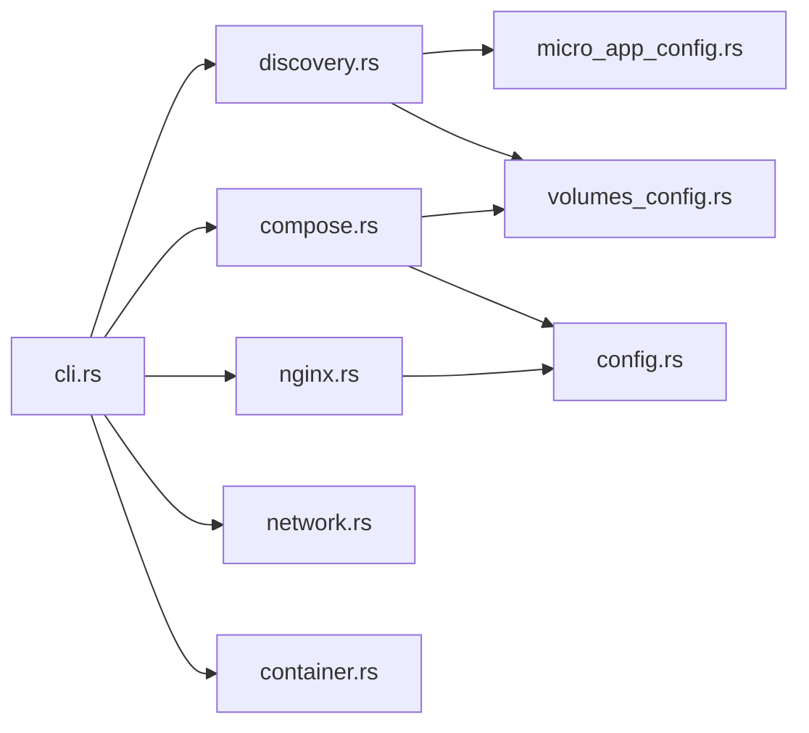

# Internal 类型应用

<cite>
**本文引用的文件**
- [src/lib.rs](file://src/lib.rs)
- [src/main.rs](file://src/main.rs)
- [src/config.rs](file://src/config.rs)
- [src/micro_app_config.rs](file://src/micro_app_config.rs)
- [src/discovery.rs](file://src/discovery.rs)
- [src/compose.rs](file://src/compose.rs)
- [src/network.rs](file://src/network.rs)
- [src/nginx.rs](file://src/nginx.rs)
- [src/container.rs](file://src/container.rs)
- [src/dockerfile.rs](file://src/dockerfile.rs)
- [src/volumes_config.rs](file://src/volumes_config.rs)
- [src/cli.rs](file://src/cli.rs)
- [proxy-config.yml.example](file://proxy-config.yml.example)
- [README.md](file://README.md)
- [Cargo.toml](file://Cargo.toml)
</cite>

## 目录
1. [引言](#引言)
2. [项目结构](#项目结构)
3. [核心组件](#核心组件)
4. [架构总览](#架构总览)
5. [详细组件分析](#详细组件分析)
6. [依赖分析](#依赖分析)
7. [性能考虑](#性能考虑)
8. [故障排查指南](#故障排查指南)
9. [结论](#结论)
10. [附录](#附录)

## 引言
本文件面向使用 Internal 类型应用的开发者，系统阐述基于 micro_proxy 工具的 Internal 应用开发规范与最佳实践。内容涵盖：
- Internal 应用的配置模型与约束
- 数据库、缓存等内部服务的开发要求与配置要点
- 容器间通信与网络隔离、安全配置
- 服务发现与健康检查配置
- 监控与运维最佳实践
- 备份与恢复策略
- Dockerfile 编写与数据持久化

## 项目结构
micro_proxy 采用模块化设计，围绕“配置 → 发现 → 生成 → 运行”的流程组织代码。核心模块如下：
- 配置与模型：ProxyConfig、AppConfig、AppType
- 应用发现：扫描目录、解析 micro-app.yml、生成 MicroApp
- 生成阶段：nginx.conf、docker-compose.yml、网络地址清单
- 运行阶段：Docker 网络、容器生命周期、健康检查
- 辅助能力：Dockerfile 解析、卷配置、脚本支持

图表来源
- [src/config.rs:125-367](file://src/config.rs#L125-L367)
- [src/discovery.rs:224-352](file://src/discovery.rs#L224-L352)
- [src/nginx.rs:26-92](file://src/nginx.rs#L26-L92)
- [src/compose.rs:31-119](file://src/compose.rs#L31-L119)
- [src/network.rs:8-86](file://src/network.rs#L8-L86)
- [src/container.rs:19-77](file://src/container.rs#L19-L77)

章节来源
- [src/lib.rs:1-26](file://src/lib.rs#L1-L26)
- [src/main.rs:1-25](file://src/main.rs#L1-L25)
- [README.md:14-30](file://README.md#L14-L30)

## 核心组件
- 应用类型枚举 AppType：支持 static、api、internal。Internal 类型不参与 Nginx 代理，但可加入 Docker 网络供其他应用访问。
- AppConfig：描述单个应用的名称、容器名、端口、类型、路由、卷映射、运行用户等。
- ProxyConfig：描述顶层配置，包括扫描目录、网络名、Nginx 主机端口、证书与 Web 根目录等。

章节来源
- [src/config.rs:11-68](file://src/config.rs#L11-L68)
- [src/config.rs:125-164](file://src/config.rs#L125-L164)

## 架构总览
Internal 应用的生命周期由 CLI 驱动，主要步骤：
- 读取 ProxyConfig
- 扫描并发现微应用，生成 MicroApp 列表
- 转换为 AppConfig，保存动态配置
- 验证配置（含 Internal 的路径与 Dockerfile 校验）
- 生成 nginx.conf（Internal 应用不参与）
- 生成 docker-compose.yml（Internal 应用作为服务加入网络）
- 生成网络地址清单（Internal 应用无对外 URL）
- 启动容器（docker compose up -d）

图表来源
- [src/cli.rs:296-463](file://src/cli.rs#L296-L463)
- [src/discovery.rs:224-352](file://src/discovery.rs#L224-L352)
- [src/config.rs:221-347](file://src/config.rs#L221-L347)
- [src/nginx.rs:26-92](file://src/nginx.rs#L26-L92)
- [src/compose.rs:31-119](file://src/compose.rs#L31-L119)
- [src/network.rs:15-47](file://src/network.rs#L15-L47)
- [src/container.rs:86-111](file://src/container.rs#L86-L111)

## 详细组件分析

### Internal 应用配置模型与约束
- Internal 应用必须提供 path 字段，指向包含 Dockerfile 的目录；该目录会被校验存在性与 Dockerfile 存在性。
- Internal 应用的 routes 必须为空（或被忽略），nginx_extra_config 不应配置。
- Internal 应用可配置 volumes 与 run_as_user，这些将映射到 docker-compose 的 volumes 与 user 字段。

章节来源
- [src/config.rs:273-322](file://src/config.rs#L273-L322)
- [src/config.rs:350-366](file://src/config.rs#L350-L366)
- [src/micro_app_config.rs:56-106](file://src/micro_app_config.rs#L56-L106)

### 应用发现与模型转换
- discover_micro_apps 扫描 scan_dirs，要求目录同时包含 micro-app.yml 与 Dockerfile，否则跳过。
- 生成 MicroApp 后进行 validate：检查 Dockerfile、.env、卷配置等。
- to_app_configs 将 MicroApp 转换为 AppConfig，其中 app_type 由 micro-app.yml 的 app_type 字符串决定。

章节来源
- [src/discovery.rs:235-352](file://src/discovery.rs#L235-L352)
- [src/discovery.rs:40-144](file://src/discovery.rs#L40-L144)

### Nginx 配置与 Internal 应用
- generate_nginx_config 会过滤掉 Internal 类型的应用，仅对 static/api 生成 location。
- Internal 应用不生成 nginx location，因此不对外暴露访问 URL。

章节来源
- [src/nginx.rs:26-92](file://src/nginx.rs#L26-L92)
- [src/nginx.rs:418-536](file://src/nginx.rs#L418-L536)

### Docker Compose 生成与 Internal 应用
- generate_compose_config 生成 docker-compose.yml：
  - 使用外部网络（external=true），名称来自 ProxyConfig.network_name
  - nginx 服务仅 depends_on 非 Internal 应用
  - Internal 应用作为独立服务加入网络，不添加健康检查
  - volumes 与 user 字段来自 AppConfig/docker-compose 映射

章节来源
- [src/compose.rs:31-119](file://src/compose.rs#L31-L119)
- [src/compose.rs:172-266](file://src/compose.rs#L172-L266)
- [src/compose.rs:277-424](file://src/compose.rs#L277-L424)

### 网络与容器管理
- create_network/remove_network 管理外部网络，避免 docker-compose 自动创建带项目名前缀的网络。
- Internal 应用通过容器名作为主机名在 Docker 内部 DNS 中解析，实现微应用间通信。
- 容器生命周期：create/start/stop/remove/get_container_status/is_container_running。

章节来源
- [src/network.rs:8-86](file://src/network.rs#L8-L86)
- [src/network.rs:121-207](file://src/network.rs#L121-L207)
- [src/container.rs:19-176](file://src/container.rs#L19-L176)

### Dockerfile 解析与端口暴露
- parse_dockerfile 提取 EXPOSE 指令，Internal 应用若缺少 EXPOSE，将产生告警。
- compose 生成时不会强制要求 EXPOSE，但建议显式声明端口以提升可维护性。

章节来源
- [src/dockerfile.rs:16-67](file://src/dockerfile.rs#L16-L67)

### 卷配置与数据持久化
- VolumesConfig 支持 source/target、权限（uid/gid/recursive）与 run_as_user。
- to_docker_compose_volumes 将卷配置转换为 docker-compose 的 volumes 格式。
- generate_permission_init_script 可生成权限初始化脚本（在某些场景下由应用自行处理）。

章节来源
- [src/volumes_config.rs:43-205](file://src/volumes_config.rs#L43-L205)

### 健康检查与服务发现
- 健康检查仅对 static/api 应用添加（基于 HTTP 探针），Internal 应用不添加。
- 服务发现通过 Docker 内部 DNS，容器名即主机名，支持动态解析。

章节来源
- [src/compose.rs:358-421](file://src/compose.rs#L358-L421)
- [src/nginx.rs:187-190](file://src/nginx.rs#L187-L190)

### CLI 启动流程与 Internal 应用
- execute_start 完成发现、验证、生成配置、创建网络、构建镜像、生成 compose、启动容器。
- 对 Internal 应用：从配置 path 加载 micro-app.yml 与卷配置，解析 Dockerfile，收集 .env 相对路径，生成网络地址信息。

章节来源
- [src/cli.rs:296-463](file://src/cli.rs#L296-L463)
- [src/cli.rs:183-247](file://src/cli.rs#L183-L247)

## 依赖分析
- 外部依赖：Docker、Docker Compose、Nginx
- 内部模块耦合：
  - discovery 依赖 micro_app_config 与 volumes_config
  - compose 依赖 config 与 volumes_config
  - nginx 依赖 config
  - network 与 container 为基础设施层

图表来源
- [src/discovery.rs:6-11](file://src/discovery.rs#L6-L11)
- [src/compose.rs:6-9](file://src/compose.rs#L6-L9)
- [src/nginx.rs:7-8](file://src/nginx.rs#L7-L8)
- [src/cli.rs:6-15](file://src/cli.rs#L6-L15)

章节来源
- [Cargo.toml:13-52](file://Cargo.toml#L13-L52)

## 性能考虑
- 端口映射与负载：Internal 应用不参与 Nginx 代理，减少一层转发开销，适合高并发数据库/缓存。
- 网络隔离：通过单一 Docker 网络隔离 Internal 服务，降低跨网络延迟。
- 健康检查：仅对 HTTP 服务启用，Internal 应用不添加健康检查，避免不必要的探针压力。
- 镜像构建：支持 --no-cache 强制重建，结合状态文件避免不必要的重复构建。

## 故障排查指南
- Internal 应用无法访问
  - 检查 Docker 网络是否创建且名称一致
  - 确认 Internal 应用容器名与网络地址一致
  - 使用 micro_proxy network 查看网络地址清单
- 端口冲突
  - 修改 proxy-config.yml 中的 nginx_host_port（仅影响对外端口；Internal 应用端口由容器内部端口决定）
- 证书与 HTTPS
  - Internal 应用不参与 Nginx 代理，不受 HTTPS 影响
- 健康检查
  - Internal 应用不添加健康检查，如需可通过自定义探针实现（不在本工具默认范围内）

章节来源
- [src/network.rs:219-274](file://src/network.rs#L219-L274)
- [README.md:363-372](file://README.md#L363-L372)

## 结论
Internal 类型应用通过 micro_proxy 实现“零对外暴露、强内聚通信”的内部服务架构。其开发规范强调：
- 明确的路径与 Dockerfile 约束
- 合理的数据持久化与权限配置
- 健壮的网络隔离与服务发现
- 可靠的监控与运维流程

## 附录

### Internal 应用开发规范与最佳实践
- 配置文件
  - micro-app.yml：app_type 设为 internal；routes 为空；container_name 全局唯一；container_port 指定内部端口
  - micro-app.volumes.yml：可选，配置 volumes 与 run_as_user
- Dockerfile
  - 明确 EXPOSE 指令（便于维护与可观测性）
  - 使用非 root 用户运行（结合 run_as_user）
- 网络与通信
  - 通过容器名在 Docker 内部 DNS 解析
  - 仅在必要时暴露端口，避免扩大攻击面
- 健康检查
  - Internal 应用不添加健康检查；如需可自定义探针
- 监控与日志
  - 使用容器日志与指标采集
  - 通过 network 命令核对网络地址与可达性

章节来源
- [src/config.rs:11-68](file://src/config.rs#L11-L68)
- [src/micro_app_config.rs:56-106](file://src/micro_app_config.rs#L56-L106)
- [src/volumes_config.rs:43-205](file://src/volumes_config.rs#L43-L205)
- [src/dockerfile.rs:16-67](file://src/dockerfile.rs#L16-L67)
- [src/network.rs:121-207](file://src/network.rs#L121-L207)

### 数据库、缓存等内部服务的开发要求与配置要点
- Redis/MongoDB/MySQL 等服务均以 Internal 类型托管
- 使用 volumes 实现数据持久化（参考 volumes 配置）
- 通过 .env 注入敏感配置（如密码、连接串）
- 通过 docker-compose 的 external 网络实现服务发现

章节来源
- [src/compose.rs:54-69](file://src/compose.rs#L54-L69)
- [src/compose.rs:277-355](file://src/compose.rs#L277-L355)
- [src/volumes_config.rs:198-205](file://src/volumes_config.rs#L198-L205)

### 容器间通信与网络配置
- Internal 应用加入同一 Docker 网络，容器名即主机名
- 通过容器名与端口进行服务发现
- 网络地址清单可用于排障

章节来源
- [src/network.rs:15-47](file://src/network.rs#L15-L47)
- [src/network.rs:121-207](file://src/network.rs#L121-L207)
- [src/network.rs:219-274](file://src/network.rs#L219-L274)

### 常见内部服务配置示例（路径引用）
- proxy-config.yml 示例：[proxy-config.yml.example:1-53](file://proxy-config.yml.example#L1-L53)
- micro-app.yml 示例：[README.md:205-235](file://README.md#L205-L235)

章节来源
- [proxy-config.yml.example:1-53](file://proxy-config.yml.example#L1-L53)
- [README.md:205-235](file://README.md#L205-L235)

### 服务发现与健康检查配置
- 服务发现：Docker 内部 DNS，容器名为主机名
- 健康检查：仅对 static/api 应用添加 HTTP 探针；Internal 应用不添加

章节来源
- [src/nginx.rs:187-190](file://src/nginx.rs#L187-L190)
- [src/compose.rs:358-421](file://src/compose.rs#L358-L421)

### 监控与运维最佳实践
- 使用 micro_proxy status 查看容器与镜像状态
- 使用 micro_proxy network 生成网络地址清单
- 使用 docker logs 查看容器日志
- 通过 .env 与 volumes 管理配置与数据

章节来源
- [src/cli.rs:550-583](file://src/cli.rs#L550-L583)
- [src/network.rs:219-274](file://src/network.rs#L219-L274)
- [README.md:330-341](file://README.md#L330-L341)

### 备份与恢复策略
- 使用 volumes 将数据持久化到宿主机目录
- 定期备份宿主机上的数据目录
- 恢复时重建容器并挂载相同 volumes

章节来源
- [src/volumes_config.rs:198-205](file://src/volumes_config.rs#L198-L205)

### Internal 应用的 Dockerfile 编写与数据持久化
- Dockerfile 编写：明确 EXPOSE 端口；使用非 root 用户；合理分层
- 数据持久化：通过 micro-app.volumes.yml 配置 volumes；结合 run_as_user 设置权限

章节来源
- [src/dockerfile.rs:16-67](file://src/dockerfile.rs#L16-L67)
- [src/volumes_config.rs:43-205](file://src/volumes_config.rs#L43-L205)