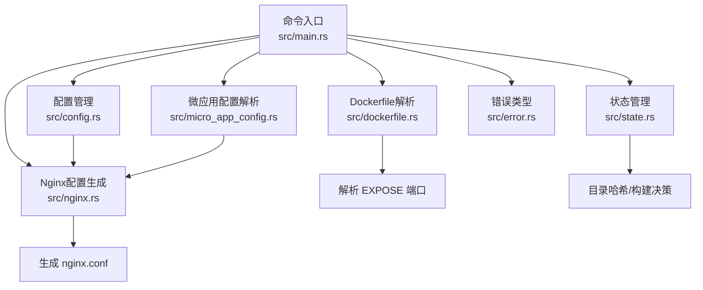
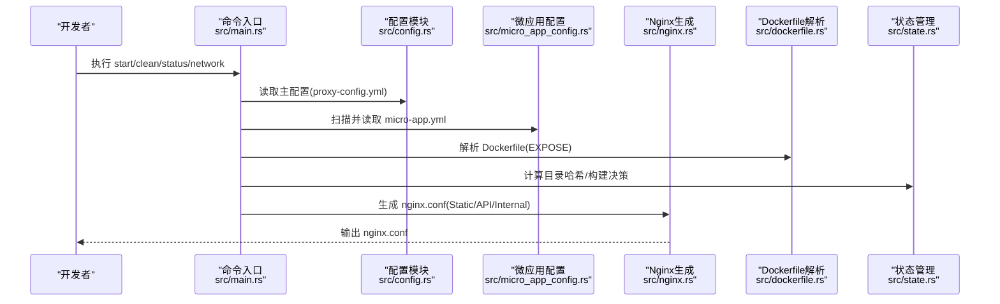
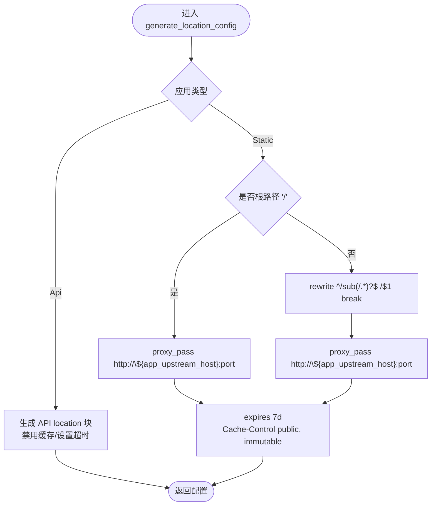
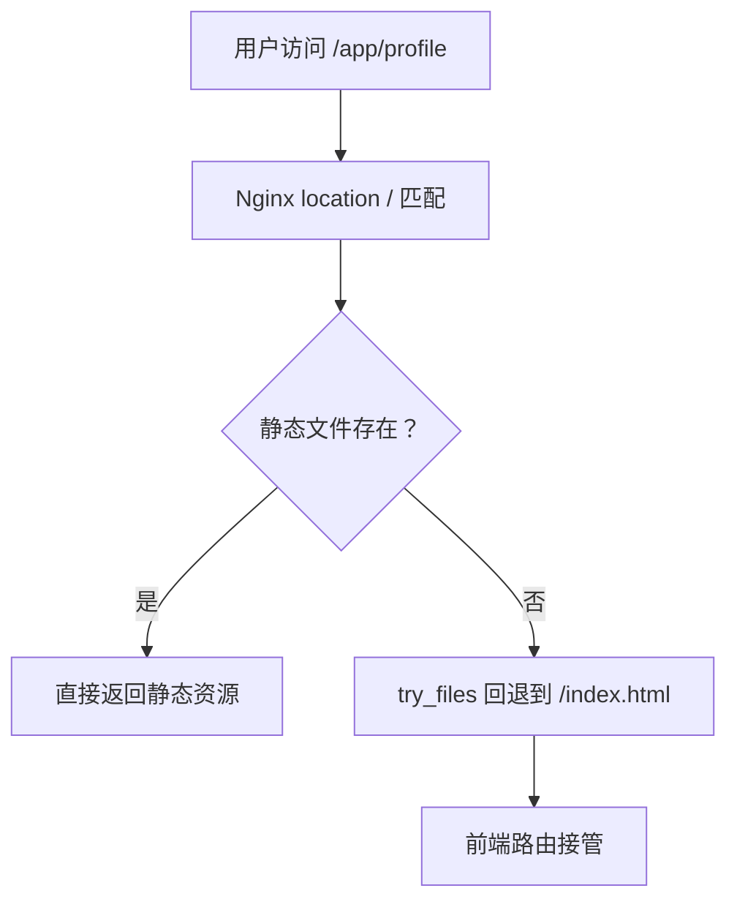
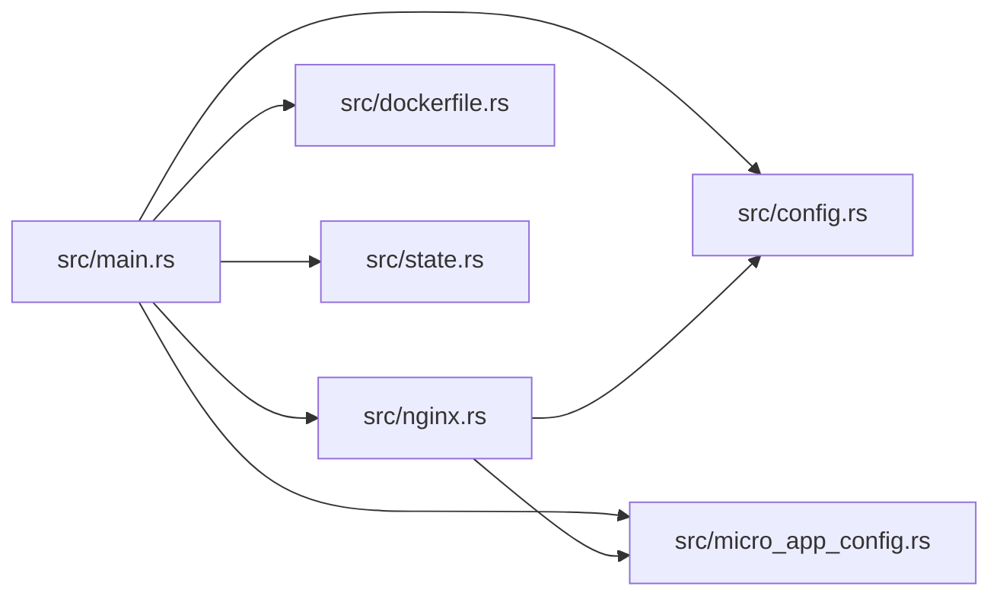

# Static 类型应用

<cite>
**本文引用的文件**
- [README.md](file://README.md)
- [docs/micro-app-development.md](file://docs/micro-app-development.md)
- [docs/ssl-configuration.md](file://docs/ssl-configuration.md)
- [src/main.rs](file://src/main.rs)
- [src/config.rs](file://src/config.rs)
- [src/micro_app_config.rs](file://src/micro_app_config.rs)
- [src/nginx.rs](file://src/nginx.rs)
- [src/dockerfile.rs](file://src/dockerfile.rs)
- [src/state.rs](file://src/state.rs)
- [src/error.rs](file://src/error.rs)
- [proxy-config.yml.example](file://proxy-config.yml.example)
- [Cargo.toml](file://Cargo.toml)
</cite>

## 目录
1. [简介](#简介)
2. [项目结构](#项目结构)
3. [核心组件](#核心组件)
4. [架构总览](#架构总览)
5. [详细组件分析](#详细组件分析)
6. [依赖关系分析](#依赖关系分析)
7. [性能与缓存优化](#性能与缓存优化)
8. [常见问题与排错](#常见问题与排错)
9. [结论](#结论)
10. [附录](#附录)

## 简介
本文件面向使用 micro_proxy 管理“Static 类型应用”（前端/静态网站）的开发者，系统阐述开发规范、配置要点、SPA 部署注意事项、Nginx 缓存与性能优化、常见问题与排错、以及开发调试与测试策略。文档严格基于仓库现有实现与文档，避免臆测，确保可落地与可验证。

## 项目结构
- 顶层命令入口负责解析 CLI 并调度各模块。
- 配置模块负责主配置与微应用配置的读取、校验与序列化。
- Nginx 模块负责生成反向代理配置，支持 HTTP/HTTPS、ACME 验证、动态 DNS 变量、静态资源缓存等。
- Dockerfile 模块负责解析 Dockerfile 的 EXPOSE 指令，辅助发现容器端口。
- 状态模块负责应用目录哈希与镜像构建状态管理。
- 错误模块统一错误类型与 Result 别名。

图表来源
- [src/main.rs:1-25](file://src/main.rs#L1-L25)
- [src/config.rs:1-842](file://src/config.rs#L1-L842)
- [src/micro_app_config.rs:1-235](file://src/micro_app_config.rs#L1-L235)
- [src/nginx.rs:1-1101](file://src/nginx.rs#L1-L1101)
- [src/dockerfile.rs:1-183](file://src/dockerfile.rs#L1-L183)
- [src/state.rs:1-311](file://src/state.rs#L1-L311)
- [src/error.rs:1-50](file://src/error.rs#L1-L50)

章节来源
- [README.md:1-460](file://README.md#L1-L460)
- [Cargo.toml:1-55](file://Cargo.toml#L1-L55)

## 核心组件
- 应用类型与配置模型：定义 Static、API、Internal 三类应用，以及 AppConfig/AppType 等结构，支撑 Nginx 生成与容器编排。
- Nginx 配置生成：根据应用类型与路由生成 location 块；Static 类型启用静态缓存；API 类型禁用缓存并设置超时。
- Dockerfile 解析：提取 EXPOSE 端口，辅助端口一致性校验。
- 状态管理：基于目录哈希判断是否需要重新构建镜像，减少不必要的构建。
- 错误类型：统一错误分类，便于定位与排错。

章节来源
- [src/config.rs:11-68](file://src/config.rs#L11-L68)
- [src/config.rs:206-367](file://src/config.rs#L206-L367)
- [src/nginx.rs:26-92](file://src/nginx.rs#L26-L92)
- [src/dockerfile.rs:23-67](file://src/dockerfile.rs#L23-L67)
- [src/state.rs:13-28](file://src/state.rs#L13-L28)
- [src/error.rs:6-46](file://src/error.rs#L6-L46)

## 架构总览
micro_proxy 的 Static 类型应用在统一入口下，通过配置驱动生成 Nginx 反向代理配置，再由 Docker Compose 编排容器。Nginx 作为统一入口，将请求路由到对应 Static 应用容器。

图表来源
- [src/main.rs:6-24](file://src/main.rs#L6-L24)
- [src/config.rs:178-219](file://src/config.rs#L178-L219)
- [src/micro_app_config.rs:35-53](file://src/micro_app_config.rs#L35-L53)
- [src/dockerfile.rs:23-36](file://src/dockerfile.rs#L23-L36)
- [src/state.rs:195-233](file://src/state.rs#L195-L233)
- [src/nginx.rs:26-92](file://src/nginx.rs#L26-L92)

## 详细组件分析

### Nginx 配置生成（Static 类型）
- Static 应用生成 location 块时，针对根路径“/”与非根路径“/subpath”分别处理：
  - 根路径：直接代理，不追加尾部斜杠。
  - 非根路径：使用 rewrite 将“/subpath/...”重写为“/...”，从而支持前端路由（如 Vite 的 BASE_URL=/subpath）。
- 静态资源缓存：为 Static 应用启用 expires 与 Cache-Control，提升缓存命中率。
- 动态 DNS 变量：通过 set 指令将上游容器名注入变量，配合 proxy_pass 使用，实现容器名解析与动态上游。

图表来源
- [src/nginx.rs:418-536](file://src/nginx.rs#L418-L536)

章节来源
- [src/nginx.rs:418-536](file://src/nginx.rs#L418-L536)
- [docs/micro-app-development.md:318-338](file://docs/micro-app-development.md#L318-L338)

### SPA 应用的特殊配置与路由回退
- 关键点：SPA 刷新页面出现 404，必须在 Nginx 中配置 try_files 回退至 index.html。
- 仓库文档明确要求：SPA 应用的 Dockerfile 必须复制自定义 nginx.conf，且该配置中必须包含 try_files $uri $uri/ /index.html。
- BASE_URL 配置：若使用子路径部署，前端构建时的 BASE_URL 必须以“/”结尾，以确保路由与静态资源路径正确拼接。

图表来源
- [docs/micro-app-development.md:505-543](file://docs/micro-app-development.md#L505-L543)

章节来源
- [docs/micro-app-development.md:505-543](file://docs/micro-app-development.md#L505-L543)

### Dockerfile 解析与端口校验
- 解析 Dockerfile 中的 EXPOSE 指令，提取容器暴露端口，辅助与 micro-app.yml 的 container_port 一致性校验。
- 若 Dockerfile 未包含 EXPOSE，仍可继续流程，但建议补充以确保容器网络与端口映射清晰。

章节来源
- [src/dockerfile.rs:23-67](file://src/dockerfile.rs#L23-L67)

### 配置模型与校验
- AppConfig/AppType：定义应用类型、路由、容器名、端口、额外 Nginx 配置等。
- ProxyConfig：主配置文件的结构，包含扫描目录、输出路径、网络与端口、web_root/cert_dir/domain 等。
- 校验逻辑：确保应用名称唯一、Static/API 路由不为空、Internal 路径存在且包含 Dockerfile、Internal 不配置 routes/extra_config 等。

章节来源
- [src/config.rs:11-68](file://src/config.rs#L11-L68)
- [src/config.rs:125-164](file://src/config.rs#L125-L164)
- [src/config.rs:221-347](file://src/config.rs#L221-L347)
- [src/micro_app_config.rs:35-106](file://src/micro_app_config.rs#L35-L106)

### SSL 与 HTTPS 配置（与 Static 应用的关系）
- web_root/cert_dir/domain 三要素决定是否启用 HTTPS 与 ACME 验证。
- 启用 HTTPS 后，Nginx 会生成 HTTP->HTTPS 重定向与证书加载配置；未配置或证书缺失则仅启用 HTTP。
- Static 应用可受益于 HTTPS 下的 HSTS、缓存与安全响应头。

章节来源
- [docs/ssl-configuration.md:45-179](file://docs/ssl-configuration.md#L45-L179)
- [src/nginx.rs:54-83](file://src/nginx.rs#L54-L83)

## 依赖关系分析
- CLI 入口依赖配置与微应用配置模块，驱动 Nginx 生成与状态管理。
- Nginx 生成依赖配置模型与应用类型，结合 SSL 配置决定是否启用 HTTPS。
- Dockerfile 解析与状态管理分别服务于端口一致性与构建决策。

图表来源
- [src/main.rs:6-24](file://src/main.rs#L6-L24)
- [src/config.rs:178-219](file://src/config.rs#L178-L219)
- [src/micro_app_config.rs:35-53](file://src/micro_app_config.rs#L35-L53)
- [src/nginx.rs:26-92](file://src/nginx.rs#L26-L92)
- [src/dockerfile.rs:23-36](file://src/dockerfile.rs#L23-L36)
- [src/state.rs:195-233](file://src/state.rs#L195-L233)

章节来源
- [Cargo.toml:13-52](file://Cargo.toml#L13-L52)

## 性能与缓存优化
- 静态资源缓存：Static 应用 location 块中启用 expires 与 Cache-Control，显著降低带宽与服务器压力。
- Gzip 压缩：Nginx 配置启用 gzip，压缩文本类资源，提升首屏速度。
- 动态 DNS 与解析缓存：使用 Docker 内部 DNS 与解析缓存，减少解析延迟。
- 构建缓存与增量构建：基于目录哈希判断是否需要重新构建镜像，避免不必要的构建。

章节来源
- [src/nginx.rs:177-186](file://src/nginx.rs#L177-L186)
- [src/nginx.rs:481-484](file://src/nginx.rs#L481-L484)
- [src/state.rs:162-177](file://src/state.rs#L162-L177)

## 常见问题与排错
- SPA 刷新 404：检查 nginx.conf 是否包含 try_files 回退；确认 Dockerfile 是否复制了自定义 nginx.conf；确认前端 BASE_URL 以“/”结尾。
- 权限错误：检查 web_root/cert_dir 的宿主机权限；确认 Nginx 容器可读取；必要时使用只读挂载保护私钥。
- 端口冲突：修改 proxy-config.yml 的 nginx_host_port；检查宿主机端口占用。
- 证书问题：确认证书与私钥文件存在且命名正确；使用 acme.sh 部署证书；验证 Nginx 配置语法与日志。
- 配置校验失败：核对 micro-app.yml 的 container_name/container_port/app_type/routes；确保 Static/API 路由不为空；Internal 路径存在且包含 Dockerfile。

章节来源
- [docs/micro-app-development.md:505-543](file://docs/micro-app-development.md#L505-L543)
- [docs/ssl-configuration.md:524-627](file://docs/ssl-configuration.md#L524-L627)
- [src/config.rs:221-347](file://src/config.rs#L221-L347)

## 结论
通过 micro_proxy 的配置驱动与自动化生成能力，Static 类型应用（尤其是 SPA）能够以最小的运维成本获得稳定的反向代理、缓存优化与 HTTPS 支持。遵循本文档的开发规范与排错流程，可显著提升交付质量与稳定性。

## 附录

### Static 类型应用开发规范与最佳实践
- 目录结构：至少包含 micro-app.yml、Dockerfile；SPA 应用需提供自定义 nginx.conf。
- 配置要点：
  - routes 必填且不为空（Static/API）。
  - container_name 全局唯一。
  - container_port 与 Dockerfile EXPOSE 保持一致。
  - SPA 部署时，Dockerfile 必须复制自定义 nginx.conf，其中包含 try_files 回退。
  - BASE_URL 以“/”结尾，确保子路径部署正确。
- 缓存与性能：
  - Static 应用启用 expires 与 Cache-Control。
  - 启用 gzip 压缩。
  - 使用 Docker 内部 DNS 与解析缓存。
- SSL 与 HTTPS：
  - 配置 web_root/cert_dir/domain 后启用 HTTPS。
  - 启用 HTTP->HTTPS 重定向。
- 构建与调试：
  - 使用目录哈希判断是否需要重新构建。
  - 通过日志与状态文件定位问题。
  - 使用 docker logs 与 docker exec 进入容器排查。

章节来源
- [docs/micro-app-development.md:250-338](file://docs/micro-app-development.md#L250-L338)
- [docs/micro-app-development.md:505-543](file://docs/micro-app-development.md#L505-L543)
- [src/nginx.rs:177-186](file://src/nginx.rs#L177-L186)
- [src/state.rs:162-177](file://src/state.rs#L162-L177)

### SPA 配置示例要点（来自仓库文档）
- Dockerfile 中复制自定义 nginx.conf 至默认配置路径。
- nginx.conf 中 location / 使用 try_files $uri $uri/ /index.html。
- 前端 BASE_URL 以“/”结尾，确保子路径部署。

章节来源
- [docs/micro-app-development.md:318-338](file://docs/micro-app-development.md#L318-L338)

### 配置文件示例与说明
- 主配置 proxy-config.yml：扫描目录、输出路径、网络与端口、web_root/cert_dir/domain 等。
- 微应用配置 micro-app.yml：routes、container_name、container_port、app_type、nginx_extra_config 等。

章节来源
- [proxy-config.yml.example:1-53](file://proxy-config.yml.example#L1-L53)
- [docs/micro-app-development.md:58-86](file://docs/micro-app-development.md#L58-L86)