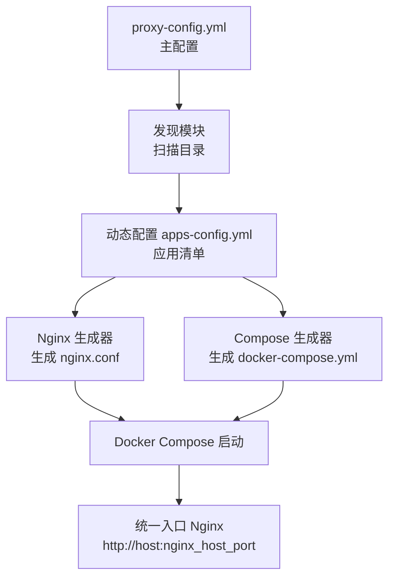
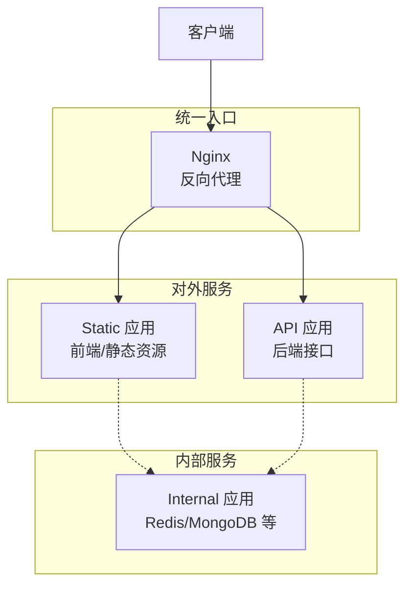
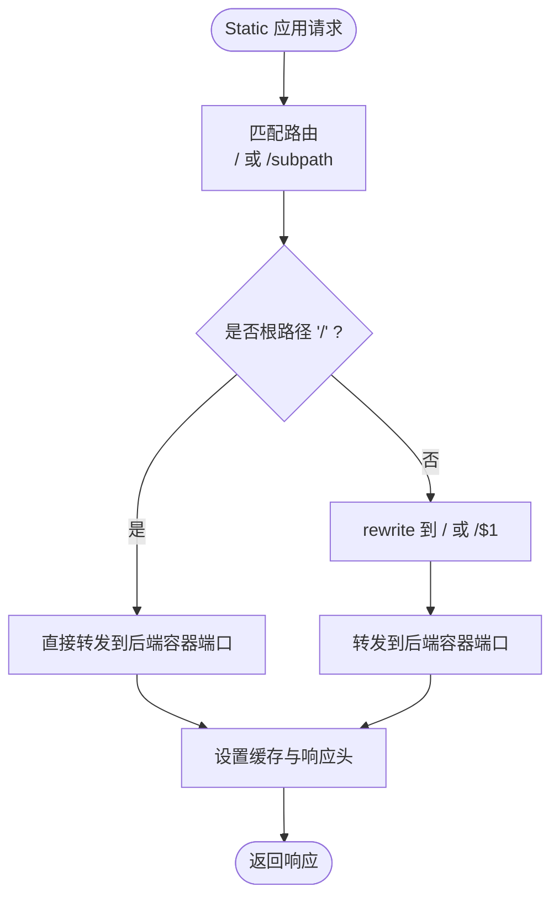
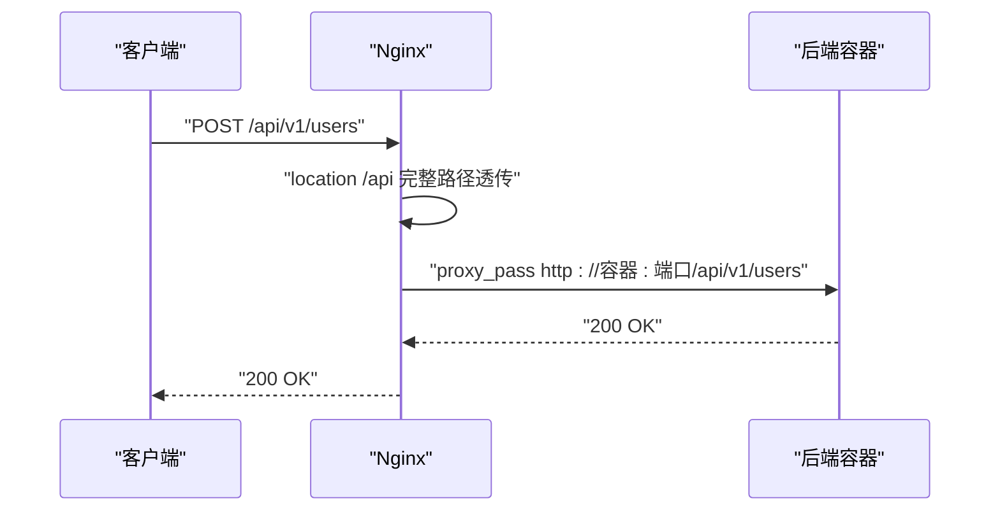
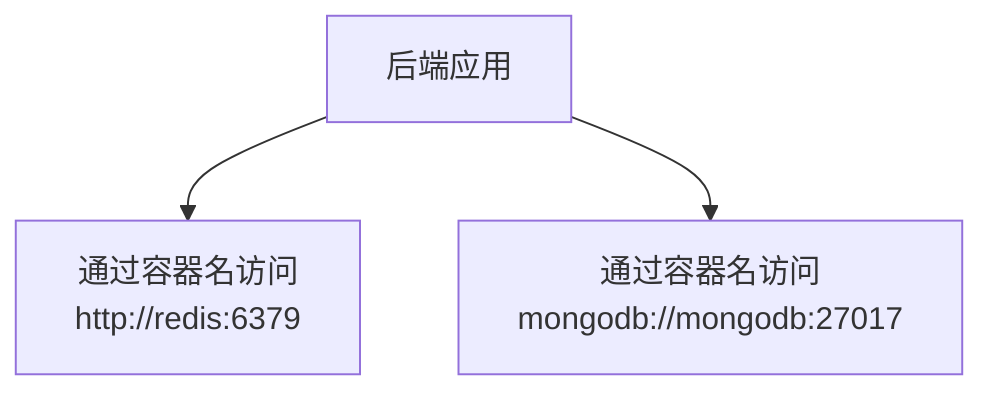
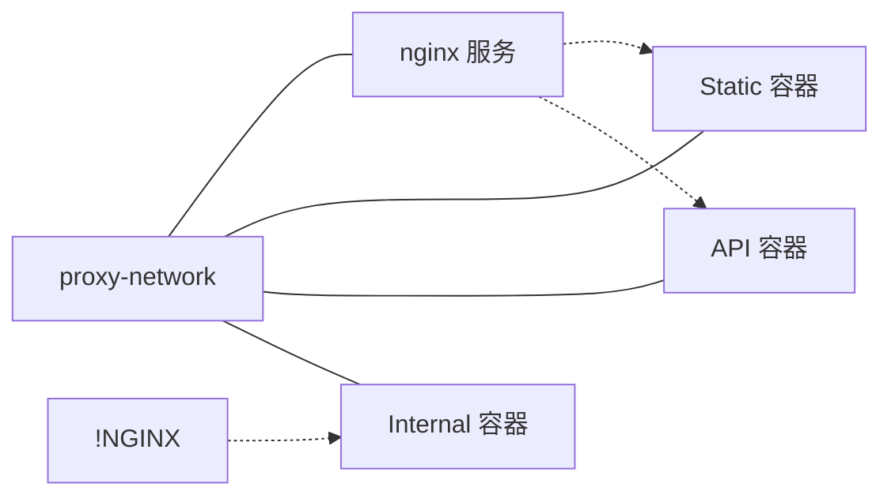
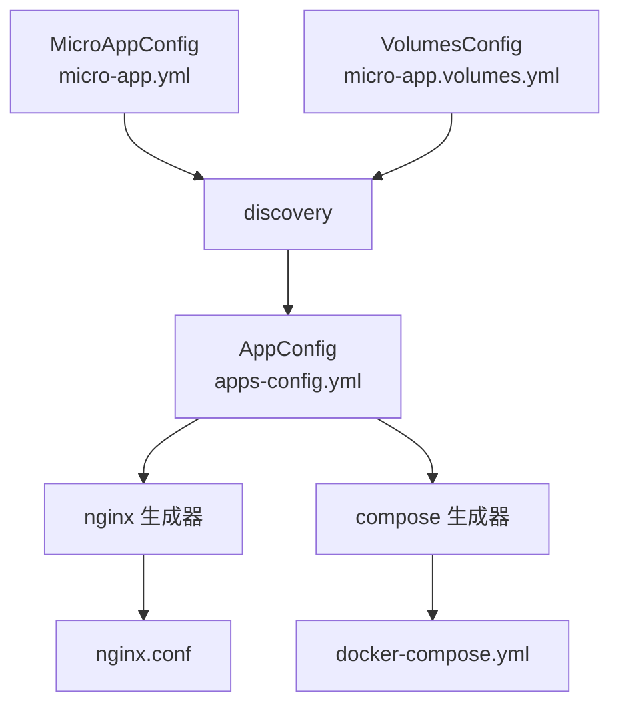

# 应用类型开发

<cite>
**本文引用的文件**
- [src/micro_app_config.rs](file://src/micro_app_config.rs)
- [src/config.rs](file://src/config.rs)
- [src/nginx.rs](file://src/nginx.rs)
- [src/compose.rs](file://src/compose.rs)
- [src/discovery.rs](file://src/discovery.rs)
- [src/volumes_config.rs](file://src/volumes_config.rs)
- [src/dockerfile.rs](file://src/dockerfile.rs)
- [src/cli.rs](file://src/cli.rs)
- [proxy-config.yml.example](file://proxy-config.yml.example)
- [docs/micro-app-development.md](file://docs/micro-app-development.md)
- [README.md](file://README.md)
- [src/main.rs](file://src/main.rs)
- [Cargo.toml](file://Cargo.toml)
</cite>

## 目录
1. [简介](#简介)
2. [项目结构](#项目结构)
3. [核心组件](#核心组件)
4. [架构总览](#架构总览)
5. [详细组件分析](#详细组件分析)
6. [依赖分析](#依赖分析)
7. [性能考虑](#性能考虑)
8. [故障排查指南](#故障排查指南)
9. [结论](#结论)
10. [附录](#附录)

## 简介
本指南面向在 micro_proxy 环境中开发三种微应用类型（Static、API、Internal）的开发者，系统阐述三类应用的开发规范、技术差异、配置要点、部署流程与性能优化建议。文档结合代码库中的配置模型、生成流程与示例文档，提供从目录结构、配置文件、Dockerfile 编写到部署与运维的完整实践路径。

## 项目结构
micro_proxy 通过“扫描目录 + 自动发现 + 动态生成”的方式管理微应用，核心流程如下：
- 读取主配置 proxy-config.yml，确定扫描目录、网络、端口、证书等全局参数
- 扫描目录发现包含 micro-app.yml 与 Dockerfile 的微应用
- 生成动态配置 apps-config.yml，随后生成 nginx.conf 与 docker-compose.yml
- 通过 docker compose 启动容器，Nginx 作为统一入口

图示来源
- [src/cli.rs:296-463](file://src/cli.rs#L296-L463)
- [src/discovery.rs:235-352](file://src/discovery.rs#L235-L352)
- [src/nginx.rs:26-92](file://src/nginx.rs#L26-L92)
- [src/compose.rs:31-119](file://src/compose.rs#L31-L119)

章节来源
- [src/cli.rs:296-463](file://src/cli.rs#L296-L463)
- [proxy-config.yml.example:1-53](file://proxy-config.yml.example#L1-L53)

## 核心组件
- 应用类型与配置模型
  - AppType：Static、Api、Internal
  - AppConfig：动态生成的应用配置，包含 name、routes、container_name、container_port、app_type、nginx_extra_config、path、docker_volumes、run_as_user 等
  - MicroAppConfig：微应用层的 micro-app.yml 配置，包含 routes、container_name、container_port、app_type、description、nginx_extra_config
- 生成器
  - Nginx 生成器：根据应用类型与路由生成 location 与上游变量，支持 HTTPS/ACME、Gzip、缓存策略
  - Compose 生成器：生成 docker-compose.yml，包含网络、nginx 服务、各应用服务、健康检查、卷挂载、用户等
- 发现与转换
  - discovery：扫描目录、校验微应用、生成 MicroApp，转换为 AppConfig
  - volumes_config：解析 micro-app.volumes.yml，生成 docker_volumes 与 run_as_user
  - dockerfile：解析 Dockerfile，提取 EXPOSE 端口
- CLI 生命周期
  - start：扫描、保存动态配置、验证、创建网络、构建镜像、生成配置、启动容器
  - stop/clean/status/network：容器生命周期与网络地址管理

章节来源
- [src/config.rs:12-68](file://src/config.rs#L12-L68)
- [src/micro_app_config.rs:11-33](file://src/micro_app_config.rs#L11-L33)
- [src/nginx.rs:26-92](file://src/nginx.rs#L26-L92)
- [src/compose.rs:31-119](file://src/compose.rs#L31-L119)
- [src/discovery.rs:12-38](file://src/discovery.rs#L12-L38)
- [src/volumes_config.rs:44-53](file://src/volumes_config.rs#L44-L53)
- [src/dockerfile.rs:23-36](file://src/dockerfile.rs#L23-L36)
- [src/cli.rs:296-463](file://src/cli.rs#L296-L463)

## 架构总览
三种应用类型的差异体现在“是否对外暴露”、“是否生成 Nginx 配置”、“路由处理策略”以及“容器健康检查”等方面。下图展示三类应用在系统中的角色与交互：

图示来源
- [src/config.rs:354-367](file://src/config.rs#L354-L367)
- [src/nginx.rs:418-536](file://src/nginx.rs#L418-L536)
- [src/compose.rs:172-266](file://src/compose.rs#L172-L266)

## 详细组件分析

### Static 类型应用
- 应用场景
  - 前端 SPA、静态网站，需要通过 Nginx 对外提供服务
  - 支持子路径部署（如 /app），Nginx 通过 try_files 回退到 index.html
- 技术特点
  - 生成 location 时对根路径与非根路径分别处理，非根路径使用 rewrite 将前端路由重写到后端 /
  - 启用静态文件缓存与 Gzip 压缩
  - 支持 nginx_extra_config 自定义响应头、CORS、特殊路径转发
- 配置要点
  - routes 必须配置；app_type: static
  - Dockerfile 中需复制自定义 nginx.conf（SPA 必需）
  - 可选 micro-app.volumes.yml 配置数据/日志卷与 run_as_user
- 目录结构与文件
  - micro-app.yml、Dockerfile、nginx.conf（SPA 必需）、.env（可选）、setup.sh/clean.sh（可选）、dist/（构建产物）

图示来源
- [src/nginx.rs:438-488](file://src/nginx.rs#L438-L488)
- [docs/micro-app-development.md:250-340](file://docs/micro-app-development.md#L250-L340)

章节来源
- [src/nginx.rs:418-536](file://src/nginx.rs#L418-L536)
- [docs/micro-app-development.md:250-340](file://docs/micro-app-development.md#L250-L340)

### API 类型应用
- 应用场景
  - 后端 API 服务，请求路径完整透传至后端容器
- 技术特点
  - location 直接转发完整 URI，不追加尾部斜杠
  - 支持 OPTIONS 预检、CORS、自定义响应头等
  - 生成健康检查（wget 探针），提升容器编排可靠性
- 配置要点
  - routes 必须配置；app_type: api
  - 可选 nginx_extra_config 注入 CORS、预检处理等
  - 可选 volumes 与 run_as_user
- 目录结构与文件
  - micro-app.yml、Dockerfile、.env（可选）、setup.sh/clean.sh（可选）、src/（源代码）

图示来源
- [src/nginx.rs:489-525](file://src/nginx.rs#L489-L525)
- [docs/micro-app-development.md:342-428](file://docs/micro-app-development.md#L342-L428)

章节来源
- [src/nginx.rs:489-525](file://src/nginx.rs#L489-L525)
- [docs/micro-app-development.md:342-428](file://docs/micro-app-development.md#L342-L428)

### Internal 类型应用
- 应用场景
  - 内部服务（如 Redis、MySQL、MongoDB），不对外暴露，仅用于微应用间通信
- 技术特点
  - 不生成 Nginx 配置；routes 必须为空数组
  - 通过容器名称与端口直接访问（如 http://redis:6379）
  - 不生成健康检查（可能非 HTTP 服务）
- 配置要点
  - routes: []；app_type: internal
  - 必须提供 path 字段，指向包含 Dockerfile 的目录
  - 可选 volumes 与 run_as_user
- 目录结构与文件
  - micro-app.yml、Dockerfile、data/、logs/（可选）、setup.sh/clean.sh（可选）

图示来源
- [src/config.rs:273-322](file://src/config.rs#L273-L322)
- [docs/micro-app-development.md:430-502](file://docs/micro-app-development.md#L430-L502)

章节来源
- [src/config.rs:273-322](file://src/config.rs#L273-L322)
- [docs/micro-app-development.md:430-502](file://docs/micro-app-development.md#L430-L502)

### 类型间通信与网络配置
- 统一 Docker 网络
  - 通过 compose 生成器创建外部网络（名称来自 proxy-config.yml），所有应用加入该网络
  - Internal 应用通过容器名与端口直接通信
- 依赖关系
  - Nginx 仅依赖非 Internal 应用（防止 Internal 应用不可用导致 Nginx 启动失败）
- 端口映射
  - 宿主机端口由 proxy-config.yml 的 nginx_host_port 决定，容器内部端口固定为 80（HTTP）或 443（HTTPS）

图示来源
- [src/compose.rs:54-96](file://src/compose.rs#L54-L96)
- [src/compose.rs:236-257](file://src/compose.rs#L236-L257)
- [proxy-config.yml.example:27-31](file://proxy-config.yml.example#L27-L31)

章节来源
- [src/compose.rs:54-96](file://src/compose.rs#L54-L96)
- [src/compose.rs:236-257](file://src/compose.rs#L236-L257)
- [proxy-config.yml.example:27-31](file://proxy-config.yml.example#L27-L31)

## 依赖分析
- 配置与模型
  - AppType 与 AppConfig 定义了三类应用的统一模型
  - MicroAppConfig 与 VolumesConfig 分别负责微应用配置与卷配置
- 生成链路
  - discovery 将扫描到的微应用转换为 AppConfig
  - nginx 与 compose 依据 AppConfig 生成最终配置
- 关键耦合点
  - routes 与 app_type 决定是否生成 Nginx 配置与健康检查
  - Internal 类型的 path 与 Dockerfile 必须存在，否则验证失败

图示来源
- [src/discovery.rs:40-91](file://src/discovery.rs#L40-L91)
- [src/discovery.rs:121-144](file://src/discovery.rs#L121-L144)
- [src/nginx.rs:26-92](file://src/nginx.rs#L26-L92)
- [src/compose.rs:31-119](file://src/compose.rs#L31-L119)

章节来源
- [src/discovery.rs:40-91](file://src/discovery.rs#L40-L91)
- [src/discovery.rs:121-144](file://src/discovery.rs#L121-L144)
- [src/nginx.rs:26-92](file://src/nginx.rs#L26-L92)
- [src/compose.rs:31-119](file://src/compose.rs#L31-L119)

## 性能考虑
- Nginx 层优化
  - Static 应用启用静态缓存与 Gzip，减少带宽与延迟
  - API 应用禁用缓存，避免脏数据
  - 合理设置 proxy_connect_timeout、proxy_send_timeout、proxy_read_timeout
- 容器健康检查
  - Static 与 API 类型生成健康检查（wget 探针），提升容器编排稳定性
  - Internal 类型不生成健康检查，避免非 HTTP 服务误判
- 端口与网络
  - 统一入口端口映射，避免多端口暴露
  - 使用外部网络，避免 docker-compose 自动生成项目前缀带来的复杂性

章节来源
- [src/nginx.rs:489-525](file://src/nginx.rs#L489-L525)
- [src/compose.rs:358-421](file://src/compose.rs#L358-L421)

## 故障排查指南
- 常见问题定位
  - 配置验证失败：检查 routes、container_name 唯一性、Internal 的 path 与 Dockerfile
  - Nginx 配置异常：检查 nginx.conf 生成与 ACME 验证路径
  - 容器启动失败：查看 docker-compose.yml 依赖关系与健康检查
- 日志与诊断
  - CLI 提供 -v 详细日志
  - 使用 micro_proxy status 查看容器与镜像状态
  - 使用 micro_proxy network 生成网络地址列表，辅助连通性排查

章节来源
- [src/config.rs:221-347](file://src/config.rs#L221-L347)
- [src/cli.rs:550-584](file://src/cli.rs#L550-L584)
- [src/cli.rs:586-636](file://src/cli.rs#L586-L636)

## 结论
三种应用类型在 micro_proxy 中通过统一的配置模型与生成流程实现一致的开发体验：Static 与 API 通过 Nginx 对外提供服务，Internal 仅用于内部通信。开发者只需遵循各自类型的配置约束与目录结构，即可快速完成从开发到部署的全流程。

## 附录

### 三类应用的开发规范与配置要点对比
- Static
  - 必需：routes、container_name、container_port、app_type: static、Dockerfile
  - 可选：nginx.conf（SPA 必需）、micro-app.volumes.yml、.env、setup.sh/clean.sh
  - 特点：启用静态缓存、Gzip；支持子路径部署
- API
  - 必需：routes、container_name、container_port、app_type: api、Dockerfile
  - 可选：nginx_extra_config、micro-app.volumes.yml、.env、setup.sh/clean.sh
  - 特点：完整路径透传；支持 CORS 与预检
- Internal
  - 必需：routes: []、container_name、container_port、app_type: internal、path、Dockerfile
  - 可选：micro-app.volumes.yml、setup.sh/clean.sh
  - 特点：不对外暴露；通过容器名与端口通信

章节来源
- [docs/micro-app-development.md:46-55](file://docs/micro-app-development.md#L46-L55)
- [src/micro_app_config.rs:55-106](file://src/micro_app_config.rs#L55-L106)
- [src/config.rs:221-322](file://src/config.rs#L221-L322)

### 类型选择与迁移指南
- 选择建议
  - 需要对外提供前端/静态资源：选择 Static
  - 需要对外提供后端接口：选择 API
  - 仅内部使用（数据库/缓存）：选择 Internal
- 迁移方案
  - 从 Static 迁移到 API：调整 routes 与 nginx 配置，确保路径透传
  - 从 API 迁移到 Internal：移除 Nginx 配置，设置 routes: []，提供 path 指向 Dockerfile
  - 从 Internal 迁移到 Static/API：补充 routes 与 Dockerfile，必要时添加 nginx.conf

章节来源
- [docs/micro-app-development.md:46-55](file://docs/micro-app-development.md#L46-L55)
- [src/config.rs:354-367](file://src/config.rs#L354-L367)

### 部署流程（三类应用通用步骤）
- 准备主配置 proxy-config.yml，设置扫描目录、网络、端口、证书等
- 在微应用目录下创建 micro-app.yml、Dockerfile（与可选文件）
- 执行 micro_proxy start，系统将：
  - 扫描微应用并生成 apps-config.yml
  - 生成 nginx.conf 与 docker-compose.yml
  - 构建镜像、创建网络、启动容器
- 访问统一入口：http://localhost:nginx_host_port

章节来源
- [src/cli.rs:296-463](file://src/cli.rs#L296-L463)
- [proxy-config.yml.example:1-53](file://proxy-config.yml.example#L1-L53)
- [README.md:70-112](file://README.md#L70-L112)