# 开发调试流程

<cite>
**本文档引用的文件**
- [README.md](file://README.md)
- [Cargo.toml](file://Cargo.toml)
- [src/main.rs](file://src/main.rs)
- [src/lib.rs](file://src/lib.rs)
- [src/cli.rs](file://src/cli.rs)
- [src/config.rs](file://src/config.rs)
- [src/discovery.rs](file://src/discovery.rs)
- [src/state.rs](file://src/state.rs)
- [src/builder.rs](file://src/builder.rs)
- [src/compose.rs](file://src/compose.rs)
- [src/nginx.rs](file://src/nginx.rs)
- [src/network.rs](file://src/network.rs)
- [src/volumes_config.rs](file://src/volumes_config.rs)
- [proxy-config.yml.example](file://proxy-config.yml.example)
- [docs/micro-app-development.md](file://docs/micro-app-development.md)
</cite>

## 目录
1. [引言](#引言)
2. [项目结构](#项目结构)
3. [核心组件](#核心组件)
4. [架构概览](#架构概览)
5. [详细组件分析](#详细组件分析)
6. [依赖关系分析](#依赖关系分析)
7. [性能考虑](#性能考虑)
8. [故障排查指南](#故障排查指南)
9. [结论](#结论)
10. [附录](#附录)

## 引言

micro_proxy 是一个专为微应用开发而设计的管理工具，支持 Docker 镜像构建、容器管理、Nginx 反向代理配置等功能。本文档将为开发者提供从开发到部署的完整工作流程指南，涵盖开发环境搭建、配置管理、构建缓存、日志查看、问题排查以及开发效率提升的最佳实践。

## 项目结构

该项目采用 Rust 语言开发，遵循标准的 Cargo 项目结构：

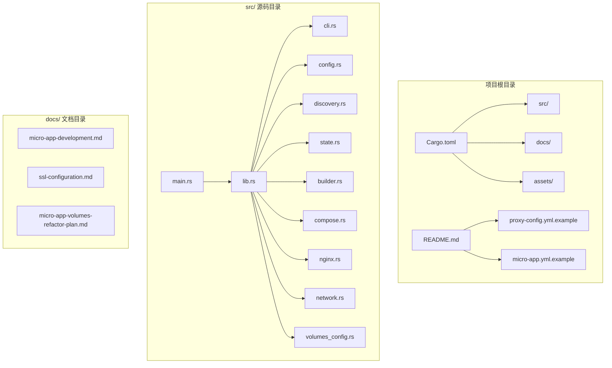

**图表来源**
- [Cargo.toml:1-55](file://Cargo.toml#L1-L55)
- [src/lib.rs:1-26](file://src/lib.rs#L1-L26)

**章节来源**
- [Cargo.toml:1-55](file://Cargo.toml#L1-L55)
- [README.md:421-441](file://README.md#L421-L441)

## 核心组件

micro_proxy 的核心功能由以下主要组件构成：

### 命令行接口 (CLI)
负责处理用户输入和提供命令行交互界面，支持 start、stop、clean、status、network 等子命令。

### 配置管理系统
管理主配置文件和应用配置，支持 YAML 格式的配置解析和序列化。

### 应用发现模块
扫描指定目录，自动发现包含 micro-app.yml 和 Dockerfile 的微应用。

### 状态管理器
跟踪微应用的构建状态，实现智能的增量构建和缓存管理。

### 构建器模块
负责 Docker 镜像的构建过程，支持环境变量传递和缓存控制。

### Compose 生成器
自动生成 docker-compose.yml 文件，配置服务间的网络和依赖关系。

### Nginx 配置生成器
根据应用配置生成 Nginx 反向代理配置，支持静态资源和 API 服务的不同路由规则。

### 网络管理器
管理 Docker 网络的创建、删除和查询操作。

**章节来源**
- [src/cli.rs:1-669](file://src/cli.rs#L1-L669)
- [src/config.rs:1-842](file://src/config.rs#L1-L842)
- [src/discovery.rs:1-721](file://src/discovery.rs#L1-L721)
- [src/state.rs:1-311](file://src/state.rs#L1-L311)
- [src/builder.rs:1-218](file://src/builder.rs#L1-L218)
- [src/compose.rs:1-905](file://src/compose.rs#L1-L905)
- [src/nginx.rs:1-1101](file://src/nginx.rs#L1-L1101)
- [src/network.rs:1-397](file://src/network.rs#L1-L397)

## 架构概览

micro_proxy 采用模块化的架构设计，各个组件职责明确，通过清晰的接口进行交互：

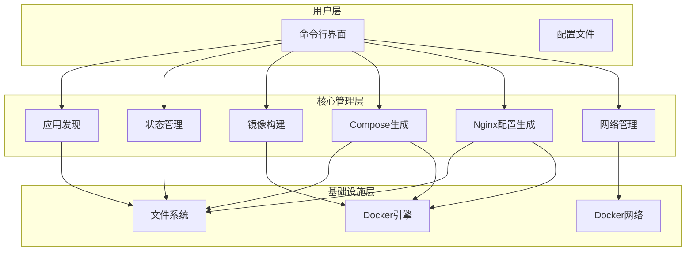

**图表来源**
- [src/main.rs:1-25](file://src/main.rs#L1-L25)
- [src/cli.rs:78-116](file://src/cli.rs#L78-L116)
- [src/discovery.rs:235-352](file://src/discovery.rs#L235-L352)

## 详细组件分析

### 命令行接口组件

CLI 模块提供了完整的命令行交互功能，支持多种操作模式：

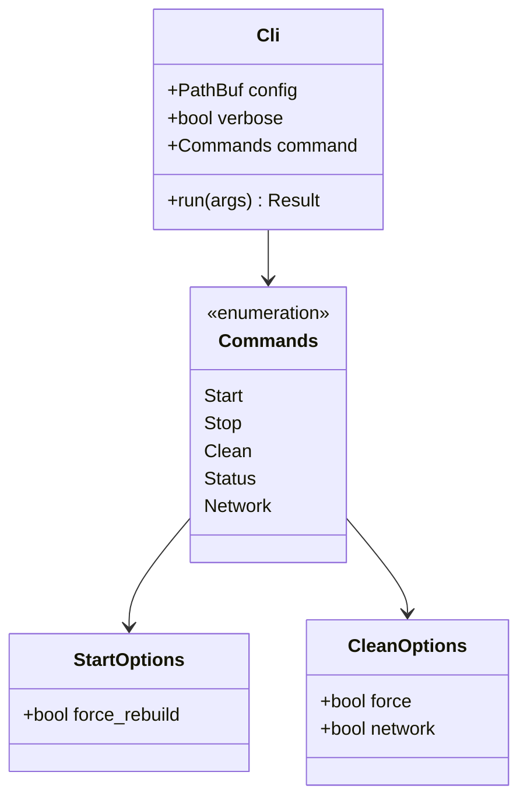

**图表来源**
- [src/cli.rs:22-69](file://src/cli.rs#L22-L69)

#### 命令执行流程

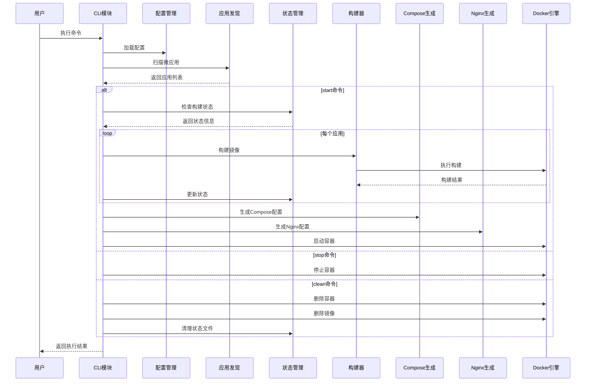

**图表来源**
- [src/cli.rs:297-463](file://src/cli.rs#L297-L463)
- [src/cli.rs:466-548](file://src/cli.rs#L466-L548)

**章节来源**
- [src/cli.rs:78-116](file://src/cli.rs#L78-L116)
- [src/cli.rs:297-463](file://src/cli.rs#L297-L463)

### 配置管理系统

配置管理模块负责处理主配置文件和应用配置：

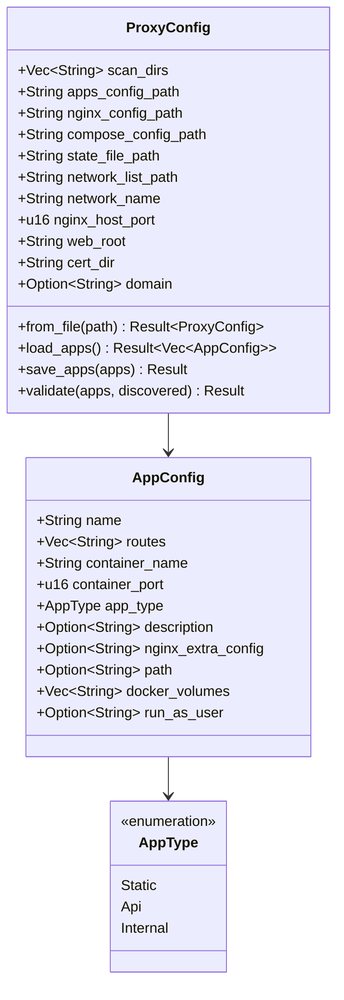

**图表来源**
- [src/config.rs:126-164](file://src/config.rs#L126-L164)
- [src/config.rs:24-68](file://src/config.rs#L24-L68)

#### 配置验证流程

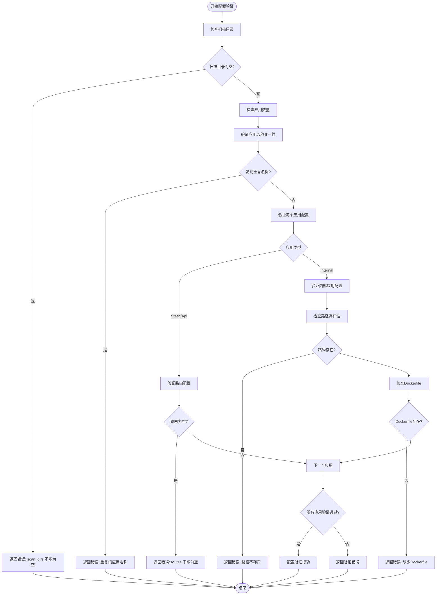

**图表来源**
- [src/config.rs:221-347](file://src/config.rs#L221-L347)

**章节来源**
- [src/config.rs:178-218](file://src/config.rs#L178-L218)
- [src/config.rs:221-347](file://src/config.rs#L221-L347)

### 应用发现模块

应用发现模块负责扫描指定目录，自动发现微应用：

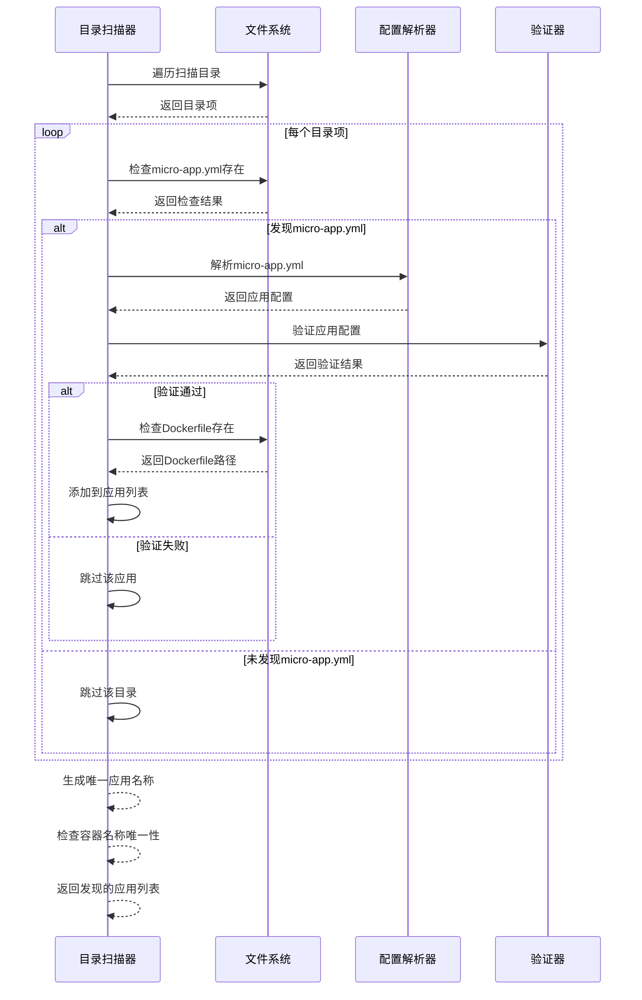

**图表来源**
- [src/discovery.rs:235-352](file://src/discovery.rs#L235-L352)

#### 唯一应用名称生成算法

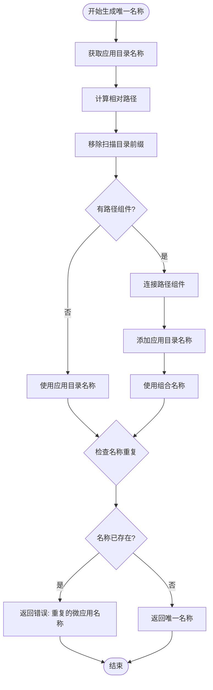

**图表来源**
- [src/discovery.rs:159-222](file://src/discovery.rs#L159-L222)

**章节来源**
- [src/discovery.rs:235-352](file://src/discovery.rs#L235-L352)
- [src/discovery.rs:159-222](file://src/discovery.rs#L159-L222)

### 状态管理模块

状态管理器负责跟踪微应用的构建状态，实现智能的增量构建：

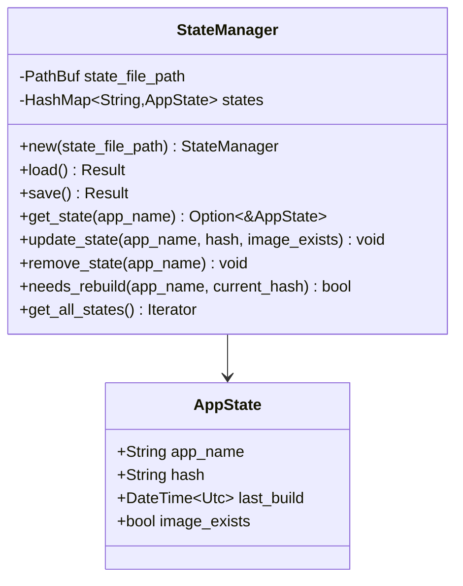

**图表来源**
- [src/state.rs:31-56](file://src/state.rs#L31-L56)
- [src/state.rs:14-28](file://src/state.rs#L14-L28)

#### 目录哈希计算算法

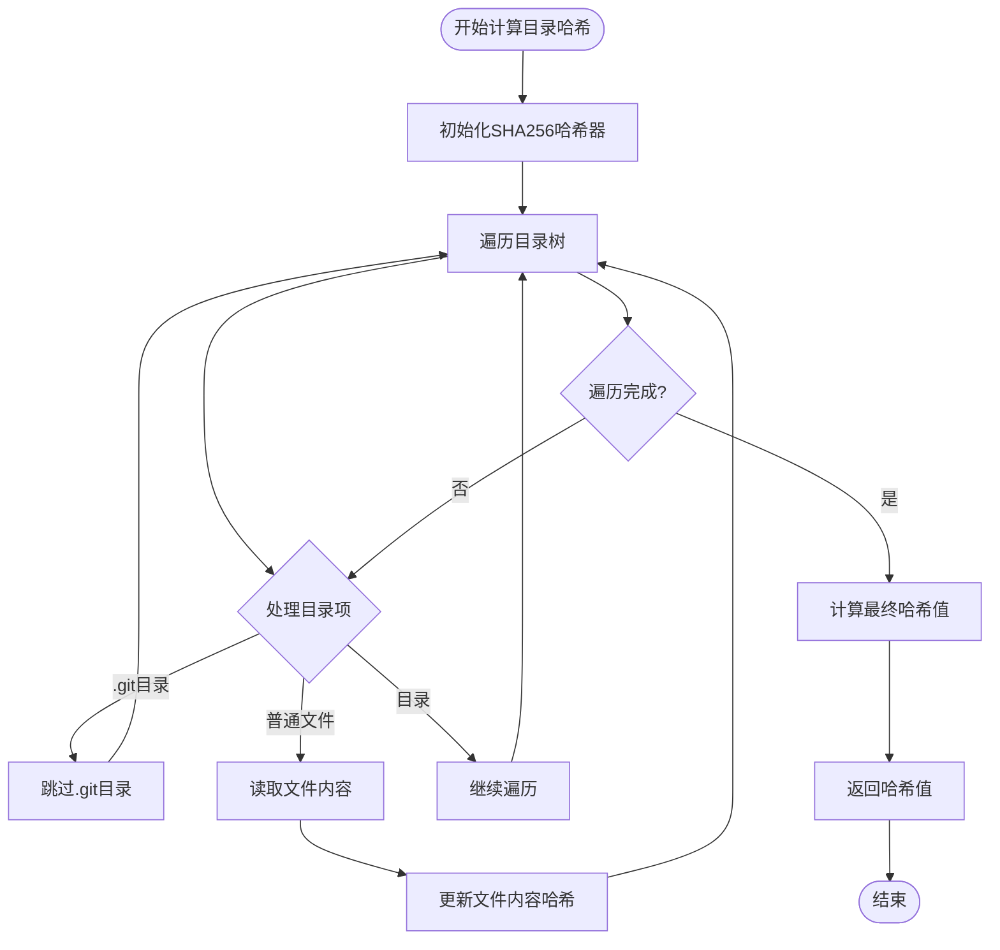

**图表来源**
- [src/state.rs:195-233](file://src/state.rs#L195-L233)

**章节来源**
- [src/state.rs:40-186](file://src/state.rs#L40-L186)
- [src/state.rs:195-233](file://src/state.rs#L195-L233)

### 构建器模块

构建器模块负责 Docker 镜像的构建过程：

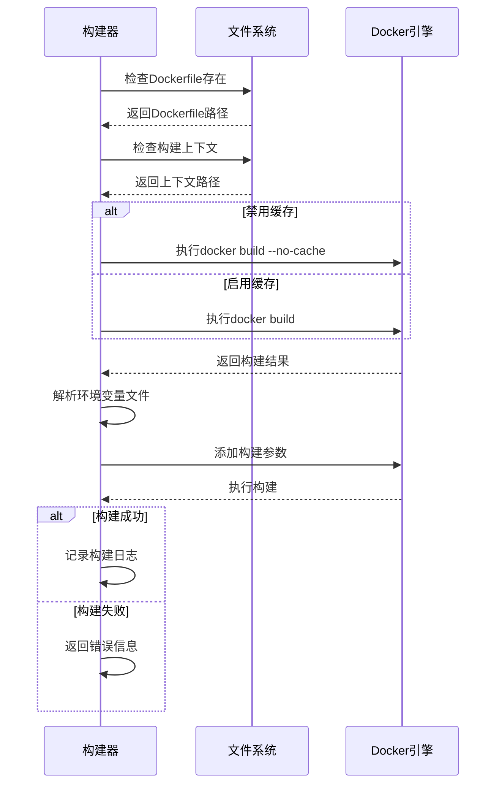

**图表来源**
- [src/builder.rs:20-120](file://src/builder.rs#L20-L120)

#### 环境变量处理流程

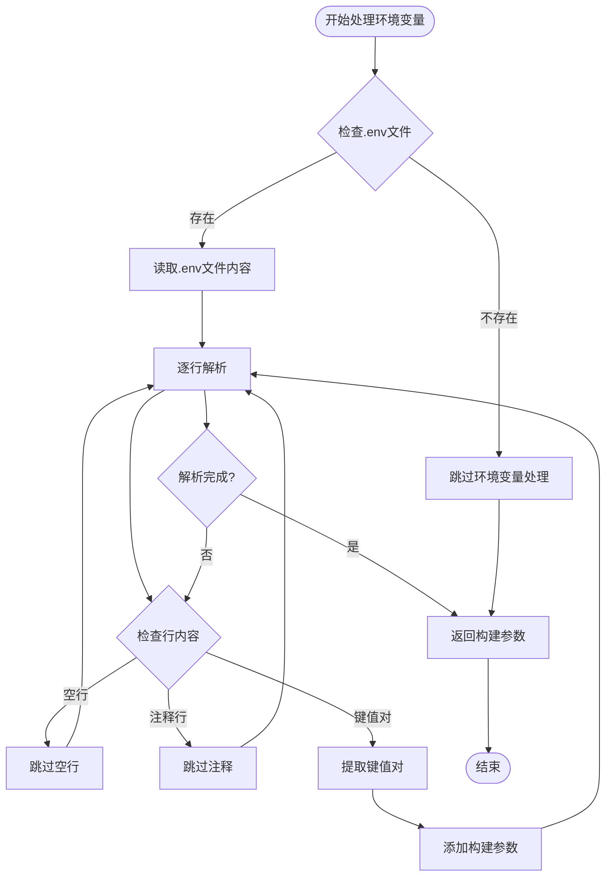

**图表来源**
- [src/builder.rs:67-88](file://src/builder.rs#L67-L88)

**章节来源**
- [src/builder.rs:20-120](file://src/builder.rs#L20-L120)
- [src/builder.rs:67-88](file://src/builder.rs#L67-L88)

### Compose 配置生成器

Compose 生成器负责自动生成 docker-compose.yml 文件：

```mermaid
classDiagram
class ComposeConfig {
+Mapping services
+Mapping networks
}
class ComposeGenerator {
+generate_compose_config(apps, network_name, nginx_host_port,
env_files, web_root, cert_dir, domain) Result~String~
+generate_nginx_service() Mapping
+generate_app_service(app, network_name, env_file) Mapping
}
ComposeGenerator --> ComposeConfig
```

**图表来源**
- [src/compose.rs:11-16](file://src/compose.rs#L11-L16)
- [src/compose.rs:31-119](file://src/compose.rs#L31-L119)

#### SSL 证书检测流程

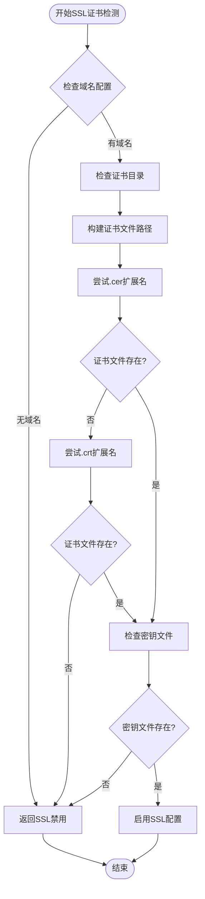

**图表来源**
- [src/compose.rs:129-158](file://src/compose.rs#L129-L158)

**章节来源**
- [src/compose.rs:31-119](file://src/compose.rs#L31-L119)
- [src/compose.rs:129-158](file://src/compose.rs#L129-L158)

### Nginx 配置生成器

Nginx 配置生成器根据应用类型生成不同的路由规则：

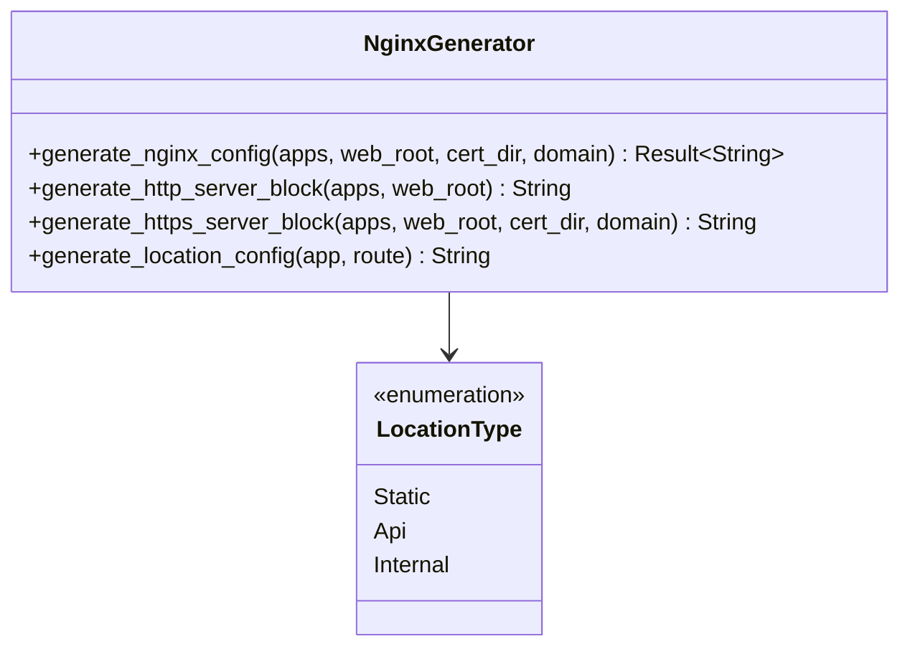

**图表来源**
- [src/nginx.rs:26-92](file://src/nginx.rs#L26-L92)
- [src/nginx.rs:418-536](file://src/nginx.rs#L418-L536)

#### 动态DNS解析机制

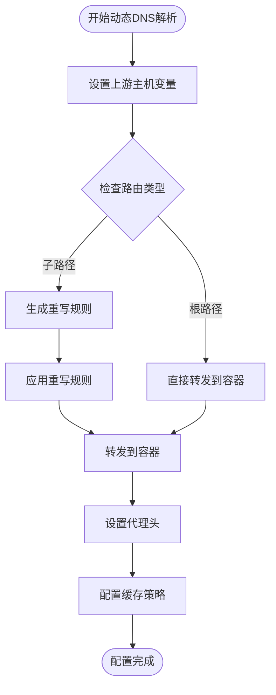

**图表来源**
- [src/nginx.rs:418-536](file://src/nginx.rs#L418-L536)

**章节来源**
- [src/nginx.rs:26-92](file://src/nginx.rs#L26-L92)
- [src/nginx.rs:418-536](file://src/nginx.rs#L418-L536)

### 网络管理器

网络管理器负责 Docker 网络的创建和管理：

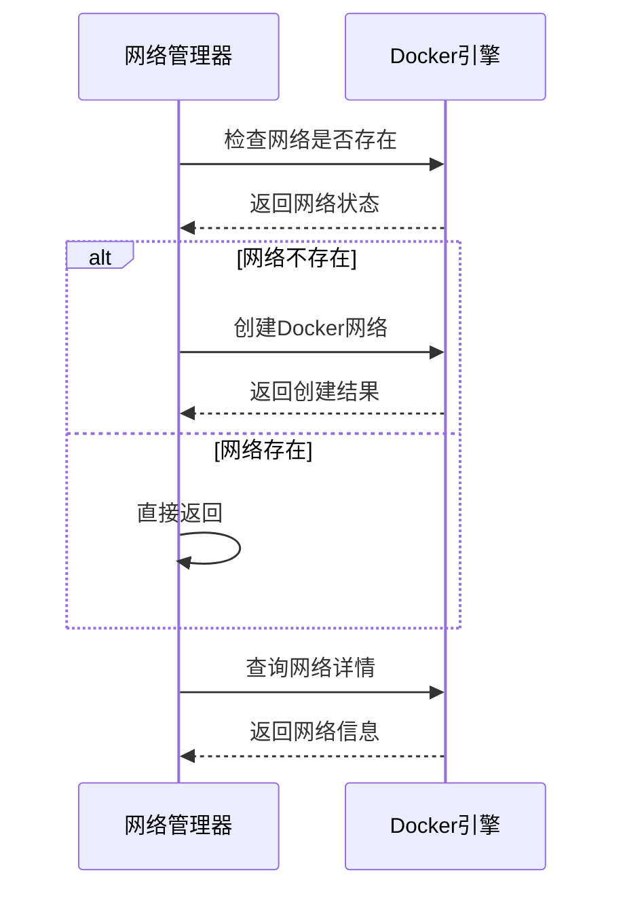

**图表来源**
- [src/network.rs:15-47](file://src/network.rs#L15-L47)

**章节来源**
- [src/network.rs:15-119](file://src/network.rs#L15-L119)

## 依赖关系分析

项目依赖关系图展示了各个模块之间的依赖关系：

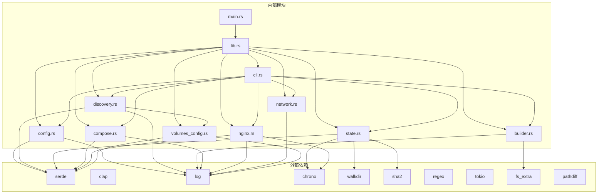

**图表来源**
- [Cargo.toml:13-51](file://Cargo.toml#L13-L51)
- [src/lib.rs:6-18](file://src/lib.rs#L6-L18)

**章节来源**
- [Cargo.toml:13-51](file://Cargo.toml#L13-L51)
- [src/lib.rs:6-18](file://src/lib.rs#L6-L18)

## 性能考虑

### 构建缓存优化

micro_proxy 实现了智能的构建缓存机制，通过目录哈希值判断是否需要重新构建：

1. **增量构建**: 只有当目录内容发生变化时才重新构建镜像
2. **哈希计算**: 使用 SHA256 算法计算目录内容的哈希值
3. **状态持久化**: 将构建状态保存到状态文件中

### 并行处理

项目使用 tokio 异步运行时，支持并发处理多个微应用的构建任务。

### 内存管理

- 使用智能指针和所有权模型避免内存泄漏
- 合理使用引用避免不必要的数据拷贝
- 及时释放不再使用的资源

## 故障排查指南

### 常见问题及解决方案

#### 1. 端口冲突问题

**问题症状**: 启动时提示端口已被占用

**排查步骤**:
```bash
# 检查端口占用情况
sudo lsof -i :80
sudo lsof -i :8080

# 修改配置文件中的端口号
vim proxy-config.yml
# 将 nginx_host_port 修改为未被占用的端口
```

**章节来源**
- [README.md:363-372](file://README.md#L363-L372)

#### 2. Docker 镜像构建失败

**问题症状**: 构建过程中出现错误

**排查步骤**:
```bash
# 查看详细的构建日志
micro_proxy start -v

# 检查 Dockerfile 是否正确
cat ./micro-apps/my-app/Dockerfile

# 检查构建上下文路径
ls -la ./micro-apps/my-app/

# 清理构建缓存后重试
micro_proxy start --force-rebuild
```

**章节来源**
- [src/builder.rs:95-120](file://src/builder.rs#L95-L120)

#### 3. Nginx 配置错误

**问题症状**: 访问应用时出现 502 或 504 错误

**排查步骤**:
```bash
# 检查 Nginx 配置语法
docker exec proxy-nginx nginx -t

# 查看 Nginx 错误日志
docker logs proxy-nginx | grep -i error

# 检查后端服务是否正常运行
docker ps -a
```

**章节来源**
- [src/nginx.rs:94-131](file://src/nginx.rs#L94-L131)

#### 4. 卷挂载权限问题

**问题症状**: 应用无法写入挂载的目录

**排查步骤**:
```bash
# 检查宿主机目录权限
ls -la ./data

# 检查容器内挂载点
docker exec <container-name> ls -la /app/data

# 查看容器详细信息
docker inspect <container-name> | grep -A 10 Mounts
```

**章节来源**
- [src/volumes_config.rs:145-196](file://src/volumes_config.rs#L145-L196)

#### 5. 网络连接问题

**问题症状**: 微应用间无法通信

**排查步骤**:
```bash
# 生成网络地址列表
micro_proxy network

# 检查 Docker 网络
docker network ls

# 测试容器间连接
docker exec <container1> ping <container2>
```

**章节来源**
- [src/network.rs:209-274](file://src/network.rs#L209-L274)

### 日志查看技巧

#### 1. 启用详细日志
```bash
# 使用 -v 或 --verbose 参数
micro_proxy start -v
micro_proxy status -v
```

#### 2. 查看容器日志
```bash
# 查看所有容器日志
docker logs -f $(docker ps -aq)

# 查看特定容器日志
docker logs -f <container-name>
```

#### 3. 分析日志文件
项目会自动生成日志文件，文件名为包名称加上 .log 扩展名。

**章节来源**
- [src/cli.rs:81-88](file://src/cli.rs#L81-L88)

## 结论

micro_proxy 提供了一个完整的微应用开发和部署解决方案，具有以下特点：

1. **模块化设计**: 各个组件职责明确，易于维护和扩展
2. **智能缓存**: 通过状态管理和哈希计算实现高效的增量构建
3. **自动化程度高**: 从应用发现到容器启动的全流程自动化
4. **配置灵活**: 支持多种配置方式和自定义选项
5. **易于调试**: 完善的日志系统和故障排查工具

通过遵循本文档提供的工作流程和最佳实践，开发者可以高效地进行微应用的开发、测试和部署。

## 附录

### 开发环境搭建

#### 1. 系统要求
- Rust 1.56 或更高版本
- Docker Engine 20.10 或更高版本
- Docker Compose 1.29 或更高版本

#### 2. 安装步骤
```bash
# 克隆仓库
git clone https://github.com/cao5zy/proxy-config
cd proxy-config

# 安装依赖
cargo install

# 验证安装
micro_proxy --version
```

#### 3. 配置文件设置
```bash
# 复制示例配置文件
cp proxy-config.yml.example proxy-config.yml

# 编辑配置文件
vim proxy-config.yml
```

**章节来源**
- [README.md:48-68](file://README.md#L48-L68)
- [proxy-config.yml.example:1-53](file://proxy-config.yml.example#L1-L53)

### 开发工作流程

#### 1. 创建微应用
```bash
# 创建微应用目录
mkdir -p micro-apps/my-app

# 复制配置模板
cp micro-app.yml.example micro-apps/my-app/micro-app.yml

# 编写 Dockerfile
vim micro-apps/my-app/Dockerfile
```

#### 2. 开发和测试
```bash
# 启动微应用
micro_proxy start

# 查看状态
micro_proxy status

# 查看网络地址
micro_proxy network
```

#### 3. 调试和优化
```bash
# 启用详细日志
micro_proxy start -v

# 查看容器日志
docker logs -f <container-name>

# 清理和重新构建
micro_proxy clean --force
micro_proxy start --force-rebuild
```

**章节来源**
- [docs/micro-app-development.md:250-428](file://docs/micro-app-development.md#L250-L428)
- [README.md:70-112](file://README.md#L70-L112)

### 版本控制和持续集成

#### 1. Git 配置
```bash
# 添加 .gitignore
echo "proxy-config.state" >> .gitignore
echo "*.log" >> .gitignore
echo "apps-config.yml" >> .gitignore
```

#### 2. CI/CD 配置示例
```yaml
name: Build and Deploy

on:
  push:
    branches: [ main ]
  pull_request:
    branches: [ main ]

jobs:
  build:
    runs-on: ubuntu-latest
    
    steps:
    - uses: actions/checkout@v2
    
    - name: Setup Rust
      uses: actions-rs/toolchain@v1
      with:
        toolchain: stable
        override: true
    
    - name: Build
      run: cargo build --release
    
    - name: Test
      run: cargo test
    
    - name: Upload artifacts
      uses: actions/upload-artifact@v2
      with:
        name: micro-proxy
        path: target/release/micro_proxy
```

**章节来源**
- [.gitignore](file://.gitignore)
- [Cargo.toml:1-55](file://Cargo.toml#L1-L55)