# 本地开发环境搭建

<cite>
**本文档引用的文件**
- [README.md](file://README.md)
- [README.en.md](file://README.en.md)
- [Cargo.toml](file://Cargo.toml)
- [src/main.rs](file://src/main.rs)
- [src/lib.rs](file://src/lib.rs)
- [src/cli.rs](file://src/cli.rs)
- [src/config.rs](file://src/config.rs)
- [src/discovery.rs](file://src/discovery.rs)
- [src/network.rs](file://src/network.rs)
- [src/nginx.rs](file://src/nginx.rs)
- [src/compose.rs](file://src/compose.rs)
- [src/state.rs](file://src/state.rs)
- [src/micro_app_config.rs](file://src/micro_app_config.rs)
- [src/volumes_config.rs](file://src/volumes_config.rs)
- [deploy_to_local.sh](file://deploy_to_local.sh)
</cite>

## 目录
1. [引言](#引言)
2. [项目结构](#项目结构)
3. [核心组件](#核心组件)
4. [架构概览](#架构概览)
5. [详细组件分析](#详细组件分析)
6. [依赖关系分析](#依赖关系分析)
7. [性能考虑](#性能考虑)
8. [故障排查指南](#故障排查指南)
9. [结论](#结论)
10. [附录](#附录)

## 引言

micro_proxy 是一个专为微应用开发设计的本地环境管理工具，支持 Docker 镜像构建、容器管理、Nginx 反向代理配置等功能。本文档将详细介绍如何搭建和使用这个微应用本地开发环境，包括工具链安装、配置管理、开发服务器启动、网络配置、端口管理、热重载和自动构建等关键主题。

## 项目结构

该项目采用 Rust 语言开发，遵循标准的 Cargo 项目结构：

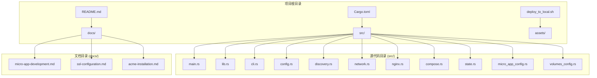

**图表来源**
- [Cargo.toml:1-55](file://Cargo.toml#L1-L55)
- [src/lib.rs:1-26](file://src/lib.rs#L1-L26)

**章节来源**
- [Cargo.toml:1-55](file://Cargo.toml#L1-L55)
- [src/lib.rs:1-26](file://src/lib.rs#L1-L26)

## 核心组件

### 命令行接口 (CLI)

CLI 模块提供了完整的命令行交互界面，支持多种操作模式：

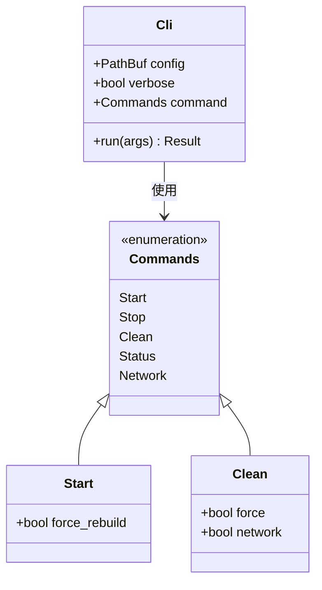

**图表来源**
- [src/cli.rs:22-69](file://src/cli.rs#L22-L69)

### 配置管理系统

配置系统支持主配置文件和微应用配置文件的双重管理：

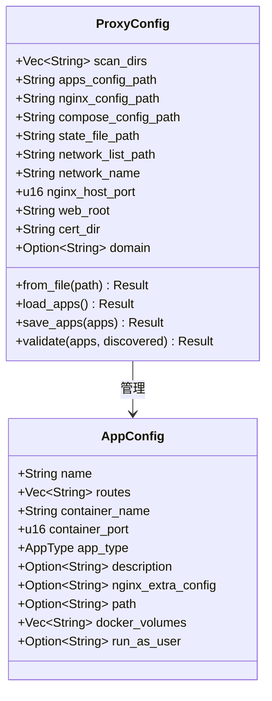

**图表来源**
- [src/config.rs:125-367](file://src/config.rs#L125-L367)

**章节来源**
- [src/cli.rs:71-116](file://src/cli.rs#L71-L116)
- [src/config.rs:11-68](file://src/config.rs#L11-L68)

## 架构概览

micro_proxy 采用模块化的架构设计，各个组件职责明确：

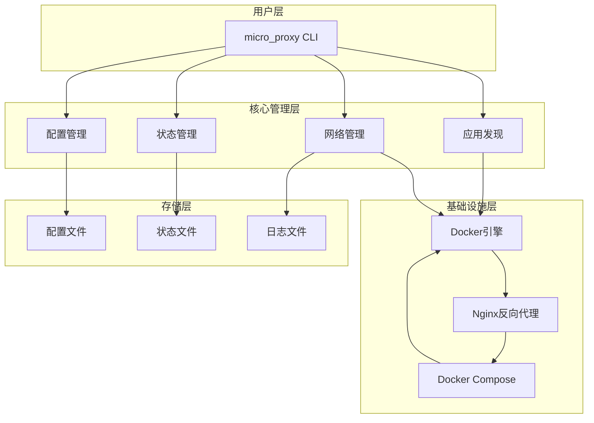

**图表来源**
- [src/main.rs:1-25](file://src/main.rs#L1-L25)
- [src/lib.rs:6-18](file://src/lib.rs#L6-L18)

## 详细组件分析

### 应用发现机制

应用发现模块负责扫描微应用目录并自动识别有效的微应用：

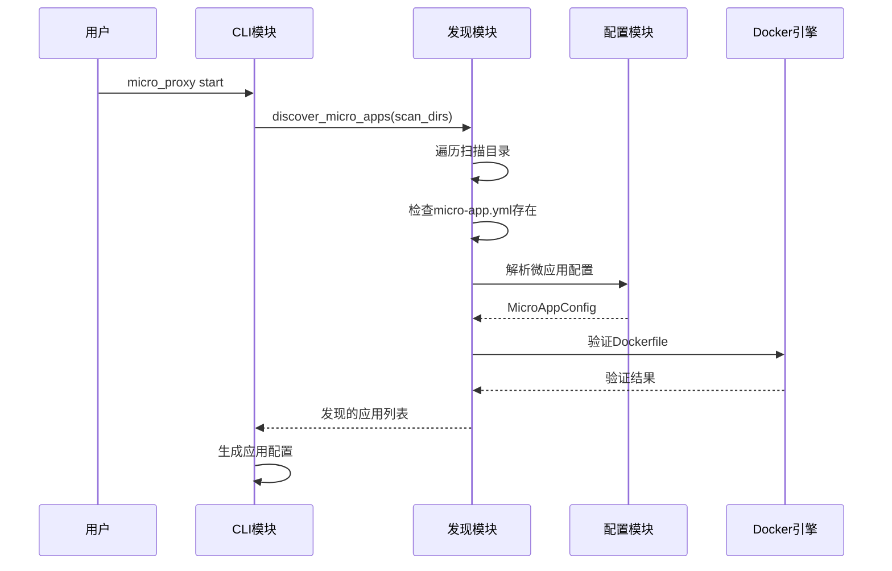

**图表来源**
- [src/cli.rs:296-463](file://src/cli.rs#L296-L463)
- [src/discovery.rs:224-352](file://src/discovery.rs#L224-L352)

### Nginx配置生成

Nginx配置生成模块支持动态SSL证书检测和多应用路由：

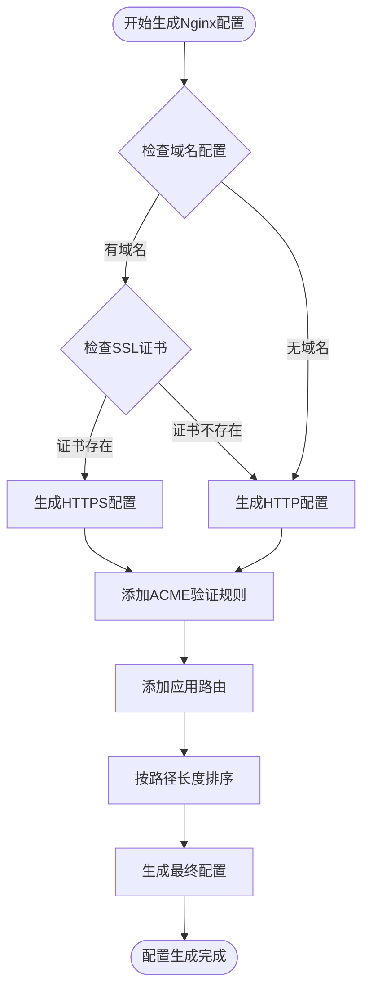

**图表来源**
- [src/nginx.rs:26-92](file://src/nginx.rs#L26-L92)
- [src/nginx.rs:284-416](file://src/nginx.rs#L284-L416)

### Docker Compose集成

Docker Compose模块负责生成容器编排配置：

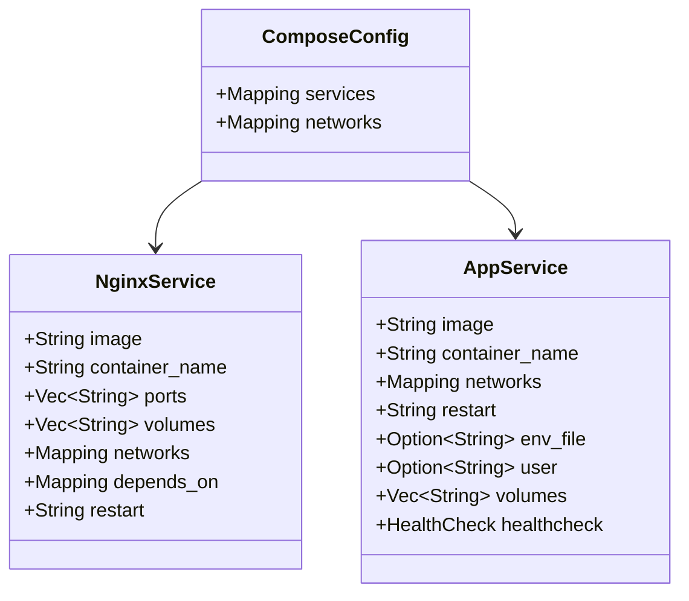

**图表来源**
- [src/compose.rs:11-424](file://src/compose.rs#L11-L424)

**章节来源**
- [src/discovery.rs:1-721](file://src/discovery.rs#L1-L721)
- [src/nginx.rs:1-800](file://src/nginx.rs#L1-L800)
- [src/compose.rs:1-800](file://src/compose.rs#L1-L800)

### 状态管理

状态管理模块跟踪微应用的构建状态：

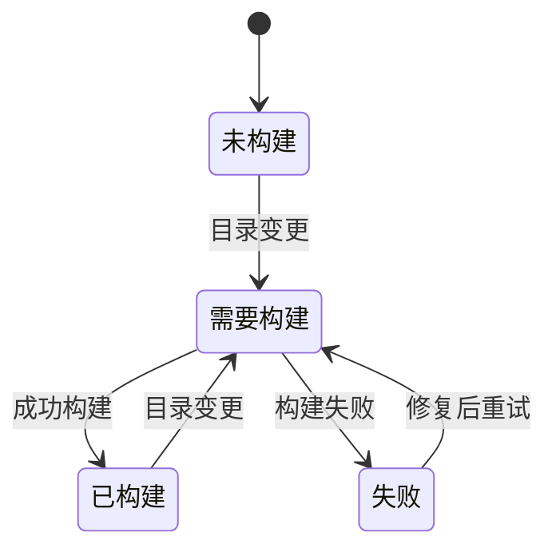

**图表来源**
- [src/state.rs:13-186](file://src/state.rs#L13-L186)

**章节来源**
- [src/state.rs:188-233](file://src/state.rs#L188-L233)

## 依赖关系分析

项目采用现代化的 Rust 生态系统依赖管理：

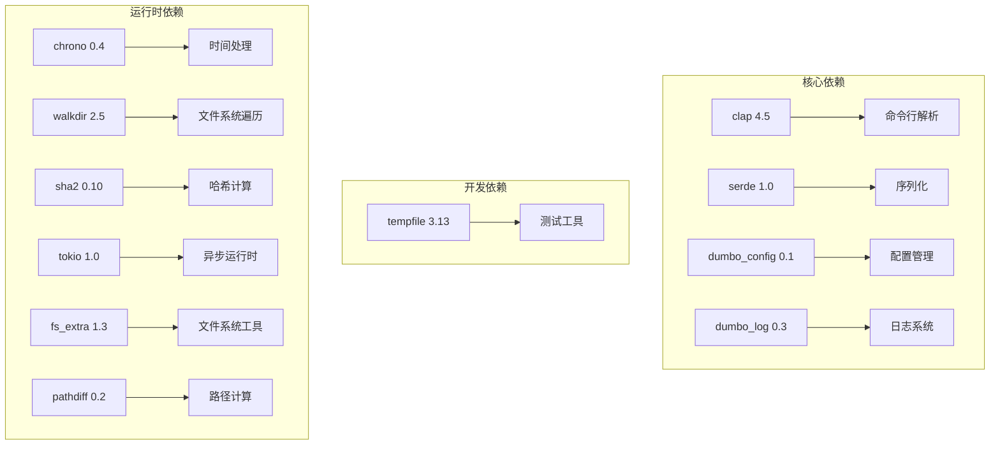

**图表来源**
- [Cargo.toml:13-52](file://Cargo.toml#L13-L52)

**章节来源**
- [Cargo.toml:1-55](file://Cargo.toml#L1-L55)

## 性能考虑

### 构建优化策略

1. **增量构建**: 通过目录哈希计算实现智能增量构建
2. **并行处理**: 使用 Tokio 异步运行时提高并发性能
3. **缓存机制**: 状态文件缓存构建结果，避免重复构建

### 网络优化

1. **动态DNS解析**: 使用 Docker 内置 DNS 解析器，支持服务发现
2. **连接复用**: 启用 keepalive 连接减少连接开销
3. **负载均衡**: Nginx 自动轮询多个后端实例

### 内存管理

1. **零拷贝操作**: 使用 PathBuf 和 Cow 类型减少内存分配
2. **流式处理**: 大文件处理采用流式读取避免内存溢出
3. **及时释放**: 模块化设计确保资源及时释放

## 故障排查指南

### 常见问题诊断

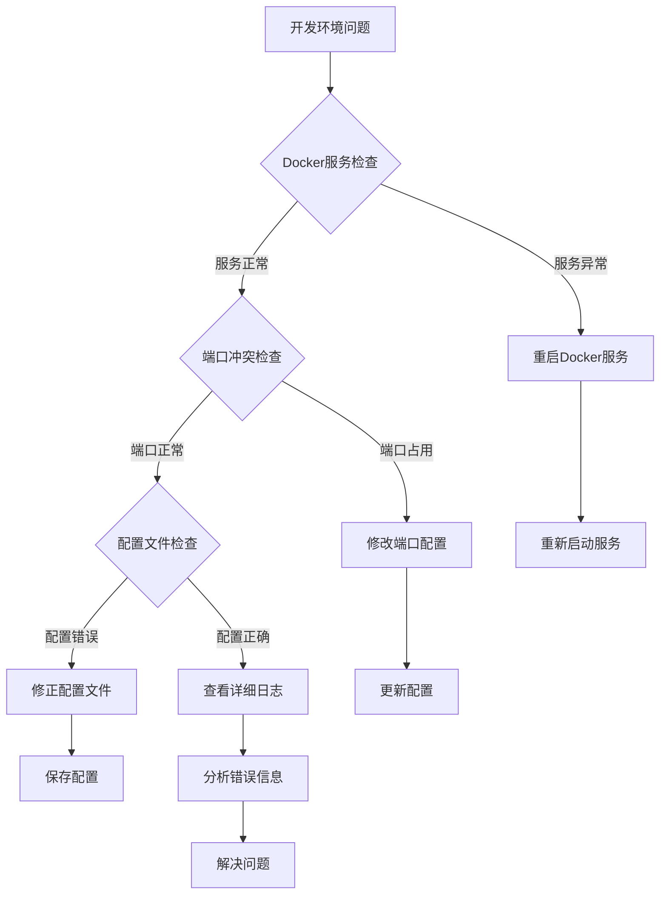

### 端口冲突处理

当遇到端口冲突时，可以通过以下步骤解决：

1. **检查端口占用**: 使用 `lsof` 命令检查端口占用情况
2. **修改配置**: 更新 `proxy-config.yml` 中的 `nginx_host_port` 配置
3. **重启服务**: 重新启动 micro_proxy 应用

### SSL证书问题

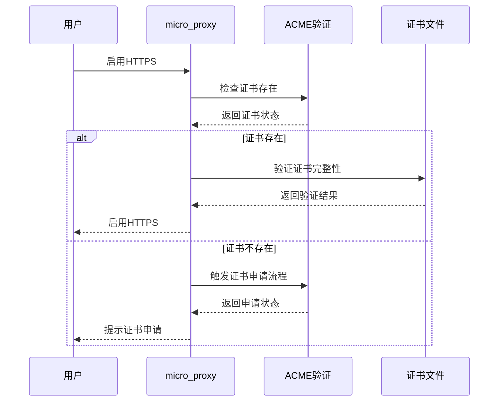

**图表来源**
- [src/nginx.rs:94-131](file://src/nginx.rs#L94-L131)

**章节来源**
- [README.md:328-420](file://README.md#L328-L420)
- [README.en.md:553-635](file://README.en.md#L553-L635)

## 结论

micro_proxy 提供了一个完整、高效的微应用本地开发环境解决方案。通过模块化的架构设计、智能化的配置管理和强大的 Docker 集成能力，开发者可以快速搭建稳定可靠的微服务开发环境。

主要优势包括：
- **自动化程度高**: 从应用发现到容器编排的全流程自动化
- **配置灵活**: 支持多种应用类型和复杂的网络拓扑
- **易于维护**: 清晰的模块划分和完善的错误处理机制
- **性能优异**: 增量构建、异步处理等优化措施

## 附录

### 开发环境安装步骤

1. **安装 Rust 工具链**
   ```bash
   curl --proto '=https' --tlsv1.2 -sSf https://sh.rustup.rs | sh
   ```

2. **克隆项目并安装**
   ```bash
   git clone https://github.com/cao5zy/proxy-config
   cd proxy-config
   cargo install --path .
   ```

3. **准备配置文件**
   ```bash
   cp proxy-config.yml.example proxy-config.yml
   cp micro-app.yml.example ./micro-apps/my-app/micro-app.yml
   ```

4. **启动开发环境**
   ```bash
   micro_proxy start
   ```

### 开发工具使用技巧

1. **详细日志模式**: 使用 `-v` 参数获取详细日志信息
2. **强制重建**: 使用 `--force-rebuild` 参数强制重新构建镜像
3. **网络诊断**: 使用 `network` 命令生成网络地址列表
4. **状态监控**: 使用 `status` 命令查看应用状态

### 安全配置建议

1. **最小权限原则**: 为容器设置必要的最小权限
2. **网络隔离**: 使用 Docker 网络隔离不同应用
3. **证书管理**: 使用 Let's Encrypt 自动化证书管理
4. **访问控制**: 配置适当的防火墙规则和访问控制列表