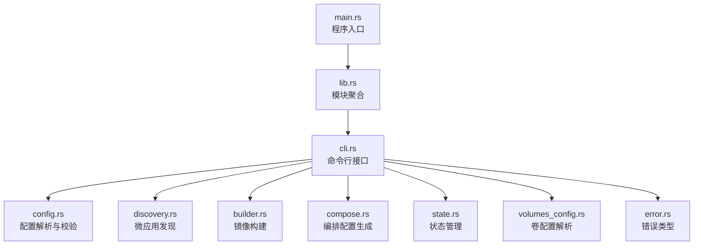
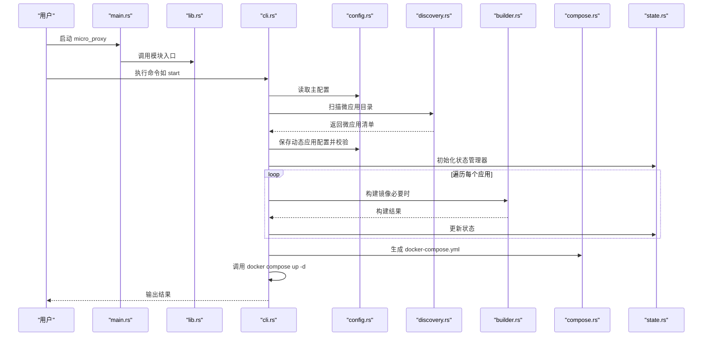
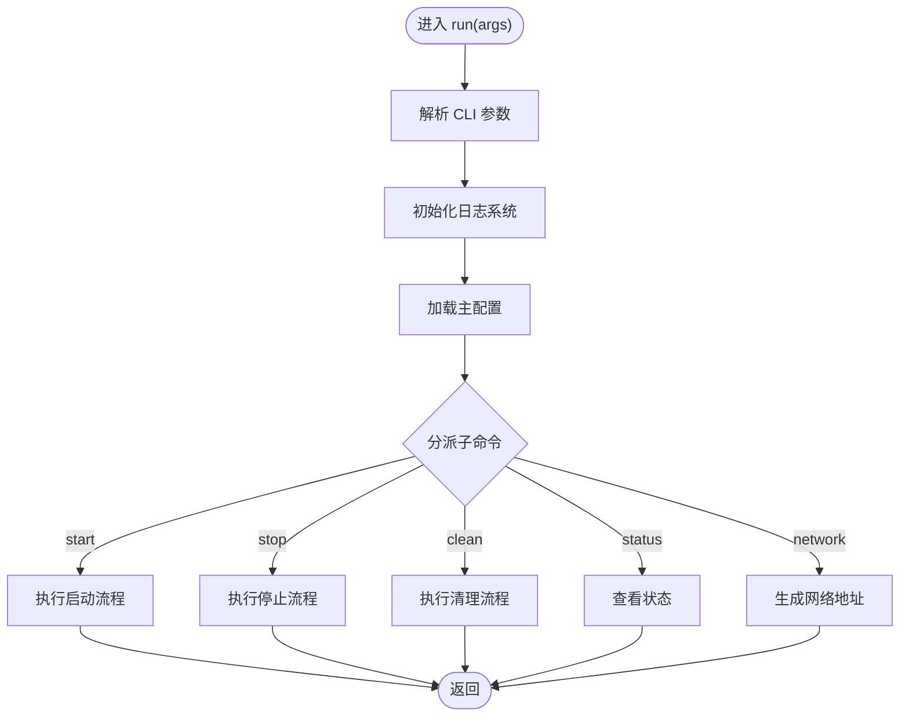
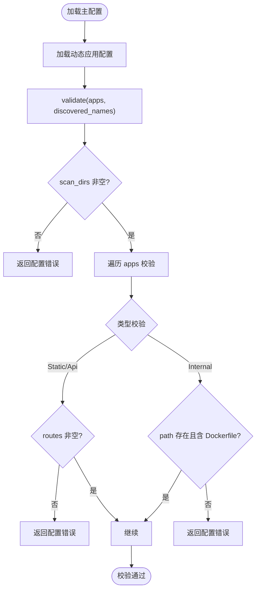
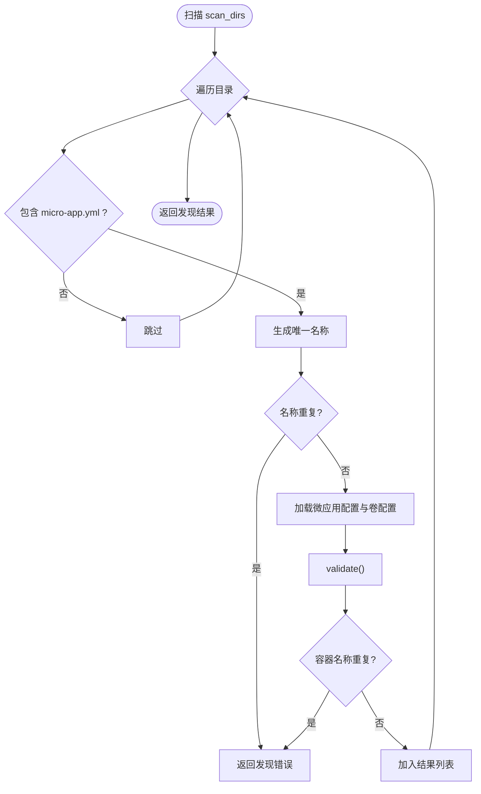
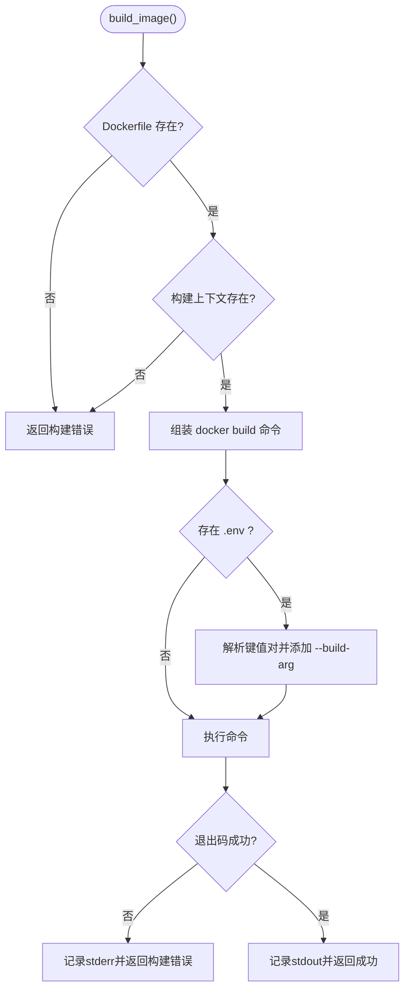
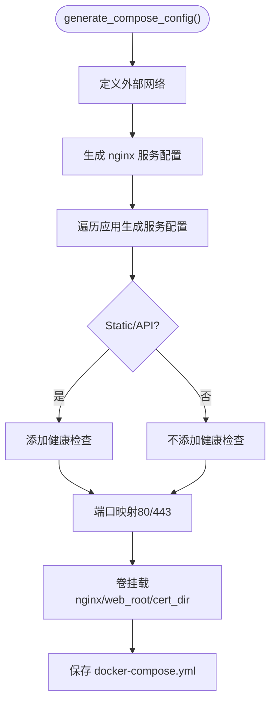
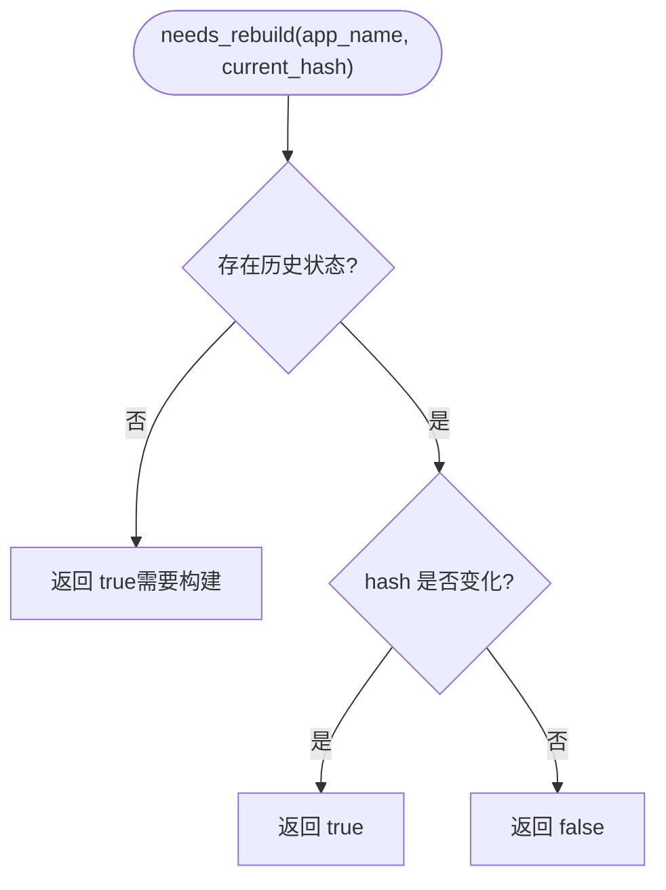
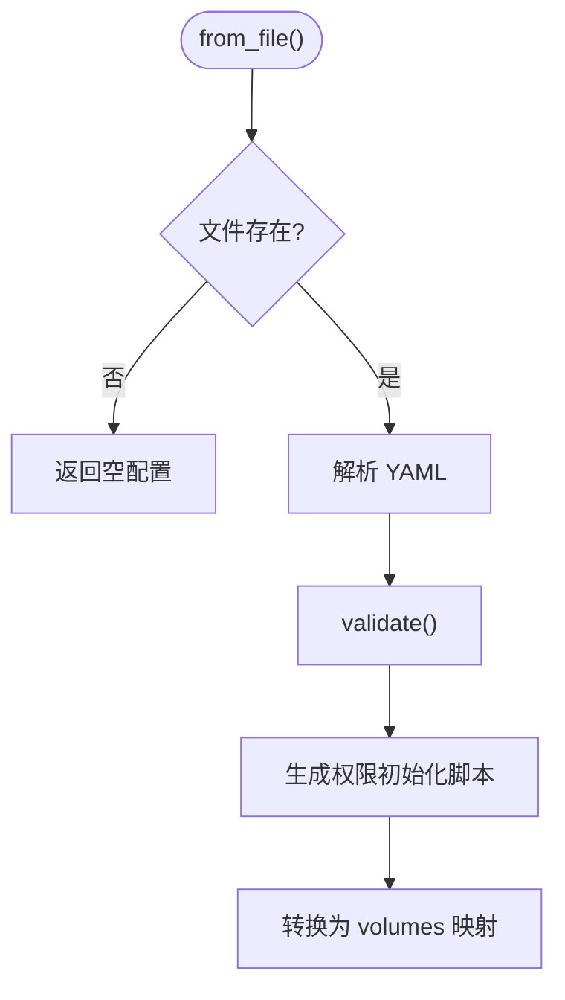
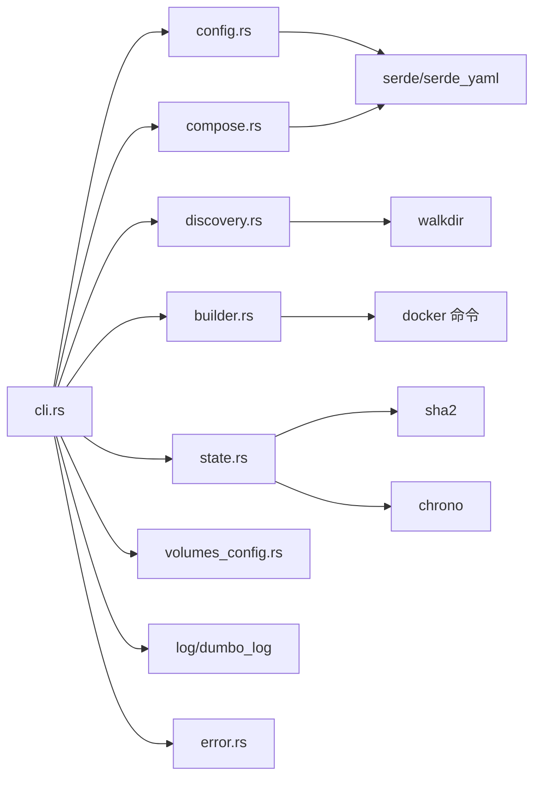

# 测试调试方法

<cite>
**本文档引用的文件**
- [README.md](file://README.md)
- [Cargo.toml](file://Cargo.toml)
- [src/main.rs](file://src/main.rs)
- [src/lib.rs](file://src/lib.rs)
- [src/cli.rs](file://src/cli.rs)
- [src/config.rs](file://src/config.rs)
- [src/discovery.rs](file://src/discovery.rs)
- [src/micro_app_config.rs](file://src/micro_app_config.rs)
- [src/volumes_config.rs](file://src/volumes_config.rs)
- [src/state.rs](file://src/state.rs)
- [src/builder.rs](file://src/builder.rs)
- [src/compose.rs](file://src/compose.rs)
- [src/error.rs](file://src/error.rs)
- [proxy-config.yml.example](file://proxy-config.yml.example)
</cite>

## 目录
1. [引言](#引言)
2. [项目结构](#项目结构)
3. [核心组件](#核心组件)
4. [架构总览](#架构总览)
5. [详细组件分析](#详细组件分析)
6. [依赖分析](#依赖分析)
7. [性能考虑](#性能考虑)
8. [故障排查指南](#故障排查指南)
9. [结论](#结论)
10. [附录](#附录)

## 引言
本指南面向微应用代理配置工具的使用者与维护者，围绕单元测试、集成测试、调试工具、日志系统、性能测试、问题诊断与自动化集成等方面，提供系统化的方法论与实操建议。项目采用 Rust 实现，围绕 Docker 镜像构建、容器编排与 Nginx 反向代理展开，具备完善的配置校验、状态管理与日志记录能力。

## 项目结构
项目采用模块化设计，核心模块职责清晰：
- CLI 层：解析命令行参数，调度业务流程
- 配置层：解析主配置与微应用配置，进行有效性校验
- 发现层：扫描微应用目录，生成微应用清单
- 构建层：调用 Docker 构建镜像，支持环境变量注入与缓存控制
- 编排层：生成 docker-compose 配置，管理网络与服务依赖
- 状态层：记录构建状态，用于增量构建判断
- 错误层：统一错误类型与错误传播

图表来源
- [src/main.rs:1-25](file://src/main.rs#L1-L25)
- [src/lib.rs:1-26](file://src/lib.rs#L1-L26)
- [src/cli.rs:1-669](file://src/cli.rs#L1-L669)
- [src/config.rs:1-842](file://src/config.rs#L1-L842)
- [src/discovery.rs:1-721](file://src/discovery.rs#L1-L721)
- [src/builder.rs:1-218](file://src/builder.rs#L1-L218)
- [src/compose.rs:1-905](file://src/compose.rs#L1-L905)
- [src/state.rs:1-311](file://src/state.rs#L1-L311)
- [src/volumes_config.rs:1-426](file://src/volumes_config.rs#L1-L426)
- [src/error.rs:1-50](file://src/error.rs#L1-L50)

章节来源
- [src/main.rs:1-25](file://src/main.rs#L1-L25)
- [src/lib.rs:1-26](file://src/lib.rs#L1-L26)
- [src/cli.rs:1-669](file://src/cli.rs#L1-L669)

## 核心组件
- 命令行接口：负责解析参数、初始化日志、加载配置、执行子命令（start/stop/clean/status/network）
- 配置管理：解析主配置与动态生成的应用配置，提供校验与查询
- 应用发现：扫描目录，发现包含 micro-app.yml 与 Dockerfile 的微应用，生成唯一名称并校验重复
- 镜像构建：封装 docker build，支持禁用缓存、注入构建参数与环境变量文件
- 编排生成：生成 docker-compose.yml，管理网络、端口映射、卷挂载、健康检查与依赖关系
- 状态管理：记录目录哈希、最后构建时间与镜像存在性，用于增量构建判断
- 卷配置：解析 micro-app.volumes.yml，支持权限初始化脚本生成与 Docker Compose 映射
- 错误体系：统一错误类型，便于测试断言与日志追踪

章节来源
- [src/cli.rs:1-669](file://src/cli.rs#L1-L669)
- [src/config.rs:1-842](file://src/config.rs#L1-L842)
- [src/discovery.rs:1-721](file://src/discovery.rs#L1-L721)
- [src/builder.rs:1-218](file://src/builder.rs#L1-L218)
- [src/compose.rs:1-905](file://src/compose.rs#L1-L905)
- [src/state.rs:1-311](file://src/state.rs#L1-L311)
- [src/volumes_config.rs:1-426](file://src/volumes_config.rs#L1-L426)
- [src/error.rs:1-50](file://src/error.rs#L1-L50)

## 架构总览
下图展示从命令行到容器编排的整体流程，以及关键模块间的依赖关系：

图表来源
- [src/main.rs:1-25](file://src/main.rs#L1-L25)
- [src/lib.rs:1-26](file://src/lib.rs#L1-L26)
- [src/cli.rs:296-463](file://src/cli.rs#L296-L463)
- [src/config.rs:76-123](file://src/config.rs#L76-L123)
- [src/discovery.rs:235-352](file://src/discovery.rs#L235-L352)
- [src/builder.rs:20-120](file://src/builder.rs#L20-L120)
- [src/compose.rs:31-119](file://src/compose.rs#L31-L119)
- [src/state.rs:40-186](file://src/state.rs#L40-L186)

## 详细组件分析

### 命令行接口与日志初始化
- 日志初始化：使用 dumbo_log 初始化日志文件与控制台输出，日志文件名与包名一致
- 子命令分发：start/stop/clean/status/network 分别对应不同的业务流程
- Docker Compose 兼容：优先使用 docker compose，回退到 docker-compose

图表来源
- [src/cli.rs:78-116](file://src/cli.rs#L78-L116)
- [src/cli.rs:127-170](file://src/cli.rs#L127-L170)

章节来源
- [src/cli.rs:78-116](file://src/cli.rs#L78-L116)
- [src/cli.rs:127-170](file://src/cli.rs#L127-L170)

### 配置管理与校验
- 主配置：scan_dirs、apps_config_path、nginx_config_path、compose_config_path、state_file_path、network_list_path、network_name、nginx_host_port、web_root、cert_dir、domain
- 应用配置：name、routes、container_name、container_port、app_type、description、nginx_extra_config、path、docker_volumes、run_as_user
- 校验逻辑：扫描目录非空、应用名称唯一、Static/Api 路由非空、Internal 路径存在且包含 Dockerfile、routes/extra_config 在 Internal 类型下的忽略行为等

图表来源
- [src/config.rs:221-347](file://src/config.rs#L221-L347)

章节来源
- [src/config.rs:125-367](file://src/config.rs#L125-L367)

### 微应用发现与去重
- 唯一名称生成：基于 scan_dir 相对路径与应用目录名组合，避免同名冲突
- 重复校验：应用名称与容器名称均需唯一
- Dockerfile 与 .env 校验：缺失时记录警告

图表来源
- [src/discovery.rs:235-352](file://src/discovery.rs#L235-L352)
- [src/discovery.rs:147-222](file://src/discovery.rs#L147-L222)

章节来源
- [src/discovery.rs:1-721](file://src/discovery.rs#L1-L721)

### 镜像构建与缓存控制
- 构建参数：镜像名、Dockerfile 路径、构建上下文、可选环境变量文件、禁用缓存标志
- 环境变量注入：解析 .env 文件，逐行提取键值对作为 --build-arg 传入
- 错误处理：捕获 docker build 失败，输出标准错误并返回统一错误类型

图表来源
- [src/builder.rs:20-120](file://src/builder.rs#L20-L120)

章节来源
- [src/builder.rs:1-218](file://src/builder.rs#L1-L218)

### 编排配置生成与健康检查
- 网络：外部网络复用，避免项目前缀
- 服务：nginx 仅依赖非 Internal 应用；静态与 API 应用添加健康检查；Internal 应用不加健康检查
- 端口：HTTP 80 映射；若检测到证书则映射 443
- 卷：nginx 挂载 nginx.conf、web_root、cert_dir；应用挂载 volumes 映射与 env_file

图表来源
- [src/compose.rs:31-119](file://src/compose.rs#L31-L119)
- [src/compose.rs:172-266](file://src/compose.rs#L172-L266)
- [src/compose.rs:277-424](file://src/compose.rs#L277-L424)

章节来源
- [src/compose.rs:1-905](file://src/compose.rs#L1-L905)

### 状态管理与增量构建
- 目录哈希：遍历文件系统，跳过 .git，对文件内容参与哈希
- 状态记录：app_name、hash、last_built、image_exists
- 判断逻辑：无历史状态或 hash 变化则需要重建

图表来源
- [src/state.rs:162-177](file://src/state.rs#L162-L177)
- [src/state.rs:195-233](file://src/state.rs#L195-L233)

章节来源
- [src/state.rs:1-311](file://src/state.rs#L1-L311)

### 卷配置与权限初始化
- 解析 micro-app.volumes.yml，支持多卷与权限配置
- 生成权限初始化脚本：chown 命令，支持递归
- 转换为 Docker Compose volumes 映射

图表来源
- [src/volumes_config.rs:55-205](file://src/volumes_config.rs#L55-L205)

章节来源
- [src/volumes_config.rs:1-426](file://src/volumes_config.rs#L1-L426)

## 依赖分析
- 外部依赖：serde、serde_yaml、clap、anyhow、thiserror、log、dumbo_log、chrono、walkdir、sha2、regex、tokio、fs_extra、pathdiff、dumbo_config
- 模块耦合：CLI 依赖配置、发现、构建、编排、状态、卷配置；配置依赖 YAML 解析；构建依赖 Docker 命令；编排依赖配置与卷配置；状态依赖哈希与时间；错误统一由 error 模块承载

图表来源
- [Cargo.toml:13-52](file://Cargo.toml#L13-L52)
- [src/cli.rs:6-18](file://src/cli.rs#L6-L18)
- [src/config.rs:7](file://src/config.rs#L7)
- [src/discovery.rs:8](file://src/discovery.rs#L8)
- [src/state.rs:6-8](file://src/state.rs#L6-L8)
- [src/builder.rs:5](file://src/builder.rs#L5)
- [src/compose.rs:6](file://src/compose.rs#L6)
- [src/volumes_config.rs:7](file://src/volumes_config.rs#L7)
- [src/error.rs:3](file://src/error.rs#L3)

章节来源
- [Cargo.toml:1-55](file://Cargo.toml#L1-L55)

## 性能考虑
- 增量构建：通过目录哈希与状态文件减少不必要的镜像构建
- 禁用缓存：start 命令支持强制重建，通过 --no-cache 参数绕过缓存
- 健康检查：静态与 API 应用添加健康检查，降低无效流量与资源浪费
- 端口映射：按需映射 443，避免多余监听端口带来的开销

章节来源
- [src/state.rs:162-177](file://src/state.rs#L162-L177)
- [src/builder.rs:62-65](file://src/builder.rs#L62-L65)
- [src/compose.rs:358-421](file://src/compose.rs#L358-L421)

## 故障排查指南
- 日志查看
  - 控制台与文件双通道输出，日志文件名与包名一致
  - 常用命令：查看容器日志、查看 Nginx 日志、生成网络地址列表
- 端口冲突
  - 检查宿主机端口占用，调整 nginx_host_port
- 网络问题
  - 生成网络地址列表，核对容器间连通性
- 证书问题
  - 检查证书与密钥文件存在性，验证 Nginx 配置语法
- 配置问题
  - 校验 micro-app.yml 与 Dockerfile 存在性，检查重复名称与容器名

章节来源
- [README.md:330-420](file://README.md#L330-L420)
- [src/cli.rs:81-88](file://src/cli.rs#L81-L88)

## 结论
本项目提供了从配置解析、应用发现、镜像构建、编排生成到状态管理的完整链路，配合统一的日志与错误体系，能够支撑微应用的高效管理与运维。通过增量构建与健康检查等机制，兼顾性能与稳定性。建议在持续集成中引入单元测试与集成测试，结合日志与监控，形成闭环的质量保障。

## 附录

### 单元测试与集成测试指南
- 测试框架选择
  - Rust 标准测试框架（#[test]）与临时目录（tempfile）用于隔离测试环境
- 推荐测试范围
  - 配置解析与校验：主配置、应用配置、卷配置
  - 应用发现：唯一名称生成、重复校验、Dockerfile 与 .env 校验
  - 构建流程：Dockerfile 不存在、构建上下文不存在、禁用缓存、环境变量注入
  - 编排生成：网络外部化、端口映射、健康检查、卷挂载
  - 状态管理：哈希一致性、增量判断
- 测试执行
  - 使用 cargo test 运行全部测试
  - 使用 cargo test -- --nocapture 查看日志输出

章节来源
- [src/config.rs:369-800](file://src/config.rs#L369-L800)
- [src/discovery.rs:376-721](file://src/discovery.rs#L376-L721)
- [src/builder.rs:182-218](file://src/builder.rs#L182-L218)
- [src/compose.rs:450-728](file://src/compose.rs#L450-L728)
- [src/state.rs:235-311](file://src/state.rs#L235-L311)

### 调试工具与配置
- 浏览器开发者工具
  - 检查网络请求、响应头、跨域与缓存策略
- Postman
  - 构造请求验证 Nginx 反代与路由规则
- Docker 日志
  - docker logs <容器名> 查看应用与 Nginx 日志
- 本地部署脚本
  - deploy_to_local.sh 用于一键部署与验证

章节来源
- [README.md:330-420](file://README.md#L330-L420)

### 日志系统配置与分析
- 初始化：dumbo_log 初始化日志文件与控制台输出
- 日志级别：INFO/DEBUG/WARN/ERROR，结合业务关键节点输出
- 分析方法：按模块划分日志，结合错误类型定位问题

章节来源
- [src/cli.rs:81-88](file://src/cli.rs#L81-L88)
- [src/error.rs:6-46](file://src/error.rs#L6-L46)

### 性能测试与压力测试
- 负载测试
  - 使用压测工具对 Nginx 入口与后端 API 进行并发请求
- 性能瓶颈分析
  - 关注镜像构建耗时、容器启动时间、健康检查间隔与 Nginx 连接数
- 增量构建验证
  - 修改少量文件后验证是否触发重建

章节来源
- [src/builder.rs:62-65](file://src/builder.rs#L62-L65)
- [src/compose.rs:360-421](file://src/compose.rs#L360-L421)

### 常见问题诊断与修复
- 重复名称/容器名：调整微应用目录或配置，确保全局唯一
- 缺失 Dockerfile/.env：补齐文件或修正路径
- 端口占用：修改 nginx_host_port 或释放端口
- 证书缺失：准备证书与密钥文件，或关闭 HTTPS

章节来源
- [src/discovery.rs:300-341](file://src/discovery.rs#L300-L341)
- [src/discovery.rs:97-118](file://src/discovery.rs#L97-L118)
- [README.md:363-372](file://README.md#L363-L372)

### 测试自动化与 CI/CD 集成
- 测试任务
  - cargo test（可选：-- --nocapture）
- 集成步骤建议
  - 安装 Docker 与 docker-compose
  - 运行测试，生成日志与报告
  - 将日志上传至制品库，便于问题追溯
- 配置参考
  - proxy-config.yml.example 提供主配置模板

章节来源
- [proxy-config.yml.example:1-53](file://proxy-config.yml.example#L1-L53)