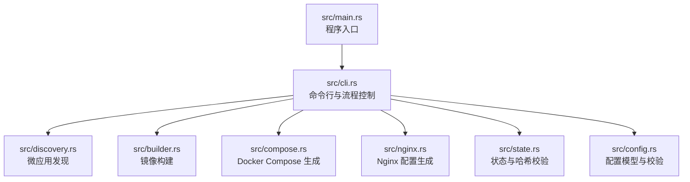
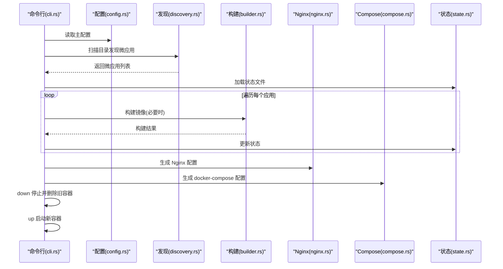
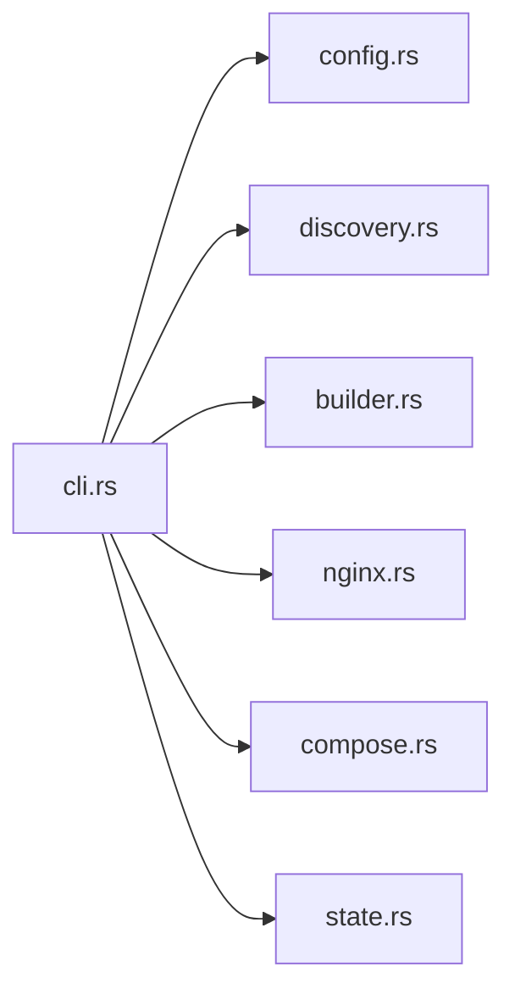

# 部署流程

<cite>
**本文引用的文件**
- [README.md](file://README.md)
- [deploy_to_local.sh](file://deploy_to_local.sh)
- [upload.sh](file://upload.sh)
- [proxy-config.yml.example](file://proxy-config.yml.example)
- [src/main.rs](file://src/main.rs)
- [src/cli.rs](file://src/cli.rs)
- [src/config.rs](file://src/config.rs)
- [src/discovery.rs](file://src/discovery.rs)
- [src/builder.rs](file://src/builder.rs)
- [src/compose.rs](file://src/compose.rs)
- [src/nginx.rs](file://src/nginx.rs)
- [src/state.rs](file://src/state.rs)
- [Cargo.toml](file://Cargo.toml)
</cite>

## 目录
1. [引言](#引言)
2. [项目结构](#项目结构)
3. [核心组件](#核心组件)
4. [架构总览](#架构总览)
5. [详细组件分析](#详细组件分析)
6. [依赖分析](#依赖分析)
7. [性能考虑](#性能考虑)
8. [故障排查指南](#故障排查指南)
9. [结论](#结论)
10. [附录](#附录)

## 引言
本指南面向微应用从开发到生产的完整部署流程，结合仓库中的工具能力，给出可落地的部署步骤、CI/CD 集成建议、部署前检查清单、回滚与应急策略、部署后监控与优化建议，以及多环境配置管理方法。工具通过命令行驱动，自动发现微应用、生成 Nginx 与 Docker Compose 配置、构建镜像并编排容器，支持静态站点、API 服务与内部服务的统一入口与网络隔离。

## 项目结构
仓库采用 Rust 项目结构，核心入口位于 src/main.rs，命令行解析与执行逻辑集中在 src/cli.rs，配置、发现、构建、编排、Nginx 生成、状态管理等模块分别位于独立文件中；同时提供本地部署与远程同步脚本。

图表来源
- [src/main.rs:1-25](file://src/main.rs#L1-L25)
- [src/cli.rs:1-669](file://src/cli.rs#L1-L669)
- [src/discovery.rs:1-721](file://src/discovery.rs#L1-L721)
- [src/builder.rs:1-218](file://src/builder.rs#L1-L218)
- [src/compose.rs:1-905](file://src/compose.rs#L1-L905)
- [src/nginx.rs:1-1101](file://src/nginx.rs#L1-L1101)
- [src/state.rs:1-311](file://src/state.rs#L1-L311)
- [src/config.rs:1-842](file://src/config.rs#L1-L842)

章节来源
- [README.md:421-441](file://README.md#L421-L441)
- [Cargo.toml:1-55](file://Cargo.toml#L1-L55)

## 核心组件
- 命令行与流程控制：解析参数、选择子命令、调用各模块执行启动/停止/清理/状态/网络等操作。
- 配置管理：主配置与动态应用配置，含校验逻辑与默认值。
- 微应用发现：扫描目录、校验微应用元信息、生成唯一名称与容器名。
- 镜像构建：基于 Dockerfile 构建镜像，支持禁用缓存与传入 .env 为构建参数。
- Nginx 配置生成：按应用类型与路由生成反向代理规则，支持 HTTP/HTTPS 与 ACME 验证。
- Docker Compose 生成：生成服务、网络、卷挂载、依赖关系与健康检查。
- 状态管理：计算目录哈希、记录构建状态，避免不必要的重复构建。
- 本地部署与远程同步：提供一键编译并部署到本地 bin，以及 rsync 同步到远端的脚本。

章节来源
- [src/cli.rs:71-116](file://src/cli.rs#L71-L116)
- [src/config.rs:125-367](file://src/config.rs#L125-L367)
- [src/discovery.rs:224-352](file://src/discovery.rs#L224-L352)
- [src/builder.rs:9-120](file://src/builder.rs#L9-L120)
- [src/nginx.rs:10-92](file://src/nginx.rs#L10-L92)
- [src/compose.rs:18-119](file://src/compose.rs#L18-L119)
- [src/state.rs:40-186](file://src/state.rs#L40-L186)

## 架构总览
下图展示一次“启动”命令的端到端流程：从解析配置、发现微应用、生成配置到编排与启动容器。

图表来源
- [src/cli.rs:296-463](file://src/cli.rs#L296-L463)
- [src/discovery.rs:224-352](file://src/discovery.rs#L224-L352)
- [src/builder.rs:20-120](file://src/builder.rs#L20-L120)
- [src/nginx.rs:26-92](file://src/nginx.rs#L26-L92)
- [src/compose.rs:31-119](file://src/compose.rs#L31-L119)
- [src/state.rs:62-143](file://src/state.rs#L62-L143)

## 详细组件分析

### 命令行与流程控制（cli.rs）
- 子命令：start、stop、clean、status、network。
- 启动流程关键步骤：发现微应用、保存动态配置、校验、创建网络、状态管理、逐应用构建/更新、生成 Nginx 与 Compose、down 再 up。
- 健壮性：兼容 docker compose 与 docker-compose 两种命令形态；日志系统初始化；错误分类与返回。

章节来源
- [src/cli.rs:41-69](file://src/cli.rs#L41-L69)
- [src/cli.rs:296-463](file://src/cli.rs#L296-L463)
- [src/cli.rs:118-170](file://src/cli.rs#L118-L170)

### 配置管理（config.rs）
- 主配置 ProxyConfig：扫描目录、输出路径、网络名、端口、Web 根目录、证书目录、域名等。
- 应用配置 AppConfig：名称、路由、容器名、端口、类型、描述、Nginx 额外配置、卷映射、运行用户等。
- 校验逻辑：扫描目录非空、应用名唯一、Static/API 路由非空、Internal 路径存在且含 Dockerfile、过滤 Internal 的 Nginx 依赖等。

章节来源
- [src/config.rs:125-367](file://src/config.rs#L125-L367)

### 微应用发现（discovery.rs）
- 扫描 scan_dirs，仅包含 micro-app.yml 与 Dockerfile 的目录视为微应用。
- 生成唯一应用名（基于相对路径）、校验容器名唯一、加载 micro-app.yml 与可选 micro-app.volumes.yml。
- 转换为 AppConfig，支持 Static、API、Internal 三类应用。

章节来源
- [src/discovery.rs:224-352](file://src/discovery.rs#L224-L352)
- [src/discovery.rs:40-145](file://src/discovery.rs#L40-L145)

### 镜像构建（builder.rs）
- 基于 Dockerfile 构建镜像，支持 --no-cache、从 .env 注入构建参数。
- 提供删除镜像与查询镜像存在性的辅助函数。

章节来源
- [src/builder.rs:9-120](file://src/builder.rs#L9-L120)

### Nginx 配置生成（nginx.rs）
- 依据应用类型与路由生成 location 规则；支持 HTTP/HTTPS；自动注入 ACME 验证；使用 Docker 内部 DNS 变量实现动态上游解析。
- HTTPS 时在 HTTP server 块中重定向至 HTTPS，并在 HTTPS server 块中加载证书。

章节来源
- [src/nginx.rs:10-92](file://src/nginx.rs#L10-L92)
- [src/nginx.rs:272-536](file://src/nginx.rs#L272-L536)

### Docker Compose 生成（compose.rs）
- 生成 services、networks（外部网络）；nginx 仅依赖非 Internal 应用；为 Static/API 应用添加健康检查；支持 volumes 与 run_as_user；根据证书存在与否决定端口映射。

章节来源
- [src/compose.rs:18-119](file://src/compose.rs#L18-L119)
- [src/compose.rs:268-424](file://src/compose.rs#L268-L424)

### 状态管理（state.rs）
- 计算目录 SHA256 哈希，记录构建时间与镜像存在性；比较哈希决定是否需要重新构建，避免重复构建。

章节来源
- [src/state.rs:188-233](file://src/state.rs#L188-L233)
- [src/state.rs:154-177](file://src/state.rs#L154-L177)

### 本地部署与远程同步（deploy_to_local.sh、upload.sh）
- deploy_to_local.sh：编译 release、复制到用户 bin 目录、设置执行权限、检查 PATH、验证版本。
- upload.sh：使用 rsync 同步项目文件到远端，排除 .git、target、日志、node_modules、Cargo.lock、特定配置文件等。

章节来源
- [deploy_to_local.sh:1-119](file://deploy_to_local.sh#L1-L119)
- [upload.sh:1-51](file://upload.sh#L1-L51)

## 依赖分析
- 外部依赖：Docker、docker compose/docker-compose、Nginx 容器（用于反向代理）。
- 内部模块耦合：cli.rs 作为编排者，依赖 discovery、builder、compose、nginx、state、config 等模块；各模块职责清晰，低耦合高内聚。
- 关键依赖链：配置 → 发现 → 构建 → 生成 Nginx/Compose → down → up。

图表来源
- [src/cli.rs:78-116](file://src/cli.rs#L78-L116)
- [src/config.rs:125-367](file://src/config.rs#L125-L367)
- [src/discovery.rs:224-352](file://src/discovery.rs#L224-L352)
- [src/builder.rs:9-120](file://src/builder.rs#L9-L120)
- [src/nginx.rs:10-92](file://src/nginx.rs#L10-L92)
- [src/compose.rs:18-119](file://src/compose.rs#L18-L119)
- [src/state.rs:40-186](file://src/state.rs#L40-L186)

章节来源
- [Cargo.toml:13-51](file://Cargo.toml#L13-L51)

## 性能考虑
- 构建缓存：默认使用 Docker 构建缓存；可通过 --force-rebuild 强制禁用缓存，适用于变更较大或依赖缓存失效的场景。
- 状态去重：通过目录哈希判断是否需要重新构建，减少重复构建时间。
- 依赖最小化：nginx 仅依赖非 Internal 应用，缩短启动等待时间。
- 健康检查：Static/API 应用添加健康检查，提升容器可用性与编排稳定性。
- 端口映射：宿主机端口由 docker-compose 控制，容器内部固定为 80/443，便于统一管理。

章节来源
- [src/cli.rs:296-463](file://src/cli.rs#L296-L463)
- [src/compose.rs:358-421](file://src/compose.rs#L358-L421)
- [src/state.rs:154-177](file://src/state.rs#L154-L177)

## 故障排查指南
- 日志与诊断
  - 启动时显示详细日志，便于定位问题。
  - 查看容器日志与 Nginx 错误日志，检查端口占用与证书配置。
- 常见问题
  - 端口冲突：修改主配置中的 nginx_host_port。
  - 端口映射：确认宿主机端口与容器内部端口映射关系。
  - 证书问题：检查 web_root、cert_dir、domain 配置与证书文件存在性。
  - 微应用配置：确认 micro-app.yml 与 Dockerfile 存在，应用名与容器名唯一。
  - Volumes 挂载：检查宿主机路径与容器挂载点。
- 命令辅助
  - status：查看容器状态与镜像存在性。
  - network：生成网络地址列表，辅助连通性排查。

章节来源
- [README.md:328-420](file://README.md#L328-L420)
- [src/cli.rs:550-584](file://src/cli.rs#L550-L584)
- [src/cli.rs:586-636](file://src/cli.rs#L586-L636)

## 结论
本工具提供了从发现微应用、生成配置、构建镜像到编排容器的一体化能力，配合本地部署与远程同步脚本，可支撑从开发到生产的稳定交付。通过合理的配置校验、状态管理与健康检查，能够显著提升部署效率与运行可靠性。建议在生产环境中结合 CI/CD 平台实现自动化流水线，并配套监控与回滚策略。

## 附录

### 从开发到生产的部署流程（建议）
- 开发阶段
  - 在本地运行 micro_proxy start，验证微应用与 Nginx 代理。
  - 使用 .env 注入构建参数，确保构建一致性。
- 构建与测试
  - 在 CI 环境中执行构建与单元测试（如适用）。
  - 使用 --force-rebuild 进行强构建，确保产物可复现。
- 部署
  - 生成 Nginx 与 Compose 配置，down 再 up，确保新配置生效。
  - 若启用 HTTPS，提前准备证书并放置在 cert_dir。
- 验证
  - 使用 status 与 network 检查容器与网络。
  - 通过 curl 或浏览器访问验证路由与证书。

章节来源
- [src/cli.rs:296-463](file://src/cli.rs#L296-L463)
- [src/nginx.rs:10-92](file://src/nginx.rs#L10-L92)
- [src/compose.rs:18-119](file://src/compose.rs#L18-L119)

### CI/CD 集成建议
- GitHub Actions/GitLab CI
  - 触发条件：push 到分支或打标签。
  - 步骤建议：安装 Rust、拉取依赖、构建、生成配置、构建镜像、推送镜像、编排部署、健康检查。
  - 安全：使用受保护变量管理镜像仓库凭据与证书文件。
  - 并行：对多微应用构建与测试进行并行化，缩短流水线时长。
- 回滚策略
  - 保留最近 N 个镜像版本，down 旧容器后 up 新容器，实现快速回滚。
  - 蓝绿/金丝雀：通过 Compose 文件切换服务名或权重（需额外编排策略）。

[本节为概念性指导，不直接分析具体文件]

### 部署前检查清单
- 配置验证
  - 主配置：scan_dirs、network_name、nginx_host_port、web_root、cert_dir、domain。
  - 应用配置：应用名唯一、容器名唯一、Static/API 路由非空、Internal 路径存在且含 Dockerfile。
- 依赖检查
  - Docker 与 docker compose 可用；端口未被占用。
  - 证书文件存在（HTTPS）。
- 安全扫描
  - 镜像漏洞扫描（建议在 CI 中集成）。
  - 证书与密钥权限检查。

章节来源
- [src/config.rs:220-347](file://src/config.rs#L220-L347)
- [src/discovery.rs:224-352](file://src/discovery.rs#L224-L352)
- [src/nginx.rs:94-131](file://src/nginx.rs#L94-L131)

### 部署后监控与健康检查
- 应用监控：利用 Compose 为 Static/API 应用添加健康检查，结合容器编排自动重启。
- 日志监控：Nginx 访问与错误日志输出到 /var/log/nginx，建议集中收集。
- 性能监控：关注容器 CPU/内存与 Nginx 响应时间，结合业务指标优化。

章节来源
- [src/compose.rs:358-421](file://src/compose.rs#L358-L421)
- [src/nginx.rs:146-195](file://src/nginx.rs#L146-L195)

### 多环境部署与配置管理
- 环境差异
  - 开发：本地端口映射、禁用 HTTPS、开启调试日志。
  - 测试/预发布：独立网络、独立域名与证书、限流与可观测性增强。
  - 生产：严格的证书与权限控制、只读卷、健康检查与自动重启。
- 配置分离
  - 主配置按环境拆分（如 proxy-config.dev.yml、proxy-config.prod.yml），通过 --config 指定。
  - 应用配置按微应用维护，确保 routes、容器名、端口与 volumes 的差异化。

章节来源
- [proxy-config.yml.example:5-53](file://proxy-config.yml.example#L5-L53)
- [src/config.rs:125-164](file://src/config.rs#L125-L164)