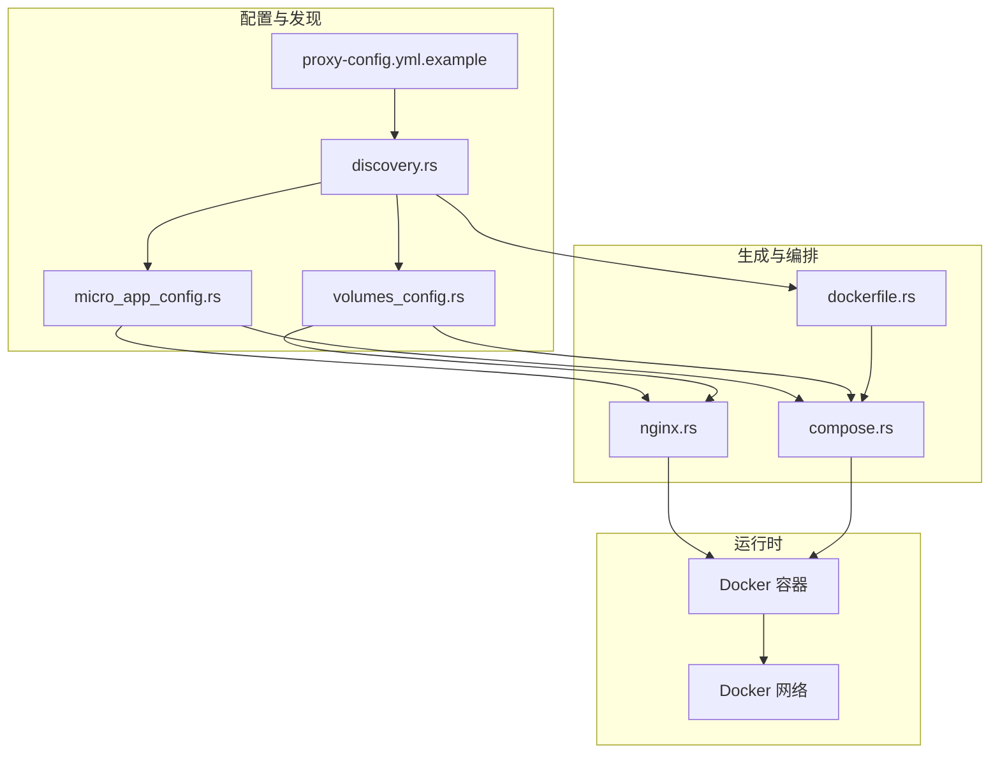
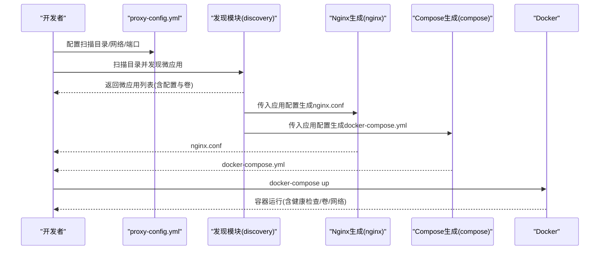
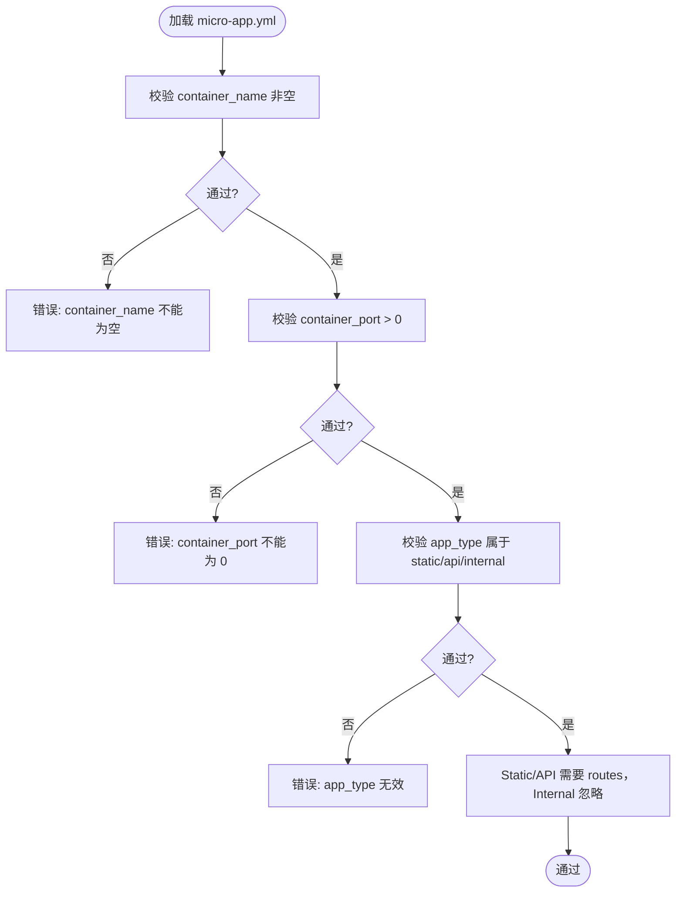
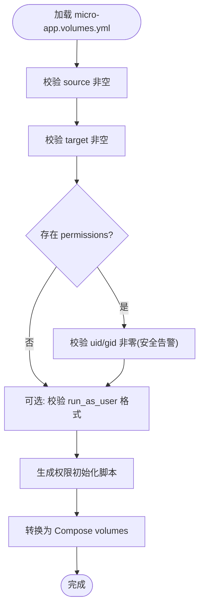
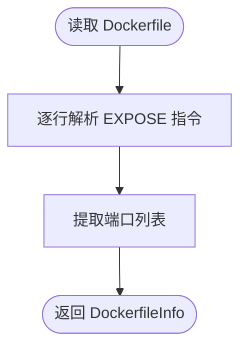
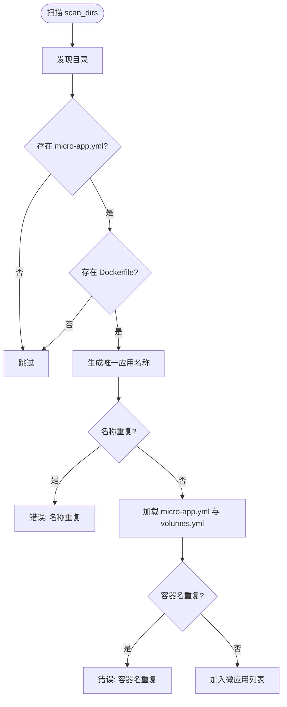
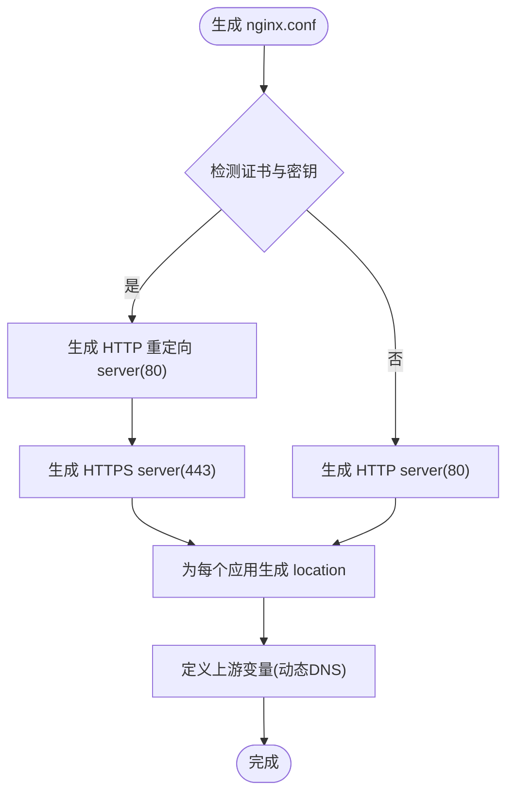
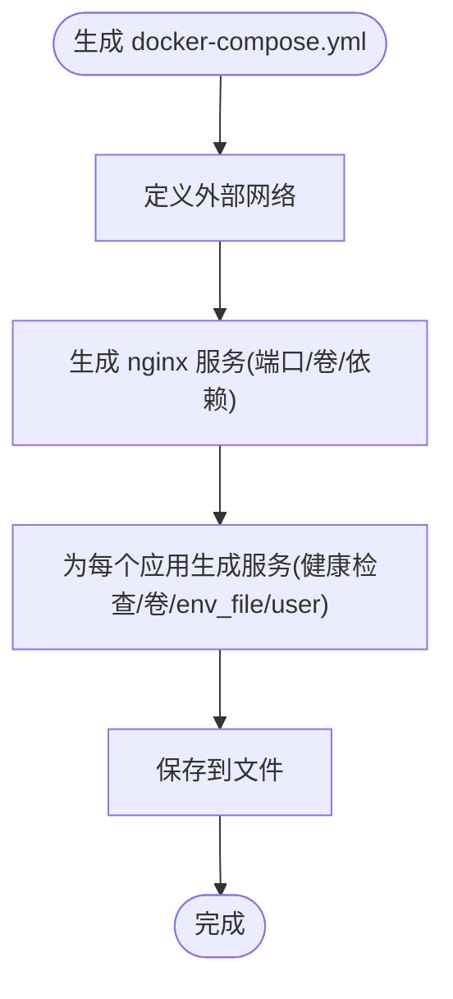
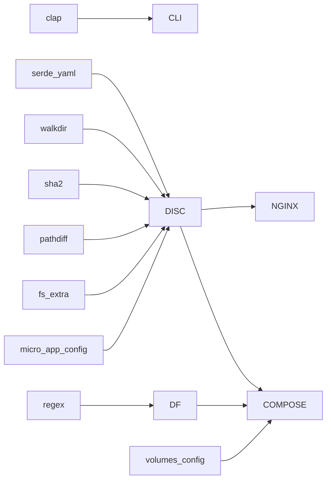

# 微应用开发

<cite>
**本文引用的文件**
- [README.md](file://README.md)
- [docs/micro-app-development.md](file://docs/micro-app-development.md)
- [src/micro_app_config.rs](file://src/micro_app_config.rs)
- [src/volumes_config.rs](file://src/volumes_config.rs)
- [src/dockerfile.rs](file://src/dockerfile.rs)
- [src/discovery.rs](file://src/discovery.rs)
- [src/compose.rs](file://src/compose.rs)
- [src/nginx.rs](file://src/nginx.rs)
- [proxy-config.yml.example](file://proxy-config.yml.example)
- [src/lib.rs](file://src/lib.rs)
- [Cargo.toml](file://Cargo.toml)
</cite>

## 目录
1. [引言](#引言)
2. [项目结构](#项目结构)
3. [核心组件](#核心组件)
4. [架构总览](#架构总览)
5. [详细组件分析](#详细组件分析)
6. [依赖分析](#依赖分析)
7. [性能考虑](#性能考虑)
8. [故障排查指南](#故障排查指南)
9. [结论](#结论)
10. [附录](#附录)

## 引言
本指南面向在 micro_proxy 环境中开发微应用的工程师，系统讲解标准目录结构、必需与可选文件、三类应用（Static、API、Internal）的开发规范、微应用配置文件编写、Dockerfile 最佳实践、卷与数据持久化策略、微应用间通信与网络配置、开发调试流程以及常见问题与解决方案。文档内容均来自仓库现有实现与文档，确保可操作与可落地。

## 项目结构
仓库采用 Rust 语言实现，核心模块围绕“发现微应用 → 生成 Nginx 配置 → 生成 Docker Compose 配置 → 启动容器”的流水线展开。主要模块职责如下：
- discovery：扫描目录，发现微应用，校验配置与容器名称唯一性
- micro_app_config：解析 micro-app.yml，校验字段合法性
- volumes_config：解析 micro-app.volumes.yml，生成权限初始化脚本与 Compose volumes
- dockerfile：解析 Dockerfile，提取 EXPOSE 端口
- nginx：生成 nginx.conf，支持 HTTP/HTTPS、ACME 验证、动态 DNS 解析
- compose：生成 docker-compose.yml，管理网络、端口映射、卷挂载、健康检查
- CLI/配置：命令行入口与主配置 proxy-config.yml

图表来源
- [src/discovery.rs:235-352](file://src/discovery.rs#L235-L352)
- [src/micro_app_config.rs:10-107](file://src/micro_app_config.rs#L10-L107)
- [src/volumes_config.rs:43-205](file://src/volumes_config.rs#L43-L205)
- [src/dockerfile.rs:23-67](file://src/dockerfile.rs#L23-L67)
- [src/nginx.rs:26-92](file://src/nginx.rs#L26-L92)
- [src/compose.rs:31-119](file://src/compose.rs#L31-L119)

章节来源
- [README.md: 421-441:421-441](file://README.md#L421-L441)
- [src/lib.rs: 6-18:6-18](file://src/lib.rs#L6-L18)

## 核心组件
- 微应用配置解析（micro-app.yml）
  - 关键字段：routes、container_name、container_port、app_type、description、nginx_extra_config
  - 校验规则：container_name 非空、container_port 非零、app_type 限定值、Static/API routes 必填、Internal routes 忽略
- 卷配置解析（micro-app.volumes.yml）
  - 关键字段：volumes（source、target、permissions）、run_as_user
  - 校验规则：source/target 非空；permissions.uid/gid 非零时给出安全告警；run_as_user 格式校验
  - 生成能力：权限初始化脚本、Compose volumes 转换
- Dockerfile 解析
  - 提取 EXPOSE 端口，用于辅助校验与生成
- 应用发现与校验
  - 扫描 scan_dirs，要求同时存在 micro-app.yml 与 Dockerfile
  - 唯一性：应用名称与容器名称全局唯一
- Nginx 配置生成
  - 支持 HTTP/HTTPS、ACME 验证、动态 DNS 解析（Docker 内部 DNS）
  - Static/API 路由规则与缓存策略差异
- Docker Compose 生成
  - 外部网络复用、端口映射、卷挂载、健康检查、env_file、user

章节来源
- [src/micro_app_config.rs: 10-107:10-107](file://src/micro_app_config.rs#L10-L107)
- [src/volumes_config.rs: 43-205:43-205](file://src/volumes_config.rs#L43-L205)
- [src/dockerfile.rs: 23-67:23-67](file://src/dockerfile.rs#L23-L67)
- [src/discovery.rs: 235-352:235-352](file://src/discovery.rs#L235-L352)
- [src/nginx.rs: 26-L536:26-536](file://src/nginx.rs#L26-L536)
- [src/compose.rs: 31-L424:31-424](file://src/compose.rs#L31-L424)

## 架构总览
下图展示从配置到运行的整体流程：主配置决定扫描目录与网络，发现模块收集微应用，生成 Nginx 与 Compose 配置，最终由 Docker 编排运行。

图表来源
- [src/discovery.rs: 235-L352:235-352](file://src/discovery.rs#L235-L352)
- [src/nginx.rs: 26-L92:26-92](file://src/nginx.rs#L26-L92)
- [src/compose.rs: 31-L119:31-119](file://src/compose.rs#L31-L119)

## 详细组件分析

### 微应用配置文件（micro-app.yml）
- 必需字段
  - routes：Static/API 类型必需；Internal 类型忽略
  - container_name：全局唯一，容器名称
  - container_port：容器内部监听端口
  - app_type：static、api、internal 之一
- 可选字段
  - description：应用描述
  - nginx_extra_config：为 Static/API 类型追加 Nginx 指令
- 校验逻辑
  - container_name 非空
  - container_port > 0
  - app_type 属于限定集合
  - Static/API 必须提供 routes；Internal routes 忽略但不报错

图表来源
- [src/micro_app_config.rs: 56-L106:56-106](file://src/micro_app_config.rs#L56-L106)

章节来源
- [src/micro_app_config.rs: 10-L107:10-107](file://src/micro_app_config.rs#L10-L107)
- [docs/micro-app-development.md: 58-L87:58-87](file://docs/micro-app-development.md#L58-L87)

### 卷配置文件（micro-app.volumes.yml）
- 结构
  - volumes：每项包含 source、target、permissions（可选）
  - run_as_user：容器运行用户（uid:gid 或用户名）
- 权限与安全
  - permissions.uid/gid 为 0 时发出安全告警
  - 支持递归设置权限
- 生成能力
  - 生成权限初始化脚本（容器启动前设置宿主机目录权限）
  - 转换为 Compose volumes 格式（source:target）

图表来源
- [src/volumes_config.rs: 55-L205:55-205](file://src/volumes_config.rs#L55-L205)

章节来源
- [src/volumes_config.rs: 43-L205:43-205](file://src/volumes_config.rs#L43-L205)
- [docs/micro-app-development.md: 90-L247:90-247](file://docs/micro-app-development.md#L90-L247)

### Dockerfile 解析
- 目标：提取 EXPOSE 端口，辅助校验与生成
- 行为：大小写不敏感匹配 EXPOSE 指令，解析多端口并去重

图表来源
- [src/dockerfile.rs: 23-L67:23-67](file://src/dockerfile.rs#L23-L67)

章节来源
- [src/dockerfile.rs: 23-L67:23-67](file://src/dockerfile.rs#L23-L67)

### 应用发现与唯一性校验
- 扫描 scan_dirs，仅接受同时包含 micro-app.yml 与 Dockerfile 的目录
- 生成唯一应用名称（基于 scan_dir 相对路径 + 目录名）
- 校验：应用名称唯一、container_name 全局唯一

图表来源
- [src/discovery.rs: 235-L352:235-352](file://src/discovery.rs#L235-L352)

章节来源
- [src/discovery.rs: 235-L352:235-352](file://src/discovery.rs#L235-L352)

### Nginx 配置生成
- 支持 HTTP/HTTPS 自动切换
- ACME 验证：HTTP 重定向 server 块中提供 /.well-known/acme-challenge/
- 动态 DNS：使用 Docker 内部 DNS（127.0.0.11）解析容器名
- 路由规则
  - Static：根路径直接转发；子路径使用 rewrite 将前缀剥离后转发
  - API：完整路径透传，带超时与缓存控制
- 证书：检测证书与密钥存在后启用 HTTPS

图表来源
- [src/nginx.rs: 26-L536:26-536](file://src/nginx.rs#L26-L536)

章节来源
- [src/nginx.rs: 26-L536:26-536](file://src/nginx.rs#L26-L536)
- [docs/micro-app-development.md: 546-L591:546-591](file://docs/micro-app-development.md#L546-L591)

### Docker Compose 生成
- 外部网络：复用已存在的网络，避免项目名前缀
- 服务：nginx 仅依赖非 Internal 应用；应用服务按类型添加健康检查
- 端口映射：HTTP 80；HTTPS 443（若启用）
- 卷挂载：nginx.conf、web_root、cert_dir；应用 volumes 由 volumes_config 转换
- 环境变量：按应用映射 env_file
- 用户：run_as_user（如配置）

图表来源
- [src/compose.rs: 31-L424:31-424](file://src/compose.rs#L31-L424)

章节来源
- [src/compose.rs: 31-L424:31-424](file://src/compose.rs#L31-L424)

### 不同类型微应用的开发规范
- Static（静态/前端）
  - 必需：micro-app.yml、Dockerfile、nginx.conf（SPA 必需）
  - routes：通常为根路径或子路径前缀
  - 缓存策略：静态文件缓存与 immutable
- API（后端接口）
  - 必需：micro-app.yml、Dockerfile
  - routes：API 前缀（如 /api）
  - 路径透传：完整 URI 透传至后端
  - CORS/额外 Nginx 指令：通过 nginx_extra_config 注入
- Internal（内部服务）
  - 必需：micro-app.yml、Dockerfile
  - routes：空数组
  - 不对外暴露，仅容器间通信（通过容器名与端口）

章节来源
- [docs/micro-app-development.md: 250-L502:250-502](file://docs/micro-app-development.md#L250-L502)
- [README.md: 300-L326:300-326](file://README.md#L300-L326)

### 微应用配置文件编写指南
- 主配置（proxy-config.yml）
  - scan_dirs：扫描目录列表
  - apps_config_path：动态生成的应用配置文件路径
  - nginx_config_path、compose_config_path：输出路径
  - network_name：Docker 网络名称（外部网络）
  - nginx_host_port：宿主机端口映射
  - web_root、cert_dir、domain：HTTPS 与 ACME 配置
- 微应用配置（micro-app.yml）
  - routes、container_name、container_port、app_type、description、nginx_extra_config
- 卷配置（micro-app.volumes.yml）
  - volumes.source/target/permissions；run_as_user

章节来源
- [proxy-config.yml.example: 5-L53:5-53](file://proxy-config.yml.example#L5-L53)
- [docs/micro-app-development.md: 58-L87:58-87](file://docs/micro-app-development.md#L58-L87)
- [docs/micro-app-development.md: 90-L247:90-247](file://docs/micro-app-development.md#L90-L247)

### Dockerfile 编写最佳实践与构建优化
- EXPOSE 端口：与 container_port 保持一致
- 多阶段构建：分离构建与运行阶段，减小镜像体积
- CMD/ENTRYPOINT：确保容器前台运行，利于健康检查
- 缓存优化：将变化频率低的层放在前面，变化频繁的层靠后

章节来源
- [src/dockerfile.rs: 23-L67:23-67](file://src/dockerfile.rs#L23-L67)
- [docs/micro-app-development.md: 297-L316:297-316](file://docs/micro-app-development.md#L297-L316)

### volumes 映射与数据持久化策略
- 常见场景
  - 数据目录持久化：宿主机 ./data -> 容器 /data
  - 配置文件挂载：宿主机 ./config -> 容器 /app/config
  - 日志输出：宿主机 ./logs -> 容器 /var/log/app
- 权限策略
  - 官方镜像：permissions.uid/gid 对齐镜像内用户，不配置 run_as_user
  - 自定义镜像：permissions.uid/gid 对齐宿主机用户，run_as_user 保持一致
- 生成权限初始化脚本：容器启动前设置宿主机目录权限

章节来源
- [docs/micro-app-development.md: 144-L247:144-247](file://docs/micro-app-development.md#L144-L247)
- [src/volumes_config.rs: 145-L196:145-196](file://src/volumes_config.rs#L145-L196)

### 微应用间通信与网络配置
- 网络：使用外部网络（network_name），nginx 仅依赖非 Internal 应用
- 内部通信：通过容器名与端口访问（如 backend_redis:6379）
- 外部访问：通过 Nginx 统一入口，按 routes 转发到对应容器

章节来源
- [src/compose.rs: 54-L96:54-96](file://src/compose.rs#L54-L96)
- [docs/micro-app-development.md: 488-L502:488-502](file://docs/micro-app-development.md#L488-L502)

### 开发调试工作流程
- 快速开始
  - 复制示例配置：proxy-config.yml.example -> proxy-config.yml
  - 在微应用目录创建 micro-app.yml 与 Dockerfile
  - 执行 micro_proxy start 启动
- 常用命令
  - start：启动（支持强制重建与详细日志）
  - stop：停止
  - clean：清理（可选清理网络）
  - status：查看状态
  - network：生成网络地址列表
- 日志与诊断
  - 查看容器日志与 Nginx 日志
  - 生成 network-addresses.txt 排查连通性
  - 检查端口占用与卷挂载

章节来源
- [README.md: 70-L163:70-163](file://README.md#L70-L163)
- [README.md: 330-L420:330-420](file://README.md#L330-L420)

## 依赖分析
- 外部依赖
  - serde/serde_yaml：配置序列化/反序列化
  - clap：命令行参数解析
  - regex：Dockerfile EXPOSE 解析
  - tokio：异步运行时
  - walkdir：目录遍历
  - sha2/pathdiff/fs_extra：状态与路径处理
- 模块耦合
  - discovery 依赖 micro_app_config 与 volumes_config
  - nginx 与 compose 依赖 discovery 产出的应用配置
  - dockerfile 为 discovery 的辅助校验输入

图表来源
- [Cargo.toml: 13-L52:13-52](file://Cargo.toml#L13-L52)
- [src/discovery.rs: 6-L10:6-10](file://src/discovery.rs#L6-L10)
- [src/dockerfile.rs: 5-L7:5-7](file://src/dockerfile.rs#L5-L7)
- [src/compose.rs: 6-L9:6-9](file://src/compose.rs#L6-L9)

章节来源
- [Cargo.toml: 13-L52:13-52](file://Cargo.toml#L13-L52)

## 性能考虑
- Nginx 动态 DNS：使用 Docker 内部 DNS 解析，减少解析延迟
- 健康检查：Static/API 类型自动添加健康检查，提升可用性
- 端口映射：HTTP/HTTPS 分离，避免不必要的端口占用
- Compose 外部网络：避免重复创建网络，降低启动开销

## 故障排查指南
- 端口冲突
  - 检查宿主机端口占用，修改 nginx_host_port
- 卷挂载问题
  - 检查宿主机路径存在与权限，容器内挂载点可见
- SSL 证书问题
  - 确认证书与密钥文件存在，Nginx 配置语法正确
- 配置问题
  - 检查 micro-app.yml 与 Dockerfile 是否存在，container_name 是否唯一
- 日志定位
  - 查看容器日志、Nginx 日志、network-addresses.txt

章节来源
- [README.md: 363-L420:363-420](file://README.md#L363-L420)

## 结论
通过标准化的微应用目录结构、严格的配置校验、自动化的 Nginx 与 Compose 生成，以及完善的开发调试流程，micro_proxy 能够高效地支撑多类型微应用的开发与运维。遵循本文档的规范与最佳实践，可显著降低集成成本与运维复杂度。

## 附录
- 示例与模板
  - 主配置示例：proxy-config.yml.example
  - 微应用开发专题：docs/micro-app-development.md
- 关键实现参考
  - 微应用配置解析：src/micro_app_config.rs
  - 卷配置解析与生成：src/volumes_config.rs
  - Dockerfile 解析：src/dockerfile.rs
  - 应用发现与唯一性校验：src/discovery.rs
  - Nginx 配置生成：src/nginx.rs
  - Compose 配置生成：src/compose.rs