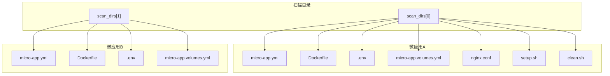
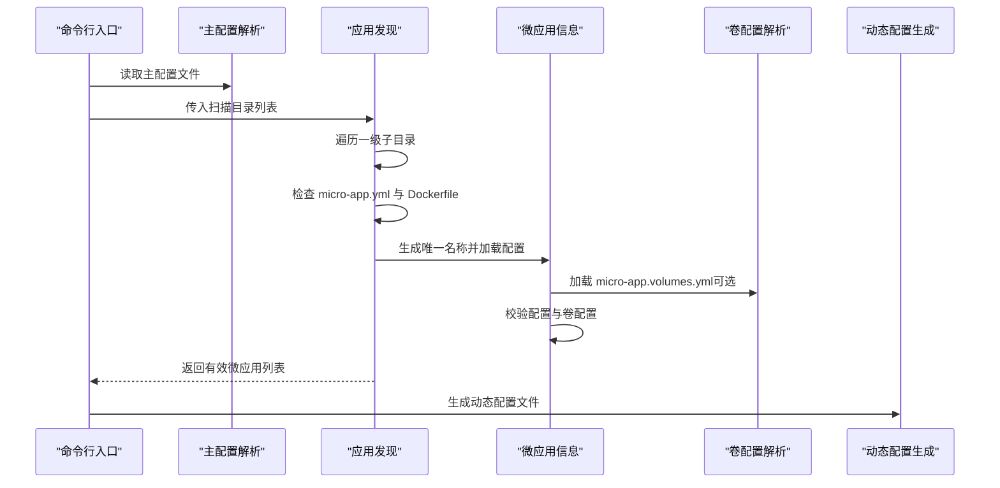
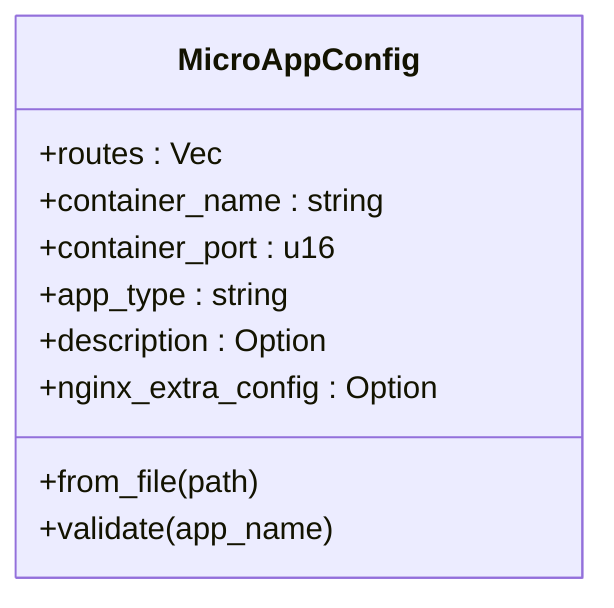
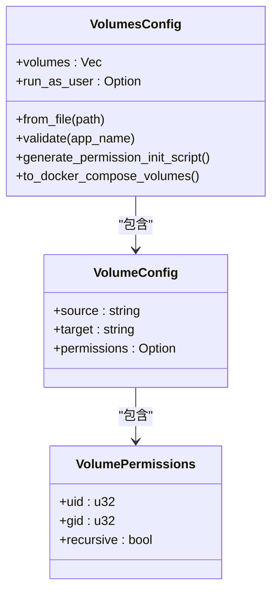
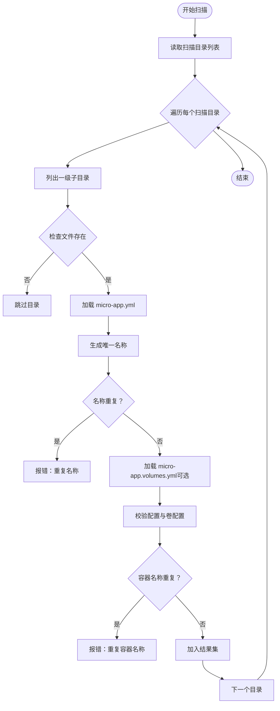
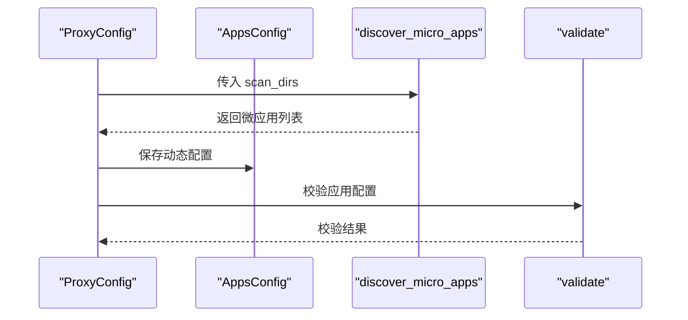
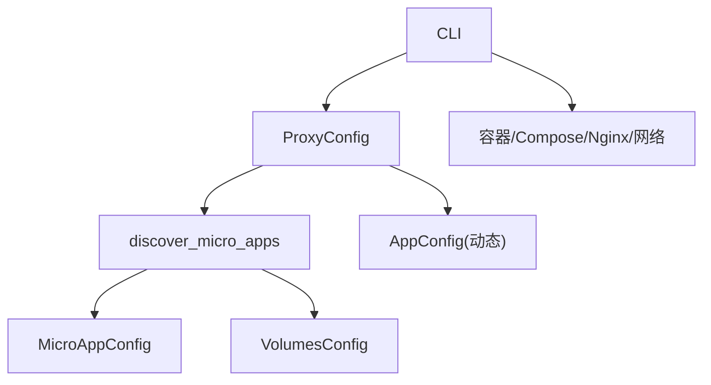

# 目录结构规范

<cite>
**本文引用的文件**
- [src/main.rs](file://src/main.rs)
- [src/lib.rs](file://src/lib.rs)
- [src/discovery.rs](file://src/discovery.rs)
- [src/micro_app_config.rs](file://src/micro_app_config.rs)
- [src/volumes_config.rs](file://src/volumes_config.rs)
- [src/config.rs](file://src/config.rs)
- [src/cli.rs](file://src/cli.rs)
- [proxy-config.yml.example](file://proxy-config.yml.example)
- [README.md](file://README.md)
- [docs/micro-app-development.md](file://docs/micro-app-development.md)
</cite>

## 目录
1. [简介](#简介)
2. [项目结构](#项目结构)
3. [核心组件](#核心组件)
4. [架构总览](#架构总览)
5. [详细组件分析](#详细组件分析)
6. [依赖关系分析](#依赖关系分析)
7. [性能考量](#性能考量)
8. [故障排查指南](#故障排查指南)
9. [结论](#结论)
10. [附录](#附录)

## 简介
本规范面向微应用开发者与运维人员，明确微应用项目的标准目录布局与文件职责，解释如何通过目录结构标识与分类不同类型的微应用（Static、API、Internal）。文档还涵盖目录扫描机制、发现规则、嵌套目录处理与重名冲突的解决方案，并提供最佳实践与常见错误避免方法。

## 项目结构
micro_proxy 通过“扫描目录 + 配置文件”的方式自动发现微应用。每个微应用根目录下必须包含微应用配置文件与 Docker 构建文件；可选地包含卷配置文件、环境变量文件、自定义 Nginx 配置、预构建与清理脚本等。

- 根目录扫描
  - 通过配置文件中的扫描目录列表，逐层扫描一级子目录
  - 仅当某目录同时包含微应用配置文件与 Docker 构建文件时，才被视为有效微应用
- 微应用命名
  - 名称由“扫描目录相对路径 + 下划线 + 最后一级目录名”组成，保证跨扫描目录的唯一性
- 文件组织原则
  - 必需文件：微应用配置文件、Docker 构建文件
  - 可选文件：卷配置文件、环境变量文件、自定义 Nginx 配置、预构建/清理脚本
  - 通过文件存在与否决定功能启用与否

**图表来源**
- [src/discovery.rs:235-352](file://src/discovery.rs#L235-L352)
- [src/micro_app_config.rs:37-53](file://src/micro_app_config.rs#L37-L53)
- [src/volumes_config.rs:57-82](file://src/volumes_config.rs#L57-L82)
- [proxy-config.yml.example:5-19](file://proxy-config.yml.example#L5-L19)

**章节来源**
- [README.md:291-299](file://README.md#L291-L299)
- [proxy-config.yml.example:5-19](file://proxy-config.yml.example#L5-L19)

## 核心组件
- 微应用配置解析
  - 解析微应用配置文件，校验必需字段与类型合法性
- 卷配置解析
  - 解析卷配置文件，校验路径与权限配置
- 应用发现
  - 扫描指定目录，识别包含必要文件的微应用，生成唯一名称并去重
- 配置验证
  - 校验扫描结果与动态配置的一致性，确保名称唯一、路径存在、类型配置正确

**章节来源**
- [src/micro_app_config.rs:10-107](file://src/micro_app_config.rs#L10-L107)
- [src/volumes_config.rs:43-144](file://src/volumes_config.rs#L43-L144)
- [src/discovery.rs:12-145](file://src/discovery.rs#L12-L145)
- [src/config.rs:125-367](file://src/config.rs#L125-L367)

## 架构总览
下图展示了从扫描目录到生成动态配置与最终运行的全链路：

**图表来源**
- [src/cli.rs:78-116](file://src/cli.rs#L78-L116)
- [src/discovery.rs:235-352](file://src/discovery.rs#L235-L352)
- [src/micro_app_config.rs:37-107](file://src/micro_app_config.rs#L37-L107)
- [src/volumes_config.rs:57-144](file://src/volumes_config.rs#L57-L144)

## 详细组件分析

### 微应用配置模型
- 字段说明
  - 访问路径：Static/API 类型必需，Internal 类型忽略
  - 容器名称：全局唯一，用于容器识别与网络隔离
  - 容器端口：容器内部监听端口
  - 应用类型：static、api、internal
  - 描述与额外 Nginx 配置：可选
- 校验规则
  - 容器名称非空
  - 容器端口大于 0
  - 应用类型合法
  - Static/API 类型必须配置访问路径
  - Internal 类型若配置访问路径将被忽略

**图表来源**
- [src/micro_app_config.rs:10-107](file://src/micro_app_config.rs#L10-L107)

**章节来源**
- [src/micro_app_config.rs:10-107](file://src/micro_app_config.rs#L10-L107)

### 卷配置模型
- 字段说明
  - 卷列表：源路径、目标路径、可选权限配置
  - 运行用户：容器内以何种用户身份运行
- 校验规则
  - 源路径与目标路径均不能为空
  - 权限配置中 uid/gid 为 0 时发出安全警告
  - 运行用户格式校验
- 转换与生成
  - 生成权限初始化脚本（按需）
  - 转换为 Docker Compose 的 volumes 映射格式

**图表来源**
- [src/volumes_config.rs:10-205](file://src/volumes_config.rs#L10-L205)

**章节来源**
- [src/volumes_config.rs:43-205](file://src/volumes_config.rs#L43-L205)

### 应用发现与命名规则
- 发现规则
  - 仅扫描一级子目录
  - 必须同时包含微应用配置文件与 Docker 构建文件
  - 可选包含环境变量文件、卷配置文件、自定义 Nginx 配置、预构建/清理脚本
- 唯一名称生成
  - 规则：{扫描目录相对路径}_{最后级目录名}
  - 若相对路径为空（直接子目录），仅使用最后级目录名
- 去重策略
  - 微应用名称去重
  - 容器名称去重

**图表来源**
- [src/discovery.rs:235-352](file://src/discovery.rs#L235-L352)
- [src/discovery.rs:147-222](file://src/discovery.rs#L147-L222)

**章节来源**
- [src/discovery.rs:224-352](file://src/discovery.rs#L224-L352)

### 配置验证与动态配置
- 动态配置生成
  - 由应用发现结果转换而来，包含名称、类型、路由、容器名、端口、路径、卷映射、运行用户等
- 验证逻辑
  - 扫描目录不能为空
  - 应用名称唯一
  - Static/API 类型必须存在于扫描结果且路由非空
  - Internal 类型必须提供路径且路径存在、包含 Docker 构建文件，且忽略路由与额外 Nginx 配置

**图表来源**
- [src/config.rs:178-367](file://src/config.rs#L178-L367)
- [src/discovery.rs:365-374](file://src/discovery.rs#L365-L374)

**章节来源**
- [src/config.rs:125-367](file://src/config.rs#L125-L367)

## 依赖关系分析
- 模块耦合
  - 应用发现模块依赖微应用配置与卷配置模块
  - 配置模块依赖应用发现结果进行验证
  - CLI 模块协调配置、发现、容器与网络等子系统
- 关键依赖链
  - 主配置 → 应用发现 → 微应用配置/卷配置 → 动态配置
  - CLI → 主配置 → 应用发现 → 容器/网络/Nginx

**图表来源**
- [src/cli.rs:78-116](file://src/cli.rs#L78-L116)
- [src/discovery.rs:235-352](file://src/discovery.rs#L235-L352)
- [src/micro_app_config.rs:37-107](file://src/micro_app_config.rs#L37-L107)
- [src/volumes_config.rs:57-144](file://src/volumes_config.rs#L57-L144)
- [src/config.rs:178-367](file://src/config.rs#L178-L367)

**章节来源**
- [src/lib.rs:6-25](file://src/lib.rs#L6-L25)

## 性能考量
- 扫描范围限制
  - 仅扫描一级子目录，避免深度递归带来的性能开销
- 文件存在性检查
  - 通过文件存在性判断减少不必要的解析成本
- 唯一性校验
  - 在发现阶段尽早发现重复名称与容器名，避免后续流程浪费

## 故障排查指南
- 常见问题与定位
  - 缺失微应用配置文件或 Docker 构建文件：检查对应文件是否存在
  - 重复名称或容器名：调整目录结构或重命名，确保唯一性
  - Internal 类型缺少路径或路径不存在：补充路径并确保包含 Docker 构建文件
  - 路由为空：为 Static/API 类型配置访问路径
  - 卷权限问题：检查源路径与目标路径，合理配置权限与运行用户
- 建议排查步骤
  - 使用详细日志模式启动，观察扫描与校验过程
  - 逐一核对微应用目录中的文件完整性
  - 使用网络地址列表工具排查容器间连通性

**章节来源**
- [src/discovery.rs:93-119](file://src/discovery.rs#L93-L119)
- [src/config.rs:220-347](file://src/config.rs#L220-L347)
- [README.md:328-420](file://README.md#L328-L420)

## 结论
通过标准化的目录结构与严格的扫描/校验机制，micro_proxy 能够可靠地发现与管理多类型微应用。遵循本文规范，可有效避免命名冲突、配置错误与权限问题，提升整体运维效率与系统稳定性。

## 附录

### 标准微应用目录结构（三类）
- Static（静态/前端）
  - 必需：微应用配置文件、Docker 构建文件
  - 可选：卷配置文件、环境变量文件、自定义 Nginx 配置、预构建/清理脚本
  - 典型用途：对外提供静态页面或 SPA 应用
- API（后端服务）
  - 必需：微应用配置文件、Docker 构建文件
  - 可选：卷配置文件、环境变量文件、预构建/清理脚本
  - 典型用途：对外提供 REST/GraphQL 接口
- Internal（内部服务）
  - 必需：微应用配置文件、Docker 构建文件
  - 可选：卷配置文件、预构建/清理脚本
  - 典型用途：数据库、缓存等仅内部通信的服务

**章节来源**
- [docs/micro-app-development.md:25-55](file://docs/micro-app-development.md#L25-L55)
- [docs/micro-app-development.md:250-487](file://docs/micro-app-development.md#L250-L487)

### 目录扫描与发现规则
- 扫描范围：仅一级子目录
- 识别条件：同时包含微应用配置文件与 Docker 构建文件
- 命名规则：{扫描目录相对路径}_{最后级目录名}，跨目录唯一
- 去重策略：微应用名称与容器名称均需唯一

**章节来源**
- [README.md:291-299](file://README.md#L291-L299)
- [src/discovery.rs:235-352](file://src/discovery.rs#L235-L352)

### 文件层次结构示例（概念示意）
- Static 典型结构
  - micro-apps/
    - craftaidhub_front/
      - micro-app.yml
      - micro-app.volumes.yml
      - Dockerfile
      - nginx.conf
      - .env
      - setup.sh
      - clean.sh
      - dist/
- API 典型结构
  - micro-apps/
    - backend/
      - micro-app.yml
      - micro-app.volumes.yml
      - Dockerfile
      - .env
      - setup.sh
      - clean.sh
      - src/
- Internal 典型结构
  - services/
    - backend_redis/
      - micro-app.yml
      - micro-app.volumes.yml
      - Dockerfile
      - data/
      - logs/
      - setup.sh
      - clean.sh

**章节来源**
- [docs/micro-app-development.md:254-445](file://docs/micro-app-development.md#L254-L445)

### 最佳实践与常见错误避免
- 最佳实践
  - 使用清晰的目录层级，避免同名目录出现在多个扫描目录中
  - 为卷配置合理的权限与运行用户，避免 root 权限引发的安全风险
  - 为 Static/API 类型提供必要的访问路径与自定义 Nginx 配置
  - 为 Internal 类型提供明确的路径与 Docker 构建文件
- 常见错误
  - 忽略必需文件导致微应用未被发现
  - 重复的微应用名称或容器名称导致启动失败
  - Internal 类型错误地配置访问路径或额外 Nginx 配置
  - 卷权限配置不当导致容器内无法访问挂载目录

**章节来源**
- [src/discovery.rs:300-337](file://src/discovery.rs#L300-L337)
- [src/config.rs:273-322](file://src/config.rs#L273-L322)
- [docs/micro-app-development.md:180-247](file://docs/micro-app-development.md#L180-L247)