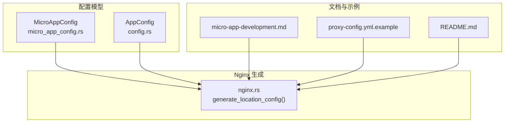
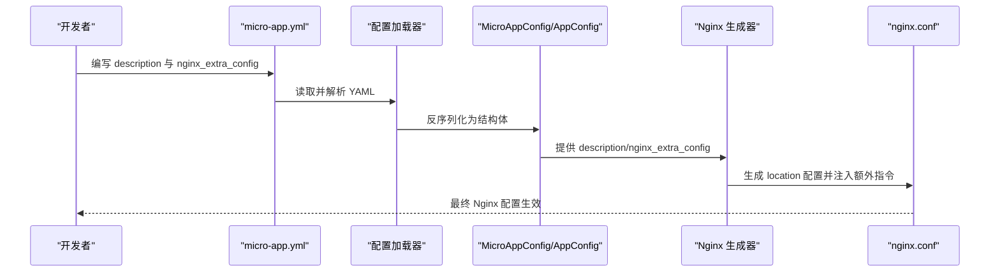
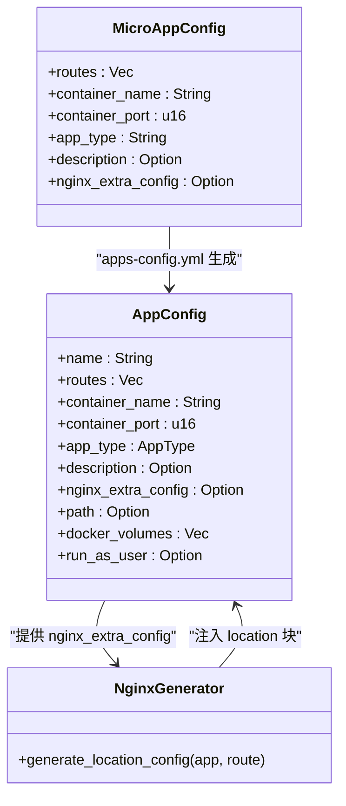

# 可选配置字段

<cite>
**本文引用的文件**
- [micro_app_config.rs](file://src/micro_app_config.rs)
- [config.rs](file://src/config.rs)
- [nginx.rs](file://src/nginx.rs)
- [micro-app-development.md](file://docs/micro-app-development.md)
- [proxy-config.yml.example](file://proxy-config.yml.example)
- [README.md](file://README.md)
</cite>

## 目录
1. [引言](#引言)
2. [项目结构](#项目结构)
3. [核心组件](#核心组件)
4. [架构总览](#架构总览)
5. [详细组件分析](#详细组件分析)
6. [依赖关系分析](#依赖关系分析)
7. [性能考量](#性能考量)
8. [故障排查指南](#故障排查指南)
9. [结论](#结论)
10. [附录](#附录)

## 引言
本章节聚焦于 micro-app.yml 的可选配置字段，重点说明以下两个字段：
- description：应用描述，用于系统内展示与可读性增强
- nginx_extra_config：为 Static/API 类型提供的自定义 Nginx 配置片段，支持多路由、条件与动态配置注入

同时，本文将解释字段的序列化/反序列化机制（尤其是 skip_serializing_if 的作用）、生效范围与兼容性、复杂场景示例，以及性能优化建议与最佳实践。

## 项目结构
与可选配置字段直接相关的代码与文档分布如下：
- 配置模型与序列化/反序列化定义：src/micro_app_config.rs、src/config.rs
- Nginx 配置生成与注入：src/nginx.rs
- 开发指南与示例：docs/micro-app-development.md
- 主配置示例：proxy-config.yml.example
- 项目文档与配置说明：README.md

图表来源
- [micro_app_config.rs:10-33](file://src/micro_app_config.rs#L10-L33)
- [config.rs:24-68](file://src/config.rs#L24-L68)
- [nginx.rs:418-536](file://src/nginx.rs#L418-L536)
- [micro-app-development.md:567-591](file://docs/micro-app-development.md#L567-L591)
- [proxy-config.yml.example:1-53](file://proxy-config.yml.example#L1-L53)
- [README.md:164-236](file://README.md#L164-L236)

章节来源
- [micro_app_config.rs:10-33](file://src/micro_app_config.rs#L10-L33)
- [config.rs:24-68](file://src/config.rs#L24-L68)
- [nginx.rs:418-536](file://src/nginx.rs#L418-L536)
- [micro-app-development.md:567-591](file://docs/micro-app-development.md#L567-L591)
- [proxy-config.yml.example:1-53](file://proxy-config.yml.example#L1-L53)
- [README.md:164-236](file://README.md#L164-L236)

## 核心组件
- MicroAppConfig：用于解析单个微应用目录下的 micro-app.yml，包含可选字段 description 与 nginx_extra_config
- AppConfig：动态生成的 apps-config.yml 中的完整应用配置，包含 description 与 nginx_extra_config
- Nginx 生成器：在生成 location 配置时，将 AppConfig.nginx_extra_config 注入到对应 location 块中

章节来源
- [micro_app_config.rs:10-33](file://src/micro_app_config.rs#L10-L33)
- [config.rs:24-68](file://src/config.rs#L24-L68)
- [nginx.rs:517-525](file://src/nginx.rs#L517-L525)

## 架构总览
下图展示了 micro-app.yml 的可选字段在系统中的流转与生效路径：

图表来源
- [micro_app_config.rs:36-53](file://src/micro_app_config.rs#L36-L53)
- [config.rs:76-99](file://src/config.rs#L76-L99)
- [nginx.rs:517-525](file://src/nginx.rs#L517-L525)

## 详细组件分析

### description 字段
- 用途
  - 作为应用的可读性描述，便于在系统内展示与维护
  - 在 apps-config.yml 中被保留并随应用配置一起生成
- 展示位置与格式
  - apps-config.yml 中直接保留 description 字段，用于后续生成与审计
  - 在 README 与开发指南中作为配置说明出现
- 格式要求
  - 字符串类型，无特殊限制；建议简洁明确，避免过长
- 生效范围
  - 仅用于系统内展示与可读性增强，不影响 Nginx 代理行为

章节来源
- [config.rs:44-46](file://src/config.rs#L44-L46)
- [micro-app-development.md:62-73](file://docs/micro-app-development.md#L62-L73)
- [README.md:222-223](file://README.md#L222-L223)

### nginx_extra_config 字段
- 用途
  - 为 Static/API 类型提供自定义 Nginx 指令，允许在 location 块中注入额外配置
- 生效范围
  - 仅对 Static 与 Api 类型有效；Internal 类型不生成 Nginx 配置，因此该字段会被忽略
- 注入机制
  - 在生成 location 配置时，若 AppConfig.nginx_extra_config 存在，则逐行追加到对应 location 块末尾
- 语法与可用指令
  - 作为字符串片段，遵循 Nginx 配置语法
  - 典型场景包括：CORS、特殊路径转发、请求/响应头修改、条件判断（如 if）、限流等
- 格式要求
  - 采用 YAML 的多行字符串（literal block scalar 或 folded block scalar），保持缩进与换行
  - 每行应为合法的 Nginx 指令，缩进与块结构需符合 Nginx 语法
- 生效位置
  - 仅注入到对应 routes 的 location 块中，不影响其他 routes 或 server 块
- 兼容性与扩展性
  - 由于是原样注入，需确保指令与 Nginx 版本兼容
  - 可与系统默认的 location 行为叠加，但需注意指令顺序与冲突

章节来源
- [config.rs:48-51](file://src/config.rs#L48-L51)
- [nginx.rs:517-525](file://src/nginx.rs#L517-L525)
- [micro-app-development.md:567-591](file://docs/micro-app-development.md#L567-L591)

### 复杂配置场景示例
- 多路由配置
  - 在同一应用中配置多个 routes，每个路由都会生成独立的 location 块，并各自注入 nginx_extra_config
- 条件配置
  - 使用 if 判断请求方法、头信息等，针对不同请求做差异化处理
- 动态配置
  - 通过变量与 proxy_pass 组合，实现动态上游解析与转发

章节来源
- [nginx.rs:418-536](file://src/nginx.rs#L418-L536)
- [micro-app-development.md:567-591](file://docs/micro-app-development.md#L567-L591)

### 序列化与反序列化机制
- 反序列化（YAML → 结构体）
  - 使用 serde_yaml 解析 YAML，将字段映射到结构体字段
  - description 与 nginx_extra_config 作为可选字段，缺失时不报错
- 序列化（结构体 → YAML）
  - 使用 serde 的序列化机制
  - skip_serializing_if 属性控制“空值”字段是否写入输出
    - description 与 nginx_extra_config 使用 skip_serializing_if = "Option::is_none"
    - 当字段为 None 时，不会出现在最终 YAML 输出中，从而保持配置简洁
- 兼容性
  - 旧版本配置若缺少这些字段，仍可正常反序列化
  - 新增字段不会破坏现有配置的兼容性

章节来源
- [micro_app_config.rs:26-32](file://src/micro_app_config.rs#L26-L32)
- [config.rs:44-51](file://src/config.rs#L44-L51)
- [nginx.rs:517-525](file://src/nginx.rs#L517-L525)

## 依赖关系分析
- MicroAppConfig 与 AppConfig
  - MicroAppConfig 用于解析 micro-app.yml，AppConfig 用于 apps-config.yml
  - 两者均包含 description 与 nginx_extra_config 字段，且序列化策略一致
- Nginx 生成器
  - 仅对 Static 与 Api 类型生成 location 配置
  - 将 AppConfig.nginx_extra_config 逐行注入到对应 location 块
- 文档与示例
  - micro-app-development.md 提供示例与使用场景
  - proxy-config.yml.example 提供主配置示例（与可选字段无直接耦合）

图表来源
- [micro_app_config.rs:10-33](file://src/micro_app_config.rs#L10-L33)
- [config.rs:24-68](file://src/config.rs#L24-L68)
- [nginx.rs:418-536](file://src/nginx.rs#L418-L536)

章节来源
- [micro_app_config.rs:10-33](file://src/micro_app_config.rs#L10-L33)
- [config.rs:24-68](file://src/config.rs#L24-L68)
- [nginx.rs:418-536](file://src/nginx.rs#L418-L536)

## 性能考量
- Nginx 配置注入对性能影响极小
  - 仅在生成阶段进行字符串拼接，运行时无额外开销
- 建议
  - 避免在 nginx_extra_config 中使用高成本指令（如频繁正则匹配或复杂 if 分支）
  - 合理使用缓存与静态资源优化，减少后端压力
  - 对于大量 routes 的应用，优先保证 location 排序与命中效率

[本节为通用建议，不涉及具体文件分析]

## 故障排查指南
- description 字段
  - 若未显示在 apps-config.yml 中，检查是否在 micro-app.yml 中正确配置
  - 该字段不影响运行，仅用于展示
- nginx_extra_config 字段
  - 若注入后无效，检查 YAML 缩进与语法是否符合 Nginx 规范
  - 确认 app_type 为 Static 或 Api，Internal 类型不会生成 Nginx 配置
  - 确认 routes 与 location 块匹配，避免指令被其他块覆盖
- 生成与验证
  - 通过生成的 nginx.conf 检查注入的指令是否正确
  - 使用 Nginx 配置测试命令验证语法

章节来源
- [nginx.rs:517-525](file://src/nginx.rs#L517-L525)
- [README.md:328-420](file://README.md#L328-L420)

## 结论
- description 与 nginx_extra_config 均为可选字段，提升系统的可读性与灵活性
- nginx_extra_config 仅对 Static 与 Api 类型生效，通过逐行注入到对应 location 块，具备良好的扩展性
- 使用 skip_serializing_if 保持配置简洁，避免冗余字段
- 复杂场景可通过多路由、条件与动态配置实现，但需注意语法与性能

[本节为总结，不涉及具体文件分析]

## 附录
- 相关文档与示例
  - micro-app-development.md：包含 nginx_extra_config 的示例与使用场景
  - proxy-config.yml.example：主配置示例，便于对照理解字段关系
  - README.md：配置说明与最佳实践

章节来源
- [micro-app-development.md:567-591](file://docs/micro-app-development.md#L567-L591)
- [proxy-config.yml.example:1-53](file://proxy-config.yml.example#L1-53)
- [README.md:164-236](file://README.md#L164-L236)