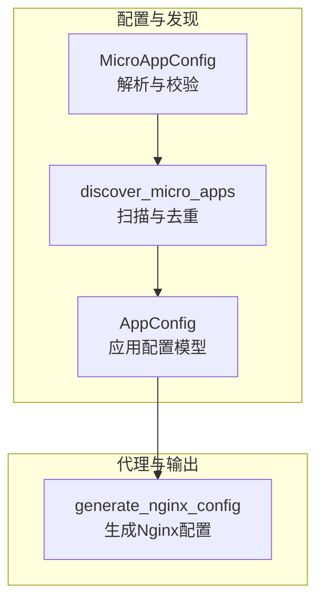
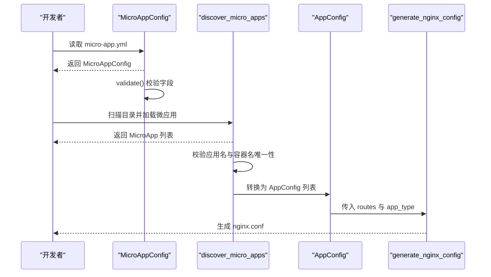
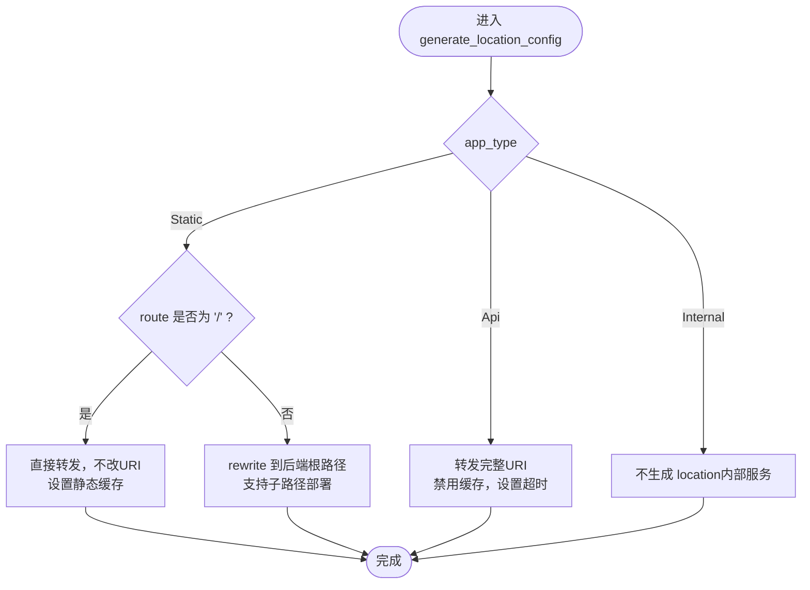
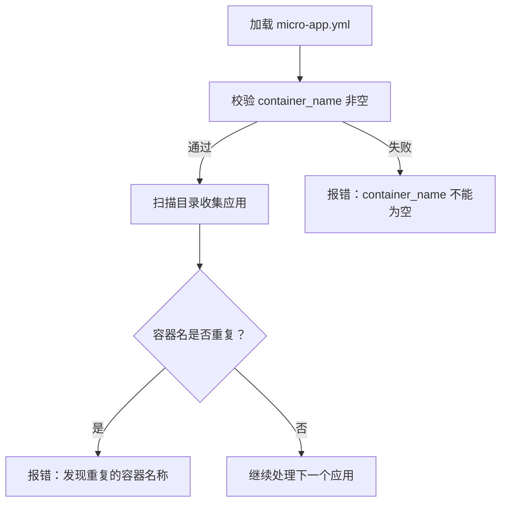
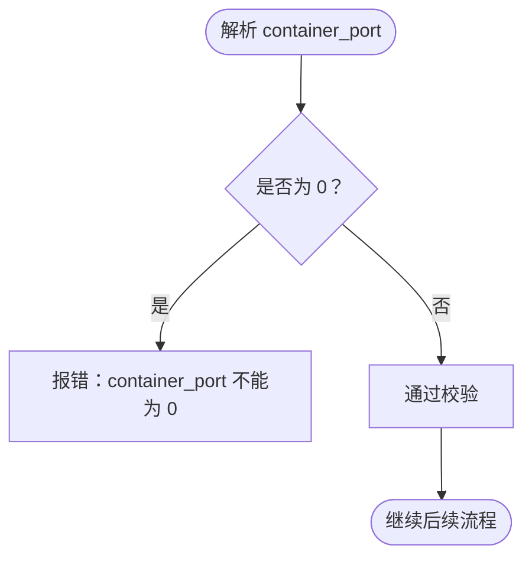
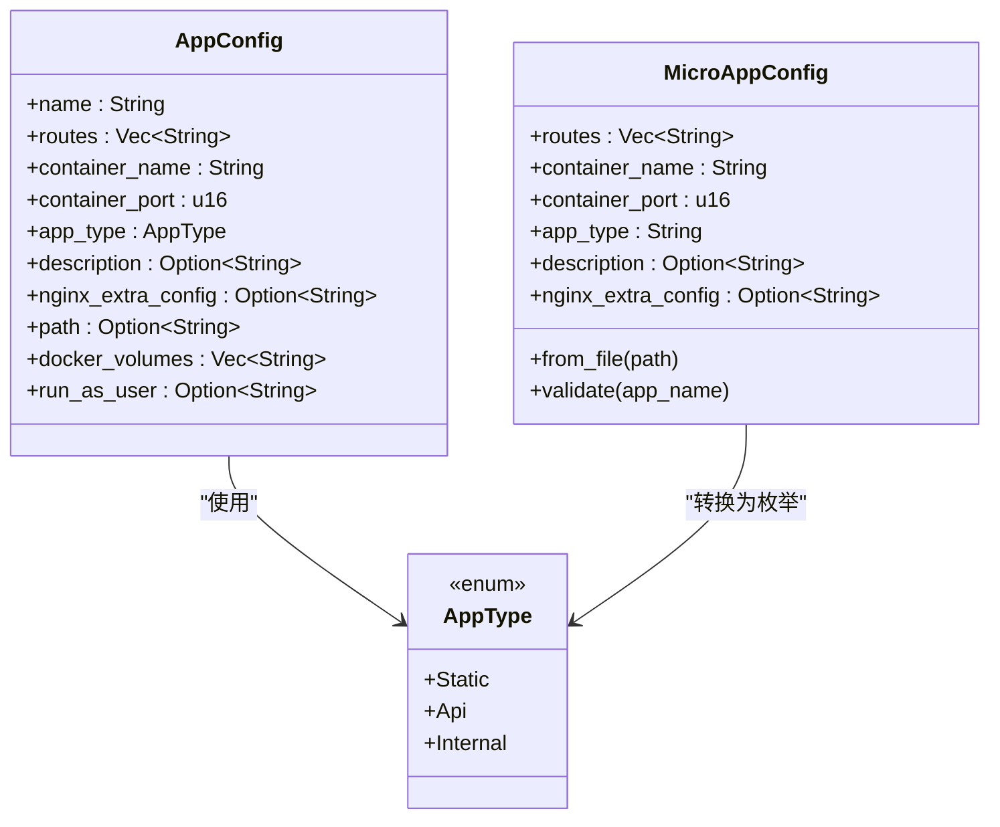
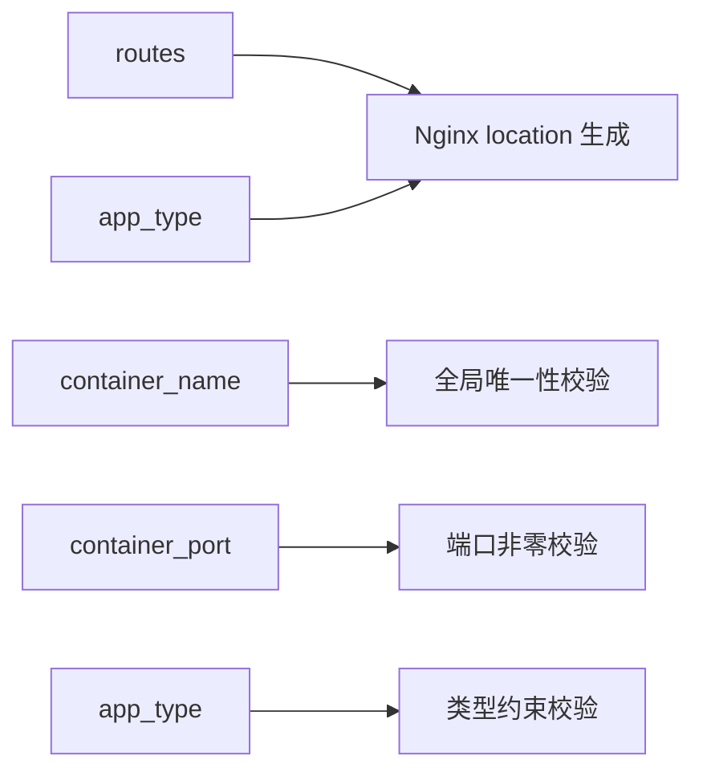

# 核心配置字段

<cite>
**本文引用的文件**
- [micro_app_config.rs](file://src/micro_app_config.rs)
- [config.rs](file://src/config.rs)
- [discovery.rs](file://src/discovery.rs)
- [nginx.rs](file://src/nginx.rs)
- [README.md](file://README.md)
- [proxy-config.yml.example](file://proxy-config.yml.example)
</cite>

## 目录
1. [简介](#简介)
2. [项目结构](#项目结构)
3. [核心组件](#核心组件)
4. [架构总览](#架构总览)
5. [详细组件分析](#详细组件分析)
6. [依赖关系分析](#依赖关系分析)
7. [性能考虑](#性能考虑)
8. [故障排查指南](#故障排查指南)
9. [结论](#结论)
10. [附录](#附录)

## 简介
本文聚焦于微应用配置文件 micro-app.yml 的核心字段，系统阐述以下方面：
- routes 字段的路由规则与路径匹配机制，区分静态路由与 API 路由的差异
- container_name 字段的唯一性约束与全局唯一校验机制
- container_port 字段的端口分配与冲突检测
- app_type 字段对应用行为的影响，涵盖 static、api、internal 三类类型的区别与限制
- 每个字段的配置示例、默认值与验证规则
- 字段间的依赖关系与约束条件（如 static/api 必须配置 routes，internal 不应配置 routes）

## 项目结构
围绕 micro-app.yml 的核心解析与验证流程，涉及以下关键模块：
- 配置模型与验证：负责解析 micro-app.yml 并执行字段合法性校验
- 应用发现与去重：扫描目录发现微应用，保证 app 名称与容器名称全局唯一
- Nginx 代理生成：依据 routes 与 app_type 生成反向代理规则
- 主配置与示例：提供 proxy-config.yml 的示例与说明，辅助理解端口与路径映射

**图表来源**
- [micro_app_config.rs:10-106](file://src/micro_app_config.rs#L10-L106)
- [discovery.rs:235-352](file://src/discovery.rs#L235-L352)
- [config.rs:24-68](file://src/config.rs#L24-L68)
- [nginx.rs:26-92](file://src/nginx.rs#L26-L92)

**章节来源**
- [micro_app_config.rs:10-106](file://src/micro_app_config.rs#L10-L106)
- [discovery.rs:235-352](file://src/discovery.rs#L235-L352)
- [config.rs:24-68](file://src/config.rs#L24-L68)
- [nginx.rs:26-92](file://src/nginx.rs#L26-L92)

## 核心组件
- MicroAppConfig：解析 micro-app.yml，提供 from_file 与 validate 方法，负责字段合法性与类型约束校验
- AppConfig：动态生成的应用配置模型，承载 routes、container_name、container_port、app_type 等字段
- discovery 模块：扫描目录发现微应用，执行全局唯一性校验（应用名与容器名）
- nginx 模块：根据 routes 与 app_type 生成 location 规则，支持静态与 API 的差异化处理

**章节来源**
- [micro_app_config.rs:10-106](file://src/micro_app_config.rs#L10-L106)
- [config.rs:24-68](file://src/config.rs#L24-L68)
- [discovery.rs:235-352](file://src/discovery.rs#L235-L352)
- [nginx.rs:26-92](file://src/nginx.rs#L26-L92)

## 架构总览
micro-app.yml 的解析与应用配置生成流程如下：

**图表来源**
- [micro_app_config.rs:37-106](file://src/micro_app_config.rs#L37-L106)
- [discovery.rs:235-352](file://src/discovery.rs#L235-L352)
- [config.rs:122-144](file://src/config.rs#L122-L144)
- [nginx.rs:26-92](file://src/nginx.rs#L26-L92)

## 详细组件分析

### routes 字段：路由规则与路径匹配机制
- 作用与位置
  - routes 为访问路径数组，用于声明该微应用对外暴露的路由前缀
  - 仅对 static 与 api 类型有效；internal 类型通常无需配置（会被忽略）
- 静态路由（static）
  - 根路径 "/"：直接转发至容器内部端口，不改变 URI
  - 非根路径（如 "/app"）：通过 rewrite 将请求重写为后端期望的根路径，以适配前端单页应用的基路径部署
- API 路由（api）
  - 直接转发完整 URI，不添加尾部斜杠，确保后端收到精确路径（如 /api/v1/status）
  - 提供额外的 nginx 配置注入能力（仅对 static/api 有效）
- 路径匹配与排序
  - Nginx 生成时按路径长度降序排列 location，确保更具体路径优先匹配
  - 若无应用使用根路径 "/"，将生成默认 404 返回
- 依赖关系
  - static/api 类型必须配置 routes，否则校验失败
  - internal 类型不应配置 routes，若配置将被忽略

**图表来源**
- [nginx.rs:418-536](file://src/nginx.rs#L418-L536)

**章节来源**
- [nginx.rs:418-536](file://src/nginx.rs#L418-L536)
- [micro_app_config.rs:87-102](file://src/micro_app_config.rs#L87-L102)
- [config.rs:29-33](file://src/config.rs#L29-L33)

### container_name 字段：唯一性约束与命名规范
- 必填与唯一性
  - 必填：不能为空字符串
  - 全局唯一：在整个扫描范围内，所有微应用的 container_name 必须唯一
- 命名规范
  - 由开发者自定义，建议具备可读性与可维护性
  - 与容器实际名称一致，便于运维与排查
- 验证机制
  - 解析阶段：MicroAppConfig.validate() 校验非空
  - 发现阶段：discover_micro_apps() 维护 container_names 集合，发现重复立即报错
- 冲突检测
  - 若多个微应用配置了相同的 container_name，将触发错误并终止流程

**图表来源**
- [micro_app_config.rs:59-66](file://src/micro_app_config.rs#L59-L66)
- [discovery.rs:324-340](file://src/discovery.rs#L324-L340)

**章节来源**
- [micro_app_config.rs:59-66](file://src/micro_app_config.rs#L59-L66)
- [discovery.rs:324-340](file://src/discovery.rs#L324-L340)

### container_port 字段：端口分配规则与冲突检测
- 必填与取值范围
  - 必填：必须为非零 u16 值
  - 用途：声明容器内部监听端口，Nginx 通过该端口进行反向代理
- 冲突检测
  - 解析阶段：MicroAppConfig.validate() 校验 container_port != 0
  - 发现阶段：discover_micro_apps() 仅校验 container_name 唯一；端口冲突需结合 Docker Compose 与运行时环境判断
- 端口映射关系
  - proxy-config.yml 中的 nginx_host_port 决定宿主机端口
  - 容器内部端口由 container_port 指定
  - 二者通过 Docker 端口映射关联，避免冲突需确保宿主机端口未被占用

**图表来源**
- [micro_app_config.rs:68-75](file://src/micro_app_config.rs#L68-L75)

**章节来源**
- [micro_app_config.rs:68-75](file://src/micro_app_config.rs#L68-L75)
- [README.md:277-290](file://README.md#L277-L290)

### app_type 字段：应用行为影响与类型约束
- 取值范围
  - static：静态网站（前端页面），通过 Nginx 对外服务
  - api：API 服务（后端接口），通过 Nginx 对外服务
  - internal：内部服务（如数据库、缓存等），仅用于微应用间通信，不参与 Nginx 代理
- 行为差异
  - static：根路径与子路径的 URI 处理策略不同，支持前端单页应用的基路径部署
  - api：转发完整 URI，禁用缓存并设置超时，适合后端接口
  - internal：不生成 Nginx location，也不应配置 routes 与 nginx_extra_config
- 约束条件
  - static/api 类型：routes 必须非空
  - internal 类型：routes 应为空（若配置将被忽略）
  - internal 类型：不应配置 nginx_extra_config（将被忽略）

**图表来源**
- [config.rs:12-21](file://src/config.rs#L12-L21)
- [config.rs:24-68](file://src/config.rs#L24-L68)
- [micro_app_config.rs:10-33](file://src/micro_app_config.rs#L10-L33)

**章节来源**
- [config.rs:12-21](file://src/config.rs#L12-L21)
- [config.rs:29-51](file://src/config.rs#L29-L51)
- [micro_app_config.rs:77-102](file://src/micro_app_config.rs#L77-L102)

## 依赖关系分析
- 字段依赖
  - routes 依赖 app_type：static/api 必须配置 routes；internal 不应配置 routes
  - container_name 依赖全局唯一性：扫描阶段与解析阶段双重校验
  - container_port 依赖非零校验：解析阶段强制校验
- 类型约束
  - app_type 限定为 static、api、internal 之一；非法值将导致校验失败
- 生成链路
  - routes 与 app_type 决定 Nginx location 的生成策略
  - AppConfig 由 MicroAppConfig 转换而来，再进入 nginx 配置生成流程

**图表来源**
- [micro_app_config.rs:87-102](file://src/micro_app_config.rs#L87-L102)
- [discovery.rs:324-340](file://src/discovery.rs#L324-L340)
- [nginx.rs:418-536](file://src/nginx.rs#L418-L536)

**章节来源**
- [micro_app_config.rs:87-102](file://src/micro_app_config.rs#L87-L102)
- [discovery.rs:324-340](file://src/discovery.rs#L324-L340)
- [nginx.rs:418-536](file://src/nginx.rs#L418-L536)

## 性能考虑
- 路由匹配排序：按路径长度降序生成 location，减少不必要的匹配开销
- 动态 DNS 解析：使用 Docker 内部 DNS 解析器，提升服务发现稳定性
- 缓存策略：静态资源设置缓存头，API 禁用缓存，平衡性能与一致性

**章节来源**
- [nginx.rs:388-416](file://src/nginx.rs#L388-L416)
- [nginx.rs:187-190](file://src/nginx.rs#L187-L190)

## 故障排查指南
- container_name 为空
  - 现象：解析阶段报错“container_name 不能为空”
  - 排查：检查 micro-app.yml 中 container_name 是否填写
- container_name 重复
  - 现象：扫描阶段报错“发现重复的容器名称”
  - 排查：确保所有微应用的 container_name 全局唯一
- container_port 为 0
  - 现象：解析阶段报错“container_port 不能为 0”
  - 排查：将 container_port 设置为合法的非零端口
- app_type 非法
  - 现象：解析阶段报错“app_type 无效”
  - 排查：将 app_type 设为 static、api 或 internal 之一
- static/api 类型 routes 为空
  - 现象：解析阶段报错“routes 不能为空”
  - 排查：为 static/api 类型至少配置一个路由
- internal 类型配置了 routes
  - 现象：校验阶段发出警告“routes 配置将被忽略”
  - 排查：internal 类型不配置 routes

**章节来源**
- [micro_app_config.rs:59-102](file://src/micro_app_config.rs#L59-L102)
- [discovery.rs:324-340](file://src/discovery.rs#L324-L340)

## 结论
micro-app.yml 的核心字段共同决定了微应用的行为与对外暴露方式。通过严格的解析与验证流程，系统确保：
- routes 与 app_type 的组合满足静态与 API 的差异化需求
- container_name 的全局唯一性保障容器命名安全
- container_port 的非零校验避免运行时端口冲突
- app_type 的类型约束与内部服务隔离策略，提升整体系统的稳定性与可维护性

## 附录

### 字段清单与说明
- routes
  - 类型：字符串数组
  - 必填：static/api 类型必须配置；internal 类型不应配置
  - 默认值：无（必须显式配置）
  - 验证规则：static/api 类型不能为空；internal 类型为空
  - 示例：["/", "/api"] 或 ["/app"]
- container_name
  - 类型：字符串
  - 必填：是
  - 默认值：无（必须显式配置）
  - 唯一性：全局唯一
  - 验证规则：不能为空；扫描阶段与解析阶段双重校验
- container_port
  - 类型：u16
  - 必填：是
  - 默认值：无（必须显式配置）
  - 验证规则：不能为 0
- app_type
  - 类型：字符串（解析后转换为枚举）
  - 必填：是
  - 取值：static、api、internal
  - 验证规则：必须为上述三者之一
- description（可选）
  - 类型：字符串
  - 默认值：无
- nginx_extra_config（可选）
  - 类型：字符串
  - 适用：static/api 类型
  - 默认值：无

**章节来源**
- [micro_app_config.rs:10-33](file://src/micro_app_config.rs#L10-L33)
- [config.rs:24-68](file://src/config.rs#L24-L68)
- [README.md:205-235](file://README.md#L205-L235)