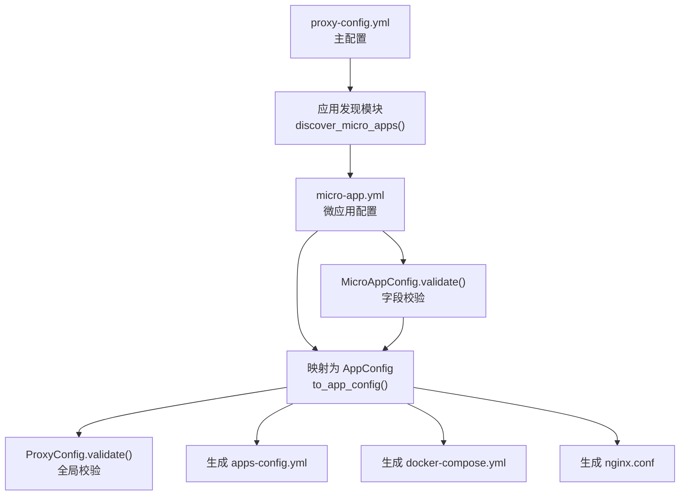
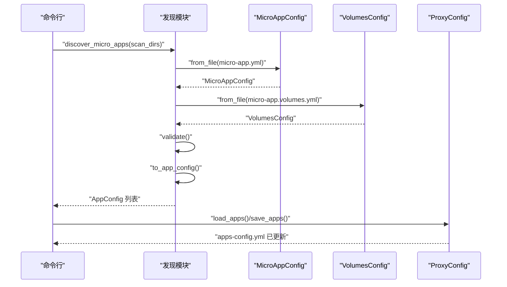
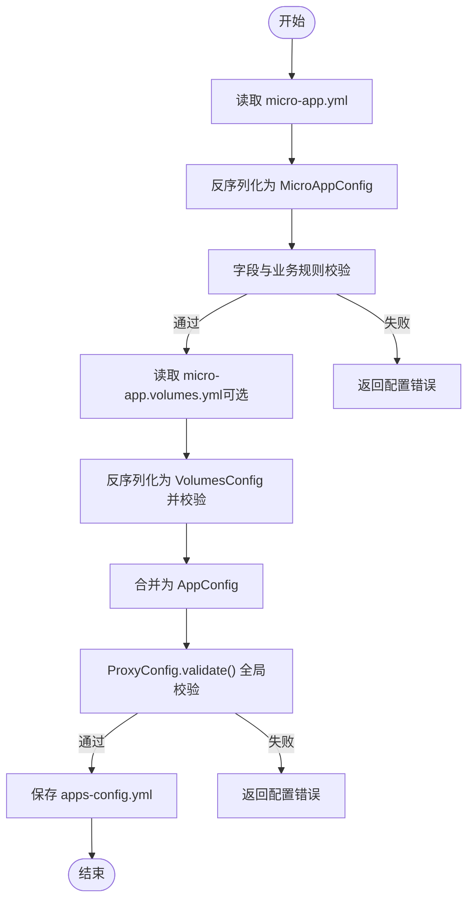
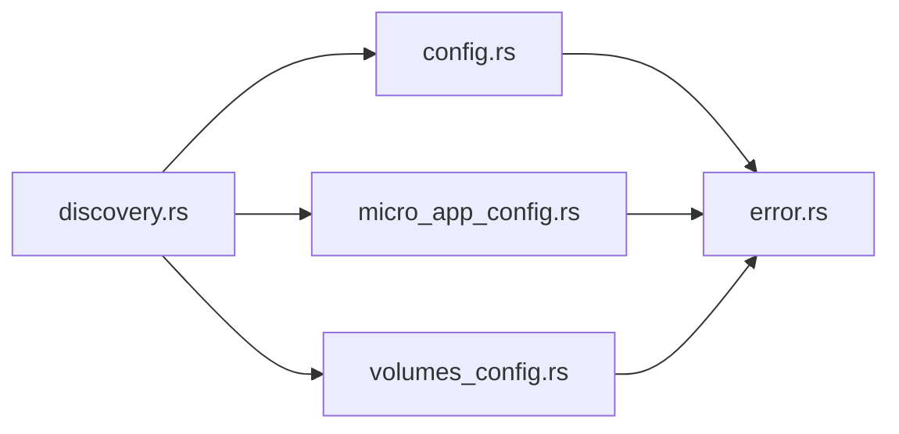

# 配置文件详解

<cite>
**本文引用的文件**   
- [src/micro_app_config.rs](file://src/micro_app_config.rs)
- [src/config.rs](file://src/config.rs)
- [src/discovery.rs](file://src/discovery.rs)
- [src/volumes_config.rs](file://src/volumes_config.rs)
- [src/error.rs](file://src/error.rs)
- [proxy-config.yml.example](file://proxy-config.yml.example)
- [README.md](file://README.md)
</cite>

## 目录
1. [引言](#引言)
2. [项目结构](#项目结构)
3. [核心组件](#核心组件)
4. [架构总览](#架构总览)
5. [详细组件分析](#详细组件分析)
6. [依赖关系分析](#依赖关系分析)
7. [性能考量](#性能考量)
8. [故障排查指南](#故障排查指南)
9. [结论](#结论)
10. [附录](#附录)

## 引言
本文件面向使用 micro_proxy 的开发者与运维人员，系统性讲解微应用配置文件 micro-app.yml 的字段语义、约束与校验规则，以及与主配置 proxy-config.yml 的协作关系。文档还涵盖配置加载顺序、优先级、继承与覆盖机制、调试方法与常见错误排查流程，帮助读者高效、稳定地完成微应用的配置与上线。

## 项目结构
micro_proxy 通过“主配置 + 微应用配置”的双层配置体系实现自动化管理：
- 主配置 proxy-config.yml：定义扫描目录、输出路径、网络与端口等全局参数。
- 微应用配置 micro-app.yml：定义单个微应用的路由、容器名、端口、类型等。
- 卷配置 micro-app.volumes.yml（可选）：定义 Docker volumes 映射与运行用户。

**图表来源**
- [src/discovery.rs:235-352](file://src/discovery.rs#L235-L352)
- [src/micro_app_config.rs:36-106](file://src/micro_app_config.rs#L36-L106)
- [src/config.rs:125-367](file://src/config.rs#L125-L367)

**章节来源**
- [README.md:164-236](file://README.md#L164-L236)
- [proxy-config.yml.example:1-53](file://proxy-config.yml.example#L1-L53)

## 核心组件
- 微应用配置模型 MicroAppConfig：负责解析 micro-app.yml，提供字段校验与加载能力。
- 应用配置模型 AppConfig：由微应用配置转换而来，供后续生成 Compose/Nginx/状态文件使用。
- 主配置 ProxyConfig：负责加载 proxy-config.yml，进行全局有效性校验与应用查询。
- 应用发现 discovery：扫描目录、加载 micro-app.yml、校验并转换为 AppConfig。
- 卷配置 VolumesConfig：解析 micro-app.volumes.yml，生成 Docker volumes 映射与权限初始化脚本。

**章节来源**
- [src/micro_app_config.rs:10-106](file://src/micro_app_config.rs#L10-L106)
- [src/config.rs:23-68](file://src/config.rs#L23-L68)
- [src/discovery.rs:121-144](file://src/discovery.rs#L121-L144)
- [src/volumes_config.rs:43-53](file://src/volumes_config.rs#L43-L53)

## 架构总览
下面以序列图展示从发现到生成配置的典型流程：

**图表来源**
- [src/discovery.rs:49-91](file://src/discovery.rs#L49-L91)
- [src/discovery.rs:121-144](file://src/discovery.rs#L121-L144)
- [src/config.rs:76-123](file://src/config.rs#L76-L123)

## 详细组件分析

### micro-app.yml 字段定义与约束
- routes
  - 语义：访问路径列表；静态与 API 类型必需配置；Internal 类型应为空。
  - 约束：Static/API 类型若为空将触发错误；Internal 类型配置 routes 将被忽略并记录告警。
  - 参考：[src/micro_app_config.rs:87-102](file://src/micro_app_config.rs#L87-L102)

- container_name
  - 语义：容器名称，全局唯一。
  - 约束：不能为空；应用发现阶段会检查重复，重复将报错。
  - 参考：[src/micro_app_config.rs:59-66](file://src/micro_app_config.rs#L59-L66)、[src/discovery.rs:324-336](file://src/discovery.rs#L324-L336)

- container_port
  - 语义：容器内部端口。
  - 约束：必须大于 0；否则报错。
  - 参考：[src/micro_app_config.rs:68-75](file://src/micro_app_config.rs#L68-L75)

- app_type
  - 语义：应用类型。
  - 取值：static、api、internal。
  - 约束：非法值将报错；Static/API 类型必须配置 routes；Internal 类型不应配置 routes。
  - 参考：[src/micro_app_config.rs:77-85](file://src/micro_app_config.rs#L77-L85)、[src/discovery.rs:125-130](file://src/discovery.rs#L125-L130)

- description（可选）
  - 语义：应用描述。
  - 参考：[src/micro_app_config.rs:26-28](file://src/micro_app_config.rs#L26-L28)

- nginx_extra_config（可选）
  - 语义：额外的 Nginx 配置片段（仅对 Static/API 有效）。
  - 参考：[src/micro_app_config.rs:30-32](file://src/micro_app_config.rs#L30-L32)、[src/config.rs:48-51](file://src/config.rs#L48-L51)

- docker_volumes（来自 micro-app.volumes.yml，可选）
  - 语义：Docker volumes 映射列表。
  - 约束：source 与 target 均不可为空；权限配置 uid/gid 为 0 时给出安全告警。
  - 参考：[src/volumes_config.rs:84-143](file://src/volumes_config.rs#L84-L143)

- run_as_user（来自 micro-app.volumes.yml，可选）
  - 语义：容器运行用户（uid:gid 或 username）。
  - 约束：不可为空字符串。
  - 参考：[src/volumes_config.rs:129-139](file://src/volumes_config.rs#L129-L139)

**章节来源**
- [src/micro_app_config.rs:10-106](file://src/micro_app_config.rs#L10-L106)
- [src/volumes_config.rs:43-53](file://src/volumes_config.rs#L43-L53)

### 配置加载与转换流程
- 加载 micro-app.yml：从文件系统读取 YAML，反序列化为 MicroAppConfig。
- 校验 micro-app.yml：检查必填字段、类型合法性、类型与 routes 的匹配关系。
- 加载 micro-app.volumes.yml（可选）：反序列化为 VolumesConfig 并校验。
- 转换为 AppConfig：将 MicroAppConfig 与 VolumesConfig 合并为 AppConfig，供后续生成 Compose/Nginx 使用。
- 全局校验：ProxyConfig.validate() 检查扫描目录、应用名称唯一性、Internal 应用的路径与 Dockerfile 存在性等。

**图表来源**
- [src/micro_app_config.rs:36-106](file://src/micro_app_config.rs#L36-L106)
- [src/discovery.rs:49-91](file://src/discovery.rs#L49-L91)
- [src/config.rs:220-347](file://src/config.rs#L220-L347)

**章节来源**
- [src/discovery.rs:49-144](file://src/discovery.rs#L49-L144)
- [src/config.rs:220-347](file://src/config.rs#L220-L347)

### 配置验证规则与错误处理
- 微应用配置验证（MicroAppConfig.validate）
  - container_name 非空
  - container_port > 0
  - app_type 属于 ["static","api","internal"]
  - Static/API 类型 routes 非空
  - Internal 类型 routes 为空（若有则告警）
  - 参考：[src/micro_app_config.rs:56-106](file://src/micro_app_config.rs#L56-L106)

- 主配置验证（ProxyConfig.validate）
  - scan_dirs 非空
  - 应用名称全局唯一
  - Static/API 应用必须存在于扫描结果
  - Internal 应用必须提供 path 且包含 Dockerfile
  - routes 与 nginx_extra_config 的类型有效性
  - 参考：[src/config.rs:220-347](file://src/config.rs#L220-L347)

- 错误类型
  - 统一通过 Error 枚举分类，包含 Config、Discovery、Docker、Nginx、Compose 等类别。
  - 参考：[src/error.rs:6-46](file://src/error.rs#L6-L46)

**章节来源**
- [src/micro_app_config.rs:56-106](file://src/micro_app_config.rs#L56-L106)
- [src/config.rs:220-347](file://src/config.rs#L220-L347)
- [src/error.rs:6-46](file://src/error.rs#L6-L46)

### 配置示例与最佳实践
- micro-app.yml 示例字段与说明
  - routes：Static/API 类型必需，Internal 类型建议留空。
  - container_name：全局唯一，建议使用可读性强的命名。
  - container_port：与容器内服务端口一致。
  - app_type：static/api/internal 三选一。
  - description：可选，便于团队协作。
  - nginx_extra_config：仅对 Static/API 有效，用于自定义 Nginx 片段。
  - 参考：[README.md:205-233](file://README.md#L205-L233)

- micro-app.volumes.yml 示例与最佳实践
  - volumes：source 与 target 均不可为空；必要时配置权限（uid/gid）。
  - run_as_user：避免使用 root（uid/gid 为 0），如确需使用请谨慎评估风险。
  - 参考：[src/volumes_config.rs:84-143](file://src/volumes_config.rs#L84-L143)

- 最佳实践
  - routes 建议以语义化前缀区分不同模块，避免冲突。
  - container_name 与 app_type 组合应保证全局唯一。
  - Internal 应用不配置 routes 与 nginx_extra_config，避免误导。
  - volumes 映射尽量使用相对路径，便于迁移。
  - 参考：[README.md:300-326](file://README.md#L300-L326)

**章节来源**
- [README.md:205-233](file://README.md#L205-L233)
- [src/volumes_config.rs:84-143](file://src/volumes_config.rs#L84-L143)
- [README.md:300-326](file://README.md#L300-L326)

### 配置加载顺序与优先级
- 主配置加载顺序
  - 读取 proxy-config.yml（主配置）
  - 读取 apps-config.yml（动态生成的应用配置）
  - 生成 docker-compose.yml 与 nginx.conf
  - 参考：[src/config.rs:178-218](file://src/config.rs#L178-L218)

- 微应用配置加载顺序
  - discover_micro_apps 扫描 scan_dirs
  - 逐个加载 micro-app.yml 与 micro-app.volumes.yml
  - 校验并转换为 AppConfig
  - 参考：[src/discovery.rs:235-352](file://src/discovery.rs#L235-L352)

- 优先级说明
  - micro-app.yml 的字段直接决定 AppConfig 的对应字段。
  - micro-app.volumes.yml 的 volumes 与 run_as_user 会被合并进 AppConfig。
  - ProxyConfig.validate() 会对最终 AppConfig 列表进行全局一致性检查。
  - 参考：[src/discovery.rs:121-144](file://src/discovery.rs#L121-L144)、[src/config.rs:220-347](file://src/config.rs#L220-L347)

**章节来源**
- [src/config.rs:178-218](file://src/config.rs#L178-L218)
- [src/discovery.rs:235-352](file://src/discovery.rs#L235-L352)

### 配置继承与覆盖机制
- 字段继承
  - AppConfig 由 MicroAppConfig 与 VolumesConfig 合并而来，未显式提供的字段保持默认或空值。
  - 参考：[src/discovery.rs:121-144](file://src/discovery.rs#L121-L144)

- 字段覆盖
  - micro-app.yml 的字段直接覆盖默认行为。
  - micro-app.volumes.yml 的 volumes 与 run_as_user 会覆盖默认的空值。
  - 参考：[src/volumes_config.rs:198-205](file://src/volumes_config.rs#L198-L205)

- 类型差异
  - Static/API：需要 routes，可配置 nginx_extra_config。
  - Internal：不需要 routes 与 nginx_extra_config，需要提供 path 与 Dockerfile。
  - 参考：[src/micro_app_config.rs:87-102](file://src/micro_app_config.rs#L87-L102)、[src/config.rs:273-322](file://src/config.rs#L273-L322)

**章节来源**
- [src/discovery.rs:121-144](file://src/discovery.rs#L121-L144)
- [src/volumes_config.rs:198-205](file://src/volumes_config.rs#L198-L205)
- [src/micro_app_config.rs:87-102](file://src/micro_app_config.rs#L87-L102)
- [src/config.rs:273-322](file://src/config.rs#L273-L322)

## 依赖关系分析
- 模块耦合
  - discovery 依赖 micro_app_config 与 volumes_config，负责加载与校验。
  - config 提供 AppConfig/AppType/ProxyConfig 数据结构与全局校验。
  - error 统一错误类型，便于上层捕获与处理。
- 外部依赖
  - YAML 解析：serde_yaml
  - 日志：log
  - 参考：[src/micro_app_config.rs:6-8](file://src/micro_app_config.rs#L6-L8)、[src/config.rs:6-9](file://src/config.rs#L6-L9)

**图表来源**
- [src/discovery.rs:6-8](file://src/discovery.rs#L6-L8)
- [src/micro_app_config.rs:6-8](file://src/micro_app_config.rs#L6-L8)
- [src/volumes_config.rs:6-8](file://src/volumes_config.rs#L6-L8)
- [src/config.rs:6-9](file://src/config.rs#L6-L9)
- [src/error.rs:3-4](file://src/error.rs#L3-L4)

**章节来源**
- [src/discovery.rs:6-8](file://src/discovery.rs#L6-L8)
- [src/micro_app_config.rs:6-8](file://src/micro_app_config.rs#L6-L8)
- [src/volumes_config.rs:6-8](file://src/volumes_config.rs#L6-L8)
- [src/config.rs:6-9](file://src/config.rs#L6-L9)
- [src/error.rs:3-4](file://src/error.rs#L3-L4)

## 性能考量
- 扫描策略
  - scan_dirs 为多目录扫描，仅一级目录，避免深度遍历带来的 IO 压力。
  - 参考：[README.md:291-299](file://README.md#L291-L299)

- 校验粒度
  - 微应用级别字段校验与全局唯一性校验分层进行，减少不必要的重复计算。
  - 参考：[src/micro_app_config.rs:56-106](file://src/micro_app_config.rs#L56-L106)、[src/config.rs:235-246](file://src/config.rs#L235-L246)

- 输出生成
  - apps-config.yml 作为中间产物，避免每次生成都重算全部配置。
  - 参考：[src/config.rs:76-123](file://src/config.rs#L76-L123)

## 故障排查指南
- 常见错误与定位
  - micro-app.yml 读取失败：检查文件路径与权限；查看日志中的 Config/Yaml 错误。
    - 参考：[src/micro_app_config.rs:41-49](file://src/micro_app_config.rs#L41-L49)、[src/error.rs:8-15](file://src/error.rs#L8-L15)

  - 字段校验失败：container_name 为空、container_port 为 0、app_type 非法、Static/API routes 为空、Internal 配置了 routes。
    - 参考：[src/micro_app_config.rs:59-102](file://src/micro_app_config.rs#L59-L102)

  - 应用发现失败：重复的应用名称或容器名称、缺少 Dockerfile、scan_dirs 为空。
    - 参考：[src/discovery.rs:300-336](file://src/discovery.rs#L300-L336)、[src/config.rs:224-228](file://src/config.rs#L224-L228)

  - Internal 应用校验失败：缺少 path 或 Dockerfile。
    - 参考：[src/config.rs:273-322](file://src/config.rs#L273-L322)

  - volumes 配置错误：source/target 为空、run_as_user 为空字符串、权限配置不当。
    - 参考：[src/volumes_config.rs:84-143](file://src/volumes_config.rs#L84-L143)

- 调试方法
  - 启用详细日志：使用 -v 参数查看加载与校验过程。
  - 检查生成文件：apps-config.yml、docker-compose.yml、nginx.conf。
  - 使用状态与网络命令辅助定位：status、network。
  - 参考：[README.md:330-351](file://README.md#L330-L351)

**章节来源**
- [src/micro_app_config.rs:41-49](file://src/micro_app_config.rs#L41-L49)
- [src/micro_app_config.rs:59-102](file://src/micro_app_config.rs#L59-L102)
- [src/discovery.rs:300-336](file://src/discovery.rs#L300-L336)
- [src/config.rs:224-228](file://src/config.rs#L224-L228)
- [src/config.rs:273-322](file://src/config.rs#L273-L322)
- [src/volumes_config.rs:84-143](file://src/volumes_config.rs#L84-L143)
- [README.md:330-351](file://README.md#L330-L351)

## 结论
通过清晰的字段定义、严格的校验规则与分层的加载流程，micro-proxy 能够稳定地将 micro-app.yml 与主配置协同工作，生成可运行的 Compose 与 Nginx 配置。遵循本文的配置示例与最佳实践，结合故障排查指南，可显著降低配置成本与上线风险。

## 附录
- 主配置 proxy-config.yml 关键字段参考
  - scan_dirs：扫描目录列表
  - apps_config_path：apps-config.yml 输出路径
  - nginx_config_path：nginx.conf 输出路径
  - compose_config_path：docker-compose.yml 输出路径
  - state_file_path：状态文件路径
  - network_list_path：网络地址列表输出路径
  - network_name：Docker 网络名称
  - nginx_host_port：Nginx 监听主机端口
  - web_root：Web 根目录（ACME 验证）
  - cert_dir：证书目录
  - domain：域名（HTTPS）
  - 参考：[proxy-config.yml.example:5-53](file://proxy-config.yml.example#L5-L53)、[README.md:166-203](file://README.md#L166-L203)