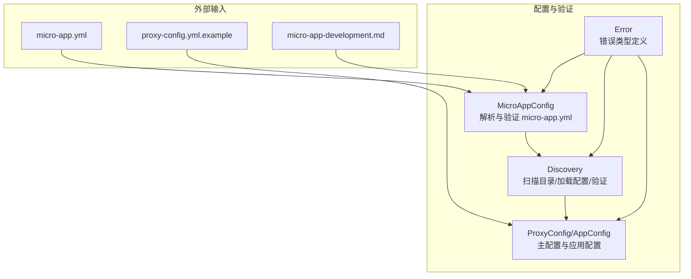
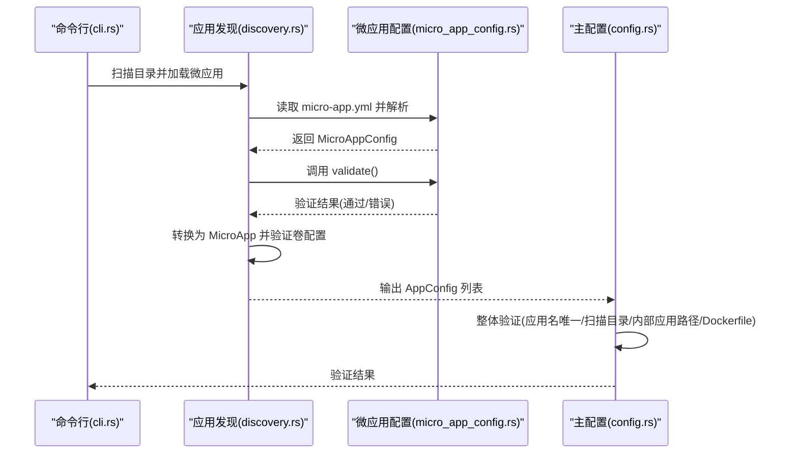
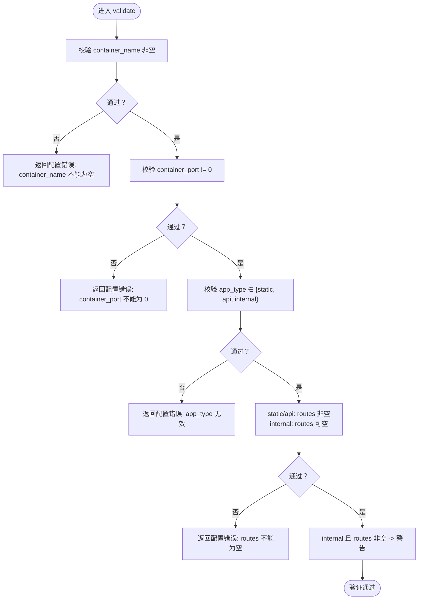
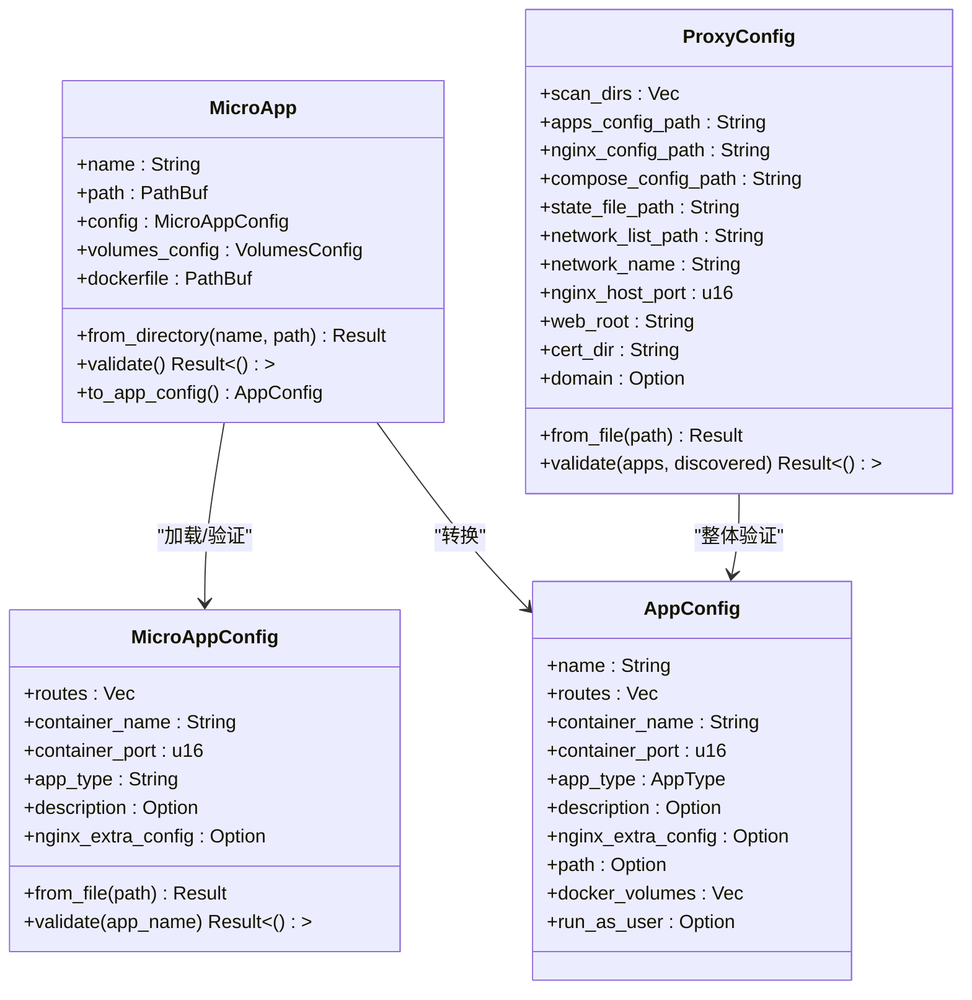

# 配置验证规则

<cite>
**本文引用的文件**
- [micro_app_config.rs](file://src/micro_app_config.rs)
- [config.rs](file://src/config.rs)
- [error.rs](file://src/error.rs)
- [discovery.rs](file://src/discovery.rs)
- [proxy-config.yml.example](file://proxy-config.yml.example)
- [micro-app-development.md](file://docs/micro-app-development.md)
- [cli.rs](file://src/cli.rs)
</cite>

## 目录
1. [简介](#简介)
2. [项目结构](#项目结构)
3. [核心组件](#核心组件)
4. [架构总览](#架构总览)
5. [详细组件分析](#详细组件分析)
6. [依赖关系分析](#依赖关系分析)
7. [性能考量](#性能考量)
8. [故障排查指南](#故障排查指南)
9. [结论](#结论)
10. [附录](#附录)

## 简介
本文聚焦于 micro-app.yml 的配置验证规则与错误处理机制，系统阐述 validate 方法的验证逻辑、不同应用类型（static、api、internal）的约束差异、错误类型与消息格式、常见失败原因与修复建议、配置加载顺序与优先级、以及单元测试与调试方法。目标是帮助开发者快速定位配置问题并正确编写 micro-app.yml。

## 项目结构
围绕 micro-app.yml 的配置验证，涉及以下关键模块：
- micro_app_config.rs：负责解析与验证单个微应用的 micro-app.yml
- discovery.rs：扫描目录、加载 micro-app.yml、调用验证并转换为 AppConfig
- config.rs：主配置 ProxyConfig 与应用配置 AppConfig 的结构定义及整体验证
- error.rs：统一的错误类型定义
- proxy-config.yml.example：主配置示例，说明扫描目录、输出路径等
- micro-app-development.md：微应用开发指南，包含类型与字段说明
- cli.rs：命令行入口，驱动配置加载与验证流程

图表来源
- [micro_app_config.rs:1-107](file://src/micro_app_config.rs#L1-L107)
- [discovery.rs:40-91](file://src/discovery.rs#L40-L91)
- [config.rs:23-68](file://src/config.rs#L23-L68)
- [error.rs:5-46](file://src/error.rs#L5-L46)
- [proxy-config.yml.example:1-53](file://proxy-config.yml.example#L1-L53)
- [micro-app-development.md:58-86](file://docs/micro-app-development.md#L58-L86)

章节来源
- [micro_app_config.rs:1-107](file://src/micro_app_config.rs#L1-L107)
- [discovery.rs:40-91](file://src/discovery.rs#L40-L91)
- [config.rs:23-68](file://src/config.rs#L23-L68)
- [error.rs:5-46](file://src/error.rs#L5-L46)
- [proxy-config.yml.example:1-53](file://proxy-config.yml.example#L1-L53)
- [micro-app-development.md:58-86](file://docs/micro-app-development.md#L58-L86)

## 核心组件
- MicroAppConfig：承载 micro-app.yml 的字段与 validate 方法，负责基础校验
- MicroApp：封装单个微应用的完整信息，负责加载 micro-app.yml、调用 validate、并转换为 AppConfig
- ProxyConfig/AppConfig：主配置与应用配置结构，负责整体有效性校验（应用名唯一、扫描目录、Internal 路径与 Dockerfile 等）

章节来源
- [micro_app_config.rs:10-33](file://src/micro_app_config.rs#L10-L33)
- [discovery.rs:12-38](file://src/discovery.rs#L12-L38)
- [config.rs:23-68](file://src/config.rs#L23-L68)

## 架构总览
micro-app.yml 的验证贯穿“发现—加载—验证—转换”的流程，最终进入主配置的整体验证阶段。

图表来源
- [cli.rs:78-116](file://src/cli.rs#L78-L116)
- [discovery.rs:40-91](file://src/discovery.rs#L40-L91)
- [micro_app_config.rs:36-53](file://src/micro_app_config.rs#L36-L53)
- [micro_app_config.rs:55-106](file://src/micro_app_config.rs#L55-L106)
- [config.rs:220-347](file://src/config.rs#L220-L347)

## 详细组件分析

### MicroAppConfig 验证逻辑（validate 方法）
validate 方法对 micro-app.yml 的关键字段进行严格校验，具体规则如下：
- container_name 不能为空：若为空，返回配置错误
- container_port 不能为 0：若为 0，返回配置错误
- app_type 必须是有效值：仅允许 static、api、internal；否则返回配置错误
- routes 约束：
  - static/api 类型：routes 必须非空，否则返回配置错误
  - internal 类型：routes 若非空，记录警告但不阻断（routes 将被忽略）
- 日志与错误类型：
  - 使用统一的错误类型 Error::Config 包裹错误消息
  - 成功时记录 debug 日志，失败时记录 error/warn 日志

图表来源
- [micro_app_config.rs:55-106](file://src/micro_app_config.rs#L55-L106)

章节来源
- [micro_app_config.rs:55-106](file://src/micro_app_config.rs#L55-L106)
- [error.rs:8-9](file://src/error.rs#L8-L9)

### 不同应用类型对配置的要求与约束
- static（静态/前端）
  - routes 必须非空，用于 Nginx 反向代理的路径前缀
  - 支持 nginx_extra_config（仅 static/api 有效）
- api（后端 API）
  - routes 必须非空，用于 API 路由前缀
  - 支持 nginx_extra_config（仅 static/api 有效）
- internal（内部服务）
  - routes 必须为空数组（或省略），因为不对外暴露
  - 不支持 nginx_extra_config（将被忽略）
  - 在主配置阶段需要 path 字段指向包含 Dockerfile 的目录

章节来源
- [micro_app_config.rs:87-102](file://src/micro_app_config.rs#L87-L102)
- [config.rs:273-322](file://src/config.rs#L273-L322)
- [micro-app-development.md:48-55](file://docs/micro-app-development.md#L48-L55)

### 错误类型与错误消息格式
- 错误类型：统一使用 Error::Config 包裹配置相关错误
- 消息格式：以“微应用 '<name>' 的 <字段> 不能为空/无效”等语义化提示为主，便于定位问题
- 典型错误场景：
  - container_name 为空
  - container_port 为 0
  - app_type 非法
  - static/api 类型 routes 为空
  - internal 类型配置了 routes

章节来源
- [error.rs:8-9](file://src/error.rs#L8-L9)
- [micro_app_config.rs:60-102](file://src/micro_app_config.rs#L60-L102)

### 配置加载顺序与优先级
- 加载顺序
  1) 读取主配置 proxy-config.yml（扫描目录、输出路径等）
  2) 扫描 scan_dirs 目录，发现包含 micro-app.yml 的微应用
  3) 逐个加载 micro-app.yml 并调用 validate
  4) 转换为 AppConfig 列表
  5) 主配置整体验证（应用名唯一、扫描结果一致性、Internal 路径与 Dockerfile）
- 优先级
  - micro-app.yml 的字段直接决定该微应用的行为
  - apps-config.yml 由系统自动生成，不建议手动修改，否则会被下次启动覆盖
  - Internal 应用的 path 字段必须指向真实存在的目录并包含 Dockerfile

章节来源
- [discovery.rs:40-91](file://src/discovery.rs#L40-L91)
- [config.rs:220-347](file://src/config.rs#L220-L347)
- [micro-app-development.md:734-764](file://docs/micro-app-development.md#L734-L764)

### 配置验证失败的常见原因与解决方案
- container_name 为空
  - 原因：未填写或 YAML 解析失败
  - 解决：确保字段存在且非空
- container_port 为 0
  - 原因：端口配置为 0
  - 解决：设置合理的容器内部端口（>0）
- app_type 非法
  - 原因：拼写错误或大小写不符
  - 解决：使用 static、api、internal 之一
- static/api 类型 routes 为空
  - 原因：未配置或 YAML 结构错误
  - 解决：至少提供一个路由前缀
- internal 类型配置了 routes
  - 原因：误配置
  - 解决：删除 routes 字段或留空数组

章节来源
- [micro_app_config.rs:59-102](file://src/micro_app_config.rs#L59-L102)

### 配置继承与覆盖机制
- 字段继承
  - micro-app.yml 的字段直接映射到 AppConfig（如 routes、container_name、container_port、app_type、description、nginx_extra_config）
  - micro-app.volumes.yml 的卷与用户配置映射到 AppConfig 的 docker_volumes 与 run_as_user
- 覆盖规则
  - apps-config.yml 为自动生成文件，不建议手动修改；修改应集中在 micro-app.yml 与 micro-app.volumes.yml
  - Internal 应用的 path 字段必须存在且包含 Dockerfile，否则验证失败

章节来源
- [discovery.rs:121-144](file://src/discovery.rs#L121-L144)
- [micro-app-development.md:734-764](file://docs/micro-app-development.md#L734-L764)

### 单元测试示例与调试方法
- 单元测试示例（来自源码）
  - 测试 micro-app.yml 从文件加载与字段解析
  - 测试 validate 成功与多种失败场景（空 container_name、端口为 0、非法 app_type、routes 为空、internal 配置 routes）
  - 测试主配置整体验证（scan_dirs 为空、重复应用名、Internal 缺失 path、Static 未发现等）
- 调试方法
  - 使用 --verbose 输出详细日志
  - 关注 validate 与整体验证阶段的日志级别（error/warn/debug）
  - 逐步检查 micro-app.yml 的字段与类型

章节来源
- [micro_app_config.rs:109-234](file://src/micro_app_config.rs#L109-L234)
- [config.rs:369-803](file://src/config.rs#L369-L803)
- [cli.rs:81-88](file://src/cli.rs#L81-L88)

## 依赖关系分析
- MicroAppConfig 依赖
  - 读取与解析：serde_yaml
  - 错误类型：Error::Config
- MicroApp 依赖
  - MicroAppConfig::from_file 与 validate
  - VolumesConfig::from_file 与 validate
  - 转换为 AppConfig
- ProxyConfig/AppConfig 依赖
  - 整体验证：应用名唯一、扫描目录、Internal 路径与 Dockerfile

图表来源
- [micro_app_config.rs:10-33](file://src/micro_app_config.rs#L10-L33)
- [discovery.rs:12-38](file://src/discovery.rs#L12-L38)
- [config.rs:23-68](file://src/config.rs#L23-L68)
- [config.rs:125-164](file://src/config.rs#L125-L164)

## 性能考量
- 验证复杂度
  - MicroAppConfig.validate 为 O(1) 校验，开销极小
  - ProxyConfig.validate 对应用列表线性扫描，复杂度 O(n)，其中 n 为应用数量
- I/O 影响
  - 主要瓶颈在于磁盘读取（micro-app.yml、Dockerfile、卷配置文件）
  - 建议减少不必要的重复读取与冗余文件

## 故障排查指南
- 常见错误与定位
  - “container_name 不能为空”：检查 micro-app.yml 中的 container_name
  - “container_port 不能为 0”：修正为合法端口
  - “app_type 无效”：核对大小写与拼写
  - “routes 不能为空”：为 static/api 类型添加至少一个路由
  - “Internal 应用缺少 path 字段”：为 Internal 应用提供 path 并确保包含 Dockerfile
- 日志与调试
  - 使用 --verbose 启动，查看 debug/error/warn 日志
  - 逐步验证 micro-app.yml 的字段与类型
  - 对照 apps-config.yml 的生成结果，确认字段映射无误

章节来源
- [micro_app_config.rs:59-102](file://src/micro_app_config.rs#L59-L102)
- [config.rs:220-347](file://src/config.rs#L220-L347)
- [cli.rs:81-88](file://src/cli.rs#L81-L88)

## 结论
micro-app.yml 的验证规则简洁明确：强制字段校验、类型白名单、路由约束与类型语义一致。结合 discovery.rs 的加载与转换、config.rs 的整体验证，形成从单应用到全局的闭环校验体系。遵循本文的规则与排障方法，可显著降低配置错误率并提升开发效率。

## 附录
- 参考示例与文档
  - proxy-config.yml.example：主配置示例与字段说明
  - micro-app-development.md：微应用类型与字段规范
- 相关实现参考
  - micro_app_config.rs：validate 方法与 from_file
  - discovery.rs：MicroApp::from_directory 与 to_app_config
  - config.rs：ProxyConfig::validate 与 AppConfig 结构

章节来源
- [proxy-config.yml.example:1-53](file://proxy-config.yml.example#L1-L53)
- [micro-app-development.md:58-86](file://docs/micro-app-development.md#L58-L86)
- [micro_app_config.rs:36-106](file://src/micro_app_config.rs#L36-L106)
- [discovery.rs:40-144](file://src/discovery.rs#L40-L144)
- [config.rs:220-347](file://src/config.rs#L220-L347)