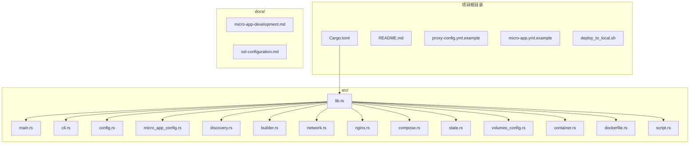
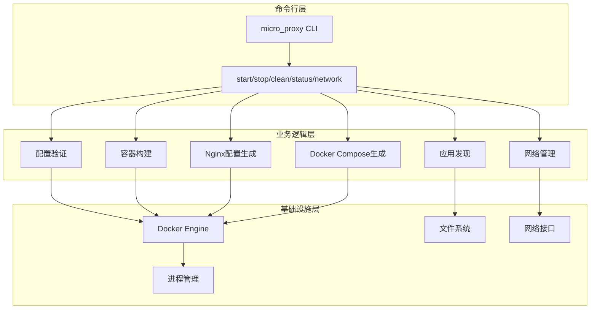
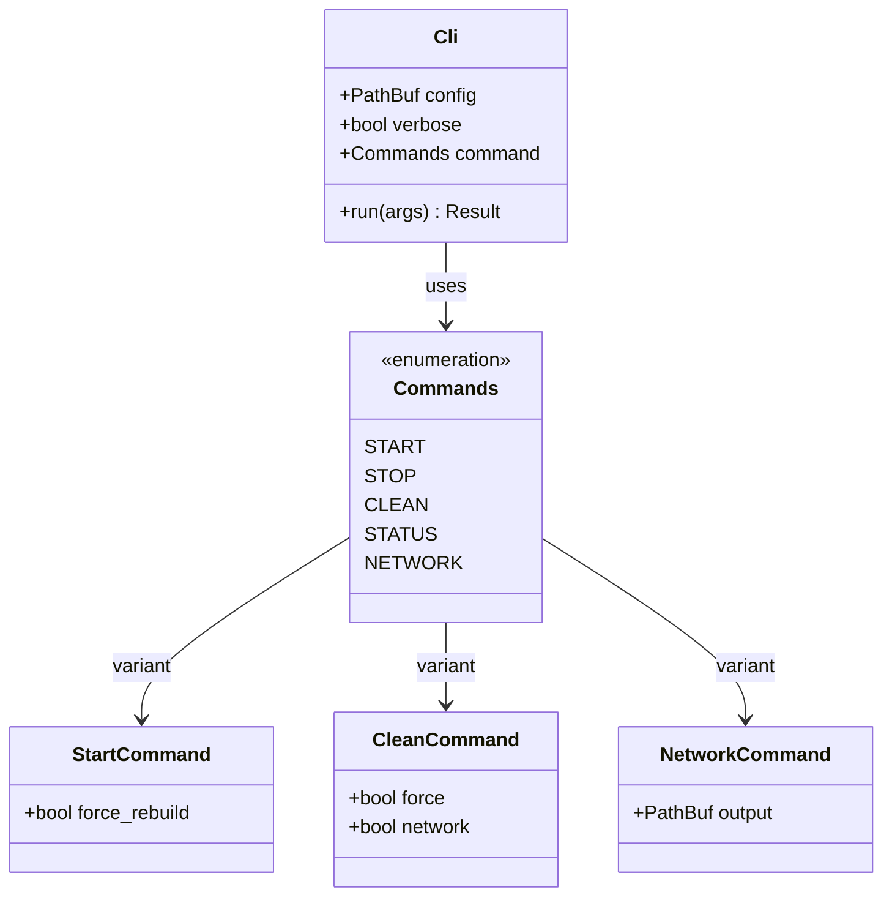
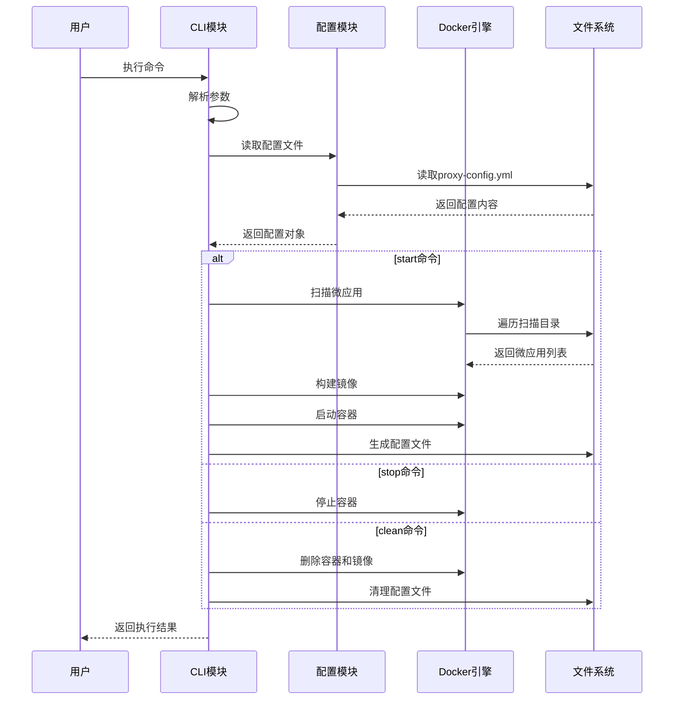
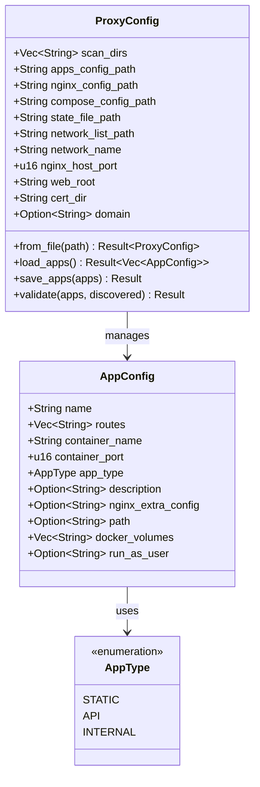
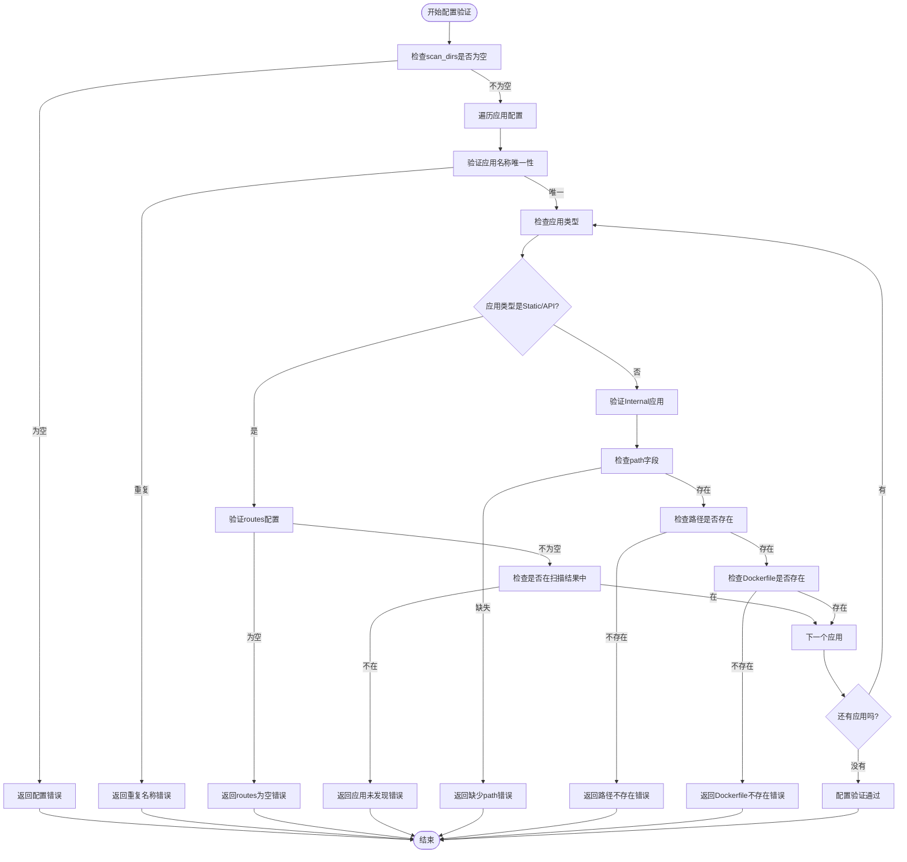
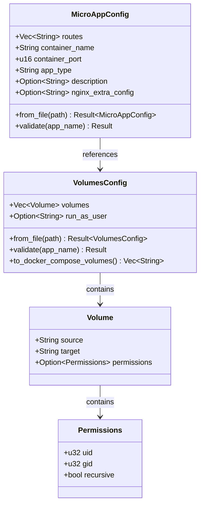
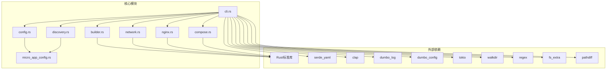

# 快速开始

<cite>
**本文引用的文件**
- [README.md](file://README.md)
- [proxy-config.yml.example](file://proxy-config.yml.example)
- [src/main.rs](file://src/main.rs)
- [src/cli.rs](file://src/cli.rs)
- [src/config.rs](file://src/config.rs)
- [src/micro_app_config.rs](file://src/micro_app_config.rs)
- [src/lib.rs](file://src/lib.rs)
- [Cargo.toml](file://Cargo.toml)
- [deploy_to_local.sh](file://deploy_to_local.sh)
- [docs/micro-app-development.md](file://docs/micro-app-development.md)
</cite>

## 目录
1. [简介](#简介)
2. [项目结构](#项目结构)
3. [核心组件](#核心组件)
4. [架构概览](#架构概览)
5. [详细组件分析](#详细组件分析)
6. [依赖关系分析](#依赖关系分析)
7. [性能考虑](#性能考虑)
8. [故障排查指南](#故障排查指南)
9. [结论](#结论)
10. [附录](#附录)

## 简介
micro_proxy 是一个用于管理微应用的工具，支持 Docker 镜像构建、容器管理、Nginx 反向代理配置等功能。它通过扫描指定目录自动发现包含 micro-app.yml 和 Dockerfile 的微应用，自动生成 docker-compose.yml 和 nginx.conf，统一管理 Docker 网络，支持微应用间通信，并提供状态管理、脚本支持、SSL 证书集成等能力。

## 项目结构
micro_proxy 采用模块化的 Rust 项目结构，主要包含以下关键目录和文件：
- src/: 核心源码模块，包含 CLI、配置管理、应用发现、容器管理、Nginx 配置生成等
- docs/: 详细文档，包含微应用开发指南、SSL 配置说明等
- proxy-config.yml.example: 主配置文件示例
- Cargo.toml: Rust 项目配置，定义依赖和元数据



**图表来源**
- [src/lib.rs:1-26](file://src/lib.rs#L1-L26)
- [src/main.rs:1-25](file://src/main.rs#L1-L25)
- [Cargo.toml:1-55](file://Cargo.toml#L1-L55)

**章节来源**
- [src/lib.rs:1-26](file://src/lib.rs#L1-L26)
- [Cargo.toml:1-55](file://Cargo.toml#L1-L55)

## 核心组件
micro_proxy 的核心组件包括命令行接口、配置管理、应用发现、容器构建、网络管理、Nginx 配置生成等模块。每个模块负责特定的功能领域，通过清晰的接口协作完成微应用的全生命周期管理。

### 命令行接口
CLI 模块提供统一的命令行界面，支持 start、stop、clean、status、network 等子命令，通过 clap 库实现参数解析和帮助信息展示。

### 配置管理
配置模块负责解析和验证 proxy-config.yml 主配置文件以及动态生成的 apps-config.yml 文件，支持应用类型验证、容器名称唯一性检查等。

### 应用发现
应用发现模块扫描指定目录，自动发现包含 micro-app.yml 和 Dockerfile 的微应用，生成微应用信息列表供后续处理。

### 容器构建与管理
容器构建模块负责 Docker 镜像构建、容器生命周期管理、Docker Compose 集成等功能，支持强制重建、状态跟踪等特性。

**章节来源**
- [src/cli.rs:1-669](file://src/cli.rs#L1-L669)
- [src/config.rs:1-842](file://src/config.rs#L1-L842)
- [src/micro_app_config.rs:1-153](file://src/micro_app_config.rs#L1-L153)

## 架构概览
micro_proxy 采用分层架构设计，从上到下分为命令行层、业务逻辑层、基础设施层。命令行层接收用户输入，业务逻辑层处理核心业务流程，基础设施层负责与 Docker、文件系统、网络等外部系统交互。



**图表来源**
- [src/cli.rs:78-116](file://src/cli.rs#L78-L116)
- [src/config.rs:178-367](file://src/config.rs#L178-L367)

## 详细组件分析

### 命令行接口组件分析
CLI 模块实现了完整的命令行交互功能，支持多种子命令和参数选项。



**图表来源**
- [src/cli.rs:21-69](file://src/cli.rs#L21-L69)

#### 命令执行流程
CLI 模块的执行流程遵循统一的模式：解析参数 → 初始化日志 → 读取配置 → 执行对应子命令 → 处理结果。



**图表来源**
- [src/cli.rs:78-116](file://src/cli.rs#L78-L116)
- [src/cli.rs:296-463](file://src/cli.rs#L296-L463)

**章节来源**
- [src/cli.rs:1-669](file://src/cli.rs#L1-L669)

### 配置管理组件分析
配置管理模块负责处理主配置文件和动态配置文件，提供配置验证、序列化/反序列化等功能。



**图表来源**
- [src/config.rs:125-367](file://src/config.rs#L125-L367)

#### 配置验证流程
配置验证模块确保所有配置项的有效性和一致性，包括扫描目录验证、应用名称唯一性检查、容器名称唯一性验证等。



**图表来源**
- [src/config.rs:220-347](file://src/config.rs#L220-L347)

**章节来源**
- [src/config.rs:1-842](file://src/config.rs#L1-L842)

### 微应用配置组件分析
微应用配置模块负责解析每个微应用目录下的 micro-app.yml 文件，提供配置验证和序列化功能。



**图表来源**
- [src/micro_app_config.rs:10-68](file://src/micro_app_config.rs#L10-L68)

**章节来源**
- [src/micro_app_config.rs:1-153](file://src/micro_app_config.rs#L1-L153)

## 依赖关系分析
micro_proxy 的依赖关系主要体现在模块间的耦合度和外部依赖上。核心模块之间保持低耦合高内聚的设计原则，通过清晰的接口进行交互。



**图表来源**
- [Cargo.toml:13-52](file://Cargo.toml#L13-L52)
- [src/lib.rs:6-18](file://src/lib.rs#L6-L18)

**章节来源**
- [Cargo.toml:1-55](file://Cargo.toml#L1-L55)
- [src/lib.rs:1-26](file://src/lib.rs#L1-L26)

## 性能考虑
micro_proxy 在设计时充分考虑了性能优化，主要体现在以下几个方面：

### 并发处理
- 使用 tokio 异步运行时处理并发任务
- 支持多微应用并行构建和启动
- 异步文件系统操作减少阻塞

### 状态管理
- 基于目录 hash 判断是否需要重新构建
- 状态文件持久化避免不必要的重复操作
- 智能缓存机制提升重复启动速度

### 资源优化
- Docker 镜像构建支持缓存利用
- 容器资源限制和优化
- 网络连接池管理

## 故障排查指南
本节提供常见问题的诊断和解决方案，帮助用户快速定位和解决问题。

### 环境准备问题
**问题**: 无法找到 cargo 命令
**解决方案**: 
- 确认已安装 Rust 工具链
- 检查 PATH 环境变量配置
- 重新加载 shell 配置文件

**问题**: Docker 服务未启动
**解决方案**:
- 确认 Docker 服务正在运行
- 检查用户权限是否包含 docker 组
- 重启 Docker 服务

### 配置文件问题
**问题**: proxy-config.yml 配置错误
**解决方案**:
- 检查 YAML 格式是否正确
- 验证必需字段是否完整
- 确认路径和端口配置合理

**问题**: micro-app.yml 配置无效
**解决方案**:
- 确认应用类型配置正确
- 检查容器名称是否全局唯一
- 验证端口映射配置

### 启动过程问题
**问题**: 容器启动失败
**解决方案**:
- 查看容器日志获取详细错误信息
- 检查 Dockerfile 构建是否成功
- 验证端口是否被占用

**问题**: Nginx 配置错误
**解决方案**:
- 检查 nginx.conf 语法
- 验证反向代理配置
- 确认 SSL 证书配置

### 网络连接问题
**问题**: 微应用间无法通信
**解决方案**:
- 检查 Docker 网络配置
- 验证容器名称和端口映射
- 使用 network 命令生成网络地址列表

**章节来源**
- [README.md:328-420](file://README.md#L328-L420)

## 结论
micro_proxy 提供了一个完整而强大的微应用管理解决方案，通过自动化配置生成、容器编排和网络管理，大大简化了微服务架构的部署和运维工作。其模块化设计、完善的错误处理和丰富的配置选项使其能够适应各种复杂的生产环境需求。

## 附录

### 快速开始指南
以下是一个完整的 10 分钟部署流程：

#### 第一步：环境准备
```bash
# 安装 Rust 工具链
curl --proto '=https' --tlsv1.2 -sSf https://sh.rustup.rs | sh

# 安装 Docker
sudo apt-get update
sudo apt-get install docker.io

# 启动 Docker 服务
sudo systemctl start docker
sudo systemctl enable docker
```

#### 第二步：安装 micro_proxy
```bash
# 方法1：从 crates.io 安装（推荐）
cargo install micro_proxy

# 方法2：从源码构建
git clone https://github.com/cao5zy/proxy-config
cd proxy-config
cargo build --release
cargo install --path .
```

#### 第三步：创建配置文件
```bash
# 复制示例配置文件
cp proxy-config.yml.example proxy-config.yml

# 编辑主配置文件，设置扫描目录
nano proxy-config.yml
```

#### 第四步：准备微应用
```bash
# 创建微应用目录结构
mkdir -p micro-apps/my-first-app
cd micro-apps/my-first-app

# 创建微应用配置文件
cp ../micro-app.yml.example micro-app.yml

# 创建 Dockerfile
cat > Dockerfile << EOF
FROM nginx:alpine
COPY . /usr/share/nginx/html
EXPOSE 80
CMD ["nginx", "-g", "daemon off;"]
EOF
```

#### 第五步：启动微应用
```bash
# 启动所有微应用
micro_proxy start

# 查看启动状态
micro_proxy status

# 查看网络地址
micro_proxy network
```

#### 第六步：验证安装
```bash
# 测试应用访问
curl http://localhost/

# 测试 API 访问
curl http://localhost/api

# 查看容器状态
docker ps

# 查看日志
micro_proxy status
```

### 常用命令参考
```bash
# 查看帮助
micro_proxy --help

# 启动微应用
micro_proxy start

# 强制重新构建
micro_proxy start --force-rebuild

# 显示详细日志
micro_proxy start -v

# 停止微应用
micro_proxy stop

# 清理微应用
micro_proxy clean

# 查看状态
micro_proxy status

# 查看网络地址
micro_proxy network
```

### 关键配置项说明

#### 主配置文件 (proxy-config.yml)
- **scan_dirs**: 扫描目录列表，用于自动发现微应用
- **nginx_host_port**: 宿主机端口，统一入口端口
- **network_name**: Docker 网络名称
- **web_root**: ACME 验证文件目录
- **cert_dir**: SSL 证书目录
- **domain**: 域名配置

#### 微应用配置文件 (micro-app.yml)
- **routes**: 访问路径配置
- **container_name**: 容器名称（全局唯一）
- **container_port**: 容器内部端口
- **app_type**: 应用类型（static, api, internal）
- **nginx_extra_config**: 额外的 Nginx 配置

**章节来源**
- [README.md:70-112](file://README.md#L70-L112)
- [proxy-config.yml.example:1-53](file://proxy-config.yml.example#L1-L53)
- [docs/micro-app-development.md:58-86](file://docs/micro-app-development.md#L58-L86)