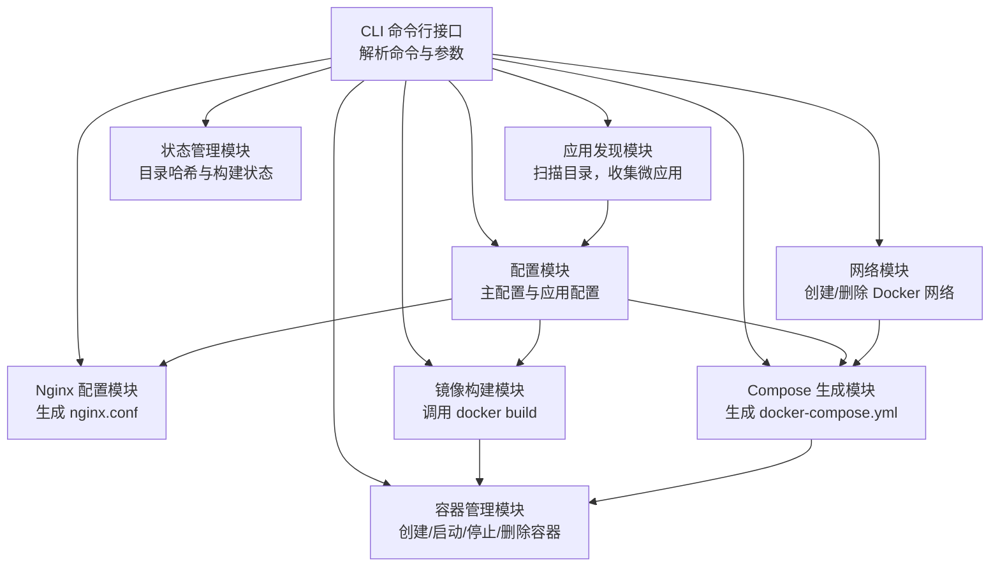
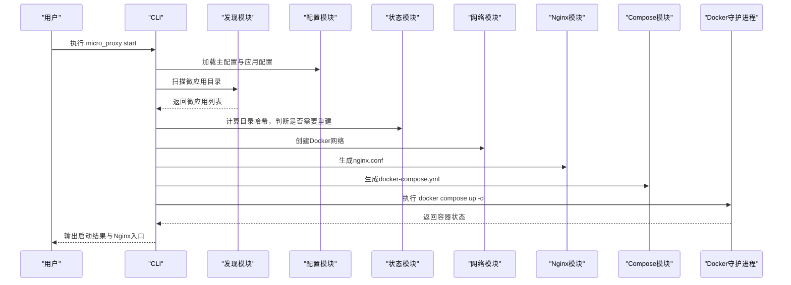
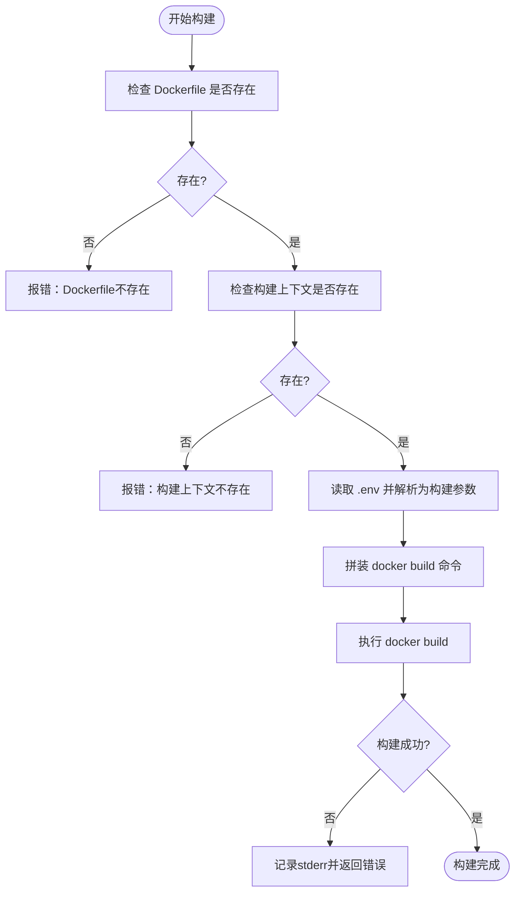
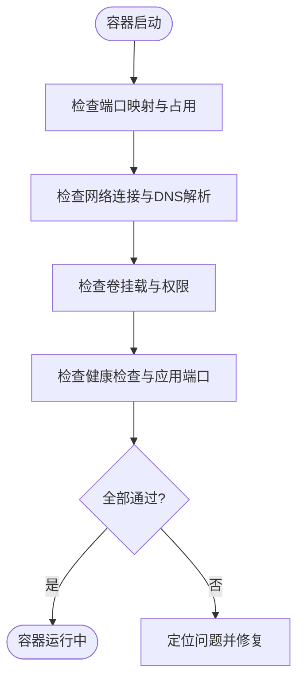
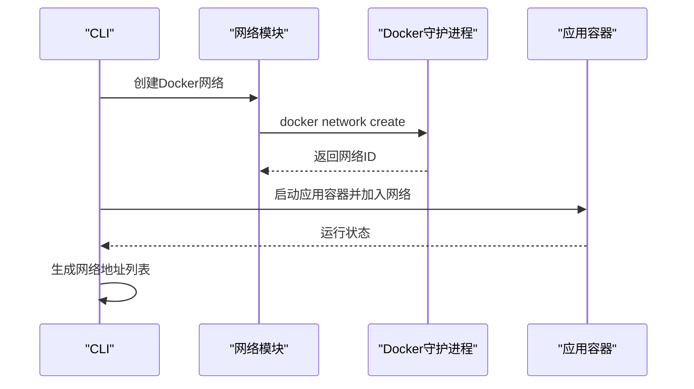
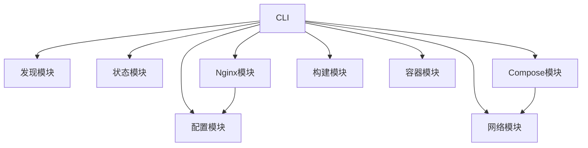

# Docker 问题排查

<cite>
**本文档引用的文件**
- [README.md](file://README.md)
- [lib.rs](file://src/lib.rs)
- [cli.rs](file://src/cli.rs)
- [config.rs](file://src/config.rs)
- [discovery.rs](file://src/discovery.rs)
- [builder.rs](file://src/builder.rs)
- [dockerfile.rs](file://src/dockerfile.rs)
- [container.rs](file://src/container.rs)
- [network.rs](file://src/network.rs)
- [compose.rs](file://src/compose.rs)
- [nginx.rs](file://src/nginx.rs)
- [state.rs](file://src/state.rs)
- [volumes_config.rs](file://src/volumes_config.rs)
- [error.rs](file://src/error.rs)
- [Cargo.toml](file://Cargo.toml)
</cite>

## 目录
1. [简介](#简介)
2. [项目结构](#项目结构)
3. [核心组件](#核心组件)
4. [架构总览](#架构总览)
5. [详细组件分析](#详细组件分析)
6. [依赖分析](#依赖分析)
7. [性能考虑](#性能考虑)
8. [故障排查指南](#故障排查指南)
9. [结论](#结论)
10. [附录](#附录)

## 简介
本指南围绕 Docker 相关问题的诊断与解决展开，结合项目中对 Docker 镜像构建、容器生命周期管理、网络与 Nginx 反向代理集成的实现，提供系统化的排查流程与优化建议。内容涵盖：
- Docker 守护进程连接问题
- 镜像构建失败的常见原因与修复步骤
- 容器启动失败的排查（端口冲突、资源限制、权限问题等）
- Docker 网络连接问题的诊断方法
- Docker 资源使用监控与优化
- 版本兼容性问题的解决方案
- 常用命令与故障排查命令集

## 项目结构
该项目是一个基于 Rust 的微应用管理工具，提供自动发现、镜像构建、容器编排、Nginx 反向代理与网络管理能力。其与 Docker 相关的关键模块如下：
- CLI 层：解析命令、协调各模块执行
- 配置层：主配置与应用配置解析
- 发现层：扫描微应用目录，收集微应用信息
- 构建层：调用 docker build 构建镜像
- 容器层：创建/启动/停止/删除容器
- 网络层：创建/删除 Docker 网络，生成网络地址列表
- Compose 层：生成 docker-compose.yml
- Nginx 层：生成 nginx.conf
- 状态层：记录目录哈希与构建状态
- 卷配置层：解析 micro-app.volumes.yml，生成权限初始化脚本

**图表来源**
- [cli.rs:118-170](file://src/cli.rs#L118-L170)
- [discovery.rs:235-352](file://src/discovery.rs#L235-L352)
- [config.rs:125-164](file://src/config.rs#L125-L164)
- [builder.rs:20-120](file://src/builder.rs#L20-L120)
- [container.rs:19-77](file://src/container.rs#L19-L77)
- [network.rs:15-47](file://src/network.rs#L15-L47)
- [compose.rs:31-119](file://src/compose.rs#L31-L119)
- [nginx.rs:26-92](file://src/nginx.rs#L26-L92)

**章节来源**
- [lib.rs:6-18](file://src/lib.rs#L6-L18)
- [Cargo.toml:1-55](file://Cargo.toml#L1-L55)

## 核心组件
- CLI：负责解析命令、初始化日志、加载配置、协调执行启动/停止/清理/状态/网络等子命令；在执行 docker-compose 命令时，优先尝试 docker compose，若失败则回退到 docker-compose。
- 配置模块：解析主配置与应用配置，校验扫描目录、应用名称唯一性、容器名称唯一性、Internal 应用路径与 Dockerfile 存在性等。
- 发现模块：扫描 scan_dirs 目录，发现包含 micro-app.yml 与 Dockerfile 的微应用，生成唯一应用名称，校验重复名称与容器名称。
- 构建模块：调用 docker build 构建镜像，支持禁用缓存、读取 .env 作为构建参数、检查 Dockerfile 与构建上下文存在性。
- 容器模块：封装 docker create/start/stop/rm/ps 等命令，捕获 stderr 并返回统一错误类型。
- 网络模块：封装 docker network create/rm/ls，精确匹配网络名称，生成网络地址列表文件。
- Compose 模块：生成 docker-compose.yml，包含网络外部引用、nginx 服务、各应用服务、健康检查、卷挂载、环境变量文件等。
- Nginx 模块：生成 nginx.conf，支持 HTTP/HTTPS、ACME 验证、动态 DNS 解析、location 路由规则、Gzip 与 SSL 优化。
- 状态模块：计算目录哈希，记录构建状态，决定是否需要重新构建。
- 卷配置模块：解析 micro-app.volumes.yml，校验 source/target 与权限配置，生成权限初始化脚本。

**章节来源**
- [cli.rs:78-116](file://src/cli.rs#L78-L116)
- [config.rs:220-347](file://src/config.rs#L220-L347)
- [discovery.rs:235-352](file://src/discovery.rs#L235-L352)
- [builder.rs:20-120](file://src/builder.rs#L20-L120)
- [container.rs:19-77](file://src/container.rs#L19-L77)
- [network.rs:15-47](file://src/network.rs#L15-L47)
- [compose.rs:31-119](file://src/compose.rs#L31-L119)
- [nginx.rs:26-92](file://src/nginx.rs#L26-L92)
- [state.rs:188-233](file://src/state.rs#L188-L233)
- [volumes_config.rs:55-82](file://src/volumes_config.rs#L55-L82)

## 架构总览
下图展示了从 CLI 到 Docker 的关键交互链路，以及与 Nginx、Compose 的协作关系：

**图表来源**
- [cli.rs:296-463](file://src/cli.rs#L296-L463)
- [discovery.rs:235-352](file://src/discovery.rs#L235-L352)
- [config.rs:220-347](file://src/config.rs#L220-L347)
- [state.rs:188-233](file://src/state.rs#L188-L233)
- [network.rs:15-47](file://src/network.rs#L15-L47)
- [nginx.rs:26-92](file://src/nginx.rs#L26-L92)
- [compose.rs:31-119](file://src/compose.rs#L31-L119)

## 详细组件分析

### Docker 守护进程连接问题
- 现象特征：执行 docker compose/docke build 等命令时报错，提示无法连接到 Docker 守护进程。
- 排查要点：
  - 确认 Docker 服务已启动且运行正常。
  - 检查当前用户是否属于 docker 用户组。
  - 检查 DOCKER_HOST 环境变量是否被错误设置。
  - 使用 docker version 验证客户端与守护进程版本兼容性。
- 项目中的体现：
  - CLI 在执行 docker compose 时，优先尝试 docker compose，失败后回退到 docker-compose，便于适配不同版本。
  - 容器/构建/网络模块均通过 Command::new("docker") 执行命令，错误输出会被捕获并记录到日志。

**章节来源**
- [cli.rs:127-170](file://src/cli.rs#L127-L170)
- [container.rs:59-73](file://src/container.rs#L59-L73)
- [builder.rs:96-109](file://src/builder.rs#L96-L109)
- [network.rs:30-43](file://src/network.rs#L30-L43)

### 镜像构建失败的常见原因与修复
- Dockerfile 语法错误
  - 现象：docker build 输出语法错误或指令不支持。
  - 修复：使用 dockerfile::parse_dockerfile 检测 EXPOSE 指令，确保 Dockerfile 结构正确；参考项目中对 EXPOSE 的解析逻辑进行对照。
- 依赖下载超时
  - 现象：构建阶段拉取基础镜像或依赖失败。
  - 修复：使用 --no-cache 参数强制重建；检查网络与代理；调整镜像源。
- 构建上下文或 Dockerfile 缺失
  - 现象：提示找不到 Dockerfile 或构建上下文不存在。
  - 修复：确认路径正确，Dockerfile 与构建上下文均存在。
- .env 作为构建参数
  - 现象：构建参数未生效。
  - 修复：确保 .env 文件存在且格式正确，构建时会读取并转换为 --build-arg。

**图表来源**
- [builder.rs:35-120](file://src/builder.rs#L35-L120)
- [dockerfile.rs:23-36](file://src/dockerfile.rs#L23-L36)

**章节来源**
- [builder.rs:20-120](file://src/builder.rs#L20-L120)
- [dockerfile.rs:16-79](file://src/dockerfile.rs#L16-L79)

### 容器启动失败排查
- 端口冲突
  - 现象：容器启动后立即退出或端口映射冲突。
  - 修复：修改 proxy-config.yml 中的 nginx_host_port；使用 lsof 检查宿主机端口占用。
- 资源限制
  - 现象：容器 OOM 或 CPU/内存受限导致异常。
  - 修复：检查宿主机资源与容器资源限制配置；必要时调整 Compose 中的资源设置。
- 权限问题
  - 现象：容器无法访问挂载卷或写入日志。
  - 修复：使用 volumes_config 生成权限初始化脚本，或在 Dockerfile 中设置合适的用户与权限。
- 健康检查失败
  - 现象：容器健康检查失败导致被重启。
  - 修复：检查应用内部端口与容器端口映射，确保健康检查路径可达。

**图表来源**
- [compose.rs:358-424](file://src/compose.rs#L358-L424)
- [volumes_config.rs:145-196](file://src/volumes_config.rs#L145-L196)

**章节来源**
- [compose.rs:268-424](file://src/compose.rs#L268-L424)
- [volumes_config.rs:84-143](file://src/volumes_config.rs#L84-L143)

### Docker 网络连接问题诊断
- 网络不存在或名称不匹配
  - 现象：容器无法通过网络名称访问其他服务。
  - 修复：使用 network_exists 精确匹配网络名称；确保 Compose 中网络为 external: true。
- DNS 解析异常
  - 现象：容器内无法解析服务名称。
  - 修复：Nginx 配置中使用 Docker 内部 DNS 解析器（127.0.0.11），并设置缓存与 IPv6 关闭。
- 网络地址列表
  - 现象：难以定位服务访问地址。
  - 修复：使用 micro_proxy network 生成网络地址列表文件，包含访问地址与微应用间通信示例。

**图表来源**
- [network.rs:15-47](file://src/network.rs#L15-L47)
- [compose.rs:54-69](file://src/compose.rs#L54-L69)

**章节来源**
- [network.rs:88-119](file://src/network.rs#L88-L119)
- [nginx.rs:187-190](file://src/nginx.rs#L187-L190)
- [compose.rs:54-69](file://src/compose.rs#L54-L69)

### Docker 资源使用监控与优化
- 监控建议：
  - 使用 docker stats 实时查看容器资源使用情况。
  - 结合宿主机系统监控（CPU/内存/磁盘/网络）定位瓶颈。
- 优化建议：
  - 合理设置镜像大小与层数，减少构建缓存失效。
  - 使用 .dockerignore 排除不必要的构建上下文文件。
  - 在 Compose 中为容器设置合理的 CPU/内存限制与重启策略。
  - 启用 Gzip 与静态资源缓存（Nginx 已内置优化）。

**章节来源**
- [nginx.rs:177-186](file://src/nginx.rs#L177-L186)
- [compose.rs:358-424](file://src/compose.rs#L358-L424)

### 版本兼容性问题
- docker compose 与 docker-compose
  - 现象：命令不存在或行为差异。
  - 修复：CLI 中优先尝试 docker compose，失败后回退到 docker-compose，提升兼容性。
- Docker 与守护进程版本
  - 现象：客户端与守护进程版本不兼容导致命令失败。
  - 修复：使用 docker version 检查版本；升级至兼容版本。

**章节来源**
- [cli.rs:127-170](file://src/cli.rs#L127-L170)

### Docker 相关命令与故障排查命令集
- 基础命令
  - docker version：检查客户端与守护进程版本
  - docker ps -a：查看所有容器状态
  - docker logs <container>：查看容器日志
  - docker inspect <container>：查看容器详细信息
  - docker stats：查看资源使用
- 网络命令
  - docker network ls：列出网络
  - docker network rm <network>：删除网络
  - docker exec <container> nslookup <service>：在容器内解析服务名
- 构建与镜像
  - docker images：查看镜像
  - docker rmi -f <image>：删除镜像
  - docker build -f <Dockerfile> -t <tag> .：构建镜像
- 项目内常用命令
  - micro_proxy start [-v/--verbose]：启动并显示详细日志
  - micro_proxy status：查看状态
  - micro_proxy network [-o/--output]：生成网络地址列表
  - micro_proxy clean [--force] [--network]：清理并可选删除网络

**章节来源**
- [README.md:330-420](file://README.md#L330-L420)
- [cli.rs:550-584](file://src/cli.rs#L550-L584)

## 依赖分析
- 外部依赖
  - docker：镜像构建、容器生命周期管理、网络管理
  - docker-compose：容器编排与服务编排
  - nginx：反向代理与负载均衡
- 内部模块耦合
  - CLI 依赖配置、发现、状态、网络、Nginx、Compose、构建、容器模块
  - Compose 依赖配置与网络模块，生成外部网络引用
  - Nginx 依赖配置与 SSL 证书检测
  - 容器/构建/网络模块均通过命令行调用 docker

**图表来源**
- [cli.rs:296-463](file://src/cli.rs#L296-L463)
- [compose.rs:31-119](file://src/compose.rs#L31-L119)
- [nginx.rs:26-92](file://src/nginx.rs#L26-L92)

**章节来源**
- [Cargo.toml:13-51](file://Cargo.toml#L13-L51)

## 性能考虑
- 构建性能
  - 使用 --no-cache 时会绕过缓存，但可解决缓存污染问题；日常开发建议启用缓存。
  - 合理拆分 Dockerfile 层，避免频繁变更导致缓存失效。
- 运行性能
  - Nginx 已启用 Gzip 与静态资源缓存；合理设置 keepalive 与 gzip 类型。
  - 为容器设置合理的 CPU/内存限制，避免资源争用。
- 网络性能
  - 使用 Docker 内部 DNS 解析器，减少解析延迟；禁用 IPv6 降低解析开销。

**章节来源**
- [builder.rs:61-65](file://src/builder.rs#L61-L65)
- [nginx.rs:177-186](file://src/nginx.rs#L177-L186)
- [compose.rs:358-424](file://src/compose.rs#L358-L424)

## 故障排查指南
- Docker 守护进程连接问题
  - 检查 Docker 服务状态与用户权限；确认 DOCKER_HOST；使用 docker version 验证版本。
- 镜像构建失败
  - 检查 Dockerfile 语法与 EXPOSE 指令；确认构建上下文与 Dockerfile 存在；使用 --no-cache 重建；核对 .env 构建参数。
- 容器启动失败
  - 端口冲突：修改 nginx_host_port；使用 lsof 检查占用；确保容器端口映射正确。
  - 资源限制：调整 Compose 资源限制；观察 docker stats。
  - 权限问题：使用 volumes_config 生成权限初始化脚本；在 Dockerfile 中设置合适用户。
  - 健康检查：确保应用端口可达；检查健康检查路径。
- 网络连接问题
  - 网络不存在：使用 network_exists 精确匹配；确保 external: true。
  - DNS 解析：检查 Nginx resolver 配置；在容器内使用 nslookup 验证。
- 资源使用
  - 使用 docker stats 与系统监控定位瓶颈；优化镜像与 Compose 配置。
- 版本兼容
  - 优先使用 docker compose，失败回退 docker-compose；确保版本兼容。

**章节来源**
- [cli.rs:127-170](file://src/cli.rs#L127-L170)
- [builder.rs:35-120](file://src/builder.rs#L35-L120)
- [container.rs:59-110](file://src/container.rs#L59-L110)
- [network.rs:88-119](file://src/network.rs#L88-L119)
- [nginx.rs:187-190](file://src/nginx.rs#L187-L190)
- [compose.rs:358-424](file://src/compose.rs#L358-L424)
- [volumes_config.rs:145-196](file://src/volumes_config.rs#L145-L196)

## 结论
本指南基于项目中对 Docker 的深度集成，提供了从 CLI 到守护进程、从镜像构建到容器运行、从网络管理到 Nginx 反向代理的全链路排查思路与优化建议。遵循本文档的流程与建议，可有效定位并解决大多数 Docker 相关问题，提升微应用系统的稳定性与可观测性。

## 附录
- 常用命令速查
  - micro_proxy start -v
  - micro_proxy status
  - micro_proxy network -o ./network-addresses.txt
  - docker logs <container>
  - docker stats
  - docker network ls
  - docker compose -f ./docker-compose.yml up -d

**章节来源**
- [README.md:330-420](file://README.md#L330-L420)