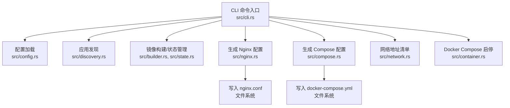
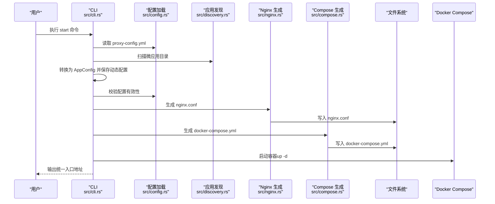
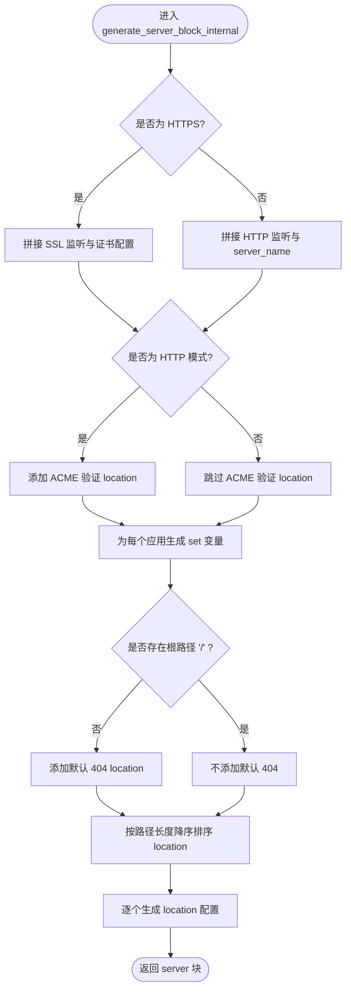
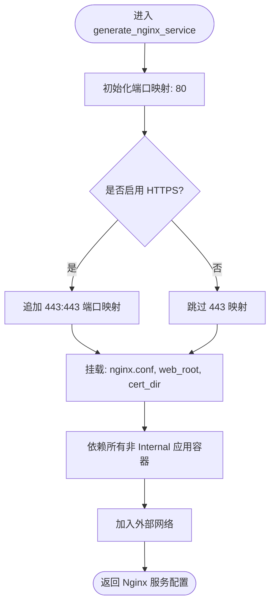

# Nginx 配置问题

<cite>
**本文引用的文件**
- [src/nginx.rs](file://src/nginx.rs)
- [src/config.rs](file://src/config.rs)
- [src/error.rs](file://src/error.rs)
- [src/cli.rs](file://src/cli.rs)
- [src/compose.rs](file://src/compose.rs)
- [README.md](file://README.md)
- [proxy-config.yml.example](file://proxy-config.yml.example)
- [Cargo.toml](file://Cargo.toml)
</cite>

## 目录
1. [简介](#简介)
2. [项目结构](#项目结构)
3. [核心组件](#核心组件)
4. [架构总览](#架构总览)
5. [详细组件分析](#详细组件分析)
6. [依赖分析](#依赖分析)
7. [性能考虑](#性能考虑)
8. [故障排查指南](#故障排查指南)
9. [结论](#结论)
10. [附录](#附录)

## 简介
本指南围绕 Nginx 配置生成与启动流程，结合代码库中的实现，系统讲解以下主题：
- Nginx 配置生成失败的原因与解决方法
- Nginx 启动失败的诊断流程（配置语法检查、端口占用、权限问题等）
- 反向代理配置错误的识别与修复
- SSL 证书配置问题排查（证书格式、有效期、域名匹配等）
- Nginx 性能问题的诊断与优化建议
- 常见 Nginx 错误信息的含义与解决方案
- Nginx 配置验证与测试方法

## 项目结构
该项目是一个基于 Rust 的微应用管理工具，负责自动发现微应用、生成 Docker Compose 与 Nginx 配置、启动容器并提供网络地址清单。与 Nginx 相关的关键模块如下：
- 配置生成：根据应用配置生成 nginx.conf
- Compose 生成：生成 docker-compose.yml，包含 Nginx 服务与端口映射
- CLI：提供 start/stop/status/network 等命令，串联上述流程
- 配置模型：ProxyConfig/AppConfig 等结构体定义配置项与校验规则
- 错误类型：统一的错误封装，便于定位问题来源

图表来源
- [src/cli.rs:296-463](file://src/cli.rs#L296-L463)
- [src/nginx.rs:26-92](file://src/nginx.rs#L26-L92)
- [src/compose.rs:31-119](file://src/compose.rs#L31-L119)

章节来源
- [src/cli.rs:78-116](file://src/cli.rs#L78-L116)
- [src/config.rs:125-164](file://src/config.rs#L125-L164)

## 核心组件
- Nginx 配置生成器：负责生成 nginx.conf，支持 HTTP/HTTPS、ACME 验证、动态 DNS 变量、location 排序与缓存策略等
- Compose 配置生成器：负责生成 docker-compose.yml，包含 Nginx 服务、端口映射、网络与挂载
- 配置模型与校验：ProxyConfig/AppConfig 定义配置项、默认值与有效性校验
- CLI 启动流程：从配置加载、应用发现、镜像构建、生成配置、启动容器到输出网络地址
- 错误类型：统一的 Error 枚举，便于区分配置、IO、Docker、Nginx 等错误类别

章节来源
- [src/nginx.rs:26-92](file://src/nginx.rs#L26-L92)
- [src/compose.rs:31-119](file://src/compose.rs#L31-L119)
- [src/config.rs:125-367](file://src/config.rs#L125-L367)
- [src/error.rs:6-46](file://src/error.rs#L6-L46)

## 架构总览
下图展示 Nginx 配置生成与启动的整体流程，以及与配置、发现、构建、容器编排的关系。

图表来源
- [src/cli.rs:296-463](file://src/cli.rs#L296-L463)
- [src/nginx.rs:413-422](file://src/nginx.rs#L413-L422)
- [src/compose.rs:413-434](file://src/compose.rs#L413-L434)

## 详细组件分析

### Nginx 配置生成器（src/nginx.rs）
- 功能要点
  - 生成 nginx.conf 头部（worker、events、http、gzip、resolver 等）
  - 根据 domain 与证书目录检测是否启用 HTTPS；若启用则生成 HTTP 重定向 server 块与 HTTPS server 块；否则仅生成 HTTP server 块
  - 为每个应用生成动态 DNS 变量（set 指令），避免硬编码上游主机名
  - location 按路径长度降序排序，确保具体路径优先级高于通用路径
  - 静态资源与 API 服务分别处理 URI 与缓存策略
  - ACME 验证 location 仅出现在 HTTP 块中（HTTPS 块由 HTTP 重定向块处理）

- 关键流程图（生成 server 块）

图表来源
- [src/nginx.rs:284-416](file://src/nginx.rs#L284-L416)

章节来源
- [src/nginx.rs:26-92](file://src/nginx.rs#L26-L92)
- [src/nginx.rs:146-195](file://src/nginx.rs#L146-L195)
- [src/nginx.rs:197-232](file://src/nginx.rs#L197-L232)
- [src/nginx.rs:234-270](file://src/nginx.rs#L234-L270)
- [src/nginx.rs:272-416](file://src/nginx.rs#L272-L416)
- [src/nginx.rs:538-556](file://src/nginx.rs#L538-L556)

### Compose 配置生成器（src/compose.rs）
- 功能要点
  - 生成 docker-compose.yml，包含外部网络声明（避免项目名前缀）、Nginx 服务与各应用服务
  - 根据 domain 与证书目录检测是否启用 HTTPS，决定端口映射（HTTP 80 或 HTTP 80+HTTPS 443）
  - Nginx 服务挂载 nginx.conf、web_root、cert_dir，不包含应用 volumes
  - 服务间通过同一 Docker 网络互通

- 关键流程图（生成 Nginx 服务）

图表来源
- [src/compose.rs:172-219](file://src/compose.rs#L172-L219)

章节来源
- [src/compose.rs:31-119](file://src/compose.rs#L31-L119)
- [src/compose.rs:121-158](file://src/compose.rs#L121-L158)
- [src/compose.rs:172-219](file://src/compose.rs#L172-L219)

### 配置模型与校验（src/config.rs）
- ProxyConfig
  - 定义扫描目录、动态 apps 配置路径、Nginx/Compose/状态/网络地址输出路径、Docker 网络名、主机端口、web_root、cert_dir、domain 等
  - 提供 from_file/load_apps/save_apps/validate 等方法
- AppConfig
  - 定义应用名称、路由、容器名、容器端口、应用类型（Static/Api/Internal）、额外 Nginx 配置、路径、volumes、运行用户等
  - validate 校验扫描目录、应用名称唯一性、Static/Api 路由非空、Internal 路径存在与 Dockerfile 存在、routes 与 nginx_extra_config 的忽略行为等

章节来源
- [src/config.rs:125-367](file://src/config.rs#L125-L367)

### CLI 启动流程（src/cli.rs）
- start 命令
  - 加载配置、扫描微应用、转换为 AppConfig 并保存动态配置
  - 校验配置有效性
  - 创建 Docker 网络
  - 遍历应用：解析 Dockerfile、计算目录哈希、必要时执行 setup 脚本与构建镜像、更新状态
  - 生成 nginx.conf 与 docker-compose.yml
  - 生成网络地址列表
  - 停止并删除现有容器，再启动容器
- 其他命令：stop/clean/status/network

章节来源
- [src/cli.rs:296-463](file://src/cli.rs#L296-L463)

## 依赖分析
- 语言与框架
  - Rust 生态：clap（命令行）、serde/serde_yaml（序列化）、chrono/pathdiff（时间与路径）、tokio（异步）、walkdir/fs_extra（文件系统）、regex（正则）、dumbo_log（日志）
- 外部工具
  - Docker 与 docker-compose（容器编排）
  - acme.sh（可选，用于 Let's Encrypt 证书申请与续期）

章节来源
- [Cargo.toml:13-55](file://Cargo.toml#L13-L55)

## 性能考虑
- DNS 解析优化
  - 使用 Docker 内部 DNS 解析器，设置缓存与禁用 IPv6，减少解析延迟
- 连接与传输
  - 启用 sendfile、tcp_nopush、tcp_nodelay、keepalive_timeout，提升连接复用与传输效率
  - 启用 gzip 并限定压缩类型，平衡 CPU 与带宽
- 动态上游变量
  - 通过 set 变量与容器名解析，避免硬编码上游主机，提升弹性与可维护性
- location 排序
  - 按路径长度降序排序，确保精确匹配优先，减少不必要的匹配开销

章节来源
- [src/nginx.rs:146-195](file://src/nginx.rs#L146-L195)
- [src/nginx.rs:396-401](file://src/nginx.rs#L396-L401)

## 故障排查指南

### 一、Nginx 配置生成失败
- 常见原因
  - 配置文件缺失或格式错误（proxy-config.yml、apps-config.yml）
  - 应用配置不合法（名称重复、Static/Api 路由为空、Internal 缺少 path/Dockerfile）
  - 证书目录与域名不匹配（domain 存在但证书文件不存在）
  - web_root/cert_dir 权限不足或路径不存在
- 定位方法
  - 启用详细日志：micro_proxy start -v
  - 检查配置加载与校验输出
  - 检查 apps-config.yml 是否生成
  - 检查 nginx.conf 是否写入成功
- 解决方案
  - 修正 proxy-config.yml 与 micro-app.yml
  - 确保 domain 与证书文件命名一致（{domain}.crt/.cer 与 {domain}.key）
  - 确保 web_root/cert_dir 目录存在且可写
  - 重新执行 start 命令

章节来源
- [src/config.rs:220-347](file://src/config.rs#L220-L347)
- [src/nginx.rs:538-556](file://src/nginx.rs#L538-L556)
- [src/error.rs:6-46](file://src/error.rs#L6-L46)

### 二、Nginx 启动失败
- 常见原因
  - 配置语法错误（nginx -t）
  - 端口占用（80/443）
  - 权限问题（web_root/cert_dir 挂载权限）
  - 证书文件缺失或格式不正确
- 诊断步骤
  - 进入容器查看 Nginx 日志：docker logs proxy-nginx
  - 在容器内验证配置：docker exec proxy-nginx nginx -t
  - 检查端口占用：sudo lsof -i :80 / sudo lsof -i :443
  - 检查证书与密钥文件是否存在且可读
- 解决方案
  - 修复 nginx.conf 语法错误
  - 更改 proxy-config.yml 中的 nginx_host_port 或释放宿主机端口
  - 修正证书文件路径与权限，确保容器内可读
  - 重新生成并应用配置

章节来源
- [README.md:387-401](file://README.md#L387-L401)
- [src/compose.rs:121-158](file://src/compose.rs#L121-L158)

### 三、反向代理配置错误
- 常见症状
  - 访问 404（未配置根路径 '/'）
  - 静态资源路径重写异常（子路径 /app 未正确转发到后端根）
  - API 请求路径被错误截断或附加尾随斜杠
- 识别与修复
  - 检查 location 顺序：具体路径应排在通用路径之前
  - 静态资源应用：根路径直接转发，子路径使用 rewrite 将 /app 重写为 /
  - API 应用：保持原始 URI，不添加尾随斜杠
  - 确认上游变量 set 指令与 proxy_pass 使用一致
- 验证方法
  - curl 访问各路由，观察响应状态与后端日志
  - 查看生成的 nginx.conf 中 location 与 proxy_pass

章节来源
- [src/nginx.rs:396-401](file://src/nginx.rs#L396-L401)
- [src/nginx.rs:418-536](file://src/nginx.rs#L418-L536)

### 四、SSL 证书配置问题
- 常见问题
  - 证书文件命名不匹配（缺少 .crt/.cer 或 .key）
  - 证书与密钥不对应（域名不一致）
  - 证书过期或即将过期
  - 域名与证书不匹配（SAN 或 CN 不包含访问域名）
  - web_root 未正确挂载导致 ACME 验证失败
- 排查步骤
  - 确认 domain 与证书文件名一致
  - 使用 acme.sh 查看证书信息与有效期
  - 验证 web_root 下的 .well-known/acme-challenge/ 是否可访问
  - 在容器内执行 nginx -t 检查 SSL 配置
- 解决方案
  - 使用 acme.sh 重新申请并安装证书
  - 确保 cert_dir 与 web_root 正确挂载到容器
  - 修正证书与密钥文件权限与属主

章节来源
- [src/nginx.rs:94-131](file://src/nginx.rs#L94-L131)
- [src/compose.rs:121-158](file://src/compose.rs#L121-L158)
- [README.md:237-276](file://README.md#L237-L276)

### 五、性能问题诊断与优化
- 常见表现
  - 响应缓慢、并发连接数低、CPU 占用高
- 诊断方法
  - 查看 Nginx 访问/错误日志
  - 使用 ab/wrk 压测不同场景（静态资源 vs API）
  - 检查 gzip 压缩效果与类型
  - 观察 DNS 解析耗时与上游连接超时
- 优化建议
  - 合理设置 worker_processes 与 worker_connections
  - 启用 keepalive 与合理的超时参数
  - 优化 gzip 类型与级别
  - 使用上游变量与容器网络，减少跨主机延迟

章节来源
- [src/nginx.rs:146-195](file://src/nginx.rs#L146-L195)

### 六、常见错误信息与解决方案
- 配置错误
  - 描述：scan_dirs 为空、应用名称重复、Static/Api 路由为空、Internal 缺少 path/Dockerfile
  - 解决：修正 proxy-config.yml 与 micro-app.yml
- IO 错误
  - 描述：写入 nginx.conf/docker-compose.yml 失败
  - 解决：检查输出路径权限与磁盘空间
- Docker 错误
  - 描述：docker-compose 命令不可用或执行失败
  - 解决：安装 docker-compose 或使用 docker compose
- Nginx 配置错误
  - 描述：nginx -t 报错
  - 解决：修复语法错误（location/server_name/ssl 配置等）

章节来源
- [src/error.rs:6-46](file://src/error.rs#L6-L46)
- [src/nginx.rs:538-556](file://src/nginx.rs#L538-L556)
- [src/cli.rs:118-170](file://src/cli.rs#L118-L170)

### 七、配置验证与测试方法
- 配置验证
  - 使用 micro_proxy start -v 查看详细日志
  - 校验 apps-config.yml 与 proxy-config.yml 的一致性
- Nginx 配置测试
  - 在容器内执行 nginx -t
  - 使用 curl 验证各路由与 ACME 验证路径
- 端到端测试
  - 访问统一入口（http://localhost:{nginx_host_port}）
  - 验证静态资源、API、ACME 验证路径均正常

章节来源
- [README.md:328-420](file://README.md#L328-L420)
- [src/nginx.rs:538-556](file://src/nginx.rs#L538-L556)

## 结论
本指南基于代码库中的实现，系统梳理了 Nginx 配置生成与启动的关键流程、常见问题与解决方法。通过严格配置校验、动态 DNS 变量、ACME 验证与合理的性能优化，可显著降低 Nginx 配置与启动失败的概率。建议在生产环境中：
- 使用自动化流程生成与验证配置
- 定期检查证书有效期与权限
- 通过压测与日志监控持续优化性能

## 附录

### A. 关键配置项说明
- proxy-config.yml
  - scan_dirs：扫描微应用目录
  - nginx_host_port：宿主机端口映射
  - web_root：ACME 验证目录
  - cert_dir：证书目录
  - domain：域名（可选）
- micro-app.yml
  - routes：静态/API 应用的访问路径
  - container_name：容器名（全局唯一）
  - container_port：容器内部端口
  - app_type：应用类型（static/api/internal）
  - docker_volumes：卷挂载（可选）
  - nginx_extra_config：额外 Nginx 配置（可选）

章节来源
- [proxy-config.yml.example:5-53](file://proxy-config.yml.example#L5-L53)
- [src/config.rs:24-68](file://src/config.rs#L24-L68)