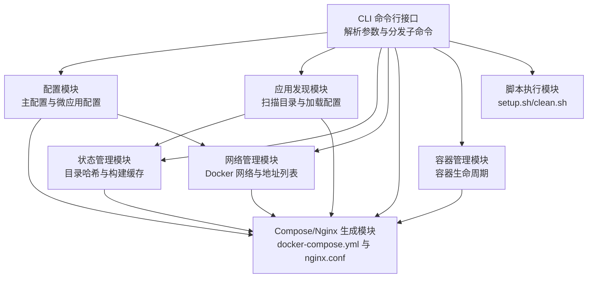
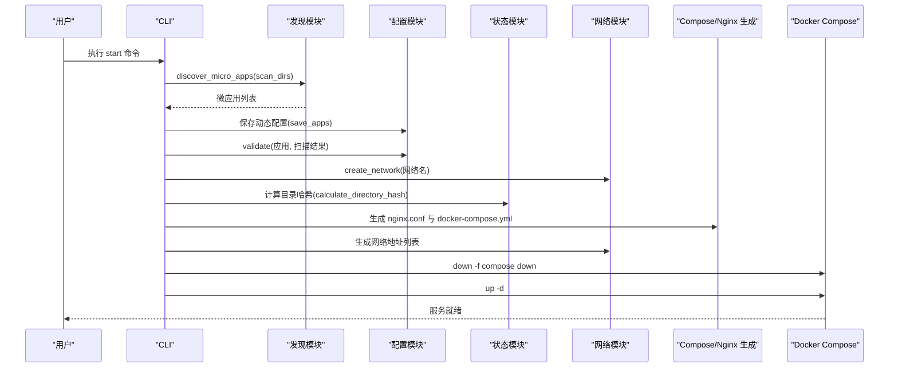
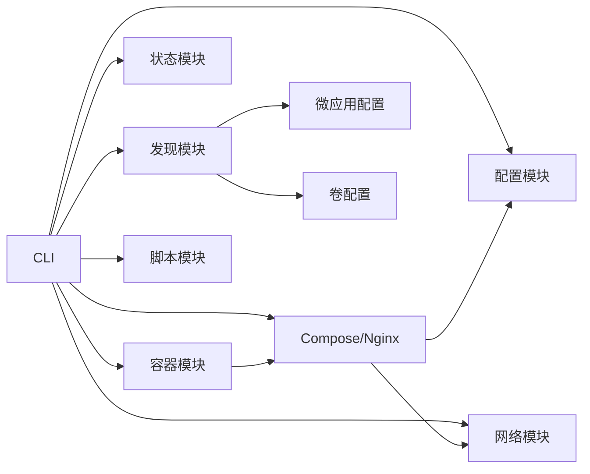

# 常见问题

<cite>
**本文引用的文件**
- [README.md](file://README.md)
- [proxy-config.yml.example](file://proxy-config.yml.example)
- [src/main.rs](file://src/main.rs)
- [src/error.rs](file://src/error.rs)
- [src/config.rs](file://src/config.rs)
- [src/discovery.rs](file://src/discovery.rs)
- [src/cli.rs](file://src/cli.rs)
- [src/dockerfile.rs](file://src/dockerfile.rs)
- [src/compose.rs](file://src/compose.rs)
- [src/container.rs](file://src/container.rs)
- [src/state.rs](file://src/state.rs)
- [src/network.rs](file://src/network.rs)
- [src/micro_app_config.rs](file://src/micro_app_config.rs)
- [src/volumes_config.rs](file://src/volumes_config.rs)
- [src/script.rs](file://src/script.rs)
</cite>

## 目录
1. [简介](#简介)
2. [项目结构](#项目结构)
3. [核心组件](#核心组件)
4. [架构总览](#架构总览)
5. [详细组件分析](#详细组件分析)
6. [依赖分析](#依赖分析)
7. [性能考虑](#性能考虑)
8. [故障排查指南](#故障排查指南)
9. [结论](#结论)
10. [附录](#附录)

## 简介
本文件面向使用 micro_proxy 的用户，系统整理常见问题类型与解决方案，覆盖配置文件错误、Docker 构建失败、容器启动异常、微应用发现失败、权限问题、端口占用等典型场景。文档提供症状描述、可能原因分析、具体解决步骤以及快速定位检查清单，帮助用户高效定位并解决问题。

## 项目结构
micro_proxy 采用模块化设计，围绕“配置解析—应用发现—状态管理—Docker Compose/Nginx 生成—容器编排”流程组织代码。关键模块职责如下：
- CLI：命令行入口与子命令分发
- 配置：主配置与微应用配置解析与校验
- 发现：扫描目录、加载 micro-app.yml 与 Dockerfile，生成微应用信息
- 状态：目录哈希计算与镜像构建缓存
- 网络：Docker 网络创建与网络地址列表生成
- Compose：生成 docker-compose.yml 与 Nginx 配置
- 容器：容器生命周期管理（启动/停止/删除/状态查询）
- 脚本：执行 setup.sh/clean.sh
- 错误：统一错误类型与错误消息

图示来源
- [src/cli.rs:71-116](file://src/cli.rs#L71-L116)
- [src/config.rs:125-164](file://src/config.rs#L125-L164)
- [src/discovery.rs:224-352](file://src/discovery.rs#L224-L352)
- [src/state.rs:188-233](file://src/state.rs#L188-L233)
- [src/network.rs:8-47](file://src/network.rs#L8-L47)
- [src/compose.rs:18-119](file://src/compose.rs#L18-L119)
- [src/container.rs:8-77](file://src/container.rs#L8-L77)
- [src/script.rs:9-62](file://src/script.rs#L9-L62)

章节来源
- [README.md:421-441](file://README.md#L421-L441)

## 核心组件
- 错误类型：集中定义了配置、IO、YAML、Docker、脚本、网络、发现、构建、容器、状态、Dockerfile、Nginx、Compose 等错误类型，便于统一处理与定位问题。
- 配置校验：对主配置与微应用配置进行严格校验，包括必填字段、类型合法性、唯一性、路径存在性等。
- 应用发现：扫描 scan_dirs，要求同时包含 micro-app.yml 与 Dockerfile 的目录才视为有效微应用；校验应用名称与容器名称唯一性。
- 状态与缓存：基于目录哈希判断是否需要重新构建，避免不必要的重复构建。
- 网络与地址：创建外部网络，生成网络地址列表，辅助连通性排查。
- Compose/Nginx：根据应用类型与配置生成 docker-compose.yml 与 nginx.conf，支持 HTTPS 与静态/API 内容。

章节来源
- [src/error.rs:5-46](file://src/error.rs#L5-L46)
- [src/config.rs:220-347](file://src/config.rs#L220-L347)
- [src/discovery.rs:235-352](file://src/discovery.rs#L235-L352)
- [src/state.rs:188-233](file://src/state.rs#L188-L233)
- [src/network.rs:8-47](file://src/network.rs#L8-L47)
- [src/compose.rs:18-119](file://src/compose.rs#L18-L119)

## 架构总览
启动流程概览：CLI 接收 start 命令 → 扫描微应用 → 保存动态配置 → 校验配置 → 创建 Docker 网络 → 计算目录哈希 → 生成 Nginx/Compose 配置 → 生成网络地址列表 → down 旧容器 → up 新容器。

图示来源
- [src/cli.rs:296-463](file://src/cli.rs#L296-L463)
- [src/discovery.rs:235-352](file://src/discovery.rs#L235-L352)
- [src/config.rs:205-218](file://src/config.rs#L205-L218)
- [src/state.rs:188-233](file://src/state.rs#L188-L233)
- [src/network.rs:8-47](file://src/network.rs#L8-L47)
- [src/compose.rs:18-119](file://src/compose.rs#L18-L119)

## 详细组件分析

### 配置文件错误
- 症状
  - 启动时报“配置文件读取失败/解析失败”
  - 校验阶段报“scan_dirs 不能为空”“重复的应用名称”“Internal 应用缺少 path 字段”等
- 可能原因
  - proxy-config.yml 或 apps-config.yml 路径错误、权限不足、YAML 格式错误
  - micro-app.yml 缺少必填字段（如 container_name、container_port、app_type、routes）
  - 应用名称或容器名称重复
  - Internal 类型应用未提供 path 且目录中缺少 Dockerfile
- 解决步骤
  - 确认 proxy-config.yml 路径正确，必要时使用 -c 指定
  - 使用 YAML 校验工具检查格式
  - 按照配置说明补齐必填字段，确保名称唯一
  - Internal 类型必须提供 path 且该目录包含 Dockerfile
- 快速检查清单
  - scan_dirs 是否存在且非空
  - 每个微应用的 micro-app.yml 是否存在且格式正确
  - 应用名称与容器名称是否全局唯一
  - Internal 应用是否提供 path 且 Dockerfile 存在

章节来源
- [src/config.rs:178-219](file://src/config.rs#L178-L219)
- [src/config.rs:220-347](file://src/config.rs#L220-L347)
- [src/micro_app_config.rs:55-106](file://src/micro_app_config.rs#L55-L106)
- [src/discovery.rs:288-352](file://src/discovery.rs#L288-L352)

### Docker 构建失败
- 症状
  - 构建阶段报“Dockerfile 读取失败/解析失败”
  - 容器启动后立即退出或健康检查失败
- 可能原因
  - Dockerfile 缺少 EXPOSE 指令或端口不匹配
  - 容器内部端口与 micro-app.yml 的 container_port 不一致
  - 构建上下文或 .env 传参与镜像期望不符
- 解决步骤
  - 确认 Dockerfile 中包含 EXPOSE 指令并列出容器实际监听端口
  - 确保 micro-app.yml 的 container_port 与容器内部端口一致
  - 如需传递环境变量，确保 .env 文件存在且路径正确
- 快速检查清单
  - Dockerfile 是否包含 EXPOSE
  - micro-app.yml 的 container_port 是否与容器内部一致
  - .env 是否存在且路径可被 Compose 正确引用

章节来源
- [src/dockerfile.rs:23-67](file://src/dockerfile.rs#L23-L67)
- [src/cli.rs:344-380](file://src/cli.rs#L344-L380)

### 容器启动异常
- 症状
  - 容器启动后很快退出
  - 健康检查失败
  - 无法通过 Nginx 访问
- 可能原因
  - 容器内部进程未正确监听端口
  - Nginx 未正确代理到目标容器
  - 端口映射冲突或宿主机端口被占用
- 解决步骤
  - 查看容器日志与健康检查状态
  - 检查 Nginx 配置是否生成正确
  - 修改 proxy-config.yml 的 nginx_host_port 或释放占用端口
- 快速检查清单
  - docker logs <容器名>
  - docker ps -a 与 docker ps
  - nginx.conf 是否包含对应 upstream/upstream 端口
  - 宿主机端口是否被占用

章节来源
- [src/container.rs:178-242](file://src/container.rs#L178-L242)
- [src/compose.rs:160-266](file://src/compose.rs#L160-L266)
- [src/network.rs:209-274](file://src/network.rs#L209-L274)

### 微应用发现失败
- 症状
  - 启动时报“未在扫描目录中找到应用”“重复的微应用名称”“重复的容器名称”
- 可能原因
  - scan_dirs 指定的目录不存在或未包含 micro-app.yml 与 Dockerfile
  - 目录名称或生成的应用名称重复
  - 多个微应用使用了相同的 container_name
- 解决步骤
  - 确认 scan_dirs 下的每个子目录均包含 micro-app.yml 与 Dockerfile
  - 修改重复的目录名或重命名应用，确保名称唯一
  - 更改重复的 container_name
- 快速检查清单
  - scan_dirs 是否存在且可读
  - 每个微应用目录是否包含 micro-app.yml 与 Dockerfile
  - 应用名称与容器名称是否唯一

章节来源
- [src/discovery.rs:235-352](file://src/discovery.rs#L235-L352)
- [src/config.rs:220-347](file://src/config.rs#L220-L347)

### 权限问题
- 症状
  - 卷挂载后容器内文件属主异常，导致读写失败
  - 容器启动后因权限不足而退出
- 可能原因
  - 卷源路径权限不足或属主为 root
  - 未设置 run_as_user 或权限配置不当
- 解决步骤
  - 使用 micro-app.volumes.yml 配置卷权限（uid/gid/recursive）
  - 设置 run_as_user 指定容器内运行用户
  - 若需要，生成权限初始化脚本并在构建阶段执行
- 快速检查清单
  - micro-app.volumes.yml 是否配置 volumes 与 permissions
  - run_as_user 是否符合预期
  - 宿主机路径是否存在且权限合理

章节来源
- [src/volumes_config.rs:84-143](file://src/volumes_config.rs#L84-L143)
- [src/compose.rs:268-424](file://src/compose.rs#L268-L424)

### 端口占用
- 症状
  - 启动时报端口映射失败或 Nginx 无法监听
- 可能原因
  - 宿主机端口（如 80/443）被其他进程占用
- 解决步骤
  - 释放占用端口或修改 proxy-config.yml 的 nginx_host_port
  - 使用 lsof/netstat 检查端口占用
- 快速检查清单
  - sudo lsof -i :80 / sudo lsof -i :443 / sudo lsof -i :nginx_host_port
  - 修改 nginx_host_port 并重新启动

章节来源
- [README.md:363-372](file://README.md#L363-L372)
- [src/compose.rs:199-208](file://src/compose.rs#L199-L208)

### SSL 证书相关问题
- 症状
  - HTTPS 无法访问或 Nginx 报 SSL 错误
- 可能原因
  - 证书文件缺失或路径不正确
  - 未配置 domain 导致未启用 HTTPS
- 解决步骤
  - 确认 cert_dir 下存在证书与密钥文件
  - 配置 domain 并确保 web_root 可写
  - 使用 docker exec proxy-nginx nginx -t 验证配置
- 快速检查清单
  - 证书与密钥文件是否存在
  - domain 是否配置
  - nginx -t 是否通过

章节来源
- [README.md:387-401](file://README.md#L387-L401)
- [src/compose.rs:121-158](file://src/compose.rs#L121-L158)

### 状态与缓存问题
- 症状
  - 频繁重新构建镜像或状态文件损坏
- 可能原因
  - 状态文件损坏或路径错误
  - 目录哈希计算异常
- 解决步骤
  - 删除 proxy-config.state 后重新启动
  - 检查状态文件读写权限
- 快速检查清单
  - 状态文件是否存在且可读写
  - 目录变更后是否触发重新构建

章节来源
- [src/state.rs:58-113](file://src/state.rs#L58-L113)
- [src/state.rs:188-233](file://src/state.rs#L188-L233)

## 依赖分析
- 组件耦合
  - CLI 依赖配置、发现、状态、网络、Compose、容器、脚本模块
  - 配置模块依赖 YAML 解析与校验
  - 发现模块依赖微应用配置与卷配置
  - Compose 模块依赖配置与网络信息
- 外部依赖
  - Docker 与 docker-compose 命令
  - Nginx 配置与证书目录
  - 文件系统权限与端口占用

图示来源
- [src/cli.rs:71-116](file://src/cli.rs#L71-L116)
- [src/discovery.rs:12-38](file://src/discovery.rs#L12-L38)
- [src/micro_app_config.rs:10-33](file://src/micro_app_config.rs#L10-L33)
- [src/volumes_config.rs:43-53](file://src/volumes_config.rs#L43-L53)
- [src/compose.rs:18-119](file://src/compose.rs#L18-L119)

## 性能考虑
- 目录哈希计算：仅在目录内容变化时触发重新构建，减少不必要的镜像构建
- 健康检查：静态与 API 应用自动添加健康检查，提升可用性
- 网络复用：使用外部网络避免重复创建，提高启动效率

## 故障排查指南
- 基础检查
  - 使用 -v 参数查看详细日志
  - 使用 micro_proxy status 查看容器与镜像状态
  - 使用 micro_proxy network 生成网络地址列表
- 常见命令
  - 查看容器日志：docker logs <容器名>
  - 查看 Nginx 日志：docker logs proxy-nginx
  - 验证 Nginx 配置：docker exec proxy-nginx nginx -t
- 快速定位清单
  - 配置文件：proxy-config.yml 与 apps-config.yml 是否存在且可读
  - 微应用：scan_dirs 下是否包含 micro-app.yml 与 Dockerfile
  - 端口：nginx_host_port 是否被占用
  - 权限：卷源路径与 run_as_user 是否合理
  - SSL：cert_dir 与 domain 是否配置正确

章节来源
- [README.md:328-420](file://README.md#L328-L420)
- [src/cli.rs:550-636](file://src/cli.rs#L550-L636)

## 结论
通过系统化的配置校验、应用发现、状态缓存与网络/Compose 生成，micro_proxy 能够稳定地管理微应用的全生命周期。遇到问题时，建议按照“配置—发现—构建—网络—容器—日志”的顺序逐步排查，并结合本文提供的检查清单与步骤快速定位与修复。

## 附录
- 常用命令参考
  - 启动：micro_proxy start [-c 配置文件] [--force-rebuild]
  - 停止：micro_proxy stop [-c 配置文件]
  - 清理：micro_proxy clean [-c 配置文件] [--force] [--network]
  - 状态：micro_proxy status [-c 配置文件]
  - 网络：micro_proxy network [-c 配置文件] [-o 输出文件]
- 配置文件示例
  - 主配置：proxy-config.yml.example
  - 微应用配置：micro-app.yml（位于每个微应用目录）

章节来源
- [README.md:113-163](file://README.md#L113-L163)
- [proxy-config.yml.example:1-53](file://proxy-config.yml.example#L1-L53)