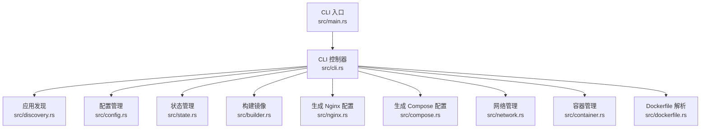
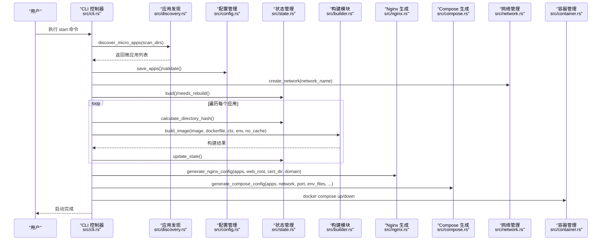
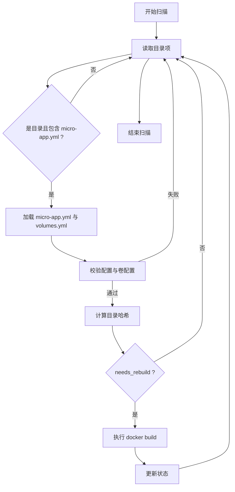
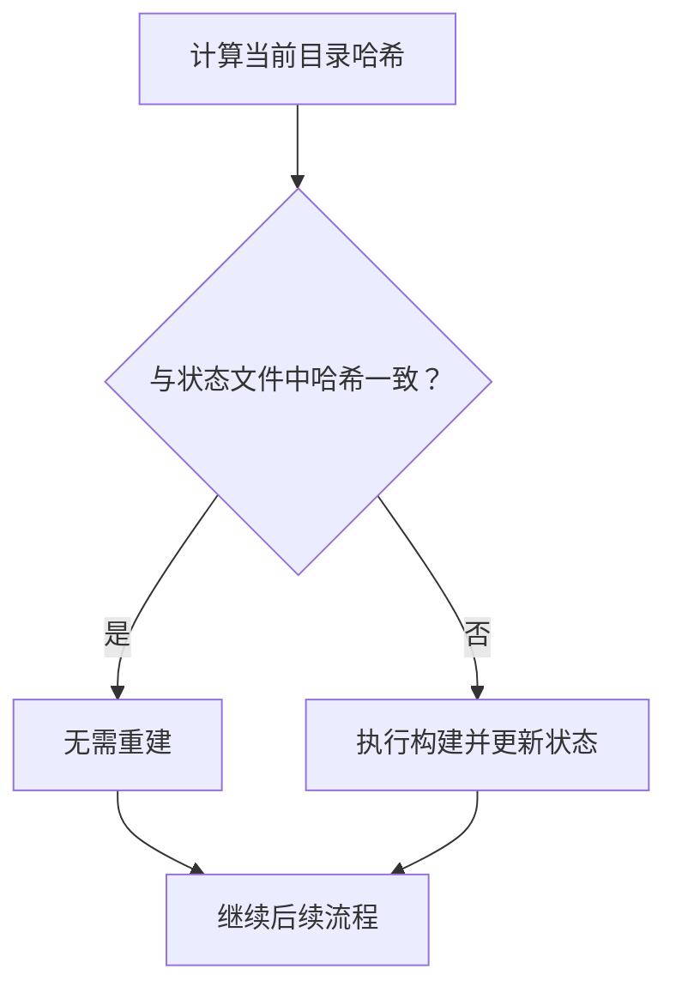
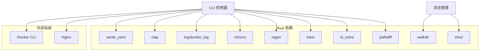

# 性能问题诊断

<cite>
**本文引用的文件**
- [src/main.rs](file://src/main.rs)
- [src/lib.rs](file://src/lib.rs)
- [src/cli.rs](file://src/cli.rs)
- [src/builder.rs](file://src/builder.rs)
- [src/discovery.rs](file://src/discovery.rs)
- [src/state.rs](file://src/state.rs)
- [src/config.rs](file://src/config.rs)
- [src/micro_app_config.rs](file://src/micro_app_config.rs)
- [src/compose.rs](file://src/compose.rs)
- [src/network.rs](file://src/network.rs)
- [src/nginx.rs](file://src/nginx.rs)
- [src/container.rs](file://src/container.rs)
- [src/dockerfile.rs](file://src/dockerfile.rs)
- [Cargo.toml](file://Cargo.toml)
- [README.md](file://README.md)
</cite>

## 目录
1. [引言](#引言)
2. [项目结构](#项目结构)
3. [核心组件](#核心组件)
4. [架构总览](#架构总览)
5. [详细组件分析](#详细组件分析)
6. [依赖分析](#依赖分析)
7. [性能考量](#性能考量)
8. [故障排查指南](#故障排查指南)
9. [结论](#结论)
10. [附录](#附录)

## 引言
本指南聚焦 micro_proxy 在实际使用中的性能问题诊断与优化，围绕以下关键主题展开：
- 识别与分析构建时间过长、启动延迟、内存占用过高等问题
- 性能监控指标的解读与分析方法
- 状态管理与缓存机制对性能的影响
- 微应用发现与构建流程的性能优化策略
- Docker 构建优化技巧与资源配置建议
- 网络性能与并发处理能力评估
- 性能基准测试与对比分析方法
- 常见性能问题的预防与最佳实践

## 项目结构
micro_proxy 采用模块化设计，围绕“发现 → 配置 → 生成 → 启停”的流水线组织代码。主要模块职责如下：
- CLI：命令行入口与子命令调度
- 发现模块：扫描目录、解析微应用配置与卷配置
- 配置模块：主配置与动态应用配置
- 构建模块：调用 docker build 执行镜像构建
- 状态模块：基于目录哈希判断是否需要重建
- Nginx 与 Compose：生成反向代理与容器编排配置
- 网络与容器：Docker 网络与容器生命周期管理
- Dockerfile 解析：提取 EXPOSE 端口等元信息

图表来源
- [src/main.rs:1-25](file://src/main.rs#L1-L25)
- [src/cli.rs:1-669](file://src/cli.rs#L1-L669)
- [src/discovery.rs:1-721](file://src/discovery.rs#L1-L721)
- [src/config.rs:1-842](file://src/config.rs#L1-L842)
- [src/state.rs:1-311](file://src/state.rs#L1-L311)
- [src/builder.rs:1-218](file://src/builder.rs#L1-L218)
- [src/nginx.rs:1-1101](file://src/nginx.rs#L1-L1101)
- [src/compose.rs:1-905](file://src/compose.rs#L1-L905)
- [src/network.rs:1-397](file://src/network.rs#L1-L397)
- [src/container.rs:1-257](file://src/container.rs#L1-L257)
- [src/dockerfile.rs:1-183](file://src/dockerfile.rs#L1-L183)

章节来源
- [src/lib.rs:1-26](file://src/lib.rs#L1-L26)
- [src/main.rs:1-25](file://src/main.rs#L1-L25)
- [src/cli.rs:1-669](file://src/cli.rs#L1-L669)

## 核心组件
- CLI 与命令流：负责解析参数、初始化日志、加载配置、执行子命令（start/stop/clean/status/network）
- 应用发现与校验：扫描目录、解析 micro-app.yml 与 micro-app.volumes.yml、校验容器名唯一性与配置有效性
- 状态与缓存：基于目录哈希判断是否需要重建，避免不必要的构建
- 构建与镜像管理：封装 docker build/rmi/images 命令，支持 --no-cache 与环境变量注入
- Nginx 与 Compose：生成反向代理与 docker-compose 配置，支持 HTTPS、健康检查、卷挂载
- 网络与容器：统一 Docker 网络管理、容器生命周期管理
- Dockerfile 解析：提取 EXPOSE 端口，辅助健康检查与端口映射

章节来源
- [src/cli.rs:71-669](file://src/cli.rs#L71-L669)
- [src/discovery.rs:224-352](file://src/discovery.rs#L224-L352)
- [src/state.rs:188-233](file://src/state.rs#L188-L233)
- [src/builder.rs:20-120](file://src/builder.rs#L20-L120)
- [src/nginx.rs:26-92](file://src/nginx.rs#L26-L92)
- [src/compose.rs:31-119](file://src/compose.rs#L31-L119)
- [src/network.rs:8-119](file://src/network.rs#L8-L119)
- [src/container.rs:8-176](file://src/container.rs#L8-L176)
- [src/dockerfile.rs:16-67](file://src/dockerfile.rs#L16-L67)

## 架构总览
下面的时序图展示了“启动”命令的典型流程，涵盖发现、状态判断、构建、配置生成与容器编排的关键节点。

图表来源
- [src/cli.rs:296-463](file://src/cli.rs#L296-L463)
- [src/discovery.rs:235-352](file://src/discovery.rs#L235-L352)
- [src/state.rs:62-186](file://src/state.rs#L62-L186)
- [src/builder.rs:20-120](file://src/builder.rs#L20-L120)
- [src/nginx.rs:26-92](file://src/nginx.rs#L26-L92)
- [src/compose.rs:31-119](file://src/compose.rs#L31-L119)
- [src/network.rs:15-47](file://src/network.rs#L15-L47)
- [src/container.rs:118-176](file://src/container.rs#L118-L176)

## 详细组件分析

### 应用发现与构建流程（性能热点）
- 扫描与校验：遍历扫描目录，逐个校验 micro-app.yml、Dockerfile、卷配置；重复名称与容器名冲突会直接失败，避免后续浪费
- 目录哈希与缓存：对每个应用目录进行哈希计算，比较旧值决定是否重建；哈希遍历目录树并读取文件内容，I/O 成本较高
- 构建命令：调用 docker build，支持 --no-cache 与 env_file 注入；构建缓存命中可显著缩短时间

图表来源
- [src/discovery.rs:235-352](file://src/discovery.rs#L235-L352)
- [src/state.rs:188-233](file://src/state.rs#L188-L233)
- [src/builder.rs:20-120](file://src/builder.rs#L20-L120)

章节来源
- [src/discovery.rs:224-352](file://src/discovery.rs#L224-L352)
- [src/state.rs:188-233](file://src/state.rs#L188-L233)
- [src/builder.rs:20-120](file://src/builder.rs#L20-L120)

### 状态管理与缓存机制
- 目录哈希：对应用目录进行深度遍历，跳过 .git，对文件内容进行哈希，确保变更敏感
- 状态文件：以 YAML 存储应用名、哈希、最后构建时间、镜像存在性
- 缓存命中策略：若哈希未变则跳过构建，显著降低重复构建成本

图表来源
- [src/state.rs:188-233](file://src/state.rs#L188-L233)
- [src/state.rs:62-113](file://src/state.rs#L62-L113)

章节来源
- [src/state.rs:13-186](file://src/state.rs#L13-L186)
- [src/state.rs:188-233](file://src/state.rs#L188-L233)

### 构建模块与 Docker 命令
- 关键点：Dockerfile 与构建上下文存在性校验；--no-cache 参数；env_file 解析为 --build-arg
- 性能影响：禁用缓存会强制全量构建；环境变量文件过大或解析耗时；docker build I/O 与层缓存策略

章节来源
- [src/builder.rs:20-120](file://src/builder.rs#L20-L120)

### Nginx 与 Compose 生成
- Nginx：动态 DNS 变量解析（resolver），Gzip、keepalive、超时等优化；按路径长度排序 location，避免匹配歧义
- Compose：外部网络复用、健康检查、卷挂载、env_file、user/run_as_user 等

章节来源
- [src/nginx.rs:142-416](file://src/nginx.rs#L142-L416)
- [src/compose.rs:31-119](file://src/compose.rs#L31-L119)

### 网络与容器管理
- 网络：外部网络复用，避免重复创建；存在性检查
- 容器：启动/停止/删除；状态查询；依赖关系（nginx 仅依赖非 Internal 应用）

章节来源
- [src/network.rs:8-119](file://src/network.rs#L8-L119)
- [src/container.rs:8-176](file://src/container.rs#L8-L176)

### Dockerfile 解析
- 提取 EXPOSE 端口，辅助健康检查与端口映射；大小写不敏感、空白分隔兼容

章节来源
- [src/dockerfile.rs:16-67](file://src/dockerfile.rs#L16-L67)

## 依赖分析
- Rust 生态：serde/serde_yaml、clap、log/dumbo_log、chrono、walkdir、sha2、regex、tokio、fs_extra、pathdiff
- 外部系统：Docker CLI（docker/build、docker-compose/docker compose）、Nginx

图表来源
- [Cargo.toml:13-55](file://Cargo.toml#L13-L55)
- [src/cli.rs:1-669](file://src/cli.rs#L1-L669)
- [src/state.rs:1-311](file://src/state.rs#L1-L311)

章节来源
- [Cargo.toml:13-55](file://Cargo.toml#L13-L55)

## 性能考量

### 1) 构建时间过长
- 症状：每次启动均执行 docker build，耗时较长
- 诊断要点
  - 是否启用了 --no-cache（force-rebuild）
  - 环境变量文件体积与解析耗时
  - 构建上下文是否包含大量无关文件
  - Dockerfile 层缓存策略与 .dockerignore
- 优化建议
  - 默认启用缓存，仅在必要时使用 --force-rebuild
  - 将大文件（node_modules、dist）排除在构建上下文之外
  - 合理拆分 Dockerfile 层，提升缓存命中率
  - 使用多阶段构建减少最终镜像体积与构建时间

章节来源
- [src/cli.rs:296-463](file://src/cli.rs#L296-L463)
- [src/builder.rs:20-120](file://src/builder.rs#L20-L120)

### 2) 启动延迟
- 症状：CLI 启动到容器就绪耗时长
- 诊断要点
  - 应用发现与哈希计算的 I/O 成本
  - Nginx 与 Compose 配置生成复杂度
  - 容器健康检查与依赖启动顺序
- 优化建议
  - 仅在配置变更时触发全量扫描与哈希
  - 合理组织扫描目录，减少无效目录
  - 将静态/Api 应用的健康检查与 Nginx 依赖关系最小化
  - 使用外部网络复用，避免重复创建网络

章节来源
- [src/discovery.rs:235-352](file://src/discovery.rs#L235-L352)
- [src/state.rs:188-233](file://src/state.rs#L188-L233)
- [src/nginx.rs:142-416](file://src/nginx.rs#L142-L416)
- [src/compose.rs:31-119](file://src/compose.rs#L31-L119)
- [src/network.rs:15-47](file://src/network.rs#L15-L47)

### 3) 内存占用过高
- 症状：扫描与哈希计算期间内存上升
- 诊断要点
  - 目录遍历与文件读取的内存峰值
  - YAML 解析与序列化开销
- 优化建议
  - 分批处理微应用，避免一次性加载过多配置
  - 使用流式解析与增量哈希，降低峰值内存
  - 控制日志级别，减少 debug 输出带来的内存与 I/O 压力

章节来源
- [src/state.rs:188-233](file://src/state.rs#L188-L233)
- [src/config.rs:76-123](file://src/config.rs#L76-L123)

### 4) 状态管理与缓存
- 影响：目录哈希计算是 I/O 密集；缓存命中可显著降低构建与扫描成本
- 建议
  - 仅在必要时重新计算哈希（如 force_rebuild 或状态文件缺失）
  - 将状态文件放在本地磁盘，避免网络存储带来的延迟

章节来源
- [src/state.rs:62-186](file://src/state.rs#L62-L186)

### 5) 微应用发现与构建优化
- 建议
  - 合理划分 scan_dirs，避免扫描大量无关目录
  - 在微应用根目录放置 .dockerignore，排除构建无关文件
  - 对大型应用采用多模块拆分，减少单次哈希与构建范围

章节来源
- [src/discovery.rs:235-352](file://src/discovery.rs#L235-L352)

### 6) Docker 构建优化与资源配置
- 优化
  - 使用 --no-cache 仅在明确需要时开启
  - 合理利用构建缓存，避免频繁变动的层破坏缓存
  - 多阶段构建与精简基础镜像
- 资源建议
  - 为 Docker daemon 配置合理的 CPU/内存限额
  - 在 CI 环境中使用并行构建与缓存共享

章节来源
- [src/builder.rs:20-120](file://src/builder.rs#L20-L120)

### 7) 网络性能与并发处理
- Nginx 侧
  - 合理设置 worker_processes、worker_connections、keepalive_timeout
  - Gzip 与静态缓存策略
- 并发
  - 通过 compose 的 restart 策略与健康检查提升可用性
  - 控制应用数量与端口映射，避免端口争用

章节来源
- [src/nginx.rs:142-416](file://src/nginx.rs#L142-L416)
- [src/compose.rs:31-119](file://src/compose.rs#L31-L119)

### 8) 性能基准测试与对比分析
- 建议指标
  - 发现与哈希：扫描耗时、哈希计算耗时、I/O 操作次数
  - 构建：首次构建时间、缓存命中时间、--no-cache 时间
  - 启动：容器 up/down、健康检查就绪时间
  - Nginx：静态文件响应时间、API 请求延迟
- 方法
  - 固定硬件环境，分别测试缓存命中与禁用缓存两种场景
  - 对比不同扫描目录规模、微应用数量、Dockerfile 层复杂度
  - 使用 docker stats、top、htop 监控容器与主机资源

章节来源
- [src/cli.rs:296-463](file://src/cli.rs#L296-L463)
- [src/builder.rs:20-120](file://src/builder.rs#L20-L120)
- [src/nginx.rs:142-416](file://src/nginx.rs#L142-L416)

### 9) 常见性能问题预防与最佳实践
- 预防
  - 严格校验与去重：避免重复应用名与容器名
  - 合理的扫描目录结构，减少无效扫描
  - 使用 .dockerignore 与多阶段构建
- 最佳实践
  - 默认启用缓存，仅在必要时强制重建
  - 将状态文件与配置文件放在本地磁盘
  - 合理设置 Nginx 与容器健康检查参数

章节来源
- [src/discovery.rs:235-352](file://src/discovery.rs#L235-L352)
- [src/config.rs:220-347](file://src/config.rs#L220-L347)
- [src/state.rs:62-186](file://src/state.rs#L62-L186)

## 故障排查指南
- 查看日志：使用 -v 输出详细日志，定位 I/O 与命令执行异常
- 端口冲突：检查宿主机端口占用，调整 nginx_host_port
- 网络连通性：使用 network 命令生成网络地址列表，核对容器间通信
- 容器状态：使用 status 命令与 docker ps 验证运行状态
- SSL 证书：检查证书与密钥文件存在性，验证 Nginx 配置语法

章节来源
- [README.md:328-420](file://README.md#L328-L420)
- [src/cli.rs:550-636](file://src/cli.rs#L550-L636)
- [src/network.rs:209-274](file://src/network.rs#L209-L274)
- [src/container.rs:185-242](file://src/container.rs#L185-L242)

## 结论
micro_proxy 的性能瓶颈主要集中在“应用发现与哈希计算”、“Docker 构建”与“配置生成”三大环节。通过启用缓存、优化构建上下文、合理组织扫描目录、使用外部网络复用与健康检查，可显著降低构建与启动时间，提升整体可用性与稳定性。建议在生产与 CI 环境中建立基准测试体系，持续跟踪关键指标，及时发现回归问题。

## 附录
- 命令参考与配置说明详见项目文档
- 依赖清单与版本信息见 Cargo.toml

章节来源
- [README.md:113-163](file://README.md#L113-L163)
- [Cargo.toml:13-55](file://Cargo.toml#L13-L55)