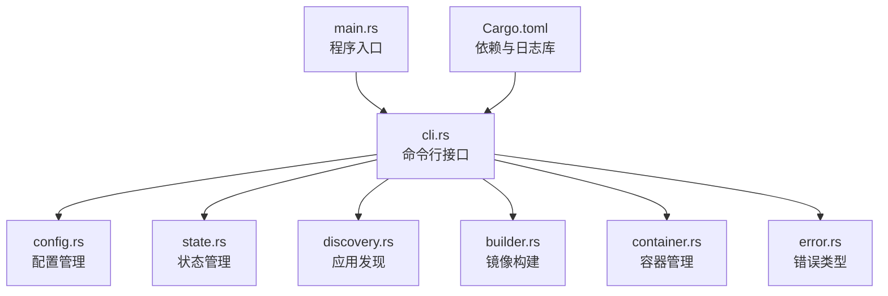
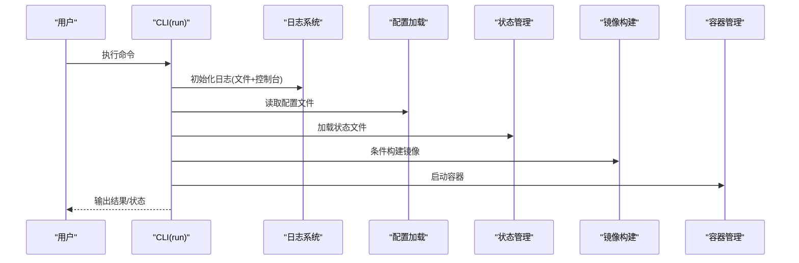
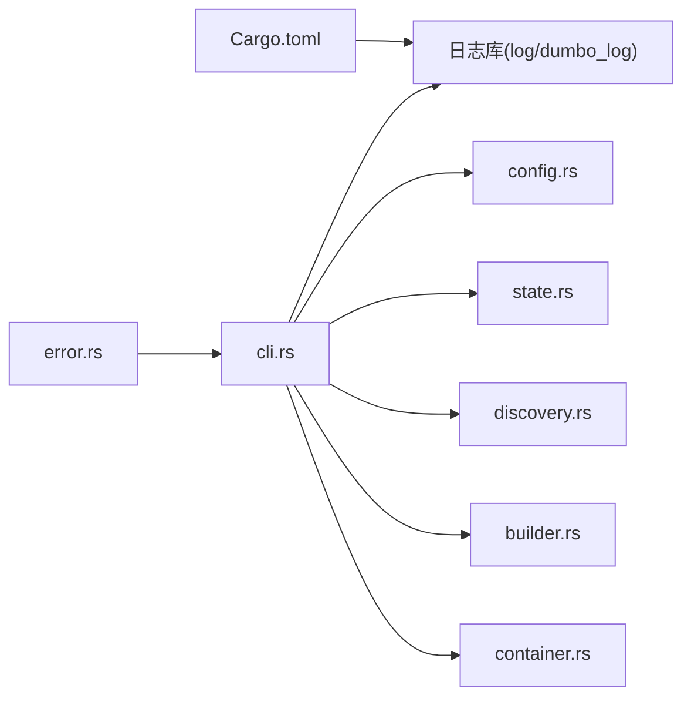

# 日志分析

<cite>
**本文引用的文件**
- [main.rs](file://src/main.rs)
- [lib.rs](file://src/lib.rs)
- [cli.rs](file://src/cli.rs)
- [state.rs](file://src/state.rs)
- [error.rs](file://src/error.rs)
- [config.rs](file://src/config.rs)
- [builder.rs](file://src/builder.rs)
- [discovery.rs](file://src/discovery.rs)
- [container.rs](file://src/container.rs)
- [Cargo.toml](file://Cargo.toml)
- [README.md](file://README.md)
</cite>

## 目录
1. [简介](#简介)
2. [项目结构](#项目结构)
3. [核心组件](#核心组件)
4. [架构总览](#架构总览)
5. [详细组件分析](#详细组件分析)
6. [依赖关系分析](#依赖关系分析)
7. [性能考量](#性能考量)
8. [故障排查指南](#故障排查指南)
9. [结论](#结论)
10. [附录](#附录)

## 简介
本指南面向使用 micro_proxy 的用户与维护者，系统讲解如何查看、解读与利用应用程序日志进行问题诊断。内容涵盖：
- 日志级别与输出位置
- 不同错误类型的日志格式与含义
- 状态文件的作用、位置、格式与关键字段
- 日志收集与保存最佳实践
- 调试模式启用与使用
- 日志分析工具与技巧

## 项目结构
micro_proxy 采用 Rust 模块化设计，日志系统贯穿 CLI、配置、状态、构建、容器管理等模块，统一通过外部日志库初始化并输出到文件与控制台。

图表来源
- [main.rs:1-25](file://src/main.rs#L1-L25)
- [cli.rs:78-116](file://src/cli.rs#L78-L116)
- [config.rs:125-203](file://src/config.rs#L125-L203)
- [state.rs:40-186](file://src/state.rs#L40-L186)
- [discovery.rs:12-91](file://src/discovery.rs#L12-L91)
- [builder.rs:20-120](file://src/builder.rs#L20-L120)
- [container.rs:19-176](file://src/container.rs#L19-L176)
- [error.rs:6-46](file://src/error.rs#L6-L46)
- [Cargo.toml:28-30](file://Cargo.toml#L28-L30)

章节来源
- [main.rs:1-25](file://src/main.rs#L1-L25)
- [lib.rs:1-26](file://src/lib.rs#L1-L26)
- [Cargo.toml:13-55](file://Cargo.toml#L13-L55)

## 核心组件
- 日志初始化与输出：CLI 在启动时使用外部日志库初始化，同时输出到控制台与日志文件。
- 错误类型：统一的错误枚举，便于在日志中区分错误类别。
- 状态管理：基于 YAML 的状态文件，记录应用构建状态与镜像存在性，支持加载/保存。
- 关键流程日志：构建、容器、发现、配置等模块均包含丰富的 info/debug/warn/error 日志。

章节来源
- [cli.rs:78-116](file://src/cli.rs#L78-L116)
- [error.rs:6-46](file://src/error.rs#L6-L46)
- [state.rs:62-113](file://src/state.rs#L62-L113)
- [builder.rs:30-118](file://src/builder.rs#L30-L118)
- [container.rs:26-109](file://src/container.rs#L26-L109)
- [discovery.rs:94-118](file://src/discovery.rs#L94-L118)

## 架构总览
下面的时序图展示了启动命令的典型日志流，体现日志初始化、配置加载、状态管理、构建与容器操作的关键节点。

图表来源
- [cli.rs:78-116](file://src/cli.rs#L78-L116)
- [config.rs:180-203](file://src/config.rs#L180-L203)
- [state.rs:62-89](file://src/state.rs#L62-L89)
- [builder.rs:20-120](file://src/builder.rs#L20-L120)
- [container.rs:86-111](file://src/container.rs#L86-L111)

## 详细组件分析

### 日志系统与级别
- 初始化：CLI 启动时调用外部日志库初始化，输出到与包名一致的日志文件，并同时输出到控制台。
- 级别使用：
  - info：关键流程与结果（如“开始/完成”、“生成配置/保存成功”）
  - debug：细节与上下文（如路径、参数、中间状态）
  - warn：可恢复问题（如文件缺失、网络异常）
  - error：失败与异常（包含错误详情与上下文）

章节来源
- [cli.rs:81-88](file://src/cli.rs#L81-L88)
- [config.rs:80-98](file://src/config.rs#L80-L98)
- [state.rs:63-87](file://src/state.rs#L63-L87)
- [builder.rs:30-118](file://src/builder.rs#L30-L118)
- [container.rs:26-109](file://src/container.rs#L26-L109)
- [discovery.rs:94-118](file://src/discovery.rs#L94-L118)

### 日志级别说明与过滤技巧
- 级别含义
  - trace：最细粒度，通常不启用
  - debug：调试细节，建议在问题排查时开启
  - info：常规运行信息，日常观察
  - warn：潜在问题，需关注
  - error：错误，必须处理
- 过滤技巧
  - 使用命令行参数启用详细日志（例如“启动时显示详细日志”）
  - 通过 grep/awk/sed 等工具按关键字过滤（如“error”、“warn”、“构建失败”）
  - 按时间范围筛选（结合系统日志工具）
  - 分模块过滤：仅关注某类错误（如“构建错误”、“容器错误”）

章节来源
- [README.md:330-341](file://README.md#L330-L341)
- [cli.rs:32-34](file://src/cli.rs#L32-L34)

### 错误类型与日志格式
- 错误类型枚举覆盖配置、IO、YAML、Docker、脚本、网络、发现、构建、容器、状态、Dockerfile、Nginx、Compose 等领域。
- 日志格式：统一以“错误类别: 详细信息”的形式输出，便于快速定位来源模块与问题性质。
- 常见错误场景
  - 配置错误：配置文件缺失、字段为空、重复名称、路径不存在
  - 构建错误：Dockerfile 不存在、构建失败、缓存相关问题
  - 容器错误：创建/启动/停止/删除失败、端口映射冲突
  - 状态错误：状态文件读取/解析失败、序列化失败
  - 发现错误：缺少 Dockerfile、卷配置校验失败
  - 脚本错误：脚本不存在、执行失败

章节来源
- [error.rs:6-46](file://src/error.rs#L6-L46)
- [config.rs:220-347](file://src/config.rs#L220-L347)
- [builder.rs:35-118](file://src/builder.rs#L35-L118)
- [container.rs:58-109](file://src/container.rs#L58-L109)
- [state.rs:71-85](file://src/state.rs#L71-L85)
- [discovery.rs:98-115](file://src/discovery.rs#L98-L115)
- [cli.rs:144-168](file://src/cli.rs#L144-L168)

### 状态文件的作用与检查方法
- 作用：记录每个微应用的目录哈希、最后构建时间、镜像存在性，用于判断是否需要重新构建。
- 位置：由配置文件中的状态文件路径决定。
- 格式：YAML，键为应用名称，值为包含应用名、目录哈希、UTC 时间戳、镜像存在性的对象。
- 关键字段含义
  - app_name：应用名称
  - hash：目录哈希值
  - last_built：最后构建时间（UTC）
  - image_exists：镜像是否存在
- 检查方法
  - 启动时自动加载；若不存在则创建空状态
  - 保存时序列化为 YAML；失败会记录错误
  - 通过“查看状态”命令辅助核对容器与镜像状态

章节来源
- [config.rs:141-142](file://src/config.rs#L141-L142)
- [state.rs:13-28](file://src/state.rs#L13-L28)
- [state.rs:62-113](file://src/state.rs#L62-L113)
- [state.rs:162-177](file://src/state.rs#L162-L177)

### 从日志中提取关键信息进行问题诊断
- 快速定位
  - 使用关键字搜索：error、warn、失败、不存在、不可用
  - 按模块分组：构建、容器、发现、配置、状态
- 常见线索
  - 配置类：字段缺失、路径不存在、重复名称
  - 构建类：Dockerfile 不存在、构建失败、缓存问题
  - 容器类：创建/启动失败、端口冲突、网络不可达
  - 状态类：读取/解析/写入失败
- 结合工具
  - 控制台输出：实时反馈
  - 日志文件：离线分析、长期留存
  - 容器日志：docker logs <容器名>

章节来源
- [README.md:330-341](file://README.md#L330-L341)
- [cli.rs:144-168](file://src/cli.rs#L144-L168)
- [builder.rs:96-118](file://src/builder.rs#L96-L118)
- [container.rs:58-109](file://src/container.rs#L58-L109)

### 日志收集与保存最佳实践
- 启用详细日志：在排查问题时使用“详细日志”开关
- 保留日志文件：每次操作后检查日志文件是否生成
- 归档策略：定期备份日志文件，避免磁盘空间不足
- 结构化输出：将关键信息（如应用名、容器名、错误码）抽取到报告
- 与容器日志联动：同时收集容器日志以便关联分析

章节来源
- [README.md:330-341](file://README.md#L330-L341)
- [cli.rs:32-34](file://src/cli.rs#L32-L34)

### 调试模式的启用与使用
- 启用方式：通过命令行参数启用详细日志
- 使用建议：在启动、构建、容器生命周期等关键阶段开启，问题解决后关闭以减少噪声

章节来源
- [README.md:97-99](file://README.md#L97-L99)
- [cli.rs:32-34](file://src/cli.rs#L32-L34)

### 日志分析工具与技巧
- 基础工具
  - grep/awk/sed：按关键字过滤与提取
  - tail/follow：实时查看最新日志
  - sort/uniq：统计错误类型分布
- 高阶技巧
  - 结合时间戳进行时序分析
  - 将错误分类汇总，形成问题清单
  - 对比前后日志，定位变更引发的问题

章节来源
- [README.md:330-341](file://README.md#L330-L341)

## 依赖关系分析
- 日志库依赖：通过 Cargo.toml 引入日志与日志工具库，CLI 初始化日志系统。
- 模块耦合：CLI 作为协调者，调用配置、状态、发现、构建、容器等模块；各模块内部通过统一错误类型与日志接口交互。

图表来源
- [Cargo.toml:28-30](file://Cargo.toml#L28-L30)
- [cli.rs:78-116](file://src/cli.rs#L78-L116)
- [config.rs:180-203](file://src/config.rs#L180-L203)
- [state.rs:62-113](file://src/state.rs#L62-L113)
- [discovery.rs:94-118](file://src/discovery.rs#L94-L118)
- [builder.rs:30-118](file://src/builder.rs#L30-L118)
- [container.rs:26-109](file://src/container.rs#L26-L109)
- [error.rs:6-46](file://src/error.rs#L6-L46)

章节来源
- [Cargo.toml:13-55](file://Cargo.toml#L13-L55)
- [cli.rs:78-116](file://src/cli.rs#L78-L116)

## 性能考量
- 日志开销：info/debug/warn/error 的输出频率与体量会影响 I/O；在生产环境中建议适度降低 debug 输出。
- I/O 路径：日志文件写入与控制台输出并行，注意磁盘空间与权限。
- 并发与顺序：日志顺序有助于问题复现，但过多并发写入可能带来竞争，应避免在高并发场景下频繁刷新。

## 故障排查指南
- 常见问题与对应日志线索
  - 配置错误：字段缺失、路径不存在、重复名称
  - 构建错误：Dockerfile 不存在、构建失败、缓存相关
  - 容器错误：创建/启动/停止/删除失败、端口映射冲突
  - 状态错误：状态文件读取/解析/写入失败
  - 发现错误：缺少 Dockerfile、卷配置校验失败
- 排查步骤
  - 启用详细日志，重现场景
  - 搜索 error/warn 关键字，定位模块
  - 对照状态文件与容器状态，确认一致性
  - 收集容器日志进行交叉验证

章节来源
- [README.md:328-420](file://README.md#L328-L420)
- [config.rs:220-347](file://src/config.rs#L220-L347)
- [builder.rs:35-118](file://src/builder.rs#L35-L118)
- [container.rs:58-109](file://src/container.rs#L58-L109)
- [state.rs:71-85](file://src/state.rs#L71-L85)
- [discovery.rs:98-115](file://src/discovery.rs#L98-L115)

## 结论
micro_proxy 的日志体系以统一的错误类型与日志级别为核心，贯穿配置、状态、构建、容器等关键流程。通过合理启用详细日志、规范收集与保存、结合工具进行分析，能够高效定位问题并提升运维效率。状态文件作为“构建决策依据”，在问题诊断中同样具有重要参考价值。

## 附录
- 日志文件命名：与包名一致（例如“micro_proxy.log”）
- 常用命令
  - 启动并显示详细日志
  - 查看状态
  - 查看网络地址
  - 查看容器日志

章节来源
- [cli.rs:81-88](file://src/cli.rs#L81-L88)
- [README.md:97-99](file://README.md#L97-L99)
- [README.md:145-163](file://README.md#L145-L163)
- [README.md:336-341](file://README.md#L336-L341)