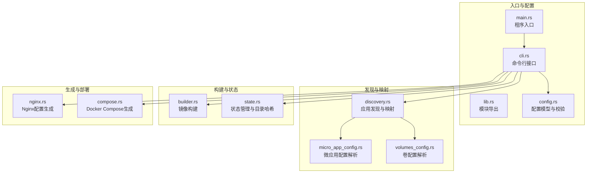
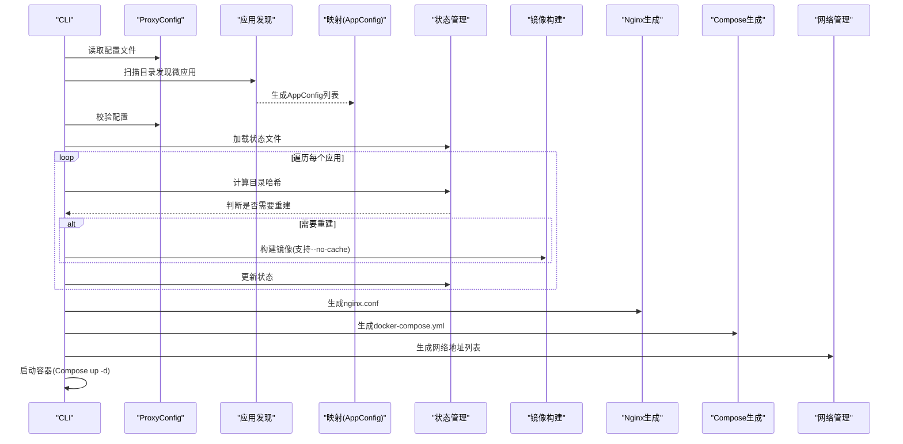
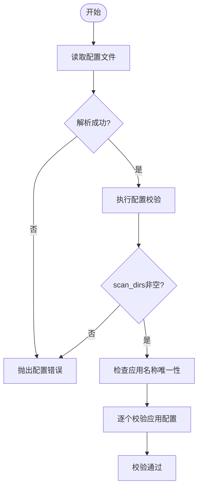
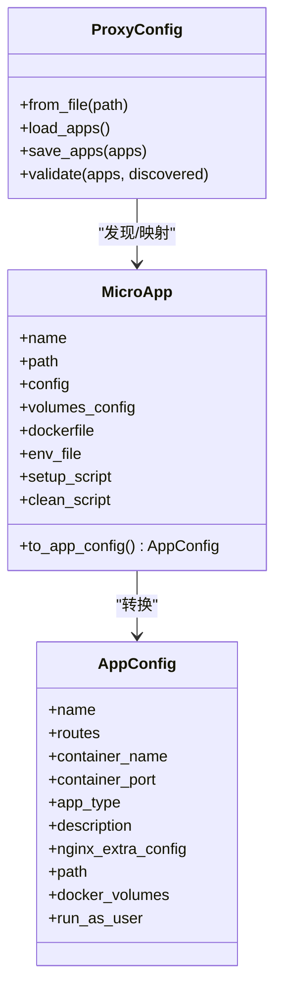
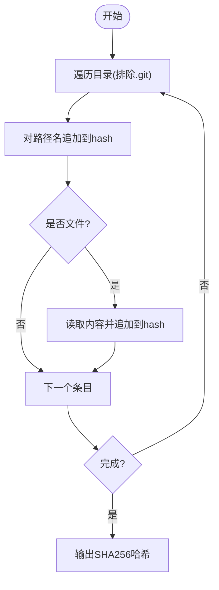
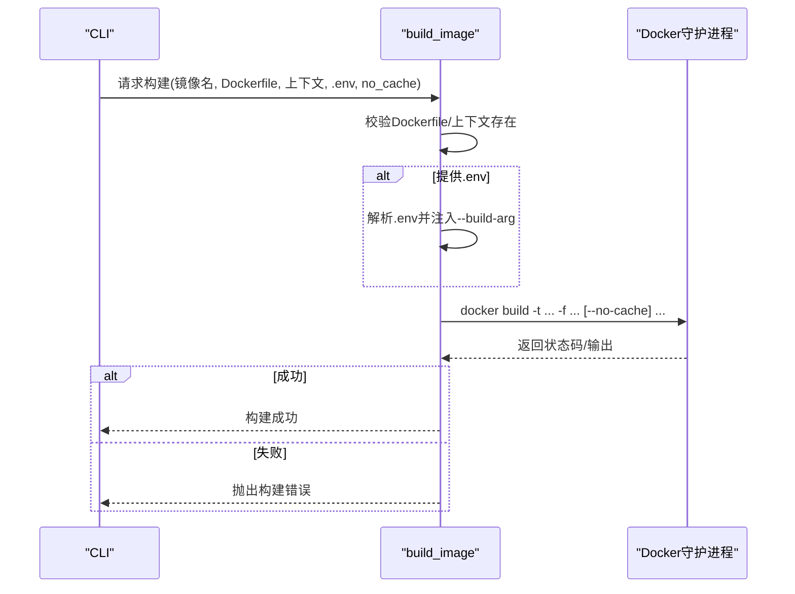
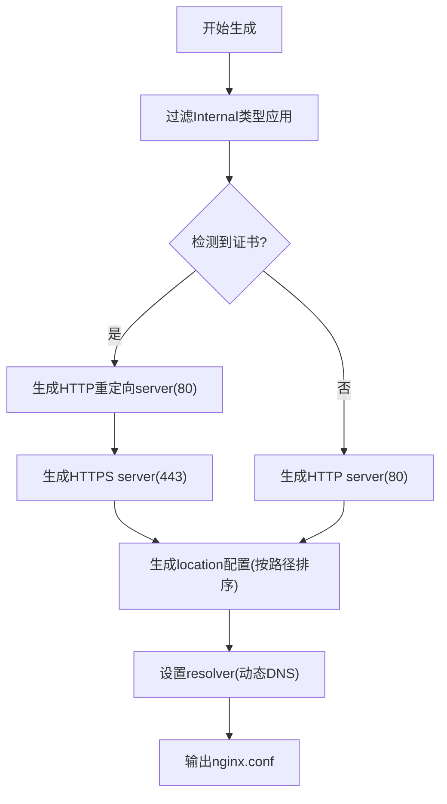
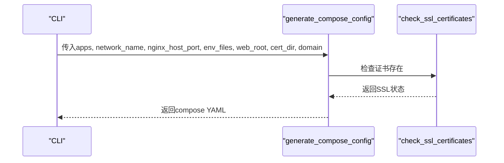
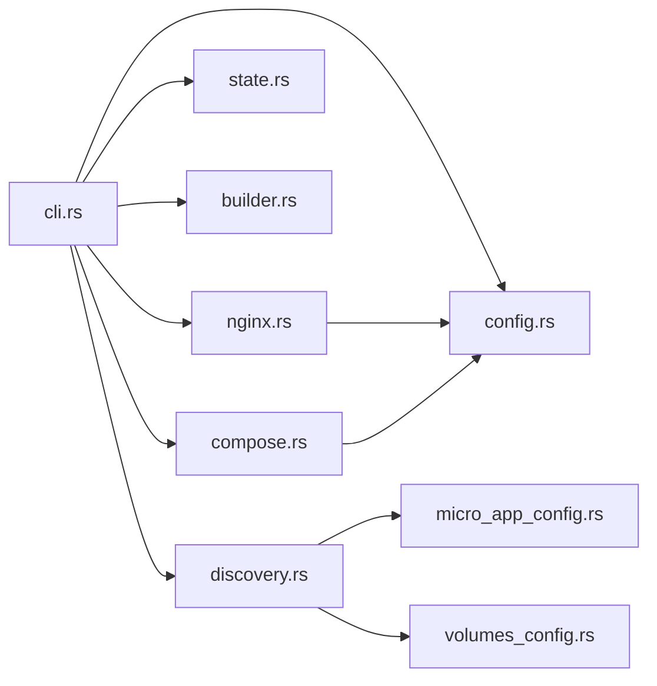

# 数据流设计

<cite>
**本文档引用的文件**
- [src/main.rs](file://src/main.rs)
- [src/lib.rs](file://src/lib.rs)
- [src/cli.rs](file://src/cli.rs)
- [src/config.rs](file://src/config.rs)
- [src/discovery.rs](file://src/discovery.rs)
- [src/builder.rs](file://src/builder.rs)
- [src/state.rs](file://src/state.rs)
- [src/micro_app_config.rs](file://src/micro_app_config.rs)
- [src/volumes_config.rs](file://src/volumes_config.rs)
- [src/compose.rs](file://src/compose.rs)
- [src/nginx.rs](file://src/nginx.rs)
- [src/error.rs](file://src/error.rs)
- [Cargo.toml](file://Cargo.toml)
- [proxy-config.yml.example](file://proxy-config.yml.example)
</cite>

## 目录
1. [引言](#引言)
2. [项目结构](#项目结构)
3. [核心组件](#核心组件)
4. [架构总览](#架构总览)
5. [详细组件分析](#详细组件分析)
6. [依赖关系分析](#依赖关系分析)
7. [性能考虑](#性能考虑)
8. [故障排查指南](#故障排查指南)
9. [结论](#结论)
10. [附录](#附录)

## 引言
本文件面向 micro_proxy 的数据流设计，系统性阐述从配置文件加载到最终部署的完整数据流转过程。重点涵盖以下方面：
- 配置文件加载与校验
- 应用发现与映射（ProxyConfig → AppConfig）
- 状态检查与目录哈希计算
- 镜像构建流程
- 配置生成（Nginx 与 Docker Compose）
- 部署与网络管理
- 关键数据结构转换、数据验证与错误处理机制
- 数据一致性与并发访问控制建议

## 项目结构
micro_proxy 采用模块化设计，核心模块围绕“配置 → 发现 → 构建 → 生成 → 部署”的主线展开，CLI 作为入口协调各模块。

**图表来源**
- [src/main.rs:1-25](file://src/main.rs#L1-L25)
- [src/lib.rs:1-26](file://src/lib.rs#L1-L26)
- [src/cli.rs:78-116](file://src/cli.rs#L78-L116)
- [src/config.rs:125-367](file://src/config.rs#L125-L367)
- [src/discovery.rs:235-374](file://src/discovery.rs#L235-L374)
- [src/micro_app_config.rs:35-106](file://src/micro_app_config.rs#L35-L106)
- [src/volumes_config.rs:55-204](file://src/volumes_config.rs#L55-L204)
- [src/builder.rs:20-120](file://src/builder.rs#L20-L120)
- [src/state.rs:40-186](file://src/state.rs#L40-L186)
- [src/nginx.rs:26-92](file://src/nginx.rs#L26-L92)
- [src/compose.rs:31-119](file://src/compose.rs#L31-L119)

**章节来源**
- [src/main.rs:1-25](file://src/main.rs#L1-L25)
- [src/lib.rs:1-26](file://src/lib.rs#L1-L26)
- [src/cli.rs:78-116](file://src/cli.rs#L78-L116)

## 核心组件
- 配置模型与校验：ProxyConfig/AppConfig/AppsConfig/微应用配置与卷配置
- 应用发现与映射：扫描目录、生成唯一应用名、映射为 AppConfig
- 状态管理：目录哈希计算、构建状态跟踪
- 镜像构建：调用 docker build，支持缓存与环境变量注入
- 配置生成：Nginx 与 Docker Compose
- CLI 协调：命令解析、流程编排、错误传播

**章节来源**
- [src/config.rs:23-123](file://src/config.rs#L23-L123)
- [src/config.rs:125-367](file://src/config.rs#L125-L367)
- [src/discovery.rs:121-144](file://src/discovery.rs#L121-L144)
- [src/state.rs:188-233](file://src/state.rs#L188-L233)
- [src/builder.rs:20-120](file://src/builder.rs#L20-L120)
- [src/nginx.rs:26-92](file://src/nginx.rs#L26-L92)
- [src/compose.rs:31-119](file://src/compose.rs#L31-L119)

## 架构总览
数据流从 CLI 启动，贯穿配置加载、应用发现、状态检查、镜像构建、配置生成到最终部署。关键数据结构转换如下：
- ProxyConfig → AppConfig：通过 discovery.rs 的映射与校验
- 目录哈希 → 状态管理：通过 state.rs 的 calculate_directory_hash 与 StateManager
- AppConfig → Nginx 配置：通过 nginx.rs 的 generate_nginx_config
- AppConfig → Docker Compose：通过 compose.rs 的 generate_compose_config

**图表来源**
- [src/cli.rs:296-463](file://src/cli.rs#L296-L463)
- [src/discovery.rs:235-374](file://src/discovery.rs#L235-L374)
- [src/state.rs:188-233](file://src/state.rs#L188-L233)
- [src/builder.rs:20-120](file://src/builder.rs#L20-L120)
- [src/nginx.rs:26-92](file://src/nginx.rs#L26-L92)
- [src/compose.rs:31-119](file://src/compose.rs#L31-L119)

## 详细组件分析

### 配置加载与校验（ProxyConfig/AppConfig）
- ProxyConfig.from_file：读取 YAML 配置，解析为结构体；提供 load_apps/save_apps 辅助方法
- AppConfig/AppsConfig：动态生成的应用配置结构，支持序列化/反序列化
- ProxyConfig.validate：校验 scan_dirs 非空、应用名称唯一、Static/API 路由非空、Internal 路径与 Dockerfile 存在等

**图表来源**
- [src/config.rs:178-220](file://src/config.rs#L178-L220)
- [src/config.rs:221-347](file://src/config.rs#L221-L347)

**章节来源**
- [src/config.rs:178-220](file://src/config.rs#L178-L220)
- [src/config.rs:221-347](file://src/config.rs#L221-L347)

### 应用发现与映射（ProxyConfig → AppConfig）
- discover_micro_apps：扫描 scan_dirs，过滤包含 micro-app.yml 的目录，生成唯一应用名，加载 micro-app.yml 与 micro-app.volumes.yml，校验 Dockerfile 与 .env
- MicroApp.to_app_config：将 MicroApp 映射为 AppConfig，转换 app_type，填充 docker_volumes/run_as_user/path 等字段

**图表来源**
- [src/discovery.rs:235-374](file://src/discovery.rs#L235-L374)
- [src/discovery.rs:121-144](file://src/discovery.rs#L121-L144)
- [src/config.rs:23-68](file://src/config.rs#L23-L68)

**章节来源**
- [src/discovery.rs:235-374](file://src/discovery.rs#L235-L374)
- [src/discovery.rs:121-144](file://src/discovery.rs#L121-L144)

### 状态检查与目录哈希（StateManager/Hash）
- calculate_directory_hash：遍历目录（排除 .git），对文件名与内容进行 SHA256 哈希，确保构建触发条件准确
- StateManager：维护应用状态（hash/last_built/image_exists），提供 needs_rebuild 判断

**图表来源**
- [src/state.rs:188-233](file://src/state.rs#L188-L233)

**章节来源**
- [src/state.rs:188-233](file://src/state.rs#L188-L233)
- [src/state.rs:40-186](file://src/state.rs#L40-L186)

### 镜像构建（Docker）
- build_image：校验 Dockerfile/上下文存在，解析 .env 注入构建参数，支持 --no-cache，捕获构建输出与错误
- remove_image/image_exists：镜像生命周期管理

**图表来源**
- [src/builder.rs:20-120](file://src/builder.rs#L20-L120)

**章节来源**
- [src/builder.rs:20-120](file://src/builder.rs#L20-L120)

### Nginx 配置生成
- generate_nginx_config：根据应用类型过滤 Internal，生成 HTTP/HTTPS server 块，动态 DNS 变量，location 重写与缓存策略
- 证书检测：check_ssl_certificates，支持 .cer/.crt 与 .key

**图表来源**
- [src/nginx.rs:26-92](file://src/nginx.rs#L26-L92)
- [src/nginx.rs:284-416](file://src/nginx.rs#L284-L416)

**章节来源**
- [src/nginx.rs:26-92](file://src/nginx.rs#L26-L92)
- [src/nginx.rs:284-416](file://src/nginx.rs#L284-L416)

### Docker Compose 配置生成
- generate_compose_config：生成 networks(外部网络)/services(Nginx+各应用)，自动设置 depends_on、env_file、volumes、user 等
- 证书检测：根据 domain 与证书存在与否决定端口映射

**图表来源**
- [src/compose.rs:31-119](file://src/compose.rs#L31-L119)
- [src/compose.rs:121-158](file://src/compose.rs#L121-L158)

**章节来源**
- [src/compose.rs:31-119](file://src/compose.rs#L31-L119)
- [src/compose.rs:121-158](file://src/compose.rs#L121-L158)

### 部署与网络管理
- CLI.execute_start：停止并删除现有容器、生成配置、保存状态、启动容器
- generate_network_list：生成网络地址列表，辅助连通性排查

**章节来源**
- [src/cli.rs:296-463](file://src/cli.rs#L296-L463)

## 依赖关系分析
- CLI 依赖 config/discovery/state/builder/nginx/compose/network 等模块
- discovery 依赖 micro_app_config 与 volumes_config
- nginx/compose 依赖 config(AppConfig/AppType)

**图表来源**
- [src/cli.rs:78-116](file://src/cli.rs#L78-L116)
- [src/discovery.rs:6-8](file://src/discovery.rs#L6-L8)
- [src/micro_app_config.rs:6-8](file://src/micro_app_config.rs#L6-L8)
- [src/volumes_config.rs:6-8](file://src/volumes_config.rs#L6-L8)
- [src/nginx.rs:7](file://src/nginx.rs#L7)
- [src/compose.rs:6](file://src/compose.rs#L6)

**章节来源**
- [src/cli.rs:78-116](file://src/cli.rs#L78-L116)

## 性能考虑
- 目录哈希计算：walkdir 遍历并排序，建议仅在必要时触发（结合 needs_rebuild）
- Docker 构建：--no-cache 会显著增加时间成本，建议默认使用缓存，仅在 force_rebuild 时启用
- Nginx/Compose 生成：纯函数式生成，复杂度主要受应用数量影响
- I/O：配置文件读写与日志输出，注意磁盘性能与日志级别

[本节为通用指导，无需特定文件引用]

## 故障排查指南
- 配置错误：检查 scan_dirs 非空、应用名称唯一、Static/API 路由非空、Internal 路径与 Dockerfile 存在
- 构建失败：查看 docker build 输出，确认 Dockerfile/上下文存在，.env 解析正确
- 状态异常：检查 state 文件格式与权限，确认 needs_rebuild 判断逻辑
- 证书问题：确认 web_root/cert_dir/domain 配置，证书文件存在且命名符合约定
- 端口冲突：修改 nginx_host_port，避免宿主机端口占用

**章节来源**
- [src/error.rs:1-50](file://src/error.rs#L1-L50)
- [src/config.rs:221-347](file://src/config.rs#L221-L347)
- [src/builder.rs:95-120](file://src/builder.rs#L95-L120)
- [src/state.rs:62-89](file://src/state.rs#L62-L89)
- [src/nginx.rs:102-131](file://src/nginx.rs#L102-L131)

## 结论
micro_proxy 的数据流以 CLI 为中枢，围绕“配置 → 发现 → 构建 → 生成 → 部署”形成闭环。通过 ProxyConfig → AppConfig 的清晰映射、目录哈希驱动的增量构建、以及 Nginx/Compose 的自动化生成，实现了高效、可维护的微应用管理。建议在生产环境中：
- 使用默认缓存构建，仅在需要时强制重建
- 严格遵循配置校验规则，确保应用唯一性与完整性
- 建立状态文件备份与定期校验机制
- 并发访问控制：对状态文件与配置文件采用互斥锁或原子写入，避免竞态

[本节为总结性内容，无需特定文件引用]

## 附录
- 配置文件示例：proxy-config.yml.example 展示了 scan_dirs、apps_config_path、nginx_config_path、compose_config_path、state_file_path、network_list_path、network_name、nginx_host_port、web_root、cert_dir、domain 等关键字段
- 技术栈：Rust、Docker、Nginx、Docker Compose、YAML、日志与错误处理库

**章节来源**
- [proxy-config.yml.example:1-53](file://proxy-config.yml.example#L1-L53)
- [Cargo.toml:13-55](file://Cargo.toml#L13-L55)