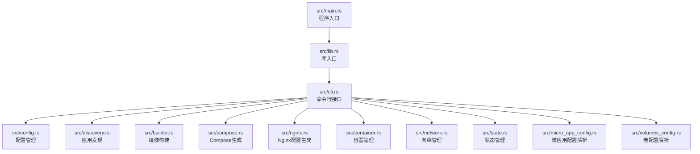
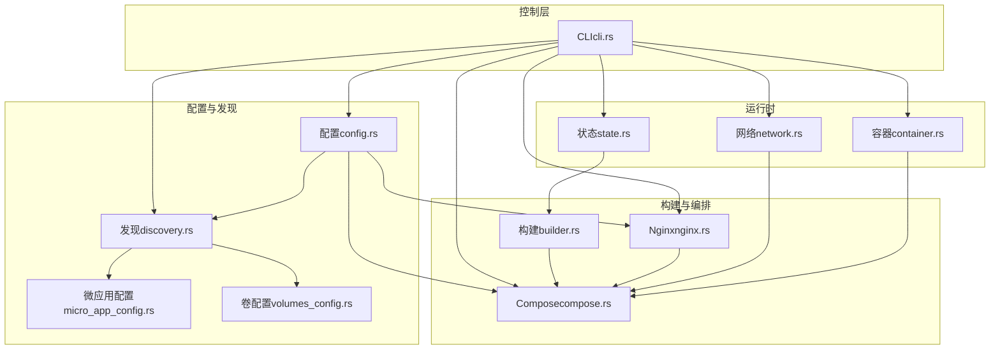
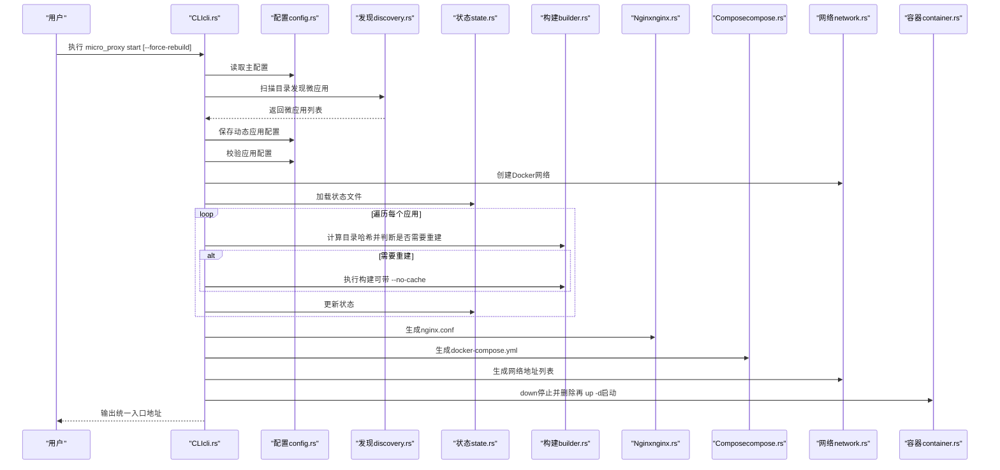
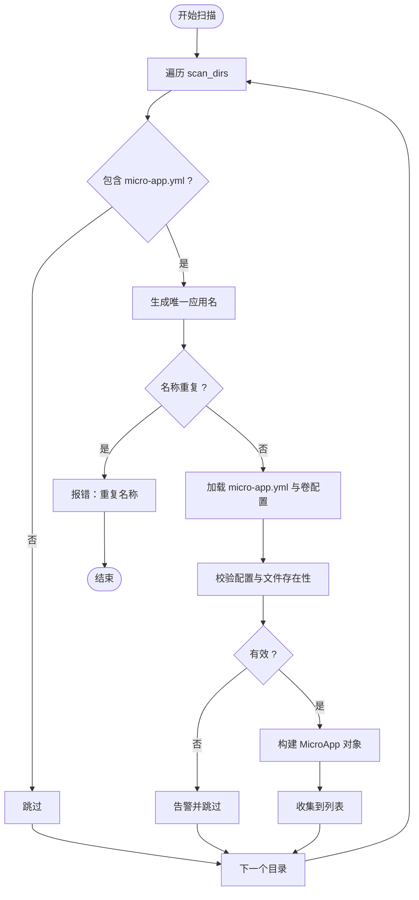
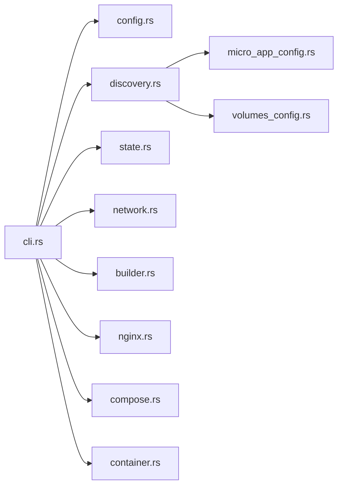

# 架构设计

<cite>
**本文引用的文件**
- [src/main.rs](file://src/main.rs)
- [src/lib.rs](file://src/lib.rs)
- [src/cli.rs](file://src/cli.rs)
- [src/config.rs](file://src/config.rs)
- [src/state.rs](file://src/state.rs)
- [src/discovery.rs](file://src/discovery.rs)
- [src/builder.rs](file://src/builder.rs)
- [src/compose.rs](file://src/compose.rs)
- [src/nginx.rs](file://src/nginx.rs)
- [src/container.rs](file://src/container.rs)
- [src/network.rs](file://src/network.rs)
- [src/micro_app_config.rs](file://src/micro_app_config.rs)
- [src/volumes_config.rs](file://src/volumes_config.rs)
- [Cargo.toml](file://Cargo.toml)
- [README.md](file://README.md)
</cite>

## 目录
1. [引言](#引言)
2. [项目结构](#项目结构)
3. [核心组件](#核心组件)
4. [架构总览](#架构总览)
5. [详细组件分析](#详细组件分析)
6. [依赖关系分析](#依赖关系分析)
7. [性能考虑](#性能考虑)
8. [故障排查指南](#故障排查指南)
9. [结论](#结论)
10. [附录](#附录)

## 引言
本架构设计文档面向 micro_proxy 的整体设计与实现，聚焦于模块化架构、配置驱动与状态管理，以及从配置加载到最终部署的完整流程。系统围绕“发现—构建—编排—代理—状态—网络”六大核心能力展开，通过 CLI 驱动，串联 Docker、Nginx、Docker Compose 等外部系统，形成可扩展、可维护的微应用统一入口与编排平台。

## 项目结构
项目采用 Rust crate 结构，模块按职责拆分，入口位于 main.rs，库入口在 lib.rs，CLI 在 cli.rs，其余模块分别负责配置、发现、构建、编排、代理、容器、网络、状态、微应用配置与卷配置等。

**图表来源**
- [src/main.rs:1-25](file://src/main.rs#L1-L25)
- [src/lib.rs:1-26](file://src/lib.rs#L1-L26)
- [src/cli.rs:1-669](file://src/cli.rs#L1-L669)

**章节来源**
- [src/main.rs:1-25](file://src/main.rs#L1-L25)
- [src/lib.rs:1-26](file://src/lib.rs#L1-L26)
- [Cargo.toml:1-55](file://Cargo.toml#L1-L55)

## 核心组件
- 发现模块（discovery.rs）：扫描多目录，发现包含 micro-app.yml 与 Dockerfile 的微应用，生成唯一名称并校验容器名唯一性。
- 构建模块（builder.rs）：调用 docker build 构建镜像，支持 --no-cache、环境变量注入。
- 编排模块（compose.rs）：生成 docker-compose.yml，管理网络、服务、健康检查、卷映射、环境变量文件等。
- 代理模块（nginx.rs）：生成 nginx.conf，支持 HTTP/HTTPS、ACME 验证、动态 DNS 解析、location 路由规则。
- 容器模块（container.rs）：封装 docker create/start/stop/rm/ps 等生命周期管理。
- 网络模块（network.rs）：创建/删除 Docker 网络，生成网络地址列表。
- 状态模块（state.rs）：基于目录哈希判断是否需要重建，持久化状态文件。
- 配置模块（config.rs）：主配置与应用配置的加载、保存、验证与筛选。
- 微应用配置（micro_app_config.rs）：解析 micro-app.yml，校验 routes、container_name、container_port、app_type。
- 卷配置（volumes_config.rs）：解析 micro-app.volumes.yml，生成 Docker Compose volumes 格式与权限初始化脚本。

**章节来源**
- [src/discovery.rs:1-721](file://src/discovery.rs#L1-L721)
- [src/builder.rs:1-218](file://src/builder.rs#L1-L218)
- [src/compose.rs:1-905](file://src/compose.rs#L1-L905)
- [src/nginx.rs:1-1101](file://src/nginx.rs#L1-L1101)
- [src/container.rs:1-257](file://src/container.rs#L1-L257)
- [src/network.rs:1-397](file://src/network.rs#L1-L397)
- [src/state.rs:1-311](file://src/state.rs#L1-L311)
- [src/config.rs:1-842](file://src/config.rs#L1-L842)
- [src/micro_app_config.rs:1-235](file://src/micro_app_config.rs#L1-L235)
- [src/volumes_config.rs:1-426](file://src/volumes_config.rs#L1-L426)

## 架构总览
系统采用“配置驱动 + 状态驱动”的流水线式架构，CLI 作为编排中枢，协调各模块完成从发现到部署的全链路任务。核心设计要点：
- 模块化设计：每个模块职责单一，接口清晰，便于替换与扩展。
- 配置驱动：主配置与应用配置 YAML 化，集中管理路径、端口、网络、证书等。
- 状态管理：通过目录哈希与状态文件，避免不必要的重复构建。
- 外部系统集成：通过 docker/docker-compose 命令与 Nginx 配置文件实现容器化与反向代理。

**图表来源**
- [src/cli.rs:78-463](file://src/cli.rs#L78-L463)
- [src/config.rs:125-367](file://src/config.rs#L125-L367)
- [src/discovery.rs:224-352](file://src/discovery.rs#L224-L352)
- [src/builder.rs:20-120](file://src/builder.rs#L20-L120)
- [src/compose.rs:31-119](file://src/compose.rs#L31-L119)
- [src/nginx.rs:26-92](file://src/nginx.rs#L26-L92)
- [src/network.rs:15-47](file://src/network.rs#L15-L47)
- [src/state.rs:40-113](file://src/state.rs#L40-L113)

## 详细组件分析

### CLI 与控制流
CLI 负责解析命令、初始化日志、加载配置、调度各模块并执行具体动作（start/stop/clean/status/network）。其核心流程如下：

**图表来源**
- [src/cli.rs:296-463](file://src/cli.rs#L296-L463)
- [src/config.rs:178-219](file://src/config.rs#L178-L219)
- [src/discovery.rs:235-352](file://src/discovery.rs#L235-L352)
- [src/state.rs:62-113](file://src/state.rs#L62-L113)
- [src/builder.rs:20-120](file://src/builder.rs#L20-L120)
- [src/nginx.rs:26-92](file://src/nginx.rs#L26-L92)
- [src/compose.rs:31-119](file://src/compose.rs#L31-L119)
- [src/network.rs:15-47](file://src/network.rs#L15-L47)
- [src/container.rs:149-176](file://src/container.rs#L149-L176)

**章节来源**
- [src/cli.rs:78-463](file://src/cli.rs#L78-L463)

### 发现模块（discovery.rs）
- 职责：扫描 scan_dirs，定位包含 micro-app.yml 与 Dockerfile 的目录；生成唯一应用名；加载 micro-app.yml、卷配置、Dockerfile、.env、setup/clean 脚本；校验配置有效性。
- 关键点：唯一应用名生成规则（相对路径拼接）、容器名去重、卷配置校验、转换为 AppConfig。
- 接口：discover_micro_apps、to_app_configs、get_micro_app_names、MicroApp::from_directory、MicroApp::validate、MicroApp::to_app_config。

**图表来源**
- [src/discovery.rs:224-352](file://src/discovery.rs#L224-L352)
- [src/discovery.rs:40-145](file://src/discovery.rs#L40-L145)

**章节来源**
- [src/discovery.rs:1-721](file://src/discovery.rs#L1-L721)

### 构建模块（builder.rs）
- 职责：调用 docker build 构建镜像，支持 --no-cache、从 .env 注入构建参数、检查镜像存在性、删除镜像。
- 关键点：命令构造、错误处理、输出日志。
- 接口：build_image、remove_image、image_exists。

**章节来源**
- [src/builder.rs:1-218](file://src/builder.rs#L1-L218)

### 编排模块（compose.rs）
- 职责：生成 docker-compose.yml，包含网络（外部已存在）、nginx 服务（依赖非 Internal 应用）、各应用服务（健康检查、卷映射、用户、env_file）。
- 关键点：网络外部化、依赖关系、健康检查策略、卷映射与用户配置。
- 接口：generate_compose_config、generate_nginx_service、generate_app_service、save_compose_config。

**章节来源**
- [src/compose.rs:1-905](file://src/compose.rs#L1-L905)

### 代理模块（nginx.rs）
- 职责：生成 nginx.conf，支持 HTTP/HTTPS、ACME 验证、动态 DNS 解析（Docker 内部 DNS）、location 路由规则（静态/Api）、额外 nginx 配置。
- 关键点：resolver 配置、set 变量实现动态上游、根路径与子路径的 rewrite 规则、HTTPS 证书检测。
- 接口：generate_nginx_config、generate_http_redirect_server_block、generate_http_server_block、generate_https_server_block、generate_location_config、save_nginx_config。

**章节来源**
- [src/nginx.rs:1-1101](file://src/nginx.rs#L1-L1101)

### 容器模块（container.rs）
- 职责：封装容器生命周期管理（create/start/stop/remove/ps），查询状态与运行状态。
- 关键点：命令行调用与错误处理。
- 接口：create_container、start_container、stop_container、remove_container、get_container_status、is_container_running。

**章节来源**
- [src/container.rs:1-257](file://src/container.rs#L1-L257)

### 网络模块（network.rs）
- 职责：创建/删除 Docker 网络，生成网络地址列表（含访问 URL 与微应用间通信示例）。
- 关键点：网络存在性检查、网络地址信息格式化。
- 接口：create_network、remove_network、network_exists、NetworkAddressInfo::new/format/generate_network_list。

**章节来源**
- [src/network.rs:1-397](file://src/network.rs#L1-L397)

### 状态模块（state.rs）
- 职责：基于目录哈希判断是否需要重建，持久化状态文件（应用名、hash、最后构建时间、镜像存在性）。
- 关键点：目录遍历与哈希计算、状态文件读写、needs_rebuild 判定。
- 接口：StateManager::new/load/save/update_state/remove_state/needs_rebuild/get_all_states、calculate_directory_hash。

**章节来源**
- [src/state.rs:1-311](file://src/state.rs#L1-L311)

### 配置模块（config.rs）
- 职责：主配置 ProxyConfig 与应用配置 AppConfig 的加载/保存/验证；筛选需要代理的应用与 Internal 应用。
- 关键点：配置验证（scan_dirs、应用名唯一、routes、Internal 路径与 Dockerfile、volumes/run_as_user）。
- 接口：ProxyConfig::from_file/load_apps/save_apps/validate/get_app_config/get_nginx_apps/get_internal_apps。

**章节来源**
- [src/config.rs:1-842](file://src/config.rs#L1-L842)

### 微应用配置（micro_app_config.rs）
- 职责：解析 micro-app.yml，校验 routes/container_name/container_port/app_type 等字段。
- 接口：MicroAppConfig::from_file/validate。

**章节来源**
- [src/micro_app_config.rs:1-235](file://src/micro_app_config.rs#L1-L235)

### 卷配置（volumes_config.rs）
- 职责：解析 micro-app.volumes.yml，生成 Docker Compose volumes 格式与权限初始化脚本。
- 接口：VolumesConfig::from_file/validate/generate_permission_init_script/to_docker_compose_volumes。

**章节来源**
- [src/volumes_config.rs:1-426](file://src/volumes_config.rs#L1-L426)

## 依赖关系分析
- 内部模块耦合：CLI 作为中枢，依赖配置、发现、状态、网络、构建、Nginx、Compose、容器等模块；各模块之间以清晰接口交互，低耦合高内聚。
- 外部系统集成：通过命令行调用 docker/docker-compose，读写文件（nginx.conf、docker-compose.yml、状态文件、网络地址列表）。
- 依赖清单（部分）：serde/serde_yaml、clap、log/dumbo_log、chrono、walkdir、sha2、regex、tokio、fs_extra、pathdiff。

**图表来源**
- [src/cli.rs:6-19](file://src/cli.rs#L6-L19)
- [src/discovery.rs:6-8](file://src/discovery.rs#L6-L8)
- [src/micro_app_config.rs:6-8](file://src/micro_app_config.rs#L6-L8)
- [src/volumes_config.rs:6-8](file://src/volumes_config.rs#L6-L8)

**章节来源**
- [Cargo.toml:13-55](file://Cargo.toml#L13-L55)

## 性能考虑
- 构建缓存：通过 --no-cache 与状态文件的哈希对比，避免重复构建，提升增量构建效率。
- 目录遍历与哈希：walkdir 遍历目录并计算 SHA256，建议在大型项目中限制扫描范围与忽略 .git 等目录。
- Nginx 动态解析：使用 Docker 内部 DNS（resolver）与 set 变量，减少静态 upstream 块，降低配置复杂度与维护成本。
- Compose 生成：按需生成健康检查、卷映射与 env_file，避免冗余配置影响启动速度。
- 网络管理：外部网络避免重复创建，减少网络切换开销。

[本节为通用指导，无需特定文件引用]

## 故障排查指南
- 日志与状态：使用 -v 查看详细日志；通过 status 命令查看容器状态与镜像存在性。
- 端口冲突：检查宿主机端口占用，调整 nginx_host_port。
- 卷挂载：确认宿主机路径存在与权限正确，使用 inspect 查看 Mounts。
- SSL 证书：确认证书与密钥文件存在，使用 docker exec proxy-nginx nginx -t 验证配置。
- 网络连通：使用 network 命令生成网络地址列表，核对访问 URL 与微应用间通信示例。

**章节来源**
- [src/cli.rs:465-636](file://src/cli.rs#L465-L636)
- [README.md:328-420](file://README.md#L328-L420)

## 结论
micro_proxy 通过模块化设计与配置驱动，实现了从微应用发现、镜像构建、容器编排到反向代理与状态管理的完整闭环。其状态管理与外部系统集成（Docker/Nginx/Compose）使系统具备良好的可扩展性与可维护性，适合在多微应用场景下提供统一入口与标准化运维流程。

## 附录
- 扩展点与插件机制：当前以模块化文件形式组织，可通过新增模块文件与在 CLI 中注册相应流程实现扩展；若需更强的插件化，可在配置中引入插件入口或钩子函数（例如在 setup/clean 脚本之外增加可配置的钩子）。
- 与 Docker/Nginx 的集成：通过命令行与文件生成实现解耦；未来可考虑引入 Docker SDK 与 Nginx API 以增强可观测性与自动化能力。

[本节为概念性总结，无需特定文件引用]