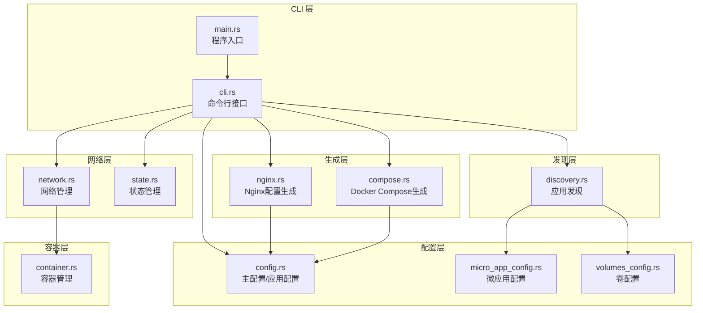
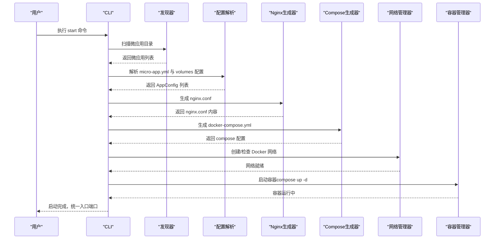
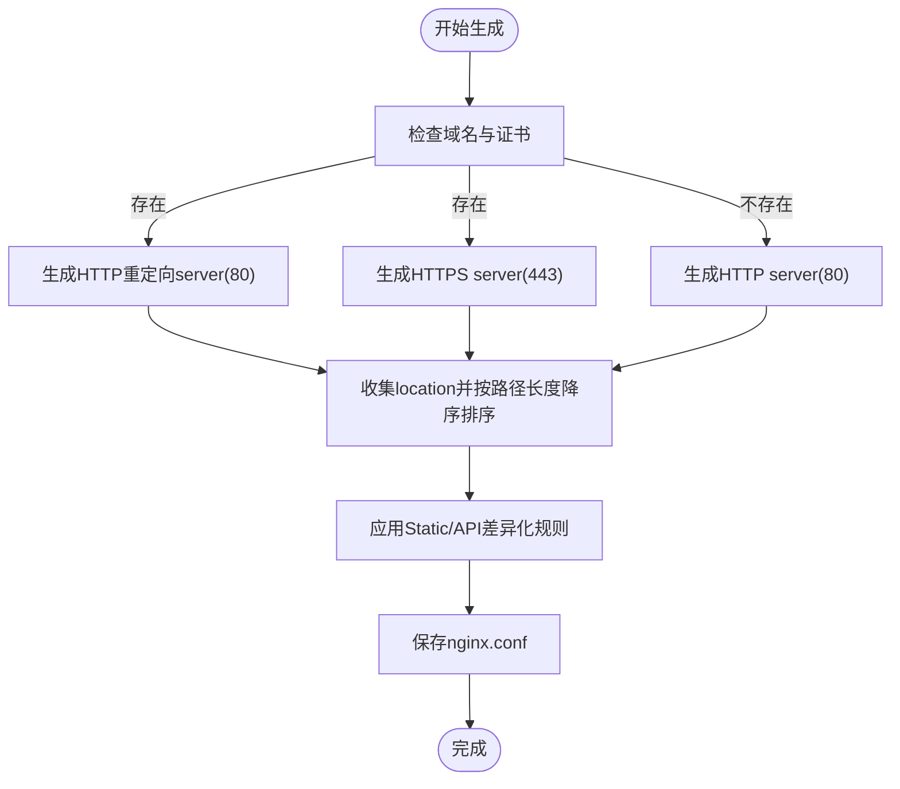
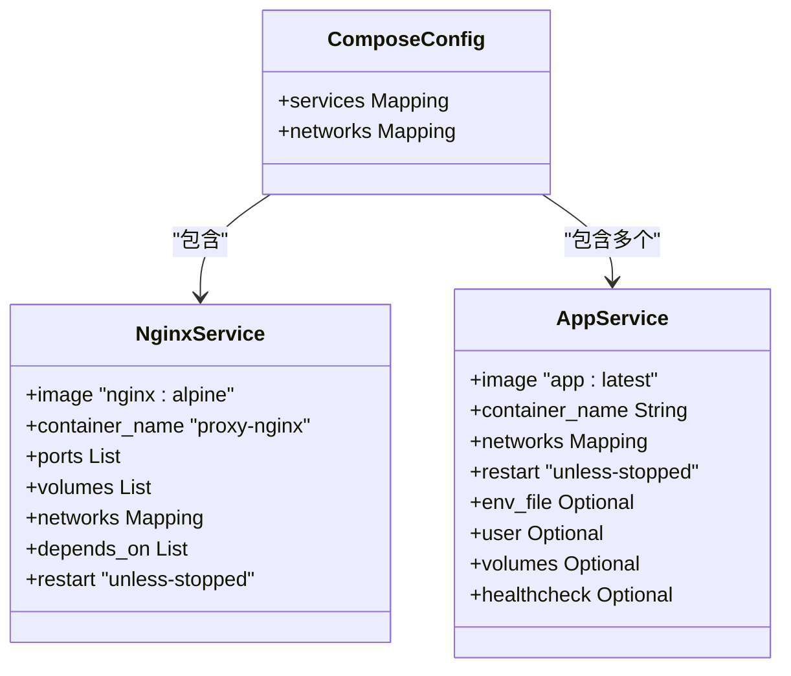
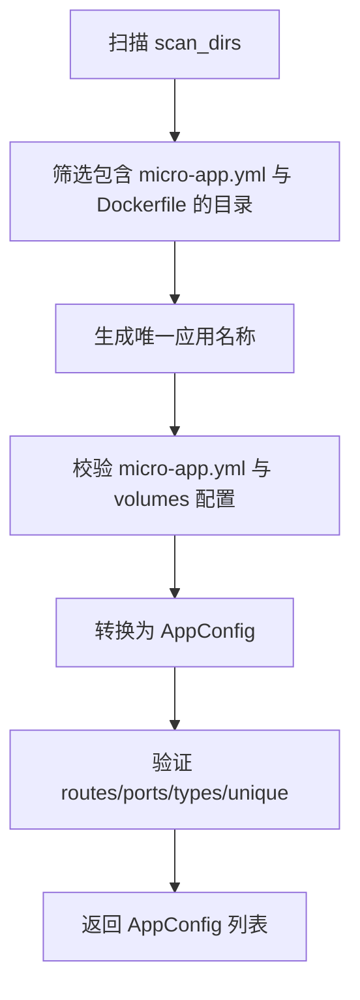
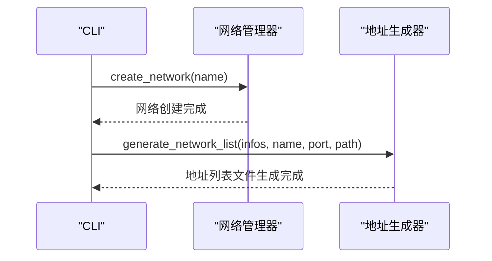
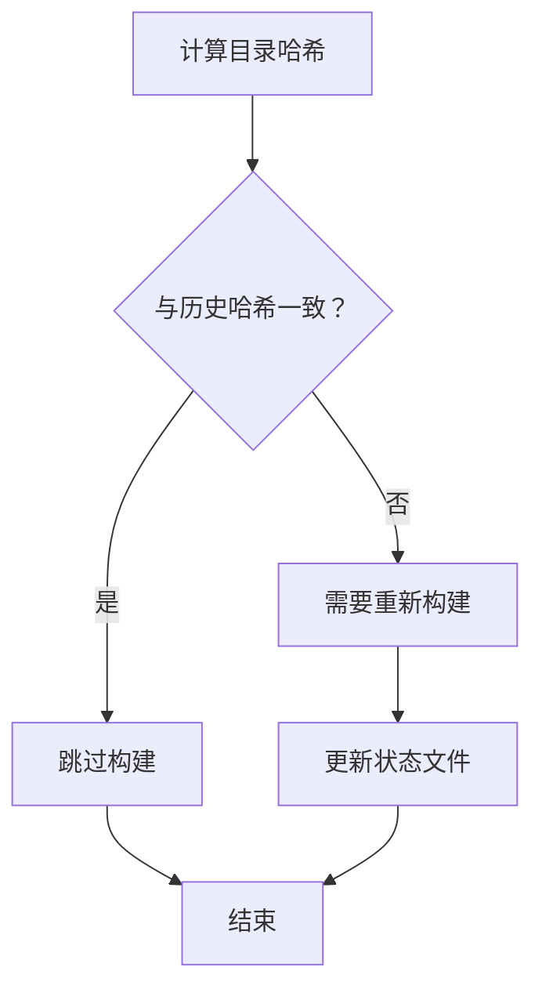
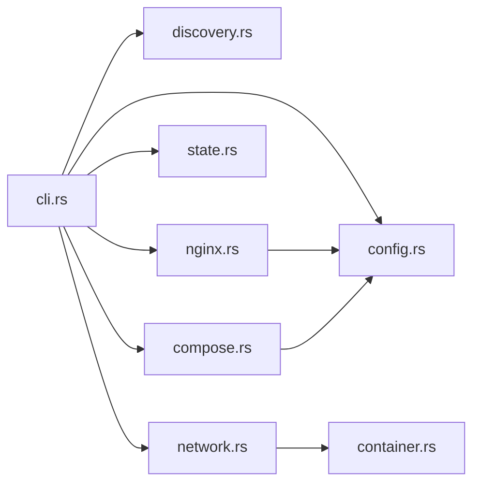

# 反向代理模块

<cite>
**本文档引用的文件**
- [src/lib.rs](file://src/lib.rs)
- [src/main.rs](file://src/main.rs)
- [src/nginx.rs](file://src/nginx.rs)
- [src/config.rs](file://src/config.rs)
- [src/cli.rs](file://src/cli.rs)
- [src/compose.rs](file://src/compose.rs)
- [src/discovery.rs](file://src/discovery.rs)
- [src/state.rs](file://src/state.rs)
- [src/network.rs](file://src/network.rs)
- [src/container.rs](file://src/container.rs)
- [src/micro_app_config.rs](file://src/micro_app_config.rs)
- [src/volumes_config.rs](file://src/volumes_config.rs)
- [Cargo.toml](file://Cargo.toml)
- [README.md](file://README.md)
</cite>

## 目录
1. [简介](#简介)
2. [项目结构](#项目结构)
3. [核心组件](#核心组件)
4. [架构总览](#架构总览)
5. [详细组件分析](#详细组件分析)
6. [依赖关系分析](#依赖关系分析)
7. [性能考虑](#性能考虑)
8. [故障排查指南](#故障排查指南)
9. [结论](#结论)

## 简介
本项目是一个基于 Rust 的微应用管理工具，核心能力包括：自动发现微应用、Docker 镜像构建、容器生命周期管理、Nginx 反向代理配置生成、Docker Compose 编排以及网络管理。反向代理模块负责根据应用配置生成 Nginx 配置，支持虚拟主机、路由规则、上游服务器定义、SSL/TLS 证书管理、动态 DNS 解析、Gzip 压缩、健康检查等。

## 项目结构
该项目采用模块化设计，主要模块如下：
- CLI 层：命令行入口与子命令解析
- 配置层：主配置与微应用配置解析
- 发现层：扫描目录自动发现微应用
- 生成层：Nginx 配置生成、Docker Compose 生成
- 网络层：Docker 网络管理与地址列表生成
- 容器层：容器生命周期管理
- 状态层：基于目录哈希的状态管理

**图表来源**
- [src/main.rs:1-25](file://src/main.rs#L1-L25)
- [src/cli.rs:1-669](file://src/cli.rs#L1-L669)
- [src/config.rs:1-842](file://src/config.rs#L1-L842)
- [src/discovery.rs:1-721](file://src/discovery.rs#L1-L721)
- [src/nginx.rs:1-1101](file://src/nginx.rs#L1-L1101)
- [src/compose.rs:1-905](file://src/compose.rs#L1-L905)
- [src/network.rs:1-397](file://src/network.rs#L1-L397)
- [src/state.rs:1-311](file://src/state.rs#L1-L311)
- [src/container.rs:1-257](file://src/container.rs#L1-L257)

**章节来源**
- [src/lib.rs:1-26](file://src/lib.rs#L1-L26)
- [src/main.rs:1-25](file://src/main.rs#L1-L25)
- [src/cli.rs:1-669](file://src/cli.rs#L1-L669)

## 核心组件
- Nginx 配置生成器：根据应用配置生成 nginx.conf，支持 HTTP/HTTPS、ACME 验证、动态 DNS、路由优先级、静态资源缓存、API 超时等。
- Docker Compose 生成器：生成 docker-compose.yml，自动挂载 nginx.conf、web_root、cert_dir，按应用类型决定健康检查与依赖关系。
- 应用发现器：扫描目录发现微应用，校验 micro-app.yml 与 Dockerfile，生成 AppConfig 列表。
- 网络管理器：创建/删除 Docker 网络，生成网络地址列表，支持微应用间通信。
- 状态管理器：基于目录哈希判断是否需要重新构建镜像，避免不必要的重复构建。
- 容器管理器：封装容器创建、启动、停止、删除与状态查询。

**章节来源**
- [src/nginx.rs:1-1101](file://src/nginx.rs#L1-L1101)
- [src/compose.rs:1-905](file://src/compose.rs#L1-L905)
- [src/discovery.rs:1-721](file://src/discovery.rs#L1-L721)
- [src/network.rs:1-397](file://src/network.rs#L1-L397)
- [src/state.rs:1-311](file://src/state.rs#L1-L311)
- [src/container.rs:1-257](file://src/container.rs#L1-L257)

## 架构总览
反向代理模块在 CLI 的驱动下，通过发现与配置解析获取应用信息，随后生成 Nginx 与 Docker Compose 配置，并通过网络与容器模块完成部署。其核心流程如下：

**图表来源**
- [src/cli.rs:296-463](file://src/cli.rs#L296-L463)
- [src/discovery.rs:235-352](file://src/discovery.rs#L235-L352)
- [src/nginx.rs:26-92](file://src/nginx.rs#L26-L92)
- [src/compose.rs:31-119](file://src/compose.rs#L31-L119)
- [src/network.rs:15-47](file://src/network.rs#L15-L47)
- [src/container.rs:86-111](file://src/container.rs#L86-L111)

## 详细组件分析

### Nginx 配置生成器
- 虚拟主机与监听端口
  - HTTP 监听容器内部端口 80；HTTPS 监听 443。
  - 若配置域名且证书存在，生成 HTTP 重定向 server（80 端口）与 HTTPS server（443 端口）；否则仅生成 HTTP server。
- SSL/TLS 与证书管理
  - 自动检测证书与密钥文件存在性，支持 .crt 与 .cer 扩展名。
  - 证书与密钥路径来自配置的 cert_dir 与 domain。
  - 启用 TLSv1.2/TLSv1.3、常用加密套件、会话缓存与超时。
- 动态 DNS 与上游服务器
  - 为每个应用定义变量 set ${app_upstream_host}，指向容器名称，实现基于 Docker 内部 DNS 的动态解析。
  - location 中通过 proxy_pass http://$host_app_upstream_host:port 转发请求。
- 路由规则与优先级
  - 收集所有 location，按路径长度降序排序，确保更具体的路径（如 /resume_app）优先于通用路径（如 /）。
  - 根路径 "/" 与非根路径 "/prefix" 的处理差异：非根路径使用 rewrite 规则将 URI 重写后再转发，以适配前端 VITE_BASE_URL=/prefix 的场景。
- 静态资源与 API 服务差异化处理
  - Static 应用：启用静态文件缓存（expires 7d）、缓存控制头；根路径直接转发，非根路径重写。
  - API 应用：设置连接/发送/读取超时；禁用缓存；支持注入额外的 nginx 配置片段。
- ACME 验证
  - HTTP 模式下在 HTTP server 中暴露 /.well-known/acme-challenge/；HTTPS 模式下在 HTTP server（80 端口）中处理，HTTPS server 中不重复添加。
- 日志与性能
  - 启用 access_log 与 error_log，配置 gzip 压缩、keepalive_timeout、resolver（禁用 IPv6、缓存 30s）等。

**图表来源**
- [src/nginx.rs:26-92](file://src/nginx.rs#L26-L92)
- [src/nginx.rs:284-416](file://src/nginx.rs#L284-L416)
- [src/nginx.rs:418-536](file://src/nginx.rs#L418-L536)

**章节来源**
- [src/nginx.rs:26-92](file://src/nginx.rs#L26-L92)
- [src/nginx.rs:94-131](file://src/nginx.rs#L94-L131)
- [src/nginx.rs:197-232](file://src/nginx.rs#L197-L232)
- [src/nginx.rs:234-270](file://src/nginx.rs#L234-L270)
- [src/nginx.rs:272-416](file://src/nginx.rs#L272-L416)
- [src/nginx.rs:418-536](file://src/nginx.rs#L418-L536)

### Docker Compose 生成器
- 网络配置
  - 使用外部网络（external: true），名称来自配置；避免 docker-compose 自动生成项目前缀。
- Nginx 服务
  - 镜像：nginx:alpine；容器名：proxy-nginx。
  - 端口映射：8080:80（宿主:容器），若启用 HTTPS 则追加 443:443。
  - 卷挂载：./nginx.conf:/etc/nginx/nginx.conf:ro、web_root、cert_dir。
  - 依赖关系：仅依赖非 Internal 类型的应用容器。
  - 重启策略：unless-stopped。
- 应用服务
  - 镜像：应用名:latest；容器名：container_name。
  - 网络：加入外部网络。
  - 健康检查：Static 与 Api 类型使用 wget 探针；Internal 类型不添加。
  - 环境变量：env_file（可选）。
  - 用户与卷：run_as_user、docker_volumes（可选）。

**图表来源**
- [src/compose.rs:11-16](file://src/compose.rs#L11-L16)
- [src/compose.rs:172-266](file://src/compose.rs#L172-L266)
- [src/compose.rs:277-424](file://src/compose.rs#L277-L424)

**章节来源**
- [src/compose.rs:18-119](file://src/compose.rs#L18-L119)
- [src/compose.rs:121-158](file://src/compose.rs#L121-L158)
- [src/compose.rs:172-266](file://src/compose.rs#L172-L266)
- [src/compose.rs:277-424](file://src/compose.rs#L277-L424)

### 应用发现与配置
- 发现流程
  - 遍历 scan_dirs，筛选包含 micro-app.yml 与 Dockerfile 的目录。
  - 生成唯一应用名称（基于相对路径），校验 container_name 全局唯一。
  - 校验 micro-app.yml 与 volumes 配置有效性。
- 配置转换
  - 将 MicroApp 转换为 AppConfig，填充 routes、container_name、container_port、app_type、docker_volumes、run_as_user 等字段。
- 验证规则
  - Static/Api 类型必须配置 routes；Internal 类型不允许配置 routes。
  - container_name 必须全局唯一；container_port 不能为 0；app_type 必须为 static/api/internal。

**图表来源**
- [src/discovery.rs:235-352](file://src/discovery.rs#L235-L352)
- [src/discovery.rs:121-144](file://src/discovery.rs#L121-L144)
- [src/micro_app_config.rs:55-106](file://src/micro_app_config.rs#L55-L106)
- [src/config.rs:205-367](file://src/config.rs#L205-L367)

**章节来源**
- [src/discovery.rs:235-352](file://src/discovery.rs#L235-L352)
- [src/micro_app_config.rs:35-106](file://src/micro_app_config.rs#L35-L106)
- [src/config.rs:205-367](file://src/config.rs#L205-L367)

### 网络与地址管理
- 网络管理
  - 创建/删除 Docker 网络；检查网络是否存在；使用 external 网络避免重复创建。
- 地址列表
  - 生成网络地址列表文件，包含每个应用的容器名、端口、可访问 URL（Internal 类型为空）。
  - 提供微应用间通信示例（通过容器名与端口访问）。

**图表来源**
- [src/network.rs:15-119](file://src/network.rs#L15-L119)
- [src/network.rs:219-274](file://src/network.rs#L219-L274)

**章节来源**
- [src/network.rs:15-119](file://src/network.rs#L15-L119)
- [src/network.rs:219-274](file://src/network.rs#L219-L274)

### 状态管理与构建优化
- 目录哈希
  - 遍历应用目录（排除 .git），对文件名与内容进行 SHA256 计算，作为变更判断依据。
- 状态文件
  - 记录 app_name、hash、last_built、image_exists；支持加载/保存。
- 构建决策
  - 若状态不存在或 hash 变化，则需要重新构建；支持 --force-rebuild 强制重建。

**图表来源**
- [src/state.rs:188-233](file://src/state.rs#L188-L233)
- [src/state.rs:58-113](file://src/state.rs#L58-L113)

**章节来源**
- [src/state.rs:188-233](file://src/state.rs#L188-L233)
- [src/state.rs:58-113](file://src/state.rs#L58-L113)

## 依赖关系分析
- 模块耦合
  - CLI 依赖发现、配置、网络、状态、Nginx 与 Compose 生成器。
  - Nginx 生成器依赖配置与证书检测。
  - Compose 生成器依赖配置与证书检测。
  - 网络与容器模块相互独立，但被 CLI 调用。
- 外部依赖
  - Docker、docker-compose、nginx、acme.sh（证书申请与验证）。

**图表来源**
- [src/cli.rs:1-669](file://src/cli.rs#L1-L669)
- [src/nginx.rs:1-1101](file://src/nginx.rs#L1-L1101)
- [src/compose.rs:1-905](file://src/compose.rs#L1-L905)
- [src/network.rs:1-397](file://src/network.rs#L1-L397)
- [src/container.rs:1-257](file://src/container.rs#L1-L257)

**章节来源**
- [src/cli.rs:1-669](file://src/cli.rs#L1-L669)

## 性能考虑
- 动态 DNS 与解析缓存
  - 使用 resolver 127.0.0.11 valid=30s ipv6=off，减少 DNS 延迟并避免 IPv6 解析开销。
- 连接与传输优化
  - keepalive_timeout 设置为 65；启用 gzip 压缩；sendfile/tcp_nopush/tcp_nodelay 提升传输效率。
- 路由优先级
  - location 按路径长度降序排序，确保更具体路径优先匹配，减少误匹配与重写次数。
- 上游解析
  - 通过变量 set ${app_upstream_host} 指向容器名，利用 Docker 内部 DNS，避免硬编码 IP。
- API 超时
  - API 服务设置 proxy_connect_timeout、proxy_send_timeout、proxy_read_timeout，避免长时间阻塞。
- 静态资源缓存
  - Static 应用启用 expires 7d 与 Cache-Control，降低带宽与服务器压力。

**章节来源**
- [src/nginx.rs:146-195](file://src/nginx.rs#L146-L195)
- [src/nginx.rs:388-411](file://src/nginx.rs#L388-L411)
- [src/nginx.rs:505-515](file://src/nginx.rs#L505-L515)
- [src/nginx.rs:481-484](file://src/nginx.rs#L481-L484)

## 故障排查指南
- 日志与诊断
  - 使用 -v 显示详细日志；查看 micro_proxy.log 与容器日志（docker logs）。
  - 验证 Nginx 配置语法：docker exec proxy-nginx nginx -t。
- 端口冲突
  - 检查宿主机端口占用（sudo lsof -i :80/:8080），修改 proxy-config.yml 中的 nginx_host_port。
- SSL 证书
  - 确认证书与密钥文件存在且路径正确；HTTPS 模式下 80 端口应重定向至 443。
  - 使用 curl -k https://your-domain.com 测试 HTTPS 连接。
- 卷挂载与权限
  - 检查宿主机路径存在性与权限；查看容器内挂载点；必要时生成权限初始化脚本。
- 网络连通性
  - 使用 micro_proxy network 生成地址列表，确认 Internal 应用可通过容器名访问。
- 构建与镜像
  - 使用 --force-rebuild 强制重建；检查镜像是否存在（builder::image_exists）。

**章节来源**
- [README.md:328-420](file://README.md#L328-L420)
- [src/container.rs:185-242](file://src/container.rs#L185-L242)

## 结论
反向代理模块通过 Nginx 配置生成器与 Compose 生成器，实现了灵活的虚拟主机、路由规则、上游服务器动态解析与 SSL/TLS 证书管理。结合状态管理与网络管理，提供了高效、可维护的微应用统一入口。建议在生产环境中配合健康检查、超时设置、缓存策略与安全头配置，进一步提升稳定性与安全性。