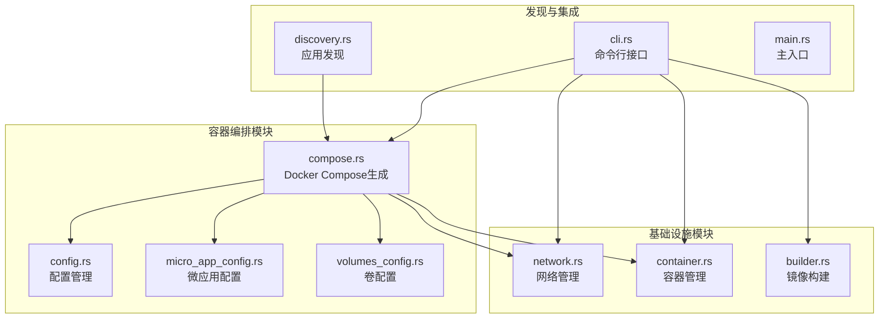
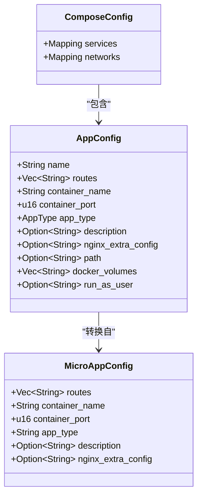
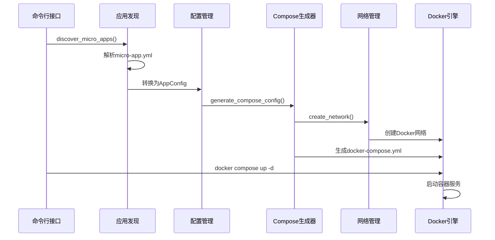
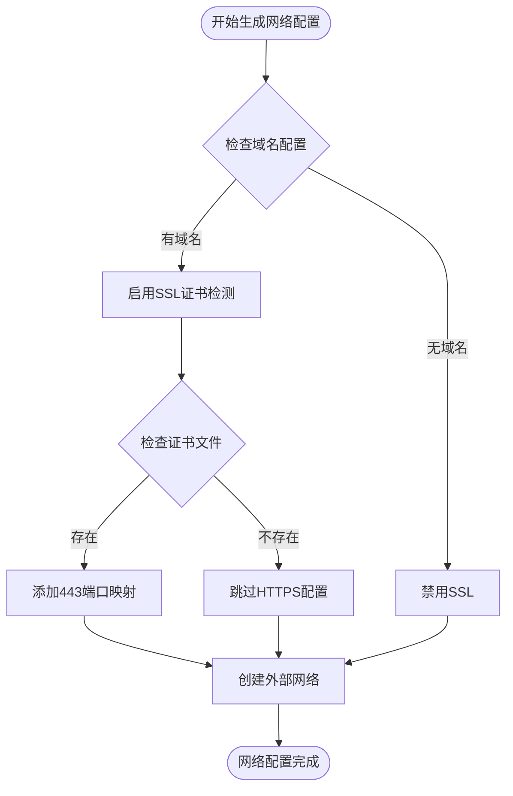
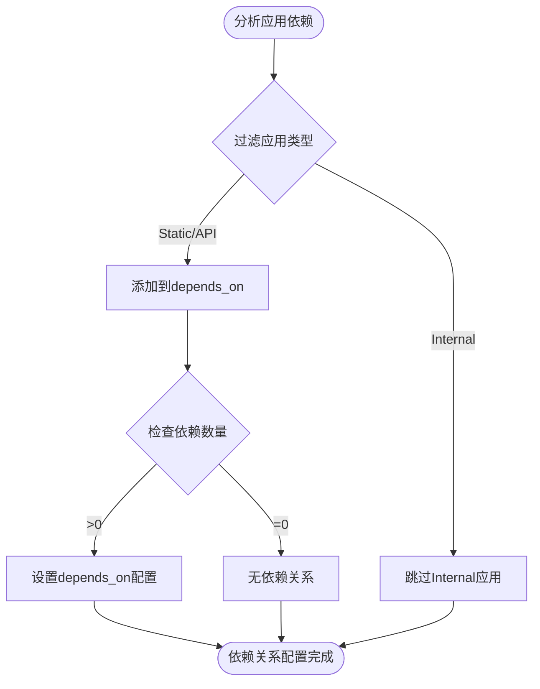
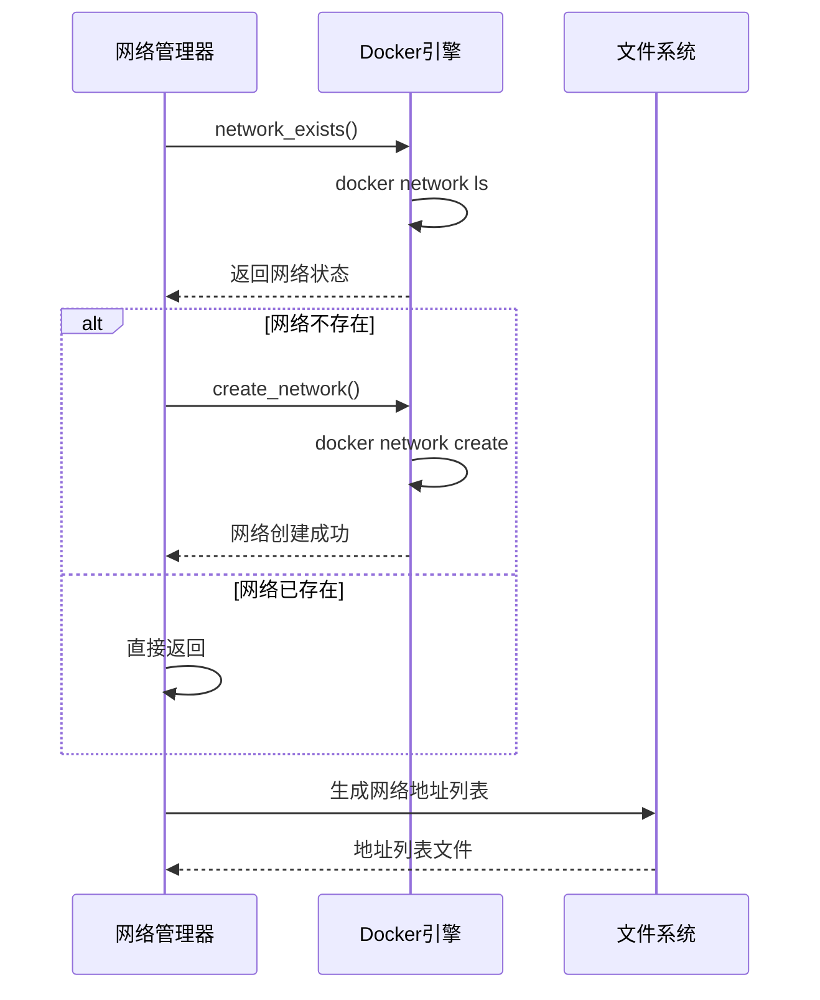
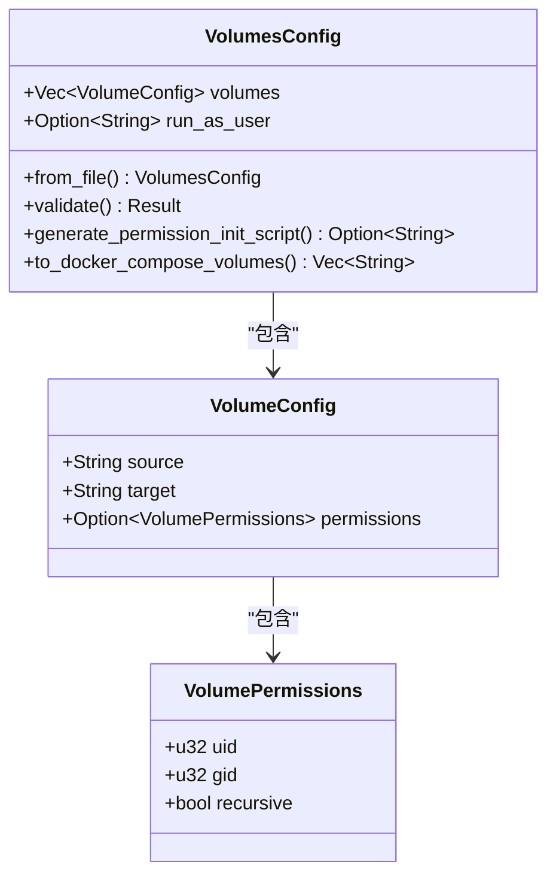
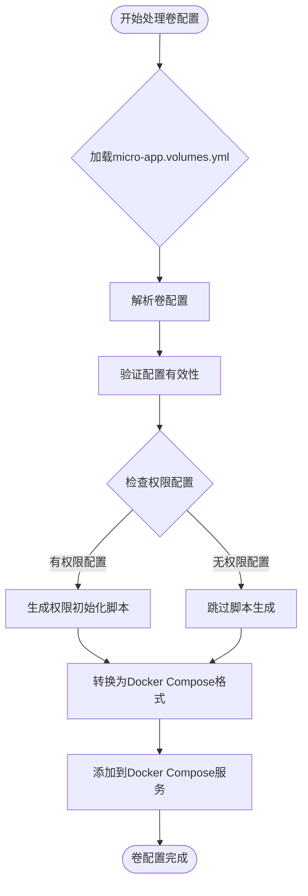
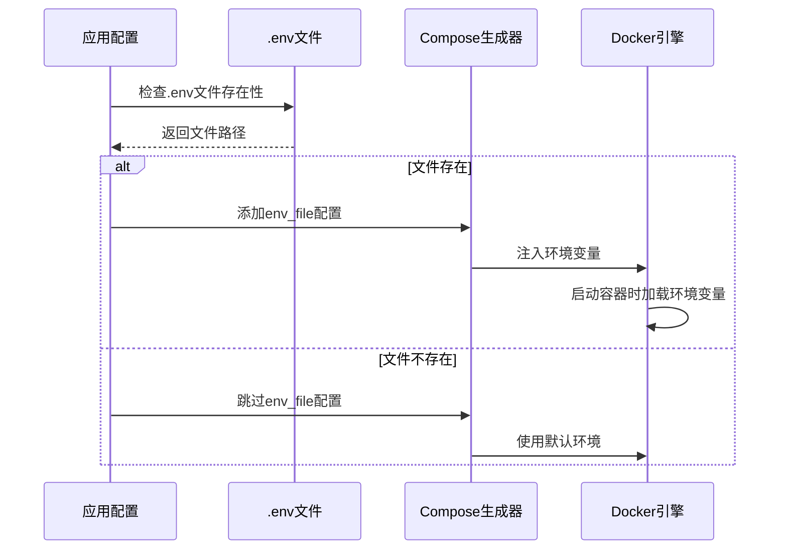
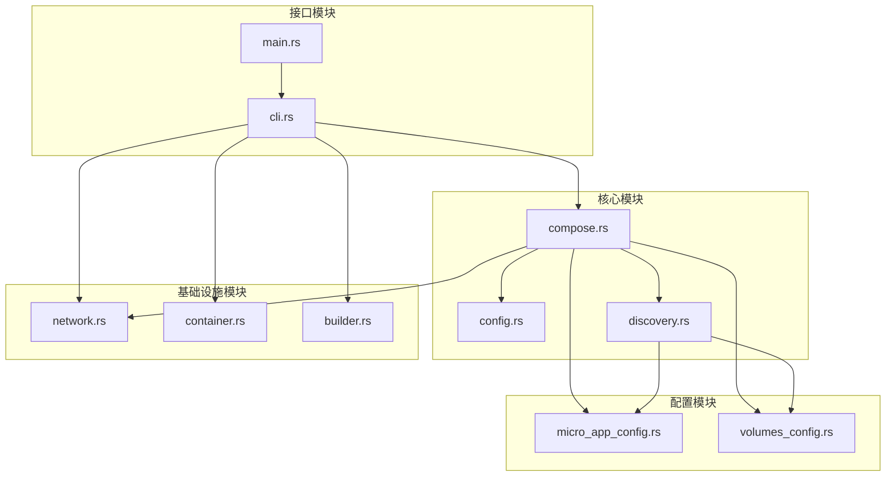

# 容器编排模块

<cite>
**本文档引用的文件**
- [compose.rs](file://src/compose.rs)
- [config.rs](file://src/config.rs)
- [micro_app_config.rs](file://src/micro_app_config.rs)
- [volumes_config.rs](file://src/volumes_config.rs)
- [network.rs](file://src/network.rs)
- [container.rs](file://src/container.rs)
- [discovery.rs](file://src/discovery.rs)
- [cli.rs](file://src/cli.rs)
- [builder.rs](file://src/builder.rs)
- [lib.rs](file://src/lib.rs)
- [main.rs](file://src/main.rs)
- [Cargo.toml](file://Cargo.toml)
</cite>

## 目录
1. [简介](#简介)
2. [项目结构](#项目结构)
3. [核心组件](#核心组件)
4. [架构概览](#架构概览)
5. [详细组件分析](#详细组件分析)
6. [依赖关系分析](#依赖关系分析)
7. [性能考虑](#性能考虑)
8. [故障排除指南](#故障排除指南)
9. [结论](#结论)

## 简介

容器编排模块是 micro_proxy 工具的核心组件，负责生成和管理 Docker Compose 配置文件，实现微应用的自动化部署和编排。该模块通过解析微应用配置、生成 Docker Compose 文件、管理网络配置和卷挂载，实现了完整的容器化微服务编排解决方案。

该模块支持多种应用类型（静态网站、API服务、内部服务），提供灵活的网络配置、环境变量管理和健康检查机制，确保微应用之间的协调运行和高效管理。

## 项目结构

容器编排模块采用模块化设计，主要包含以下核心文件：



**图表来源**
- [compose.rs:1-905](file://src/compose.rs#L1-L905)
- [config.rs:1-842](file://src/config.rs#L1-L842)
- [discovery.rs:1-721](file://src/discovery.rs#L1-L721)

**章节来源**
- [lib.rs:1-26](file://src/lib.rs#L1-L26)
- [Cargo.toml:1-55](file://Cargo.toml#L1-L55)

## 核心组件

### Docker Compose 配置生成器

Docker Compose 配置生成器是模块的核心组件，负责将微应用配置转换为标准的 Docker Compose YAML 文件。

#### 主要功能特性

1. **服务定义生成**：为每个微应用生成对应的 Docker Compose 服务配置
2. **网络配置管理**：创建和管理 Docker 网络，支持外部网络复用
3. **卷挂载处理**：处理应用数据持久化和配置文件挂载
4. **环境变量注入**：支持 .env 文件的自动加载和注入
5. **健康检查配置**：为 HTTP 服务自动添加健康检查机制

#### 关键数据结构



**图表来源**
- [compose.rs:11-16](file://src/compose.rs#L11-L16)
- [config.rs:24-68](file://src/config.rs#L24-L68)
- [micro_app_config.rs:10-33](file://src/micro_app_config.rs#L10-L33)

**章节来源**
- [compose.rs:31-119](file://src/compose.rs#L31-L119)
- [config.rs:24-68](file://src/config.rs#L24-L68)

### 应用类型管理系统

系统支持三种应用类型，每种类型具有不同的编排特性和配置要求：

| 应用类型 | 描述 | 网络代理 | 健康检查 | 卷配置 |
|---------|------|----------|----------|--------|
| Static | 静态网站 | ✅ 支持 | ✅ HTTP健康检查 | ✅ 卷挂载 |
| Api | API服务 | ✅ 支持 | ✅ HTTP健康检查 | ✅ 卷挂载 |
| Internal | 内部服务 | ❌ 不代理 | ❌ 无HTTP检查 | ✅ 卷挂载 |

**章节来源**
- [config.rs:11-21](file://src/config.rs#L11-L21)
- [compose.rs:358-421](file://src/compose.rs#L358-L421)

## 架构概览

容器编排模块采用分层架构设计，确保各组件职责清晰、耦合度低：



**图表来源**
- [cli.rs:296-463](file://src/cli.rs#L296-L463)
- [discovery.rs:235-352](file://src/discovery.rs#L235-L352)
- [compose.rs:31-119](file://src/compose.rs#L31-L119)
- [network.rs:15-47](file://src/network.rs#L15-L47)

## 详细组件分析

### Docker Compose 配置生成流程

#### 1. 网络配置生成

系统采用外部网络管理模式，确保多个微应用可以共享同一个 Docker 网络：



**图表来源**
- [compose.rs:54-69](file://src/compose.rs#L54-L69)
- [compose.rs:129-158](file://src/compose.rs#L129-L158)

#### 2. 服务依赖关系管理

系统智能识别服务间的依赖关系，确保容器启动顺序正确：



**图表来源**
- [compose.rs:236-257](file://src/compose.rs#L236-L257)
- [config.rs:354-359](file://src/config.rs#L354-L359)

#### 3. 健康检查配置

系统为 HTTP 服务自动配置健康检查机制：

| 应用类型 | 健康检查类型 | 检查间隔 | 超时时间 | 重试次数 |
|---------|-------------|----------|----------|----------|
| Static | HTTP GET | 30秒 | 10秒 | 3次 |
| Api | HTTP GET | 30秒 | 10秒 | 3次 |
| Internal | 无 | - | - | - |

**章节来源**
- [compose.rs:360-421](file://src/compose.rs#L360-L421)

### 网络配置管理

#### Docker 网络创建流程



**图表来源**
- [network.rs:15-47](file://src/network.rs#L15-L47)
- [network.rs:88-119](file://src/network.rs#L88-L119)

#### 网络地址信息生成

系统为每个微应用生成网络地址信息，支持内部服务间通信：

| 属性 | Static/Internal 应用 | API 应用 |
|------|---------------------|----------|
| 容器名称 | 容器名称 | 容器名称 |
| 网络地址 | 应用名称（作为主机名） | 应用名称 |
| 访问地址 | http://localhost:port | http://localhost:port/route |
| 可访问性 | 通过Nginx代理 | 通过Nginx代理 |

**章节来源**
- [network.rs:121-207](file://src/network.rs#L121-L207)

### 卷配置管理

#### 卷权限配置系统

系统提供完整的卷权限管理机制，确保数据安全和访问控制：



**图表来源**
- [volumes_config.rs:44-53](file://src/volumes_config.rs#L44-L53)
- [volumes_config.rs:29-41](file://src/volumes_config.rs#L29-L41)

#### 卷挂载处理流程



**图表来源**
- [volumes_config.rs:55-82](file://src/volumes_config.rs#L55-L82)
- [volumes_config.rs:145-205](file://src/volumes_config.rs#L145-L205)

**章节来源**
- [volumes_config.rs:55-205](file://src/volumes_config.rs#L55-L205)

### 环境变量管理

#### 环境变量文件处理

系统支持自动加载和注入 .env 文件，提供灵活的配置管理：



**图表来源**
- [compose.rs:314-323](file://src/compose.rs#L314-L323)
- [cli.rs:382-399](file://src/cli.rs#L382-L399)

#### 配置注入机制

系统支持多种配置注入方式：

1. **静态配置注入**：通过 .env 文件提供静态环境变量
2. **动态配置注入**：通过 Docker Compose 的 env_file 字段自动注入
3. **运行时配置**：通过容器启动参数动态传递

**章节来源**
- [compose.rs:314-332](file://src/compose.rs#L314-L332)

## 依赖关系分析

### 模块间依赖关系



**图表来源**
- [lib.rs:6-18](file://src/lib.rs#L6-L18)
- [cli.rs:6-18](file://src/cli.rs#L6-L18)

### 外部依赖分析

系统依赖的关键外部组件：

| 依赖组件 | 版本 | 用途 | 重要性 |
|---------|------|------|--------|
| Docker Engine | 最新版本 | 容器运行 | 核心 |
| Docker Compose | v2+ | 编排管理 | 核心 |
| Nginx | alpine | 反向代理 | 核心 |
| Rust 2021 | - | 开发语言 | 基础 |
| serde_yaml | 0.9 | 配置解析 | 基础 |

**章节来源**
- [Cargo.toml:13-52](file://Cargo.toml#L13-L52)

## 性能考虑

### 启动性能优化

1. **并行构建**：支持多应用并行构建，提高构建效率
2. **缓存利用**：智能利用 Docker 构建缓存，减少重复构建
3. **增量更新**：仅对变更的应用进行重新构建和部署

### 资源使用优化

1. **内存管理**：合理配置容器内存限制，避免资源争用
2. **CPU分配**：为不同类型的微应用分配合适的 CPU 资源
3. **存储优化**：通过卷配置实现数据持久化和共享

### 网络性能优化

1. **网络隔离**：使用独立的 Docker 网络，避免网络冲突
2. **负载均衡**：通过 Nginx 实现请求分发和负载均衡
3. **连接池**：优化内部服务间的连接管理

## 故障排除指南

### 常见问题及解决方案

#### 1. Docker Compose 配置生成失败

**症状**：生成 docker-compose.yml 失败，出现序列化错误

**可能原因**：
- 配置数据结构不正确
- YAML 序列化异常
- 文件权限问题

**解决步骤**：
1. 检查应用配置的完整性
2. 验证 YAML 格式的正确性
3. 确认输出目录的写入权限

#### 2. 网络创建失败

**症状**：Docker 网络创建失败，提示网络已存在或权限不足

**可能原因**：
- Docker 网络名称冲突
- Docker 服务未运行
- 权限不足

**解决步骤**：
1. 检查 Docker 服务状态
2. 验证网络名称的唯一性
3. 确认 Docker 权限配置

#### 3. 健康检查失败

**症状**：容器健康检查失败，服务无法正常启动

**可能原因**：
- 应用未正确监听端口
- 健康检查路径配置错误
- 应用启动超时

**解决步骤**：
1. 检查应用的端口监听配置
2. 验证健康检查路径的可达性
3. 调整健康检查超时参数

#### 4. 卷挂载权限问题

**症状**：容器无法访问挂载的卷，出现权限错误

**可能原因**：
- 卷权限配置不正确
- 主机目录权限不足
- SELinux/AppArmor 限制

**解决步骤**：
1. 检查卷权限配置的 UID/GID 设置
2. 验证主机目录的访问权限
3. 检查系统安全策略配置

### 调试技巧

#### 1. 启用详细日志

```bash
micro_proxy --verbose start
```

#### 2. 检查中间状态

```bash
micro_proxy status
micro_proxy network
```

#### 3. 手动验证配置

```bash
# 检查生成的 docker-compose.yml
cat docker-compose.yml

# 验证 Docker 配置
docker compose config
```

**章节来源**
- [cli.rs:550-584](file://src/cli.rs#L550-L584)
- [compose.rs:426-448](file://src/compose.rs#L426-L448)

## 结论

容器编排模块提供了完整的微应用容器化解决方案，通过模块化设计和清晰的职责分离，实现了高效的微服务编排管理。该模块的主要优势包括：

1. **灵活性**：支持多种应用类型和配置选项
2. **可靠性**：完善的错误处理和故障恢复机制
3. **可维护性**：清晰的代码结构和详细的文档
4. **可扩展性**：模块化设计便于功能扩展和定制

通过合理的配置管理和优化策略，该模块能够满足各种规模的微服务部署需求，为现代应用开发和运维提供强有力的支持。