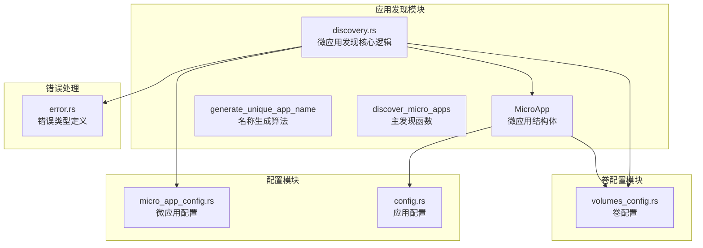
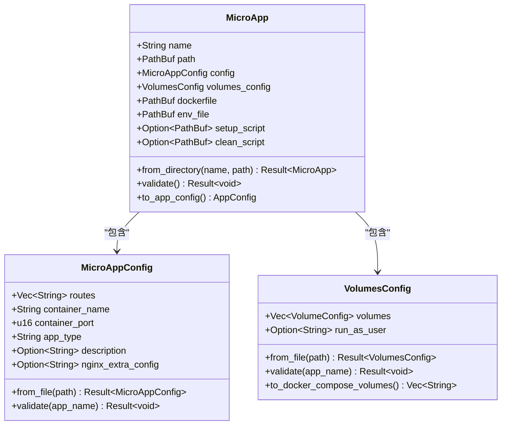
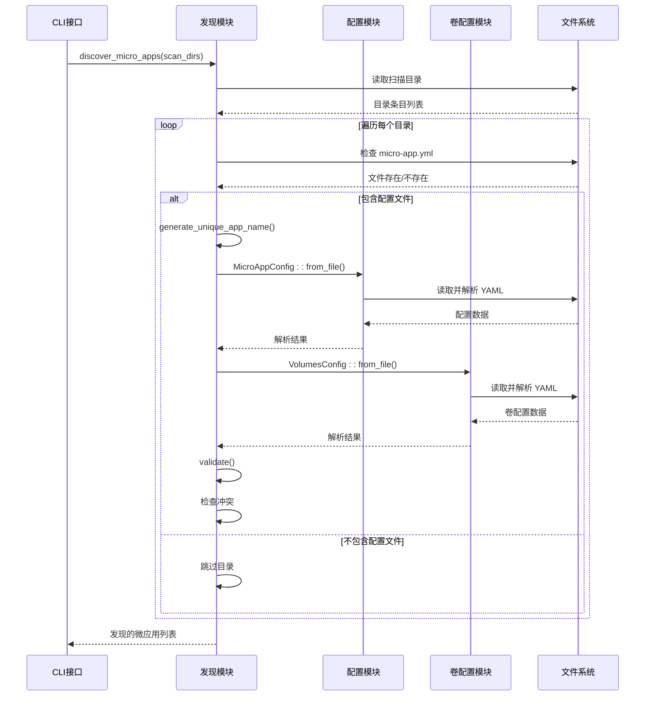
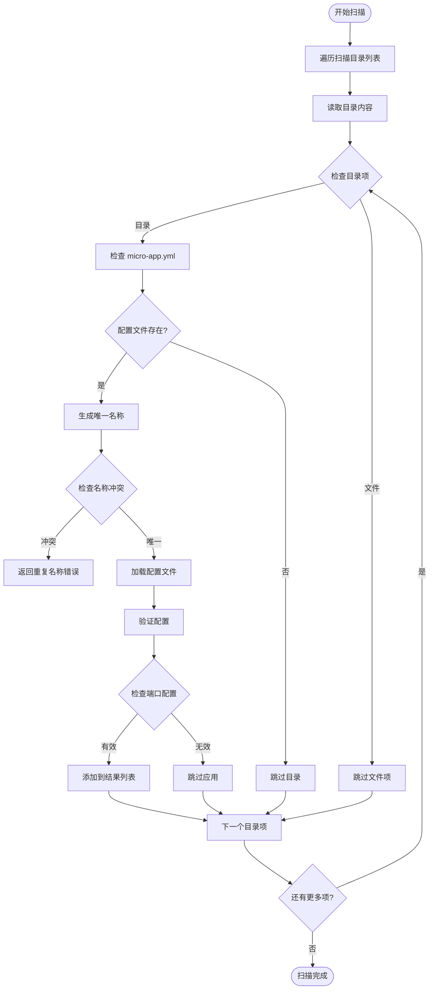
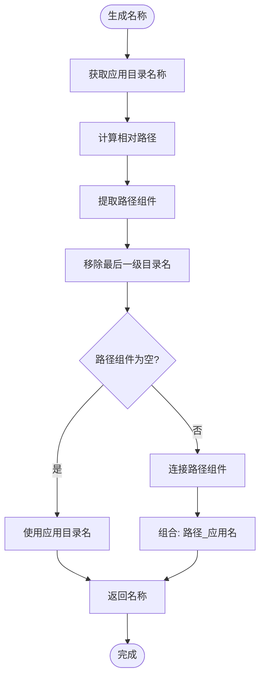
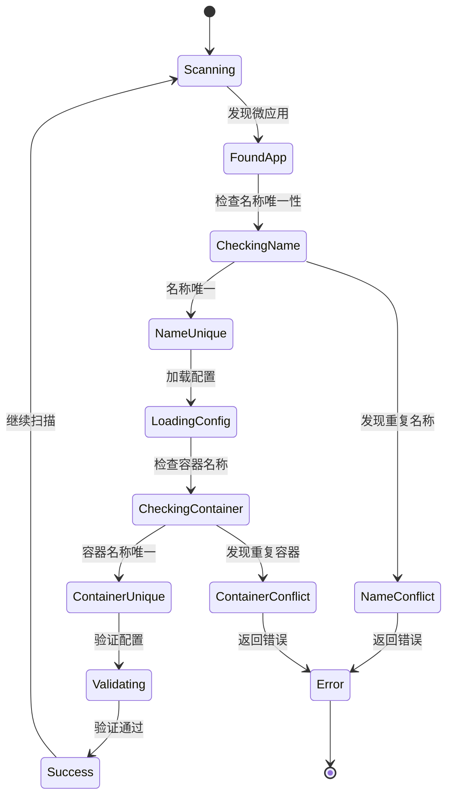
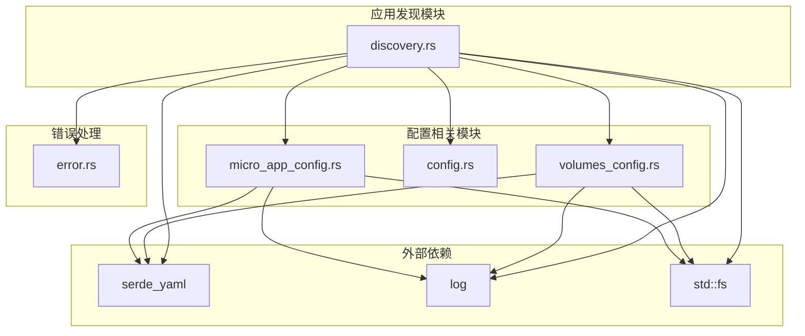

# 应用发现模块

<cite>
**本文档引用的文件**
- [discovery.rs](file://src/discovery.rs)
- [micro_app_config.rs](file://src/micro_app_config.rs)
- [volumes_config.rs](file://src/volumes_config.rs)
- [config.rs](file://src/config.rs)
- [lib.rs](file://src/lib.rs)
- [error.rs](file://src/error.rs)
- [main.rs](file://src/main.rs)
- [proxy-config.yml.example](file://proxy-config.yml.example)
- [micro-app-development.md](file://docs/micro-app-development.md)
</cite>

## 目录
1. [简介](#简介)
2. [项目结构](#项目结构)
3. [核心组件](#核心组件)
4. [架构概览](#架构概览)
5. [详细组件分析](#详细组件分析)
6. [依赖关系分析](#依赖关系分析)
7. [性能考虑](#性能考虑)
8. [故障排除指南](#故障排除指南)
9. [结论](#结论)

## 简介

应用发现模块是 micro_proxy 系统的核心组件之一，负责自动扫描和识别微应用目录，发现包含特定配置文件的微应用实例。该模块实现了复杂的目录扫描逻辑、文件检测机制和冲突检测策略，确保微应用的正确发现和配置。

该模块的主要功能包括：
- 扫描指定目录树，识别包含微应用配置文件的目录
- 验证微应用配置的完整性和有效性
- 生成唯一的微应用名称，避免命名冲突
- 提供与配置模块和卷配置模块的协作机制
- 实现健壮的错误处理和日志记录

## 项目结构

应用发现模块位于 `src/discovery.rs` 文件中，与相关的配置模块紧密集成：

**图表来源**
- [discovery.rs:1-721](file://src/discovery.rs#L1-L721)
- [micro_app_config.rs:1-235](file://src/micro_app_config.rs#L1-L235)
- [volumes_config.rs:1-426](file://src/volumes_config.rs#L1-L426)
- [config.rs:1-842](file://src/config.rs#L1-L842)

**章节来源**
- [discovery.rs:1-721](file://src/discovery.rs#L1-L721)
- [lib.rs:1-26](file://src/lib.rs#L1-L26)

## 核心组件

### MicroApp 结构体

MicroApp 是应用发现模块的核心数据结构，代表一个已发现的微应用实例：

**图表来源**
- [discovery.rs:12-145](file://src/discovery.rs#L12-L145)
- [micro_app_config.rs:10-107](file://src/micro_app_config.rs#L10-L107)
- [volumes_config.rs:43-205](file://src/volumes_config.rs#L43-L205)

### 微应用配置验证规则

微应用配置包含严格的验证规则，确保配置的完整性和有效性：

| 字段 | 必需性 | 验证规则 | 错误类型 |
|------|--------|----------|----------|
| routes | static/api必需 | 非空且为数组 | Config |
| container_name | 必需 | 非空字符串 | Config |
| container_port | 必需 | 大于0的整数 | Config |
| app_type | 必需 | "static"、"api"或"internal" | Config |
| description | 可选 | 字符串或null | 无 |
| nginx_extra_config | 可选 | 字符串或null | 无 |

**章节来源**
- [micro_app_config.rs:55-106](file://src/micro_app_config.rs#L55-L106)

## 架构概览

应用发现模块采用分层架构设计，实现了清晰的关注点分离：

**图表来源**
- [discovery.rs:235-352](file://src/discovery.rs#L235-L352)
- [discovery.rs:49-91](file://src/discovery.rs#L49-L91)

## 详细组件分析

### 目录扫描逻辑

应用发现模块实现了深度优先的目录扫描策略：

**图表来源**
- [discovery.rs:253-352](file://src/discovery.rs#L253-L352)

### 微应用名称生成算法

名称生成算法确保微应用的唯一性，通过组合扫描目录的相对路径和应用目录名称：

**图表来源**
- [discovery.rs:159-222](file://src/discovery.rs#L159-L222)

### 冲突检测策略

应用发现模块实施双重冲突检测机制：

1. **微应用名称冲突检测**：确保所有发现的微应用具有唯一名称
2. **容器名称冲突检测**：确保所有微应用的容器名称唯一

**图表来源**
- [discovery.rs:300-347](file://src/discovery.rs#L300-L347)

**章节来源**
- [discovery.rs:235-352](file://src/discovery.rs#L235-L352)

### 微应用验证机制

验证过程包含多个层次的检查：

1. **文件存在性验证**：确保必需文件存在
2. **配置完整性验证**：检查配置字段的有效性
3. **卷配置验证**：验证卷映射和权限设置
4. **容器名称唯一性验证**：确保容器名称不冲突

**章节来源**
- [discovery.rs:94-119](file://src/discovery.rs#L94-L119)
- [micro_app_config.rs:55-106](file://src/micro_app_config.rs#L55-L106)
- [volumes_config.rs:84-143](file://src/volumes_config.rs#L84-L143)

## 依赖关系分析

应用发现模块与系统其他组件的依赖关系如下：

**图表来源**
- [discovery.rs:6-10](file://src/discovery.rs#L6-L10)
- [micro_app_config.rs:6-8](file://src/micro_app_config.rs#L6-L8)
- [volumes_config.rs:6-8](file://src/volumes_config.rs#L6-L8)

**章节来源**
- [discovery.rs:6-10](file://src/discovery.rs#L6-L10)
- [micro_app_config.rs:6-8](file://src/micro_app_config.rs#L6-L8)
- [volumes_config.rs:6-8](file://src/volumes_config.rs#L6-L8)

## 性能考虑

### 时间复杂度分析

应用发现模块的时间复杂度主要取决于以下因素：

- **目录扫描复杂度**：O(N) 其中 N 是扫描目录中的文件和子目录数量
- **配置文件解析复杂度**：O(M) 其中 M 是配置文件的大小
- **冲突检测复杂度**：O(K) 其中 K 是已发现的微应用数量

总体时间复杂度为 O(N + M + K)，在大多数情况下表现良好。

### 内存使用优化

1. **延迟加载策略**：只在需要时加载配置文件
2. **增量验证**：逐个验证微应用，避免一次性加载所有配置
3. **哈希集合作为缓存**：使用 HashSet 进行快速冲突检测

### I/O 操作优化

1. **批量文件操作**：减少系统调用次数
2. **错误处理优化**：及时捕获和报告文件系统错误
3. **日志级别控制**：根据需要调整日志详细程度

## 故障排除指南

### 常见错误类型及解决方案

| 错误类型 | 错误消息 | 可能原因 | 解决方案 |
|----------|----------|----------|----------|
| Discovery | 无法获取应用目录名称 | 目录路径无效 | 检查目录权限和路径有效性 |
| Discovery | 无法计算相对路径 | 路径不在扫描目录范围内 | 确保应用目录在扫描目录内 |
| Discovery | 发现重复的微应用名称 | 相同名称的应用存在于不同扫描目录 | 修改应用名称或调整扫描目录结构 |
| Discovery | 发现重复的容器名称 | 多个应用使用相同容器名称 | 为应用分配唯一容器名称 |
| Config | container_name 不能为空 | micro-app.yml 配置缺失 | 检查并修复配置文件 |
| Config | container_port 不能为 0 | 端口配置无效 | 设置有效的容器端口号 |
| Config | app_type 无效 | 应用类型配置错误 | 使用 "static"、"api" 或 "internal" |

### 调试技巧

1. **启用详细日志**：使用 `--verbose` 标志获取详细的调试信息
2. **检查文件权限**：确保应用目录具有适当的读取权限
3. **验证配置文件格式**：使用 YAML 验证工具检查配置文件语法
4. **逐步排查**：从最小化的扫描目录开始，逐步扩大范围

**章节来源**
- [error.rs:5-46](file://src/error.rs#L5-L46)
- [discovery.rs:94-119](file://src/discovery.rs#L94-L119)

## 结论

应用发现模块通过精心设计的算法和严格的验证机制，为 micro_proxy 系统提供了可靠的微应用识别和管理能力。其核心特点包括：

1. **智能目录扫描**：高效的目录遍历和文件检测机制
2. **唯一性保证**：双重冲突检测确保应用名称和容器名称的唯一性
3. **配置完整性验证**：全面的配置验证规则确保应用配置的有效性
4. **模块化设计**：清晰的组件分离便于维护和扩展
5. **健壮的错误处理**：完善的错误处理和日志记录机制

该模块的成功实现为整个 micro_proxy 系统奠定了坚实的基础，为微应用的自动化管理和部署提供了强有力的支持。