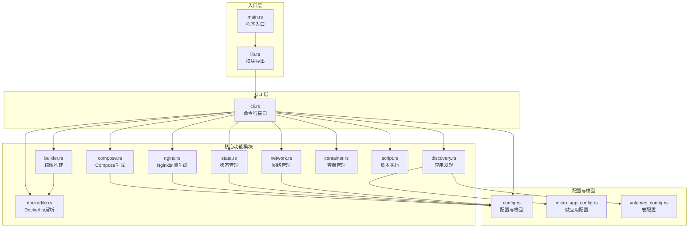
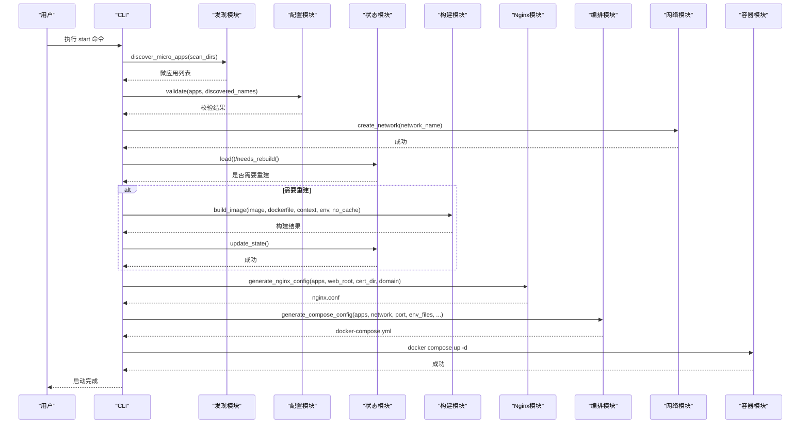
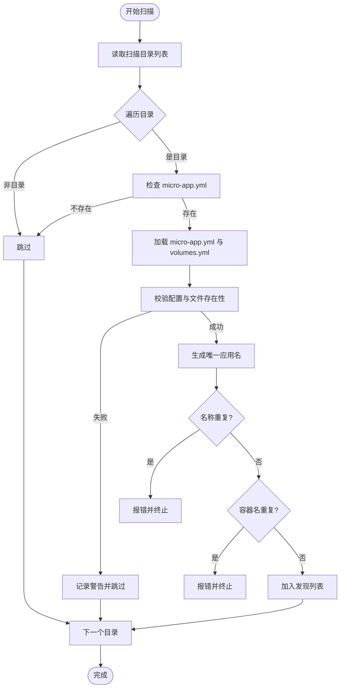
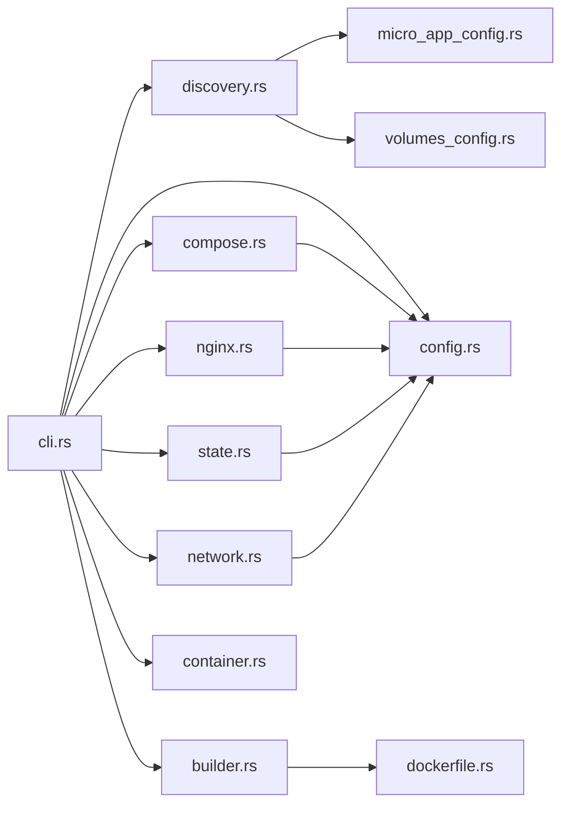
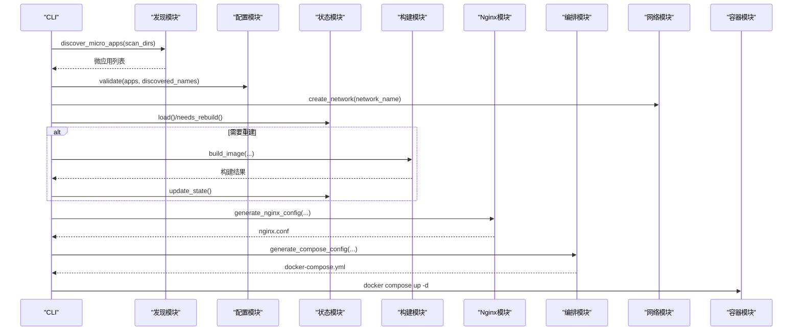

# 模块设计

<cite>
**本文档引用的文件**
- [lib.rs](file://src/lib.rs)
- [main.rs](file://src/main.rs)
- [cli.rs](file://src/cli.rs)
- [config.rs](file://src/config.rs)
- [discovery.rs](file://src/discovery.rs)
- [builder.rs](file://src/builder.rs)
- [compose.rs](file://src/compose.rs)
- [nginx.rs](file://src/nginx.rs)
- [state.rs](file://src/state.rs)
- [network.rs](file://src/network.rs)
- [container.rs](file://src/container.rs)
- [dockerfile.rs](file://src/dockerfile.rs)
- [micro_app_config.rs](file://src/micro_app_config.rs)
- [volumes_config.rs](file://src/volumes_config.rs)
- [script.rs](file://src/script.rs)
- [Cargo.toml](file://Cargo.toml)
- [README.md](file://README.md)
</cite>

## 目录
1. [引言](#引言)
2. [项目结构](#项目结构)
3. [核心组件](#核心组件)
4. [架构总览](#架构总览)
5. [详细组件分析](#详细组件分析)
6. [依赖关系分析](#依赖关系分析)
7. [性能考虑](#性能考虑)
8. [故障排查指南](#故障排查指南)
9. [结论](#结论)
10. [附录](#附录)

## 引言
本设计文档面向 micro_proxy 的核心模块架构，系统性阐述发现模块(discovery)、构建模块(builder)、编排模块(compose)、代理模块(nginx)、状态模块(state)和网络模块(network)的设计理念、职责边界、接口定义与内部实现细节。文档还解释模块间的依赖关系与通信机制，总结可扩展性与插件化设计，并提供模块交互序列图、接口规范与最佳实践。

## 项目结构
micro_proxy 采用模块化设计，核心模块均位于 src 目录下，通过 lib.rs 汇总导出，main.rs 作为 CLI 入口调用 lib.rs 暴露的模块。Cargo.toml 定义了依赖与功能特性，README.md 提供使用说明与配置示例。

**图表来源**
- [lib.rs:6-18](file://src/lib.rs#L6-L18)
- [main.rs:3-4](file://src/main.rs#L3-L4)
- [cli.rs:6-19](file://src/cli.rs#L6-L19)
- [config.rs:11-842](file://src/config.rs#L11-L842)
- [discovery.rs:6-10](file://src/discovery.rs#L6-L10)
- [builder.rs:5-7](file://src/builder.rs#L5-L7)
- [compose.rs:6-9](file://src/compose.rs#L6-L9)
- [nginx.rs:7-8](file://src/nginx.rs#L7-L8)
- [state.rs:5-11](file://src/state.rs#L5-L11)
- [network.rs:5-6](file://src/network.rs#L5-L6)
- [container.rs:5-6](file://src/container.rs#L5-L6)
- [dockerfile.rs:5-7](file://src/dockerfile.rs#L5-L7)
- [micro_app_config.rs:6-8](file://src/micro_app_config.rs#L6-L8)
- [volumes_config.rs:6-8](file://src/volumes_config.rs#L6-L8)
- [script.rs:5-7](file://src/script.rs#L5-L7)

**章节来源**
- [lib.rs:1-26](file://src/lib.rs#L1-L26)
- [main.rs:1-25](file://src/main.rs#L1-L25)
- [Cargo.toml:1-55](file://Cargo.toml#L1-L55)

## 核心组件
- 发现模块(discovery): 扫描目录，发现包含 micro-app.yml 与 Dockerfile 的微应用，生成 MicroApp 结构并进行校验。
- 构建模块(builder): 调用 docker build 构建镜像，支持环境变量注入与缓存控制。
- 编排模块(compose): 生成 docker-compose.yml，管理网络、服务、卷与依赖关系。
- 代理模块(nginx): 生成 nginx.conf，支持 HTTP/HTTPS、ACME 验证与动态 DNS。
- 状态模块(state): 基于目录哈希判断是否需要重新构建，持久化状态。
- 网络模块(network): 管理 Docker 网络、生成网络地址列表。
- 容器模块(container): 生命周期管理（创建/启动/停止/删除）、状态查询。
- 配置模块(config): 主配置与应用配置的数据结构与校验。
- 微应用配置模块(micro_app_config): 解析 micro-app.yml。
- 卷配置模块(volumes_config): 解析 micro-app.volumes.yml，生成 Docker Compose volumes。
- Dockerfile 解析模块(dockerfile): 解析 EXPOSE 端口。
- 脚本模块(script): 执行 setup.sh/clean.sh。

**章节来源**
- [discovery.rs:12-145](file://src/discovery.rs#L12-L145)
- [builder.rs:9-120](file://src/builder.rs#L9-L120)
- [compose.rs:18-119](file://src/compose.rs#L18-L119)
- [nginx.rs:10-92](file://src/nginx.rs#L10-L92)
- [state.rs:13-186](file://src/state.rs#L13-L186)
- [network.rs:8-119](file://src/network.rs#L8-L119)
- [container.rs:8-242](file://src/container.rs#L8-L242)
- [config.rs:11-367](file://src/config.rs#L11-L367)
- [micro_app_config.rs:10-107](file://src/micro_app_config.rs#L10-L107)
- [volumes_config.rs:43-205](file://src/volumes_config.rs#L43-L205)
- [dockerfile.rs:9-67](file://src/dockerfile.rs#L9-L67)
- [script.rs:9-94](file://src/script.rs#L9-L94)

## 架构总览
micro_proxy 的运行流程以 CLI 为入口，按“发现 → 校验 → 状态判定 → 构建 → 生成配置 → 启动容器”的主线推进。各模块职责清晰、耦合度低，通过共享的数据结构（AppConfig/MicroApp）与配置文件进行协作。

**图表来源**
- [cli.rs:296-463](file://src/cli.rs#L296-L463)
- [discovery.rs:224-352](file://src/discovery.rs#L224-L352)
- [config.rs:221-347](file://src/config.rs#L221-L347)
- [state.rs:58-186](file://src/state.rs#L58-L186)
- [builder.rs:20-120](file://src/builder.rs#L20-L120)
- [nginx.rs:26-92](file://src/nginx.rs#L26-L92)
- [compose.rs:31-119](file://src/compose.rs#L31-L119)
- [network.rs:15-47](file://src/network.rs#L15-L47)
- [container.rs:86-111](file://src/container.rs#L86-L111)

## 详细组件分析

### 发现模块(discovery)
- 职责边界
  - 扫描 scan_dirs，过滤包含 micro-app.yml 与 Dockerfile 的目录。
  - 生成唯一应用名，避免同名冲突与容器名冲突。
  - 从 micro-app.yml 与 micro-app.volumes.yml 加载配置，校验有效性。
  - 转换为 AppConfig，供后续模块使用。
- 接口定义
  - discover_micro_apps(scan_dirs: &[String]) -> Result<Vec<MicroApp>>
  - get_micro_app_names(micro_apps: &[MicroApp]) -> Vec<String>
  - to_app_configs(micro_apps: &[MicroApp]) -> Vec<AppConfig>
- 内部实现要点
  - generate_unique_app_name 基于相对路径生成唯一名称，避免命名冲突。
  - MicroApp::from_directory 加载配置并校验；validate 校验 Dockerfile、.env、卷配置。
  - to_app_config 将 MicroApp 转换为 AppConfig，传递给编排与代理模块。
- 错误处理
  - 目录不存在、重复名称、重复容器名、缺少 Dockerfile 等均抛出 Error::Discovery。
- 性能与复杂度
  - O(N) 遍历扫描目录，单次校验为 O(1)，整体线性复杂度。

**图表来源**
- [discovery.rs:224-352](file://src/discovery.rs#L224-L352)
- [micro_app_config.rs:35-107](file://src/micro_app_config.rs#L35-L107)
- [volumes_config.rs:55-143](file://src/volumes_config.rs#L55-L143)

**章节来源**
- [discovery.rs:12-374](file://src/discovery.rs#L12-L374)
- [micro_app_config.rs:10-107](file://src/micro_app_config.rs#L10-L107)
- [volumes_config.rs:43-205](file://src/volumes_config.rs#L43-L205)

### 构建模块(builder)
- 职责边界
  - 调用 docker build 构建镜像，支持 --no-cache、--build-arg 注入。
  - 删除镜像与查询镜像存在性。
- 接口定义
  - build_image(image_name, dockerfile_path, build_context, env_file, no_cache) -> Result<()>
  - remove_image(image_name) -> Result<()>
  - image_exists(image_name) -> Result<bool>
- 内部实现要点
  - 读取 .env 并解析为 --build-arg 传入 docker build。
  - 根据 no_cache 参数决定是否禁用缓存。
  - 输出构建日志与错误信息，便于排障。
- 错误处理
  - Docker 命令执行失败、文件不存在、解析失败等统一包装为 Error::Build。

**章节来源**
- [builder.rs:9-180](file://src/builder.rs#L9-L180)

### 编排模块(compose)
- 职责边界
  - 生成 docker-compose.yml，管理外部网络、服务、卷与依赖。
  - 依据应用类型决定是否生成健康检查与 env_file。
- 接口定义
  - generate_compose_config(apps, network_name, nginx_host_port, env_files, web_root, cert_dir, domain) -> Result<String>
  - save_compose_config(config, output_path) -> Result<()>
- 内部实现要点
  - 外部网络 external: true，避免 docker-compose 自动生成项目前缀。
  - nginx 仅依赖非 Internal 类型应用；Internal 应用不参与反向代理。
  - 为 Static/Api 应用添加健康检查；为 API 应用设置超时参数。
  - 挂载 nginx.conf、web_root、cert_dir。
- 错误处理
  - YAML 序列化失败包装为 Error::Compose。

**章节来源**
- [compose.rs:18-448](file://src/compose.rs#L18-L448)

### 代理模块(nginx)
- 职责边界
  - 生成 nginx.conf，支持 HTTP/HTTPS、ACME 验证、动态 DNS。
  - 依据应用类型生成 location 块，支持静态资源与 API。
- 接口定义
  - generate_nginx_config(apps, web_root, cert_dir, domain) -> Result<String>
  - save_nginx_config(config, output_path) -> Result<()>
- 内部实现要点
  - resolver 127.0.0.11 valid=30s ipv6=off，支持动态 DNS。
  - HTTP 模式下包含 ACME 验证；HTTPS 模式下 HTTP 重定向至 HTTPS。
  - 为 Static 应用生成 expires 与缓存头；API 应用禁用缓存并设置超时。
  - 使用变量 ${app_upstream_host} 实现动态上游解析。
- 错误处理
  - SSL 证书检测失败、配置生成异常包装为 Error::Nginx。

**章节来源**
- [nginx.rs:10-556](file://src/nginx.rs#L10-L556)

### 状态模块(state)
- 职责边界
  - 基于目录哈希判断是否需要重新构建，持久化状态。
- 接口定义
  - StateManager::new(path), load(), save()
  - update_state(app_name, hash, image_exists), needs_rebuild(app_name, current_hash)
  - calculate_directory_hash(path) -> Result<String>
- 内部实现要点
  - 使用 SHA-256 对目录内容与路径进行哈希；排除 .git 目录。
  - 保存为 YAML，包含 last_built 时间戳与 image_exists 标记。
- 错误处理
  - 文件读取、解析、序列化失败包装为 Error::State。

**章节来源**
- [state.rs:13-233](file://src/state.rs#L13-L233)

### 网络模块(network)
- 职责边界
  - 管理 Docker 网络（创建/删除/存在性检查）。
  - 生成网络地址列表，便于调试与内部通信。
- 接口定义
  - create_network(name), remove_network(name), network_exists(name) -> Result<bool>
  - generate_network_list(infos, network_name, nginx_host_port, output_path) -> Result<()>
- 内部实现要点
  - NetworkAddressInfo.format 生成人类可读的访问地址列表。
  - Internal 类型应用不生成可访问 URL。
- 错误处理
  - Docker 命令失败包装为 Error::Network。

**章节来源**
- [network.rs:8-274](file://src/network.rs#L8-L274)

### 容器模块(container)
- 职责边界
  - 容器生命周期管理与状态查询。
- 接口定义
  - create/start/stop/remove_container(container_name)
  - get_container_status(container_name) -> Result<Option<String>>
  - is_container_running(container_name) -> Result<bool>
- 内部实现要点
  - 通过 docker CLI 执行命令，返回标准输出/错误输出。
- 错误处理
  - 命令执行失败包装为 Error::Container。

**章节来源**
- [container.rs:8-242](file://src/container.rs#L8-L242)

### 配置模块(config)
- 职责边界
  - 主配置 ProxyConfig 与应用配置 AppConfig 的定义、加载与校验。
- 接口定义
  - ProxyConfig::from_file(path), load_apps/save_apps(apps)
  - AppConfig::from_file(path), save_to_file(path)
  - validate(apps, discovered_apps) -> Result<()>
- 内部实现要点
  - 校验 scan_dirs 非空、应用名唯一、Static/API routes 非空、Internal 路径存在且包含 Dockerfile。
  - 提供 get_nginx_apps/get_internal_apps 辅助筛选。
- 错误处理
  - 配置文件读取/解析失败、校验失败包装为 Error::Config。

**章节来源**
- [config.rs:11-367](file://src/config.rs#L11-L367)

### 微应用配置模块(micro_app_config)
- 职责边界
  - 解析 micro-app.yml，校验字段合法性。
- 接口定义
  - MicroAppConfig::from_file(path), validate(app_name) -> Result<()>
- 内部实现要点
  - 校验 container_name 非空、container_port 非零、app_type 有效、routes 在 Static/API 时必填。
- 错误处理
  - 文件读取/解析失败、校验失败包装为 Error::Config。

**章节来源**
- [micro_app_config.rs:10-107](file://src/micro_app_config.rs#L10-L107)

### 卷配置模块(volumes_config)
- 职责边界
  - 解析 micro-app.volumes.yml，校验卷与权限配置，生成 Docker Compose volumes。
- 接口定义
  - VolumesConfig::from_file(path), validate(app_name) -> Result<()>
  - generate_permission_init_script() -> Option<String>
  - to_docker_compose_volumes() -> Vec<String>
- 内部实现要点
  - 支持递归与非递归权限设置；默认递归。
  - run_as_user 格式校验。
- 错误处理
  - 文件读取/解析失败、校验失败包装为 Error::Config。

**章节来源**
- [volumes_config.rs:43-205](file://src/volumes_config.rs#L43-L205)

### Dockerfile 解析模块(dockerfile)
- 职责边界
  - 解析 Dockerfile 中的 EXPOSE 指令，提取暴露端口。
- 接口定义
  - parse_dockerfile(path) -> Result<DockerfileInfo>
  - has_expose_instruction(path) -> Result<bool>
- 内部实现要点
  - 正则匹配 EXPOSE 行，支持大小写与空白符。
- 错误处理
  - 文件读取失败包装为 Error::Dockerfile。

**章节来源**
- [dockerfile.rs:9-79](file://src/dockerfile.rs#L9-L79)

### 脚本模块(script)
- 职责边界
  - 执行微应用的 setup.sh 与 clean.sh。
- 接口定义
  - execute_setup_script(script_path, working_dir) -> Result<()>
  - execute_clean_script(script_path, working_dir) -> Result<()>
  - execute_script(script_path, working_dir) -> Result<()>
- 内部实现要点
  - 通过 bash 执行脚本，输出标准输出/错误输出。
- 错误处理
  - 脚本不存在、执行失败包装为 Error::Script。

**章节来源**
- [script.rs:9-94](file://src/script.rs#L9-L94)

## 依赖关系分析
- 模块内聚与耦合
  - discovery 与 micro_app_config/volumes_config 高内聚，通过 MicroApp 结构解耦。
  - builder 依赖 dockerfile 解析结果，但不直接依赖 discovery。
  - compose 与 nginx 依赖 config/AppConfig，形成稳定的契约。
  - state 与 builder 通过目录哈希与镜像存在性交互。
  - network 与 compose 共享网络名称，保证一致性。
  - container 与 compose 通过 docker-compose.yml 协作。
- 外部依赖
  - Docker CLI、docker compose/docker-compose 命令。
  - YAML/JSON 序列化库、正则表达式、哈希算法、路径计算等。

**图表来源**
- [cli.rs:6-19](file://src/cli.rs#L6-L19)
- [discovery.rs:6-10](file://src/discovery.rs#L6-L10)
- [config.rs:6-9](file://src/config.rs#L6-L9)
- [state.rs:5-11](file://src/state.rs#L5-L11)
- [builder.rs:5-7](file://src/builder.rs#L5-L7)
- [compose.rs:6-9](file://src/compose.rs#L6-L9)
- [nginx.rs:7-8](file://src/nginx.rs#L7-L8)
- [network.rs:5-6](file://src/network.rs#L5-L6)
- [container.rs:5-6](file://src/container.rs#L5-L6)
- [dockerfile.rs:5-7](file://src/dockerfile.rs#L5-L7)
- [micro_app_config.rs:6-8](file://src/micro_app_config.rs#L6-L8)
- [volumes_config.rs:6-8](file://src/volumes_config.rs#L6-L8)

**章节来源**
- [Cargo.toml:13-51](file://Cargo.toml#L13-L51)

## 性能考虑
- I/O 与并发
  - 目录扫描与文件读取为 I/O 密集，建议在本地 SSD 上运行。
  - Docker 命令串行执行，可通过缓存与增量构建减少时间。
- 哈希计算
  - calculate_directory_hash 遍历目录树，排除 .git；对大型项目可考虑分批处理或缓存中间结果。
- 生成配置
  - YAML 序列化开销较小，瓶颈通常在磁盘写入。
- 网络与 DNS
  - nginx 使用 Docker 内部 DNS，resolver 缓存 30s，避免频繁解析延迟。

[本节为通用指导，无需特定文件引用]

## 故障排查指南
- 常见问题定位
  - 端口冲突：检查 nginx_host_port 是否被占用，修改 proxy-config.yml。
  - 权限问题：检查 volumes 权限配置与宿主机路径存在性。
  - SSL 证书：确认 cert_dir 下证书/密钥文件存在，域名与 web_root 配置正确。
  - 容器状态：使用 micro_proxy status 或 docker ps -a 排查。
- 日志与诊断
  - 启用 -v 查看详细日志，查看 .log 文件。
  - 使用 docker logs <container> 查看容器日志。
  - 使用 docker inspect <container> 查看挂载详情。

**章节来源**
- [README.md:328-420](file://README.md#L328-L420)

## 结论
micro_proxy 通过清晰的模块划分与稳定的数据契约，实现了从微应用发现、构建、编排到代理与网络管理的全链路自动化。模块间低耦合、高内聚，具备良好的可扩展性与可维护性。建议在生产环境中结合缓存、增量构建与严格的配置校验，进一步提升稳定性与效率。

[本节为总结，无需特定文件引用]

## 附录

### 模块交互序列图（启动流程）

**图表来源**
- [cli.rs:296-463](file://src/cli.rs#L296-L463)
- [discovery.rs:224-352](file://src/discovery.rs#L224-L352)
- [config.rs:221-347](file://src/config.rs#L221-L347)
- [state.rs:58-186](file://src/state.rs#L58-L186)
- [builder.rs:20-120](file://src/builder.rs#L20-L120)
- [nginx.rs:26-92](file://src/nginx.rs#L26-L92)
- [compose.rs:31-119](file://src/compose.rs#L31-L119)
- [network.rs:15-47](file://src/network.rs#L15-L47)
- [container.rs:86-111](file://src/container.rs#L86-L111)

### 接口规范摘要
- 发现模块
  - discover_micro_apps: 输入扫描目录列表；输出 MicroApp 列表；错误：Discovery
  - get_micro_app_names: 输入 MicroApp 列表；输出名称列表
  - to_app_configs: 输入 MicroApp 列表；输出 AppConfig 列表
- 构建模块
  - build_image: 输入镜像名、Dockerfile、上下文、.env、no_cache；输出构建结果；错误：Build
  - remove_image/image_exists: 输入镜像名；输出删除/存在性结果
- 编排模块
  - generate_compose_config: 输入应用配置、网络名、端口、env_files、web_root、cert_dir、domain；输出 YAML；错误：Compose
  - save_compose_config: 输入 YAML 与输出路径；错误：Compose
- 代理模块
  - generate_nginx_config: 输入应用配置、web_root、cert_dir、domain；输出 nginx.conf；错误：Nginx
  - save_nginx_config: 输入配置与输出路径；错误：Nginx
- 状态模块
  - StateManager::load/save/update_state/needs_rebuild/calculate_directory_hash
- 网络模块
  - create_network/remove_network/network_exists
  - generate_network_list: 输入网络信息、网络名、端口、输出路径
- 容器模块
  - create/start/stop/remove_container
  - get_container_status/is_container_running
- 配置模块
  - ProxyConfig::from_file/load_apps/save_apps/validate
  - AppConfig::from_file/save_to_file
- 微应用配置模块
  - MicroAppConfig::from_file/validate
- 卷配置模块
  - VolumesConfig::from_file/validate/generate_permission_init_script/to_docker_compose_volumes
- Dockerfile 解析模块
  - parse_dockerfile/has_expose_instruction
- 脚本模块
  - execute_setup_script/execute_clean_script/execute_script

**章节来源**
- [discovery.rs:224-374](file://src/discovery.rs#L224-L374)
- [builder.rs:20-180](file://src/builder.rs#L20-L180)
- [compose.rs:31-448](file://src/compose.rs#L31-L448)
- [nginx.rs:26-556](file://src/nginx.rs#L26-L556)
- [state.rs:40-186](file://src/state.rs#L40-L186)
- [network.rs:15-274](file://src/network.rs#L15-L274)
- [container.rs:19-242](file://src/container.rs#L19-L242)
- [config.rs:76-367](file://src/config.rs#L76-L367)
- [micro_app_config.rs:35-107](file://src/micro_app_config.rs#L35-L107)
- [volumes_config.rs:55-205](file://src/volumes_config.rs#L55-L205)
- [dockerfile.rs:23-79](file://src/dockerfile.rs#L23-L79)
- [script.rs:17-94](file://src/script.rs#L17-L94)

### 设计模式与最佳实践
- 数据驱动
  - 通过 AppConfig/MicroApp/VolumesConfig 等结构统一承载配置，降低模块间耦合。
- 纯函数与副作用分离
  - nginx 与 compose 的配置生成多为纯函数，便于测试与复用。
- 失败即早返回
  - 发现阶段尽早校验，避免后续昂贵操作。
- 可扩展性
  - 通过独立模块与清晰接口，新增应用类型或配置项只需扩展对应模块。
- 插件化思路
  - 脚本模块提供 setup.sh/clean.sh 扩展点；nginx_extra_config 支持按应用注入额外配置。

[本节为通用指导，无需特定文件引用]