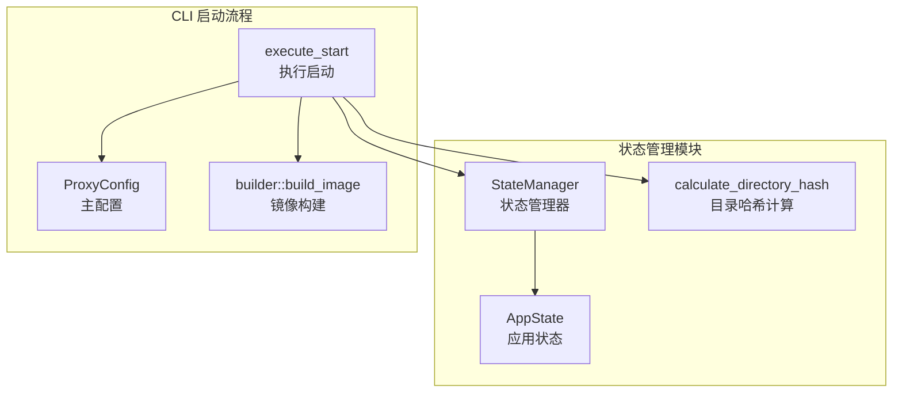
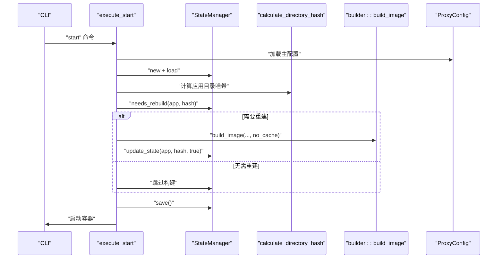
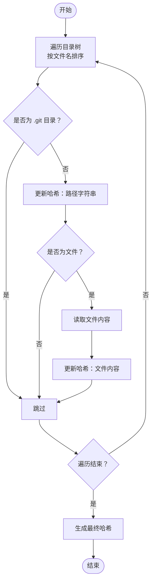
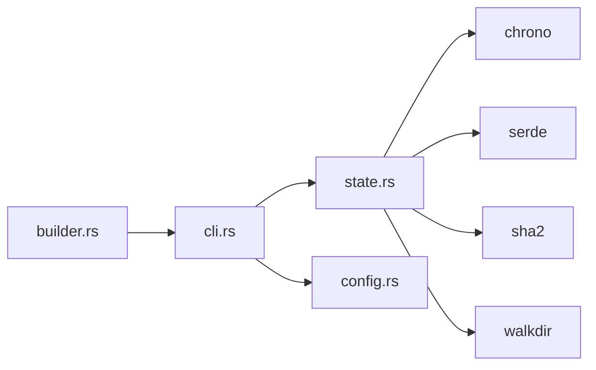

# 状态管理模块

<cite>
**本文档引用的文件**
- [state.rs](file://src/state.rs)
- [cli.rs](file://src/cli.rs)
- [config.rs](file://src/config.rs)
- [builder.rs](file://src/builder.rs)
- [error.rs](file://src/error.rs)
- [lib.rs](file://src/lib.rs)
- [main.rs](file://src/main.rs)
- [Cargo.toml](file://Cargo.toml)
- [README.md](file://README.md)
</cite>

## 目录
1. [简介](#简介)
2. [项目结构](#项目结构)
3. [核心组件](#核心组件)
4. [架构总览](#架构总览)
5. [详细组件分析](#详细组件分析)
6. [依赖关系分析](#依赖关系分析)
7. [性能考虑](#性能考虑)
8. [故障排除指南](#故障排除指南)
9. [结论](#结论)
10. [附录](#附录)

## 简介
本文件系统性地阐述状态管理模块的设计与实现，重点覆盖以下方面：
- 应用状态跟踪机制：状态文件存储、状态更新与查询
- 目录哈希计算算法：文件内容摘要与变更检测
- 构建缓存策略与智能构建决策逻辑
- 状态持久化与数据一致性保障
- 性能优化策略（缓存命中率与I/O优化）
- 异常恢复与数据修复流程
- 状态监控与诊断工具使用方法

## 项目结构
状态管理模块位于 src/state.rs，围绕 AppState 与 StateManager 两个核心结构体展开，配合 CLI 流程中的目录哈希计算与状态更新，形成完整的“变更检测—构建决策—状态持久化”闭环。

图表来源
- [state.rs:31-186](file://src/state.rs#L31-L186)
- [cli.rs:296-463](file://src/cli.rs#L296-L463)
- [config.rs:125-164](file://src/config.rs#L125-L164)
- [builder.rs:20-120](file://src/builder.rs#L20-L120)

章节来源
- [state.rs:1-311](file://src/state.rs#L1-L311)
- [cli.rs:1-669](file://src/cli.rs#L1-L669)
- [config.rs:1-842](file://src/config.rs#L1-L842)

## 核心组件
- AppState：记录单个微应用的关键状态字段，包括应用名称、目录哈希、最后构建时间、镜像存在性。
- StateManager：负责状态文件的加载/保存、状态查询、状态更新、删除以及“是否需要重新构建”的判断。
- calculate_directory_hash：对应用目录进行遍历，生成稳定的SHA-256哈希，作为“变更检测”的依据。

章节来源
- [state.rs:13-28](file://src/state.rs#L13-L28)
- [state.rs:31-186](file://src/state.rs#L31-L186)
- [state.rs:188-233](file://src/state.rs#L188-L233)

## 架构总览
状态管理贯穿 CLI 启动流程：启动时加载状态文件，计算应用目录哈希，结合历史状态决定是否需要重新构建，构建完成后更新状态并持久化。

图表来源
- [cli.rs:296-463](file://src/cli.rs#L296-L463)
- [state.rs:31-186](file://src/state.rs#L31-L186)
- [state.rs:188-233](file://src/state.rs#L188-L233)
- [builder.rs:20-120](file://src/builder.rs#L20-L120)
- [config.rs:125-164](file://src/config.rs#L125-L164)

## 详细组件分析

### 状态模型与持久化
- 数据结构
  - AppState：包含应用名称、目录哈希、最后构建时间、镜像存在性。
  - StateManager：维护状态文件路径与内存映射，提供 load/save/update/remove/needs_rebuild/get_all_states 等能力。
- 持久化机制
  - load：若状态文件不存在则初始化空状态；读取失败或解析失败均转化为状态错误。
  - save：序列化为 YAML 并写回文件；写入失败转化为状态错误。
- 数据一致性
  - 通过“先加载—再决策—最后保存”的顺序，避免并发写入导致的数据竞争。
  - needs_rebuild 逻辑以“历史哈希 vs 当前哈希”为准，确保只在确有变更时触发重建。

章节来源
- [state.rs:13-28](file://src/state.rs#L13-L28)
- [state.rs:31-186](file://src/state.rs#L31-L186)
- [state.rs:58-113](file://src/state.rs#L58-L113)

### 目录哈希计算与变更检测
- 算法要点
  - 使用 SHA-256 作为底层哈希算法。
  - 遍历目录树（walkdir），按文件名排序，跳过 .git 目录。
  - 对每个条目追加其路径字符串到哈希；对文件内容读取后追加到哈希。
- 变更检测
  - needs_rebuild：比较历史哈希与当前哈希，不同则需要重建。
  - 若无历史状态记录，则默认需要构建。
- 一致性与稳定性
  - 排序遍历确保同一目录多次计算得到相同结果。
  - 跳过 .git 目录避免版本控制元数据影响。

图表来源
- [state.rs:188-233](file://src/state.rs#L188-L233)

章节来源
- [state.rs:188-233](file://src/state.rs#L188-L233)

### 构建缓存策略与智能构建决策
- 缓存策略
  - 通过 needs_rebuild 与 force_rebuild 控制是否使用 Docker 构建缓存：
    - force_rebuild=true：no_cache=true，禁用缓存强制重建。
    - force_rebuild=false：使用历史哈希判断，未变更则跳过构建。
- 智能决策逻辑
  - 若应用目录哈希与历史一致且镜像存在，则跳过构建。
  - 若哈希变化或首次构建，则执行构建并更新状态。
- 与 CLI 的集成
  - execute_start 中在构建前后分别更新状态，确保状态与实际镜像一致。

章节来源
- [cli.rs:296-463](file://src/cli.rs#L296-L463)
- [builder.rs:20-120](file://src/builder.rs#L20-L120)
- [state.rs:154-177](file://src/state.rs#L154-L177)

### 状态更新与查询
- 更新
  - update_state：写入当前哈希、更新时间、镜像存在性标记。
- 查询
  - get_state：按应用名查询状态。
  - get_all_states：遍历所有状态。
  - remove_state：删除指定应用状态。
- 与构建流程衔接
  - 构建成功后调用 update_state(app, hash, true)，确保后续 needs_rebuild 返回 false。

章节来源
- [state.rs:115-186](file://src/state.rs#L115-L186)

### 状态文件存储与加载
- 文件格式
  - YAML 序列化/反序列化，键为应用名，值为 AppState。
- 加载策略
  - 文件不存在时初始化空状态，避免阻断启动流程。
- 保存策略
  - 保存前进行序列化校验，失败则抛出状态错误。

章节来源
- [state.rs:58-113](file://src/state.rs#L58-L113)
- [config.rs:141-142](file://src/config.rs#L141-L142)

## 依赖关系分析
- 模块内依赖
  - state.rs 依赖 chrono（时间序列化）、serde（序列化）、sha2（哈希）、walkdir（目录遍历）。
- 与 CLI 的耦合
  - cli.rs 在启动流程中直接调用 calculate_directory_hash 与 StateManager，形成“状态驱动构建”的关键路径。
- 与配置的关系
  - config.rs 提供 state_file_path，CLI 以此初始化 StateManager。

图表来源
- [cli.rs:13-15](file://src/cli.rs#L13-L15)
- [state.rs:5-11](file://src/state.rs#L5-L11)
- [config.rs:141-142](file://src/config.rs#L141-L142)
- [builder.rs:5-7](file://src/builder.rs#L5-L7)

章节来源
- [cli.rs:1-669](file://src/cli.rs#L1-L669)
- [state.rs:1-311](file://src/state.rs#L1-L311)
- [config.rs:1-842](file://src/config.rs#L1-L842)
- [builder.rs:1-218](file://src/builder.rs#L1-L218)

## 性能考虑
- 哈希计算优化
  - 遍历排序与跳过 .git 目录减少无关文件参与计算，降低计算量。
  - 文件内容仅在文件节点时读取，避免对目录节点重复 IO。
- I/O 优化
  - 状态文件采用一次性序列化+写入，减少多次小写入。
  - 目录遍历使用迭代器风格，避免不必要的中间结构。
- 缓存命中率提升
  - 通过 needs_rebuild 严格控制构建频率，避免重复构建。
  - force_rebuild 场景下显式禁用缓存，确保一致性。
- 并发与一致性
  - 单进程 CLI 流程中，状态文件读写顺序固定，避免竞态。
  - 若扩展为多进程，建议引入文件锁或原子写入策略。

章节来源
- [state.rs:188-233](file://src/state.rs#L188-L233)
- [state.rs:58-113](file://src/state.rs#L58-L113)
- [cli.rs:296-463](file://src/cli.rs#L296-L463)

## 故障排除指南
- 状态文件读取失败
  - 现象：加载状态文件时报错。
  - 排查：检查文件权限、路径正确性、YAML 格式合法性。
  - 处理：删除损坏状态文件，系统会在下次启动时重建。
- 目录哈希计算异常
  - 现象：遍历目录报错或哈希不稳定。
  - 排查：确认目录可读、无符号链接循环、无权限受限文件。
  - 处理：修正目录权限或排除不受支持的文件类型。
- 镜像构建缓存问题
  - 现象：force_rebuild=false 时未触发重建。
  - 排查：确认 needs_rebuild 判断逻辑与哈希计算是否正常。
  - 处理：必要时使用 --force-rebuild 强制重建。
- 状态不一致
  - 现象：状态文件与实际镜像不一致。
  - 排查：检查构建流程是否成功更新状态。
  - 处理：删除状态文件后重启，让系统重新计算并写入。

章节来源
- [state.rs:58-113](file://src/state.rs#L58-L113)
- [state.rs:188-233](file://src/state.rs#L188-L233)
- [cli.rs:354-380](file://src/cli.rs#L354-L380)
- [error.rs:35-36](file://src/error.rs#L35-L36)

## 结论
状态管理模块通过“目录哈希 + 状态持久化 + 智能构建决策”的组合，实现了高效、可靠的微应用构建流程控制。其设计强调：
- 变更检测的准确性与稳定性
- 状态持久化的可靠性与一致性
- 与 CLI 流程的无缝集成
- 可扩展的性能优化空间

## 附录

### 状态监控与诊断
- 状态查看
  - 使用 status 命令查看容器与镜像状态，辅助核对状态文件记录。
- 日志与调试
  - CLI 启动时初始化日志系统，结合 -v 参数可获得详细日志，便于定位问题。
- 状态文件位置
  - 主配置中的 state_file_path 指定状态文件路径，便于手工检查与备份。

章节来源
- [cli.rs:550-584](file://src/cli.rs#L550-L584)
- [config.rs:141-142](file://src/config.rs#L141-L142)
- [README.md:145-153](file://README.md#L145-L153)