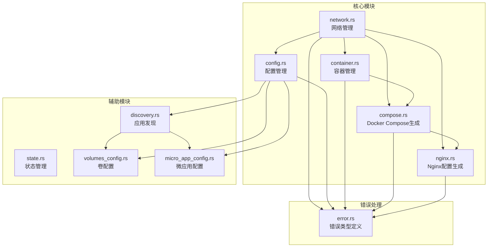
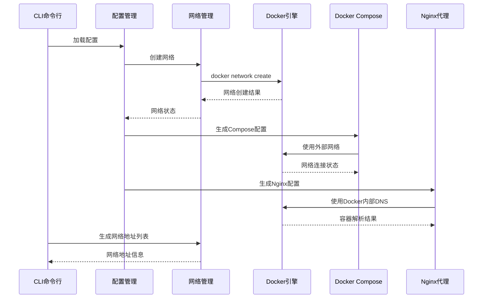
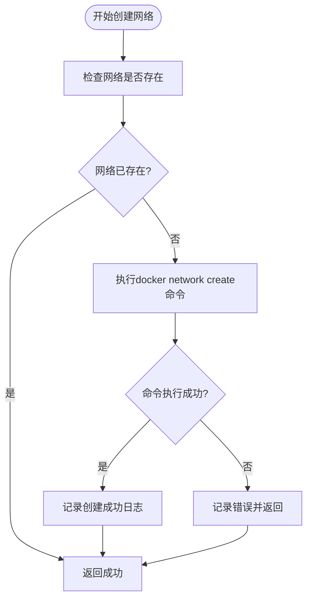
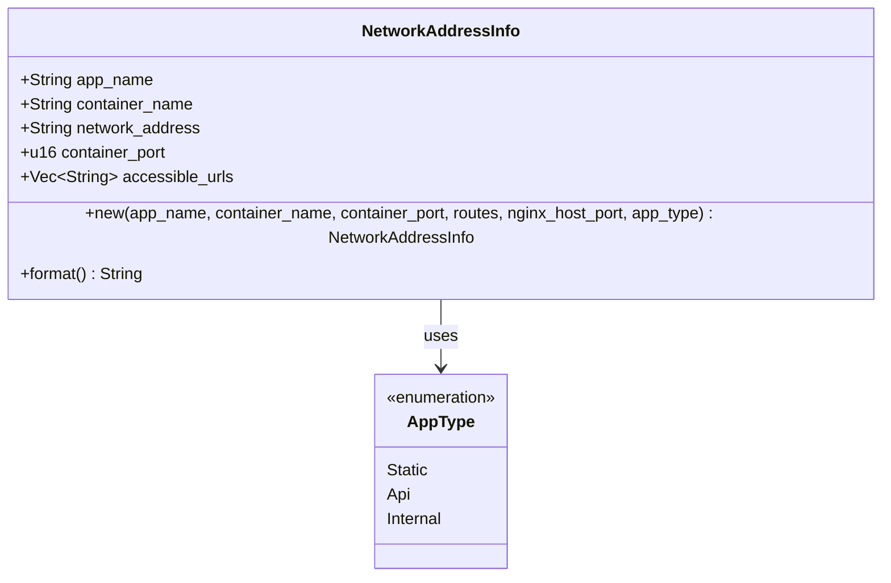
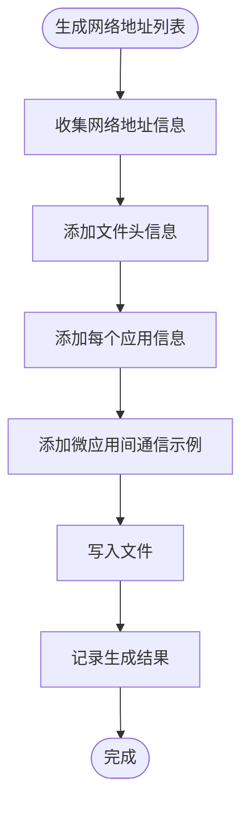
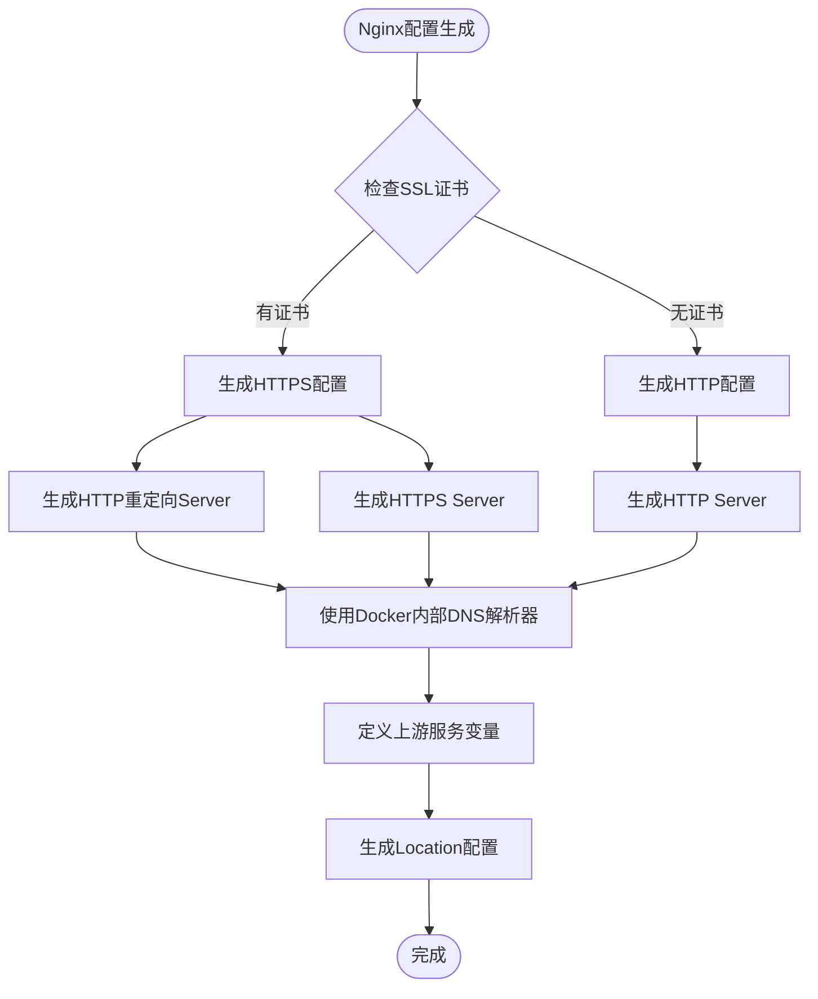
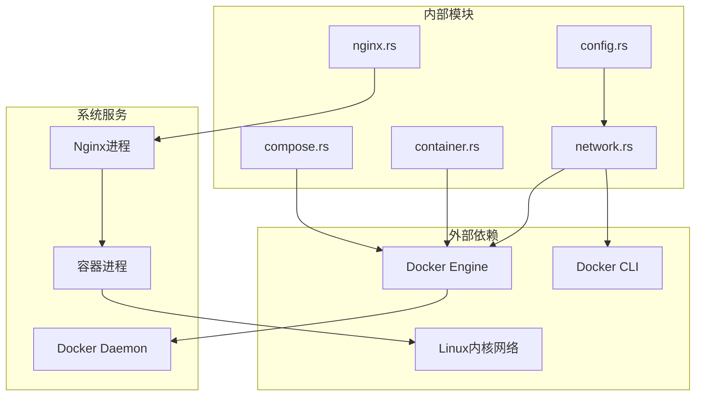
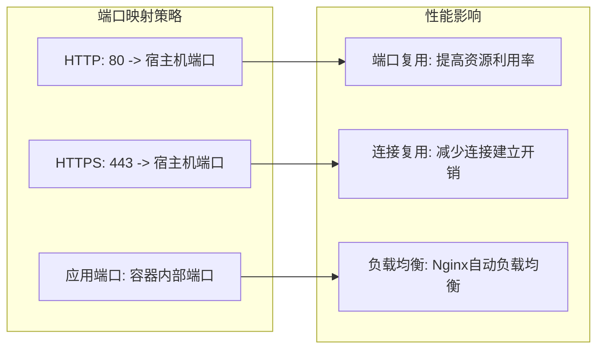
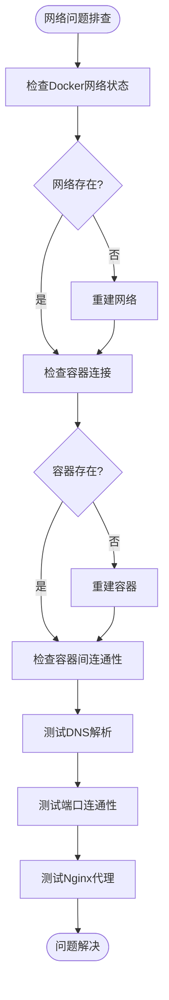

# 网络管理模块

<cite>
**本文档引用的文件**
- [network.rs](file://src/network.rs)
- [config.rs](file://src/config.rs)
- [container.rs](file://src/container.rs)
- [compose.rs](file://src/compose.rs)
- [nginx.rs](file://src/nginx.rs)
- [lib.rs](file://src/lib.rs)
- [error.rs](file://src/error.rs)
- [Cargo.toml](file://Cargo.toml)
- [README.md](file://README.md)
</cite>

## 目录
1. [引言](#引言)
2. [项目结构](#项目结构)
3. [核心组件](#核心组件)
4. [架构概览](#架构概览)
5. [详细组件分析](#详细组件分析)
6. [依赖关系分析](#依赖关系分析)
7. [性能考虑](#性能考虑)
8. [故障排查指南](#故障排查指南)
9. [结论](#结论)

## 引言

micro_proxy 是一个用于管理微应用的工具，支持 Docker 镜像构建、容器管理、Nginx 反向代理配置等功能。网络管理模块是该工具的核心组成部分，负责统一管理 Docker 网络、微应用间通信、端口映射以及网络安全控制。

本文档将深入分析网络管理模块的实现机制，包括网络创建、删除和配置管理，详细描述网络隔离策略和安全控制机制，阐述端口映射的处理逻辑，解释网络拓扑的可视化和监控机制，并提供网络性能优化配置和故障排查指南。

## 项目结构

micro_proxy 采用模块化设计，网络管理模块位于 `src/network.rs`，与其他核心模块协同工作：



**图表来源**
- [network.rs:1-397](file://src/network.rs#L1-L397)
- [config.rs:1-842](file://src/config.rs#L1-L842)
- [container.rs:1-257](file://src/container.rs#L1-L257)
- [compose.rs:1-905](file://src/compose.rs#L1-L905)
- [nginx.rs:1-1101](file://src/nginx.rs#L1-L1101)

**章节来源**
- [lib.rs:1-26](file://src/lib.rs#L1-L26)
- [Cargo.toml:1-55](file://Cargo.toml#L1-L55)

## 核心组件

网络管理模块包含以下核心组件：

### 1. 网络操作接口
- **网络创建**: `create_network()` - 创建 Docker 网络
- **网络删除**: `remove_network()` - 删除 Docker 网络  
- **网络检查**: `network_exists()` - 检查网络是否存在

### 2. 网络地址管理
- **NetworkAddressInfo**: 网络地址信息结构体
- **generate_network_list()**: 生成网络地址列表文件

### 3. 网络配置集成
- 与 Docker Compose 集成，使用外部网络
- 与 Nginx 配置集成，支持动态 DNS 解析
- 支持内部服务和外部服务的网络隔离

**章节来源**
- [network.rs:8-119](file://src/network.rs#L8-L119)
- [network.rs:121-274](file://src/network.rs#L121-L274)

## 架构概览

网络管理模块在整个系统架构中扮演着基础设施的角色：



**图表来源**
- [network.rs:15-46](file://src/network.rs#L15-L46)
- [compose.rs:54-69](file://src/compose.rs#L54-L69)
- [nginx.rs:187-190](file://src/nginx.rs#L187-L190)

## 详细组件分析

### 网络创建与管理

网络创建流程实现了幂等性设计，避免重复创建：



**图表来源**
- [network.rs:15-46](file://src/network.rs#L15-L46)

关键特性：
- **幂等性**: 已存在的网络不会被重复创建
- **错误处理**: 详细的错误日志和错误类型
- **状态检查**: 使用 `docker network ls` 进行精确匹配

**章节来源**
- [network.rs:8-47](file://src/network.rs#L8-L47)

### 网络地址信息管理

NetworkAddressInfo 结构体提供了完整的网络地址信息：



**图表来源**
- [network.rs:122-207](file://src/network.rs#L122-L207)
- [config.rs:12-21](file://src/config.rs#L12-L21)

主要功能：
- **应用类型区分**: 根据 AppType 决定是否生成可访问 URL
- **内部服务处理**: Internal 类型应用不生成可访问 URL
- **URL 生成规则**: 基于路由和 nginx 主机端口生成访问地址

**章节来源**
- [network.rs:121-207](file://src/network.rs#L121-L207)

### 网络地址列表生成

网络地址列表文件提供了完整的网络拓扑信息：



**图表来源**
- [network.rs:219-274](file://src/network.rs#L219-L274)

文件内容包含：
- **基本信息**: 生成时间、网络名称、Nginx 统一入口
- **应用详情**: 每个应用的名称、容器名、网络地址、端口
- **通信示例**: 微应用间的相互访问示例

**章节来源**
- [network.rs:209-274](file://src/network.rs#L209-L274)

### Docker Compose 网络集成

Docker Compose 配置使用外部网络模式：

```mermaid
graph LR
subgraph "Docker Compose配置"
A[networks:
proxy-network:
name: proxy-network
external: true]
B[services:
nginx:
networks:
proxy-network: {}]
C[services:
app-container:
networks:
proxy-network: {}]
end
subgraph "Docker网络"
D[proxy-network]
end
A --> D
B --> D
C --> D
```

**图表来源**
- [compose.rs:54-69](file://src/compose.rs#L54-L69)
- [compose.rs:225-234](file://src/compose.rs#L225-L234)

关键特性：
- **外部网络**: 使用 `external: true` 避免重复创建网络
- **网络共享**: 所有服务共享同一个 Docker 网络
- **网络命名**: 通过 `name` 参数指定网络名称

**章节来源**
- [compose.rs:54-69](file://src/compose.rs#L54-L69)

### Nginx 网络配置

Nginx 配置使用 Docker 内部 DNS 解析器：



**图表来源**
- [nginx.rs:26-92](file://src/nginx.rs#L26-L92)
- [nginx.rs:187-190](file://src/nginx.rs#L187-L190)

**章节来源**
- [nginx.rs:26-92](file://src/nginx.rs#L26-L92)

## 依赖关系分析

网络管理模块的依赖关系如下：



**图表来源**
- [network.rs:5-6](file://src/network.rs#L5-L6)
- [container.rs:5-6](file://src/container.rs#L5-L6)
- [compose.rs:6-9](file://src/compose.rs#L6-L9)

**章节来源**
- [Cargo.toml:13-52](file://Cargo.toml#L13-L52)

## 性能考虑

### 网络性能优化

1. **DNS 解析优化**
   - 使用 Docker 内部 DNS 解析器 `resolver 127.0.0.11`
   - 设置合理的缓存时间 `valid=30s`
   - 禁用 IPv6 解析避免延迟 `ipv6=off`

2. **网络模式选择**
   - **单网络模式**: 所有应用共享同一 Docker 网络，减少网络开销
   - **外部网络**: 避免重复创建网络，提高启动速度
   - **内部通信**: 应用间通信通过容器名称进行，无需额外网络配置

3. **连接池优化**
   - Nginx 使用 Docker 内部 DNS，避免外部 DNS 查询
   - 容器间通信使用 localhost 地址，减少网络跳数

### 端口映射性能



**章节来源**
- [nginx.rs:187-190](file://src/nginx.rs#L187-L190)
- [compose.rs:199-208](file://src/compose.rs#L199-L208)

## 故障排查指南

### 网络连接问题排查



**图表来源**
- [network.rs:56-86](file://src/network.rs#L56-L86)
- [container.rs:185-242](file://src/container.rs#L185-L242)

### 常见问题及解决方案

1. **网络创建失败**
   - 检查 Docker 服务状态
   - 确认网络名称唯一性
   - 查看 Docker 日志获取详细错误信息

2. **容器无法连接网络**
   - 使用 `docker network ls` 检查网络状态
   - 使用 `docker network inspect network-name` 查看网络详情
   - 确认容器启动时使用的网络名称

3. **DNS 解析问题**
   - 检查 Nginx 配置中的 `resolver` 设置
   - 验证容器网络连接状态
   - 使用 `nslookup` 或 `dig` 测试 DNS 解析

4. **端口冲突问题**
   - 使用 `sudo lsof -i :端口号` 检查端口占用
   - 修改 `proxy-config.yml` 中的 `nginx_host_port`
   - 确认防火墙设置允许相应端口通信

**章节来源**
- [README.md:328-420](file://README.md#L328-L420)

### 网络监控和诊断

1. **网络状态监控**
   ```bash
   # 查看网络列表
   docker network ls
   
   # 查看网络详情
   docker network inspect network-name
   
   # 查看网络连接的容器
   docker network ls --filter "name=network-name"
   ```

2. **容器网络诊断**
   ```bash
   # 查看容器网络配置
   docker inspect container-name | grep -A 10 Networks
   
   # 测试容器间连通性
   docker exec container1 ping container2
   
   # 检查容器网络接口
   docker exec container1 ip addr show
   ```

3. **Nginx 网络诊断**
   ```bash
   # 检查 Nginx 配置语法
   docker exec proxy-nginx nginx -t
   
   # 查看 Nginx 连接状态
   docker exec proxy-nginx netstat -an | grep :80
   
   # 检查 Nginx 日志
   docker logs proxy-nginx | tail -50
   ```

**章节来源**
- [README.md:330-341](file://README.md#L330-L341)

## 结论

micro_proxy 的网络管理模块通过以下关键特性实现了高效的微应用网络管理：

1. **统一网络管理**: 通过单一 Docker 网络实现所有微应用的网络隔离和通信
2. **动态 DNS 解析**: 利用 Docker 内部 DNS 解析器实现容器间动态服务发现
3. **外部网络集成**: 与 Docker Compose 的外部网络模式无缝集成
4. **安全隔离**: 通过网络隔离实现内部服务的安全访问控制
5. **性能优化**: 通过 DNS 缓存和连接复用提升网络性能

该模块的设计充分考虑了微服务架构的需求，提供了灵活的网络配置选项和强大的故障排查能力，是 micro_proxy 工具的重要基础设施组件。