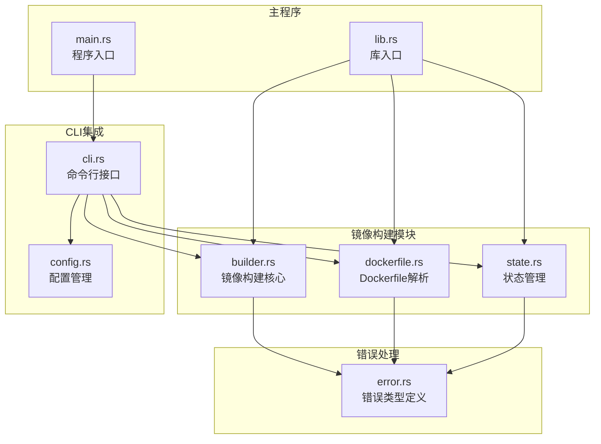
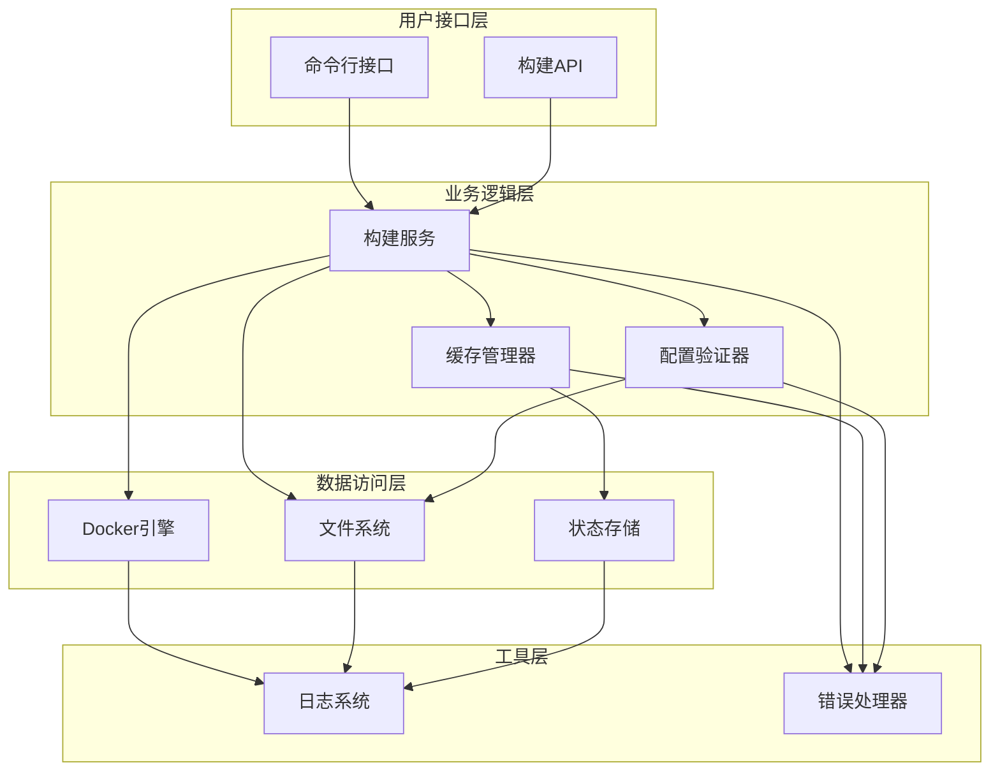
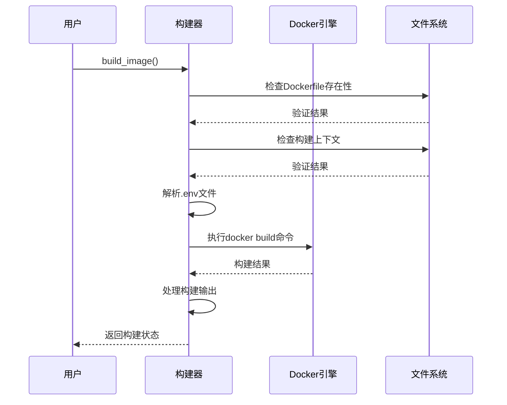
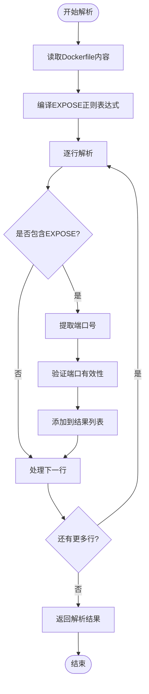
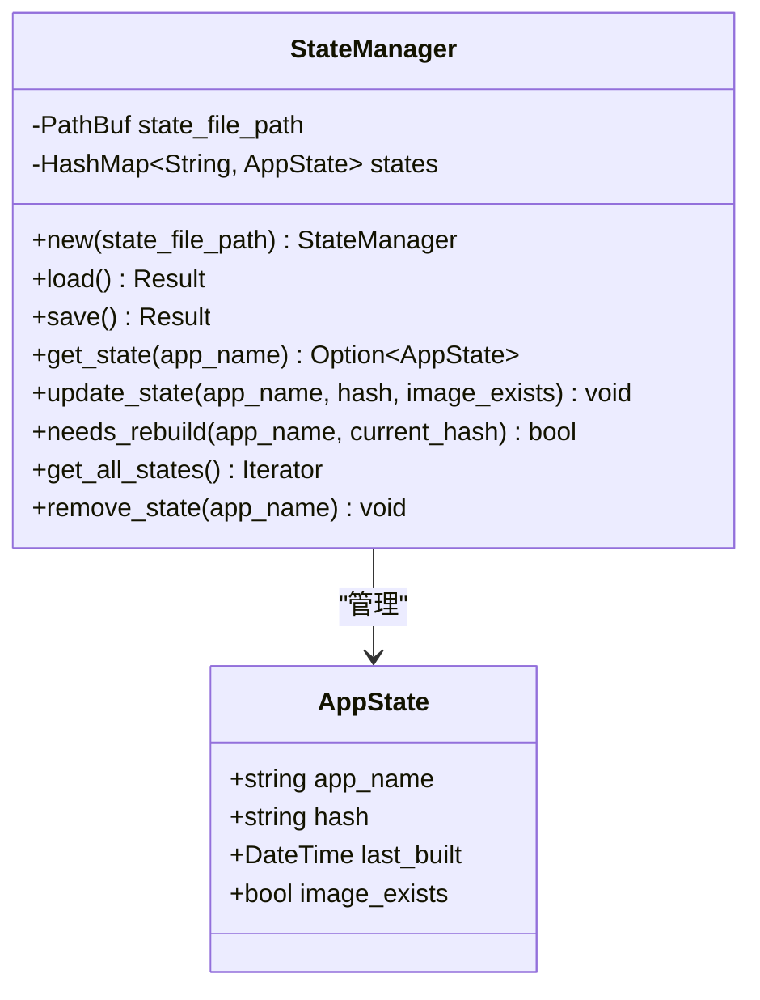
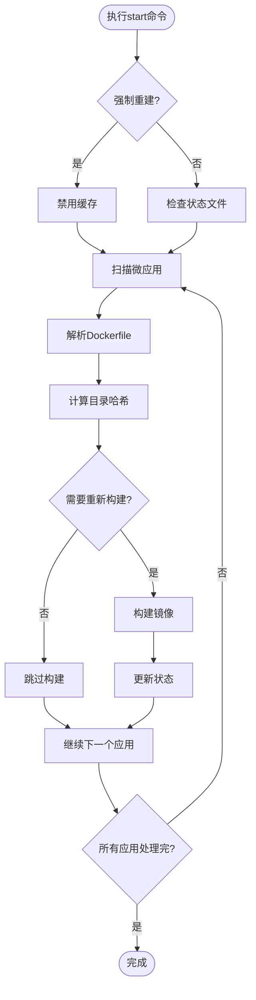
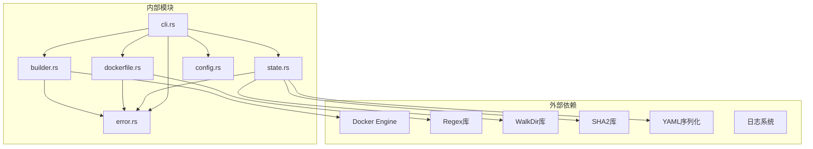

# 镜像构建模块

<cite>
**本文档引用的文件**
- [builder.rs](file://src/builder.rs)
- [dockerfile.rs](file://src/dockerfile.rs)
- [cli.rs](file://src/cli.rs)
- [state.rs](file://src/state.rs)
- [config.rs](file://src/config.rs)
- [error.rs](file://src/error.rs)
- [lib.rs](file://src/lib.rs)
- [main.rs](file://src/main.rs)
- [Cargo.toml](file://Cargo.toml)
- [README.md](file://README.md)
- [micro-app-development.md](file://docs/micro-app-development.md)
</cite>

## 目录
1. [简介](#简介)
2. [项目结构](#项目结构)
3. [核心组件](#核心组件)
4. [架构概览](#架构概览)
5. [详细组件分析](#详细组件分析)
6. [依赖关系分析](#依赖关系分析)
7. [性能考量](#性能考量)
8. [故障排除指南](#故障排除指南)
9. [结论](#结论)

## 简介

镜像构建模块是 micro_proxy 工具的核心功能之一，负责自动化 Docker 镜像的构建、管理和优化。该模块实现了完整的镜像构建生命周期管理，包括构建上下文管理、构建参数配置、构建过程监控以及智能缓存机制。

micro_proxy 作为一个微应用管理工具，支持多种应用类型的自动发现和管理，其中镜像构建模块提供了强大的 Docker 镜像构建能力，支持多阶段构建、缓存优化和增量构建等高级特性。

## 项目结构

镜像构建模块在整体项目中的位置和职责如下：

**图表来源**
- [builder.rs:1-218](file://src/builder.rs#L1-L218)
- [dockerfile.rs:1-183](file://src/dockerfile.rs#L1-L183)
- [cli.rs:1-669](file://src/cli.rs#L1-L669)
- [state.rs:1-311](file://src/state.rs#L1-L311)

**章节来源**
- [lib.rs:1-26](file://src/lib.rs#L1-L26)
- [main.rs:1-25](file://src/main.rs#L1-L25)

## 核心组件

镜像构建模块由四个主要组件构成，每个组件都有明确的职责和功能：

### 1. 镜像构建器 (Builder)

镜像构建器是模块的核心，负责实际的 Docker 镜像构建操作。它提供了构建、删除和查询镜像状态的功能。

### 2. Dockerfile 解析器

专门负责解析 Dockerfile 文件，提取关键信息如暴露端口等元数据。

### 3. 状态管理器

维护构建状态信息，实现智能的增量构建判断和缓存管理。

### 4. CLI 集成

将构建功能集成到命令行界面中，提供用户友好的交互体验。

**章节来源**
- [builder.rs:9-120](file://src/builder.rs#L9-L120)
- [dockerfile.rs:16-67](file://src/dockerfile.rs#L16-L67)
- [state.rs:30-186](file://src/state.rs#L30-L186)

## 架构概览

镜像构建模块采用了分层架构设计，确保了良好的模块化和可维护性：

**图表来源**
- [cli.rs:296-463](file://src/cli.rs#L296-L463)
- [builder.rs:20-120](file://src/builder.rs#L20-L120)
- [state.rs:40-186](file://src/state.rs#L40-L186)

## 详细组件分析

### 镜像构建器 (Builder)

镜像构建器提供了完整的 Docker 镜像构建功能，包括基本构建、缓存控制和环境变量处理。

#### 核心功能

1. **基础镜像构建**: 执行 docker build 命令，支持自定义镜像名称、Dockerfile 路径和构建上下文
2. **缓存控制**: 支持禁用构建缓存的强制重建模式
3. **环境变量注入**: 自动解析 .env 文件并转换为构建参数
4. **错误处理**: 提供详细的错误信息和日志记录

#### 构建流程

**图表来源**
- [builder.rs:20-120](file://src/builder.rs#L20-L120)

#### 关键实现特点

- **参数验证**: 在执行构建前验证所有必需参数
- **环境变量处理**: 自动解析 .env 文件中的键值对
- **缓存控制**: 支持通过 `--no-cache` 参数禁用缓存
- **日志记录**: 提供详细的构建过程日志

**章节来源**
- [builder.rs:20-120](file://src/builder.rs#L20-L120)

### Dockerfile 解析器

Dockerfile 解析器专注于解析 Dockerfile 文件，提取关键信息用于后续的构建决策。

#### 解析功能

1. **端口提取**: 识别并解析 EXPOSE 指令
2. **内容验证**: 验证 Dockerfile 的语法正确性
3. **元数据提取**: 提取构建所需的关键信息

#### 解析算法

**图表来源**
- [dockerfile.rs:45-67](file://src/dockerfile.rs#L45-L67)

**章节来源**
- [dockerfile.rs:16-67](file://src/dockerfile.rs#L16-L67)

### 状态管理器

状态管理器实现了智能的增量构建判断机制，通过目录哈希计算实现高效的缓存管理。

#### 状态模型

**图表来源**
- [state.rs:13-186](file://src/state.rs#L13-L186)

#### 目录哈希计算

状态管理器使用 SHA-256 算法计算目录的哈希值，确保构建决策的准确性：

1. **文件遍历**: 使用 `walkdir` 库遍历所有文件和目录
2. **内容哈希**: 对每个文件的内容进行哈希计算
3. **路径考虑**: 包含文件路径信息，确保目录结构变化被检测到
4. **忽略特殊目录**: 自动跳过 `.git` 目录等版本控制文件

**章节来源**
- [state.rs:188-233](file://src/state.rs#L188-L233)

### CLI 集成

CLI 集成了镜像构建功能，提供了用户友好的命令行接口。

#### 命令行功能

1. **启动命令**: `micro_proxy start` 支持强制重建选项
2. **状态查询**: `micro_proxy status` 显示镜像状态
3. **清理功能**: `micro_proxy clean` 清理构建产物

#### 构建决策流程

**图表来源**
- [cli.rs:296-463](file://src/cli.rs#L296-L463)

**章节来源**
- [cli.rs:296-463](file://src/cli.rs#L296-L463)

## 依赖关系分析

镜像构建模块的依赖关系体现了清晰的分层架构：

**图表来源**
- [Cargo.toml:13-55](file://Cargo.toml#L13-L55)
- [builder.rs:5-7](file://src/builder.rs#L5-L7)
- [dockerfile.rs:5-7](file://src/dockerfile.rs#L5-L7)
- [state.rs:5-11](file://src/state.rs#L5-L11)

**章节来源**
- [Cargo.toml:13-55](file://Cargo.toml#L13-L55)

## 性能考量

镜像构建模块在设计时充分考虑了性能优化：

### 1. 缓存优化策略

- **智能增量构建**: 通过目录哈希比较避免不必要的重新构建
- **构建缓存利用**: 默认启用 Docker 构建缓存提高构建速度
- **状态持久化**: 将构建状态保存到文件系统，支持跨会话的缓存管理

### 2. 内存使用优化

- **流式文件处理**: 使用迭代器模式处理大型文件，避免内存溢出
- **按需解析**: Dockerfile 解析采用逐行处理，减少内存占用
- **条件加载**: 状态文件只有在需要时才加载到内存

### 3. 并发处理

- **异步I/O**: 使用 Rust 的异步特性处理文件系统操作
- **并行扫描**: 支持多应用并行构建（在 CLI 层面）

## 故障排除指南

### 常见问题及解决方案

#### 1. Docker 构建失败

**问题症状**: 构建命令执行失败，返回错误状态码

**可能原因**:
- Dockerfile 语法错误
- 构建上下文路径不存在
- Docker 服务未启动

**解决方案**:
- 检查 Dockerfile 语法
- 验证构建上下文路径
- 确认 Docker 服务正常运行

#### 2. 缓存失效问题

**问题症状**: 即使代码未更改，构建仍然重新进行

**可能原因**:
- 目录哈希计算异常
- 状态文件损坏
- 文件权限问题

**解决方案**:
- 清理状态文件并重新构建
- 检查文件权限
- 验证目录结构完整性

#### 3. 环境变量注入失败

**问题症状**: .env 文件中的变量未正确注入到构建参数中

**可能原因**:
- .env 文件格式不正确
- 注释行处理异常
- 键值对格式错误

**解决方案**:
- 检查 .env 文件格式
- 确保每行都是 `KEY=VALUE` 格式
- 移除多余的空格和注释

**章节来源**
- [builder.rs:35-51](file://src/builder.rs#L35-L51)
- [state.rs:62-89](file://src/state.rs#L62-L89)

## 结论

镜像构建模块展现了现代 Rust 应用的良好实践，具有以下特点：

### 设计优势

1. **模块化设计**: 清晰的职责分离和接口定义
2. **错误处理**: 完善的错误类型系统和错误传播机制
3. **性能优化**: 智能缓存和增量构建策略
4. **用户友好**: 提供丰富的命令行接口和详细日志

### 技术亮点

1. **状态管理**: 基于目录哈希的智能缓存机制
2. **配置集成**: 与整体配置系统的无缝集成
3. **扩展性**: 良好的架构设计支持功能扩展
4. **可靠性**: 完善的错误处理和恢复机制

### 改进建议

1. **并发构建**: 支持多应用并行构建以提高效率
2. **构建优化**: 实现更精细的构建缓存策略
3. **监控指标**: 添加构建性能监控和统计功能
4. **构建优化**: 支持构建阶段的可视化和调试

该模块为 micro_proxy 工具提供了坚实的镜像构建基础，通过智能的缓存管理和优雅的错误处理，为用户提供了高效可靠的 Docker 镜像构建体验。