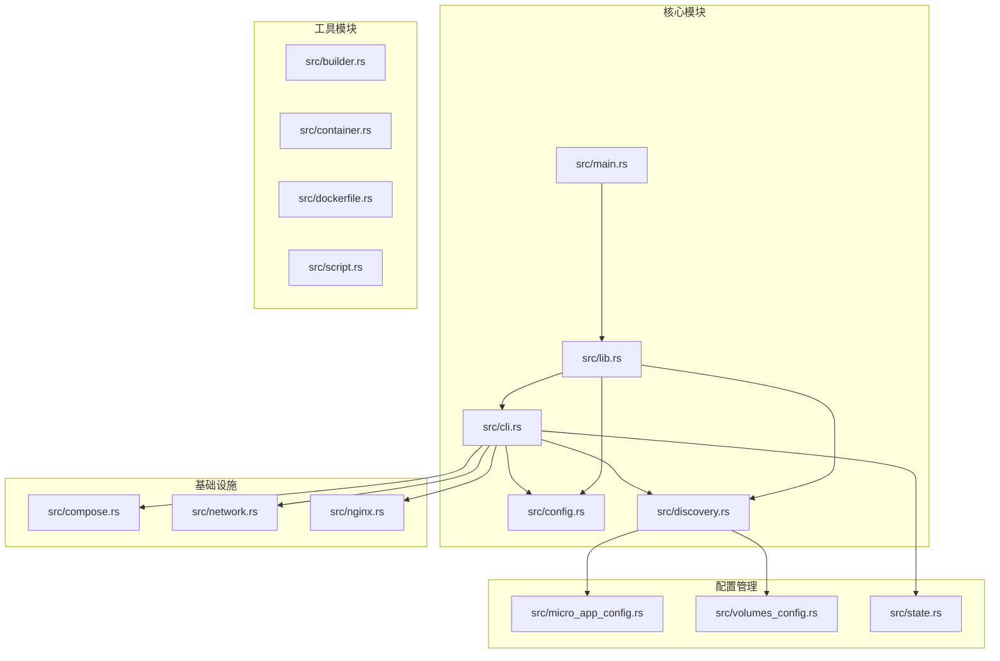
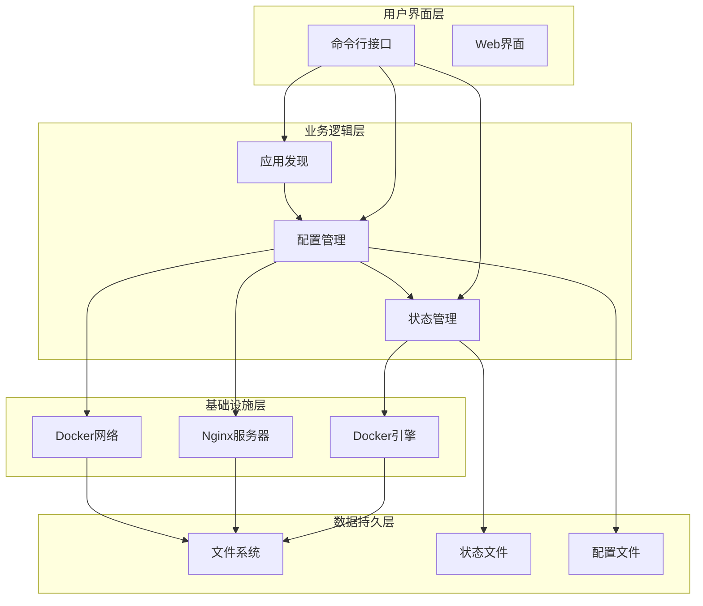
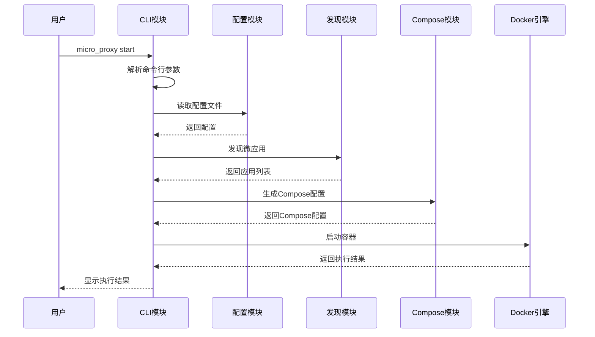
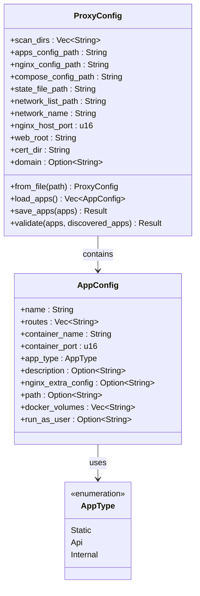
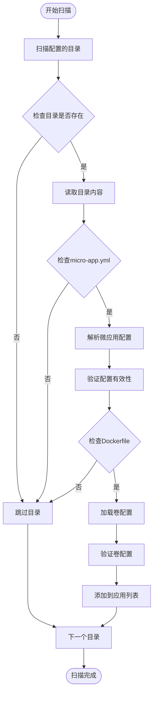
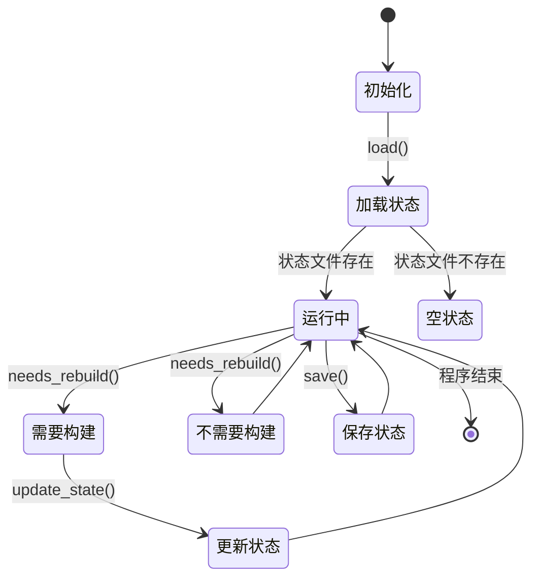
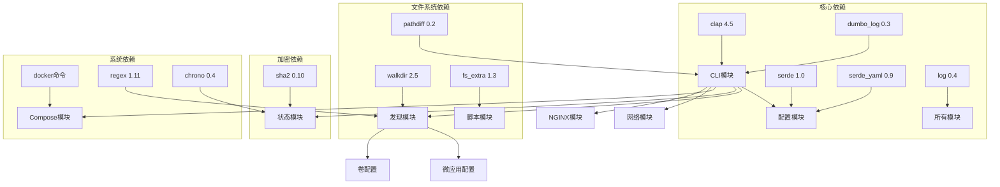

# 系统概览

<cite>
**本文档引用的文件**
- [src/main.rs](file://src/main.rs)
- [src/lib.rs](file://src/lib.rs)
- [src/cli.rs](file://src/cli.rs)
- [src/config.rs](file://src/config.rs)
- [src/discovery.rs](file://src/discovery.rs)
- [src/micro_app_config.rs](file://src/micro_app_config.rs)
- [src/volumes_config.rs](file://src/volumes_config.rs)
- [src/compose.rs](file://src/compose.rs)
- [src/network.rs](file://src/network.rs)
- [src/nginx.rs](file://src/nginx.rs)
- [src/state.rs](file://src/state.rs)
- [Cargo.toml](file://Cargo.toml)
- [README.md](file://README.md)
- [proxy-config.yml.example](file://proxy-config.yml.example)
</cite>

## 目录
1. [引言](#引言)
2. [项目结构](#项目结构)
3. [核心组件](#核心组件)
4. [架构概览](#架构概览)
5. [详细组件分析](#详细组件分析)
6. [依赖关系分析](#依赖关系分析)
7. [性能考虑](#性能考虑)
8. [故障排除指南](#故障排除指南)
9. [结论](#结论)

## 引言

micro_proxy 是一个专为微应用管理而设计的现代化工具，采用 Rust 编程语言开发，旨在简化微服务架构中的容器化部署和反向代理配置。该系统通过模块化设计和配置驱动架构，为开发者提供了统一的微应用生命周期管理解决方案。

### 核心价值主张

- **自动化微应用发现**：智能扫描指定目录，自动识别包含 `micro-app.yml` 和 `Dockerfile` 的微应用
- **统一容器编排**：通过 Docker Compose 自动生成容器编排配置，支持复杂的微服务拓扑
- **智能反向代理**：自动生成 Nginx 配置，实现统一入口和路由分发
- **状态感知构建**：基于目录哈希的状态管理，智能判断是否需要重新构建镜像
- **灵活的配置驱动**：通过 YAML 配置文件实现高度可定制的部署策略

### 解决的问题域

micro_proxy 主要解决了以下问题：
- 微应用开发和部署的复杂性
- 多微服务间的网络通信和路由管理
- Docker 容器编排的标准化流程
- SSL 证书管理和 HTTPS 配置
- 开发环境和生产环境的一致性

## 项目结构

系统采用标准的 Rust 项目结构，按照功能模块进行清晰的组织：

**图表来源**
- [src/lib.rs:1-26](file://src/lib.rs#L1-L26)
- [src/main.rs:1-25](file://src/main.rs#L1-L25)

**章节来源**
- [src/lib.rs:1-26](file://src/lib.rs#L1-L26)
- [Cargo.toml:1-55](file://Cargo.toml#L1-L55)

## 核心组件

### 命令行接口层

CLI 模块负责处理用户输入和提供命令行交互界面。系统支持多种子命令，每种命令都有明确的功能职责：

- **start**：启动所有微应用，包含自动发现、构建、配置生成和容器启动
- **stop**：停止所有微应用容器
- **clean**：清理微应用，包括容器、镜像和配置文件
- **status**：查看微应用状态
- **network**：生成网络地址列表

### 配置管理层

配置系统采用分层设计，支持主配置文件和微应用配置文件的分离：

- **ProxyConfig**：主配置结构，管理扫描目录、输出路径、网络配置等
- **AppConfig**：应用配置结构，定义单个微应用的属性
- **MicroAppConfig**：微应用配置文件解析器
- **VolumesConfig**：卷配置管理器

### 发现与解析模块

系统通过智能发现机制自动识别和解析微应用：

- **discover_micro_apps**：扫描指定目录，发现符合条件的微应用
- **MicroApp**：微应用信息载体，包含配置、卷映射和文件路径
- **to_app_configs**：将发现的微应用转换为应用配置

**章节来源**
- [src/cli.rs:1-669](file://src/cli.rs#L1-L669)
- [src/config.rs:1-842](file://src/config.rs#L1-L842)
- [src/discovery.rs:1-721](file://src/discovery.rs#L1-L721)

## 架构概览

micro_proxy 采用了典型的分层架构设计，实现了关注点分离和模块化管理：

**图表来源**
- [src/cli.rs:78-116](file://src/cli.rs#L78-L116)
- [src/config.rs:125-164](file://src/config.rs#L125-L164)
- [src/state.rs:30-38](file://src/state.rs#L30-L38)

### 设计原则

系统遵循以下核心设计原则：

1. **模块化设计**：每个功能模块都有明确的职责边界
2. **配置驱动**：通过配置文件实现高度可定制的部署策略
3. **状态感知**：基于状态管理实现智能的构建决策
4. **错误隔离**：通过 Result 类型和错误处理机制实现错误隔离
5. **可扩展性**：插件化的架构设计支持功能扩展

## 详细组件分析

### 命令行接口组件

CLI 模块是系统的入口点，负责解析用户命令并协调各个模块的工作：

**图表来源**
- [src/cli.rs:296-463](file://src/cli.rs#L296-L463)
- [src/cli.rs:78-116](file://src/cli.rs#L78-L116)

### 配置管理系统

配置系统采用分层设计，支持主配置和应用配置的分离：

**图表来源**
- [src/config.rs:125-367](file://src/config.rs#L125-L367)
- [src/config.rs:23-68](file://src/config.rs#L23-L68)

### 应用发现与解析

应用发现模块实现了智能的微应用识别和配置解析：

**图表来源**
- [src/discovery.rs:235-352](file://src/discovery.rs#L235-L352)
- [src/discovery.rs:40-145](file://src/discovery.rs#L40-L145)

**章节来源**
- [src/cli.rs:1-669](file://src/cli.rs#L1-L669)
- [src/config.rs:1-842](file://src/config.rs#L1-L842)
- [src/discovery.rs:1-721](file://src/discovery.rs#L1-L721)

### 状态管理系统

状态管理模块实现了基于目录哈希的状态跟踪：

**图表来源**
- [src/state.rs:162-177](file://src/state.rs#L162-L177)
- [src/state.rs:132-143](file://src/state.rs#L132-L143)

**章节来源**
- [src/state.rs:1-311](file://src/state.rs#L1-L311)

## 依赖关系分析

系统采用模块化设计，各模块之间存在清晰的依赖关系：

**图表来源**
- [Cargo.toml:13-52](file://Cargo.toml#L13-L52)
- [src/cli.rs:6-19](file://src/cli.rs#L6-L19)

### 外部依赖定义

系统的主要外部依赖包括：

- **Docker 引擎**：用于容器的构建、运行和管理
- **Docker Compose**：用于容器编排和多容器应用管理
- **Nginx**：作为反向代理服务器
- **文件系统**：用于配置文件、状态文件和应用数据的存储

**章节来源**
- [Cargo.toml:1-55](file://Cargo.toml#L1-L55)

## 性能考虑

### 构建优化策略

系统采用了多种性能优化策略：

1. **状态感知构建**：通过目录哈希判断是否需要重新构建，避免不必要的镜像构建
2. **并行处理**：在可能的情况下并行处理多个微应用
3. **缓存机制**：利用 Docker 的镜像缓存机制提高构建效率
4. **增量更新**：只更新发生变化的配置文件

### 内存管理

- **零拷贝操作**：大量使用引用和切片，减少内存分配
- **延迟加载**：配置文件采用延迟加载策略
- **智能缓存**：状态信息在内存中缓存，避免频繁的磁盘 I/O

### 网络优化

- **动态 DNS 解析**：使用 Docker 内部 DNS 解析器，支持服务发现
- **连接池管理**：合理管理 Docker API 连接
- **超时配置**：为各种网络操作设置合理的超时时间

## 故障排除指南

### 常见问题诊断

#### Docker 相关问题

1. **Docker 服务不可用**
   - 检查 Docker 服务状态：`systemctl status docker`
   - 确认用户具有 Docker 权限：`sudo usermod -aG docker $USER`

2. **网络连接问题**
   - 检查 Docker 网络状态：`docker network ls`
   - 验证网络配置：`docker network inspect proxy-network`

#### 配置相关问题

1. **配置文件格式错误**
   - 使用 YAML 验证工具检查配置文件格式
   - 确认缩进和格式符合 YAML 标准

2. **微应用配置缺失**
   - 检查 `micro-app.yml` 文件是否存在
   - 验证必需字段是否完整

#### 性能问题

1. **构建速度慢**
   - 检查 `.dockerignore` 文件是否正确配置
   - 确认网络连接稳定

2. **内存使用过高**
   - 检查容器资源限制配置
   - 监控系统内存使用情况

**章节来源**
- [README.md:328-420](file://README.md#L328-L420)

## 结论

micro_proxy 作为一个现代化的微应用管理工具，通过其精心设计的架构和模块化实现，为微服务开发和部署提供了完整的解决方案。系统的核心优势在于：

1. **高度模块化的设计**：每个功能模块都有明确的职责，便于维护和扩展
2. **配置驱动的灵活性**：通过 YAML 配置实现高度可定制的部署策略
3. **智能的状态管理**：基于目录哈希的状态跟踪，实现智能的构建决策
4. **完善的错误处理**：通过 Result 类型和错误处理机制确保系统的稳定性

对于初学者而言，micro_proxy 提供了清晰的入门路径和丰富的文档支持。通过理解其核心概念和模块关系，用户可以快速掌握系统的使用方法，并根据具体需求进行定制化配置。

未来的发展方向包括：
- 支持更多的容器编排平台
- 增强监控和日志功能
- 提供图形化管理界面
- 扩展对云原生服务的支持