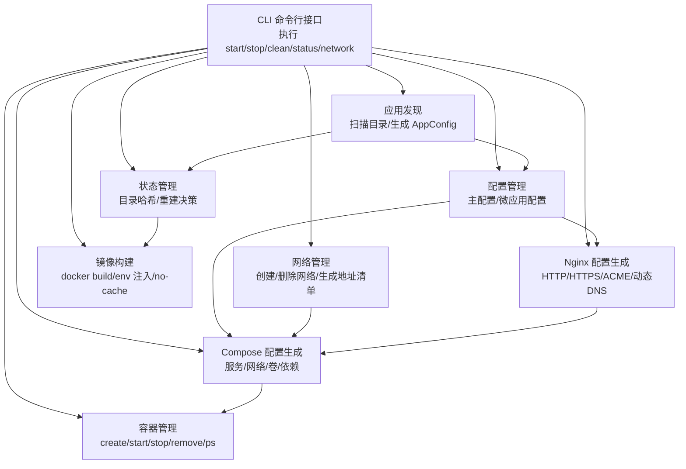
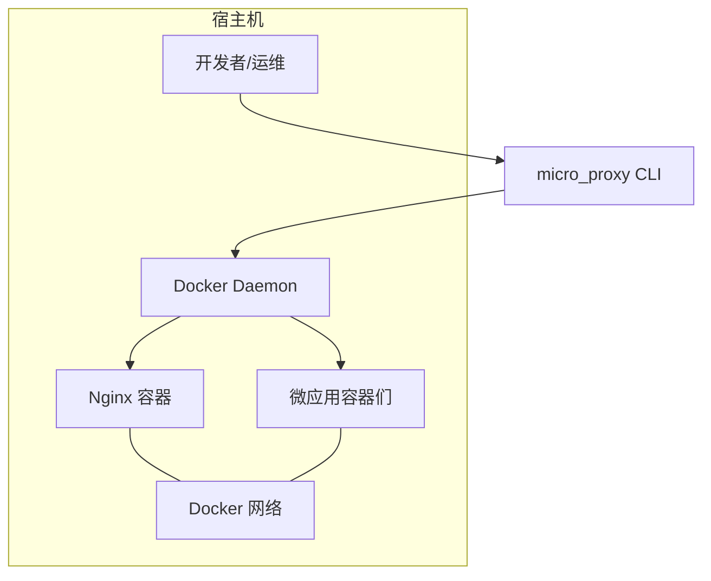
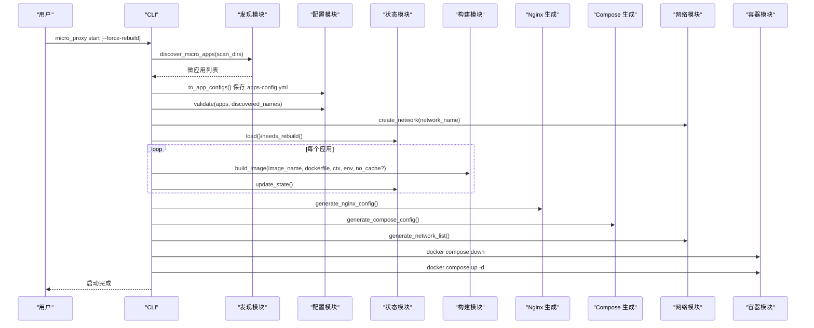
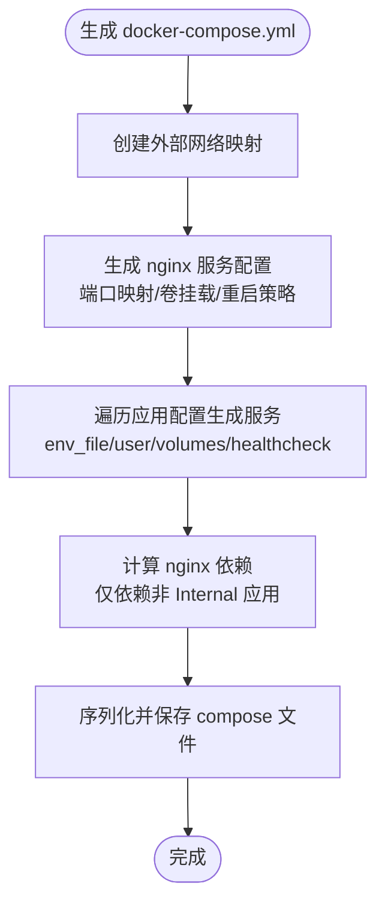
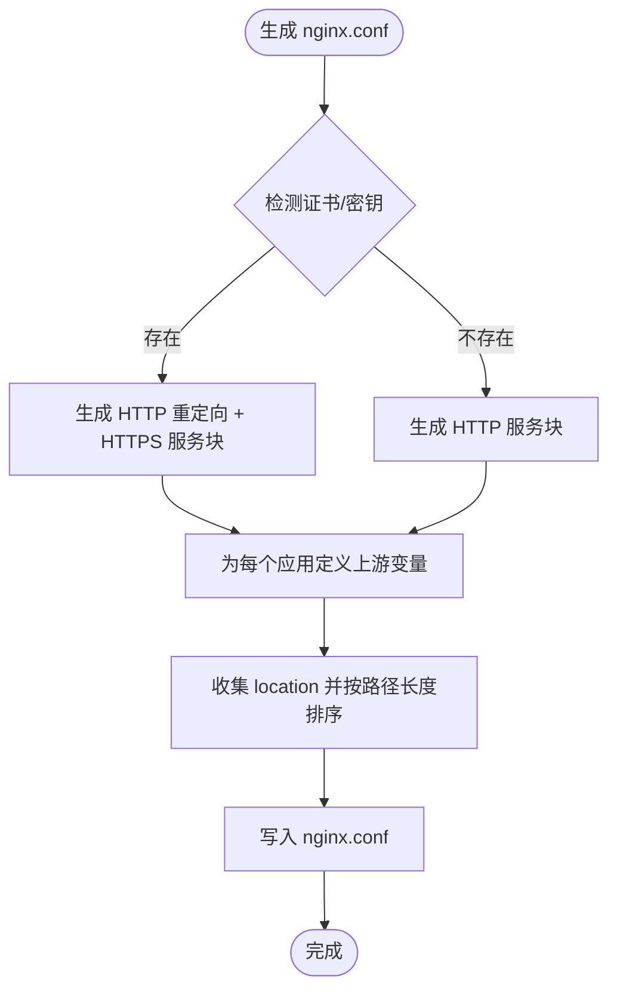
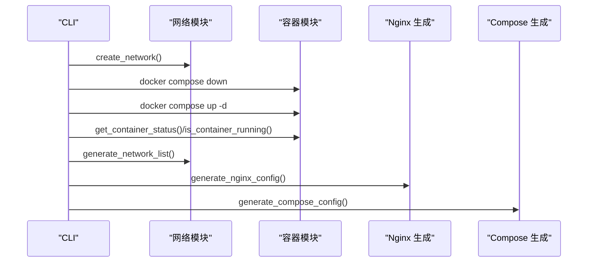
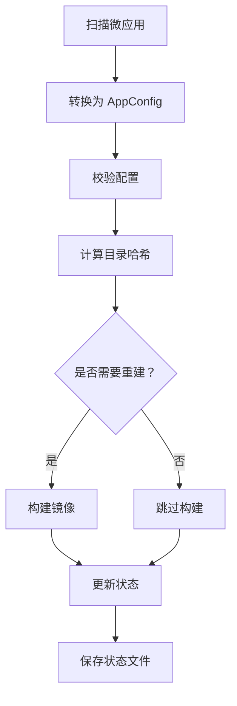
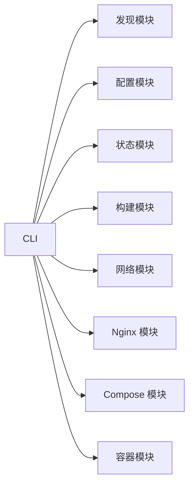

# 集成模式

<cite>
**本文引用的文件**
- [src/main.rs](file://src/main.rs)
- [src/lib.rs](file://src/lib.rs)
- [src/cli.rs](file://src/cli.rs)
- [src/config.rs](file://src/config.rs)
- [src/discovery.rs](file://src/discovery.rs)
- [src/micro_app_config.rs](file://src/micro_app_config.rs)
- [src/volumes_config.rs](file://src/volumes_config.rs)
- [src/builder.rs](file://src/builder.rs)
- [src/container.rs](file://src/container.rs)
- [src/network.rs](file://src/network.rs)
- [src/compose.rs](file://src/compose.rs)
- [src/nginx.rs](file://src/nginx.rs)
- [src/state.rs](file://src/state.rs)
- [src/dockerfile.rs](file://src/dockerfile.rs)
- [README.md](file://README.md)
</cite>

## 目录
1. [引言](#引言)
2. [项目结构](#项目结构)
3. [核心组件](#核心组件)
4. [架构总览](#架构总览)
5. [详细组件分析](#详细组件分析)
6. [依赖分析](#依赖分析)
7. [性能考虑](#性能考虑)
8. [故障排查指南](#故障排查指南)
9. [结论](#结论)
10. [附录](#附录)

## 引言
本文件聚焦 micro_proxy 与外部系统的集成模式与设计，围绕 Docker、Docker Compose、Nginx 等外部系统的集成架构展开，系统阐述容器化集成、网络集成与代理集成的实现模式；解释 API 调用方式、配置同步机制与状态管理策略；并给出错误处理与容错机制、集成架构图与交互序列图，以及扩展与注意事项。

## 项目结构
micro_proxy 采用模块化设计，围绕“配置发现—构建—编排—代理—状态”的闭环流程组织代码。主要模块职责如下：
- CLI 层：命令行入口与子命令调度，协调各模块执行
- 配置层：主配置与微应用配置解析与校验
- 发现层：扫描目录，发现微应用并生成 AppConfig
- 构建层：调用 Docker 构建镜像，支持环境变量注入与缓存控制
- 容器层：封装 docker 命令，管理容器生命周期
- 网络层：创建/删除 Docker 网络，生成网络地址清单
- Compose 层：生成 docker-compose.yml，统一管理服务、网络、卷与依赖
- Nginx 层：生成 nginx.conf，支持 HTTP/HTTPS、ACME 验证与动态 DNS
- 状态层：基于目录哈希的状态管理，决定是否重建镜像
- Dockerfile 解析：解析 Dockerfile 中的 EXPOSE 指令

图表来源
- [src/cli.rs:78-116](file://src/cli.rs#L78-L116)
- [src/discovery.rs:235-352](file://src/discovery.rs#L235-L352)
- [src/config.rs:125-164](file://src/config.rs#L125-L164)
- [src/state.rs:40-186](file://src/state.rs#L40-L186)
- [src/network.rs:15-86](file://src/network.rs#L15-L86)
- [src/nginx.rs:26-92](file://src/nginx.rs#L26-L92)
- [src/compose.rs:31-119](file://src/compose.rs#L31-L119)
- [src/container.rs:19-176](file://src/container.rs#L19-L176)
- [src/builder.rs:20-120](file://src/builder.rs#L20-L120)

章节来源
- [src/lib.rs:6-25](file://src/lib.rs#L6-L25)
- [README.md:16-47](file://README.md#L16-L47)

## 核心组件
- CLI 与命令流：负责解析参数、初始化日志、加载配置、执行子命令、调用各模块并汇总结果
- 配置系统：ProxyConfig（主配置）、AppConfig（动态生成）、MicroAppConfig（微应用配置）、VolumesConfig（卷配置）
- 发现与转换：discover_micro_apps 扫描目录，生成 MicroApp，再转为 AppConfig
- 构建与镜像：build_image 调用 docker build，支持 no-cache、env_file 注入
- 容器生命周期：create/start/stop/remove/get_container_status/is_container_running
- 网络管理：create_network/remove_network/network_exists/generate_network_list
- Compose 生成：generate_compose_config/save_compose_config，生成服务、网络、卷、依赖
- Nginx 生成：generate_nginx_config/save_nginx_config，支持 HTTP/HTTPS、ACME、动态 DNS
- 状态管理：calculate_directory_hash/needs_rebuild/update_state/save/load

章节来源
- [src/cli.rs:78-116](file://src/cli.rs#L78-L116)
- [src/config.rs:125-367](file://src/config.rs#L125-L367)
- [src/discovery.rs:12-145](file://src/discovery.rs#L12-L145)
- [src/builder.rs:20-120](file://src/builder.rs#L20-L120)
- [src/container.rs:19-176](file://src/container.rs#L19-L176)
- [src/network.rs:15-119](file://src/network.rs#L15-L119)
- [src/compose.rs:31-119](file://src/compose.rs#L31-L119)
- [src/nginx.rs:26-92](file://src/nginx.rs#L26-L92)
- [src/state.rs:40-186](file://src/state.rs#L40-L186)

## 架构总览
micro_proxy 的集成架构以“统一入口 + 多微服务 + 共享网络”为核心：
- 统一入口：Nginx 作为反向代理，统一对外提供 HTTP/HTTPS 服务
- 多微服务：每个微应用独立构建镜像、运行容器，共享 Docker 网络
- 共享网络：所有服务加入同一 Docker 网络，容器间通过容器名互通
- 配置同步：动态生成 apps-config.yml，主配置 proxy-config.yml 作为权威来源
- 状态驱动：基于目录哈希的状态文件决定是否重建镜像，减少不必要的构建

图表来源
- [src/compose.rs:84-96](file://src/compose.rs#L84-L96)
- [src/network.rs:15-47](file://src/network.rs#L15-L47)
- [src/nginx.rs:26-92](file://src/nginx.rs#L26-L92)

## 详细组件分析

### CLI 与命令流（API 调用方式）
- 子命令：start、stop、clean、status、network
- start 流程：扫描微应用 → 生成动态配置 → 校验 → 创建网络 → 状态管理 → 解析 Dockerfile → 构建镜像（必要时）→ 生成 nginx.conf → 生成 docker-compose.yml → 生成网络地址清单 → down + up
- stop：调用 docker compose stop
- clean：down + 删除镜像 + 执行 clean 脚本 + 删除状态/动态配置 + 可选删除网络
- status：查询容器状态与镜像存在性
- network：生成网络地址清单并打印

图表来源
- [src/cli.rs:296-463](file://src/cli.rs#L296-L463)
- [src/discovery.rs:235-352](file://src/discovery.rs#L235-L352)
- [src/config.rs:205-218](file://src/config.rs#L205-L218)
- [src/state.rs:62-186](file://src/state.rs#L62-L186)
- [src/builder.rs:20-120](file://src/builder.rs#L20-L120)
- [src/nginx.rs:26-92](file://src/nginx.rs#L26-L92)
- [src/compose.rs:31-119](file://src/compose.rs#L31-L119)
- [src/network.rs:209-274](file://src/network.rs#L209-L274)
- [src/container.rs:19-176](file://src/container.rs#L19-L176)

章节来源
- [src/cli.rs:78-116](file://src/cli.rs#L78-L116)
- [src/cli.rs:296-463](file://src/cli.rs#L296-L463)

### Docker 与 Docker Compose 集成
- Compose 生成：统一网络（外部已存在）、nginx 服务（依赖非 Internal 应用）、各应用服务（env_file、user、volumes、healthcheck）
- 端口映射：nginx 主机端口映射至 80/443，由 domain 与证书决定
- 依赖关系：nginx depends_on 非 Internal 应用容器
- 卷挂载：nginx.conf、web_root、cert_dir；应用 volumes 由 micro-app.volumes.yml 转换而来

图表来源
- [src/compose.rs:31-119](file://src/compose.rs#L31-L119)
- [src/compose.rs:172-266](file://src/compose.rs#L172-L266)
- [src/compose.rs:277-424](file://src/compose.rs#L277-L424)
- [src/compose.rs:426-448](file://src/compose.rs#L426-L448)

章节来源
- [src/compose.rs:31-119](file://src/compose.rs#L31-L119)
- [src/compose.rs:172-266](file://src/compose.rs#L172-L266)
- [src/compose.rs:277-424](file://src/compose.rs#L277-L424)
- [src/compose.rs:426-448](file://src/compose.rs#L426-L448)

### Nginx 反向代理集成
- 生成策略：根据应用类型过滤 Internal；HTTP/HTTPS 自动切换；ACME 验证路径；动态 DNS（Docker 内部 resolver）
- 路由规则：location 按路径长度降序排序；静态应用支持子路径重写；API 应用透传 URI
- SSL：检测证书与密钥存在性，自动启用 HTTPS；HTTP 重定向 server 块与 HTTPS server 块分离

图表来源
- [src/nginx.rs:26-92](file://src/nginx.rs#L26-L92)
- [src/nginx.rs:284-416](file://src/nginx.rs#L284-L416)
- [src/nginx.rs:418-536](file://src/nginx.rs#L418-L536)
- [src/nginx.rs:538-556](file://src/nginx.rs#L538-L556)

章节来源
- [src/nginx.rs:26-92](file://src/nginx.rs#L26-L92)
- [src/nginx.rs:284-416](file://src/nginx.rs#L284-L416)
- [src/nginx.rs:418-536](file://src/nginx.rs#L418-L536)
- [src/nginx.rs:538-556](file://src/nginx.rs#L538-L556)

### 容器生命周期与网络集成
- 容器管理：create/start/stop/remove/get_container_status/is_container_running
- 网络管理：create_network/remove_network/network_exists；生成网络地址清单
- 网络地址清单：包含应用名称、容器名、网络地址、容器端口、可访问 URL（非 Internal）

图表来源
- [src/network.rs:15-119](file://src/network.rs#L15-L119)
- [src/network.rs:209-274](file://src/network.rs#L209-L274)
- [src/container.rs:185-242](file://src/container.rs#L185-L242)
- [src/nginx.rs:26-92](file://src/nginx.rs#L26-L92)
- [src/compose.rs:31-119](file://src/compose.rs#L31-L119)

章节来源
- [src/network.rs:15-119](file://src/network.rs#L15-L119)
- [src/network.rs:209-274](file://src/network.rs#L209-L274)
- [src/container.rs:185-242](file://src/container.rs#L185-L242)

### 配置同步与状态管理
- 配置同步：discover_micro_apps → to_app_configs → 保存 apps-config.yml；ProxyConfig.validate 校验应用唯一性、容器名唯一性、routes/paths/文件存在性
- 状态管理：calculate_directory_hash 基于目录内容与文件名生成哈希；needs_rebuild 判断是否重建；update_state/save/load 持久化状态

图表来源
- [src/discovery.rs:235-352](file://src/discovery.rs#L235-L352)
- [src/config.rs:205-347](file://src/config.rs#L205-L347)
- [src/state.rs:195-233](file://src/state.rs#L195-L233)
- [src/state.rs:162-177](file://src/state.rs#L162-L177)
- [src/state.rs:132-143](file://src/state.rs#L132-L143)
- [src/state.rs:95-113](file://src/state.rs#L95-L113)

章节来源
- [src/discovery.rs:235-352](file://src/discovery.rs#L235-L352)
- [src/config.rs:205-347](file://src/config.rs#L205-L347)
- [src/state.rs:195-233](file://src/state.rs#L195-L233)
- [src/state.rs:162-177](file://src/state.rs#L162-L177)
- [src/state.rs:132-143](file://src/state.rs#L132-L143)
- [src/state.rs:95-113](file://src/state.rs#L95-L113)

### Dockerfile 解析与集成
- 解析 EXPOSE 指令，提取暴露端口，用于健康检查与端口映射参考
- has_expose_instruction 判断是否存在 EXPOSE 指令

章节来源
- [src/dockerfile.rs:23-67](file://src/dockerfile.rs#L23-L67)
- [src/dockerfile.rs:76-79](file://src/dockerfile.rs#L76-L79)

## 依赖分析
- 模块耦合：CLI 作为编排者，依赖 discovery/config/state/builder/network/nginx/compose/container；各模块职责清晰、边界明确
- 外部依赖：Docker、Docker Compose、Nginx；通过命令行调用实现集成
- 配置依赖：ProxyConfig 为权威配置源；AppsConfig 为动态生成中间态；Compose/Nginx 基于 AppConfig 输出

图表来源
- [src/cli.rs:78-116](file://src/cli.rs#L78-L116)
- [src/lib.rs:6-25](file://src/lib.rs#L6-L25)

章节来源
- [src/cli.rs:78-116](file://src/cli.rs#L78-L116)
- [src/lib.rs:6-25](file://src/lib.rs#L6-L25)

## 性能考虑
- 构建缓存：支持 --no-cache（force-rebuild）禁用缓存，避免陈旧镜像；默认利用缓存提升速度
- 状态驱动：基于目录哈希判断是否重建，避免重复构建
- 生成阶段：Compose/Nginx 生成为纯函数，避免 IO 重复；仅在必要时写入文件
- 网络与 DNS：Nginx 使用 Docker 内部 DNS（127.0.0.11），带缓存与 IPv6 关闭，降低解析延迟

## 故障排查指南
- 日志：CLI 初始化 dumbo_log，输出到日志文件与控制台，便于定位问题
- 端口冲突：检查宿主机端口占用，调整 nginx_host_port
- 权限问题：VolumesConfig 校验 source/target，建议避免 root 权限；必要时生成权限初始化脚本
- 证书问题：检查 cert_dir 下证书与密钥文件存在性；使用 docker exec proxy-nginx nginx -t 验证配置
- 容器状态：使用 docker ps -a 或 micro_proxy status 查看；必要时 docker logs <container>
- 网络连通：使用 micro_proxy network 生成网络地址清单，核对容器名与端口映射

章节来源
- [src/cli.rs:81-88](file://src/cli.rs#L81-L88)
- [src/volumes_config.rs:84-143](file://src/volumes_config.rs#L84-L143)
- [README.md:328-420](file://README.md#L328-L420)

## 结论
micro_proxy 通过“配置驱动 + 状态感知 + 统一编排 + 反向代理”的模式，实现了与 Docker、Docker Compose、Nginx 的深度集成。其设计强调：
- 配置同步与校验：主配置与动态配置双轨并行，保障一致性
- 状态驱动的构建：基于目录哈希避免重复构建，提升效率
- 网络与代理：统一网络与反向代理，简化多微服务接入
- 容错与可观测：完善的日志、状态查询与网络地址清单，便于排障

## 附录

### API 调用方式与集成要点
- CLI 子命令：start/stop/clean/status/network，均通过 docker compose 与 docker 命令实现
- Compose 生成：统一网络、卷、依赖与端口映射，确保服务可发现与可访问
- Nginx 生成：动态 DNS、ACME 验证、HTTP/HTTPS 自动切换，适配多域名与证书场景

章节来源
- [src/cli.rs:118-170](file://src/cli.rs#L118-L170)
- [src/compose.rs:31-119](file://src/compose.rs#L31-L119)
- [src/nginx.rs:26-92](file://src/nginx.rs#L26-L92)

### 集成扩展与注意事项
- 扩展新外部系统：新增模块并遵循“纯函数 + 明确输入输出 + 错误包装”的模式，通过 CLI 调用
- 配置扩展：在 ProxyConfig/AppConfig/MicroAppConfig/VolumesConfig 中增加字段，配套校验与生成逻辑
- 安全与合规：避免 root 权限挂载；证书与密钥路径严格校验；网络命名空间隔离
- 可观测性：保留日志文件；提供状态查询与网络地址清单；在 CI/CD 中结合状态文件进行增量构建

章节来源
- [src/config.rs:125-367](file://src/config.rs#L125-L367)
- [src/volumes_config.rs:84-143](file://src/volumes_config.rs#L84-L143)
- [README.md:16-47](file://README.md#L16-L47)