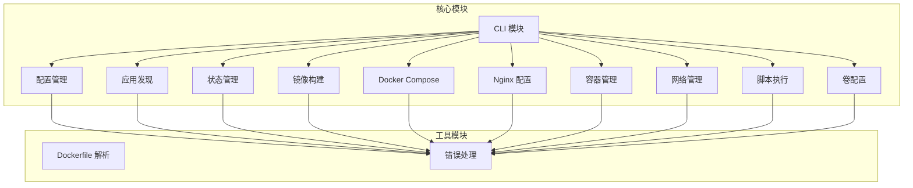
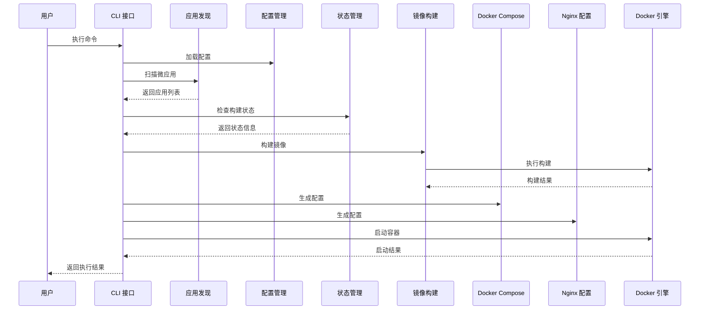
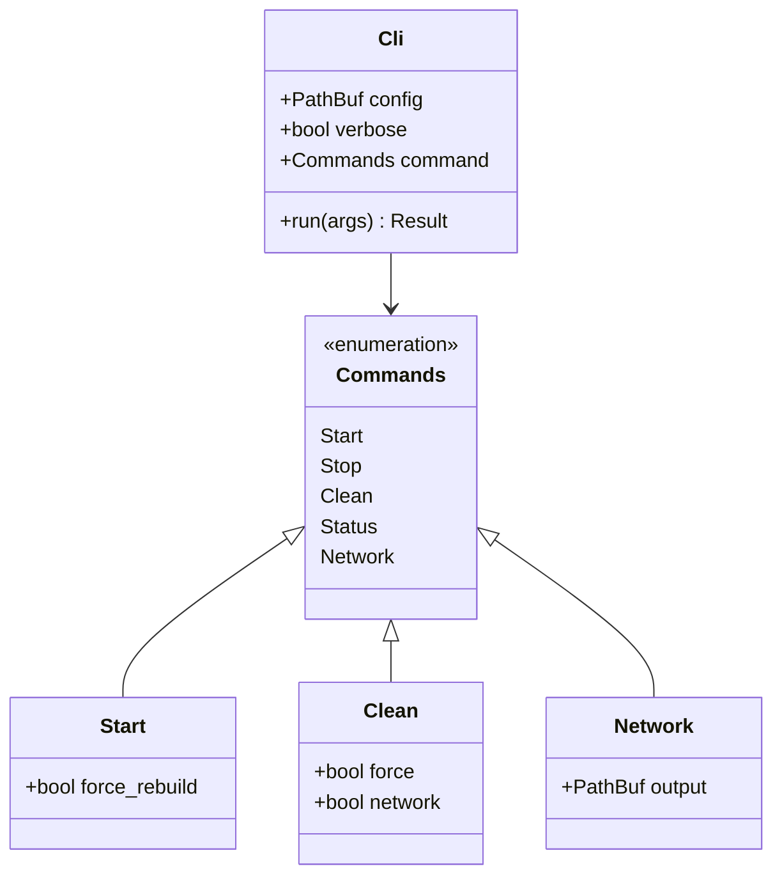
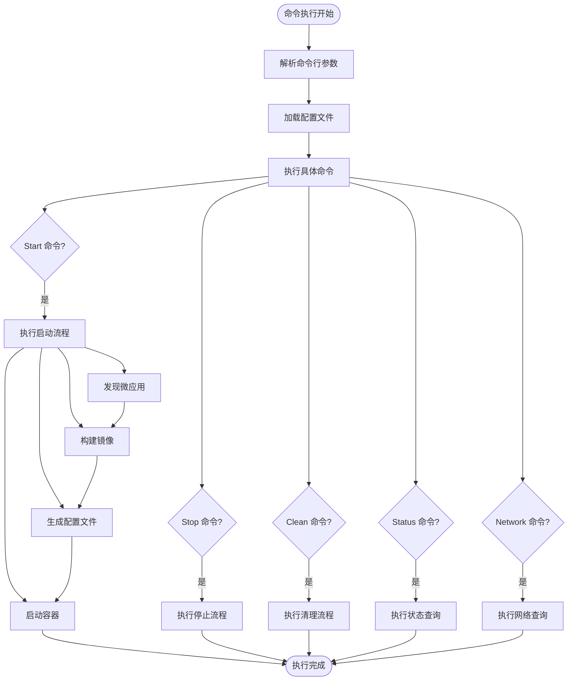
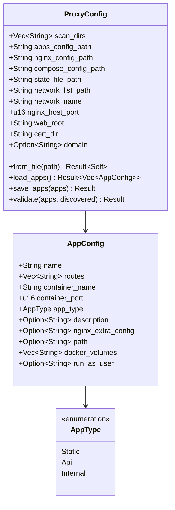
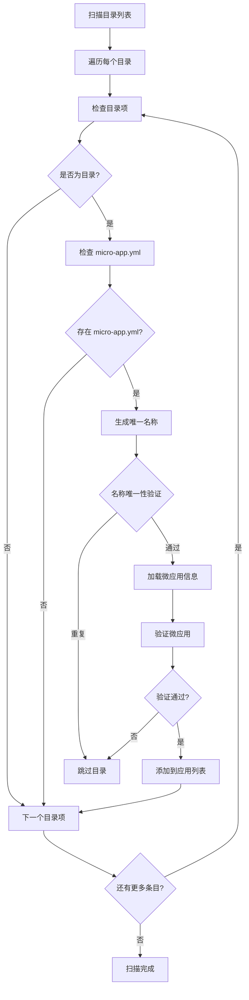
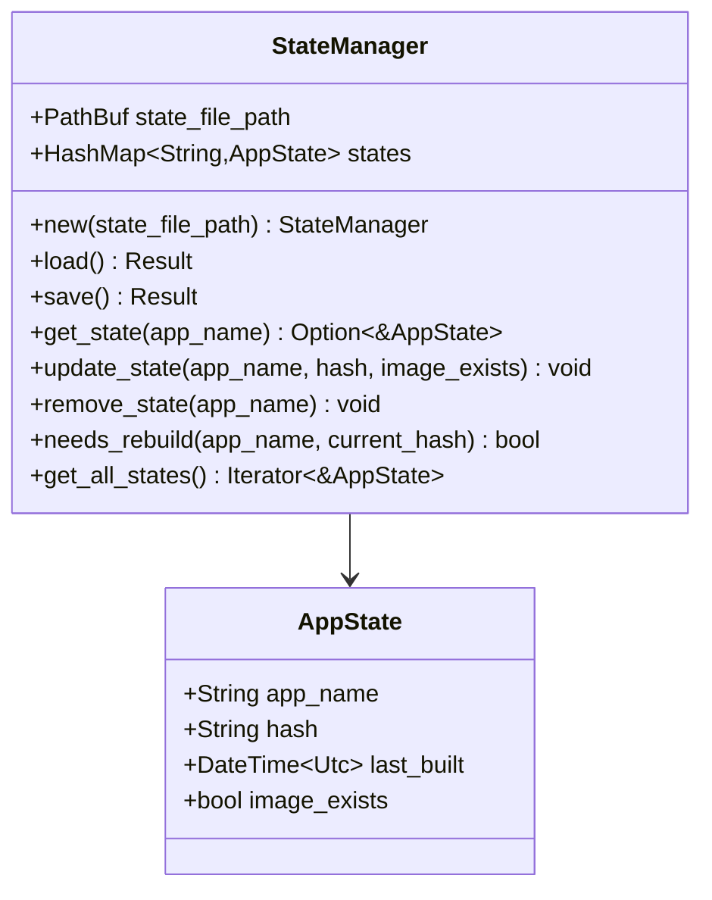
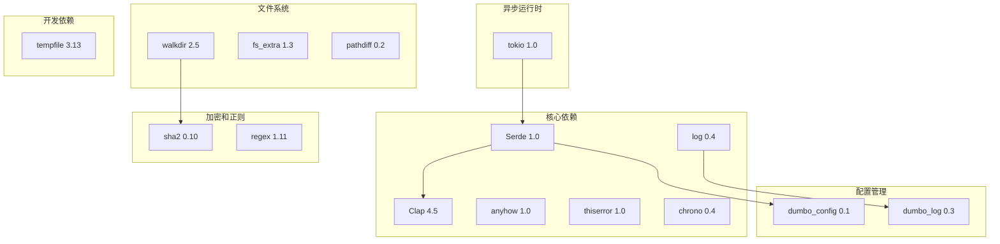

# 贡献指南

<cite>
**本文档引用的文件**
- [README.md](file://README.md)
- [Cargo.toml](file://Cargo.toml)
- [src/main.rs](file://src/main.rs)
- [src/lib.rs](file://src/lib.rs)
- [src/cli.rs](file://src/cli.rs)
- [src/config.rs](file://src/config.rs)
- [src/discovery.rs](file://src/discovery.rs)
- [src/state.rs](file://src/state.rs)
- [src/error.rs](file://src/error.rs)
- [deploy_to_local.sh](file://deploy_to_local.sh)
- [upload.sh](file://upload.sh)
- [docs/micro-app-development.md](file://docs/micro-app-development.md)
- [docs/ssl-configuration.md](file://docs/ssl-configuration.md)
- [docs/micro-app-volumes-refactor-plan.md](file://docs/micro-app-volumes-refactor-plan.md)
</cite>

## 目录
1. [简介](#简介)
2. [项目结构](#项目结构)
3. [核心组件](#核心组件)
4. [架构概览](#架构概览)
5. [详细组件分析](#详细组件分析)
6. [依赖分析](#依赖分析)
7. [性能考虑](#性能考虑)
8. [故障排除指南](#故障排除指南)
9. [结论](#结论)
10. [附录](#附录)

## 简介

micro_proxy 是一个用于管理微应用的工具，支持 Docker 镜像构建、容器管理、Nginx 反向代理配置等功能。该项目采用 Rust 语言开发，提供了完整的微服务开发和部署解决方案。

## 项目结构

项目采用模块化设计，主要包含以下核心模块：



**图表来源**
- [src/lib.rs:6-26](file://src/lib.rs#L6-L26)
- [src/main.rs:1-25](file://src/main.rs#L1-L25)

**章节来源**
- [src/lib.rs:1-26](file://src/lib.rs#L1-L26)
- [src/main.rs:1-25](file://src/main.rs#L1-L25)

## 核心组件

### 命令行接口 (CLI)
CLI 模块负责处理用户输入和提供命令行交互界面。支持多种子命令和参数配置。

### 配置管理系统
负责读取和解析配置文件，包括主配置文件和应用配置文件。

### 应用发现模块
扫描指定目录，自动发现包含 micro-app.yml 和 Dockerfile 的微应用。

### 状态管理模块
跟踪微应用的状态，支持基于目录 hash 的增量构建判断。

**章节来源**
- [src/cli.rs:21-116](file://src/cli.rs#L21-L116)
- [src/config.rs:125-367](file://src/config.rs#L125-L367)
- [src/discovery.rs:235-352](file://src/discovery.rs#L235-L352)
- [src/state.rs:30-186](file://src/state.rs#L30-L186)

## 架构概览

micro_proxy 采用分层架构设计，各模块职责清晰，耦合度低：



**图表来源**
- [src/cli.rs:296-463](file://src/cli.rs#L296-L463)
- [src/discovery.rs:235-352](file://src/discovery.rs#L235-L352)
- [src/state.rs:162-177](file://src/state.rs#L162-L177)

## 详细组件分析

### CLI 模块详细分析

CLI 模块实现了完整的命令行接口，支持以下命令：



**图表来源**
- [src/cli.rs:22-69](file://src/cli.rs#L22-L69)

#### 命令执行流程



**图表来源**
- [src/cli.rs:78-116](file://src/cli.rs#L78-L116)
- [src/cli.rs:296-463](file://src/cli.rs#L296-L463)

**章节来源**
- [src/cli.rs:1-669](file://src/cli.rs#L1-L669)

### 配置管理模块分析

配置管理模块负责处理各种配置文件的读取、解析和验证：



**图表来源**
- [src/config.rs:125-367](file://src/config.rs#L125-L367)

**章节来源**
- [src/config.rs:1-842](file://src/config.rs#L1-L842)

### 应用发现模块分析

应用发现模块实现了智能的微应用扫描和验证功能：



**图表来源**
- [src/discovery.rs:235-352](file://src/discovery.rs#L235-L352)

**章节来源**
- [src/discovery.rs:1-721](file://src/discovery.rs#L1-L721)

### 状态管理模块分析

状态管理模块提供了基于目录 hash 的增量构建能力：



**图表来源**
- [src/state.rs:30-186](file://src/state.rs#L30-L186)

**章节来源**
- [src/state.rs:1-311](file://src/state.rs#L1-L311)

## 依赖分析

项目采用现代化的 Rust 生态系统，主要依赖包括：



**图表来源**
- [Cargo.toml:13-55](file://Cargo.toml#L13-L55)

**章节来源**
- [Cargo.toml:1-55](file://Cargo.toml#L1-L55)

## 性能考虑

### 构建优化策略
- 使用目录 hash 进行增量构建，避免不必要的镜像重建
- 支持强制重建模式，通过 `--force-rebuild` 参数启用
- 智能的 Docker Compose 配置生成，减少重复工作

### 内存管理
- 使用 `walkdir` 进行高效的目录遍历
- 采用 `HashMap` 进行状态缓存，提供 O(1) 查找性能
- 合理的内存分配策略，避免大对象的频繁创建

### 并发处理
- 利用 Rust 的并发模型，避免数据竞争
- 使用 `tokio` 异步运行时提升 I/O 性能

## 故障排除指南

### 常见问题诊断

#### 配置文件问题
- 检查 YAML 格式是否正确
- 验证必需字段是否完整
- 确认路径配置的正确性

#### Docker 相关问题
- 确认 Docker 服务正常运行
- 检查网络权限和端口占用
- 验证镜像构建上下文路径

#### 权限问题
- 确认用户对配置文件有读取权限
- 检查 Docker socket 权限
- 验证卷挂载目录的访问权限

**章节来源**
- [src/error.rs:1-50](file://src/error.rs#L1-L50)

## 结论

micro_proxy 提供了一个完整、可靠的微服务管理解决方案。其模块化设计、完善的错误处理机制和丰富的功能特性使其成为微服务开发和部署的理想选择。

## 附录

### 开发环境搭建

#### 系统要求
- Rust 1.60+ (推荐使用 rustup 管理)
- Docker Engine 20.10+
- Docker Compose 2.0+

#### 安装步骤
1. 克隆项目仓库
2. 安装 Rust 工具链
3. 安装 Docker 和 Docker Compose
4. 运行 `cargo build` 进行编译

#### 开发工具推荐
- IDE: VS Code + Rust 插件
- 调试器: LLDB 或 GDB
- 代码格式化: rustfmt
- 代码检查: clippy

### 代码规范

#### 命名约定
- 模块名：snake_case
- 结构体名：PascalCase
- 方法名：snake_case
- 常量名：SCREAMING_SNAKE_CASE

#### 错误处理
- 使用 `anyhow` 进行错误传播
- 使用 `thiserror` 定义自定义错误类型
- 提供有意义的错误消息

#### 文档注释
- 为公共 API 添加完整的文档注释
- 使用标准的 Rust 文档格式
- 包含使用示例和注意事项

### 测试指南

#### 单元测试
- 为每个模块编写单元测试
- 使用 `#[cfg(test)]` 标记测试代码
- 测试边界条件和异常情况

#### 集成测试
- 测试完整的命令执行流程
- 验证配置文件的正确性
- 测试 Docker 集成功能

### 提交规范

#### Git 提交消息
```
<type>(<scope>): <subject>

<body>

<footer>
```

#### 提交类型
- `feat`: 新功能
- `fix`: 修复 bug
- `docs`: 文档更新
- `style`: 代码格式调整
- `refactor`: 代码重构
- `test`: 测试相关
- `chore`: 构建过程或辅助工具变动

### 版本发布

#### 发布流程
1. 更新版本号 (Cargo.toml)
2. 生成变更日志
3. 运行完整测试套件
4. 构建发布版本
5. 上传到 crates.io

#### 版本策略
- 遵循语义化版本控制
- 重大变更使用主版本号
- 功能更新使用次版本号
- 修复使用修订版本号

### 社区贡献

#### 交流渠道
- GitHub Issues: 问题报告和功能请求
- GitHub Discussions: 一般讨论和技术交流
- 邮件: zongying_cao@163.com

#### 行为准则
- 尊重他人的贡献
- 提供建设性的反馈
- 保持开放和包容的态度

### 许可证

项目采用 MIT 许可证，允许自由使用、修改和分发，但需保留原始版权声明和许可声明。