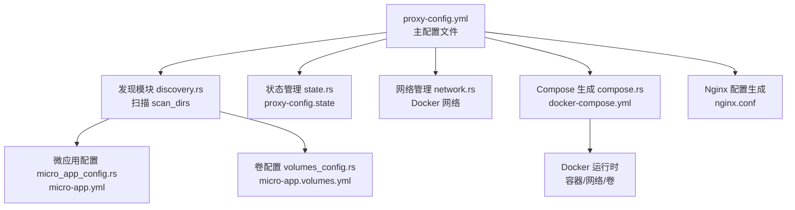
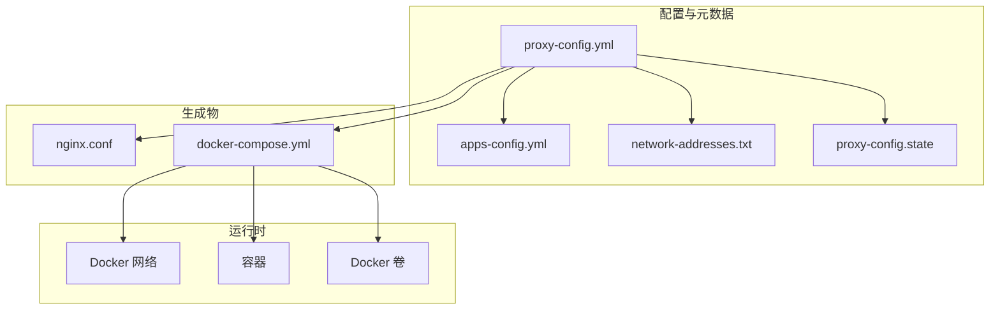
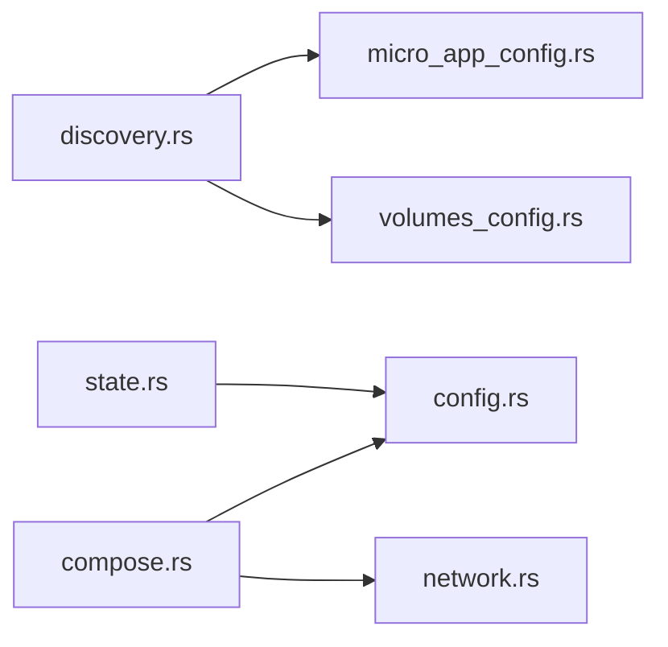

# 备份恢复

<cite>
**本文引用的文件**   
- [README.md](file://README.md)
- [proxy-config.yml.example](file://proxy-config.yml.example)
- [src/config.rs](file://src/config.rs)
- [src/state.rs](file://src/state.rs)
- [src/discovery.rs](file://src/discovery.rs)
- [src/compose.rs](file://src/compose.rs)
- [src/network.rs](file://src/network.rs)
- [src/micro_app_config.rs](file://src/micro_app_config.rs)
- [src/volumes_config.rs](file://src/volumes_config.rs)
- [deploy_to_local.sh](file://deploy_to_local.sh)
</cite>

## 目录
1. [简介](#简介)
2. [项目结构](#项目结构)
3. [核心组件](#核心组件)
4. [架构总览](#架构总览)
5. [详细组件分析](#详细组件分析)
6. [依赖分析](#依赖分析)
7. [性能考虑](#性能考虑)
8. [故障排查指南](#故障排查指南)
9. [结论](#结论)
10. [附录](#附录)

## 简介
本指南面向 micro_proxy 的运维与平台工程团队，提供系统化的备份与恢复策略，涵盖配置文件、状态数据、容器与网络、卷与持久化、灾难恢复流程、备份选择策略、存储与安全、验证与测试、以及版本兼容与迁移注意事项。目标是在发生意外停机、磁盘损坏、配置丢失或升级失败时，能够快速、可验证地恢复系统至一致、可用状态。

## 项目结构
micro_proxy 通过主配置文件驱动，自动发现微应用，生成 Nginx 与 Docker Compose 配置，管理 Docker 网络与状态文件，最终以容器化方式提供统一入口与服务编排。

图示来源
- [proxy-config.yml.example:1-53](file://proxy-config.yml.example#L1-L53)
- [src/discovery.rs:235-352](file://src/discovery.rs#L235-L352)
- [src/micro_app_config.rs:35-107](file://src/micro_app_config.rs#L35-L107)
- [src/volumes_config.rs:55-82](file://src/volumes_config.rs#L55-L82)
- [src/state.rs:40-113](file://src/state.rs#L40-L113)
- [src/network.rs:15-47](file://src/network.rs#L15-L47)
- [src/compose.rs:31-119](file://src/compose.rs#L31-L119)

章节来源
- [README.md:164-236](file://README.md#L164-L236)
- [proxy-config.yml.example:1-53](file://proxy-config.yml.example#L1-L53)

## 核心组件
- 主配置与路径：主配置文件定义扫描目录、输出路径、网络名、端口、证书与域名等，决定生成与运行行为。
- 应用发现与配置：扫描目录发现微应用，校验并加载 micro-app.yml 与 micro-app.volumes.yml。
- 状态管理：记录应用目录哈希、镜像存在性与最后构建时间，用于增量判断与重建控制。
- 网络管理：创建/检查/删除 Docker 网络，生成网络地址清单。
- Compose/Nginx 生成：基于配置生成 docker-compose.yml 与 nginx.conf，实现统一入口与服务编排。
- 卷与持久化：支持 volumes 映射与权限初始化脚本，保障数据持久化与安全。

章节来源
- [src/config.rs:125-164](file://src/config.rs#L125-L164)
- [src/discovery.rs:40-91](file://src/discovery.rs#L40-L91)
- [src/state.rs:13-28](file://src/state.rs#L13-L28)
- [src/network.rs:88-119](file://src/network.rs#L88-L119)
- [src/compose.rs:18-119](file://src/compose.rs#L18-L119)
- [src/volumes_config.rs:29-53](file://src/volumes_config.rs#L29-L53)

## 架构总览
下图展示备份与恢复涉及的关键文件与数据流：

图示来源
- [proxy-config.yml.example:11-25](file://proxy-config.yml.example#L11-L25)
- [src/config.rs:125-164](file://src/config.rs#L125-L164)
- [src/compose.rs:31-119](file://src/compose.rs#L31-L119)
- [src/network.rs:209-274](file://src/network.rs#L209-L274)
- [src/state.rs:40-113](file://src/state.rs#L40-L113)

## 详细组件分析

### 配置文件备份与恢复
- 备份范围
  - 主配置文件：proxy-config.yml（含扫描目录、输出路径、网络名、端口、证书与域名等）
  - 动态生成的应用配置：apps-config.yml（由 micro_proxy 自动生成）
  - 网络地址清单：network-addresses.txt（便于排查与审计）
- 备份策略
  - 全量：每次变更后同步备份上述文件
  - 增量：基于版本控制（Git）跟踪变更；对配置文件进行差异比较
- 存储与安全
  - 使用加密存储介质或加密归档；限制访问权限（最小权限原则）
  - 建议异地多副本与定期轮换
- 恢复步骤
  - 停止相关容器与服务
  - 恢复 proxy-config.yml、apps-config.yml、network-addresses.txt
  - 重新生成 docker-compose.yml 与 nginx.conf
  - 启动服务并验证端口与路由
- 验证方法
  - 校验生成文件内容一致性
  - 访问统一入口与各应用路由，确认连通性
  - 查看日志与容器状态

章节来源
- [proxy-config.yml.example:5-53](file://proxy-config.yml.example#L5-L53)
- [README.md:164-236](file://README.md#L164-L236)
- [src/config.rs:178-218](file://src/config.rs#L178-L218)

### 状态数据备份与恢复（proxy-config.state）
- 数据内容
  - 应用名称、目录哈希、最后构建时间、镜像存在性
- 备份策略
  - 全量：每次构建/状态更新后备份
  - 增量：结合 Git 或版本化存储，保留最近 N 个快照
- 存储与安全
  - 加密归档；访问控制；离线冷存储
- 恢复步骤
  - 停止服务
  - 恢复 proxy-config.state
  - 重新启动，系统将据此判断是否需要重建
- 验证方法
  - 比较目录哈希与重建标志位
  - 观察日志中的重建决策

章节来源
- [src/state.rs:40-113](file://src/state.rs#L40-L113)
- [src/state.rs:154-177](file://src/state.rs#L154-L177)

### 数据持久化与卷管理备份
- 卷来源
  - micro-app.volumes.yml 定义宿主机路径、容器目标路径与权限
  - 生成权限初始化脚本，确保容器内可写
- 备份策略
  - 全量：宿主机卷目录与权限脚本
  - 增量：基于 rsync 或快照工具，仅同步变更
- 存储与安全
  - 卷目录加密；最小权限；定期校验
- 恢复步骤
  - 恢复宿主机卷目录
  - 重新生成权限初始化脚本并执行
  - 重新生成 docker-compose.yml 并启动
- 验证方法
  - 检查容器内挂载点与权限
  - 写入测试文件并校验

章节来源
- [src/volumes_config.rs:55-82](file://src/volumes_config.rs#L55-L82)
- [src/volumes_config.rs:145-196](file://src/volumes_config.rs#L145-L196)
- [src/compose.rs:268-424](file://src/compose.rs#L268-L424)

### 容器与网络配置备份
- 备份范围
  - docker-compose.yml（服务、网络、卷、环境变量、健康检查）
  - Docker 网络（外部网络名与存在性）
- 备份策略
  - 全量：每次生成后备份
  - 增量：对比生成前后差异
- 存储与安全
  - 加密归档；最小权限访问
- 恢复步骤
  - 恢复 docker-compose.yml
  - 确认 Docker 网络存在（必要时创建）
  - 重新拉起服务并验证端口映射与依赖
- 验证方法
  - docker ps、docker network ls
  - curl 访问统一入口与各路由

章节来源
- [src/compose.rs:31-119](file://src/compose.rs#L31-L119)
- [src/network.rs:15-47](file://src/network.rs#L15-L47)

### 灾难恢复流程与时间要求
- RTO/RPO 建议
  - RTO：单次恢复不超过 2 小时（含生成与启动）
  - RPO：分钟级（配置与状态文件每日全量+增量备份）
- 流程
  - 评估影响范围（配置/状态/卷/网络）
  - 优先恢复配置与状态文件，再恢复卷数据
  - 重新生成 docker-compose.yml 与 nginx.conf
  - 启动服务并进行端到端验证
- 回滚策略
  - 保留上一个稳定版本的配置与状态快照
  - 快速回滚至最近一次成功的备份

章节来源
- [src/compose.rs:426-448](file://src/compose.rs#L426-L448)
- [src/network.rs:209-274](file://src/network.rs#L209-L274)

### 备份选择策略（全量 vs 增量）
- 全量备份
  - 适用：首次部署、重大变更、关键节点
  - 优点：恢复简单、一致性强
  - 成本：存储空间大、耗时较长
- 增量备份
  - 适用：日常维护、小规模变更
  - 优点：节省空间、快速
  - 成本：复杂度高、依赖版本控制
- 建议组合
  - 每周全量 + 每日增量 + 版本控制差异

章节来源
- [deploy_to_local.sh:1-119](file://deploy_to_local.sh#L1-L119)

### 备份数据的存储位置与安全保护
- 存储位置
  - 本地：受控服务器或 NAS
  - 远程：云存储（加密桶）、离线磁带库
- 安全保护
  - 传输加密（TLS/SSH）
  - 存储加密（卷级/文件级）
  - 访问控制（IAM/ACL/密钥轮换）
  - 定期审计与完整性校验（哈希）

章节来源
- [proxy-config.yml.example:33-52](file://proxy-config.yml.example#L33-L52)

### 恢复流程详细步骤与验证
- 步骤
  - 停止服务与容器
  - 恢复 proxy-config.yml、apps-config.yml、proxy-config.state、network-addresses.txt
  - 重新生成 docker-compose.yml 与 nginx.conf
  - 启动服务并等待健康检查通过
  - 端到端验证：统一入口、路由、证书（如启用）
- 验证
  - curl 访问首页与 API
  - docker logs 查看错误
  - docker inspect 检查卷与网络

章节来源
- [src/compose.rs:426-448](file://src/compose.rs#L426-L448)
- [src/network.rs:209-274](file://src/network.rs#L209-L274)

### 备份验证与恢复测试
- 备份验证
  - 文件完整性校验（哈希）
  - 生成物一致性比对（YAML 结构）
- 恢复测试
  - 模拟恢复演练（隔离环境）
  - 端到端回归测试（路由、证书、卷）
  - 性能基线对比（启动时间、响应延迟）

章节来源
- [src/state.rs:235-311](file://src/state.rs#L235-L311)
- [src/discovery.rs:376-721](file://src/discovery.rs#L376-L721)

### 版本兼容性与数据迁移注意事项
- 版本兼容
  - 主配置字段演进：新增字段建议提供默认值，避免破坏旧配置
  - 应用类型与路由规则：保持向后兼容，避免强制变更
- 迁移策略
  - 渐进式：先在测试环境验证，再灰度到生产
  - 回滚：保留旧版配置与状态快照
- 风险控制
  - 变更前全量备份
  - 变更后自动化验证

章节来源
- [src/config.rs:166-176](file://src/config.rs#L166-L176)
- [src/micro_app_config.rs:55-107](file://src/micro_app_config.rs#L55-L107)

## 依赖分析
- 组件耦合
  - discovery.rs 依赖 micro_app_config.rs 与 volumes_config.rs
  - compose.rs 依赖 config.rs 与 network.rs
  - state.rs 与 config.rs 独立，但共同影响重建逻辑
- 外部依赖
  - Docker CLI（网络与容器操作）
  - Nginx（反向代理）
  - 证书目录与 web_root（HTTPS）

图示来源
- [src/discovery.rs:40-91](file://src/discovery.rs#L40-L91)
- [src/compose.rs:31-119](file://src/compose.rs#L31-L119)
- [src/state.rs:40-113](file://src/state.rs#L40-L113)

## 性能考虑
- 备份性能
  - 增量备份优先；压缩与去重
  - 异步备份，避开业务高峰
- 恢复性能
  - 优先恢复配置与状态，缩短重建时间
  - 并行启动非内部服务，减少依赖链路

## 故障排查指南
- 常见问题定位
  - 配置错误：检查 proxy-config.yml 与 apps-config.yml
  - 端口冲突：调整 nginx_host_port
  - 卷挂载失败：检查宿主机路径与权限
  - 证书问题：验证 cert_dir 与 domain 配置
- 建议命令
  - docker logs、docker ps -a、docker inspect
  - curl 访问统一入口与路由

章节来源
- [README.md:328-420](file://README.md#L328-L420)

## 结论
通过将配置、状态、卷与网络纳入统一的备份与恢复体系，结合全量与增量策略、严格的存储与安全措施、完善的验证与测试流程，micro_proxy 可在灾难发生时快速恢复至一致可用状态。建议将备份纳入 CI/CD 与发布流程，形成自动化闭环。

## 附录
- 关键路径参考
  - 主配置：proxy-config.yml
  - 动态配置：apps-config.yml
  - 状态文件：proxy-config.state
  - 网络清单：network-addresses.txt
  - 生成物：docker-compose.yml、nginx.conf
- 建议模板
  - 备份计划：每周全量 + 每日增量 + Git 差异
  - 存储：本地加密 + 远程加密 + 离线冷存
  - 验证：自动化脚本 + 手工回归