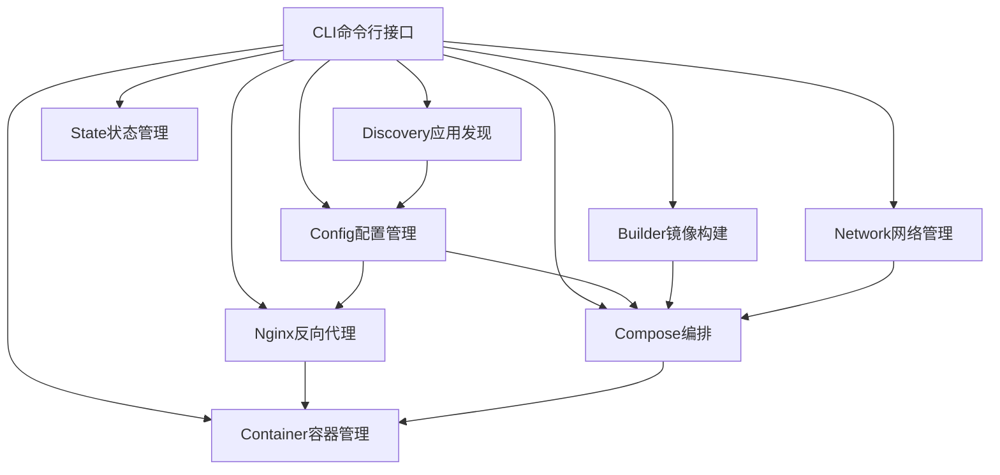
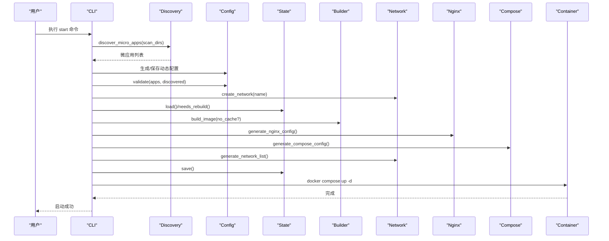
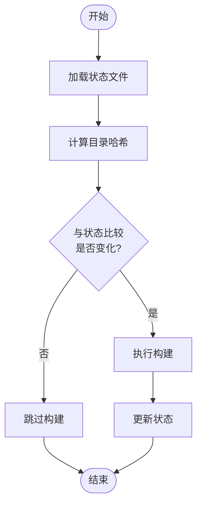
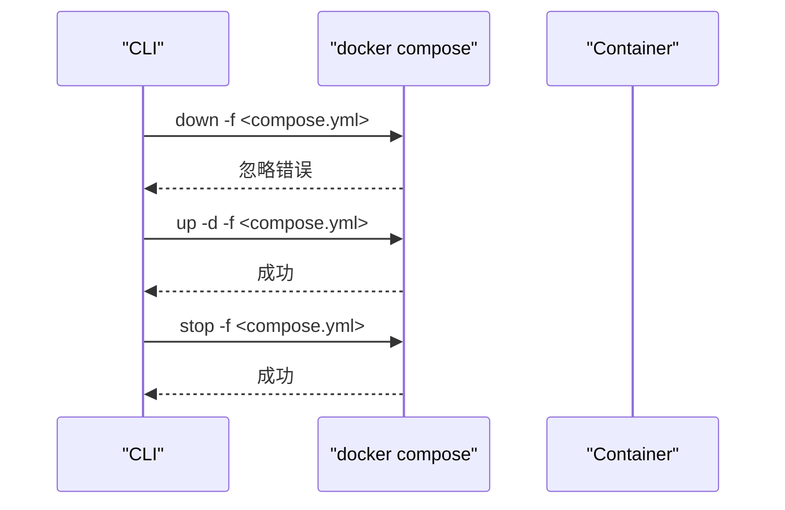
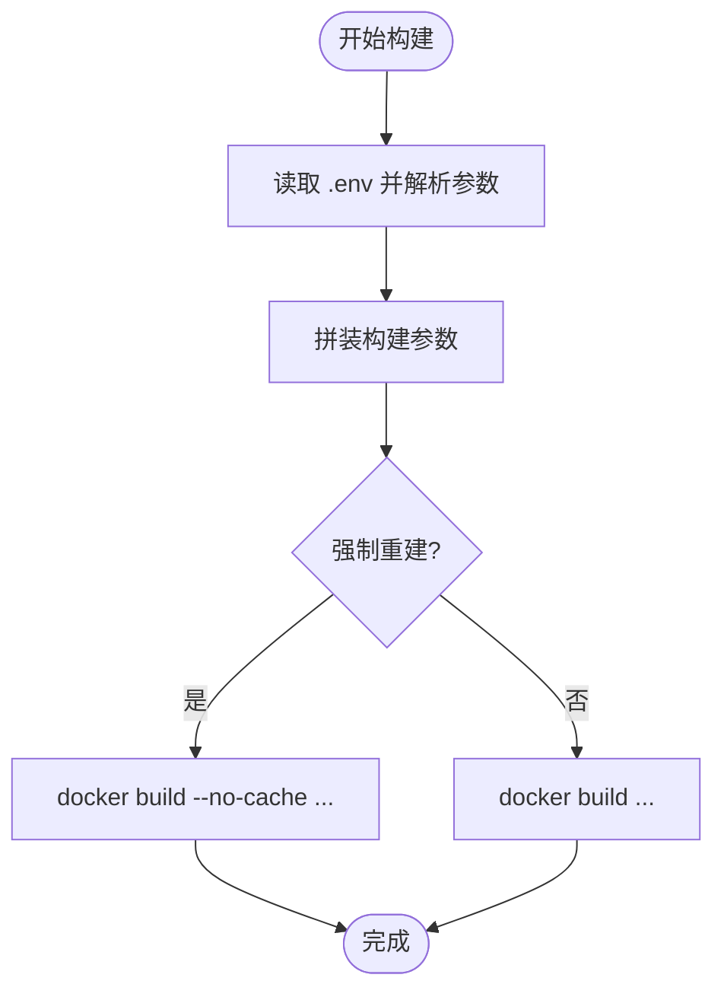
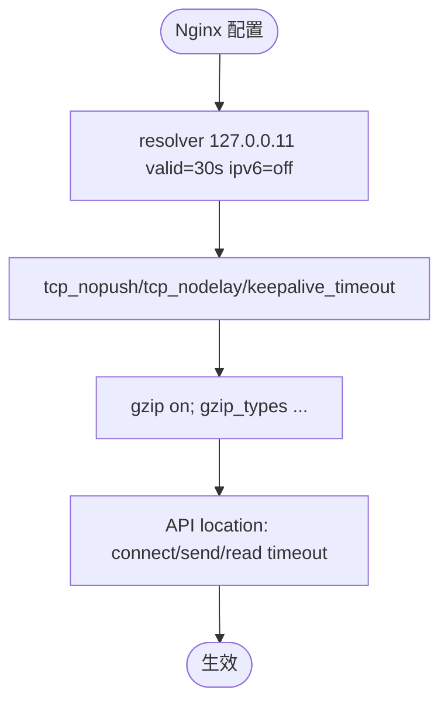
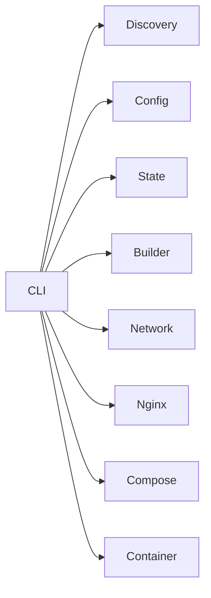

# 性能优化

<cite>
**本文引用的文件**
- [src/main.rs](file://src/main.rs)
- [src/lib.rs](file://src/lib.rs)
- [src/state.rs](file://src/state.rs)
- [src/container.rs](file://src/container.rs)
- [src/config.rs](file://src/config.rs)
- [src/cli.rs](file://src/cli.rs)
- [src/builder.rs](file://src/builder.rs)
- [src/network.rs](file://src/network.rs)
- [src/nginx.rs](file://src/nginx.rs)
- [src/compose.rs](file://src/compose.rs)
- [src/discovery.rs](file://src/discovery.rs)
- [src/dockerfile.rs](file://src/dockerfile.rs)
- [Cargo.toml](file://Cargo.toml)
- [README.md](file://README.md)
- [proxy-config.yml.example](file://proxy-config.yml.example)
</cite>

## 目录
1. [引言](#引言)
2. [项目结构](#项目结构)
3. [核心组件](#核心组件)
4. [架构总览](#架构总览)
5. [详细组件分析](#详细组件分析)
6. [依赖分析](#依赖分析)
7. [性能考量](#性能考量)
8. [故障排查指南](#故障排查指南)
9. [结论](#结论)
10. [附录](#附录)

## 引言
本指南聚焦 micro_proxy 的性能优化，围绕“构建缓存与状态管理”“容器启动/停止优化”“资源配置与限制”“网络性能与连接池”“Docker 镜像构建优化”“并发与资源调度”“内存/CPU 监控与调优”“磁盘 I/O 与网络 I/O 优化”“负载均衡与高可用”等方面展开，结合源码实现给出可操作的建议与最佳实践。

## 项目结构
micro_proxy 采用模块化设计，围绕 CLI、配置、发现、构建、容器、网络、Nginx、Compose 等模块协同工作，形成“发现 → 配置 → 构建 → 编排 → 代理”的闭环。关键模块职责如下：
- CLI：命令入口与流程编排
- Discovery：扫描微应用目录，生成微应用清单
- Config：主配置与应用配置模型
- Builder：镜像构建（含缓存控制）
- Container：容器生命周期管理
- Network：Docker 网络管理
- Nginx：反向代理配置生成
- Compose：docker-compose.yml 生成
- State：构建状态与目录哈希缓存

**图表来源**
- [src/cli.rs:78-116](file://src/cli.rs#L78-L116)
- [src/discovery.rs:235-352](file://src/discovery.rs#L235-L352)
- [src/config.rs:125-164](file://src/config.rs#L125-L164)
- [src/state.rs:30-38](file://src/state.rs#L30-L38)
- [src/builder.rs:20-120](file://src/builder.rs#L20-L120)
- [src/network.rs:8-47](file://src/network.rs#L8-L47)
- [src/nginx.rs:26-92](file://src/nginx.rs#L26-L92)
- [src/compose.rs:31-119](file://src/compose.rs#L31-L119)
- [src/container.rs:19-77](file://src/container.rs#L19-L77)

**章节来源**
- [src/lib.rs:6-18](file://src/lib.rs#L6-L18)
- [src/main.rs:3-24](file://src/main.rs#L3-L24)
- [README.md:33-47](file://README.md#L33-L47)

## 核心组件
- 状态管理与构建缓存
  - 通过目录哈希判断是否需要重新构建，避免不必要的镜像构建，显著降低构建时间与资源消耗。
  - 状态文件持久化，跨进程/多次运行复用缓存。
- 容器生命周期
  - 提供创建、启动、停止、删除、状态查询等能力，支持幂等操作与错误容忍。
- 镜像构建
  - 支持禁用构建缓存（强制重建），并可注入构建参数（来自 .env）。
- 网络与编排
  - 统一 Docker 网络管理；生成 docker-compose.yml，按应用类型决定依赖与健康检查。
- 反向代理
  - 自动生成 Nginx 配置，支持动态 DNS 解析、Gzip、keepalive、ACME 验证等。

**章节来源**
- [src/state.rs:145-233](file://src/state.rs#L145-L233)
- [src/container.rs:19-176](file://src/container.rs#L19-L176)
- [src/builder.rs:20-120](file://src/builder.rs#L20-L120)
- [src/network.rs:8-86](file://src/network.rs#L8-L86)
- [src/compose.rs:31-119](file://src/compose.rs#L31-L119)
- [src/nginx.rs:26-92](file://src/nginx.rs#L26-L92)

## 架构总览
整体流程：CLI 读取配置 → 发现微应用 → 生成动态配置 → 校验配置 → 创建/校验网络 → 计算目录哈希 → 判断是否需要构建 → 生成 Nginx/Compose 配置 → 生成网络地址列表 → 保存状态 → 启动容器。

**图表来源**
- [src/cli.rs:296-463](file://src/cli.rs#L296-L463)
- [src/discovery.rs:235-352](file://src/discovery.rs#L235-L352)
- [src/config.rs:178-218](file://src/config.rs#L178-L218)
- [src/state.rs:62-113](file://src/state.rs#L62-L113)
- [src/builder.rs:20-120](file://src/builder.rs#L20-L120)
- [src/network.rs:8-47](file://src/network.rs#L8-L47)
- [src/nginx.rs:26-92](file://src/nginx.rs#L26-L92)
- [src/compose.rs:31-119](file://src/compose.rs#L31-L119)
- [src/container.rs:456-457](file://src/container.rs#L456-L457)

## 详细组件分析

### 状态管理与构建缓存
- 目录哈希计算：遍历目录（排除 .git），对文件名与内容分别参与哈希，确保变更可感知。
- 状态文件：YAML 序列化/反序列化，记录应用名称、目录哈希、最后构建时间、镜像存在性。
- 缓存命中策略：若当前哈希与状态一致，则跳过构建；否则触发构建并更新状态。

**图表来源**
- [src/state.rs:62-113](file://src/state.rs#L62-L113)
- [src/state.rs:195-233](file://src/state.rs#L195-L233)

**章节来源**
- [src/state.rs:145-186](file://src/state.rs#L145-L186)
- [src/state.rs:195-233](file://src/state.rs#L195-L233)

### 容器启动与停止优化
- 启动流程：先 down（忽略错误，确保干净环境）→ up -d，减少残留容器影响。
- 停止/删除：优雅停止，失败不中断后续流程；删除时忽略不存在的容器。
- 健康检查：Static/API 类型容器配置健康检查，提升可用性与可观测性。

**图表来源**
- [src/cli.rs:448-457](file://src/cli.rs#L448-L457)
- [src/compose.rs:389-448](file://src/compose.rs#L389-L448)

**章节来源**
- [src/cli.rs:465-474](file://src/cli.rs#L465-L474)
- [src/container.rs:86-143](file://src/container.rs#L86-L143)
- [src/compose.rs:357-424](file://src/compose.rs#L357-L424)

### 镜像构建与缓存策略
- 构建参数：支持 --no-cache 强制重建；可从 .env 注入构建参数。
- 缓存利用：默认启用构建缓存，结合状态管理可避免重复构建。
- 环境变量注入：读取 .env 文件，逐行解析键值对，作为 --build-arg 传入。

**图表来源**
- [src/builder.rs:67-88](file://src/builder.rs#L67-L88)
- [src/builder.rs:61-65](file://src/builder.rs#L61-L65)
- [src/builder.rs:95-120](file://src/builder.rs#L95-L120)

**章节来源**
- [src/builder.rs:20-120](file://src/builder.rs#L20-L120)

### 网络性能与连接池
- 动态 DNS 解析：Nginx 使用 Docker 内部 DNS（127.0.0.11），解析结果缓存 30s，禁用 IPv6，降低解析延迟。
- keepalive：开启 tcp_nopush/tcp_nodelay，合理 keepalive_timeout，提升连接复用效率。
- gzip：对常见文本/JSON/XML/JS/CSS 等启用压缩，降低带宽占用。
- 代理超时：API 类 location 设置 proxy_connect/send/read 超时，避免长连接阻塞。

**图表来源**
- [src/nginx.rs:187-191](file://src/nginx.rs#L187-L191)
- [src/nginx.rs:171-175](file://src/nginx.rs#L171-L175)
- [src/nginx.rs:177-186](file://src/nginx.rs#L177-L186)
- [src/nginx.rs:505-509](file://src/nginx.rs#L505-L509)

**章节来源**
- [src/nginx.rs:142-196](file://src/nginx.rs#L142-L196)
- [src/nginx.rs:272-416](file://src/nginx.rs#L272-L416)

### 资源配置与限制
- Docker Compose 服务层：
  - restart 策略：unless-stopped，提升可用性。
  - 健康检查：Static/API 类型容器添加健康检查，减少无效流量。
  - 用户与卷：支持 run_as_user 与 volumes 映射，满足权限与持久化需求。
- 网络：外部网络（external=true）复用已有网络，避免重复创建。

**章节来源**
- [src/compose.rs:160-266](file://src/compose.rs#L160-L266)
- [src/compose.rs:268-424](file://src/compose.rs#L268-L424)
- [src/network.rs:54-69](file://src/network.rs#L54-L69)

### 负载均衡与高可用
- Nginx 层：通过 location 路由到不同上游容器，配合健康检查与超时配置，提升稳定性。
- 多实例：可通过多副本部署（在 Compose 中增加 replicas，或在更高层编排）实现水平扩展。
- 内部服务：Internal 类型服务不暴露给 Nginx，仅用于微服务内通信，降低入口压力。

**章节来源**
- [src/nginx.rs:418-536](file://src/nginx.rs#L418-L536)
- [src/config.rs:12-21](file://src/config.rs#L12-L21)
- [src/compose.rs:160-266](file://src/compose.rs#L160-L266)

## 依赖分析
- 外部依赖：Docker、docker compose、Nginx、Dockerfile EXPOSE 指令。
- 内部模块耦合：CLI 串联 Discovery/Config/State/Builder/Network/Nginx/Compose/Container；Config/Compose/Nginx/Network/Builder/Container 之间通过数据结构解耦。

**图表来源**
- [src/cli.rs:78-116](file://src/cli.rs#L78-L116)
- [src/lib.rs:6-18](file://src/lib.rs#L6-L18)

**章节来源**
- [Cargo.toml:13-51](file://Cargo.toml#L13-L51)

## 性能考量
- 构建缓存与状态管理
  - 使用目录哈希避免重复构建，结合 --no-cache 强制重建策略，平衡一致性与效率。
  - 状态文件落盘，跨进程/多次运行复用，减少 IO 与 CPU 开销。
- 容器生命周期
  - 启动前 down（忽略错误），避免历史容器干扰；停止/删除采用幂等策略，减少异常开销。
  - 健康检查缩短故障恢复时间，提高整体可用性。
- 网络与代理
  - Docker 内部 DNS + 缓存 + 禁用 IPv6，降低解析与连接建立成本。
  - keepalive、gzip、超时配置，提升吞吐与响应速度。
- 镜像构建
  - 启用构建缓存；必要时使用 --no-cache；从 .env 注入参数，避免重复下载依赖。
- 并发与资源调度
  - CLI 串行流程为主，适合本地开发场景；生产可考虑在更高层编排（如 Kubernetes）实现并行与弹性扩缩容。
- 监控与调优
  - 使用 docker stats、容器日志、Nginx 访问/错误日志进行观测；结合配置调整 gzip、keepalive、超时等参数。

[本节为通用指导，不直接分析具体文件]

## 故障排查指南
- 端口冲突：检查宿主机端口占用，修改 nginx_host_port。
- 权限与卷挂载：确认宿主机路径存在与权限，检查容器内挂载点。
- SSL 证书：确认证书/密钥文件存在，验证 Nginx 配置语法与日志。
- 容器状态：使用 micro_proxy status 或 docker ps -a 排查。
- 日志：使用 -v 详细日志，查看容器与 Nginx 日志定位问题。

**章节来源**
- [README.md:363-420](file://README.md#L363-L420)

## 结论
通过“状态驱动的构建缓存 + 容器生命周期优化 + Nginx 网络优化 + Compose 资源配置 + 健康检查”的组合拳，micro_proxy 在开发与生产环境中均可获得稳定且高效的性能表现。建议在生产中结合更高层编排实现弹性与高可用，并持续以日志与指标驱动优化。

## 附录
- 关键配置项参考
  - 主配置：scan_dirs、apps_config_path、nginx_config_path、compose_config_path、state_file_path、network_list_path、network_name、nginx_host_port、web_root、cert_dir、domain
  - 应用配置：name、routes、container_name、container_port、app_type、description、nginx_extra_config、docker_volumes、run_as_user

**章节来源**
- [proxy-config.yml.example:5-53](file://proxy-config.yml.example#L5-L53)
- [src/config.rs:125-164](file://src/config.rs#L125-L164)
- [src/config.rs:23-68](file://src/config.rs#L23-L68)