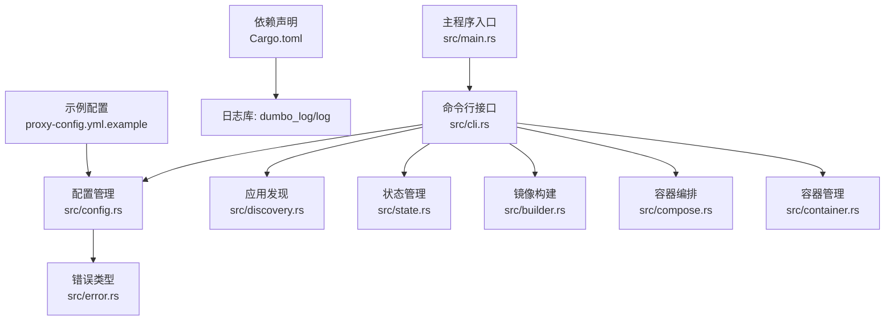
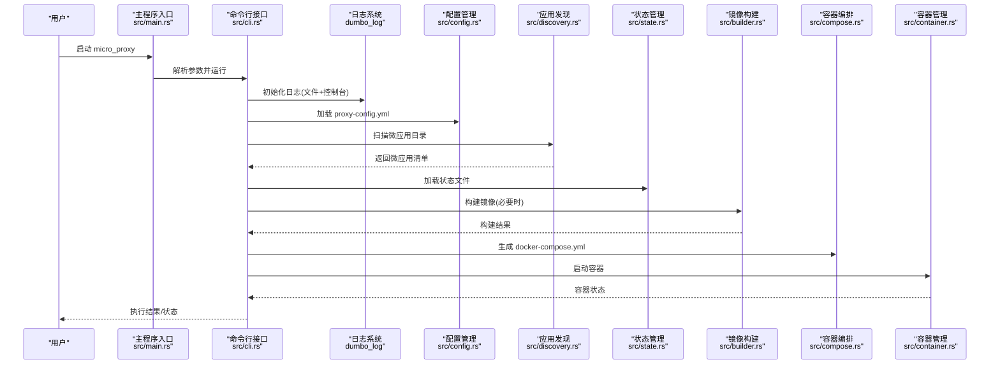
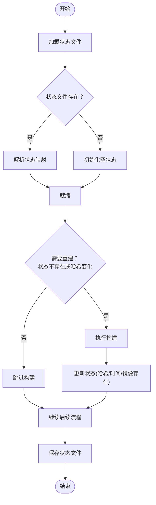
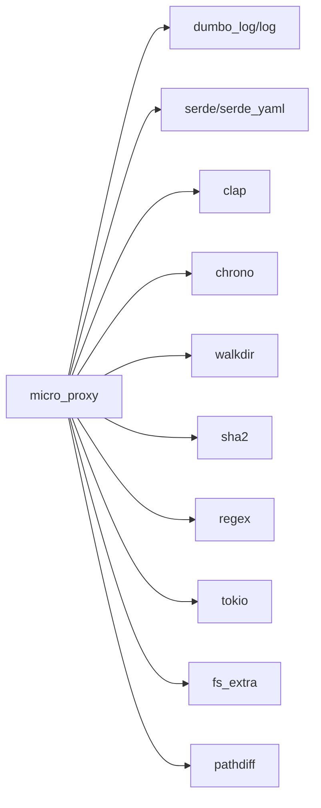

# 监控日志

<cite>
**本文引用的文件**
- [src/main.rs](file://src/main.rs)
- [src/lib.rs](file://src/lib.rs)
- [src/cli.rs](file://src/cli.rs)
- [src/state.rs](file://src/state.rs)
- [src/error.rs](file://src/error.rs)
- [src/config.rs](file://src/config.rs)
- [src/discovery.rs](file://src/discovery.rs)
- [src/container.rs](file://src/container.rs)
- [src/builder.rs](file://src/builder.rs)
- [src/compose.rs](file://src/compose.rs)
- [Cargo.toml](file://Cargo.toml)
- [proxy-config.yml.example](file://proxy-config.yml.example)
- [README.en.md](file://README.en.md)
</cite>

## 目录
1. [简介](#简介)
2. [项目结构](#项目结构)
3. [核心组件](#核心组件)
4. [架构总览](#架构总览)
5. [详细组件分析](#详细组件分析)
6. [依赖分析](#依赖分析)
7. [性能考虑](#性能考虑)
8. [故障排查指南](#故障排查指南)
9. [结论](#结论)
10. [附录](#附录)

## 简介
本指南面向 micro_proxy 的监控与日志管理，聚焦以下主题：
- 日志系统配置与使用方法
- 状态跟踪机制与监控指标含义
- 日志级别与输出格式配置
- 错误处理与异常监控
- 性能监控与资源使用采集
- 日志轮转与存储管理策略
- 告警与通知机制设置
- 监控数据可视化与报表生成
- 故障预警与自动恢复配置建议

## 项目结构
micro_proxy 采用模块化设计，围绕“配置 → 发现 → 构建 → 编排 → 运行”的流水线组织代码。日志系统贯穿 CLI、状态管理、配置加载、镜像构建、容器编排等关键路径。

图表来源
- [src/main.rs:1-25](file://src/main.rs#L1-L25)
- [src/cli.rs:78-116](file://src/cli.rs#L78-L116)
- [src/config.rs:125-220](file://src/config.rs#L125-L220)
- [src/discovery.rs:235-352](file://src/discovery.rs#L235-L352)
- [src/state.rs:40-186](file://src/state.rs#L40-L186)
- [src/builder.rs:20-120](file://src/builder.rs#L20-L120)
- [src/compose.rs:31-119](file://src/compose.rs#L31-L119)
- [src/container.rs:8-176](file://src/container.rs#L8-L176)
- [src/error.rs:1-50](file://src/error.rs#L1-L50)
- [Cargo.toml:28-30](file://Cargo.toml#L28-L30)
- [proxy-config.yml.example:1-53](file://proxy-config.yml.example#L1-L53)

章节来源
- [src/main.rs:1-25](file://src/main.rs#L1-L25)
- [src/lib.rs:1-26](file://src/lib.rs#L1-L26)
- [Cargo.toml:13-55](file://Cargo.toml#L13-L55)

## 核心组件
- 日志系统：通过 dumbo_log 初始化，输出到文件与控制台，日志文件名与包名一致。
- 配置管理：加载 proxy-config.yml，校验扫描目录、应用唯一性、路由完整性等。
- 应用发现：扫描目录，解析 micro-app.yml/Dockerfile，生成微应用清单。
- 状态管理：持久化应用状态（镜像存在性、最后构建时间、目录哈希），用于判断是否需要重建。
- 镜像构建：调用 docker build，支持禁用缓存、注入构建参数。
- 容器编排：生成 docker-compose.yml，按应用类型注入健康检查、卷挂载、用户等。
- 容器管理：封装 docker 命令，查询状态、运行中状态、启动/停止/删除容器。
- 错误模型：统一的 Error 枚举，便于日志与告警的分类处理。

章节来源
- [src/cli.rs:81-88](file://src/cli.rs#L81-L88)
- [src/config.rs:178-220](file://src/config.rs#L178-L220)
- [src/discovery.rs:235-352](file://src/discovery.rs#L235-L352)
- [src/state.rs:40-186](file://src/state.rs#L40-L186)
- [src/builder.rs:20-120](file://src/builder.rs#L20-L120)
- [src/compose.rs:31-119](file://src/compose.rs#L31-L119)
- [src/container.rs:8-176](file://src/container.rs#L8-L176)
- [src/error.rs:6-46](file://src/error.rs#L6-L46)

## 架构总览
下图展示了从 CLI 到各子系统的调用链与日志落点：

图表来源
- [src/main.rs:6-24](file://src/main.rs#L6-L24)
- [src/cli.rs:78-116](file://src/cli.rs#L78-L116)
- [src/config.rs:178-203](file://src/config.rs#L178-L203)
- [src/discovery.rs:235-352](file://src/discovery.rs#L235-L352)
- [src/state.rs:62-89](file://src/state.rs#L62-L89)
- [src/builder.rs:20-120](file://src/builder.rs#L20-L120)
- [src/compose.rs:31-119](file://src/compose.rs#L31-L119)
- [src/container.rs:86-143](file://src/container.rs#L86-L143)

## 详细组件分析

### 日志系统与配置
- 初始化：CLI 启动时调用 dumbo_log 初始化日志，输出到与包名一致的日志文件，并同时输出到控制台。
- 日志文件：文件名为包名，位于运行目录；便于与 systemd/journald 等集成。
- 日志级别：代码中广泛使用 info/debug/warn/error，便于区分常规流程、调试细节、潜在问题与错误。
- 输出格式：dumbo_log 提供统一格式，包含时间戳、级别、模块与消息；具体格式以 dumbo_log 行为为准。

章节来源
- [src/cli.rs:81-88](file://src/cli.rs#L81-L88)
- [src/config.rs:80-99](file://src/config.rs#L80-L99)
- [src/state.rs:62-89](file://src/state.rs#L62-L89)
- [src/discovery.rs:235-352](file://src/discovery.rs#L235-L352)
- [src/builder.rs:29-118](file://src/builder.rs#L29-L118)
- [src/container.rs:26-76](file://src/container.rs#L26-L76)

### 状态跟踪与监控指标
- 状态文件：记录每个应用的名称、目录哈希、最后构建时间、镜像是否存在。
- 指标含义：
  - 目录哈希：用于判断源码变更，决定是否需要重建。
  - 最后构建时间：可用于审计与排障。
  - 镜像存在性：用于快速判断镜像是否已存在，避免重复构建。
- 关键逻辑：
  - 计算目录哈希：遍历目录（忽略 .git），对文件名与内容进行哈希。
  - 需要重建判断：若状态不存在或哈希变化，则标记需要重建。
  - 更新/删除状态：在构建成功后更新状态；清理时删除状态文件。

图表来源
- [src/state.rs:62-186](file://src/state.rs#L62-L186)
- [src/state.rs:195-233](file://src/state.rs#L195-L233)

章节来源
- [src/state.rs:13-186](file://src/state.rs#L13-L186)

### 配置与校验
- 配置加载：从 proxy-config.yml 读取扫描目录、输出路径、网络名、端口、域名等。
- 校验规则：
  - 扫描目录不能为空。
  - 应用名称必须唯一。
  - Static/API 应用需存在于扫描结果且路由不为空。
  - Internal 应用必须提供 path，且该路径存在 Dockerfile；其 routes 与 nginx_extra_config 将被忽略。
- 日志行为：加载/解析失败、校验失败均记录错误/警告日志。

章节来源
- [src/config.rs:178-220](file://src/config.rs#L178-L220)
- [src/config.rs:221-347](file://src/config.rs#L221-L347)
- [proxy-config.yml.example:5-53](file://proxy-config.yml.example#L5-L53)

### 应用发现与转换
- 发现流程：遍历扫描目录，筛选包含 micro-app.yml 的目录，生成唯一应用名，校验容器名唯一性。
- 转换：将 MicroApp 转换为 AppConfig，注入路由、容器名、端口、类型、卷与用户等。
- 日志行为：扫描开始/完成、发现应用、名称冲突、容器名冲突、验证失败等均有日志记录。

章节来源
- [src/discovery.rs:235-352](file://src/discovery.rs#L235-L352)
- [src/discovery.rs:121-144](file://src/discovery.rs#L121-L144)

### 镜像构建与容器编排
- 构建：调用 docker build，支持禁用缓存、注入 .env 中的构建参数。
- 编排：生成 docker-compose.yml，按应用类型注入健康检查、卷挂载、用户、依赖等。
- 日志行为：构建开始/结束、失败原因、依赖关系、卷挂载、健康检查等均有日志记录。

章节来源
- [src/builder.rs:20-120](file://src/builder.rs#L20-L120)
- [src/compose.rs:31-119](file://src/compose.rs#L31-L119)
- [src/compose.rs:172-266](file://src/compose.rs#L172-L266)
- [src/compose.rs:268-424](file://src/compose.rs#L268-L424)

### 容器生命周期管理
- 管理：封装 create/start/stop/remove，查询状态与运行中状态。
- 日志行为：命令执行、失败输出、不存在/已停止等场景均有日志记录。

章节来源
- [src/container.rs:8-176](file://src/container.rs#L8-L176)

### 错误处理与异常监控
- 错误模型：统一的 Error 枚举，涵盖配置、IO、YAML、Docker、脚本、网络、发现、构建、容器、状态、Dockerfile、Nginx、Compose 等。
- 异常监控：各模块在关键节点记录 error/warn/info/debug，便于集中化日志采集与告警。

章节来源
- [src/error.rs:6-46](file://src/error.rs#L6-L46)
- [src/config.rs:87-95](file://src/config.rs#L87-L95)
- [src/discovery.rs:97-118](file://src/discovery.rs#L97-L118)
- [src/builder.rs:96-110](file://src/builder.rs#L96-L110)
- [src/container.rs:59-76](file://src/container.rs#L59-L76)

## 依赖分析
- 日志：dumbo_log 与 log，用于统一日志输出。
- 配置：serde/serde_yaml 用于 YAML 序列化/反序列化。
- 命令行：clap 提供 CLI 解析。
- 时间：chrono 用于时间戳序列化。
- 其他：walkdir、sha2、regex、tokio、fs_extra、pathdiff 等辅助模块。

图表来源
- [Cargo.toml:13-55](file://Cargo.toml#L13-L55)

章节来源
- [Cargo.toml:13-55](file://Cargo.toml#L13-L55)

## 性能考虑
- 构建缓存：支持禁用缓存（强制重建），在开发阶段可提升一致性，但会增加构建时间。
- 目录哈希：遍历目录并读取文件内容进行哈希，大仓库或频繁变更场景可能带来 IO 开销。
- 健康检查：Static/API 应用注入健康检查，有助于编排层快速感知异常，减少无效流量。
- 网络与卷：外部网络复用与最小化卷挂载，降低容器间耦合与 IO 压力。

章节来源
- [src/builder.rs:61-65](file://src/builder.rs#L61-L65)
- [src/state.rs:195-233](file://src/state.rs#L195-L233)
- [src/compose.rs:358-421](file://src/compose.rs#L358-L421)

## 故障排查指南
- 查看日志
  - 启动时使用详细日志：micro_proxy start -v
  - 查看容器日志：docker logs <container-name>
  - 查看 Nginx 日志：docker logs proxy-nginx
- 状态与网络
  - 查看容器状态：micro_proxy status
  - 生成并查看网络地址列表：micro_proxy network
- 端口冲突
  - 检查占用：sudo lsof -i :80, sudo lsof -i :8080
  - 修改配置：调整 proxy-config.yml 中的 nginx_host_port

章节来源
- [README.en.md:555-599](file://README.en.md#L555-L599)
- [src/cli.rs:551-584](file://src/cli.rs#L551-L584)
- [src/cli.rs:587-636](file://src/cli.rs#L587-L636)

## 结论
micro_proxy 已具备完善的日志体系与状态跟踪能力，能够满足日常运维与排障需求。结合本文提供的配置与实践建议，可在生产环境中进一步完善监控、告警与自动化恢复，提升稳定性与可观测性。

## 附录

### 日志级别与输出格式配置
- 初始化：CLI 启动时初始化日志，输出到文件与控制台。
- 级别选择：建议在开发环境使用更细粒度的 debug，在生产环境使用 info/warn/error。
- 输出格式：由 dumbo_log 控制，包含时间戳、级别、模块与消息。

章节来源
- [src/cli.rs:81-88](file://src/cli.rs#L81-L88)

### 错误处理与异常监控
- 统一错误类型：Error 枚举覆盖常见错误类别，便于分类处理与日志记录。
- 异常路径：配置加载失败、发现冲突、构建失败、容器操作失败等均有明确日志与错误返回。

章节来源
- [src/error.rs:6-46](file://src/error.rs#L6-L46)
- [src/config.rs:87-95](file://src/config.rs#L87-L95)
- [src/discovery.rs:97-118](file://src/discovery.rs#L97-L118)
- [src/builder.rs:96-110](file://src/builder.rs#L96-L110)
- [src/container.rs:59-76](file://src/container.rs#L59-L76)

### 性能监控与资源使用
- 建议采集指标：构建耗时、镜像大小、容器 CPU/内存、健康检查失败率、Nginx 请求量与响应时间。
- 采集方式：结合系统监控（如 cAdvisor/Prometheus）、应用日志与容器日志。

[本节为通用建议，不直接分析具体文件]

### 日志轮转与存储管理
- 建议策略：按天/按大小轮转，保留最近 N 天日志；归档历史日志至对象存储。
- 存储位置：将日志文件置于独立分区，避免与应用数据争用磁盘空间。

[本节为通用建议，不直接分析具体文件]

### 告警与通知
- 告警维度：构建失败、容器崩溃、健康检查失败、端口冲突、磁盘/内存压力。
- 通知渠道：邮件、IM、Webhook 等，结合日志采集平台（如 ELK/Fluentd/Loki）实现。

[本节为通用建议，不直接分析具体文件]

### 监控数据可视化与报表
- 可视化：Grafana 结合 Prometheus/Loki/Thanos 等后端。
- 报表：定期生成构建成功率、容器可用性、资源使用趋势等报告。

[本节为通用建议，不直接分析具体文件]

### 故障预警与自动恢复
- 预警：基于健康检查失败次数、响应时间阈值、错误日志频率触发。
- 自动恢复：容器自启策略（unless-stopped）、失败重试、回滚到上一个镜像版本。

[本节为通用建议，不直接分析具体文件]