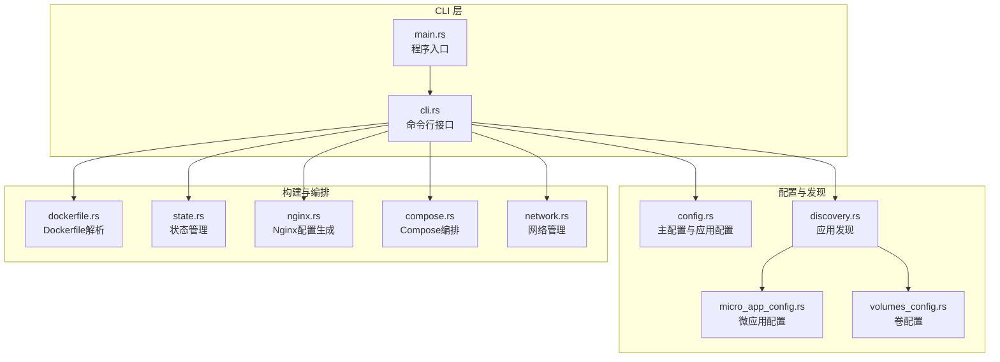
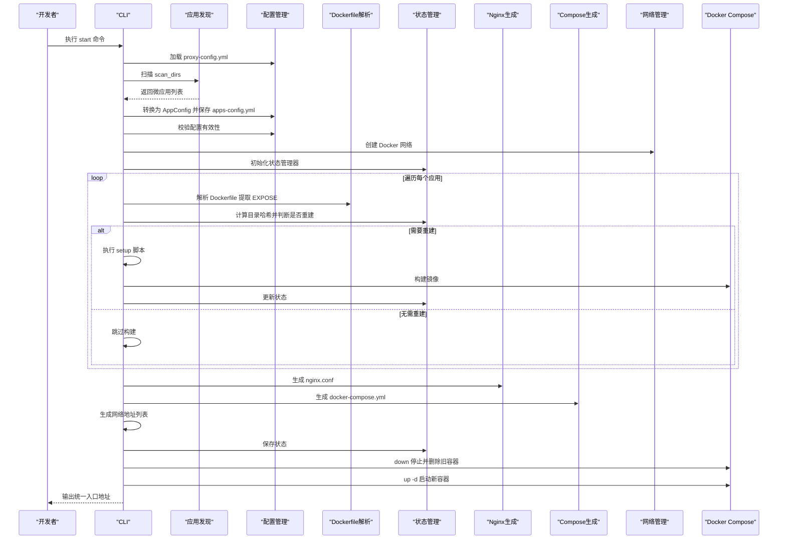
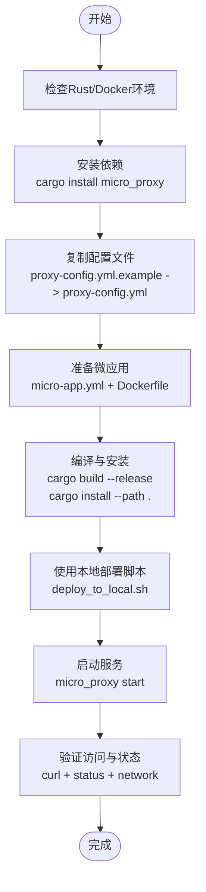
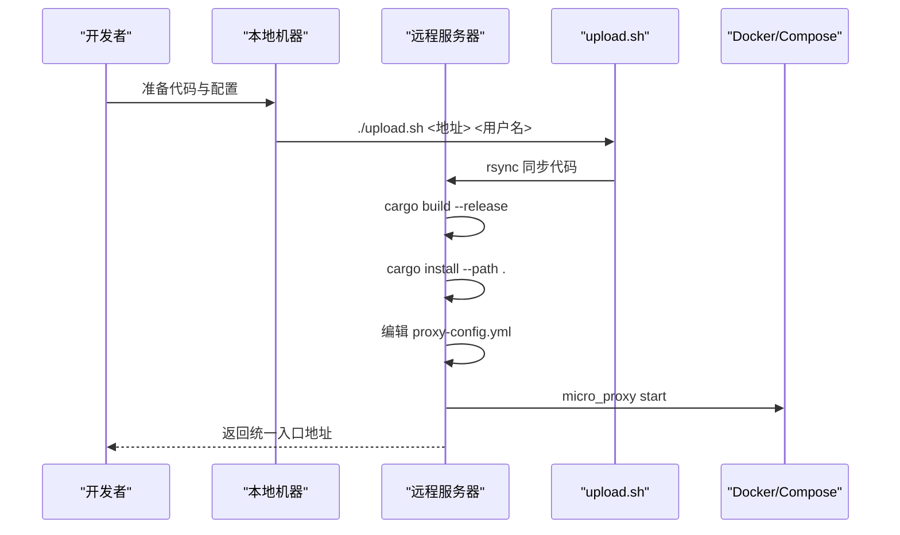
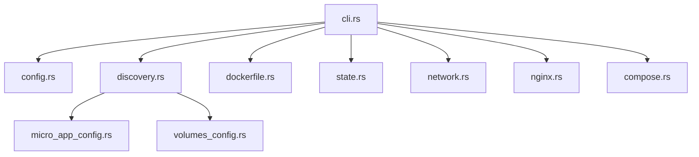

# 部署指南

<cite>
**本文档引用的文件**
- [README.md](file://README.md)
- [deploy_to_local.sh](file://deploy_to_local.sh)
- [upload.sh](file://upload.sh)
- [Cargo.toml](file://Cargo.toml)
- [src/main.rs](file://src/main.rs)
- [src/cli.rs](file://src/cli.rs)
- [src/config.rs](file://src/config.rs)
- [src/discovery.rs](file://src/discovery.rs)
- [src/dockerfile.rs](file://src/dockerfile.rs)
- [src/network.rs](file://src/network.rs)
- [src/nginx.rs](file://src/nginx.rs)
- [src/compose.rs](file://src/compose.rs)
- [src/state.rs](file://src/state.rs)
- [src/micro_app_config.rs](file://src/micro_app_config.rs)
- [src/volumes_config.rs](file://src/volumes_config.rs)
- [proxy-config.yml.example](file://proxy-config.yml.example)
</cite>

## 目录
1. [简介](#简介)
2. [项目结构](#项目结构)
3. [核心组件](#核心组件)
4. [架构总览](#架构总览)
5. [详细组件分析](#详细组件分析)
6. [依赖分析](#依赖分析)
7. [性能考虑](#性能考虑)
8. [故障排查指南](#故障排查指南)
9. [结论](#结论)
10. [附录](#附录)

## 简介
本指南面向运维与开发人员，提供 micro_proxy 的完整部署说明，涵盖本地部署与远程部署两种方式，包括环境准备、依赖安装、权限配置、编译安装、验证流程、部署脚本使用方法、参数说明、部署后验证与常见问题解决，以及生产环境最佳实践与安全建议。

## 项目结构
micro_proxy 是一个基于 Rust 的微应用管理工具，支持自动发现微应用、Docker 镜像构建、容器生命周期管理、Nginx 反向代理配置与 docker-compose 编排。项目采用模块化设计，核心模块包括 CLI、配置管理、应用发现、Dockerfile 解析、网络管理、Nginx 配置生成、Compose 编排、状态管理与卷配置等。

**图表来源**
- [src/main.rs:1-25](file://src/main.rs#L1-L25)
- [src/cli.rs:1-669](file://src/cli.rs#L1-L669)
- [src/config.rs:1-842](file://src/config.rs#L1-L842)
- [src/discovery.rs:1-721](file://src/discovery.rs#L1-L721)
- [src/dockerfile.rs:1-183](file://src/dockerfile.rs#L1-L183)
- [src/state.rs:1-311](file://src/state.rs#L1-L311)
- [src/nginx.rs:1-1101](file://src/nginx.rs#L1-L1101)
- [src/compose.rs:1-905](file://src/compose.rs#L1-L905)
- [src/network.rs:1-397](file://src/network.rs#L1-L397)
- [src/micro_app_config.rs:1-235](file://src/micro_app_config.rs#L1-L235)
- [src/volumes_config.rs:1-426](file://src/volumes_config.rs#L1-L426)

**章节来源**
- [README.md:421-441](file://README.md#L421-L441)

## 核心组件
- CLI 与命令体系：提供 start、stop、clean、status、network 等命令，支持配置文件路径、详细日志、强制重建等参数。
- 配置管理：主配置 proxy-config.yml 与动态生成的 apps-config.yml；微应用配置 micro-app.yml 与卷配置 micro-app.volumes.yml。
- 应用发现：扫描 scan_dirs 目录，自动发现包含 micro-app.yml 与 Dockerfile 的微应用，生成唯一名称与配置。
- Dockerfile 解析：提取 EXPOSE 端口，辅助容器端口校验与健康检查。
- 网络管理：创建/删除 Docker 网络，生成网络地址列表，支持内部服务与跨服务通信。
- Nginx 配置：根据应用类型与路由生成反向代理配置，支持 HTTP/HTTPS、ACME 验证、Gzip、健康检查等。
- Compose 编排：生成 docker-compose.yml，包含网络共享、端口映射、卷挂载、健康检查、依赖关系等。
- 状态管理：基于目录哈希判断是否需要重新构建，记录镜像存在状态与最后构建时间。
- 卷配置：支持源路径、目标路径、权限 UID/GID、递归设置与运行用户，生成权限初始化脚本。

**章节来源**
- [src/cli.rs:21-116](file://src/cli.rs#L21-L116)
- [src/config.rs:125-367](file://src/config.rs#L125-L367)
- [src/discovery.rs:224-352](file://src/discovery.rs#L224-L352)
- [src/dockerfile.rs:16-67](file://src/dockerfile.rs#L16-L67)
- [src/network.rs:8-86](file://src/network.rs#L8-L86)
- [src/nginx.rs:10-92](file://src/nginx.rs#L10-L92)
- [src/compose.rs:18-119](file://src/compose.rs#L18-L119)
- [src/state.rs:30-186](file://src/state.rs#L30-L186)
- [src/volumes_config.rs:43-205](file://src/volumes_config.rs#L43-L205)

## 架构总览
micro_proxy 的部署流程围绕“发现 → 验证 → 构建 → 编排 → 启动”的闭环展开。CLI 作为入口，协调各模块完成配置加载、应用发现、Dockerfile 解析、状态判断、Nginx 与 Compose 配置生成、网络创建与容器启动。

**图表来源**
- [src/cli.rs:296-463](file://src/cli.rs#L296-L463)
- [src/discovery.rs:235-352](file://src/discovery.rs#L235-L352)
- [src/dockerfile.rs:23-36](file://src/dockerfile.rs#L23-L36)
- [src/state.rs:195-233](file://src/state.rs#L195-L233)
- [src/nginx.rs:26-92](file://src/nginx.rs#L26-L92)
- [src/compose.rs:31-119](file://src/compose.rs#L31-L119)
- [src/network.rs:15-47](file://src/network.rs#L15-L47)

**章节来源**
- [src/cli.rs:296-463](file://src/cli.rs#L296-L463)

## 详细组件分析

### 本地部署流程
- 环境准备
  - 安装 Rust 工具链与 Cargo（用于编译与安装）。
  - 安装 Docker 与 docker-compose（或新版 docker compose）。
  - 准备系统目录与权限：web_root、cert_dir（如需 HTTPS）。
- 依赖安装
  - 通过 crates.io 安装：cargo install micro_proxy。
  - 或从源码构建：cargo build --release；cargo install --path .。
- 配置准备
  - 复制示例配置：cp proxy-config.yml.example proxy-config.yml。
  - 配置 scan_dirs、nginx_host_port、web_root、cert_dir、domain 等。
  - 在每个微应用目录准备 micro-app.yml 与 Dockerfile。
- 编译与安装
  - 使用 deploy_to_local.sh 脚本一键编译并安装到用户 bin 目录，自动检查 PATH 并验证版本。
- 启动与验证
  - micro_proxy start 启动所有微应用。
  - 访问 http://localhost:{nginx_host_port} 验证统一入口。
  - 使用 micro_proxy status、network、stop、clean 等命令进行状态与网络验证。

**图表来源**
- [README.md:48-112](file://README.md#L48-L112)
- [deploy_to_local.sh:1-119](file://deploy_to_local.sh#L1-L119)
- [src/cli.rs:78-116](file://src/cli.rs#L78-L116)

**章节来源**
- [README.md:48-112](file://README.md#L48-L112)
- [deploy_to_local.sh:1-119](file://deploy_to_local.sh#L1-L119)

### 远程部署流程
- 环境准备
  - 在目标服务器安装 Docker 与 docker-compose（或新版 docker compose）。
  - 准备 web_root、cert_dir（如需 HTTPS）目录并赋予写权限。
- 代码同步
  - 使用 upload.sh 将本地代码同步到远程服务器指定目录（默认 ~/proxy-config），自动排除 .git、target、日志、node_modules、Cargo.lock、proxy-config.yml、docker-compose.yml 等。
- 构建与安装
  - 在远程服务器执行 cargo build --release 与 cargo install --path . 安装二进制。
  - 或使用 deploy_to_local.sh（需确保 PATH 与用户 bin 目录）。
- 配置与启动
  - 在远程服务器复制并编辑 proxy-config.yml，准备微应用配置。
  - micro_proxy start 启动，访问统一入口验证。

**图表来源**
- [upload.sh:1-51](file://upload.sh#L1-L51)
- [src/cli.rs:78-116](file://src/cli.rs#L78-L116)

**章节来源**
- [upload.sh:1-51](file://upload.sh#L1-L51)

### 部署脚本使用说明
- deploy_to_local.sh
  - 功能：编译 release 版本并安装到用户 bin 目录，自动检查 PATH 并验证版本。
  - 关键行为：检查 Cargo.toml、Rust 环境、创建用户 bin 目录、复制二进制、设置执行权限、验证部署与 PATH。
  - 适用场景：本地一次性安装与验证。
- upload.sh
  - 功能：使用 rsync 将项目文件同步到远程服务器 ~/proxy-config 目录，自动排除大量文件与目录。
  - 参数：./upload.sh <地址> <用户名>。
  - 适用场景：远程部署前的代码同步。

**章节来源**
- [deploy_to_local.sh:1-119](file://deploy_to_local.sh#L1-L119)
- [upload.sh:1-51](file://upload.sh#L1-L51)

### 配置文件详解
- 主配置 proxy-config.yml
  - scan_dirs：扫描目录列表，用于自动发现微应用。
  - apps_config_path：动态生成的 apps 配置存储路径。
  - nginx_config_path、compose_config_path：Nginx 与 Compose 配置输出路径。
  - state_file_path：状态文件路径。
  - network_list_path：网络地址列表输出路径。
  - network_name：Docker 网络名称。
  - nginx_host_port：Nginx 监听的主机端口。
  - web_root、cert_dir、domain：HTTPS 与 ACME 验证相关配置。
- 微应用配置 micro-app.yml
  - routes：访问路径（static/api 类型必需）。
  - container_name：容器名称（全局唯一）。
  - container_port：容器内部端口。
  - app_type：应用类型（static、api、internal）。
  - description、nginx_extra_config：描述与额外 Nginx 配置。
  - docker_volumes：Docker 卷映射（来自 micro-app.volumes.yml）。
- 卷配置 micro-app.volumes.yml
  - volumes：源路径、目标路径与权限（uid/gid/recursive）。
  - run_as_user：容器运行用户（格式："uid:gid" 或 "username"）。

**章节来源**
- [proxy-config.yml.example:1-53](file://proxy-config.yml.example#L1-L53)
- [src/config.rs:23-68](file://src/config.rs#L23-L68)
- [src/micro_app_config.rs:10-33](file://src/micro_app_config.rs#L10-L33)
- [src/volumes_config.rs:43-53](file://src/volumes_config.rs#L43-L53)

### 命令与参数说明
- micro_proxy start
  - 选项：-c/--config、-v/--verbose、--force-rebuild。
  - 行为：扫描应用、生成配置、创建网络、状态判断、构建镜像、生成 Nginx 与 Compose、生成网络地址列表、启动容器。
- micro_proxy stop
  - 选项：-c/--config。
  - 行为：停止所有容器。
- micro_proxy clean
  - 选项：-c/--config、--force、--network。
  - 行为：停止并删除容器、删除镜像、执行 clean 脚本、删除状态文件与动态配置、可选删除 Docker 网络。
- micro_proxy status
  - 选项：-c/--config。
  - 行为：查看容器状态与镜像存在状态。
- micro_proxy network
  - 选项：-c/--config、-o/--output。
  - 行为：生成网络地址列表文件并打印到控制台。

**章节来源**
- [README.md:113-163](file://README.md#L113-L163)
- [src/cli.rs:41-69](file://src/cli.rs#L41-L69)

## 依赖分析
- 外部依赖
  - Docker 与 docker-compose：用于容器编排与网络管理。
  - Rust 生态：clap（命令行）、serde/serde_yaml（序列化）、tokio（异步）、regex（解析）、walkdir（目录遍历）、sha2（哈希）、fs_extra/pathdiff（文件系统与路径）、log/dumbo_log（日志）。
- 内部模块耦合
  - CLI 依赖配置、发现、Dockerfile、状态、网络、Nginx、Compose 模块。
  - 发现模块依赖微应用配置与卷配置。
  - Nginx 与 Compose 依赖配置与应用类型过滤。
  - 网络模块依赖 Docker 命令行工具。

**图表来源**
- [src/cli.rs:6-18](file://src/cli.rs#L6-L18)
- [src/discovery.rs:6-8](file://src/discovery.rs#L6-L8)
- [src/config.rs:6-9](file://src/config.rs#L6-L9)
- [src/micro_app_config.rs:6-8](file://src/micro_app_config.rs#L6-L8)
- [src/volumes_config.rs:6-8](file://src/volumes_config.rs#L6-L8)
- [src/dockerfile.rs:5-7](file://src/dockerfile.rs#L5-L7)
- [src/state.rs:5-11](file://src/state.rs#L5-L11)
- [src/network.rs:5-6](file://src/network.rs#L5-L6)
- [src/nginx.rs:7-8](file://src/nginx.rs#L7-L8)
- [src/compose.rs:6-9](file://src/compose.rs#L6-L9)

**章节来源**
- [Cargo.toml:13-52](file://Cargo.toml#L13-L52)

## 性能考虑
- 状态驱动的增量构建：通过目录哈希判断是否需要重建，避免不必要的镜像构建。
- Dockerfile EXPOSE 端口解析：减少容器端口配置错误带来的启动失败。
- Nginx 动态 DNS 解析：使用 Docker 内部 DNS，提升服务发现可靠性。
- Compose 健康检查：为静态与 API 应用添加健康检查，缩短故障恢复时间。
- Gzip 压缩与缓存：优化静态资源访问性能。

[本节为通用指导，无需特定文件引用]

## 故障排查指南
- 端口占用
  - 检查宿主机端口占用：sudo lsof -i :80、sudo lsof -i :8080。
  - 修改 nginx_host_port 避免冲突。
- 权限与目录
  - 确保 web_root、cert_dir 目录存在且具备写权限。
  - 检查 .env 文件路径与相对路径计算是否正确。
- Docker 网络
  - 使用 network 命令生成网络地址列表，核对容器间通信。
  - 如需清理网络，使用 clean --network。
- 证书与 HTTPS
  - 检查证书与密钥文件是否存在。
  - 使用 docker exec proxy-nginx nginx -t 验证 Nginx 配置。
  - 查看 Nginx 错误日志定位问题。
- 容器状态
  - 使用 micro_proxy status 查看容器状态与镜像存在状态。
  - 使用 docker logs <container-name>、docker logs proxy-nginx 查看日志。
- 配置问题
  - 检查 micro-app.yml 与 Dockerfile 是否存在。
  - 校验 container_name 是否全局唯一。
  - 验证 routes、app_type、container_port 等字段。

**章节来源**
- [README.md:328-420](file://README.md#L328-L420)

## 结论
micro_proxy 提供从应用发现、构建、编排到统一入口的完整能力。本地部署适合开发与测试，远程部署适合生产环境。通过合理的配置、严格的权限与安全实践，可稳定支撑多微应用的统一管理与发布。

[本节为总结性内容，无需特定文件引用]

## 附录

### 系统要求与环境检查清单
- 操作系统：Linux/macOS/Windows（WSL2）均可。
- Rust 工具链：cargo、rustc。
- Docker：docker 与 docker-compose（或新版 docker compose）。
- 目录权限：web_root、cert_dir 可写。
- 端口：nginx_host_port 未被占用。

**章节来源**
- [README.md:48-112](file://README.md#L48-L112)

### 生产环境最佳实践与安全考虑
- 网络隔离：使用独立 Docker 网络，限制容器间可见性。
- 证书管理：使用 Let's Encrypt 自动化证书申请与续期，确保证书与密钥文件权限最小化。
- 权限最小化：避免使用 root 权限，run_as_user 指定非特权用户。
- 健康检查：为静态与 API 应用启用健康检查，提升可用性。
- 配置审计：定期审查 proxy-config.yml 与 micro-app.yml，确保 routes、端口、卷映射合理。
- 日志与监控：开启详细日志，结合容器日志与 Nginx 访问日志进行问题定位。

**章节来源**
- [src/network.rs:8-86](file://src/network.rs#L8-L86)
- [src/nginx.rs:94-131](file://src/nginx.rs#L94-L131)
- [src/compose.rs:121-158](file://src/compose.rs#L121-L158)
- [src/volumes_config.rs:129-143](file://src/volumes_config.rs#L129-L143)